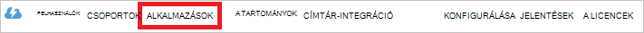

<properties
   pageTitle="Hitelesítő adatok tó tárolóval, az Active Directory segítségével |} Microsoft Azure"
   description="Megtudhatja, hogy miként hitelesítő adatok tó tárolóval, az Active Directory használata"
   services="data-lake-store"
   documentationCenter=""
   authors="nitinme"
   manager="jhubbard"
   editor="cgronlun"/>

<tags
   ms.service="data-lake-store"
   ms.devlang="na"
   ms.topic="article"
   ms.tgt_pltfrm="na"
   ms.workload="big-data"
   ms.date="10/17/2016"
   ms.author="nitinme"/>

# Azure Active Directory használata adatok tó áruházzal szolgáltatás szolgáltatás teljesítményszámláló hitelesítés

> [AZURE.SELECTOR]
- [Szolgáltatás hitelesítés](data-lake-store-authenticate-using-active-directory.md)
- [Végfelhasználói hitelesítés](data-lake-store-end-user-authenticate-using-active-directory.md)

Azure tó adattár Azure Active Directory authentication használja. Létrehozása az Azure tó adattár vagy Azure adatok tó Analytics használható kérelmet, előtt döntse el, először hogyan szeretné, hogy az alkalmazás az Azure Active Directory (Azure Active Directory) hitelesítést végezni. A két fő elérhető beállítások a következők:

* Végfelhasználói hitelesítés, és 
* Szolgáltatás hitelesítést. 

Az alkalmazás éppen egy OAuth 2.0-s token, minden kérelme Azure tó adattár vagy Azure adatok tó Analytics kap csatolt ellátni vonhat mindkét beállításokkal.

Ez a cikk megbeszélések arról, hogy miként létrehozása az Azure Active Directory webalkalmazás a szolgáltatás hitelesítést. Azure AD-alkalmazás konfigurációja végfelhasználói hitelesítéshez tanulmányozza [tó áruházzal végfelhasználói hitelesítés használatával az Azure Active Directory](data-lake-store-end-user-authenticate-using-active-directory.md).

## Előfeltételek

* Egy Azure-előfizetést. Lásd: [Ismerkedés az Azure ingyenes próbaverziót](https://azure.microsoft.com/pricing/free-trial/).
* Az előfizetés azonosítójával. Az Azure portálról meghallgathatja. Ha például érhető el a tó adattár fiók lap a.

    

* Azure Active Directory tartománynevét. Az elemekre az egérrel az Azure portál jobb felső sarkában meghallgathatja. Az alábbi a képernyőképet a tartománynév **contoso.microsoft.com**, és a globálisan egyedi azonosítója zárójelek a bérlői azonosítóját. 

    

## Szolgáltatás hitelesítés

Az ajánlott megközelítés, ha azt szeretné, hogy az alkalmazás automatikusan hitelesítést végezni az Azure Active Directory, a saját hitelesítő adatok megadására a végfelhasználó nélkül. Az alkalmazás tudják, és hitelesítse magát az addig, amíg a hitelesítő adatok érvényesek, amely testre szabható évek sorrendben kell.

### Mit kell ezt a módszert használja?

* Azure Active Directory-tartomány nevét. Ez már szerepel a előfeltétel olvashatók.

* Azure Active Directory **webalkalmazást**.

* Ügyfél-azonosító az Azure Active Directory webes alkalmazáshoz.

* Ügyfél titkos az Azure Active Directory webes alkalmazáshoz.

* Az Azure Active Directory webalkalmazáshoz jogkivonat végpontot.

* Engedélyezze a hozzáférést az Azure Active Directory-webalkalmazást a a az adatok tó tároló mappa vagy a használni kívánt adatok tó Analytics-fiókot.

Hozzon létre egy Azure AD-webalkalmazást, és konfigurálja úgy a fent felsorolt követelményeket útmutatásért lásd: az [Active Directory-alkalmazás létrehozása](#create-an-active-directory-application) az alábbi szakasz.

>[AZURE.NOTE] Alapértelmezés szerint az Azure Active Directory-alkalmazás használatára van beállítva az ügyfél titkos, amely az Azure Active Directory alkalmazásból meghallgathatja. Jó helyen jár Ha azt szeretné, hogy egy tanúsítványt használja helyette az Azure Active Directory alkalmazást, kell létrehoznia Azure a PowerShell használata az Azure Active Directory webalkalmazás [létrehozása egyszerű tanúsítvány szolgáltatás](../resource-group-authenticate-service-principal.md#create-service-principal-with-certificate)leírtak.

## Az Active Directory-alkalmazás létrehozása

Ebben a részben azt tudnivalókat létrehozása és konfigurálása az Azure Active Directory webalkalmazás a szolgáltatás hitelesítést Azure adatok tó áruházzal Azure Active Directory használatával. 

### Lépés: 1: Az Azure Active Directory-alkalmazás létrehozása

>[AZURE.NOTE] Az alábbi lépéseket az Azure-portálon használja. Az Azure Active Directory-alkalmazások [Azure PowerShell](../resource-group-authenticate-service-principal.md) alrendszerrel vagy [Azure CLI](../resource-group-authenticate-service-principal-cli.md)is létrehozhat.

1. Jelentkezzen be az Azure-fiókjába a [Klasszikus portálon](https://manage.windowsazure.com/)keresztül.

2. A bal oldali ablaktáblában válassza ki **Az Active Directory** .

     
     
3. Jelölje ki az Active Directory hozhat létre az új alkalmazás használni kívánt. Ha egynél több Active Directory, általában szeretne létrehozni az alkalmazás a címtár-előfizetése helye. Az előfizetés az előfizetés ugyanabban a mappában alkalmazások csak biztosíthat erőforráshoz való hozzáférés.  

     
    
    
3. Az alkalmazások címtárában megtekintéséhez kattintson a **alkalmazások**elemre.

     

4. Ha még nem létrehozott alkalmazás könyvtár előtt meg kell jelennie valami az alábbi képhez hasonló. **Alkalmazás hozzáadása** gombja

     

     Vagy az alsó ablaktáblában kattintson a **Hozzáadás** gombra.

     

6. Nevezze el az alkalmazást, és válassza ki a létrehozni kívánt alkalmazást. Ebben az oktatóprogramban egy **WEBES API WEB APPLICATION Programming és/vagy** hozzon létre, és kattintson a Tovább gombra.

     

7. Adja meg az alkalmazás tulajdonságait. **SIGN-ON URL-CÍMÉT**adja meg a URI fel egy olyan webhelyet, amely leírja az alkalmazás. A webhely megléte érvényesítése nem volt. Az **Alkalmazás azonosítója URI**adja meg a URI, amely azonosítja az alkalmazást.

     

    Kattintson a jelölőnégyzet be van jelölve a varázsló, és az alkalmazás létrehozása.

### Lépés: 2: Ügyfél-azonosító ügyfél titkos és jogkivonat végpont beszerzése

Programozás útján jelentkezik, amikor az alkalmazás azonosítója szükséges. Ha az alkalmazás a saját hitelesítő adatok területén fut, a hitelesítési kulcs is szüksége lesz.

1. Kattintson a **beállítás** lapon állítsa be a jelszót az alkalmazás.

     

2. Másolja az **ügyfél-azonosító**.
  
     

3. Ha az alkalmazás a saját hitelesítő adatok területén fog futni, görgessen le a **billentyűk** szakasz és mennyi ideig szeretné legyenek érvényesek a jelszavát.

     

4. Válassza a **Mentés** hozhat létre a termékkulcsot.

    

    A mentett kulcs jelenik meg, és másolhatja azt. Nem tudja beolvasni a kulcsot később így kell másolja a vágólapra gombra.

    

5. Jelölje ki a **Végpontok nézetben** a képernyő alján, majd az **OAuth 2.0-s jogkivonat végpont** mező, az érték beolvasása a token végpont beolvashatja az alább látható módon.  

    

### Lépés a 3: Hozzárendelése az Azure Active Directory alkalmazást a Azure tó adattár fiók fájl vagy mappa (csak a szolgáltatás hitelesítést)

1. Jelentkezzen az új [Azure portál](https://portal.azure.com) , és nyissa meg a korábban létrehozott az Azure Active Directory-alkalmazás társítani kívánt tó adattár Azure-fiókot.

1. Kattintson a tó adattár fiók lap **Adatok Explorer**.

    ![Létrehozás könyvtárak tó adattár fiókban] (./media/data-lake-store-authenticate-using-active-directory/adl.start.data.explorer.png "Az adatok tó fiók létrehozása könyvtárak")

2. Az **Adatok Explorer** lap kattintson a fájlra vagy mappára, amelynek vissza szeretné az Azure Active Directory-alkalmazás hozzáférést biztosít, és kattintson az **Access**. Konfigurálja a fájl elérését, a **Fájl előnézet** lap az **Access** kell kattintania.

    ![Beállítása adatok tó fájlrendszerben hozzáférés-vezérlési listák] (./media/data-lake-store-authenticate-using-active-directory/adl.acl.1.png "Beállítása adatok tó fájlrendszerben hozzáférés-vezérlési listák")

3. Az **Access** lap normál access és a legfelső szintű már hozzá van rendelve egyéni hozzáférési sorolja fel. Kattintson a **Hozzáadás** ikonra, egyéni szintű hozzáférés-vezérlési listák hozzáadása.

    ![Normál és egyéni access lista] (./media/data-lake-store-authenticate-using-active-directory/adl.acl.2.png "Normál és egyéni access lista")

4. Kattintson a **Hozzáadás** ikonra kattintva nyissa meg az **Egyéni Access hozzáadása** lap. Ez a lap **felhasználó vagy csoport kiválasztása**gombra, és a **felhasználó vagy csoport kiválasztása** a lap, keresse meg az Azure Active Directory korábban létrehozott biztonsági csoport. Ha sok csoportok közötti kereséshez, a szövegdoboz tetején szűrése használatával a csoport nevére. Kattintson a hozzáadni, és kattintson a **Jelölje ki**a kívánt csoportot.

    ![A csoport hozzáadása] (./media/data-lake-store-authenticate-using-active-directory/adl.acl.3.png "A csoport hozzáadása")

5. Kattintson az **Engedélyek kiválasztása**gombra, jelölje ki az engedélyeket, és szeretné vezérlés alapértelmezés szerint az engedélyeket, hogy elérhetők a vezérlés, vagy mindkettőt. Kattintson az **OK gombra**.

    ![Csoport engedélyek hozzárendelése] (./media/data-lake-store-authenticate-using-active-directory/adl.acl.4.png "Csoport engedélyek hozzárendelése")

    Tó adattár és alapértelmezett és a hozzáférés hozzáférés-vezérlési listák engedélyekkel kapcsolatos további tudnivalókért lásd: a [Hozzáférés-vezérlés tó adattár](data-lake-store-access-control.md).

6. Az **Egyéni Access hozzáadása** lap kattintson **az OK gombra**. Az újonnan hozzáadott csoportban, a hozzá tartozó engedélyek, a program az **Access** a lap szerepel.

    ![Csoport engedélyek hozzárendelése] (./media/data-lake-store-authenticate-using-active-directory/adl.acl.5.png "Csoport engedélyek hozzárendelése") 

## Következő lépések

Ez a cikk létrehozása az Azure Active Directory-webalkalmazást, és a .NET SDK, Java SDK stb használatával Szerző ügyfélalkalmazásokban szükséges információk összegyűjtése. Most is folytassa az alábbi cikkekben, amely a beszélgetés első hitelesítő adatok tó áruházzal, és kattintson a tár egyéb műveletek hajthatók végre az Azure Active Directory webes alkalmazás használatáról.

- [Első lépések az Azure tó adattár .NET SDK használatával](data-lake-store-get-started-net-sdk.md)
- [Első lépések az Azure tó adattár Java SDK használatával](data-lake-store-get-started-java-sdk.md)
