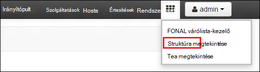
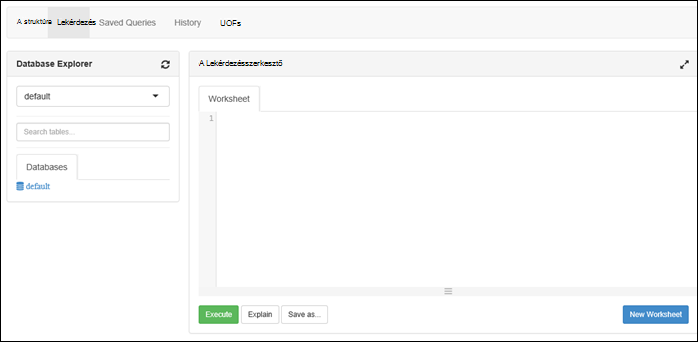

<properties
   pageTitle="HDInsight fürt létrehozása az Azure tó adattár a portálon |} Azure"
   description="Azure portál hozhatja létre, és tó adattár Azure HDInsight fürt használata"
   services="data-lake-store,hdinsight" 
   documentationCenter=""
   authors="nitinme"
   manager="jhubbard"
   editor="cgronlun"/>

<tags
   ms.service="data-lake-store"
   ms.devlang="na"
   ms.topic="article"
   ms.tgt_pltfrm="na"
   ms.workload="big-data"
   ms.date="10/21/2016"
   ms.author="nitinme"/>

# Hozzon létre egy HDInsight fürthöz Azure portálon tó adattárhoz

> [AZURE.SELECTOR]
- [Portál használatával](data-lake-store-hdinsight-hadoop-use-portal.md)
- [A PowerShell használatával](data-lake-store-hdinsight-hadoop-use-powershell.md)
- [Erőforrás-kezelő használatával](data-lake-store-hdinsight-hadoop-use-resource-manager-template.md)

Megtudhatja, hogyan hozzon létre egy HDInsight fürthöz (Hadoop, HBase, külső vagy vihar) Azure tó adattár hozzáféréssel rendelkező Azure Portal segítségével. Ebben a kiadásban néhány fontos dolgot:

* **A külső fürt (Linux) és a Hadoop fürt (Windows és Linux)**, az adatok tó áruházból csak akkor használható, egy további tárterület-fiók. Az ilyen fürt alapértelmezett tároló fiókja továbbra is Azure tároló BLOB (WASB).

* **A vihar fürt (Windows és Linux)**, az adatok tó áruházból adatok írásához a egy vihar topológia használható. Tó adattár is használhatják adattárolásra hivatkozást, ezután tudja olvasni a vihar topológiában. További tudnivalókért lásd: [Tó adattár használata vihar topológiában](#use-data-lake-store-in-a-storm-topology).

* **A HBase fürt (Windows és Linux)**, az adatok tó áruházból egy alapértelmezett tárhely, valamint a további tárterület is alkalmazható. További tudnivalókért lásd: a [Használati adatok tó Store-bA HBase fürt](#use-data-lake-store-with-hbase-clusters).

> [AZURE.NOTE] Néhány fontos tudnivaló jegyezze fel. 
> 
> * HDInsight fürt létrehozásának tó adattár hozzáféréssel rendelkező csak 3,2 és 3.4 (a fürt Hadoop HBase és vihar Windows, valamint a Linux) HDInsight verzióiban érhető el. A külső fürt Linux ezt a beállítást megtalálható csak a HDInsight 3.4 fürt.
>
> * Fent említett tó adattár érhető el (Hadoop, külső, vihar) fürtre másfajta további tárterületet, valamint alapértelmezett tárterület néhány fürtre típusa (HBase). Adatok tó tárolót használó további tárterületet fiókként nincs hatással és az azt jelenti, hogy írható/olvasható a tárolóhoz eltávolítása a működésére. Abban az esetben, ahol tó adattár további tárterületet szolgál fürt kapcsolatos (például a naplókat, stb.) írja a fájlt, az alapértelmezett tároló (Azure BLOB), miközben feldolgozása, amelyet az adatok tárolható egy tó adattár fiókot.

## Előfeltételek

Ebben az oktatóanyagban megkezdése előtt a következőket kell rendelkeznie:

- **Az Azure-előfizetés**. Lásd: [Ismerkedés az Azure ingyenes próbaverziót](https://azure.microsoft.com/pricing/free-trial/).

- **Azure tó adattár fiókot**. Kövesse az utasításokat az [első lépések az Azure tó adattár az Azure-portálon](data-lake-store-get-started-portal.md). 

- **Töltse fel mintaadatokat is tartalmazó tó adattár Azure-fiókjába**. Miután létrehozta a fiókot, a következő feladatokat tölthet fel mintaadatokat tartalmaz. A feladatok futtathat egy HDInsight fürthöz, melyhez hozzáféréssel a adatok tó tárolóban lévő adatok az oktatóprogram kell ezeket az adatokat.

    * [Az adatok tó tárolása a mappa létrehozása](data-lake-store-get-started-portal.md#createfolder).
    * [Az adatok tó áruház fájl feltöltése](data-lake-store-get-started-portal.md#uploaddata). Ha tölthet fel mintaadatokat is tartalmazó keres, a az [Azure adatok tó mely számjegy tárházba](https://github.com/Azure/usql/tree/master/Examples/Samples/Data/AmbulanceData)kattint a **Mentővel adatok** mappát.

- **Azure Active Directory-szolgáltatás egyszerű**. Az oktatóprogram lépéseit a a szolgáltatás rendszerbiztonsági tag létrehozása az Azure AD útmutatást. Azonban engedélyezni szeretné, hogy hozzon létre egy egyszerű Azure Active Directory rendszergazdának kell lennie. Ha Ön az Azure Active Directory-rendszergazda, ugorja át a előfeltétel, és folytassa az oktatóprogram.
    
    **Ha Ön nem egy Azure AD-rendszergazda**, nem tudja végrehajtani a hozzon létre egy egyszerű lépéseket. Ebben az esetben az Azure Active Directory-rendszergazda először létre kell hoznia egy egyszerű egy HDInsight fürthöz tó áruházzal létrehozása előtt. Is a szolgáltatás egyszerű segítségével kell létrehozni egy tanúsítványt, a [fő tanúsítvány szolgáltatás hozzon létre](../resource-group-authenticate-service-principal.md#create-service-principal-with-certificate)leírt módon.

## Hajtsa végre, gyorsabb megtanulásában a videók?

Az alábbi videókból megtudhatja, hogyan hozhatók létre az Access-szel csoportok HDInsight tó adattár.

* [Hozzon létre egy HDInsight fürthöz tó adattár hozzáféréssel rendelkező](https://mix.office.com/watch/l93xri2yhtp2)
* Miután a fürt beállította, [Access-adatok a struktúra, és malac parancsfájlokkal tó adattárhoz](https://mix.office.com/watch/1n9g5w0fiqv1q)

## Hozzon létre egy HDInsight fürthöz Azure tó adattár hozzáféréssel rendelkező

Ebben a részben hozzon létre egy HDInsight Hadoop fürthöz, egy további tárterületet, de az adatok tó tárolót használó. Ebben a kiadásban a Hadoop fürt tó adattár csak akkor használható, egy további tárterületet, de a fürt. Az alapértelmezett tároló továbbra is a tárhely Azure BLOB (WASB). Igen azt először létrehoznia a tárhely és a tároló a fürt szükséges.

1. Jelentkezzen be az új [Azure-portálon](https://portal.azure.com).

2. Kövesse a lépéseket [a HDInsight létrehozása Hadoop fürt](../hdinsight/hdinsight-provision-clusters.md#create-using-the-preview-portal) egy HDInsight fürthöz kiépítési indításához.

3. Kattintson a **Választható beállítási** lap az **Adatforrás**. Az **Adatforrás** a lap adja meg a részleteket a tárhely fiókhoz, illetve a tárhely tároló, adja meg a **hely** **Kelet-amerikai 2**, és válassza a **Fürt AAD identitás**.

    ![Hozzáadás szolgáltatás fő HDInsight fürthöz] (./media/data-lake-store-hdinsight-hadoop-use-portal/hdi.adl.1.png "Hozzáadás szolgáltatás fő HDInsight fürthöz")

4. Kattintson a **Fürt AAD identitás** lap megadhatja, jelölje ki egy meglévő szolgáltatás egyszerű, vagy hozzon létre egy újat.

    * **Hozzon létre egy új szolgáltatás egyszerű**

        * A **Fürt AAD identitás** lap **Új a létrehozás**gombra, kattintson a **Szolgáltatás egyszerű**és **Hozzon létre egy egyszerű** lap közölje hozhat létre egy új szolgáltatás egyszerű értékeket. Termékcsomag részeként, amely a tanúsítványt és az Azure Active Directory-alkalmazások is készül. Kattintson a **létrehozása**gombra.

            ![Hozzáadás szolgáltatás fő HDInsight fürthöz] (./media/data-lake-store-hdinsight-hadoop-use-portal/hdi.adl.2.png "Hozzáadás szolgáltatás fő HDInsight fürthöz")

        * Kattintson a **Fürt AAD identitás** lap **ADLS hozzáférés kezelése**. Az ablaktábla megjeleníti a tó adattár fiókokat az előfizetéshez tartozó. A csak a fiók engedélyeit létrehozott is beállíthatja. Jelölje ki a fiókhoz szeretné társítani a HDInsight fürt, és kattintson a **Mentés engedélyek**OLVASÁSI/írási/végrehajtás engedélyeket.

            ![Hozzáadás szolgáltatás fő HDInsight fürthöz] (./media/data-lake-store-hdinsight-hadoop-use-portal/hdi.adl.3.png "Hozzáadás szolgáltatás fő HDInsight fürthöz")

        * Kattintson a **Fürt AAD identitás** lap **Töltse le a tanúsítvány** letöltése a fő létrehozott szolgáltatás társított tanúsítványt. Ez akkor hasznos, ha az azonos szolgáltatás egyszerű a jövőben használandó további HDInsight fürt létrehozásakor. Kattintson a **Kijelölés**gombra.

            ![Hozzáadás szolgáltatás fő HDInsight fürthöz] (./media/data-lake-store-hdinsight-hadoop-use-portal/hdi.adl.4.png "Hozzáadás szolgáltatás fő HDInsight fürthöz")

    * **Válasszon egy meglévő szolgáltatás egyszerű**

        * A **Fürt AAD identitás** lap jelölje be a **meglévő használata**, kattintson a **Szolgáltatás egyszerű**és a **Válassza ki a szolgáltatás egyszerű** lap keressen egy meglévő szolgáltatás egyszerű. Kattintson a szolgáltatás egyszerű nevét, és kattintson a **Jelölje ki**.

            ![Hozzáadás szolgáltatás fő HDInsight fürthöz] (./media/data-lake-store-hdinsight-hadoop-use-portal/hdi.adl.5.png "Hozzáadás szolgáltatás fő HDInsight fürthöz")

        * A **Fürt AAD identitás** lap a töltse fel a kiválasztott szolgáltatás egyszerű társított tanúsítványt (.pfx), és írja be a tanúsítvány jelszót.

5. Kattintson a **ADLS hozzáférés kezelése** elemre, és kattintson a **Jelölje ki a fájlokra vonatkozó engedélyeket**. 

    ![Hozzáadás szolgáltatás fő HDInsight fürthöz] (./media/data-lake-store-hdinsight-hadoop-use-portal/hdi.adl.5.existing.save.png "Hozzáadás szolgáltatás fő HDInsight fürthöz")

6. **Válassza a fájl engedélyek** lap a **fiók** legördülő jelölje ki a HDInsight fürthöz társított kívánt tó adattár-fiókot. A lap megjeleníti a fájlokat és mappákat a kijelölt adatok tó áruházból fiókjában található. 
 
    ![Adjon hozzáférést tó adattárhoz] (./media/data-lake-store-hdinsight-hadoop-use-portal/hdi-adl-permission-1.png "Adjon hozzáférést tó adattárhoz")

    Ezt követően határozza meg a engedélyeit is be kell adni a kijelölt fájlokat és mappákat. A mappák is adja meg, hogy az engedélyek alkalmazása azt a mappát, csak vagy a mappát, és az összes alárendelt elemeinek mappában. Teheti a kijelölés választhatja ki a megfelelő értéket **Alkalmazza a** legördülő listában. Jogosultsági eltávolításához kattintson a **Törlés** ikonra

    ![Adjon hozzáférést tó adattárhoz] (./media/data-lake-store-hdinsight-hadoop-use-portal/hdi-adl-permission-2.png "Adjon hozzáférést tó adattárhoz")

    Ismételje meg ezeket a lépéseket követve hozzájuk kapcsolódó fájlokat és mappákat, valamint egyéb tó adattár fiókokból. Ha befejezte az engedélyek hozzárendelése, kattintson a **Jelölje ki** a lap alján.

7. A **kijelölt engedélyek hozzárendelése** lap tekintse át a megadott engedélyektől, és válassza a **Futtatás** ezeket az engedélyeket szeretne adni.

    ![Adjon hozzáférést tó adattárhoz] (./media/data-lake-store-hdinsight-hadoop-use-portal/hdi-adl-permission-3.png "Adjon hozzáférést tó adattárhoz")

    Az Állapot oszlopban a haladás jeleníti meg. Miután sikeresen oszthatók ki az összes engedélyt, kattintson a **kész**gombra. 

6. **Fürt AAD identitás** és az **Adatforrás** rögzítéséhez kattintson a **Kijelölés** gombra, és hajtsa fürt létrehozott [létrehozása Hadoop fürt a HDInsight](../hdinsight/hdinsight-hadoop-create-linux-clusters-portal.md)leírtak.

7. Miután a fürt már kiépítve, ellenőrizheti, hogy a szolgáltatás egyszerű társítva a HDInsight fürt. Ehhez a fürt lap a **Fürt AAD identitás** tekintheti meg a társított szolgáltatás egyszerű gombra.

    ![Hozzáadás szolgáltatás fő HDInsight fürthöz] (./media/data-lake-store-hdinsight-hadoop-use-portal/hdi.adl.6.png "Hozzáadás szolgáltatás fő HDInsight fürthöz")

## A HDInsight fürt az Azure adatok tó áruház próba feladat futtatható

Után egy HDInsight fürthöz állította be, a fürt tesztelése, hogy a HDInsight fürt hozzáférhet az Azure tó adattár adatok futtathatja próba feladatokat. Ehhez azt fog néhány struktúra lekérdezések futtatása a adattár tó célba.

### Linux fürt

1. Nyissa meg a fürt lap a, amely csak kiépítéstől fürt, és kattintson az **Irányítópult**. Ekkor megnyílik a Ambari a Linux fürt. Amikor Ambari, a rendszer kéri, azt a webhelyet, hitelesítést végezni. Adja meg a rendszergazda (alapértelmezett felügyeleti,) nevét és jelszavát, a csoport létrehozásakor használt fiók.

    ![Indítsa el a fürt irányítópult] (./media/data-lake-store-hdinsight-hadoop-use-portal/hdiadlcluster1.png "Indítsa el a fürt irányítópult")

    Is megkeresheti közvetlenül Ambari méretéről https://CLUSTERNAME.azurehdinsight.net webböngészőben (ahol **CLUSTERNAME** annak a nevét a HDInsight fürt).

2. Nyissa meg a struktúra nézetben. A négyzetek készlete (mellett a **rendszergazda** hivatkozás és a a lap jobb oldali gombra), a lap menüből válassza a listában elérhető nézetek. Jelölje ki a **struktúra** nézetet.

    

3. Meg kell jelennie egy lapot, az alábbihoz hasonló:

    

4. A **Lekérdezésszerkesztő** csoport a lapon illessze be az alábbi HiveQL utasítás a munkalapra:

        CREATE EXTERNAL TABLE vehicles (str string) LOCATION 'adl://mydatalakestore.azuredatalakestore.net:443/mynewfolder'

5. A **végrehajtás** gombra kattintva indítsa el a lekérdezést **A Lekérdezésszerkesztő** a képernyő alján. **Lekérdezés folyamat eredményét** szakasz kell a **Lekérdezésszerkesztő** alatt jelennek meg, és a feladattal kapcsolatos információkat jeleníthet meg.

6. Amikor a lekérdezés befejeződik, a **Lekérdezés folyamat eredményét** szakaszban a művelet eredményét jeleníti meg. Az **eredmények** fülre kell tartalmaznia az alábbi adatokat:

7. Annak ellenőrzéséhez, hogy a táblázat volt az alábbi lekérdezés futtatásával.

        SHOW TABLES;

    Az **eredmények** lapon meg kell jelennie a következőket:

        hivesampletable
        vehicles

    **járműveket** a korábban létrehozott táblázatot. **hivesampletable** alapértelmezés szerint minden HDInsight fürt használható mintatáblázat.

8. Adatok beolvasása a **járműveket** táblából lekérdezés is futtathatók.

        SELECT * FROM vehicles LIMIT 5;

### A Windows fürthöz

1. Nyissa meg a fürt lap a, amely csak kiépítéstől fürt, és kattintson az **Irányítópult**.

    ![Indítsa el a fürt irányítópult] (./media/data-lake-store-hdinsight-hadoop-use-portal/hdiadlcluster1.png "Indítsa el a fürt irányítópult")

    Amikor a rendszer kéri, írja be a rendszergazdai hitelesítő adatok a fürt.

2. Ekkor megnyílik a Microsoft Azure hdinsight szolgáltatáshoz lekérdezés konzolhoz. Kattintson a **szerkesztő struktúra**.

    ![Nyissa meg a struktúra szerkesztő] (./media/data-lake-store-hdinsight-hadoop-use-portal/hdiadlcluster2.png "Nyissa meg a struktúra szerkesztő")

3. A struktúra szerkesztőben adja meg a következő lekérdezés, és kattintson a **Küldés**gombra.

        CREATE EXTERNAL TABLE vehicles (str string) LOCATION 'adl://mydatalakestore.azuredatalakestore.net:443/mynewfolder'

    A struktúra lekérdezés azt hozzon létre egy táblázatot az adatok tó tárolja az adatokat `adl://mydatalakestore.azuredatalakestore.net:443/mynewfolder`. Ezen a helyen egy adatfájl – minta kell feltöltött korábbi van.

    A **Feladat munkamenet** alsó táblázat **inicializálás**, hogy helyett **fut**, **kész**feladat állapotának. További információk megjelenítése a befejezett projekt **Részletek** is kattinthat.

    ![Tábla létrehozása] (./media/data-lake-store-hdinsight-hadoop-use-portal/hdiadlcluster3.png "Tábla létrehozása")

4. Annak ellenőrzéséhez, hogy a táblázat volt az alábbi lekérdezés futtatásával.

        SHOW TABLES;

    Kattintson a **Részletek** megfelelő ezt a lekérdezést, és a kimeneti meg kell jelennie a következőket:

        hivesampletable
        vehicles

    **járműveket** a korábban létrehozott táblázatot. **hivesampletable** alapértelmezés szerint minden HDInsight fürt használható mintatáblázat.

5. Adatok beolvasása a **járműveket** táblából lekérdezés is futtathatók.

        SELECT * FROM vehicles LIMIT 5;

## Az Access tó adattár Fájlrendszerhez parancsok használatával

A HDInsight fürtre adatok tó tároló használatára van beállítva, miután használhatja a Fájlrendszerhez rendszerhéj-parancsok az üzlet eléréséhez.

### Linux fürt

Ez a szakasz, SSH lesz a fürt be, és a Fájlrendszerhez parancsai futtathatók. A Windows nem nyújt a beépített SSH ügyfél. **Gitt**, amely letölthető a [http://www.chiark.greenend.org.uk/~sgtatham/putty/download.html](http://www.chiark.greenend.org.uk/~sgtatham/putty/download.html)használata ajánlott.

GITT használatával kapcsolatos további tudnivalókért lásd: [Használata SSH a Linux-alapú Hadoop meg a Windows HDInsight](../hdinsight/hdinsight-hadoop-linux-use-ssh-windows.md).

Miután létrejött, a következő paranccsal Fájlrendszerhez formázáshoz a fájlokat az adatok tó áruházban listáját.

    hdfs dfs -ls adl://<Data Lake Store account name>.azuredatalakestore.net:443/

Megjelenik a fájl korábbi feltöltött az adatok tó áruházból.

    15/09/17 21:41:15 INFO web.CaboWebHdfsFileSystem: Replacing original urlConnectionFactory with org.apache.hadoop.hdfs.web.URLConnectionFactory@21a728d6
    Found 1 items
    -rwxrwxrwx   0 NotSupportYet NotSupportYet     671388 2015-09-16 22:16 adl://mydatalakestore.azuredatalakestore.net:443/mynewfolder

Is használhatja a `hdfs dfs -put` parancs, amellyel néhány fájlokat feltölteni az adatok tó áruházból, és írja be `hdfs dfs -ls` ellenőrizze, hogy a fájlok feltöltése sikeresen.

### A Windows fürthöz

1. Jelentkezzen be az új [Azure-portálon](https://portal.azure.com).

2. Kattintson a **Tallózás gombra**, **HDInsight fürt**gombra, és válassza az Ön által létrehozott HDInsight fürt.

3. A fürt lap a **Távoli asztal**gombra, és a **Távoli asztali** lap a **Csatlakozás**gombra.

    ![Távoli HDI fürt be] (./media/data-lake-store-hdinsight-hadoop-use-portal/ADL.HDI.PS.Remote.Desktop.png "Azure erőforrás-ös csoport létrehozása")

    Amikor a rendszer kéri, adja meg a távoli asztali felhasználó megadott hitelesítő adatait.

4. Indítsa el a Windows PowerShell a távoli munkamenetet, és formázáshoz Fájlrendszerhez parancsaival az Azure adattár tó a fájlok listája.

        hdfs dfs -ls adl://<Data Lake Store account name>.azuredatalakestore.net:443/

    Megjelenik a fájl korábbi feltöltött az adatok tó áruházból.

        15/09/17 21:41:15 INFO web.CaboWebHdfsFileSystem: Replacing original urlConnectionFactory with org.apache.hadoop.hdfs.web.URLConnectionFactory@21a728d6
        Found 1 items
        -rwxrwxrwx   0 NotSupportYet NotSupportYet     671388 2015-09-16 22:16 adl://mydatalakestore.azuredatalakestore.net:443/mynewfolder

    Is használhatja a `hdfs dfs -put` parancs, amellyel néhány fájlokat feltölteni az adatok tó áruházból, és írja be `hdfs dfs -ls` ellenőrizze, hogy a fájlok feltöltése sikeresen.

## Tó adattár használata külső fürthöz

Ebben a részben használatba Jupyter jegyzetfüzet elérhető az fürt HDInsight külső adatokat olvas be egy tó adattár-fiókból egy HDInsight külső fürthöz helyett az alapértelmezett Azure Blob-tároló fiókkal társított feladat futtatása.

1. Másolja fölé példaadatokat nyugodtan az alapértelmezett tároló fiók (WASB) az Azure adatok tó áruházból számlára fürthöz társított külső fürthöz társított. Ehhez a [ADLCopy eszköz](http://aka.ms/downloadadlcopy) is használhatja. Töltse le és telepítse az eszközt a hivatkozást.

2. Nyisson meg egy parancssort, és keresse meg a könyvtár, ahol AdlCopy telepítve van, a szokásos `%HOMEPATH%\Documents\adlcopy`.

3. A következő parancsot a forrás tároló egy adott blob másolása tó adattár:

        AdlCopy /source https://<source_account>.blob.core.windows.net/<source_container>/<blob name> /dest swebhdfs://<dest_adls_account>.azuredatalakestore.net/<dest_folder>/ /sourcekey <storage_account_key_for_storage_container>

    Ebben az oktatóanyagban másolja a **HVAC.csv** adatfájl – minta a **/HdiSamples/HdiSamples/SensorSampleData/fűtés-és légtechnikai/** tó adattár Azure-fiókjába. A kódrészletet hasonlóan kell kinéznie:

        AdlCopy /Source https://mydatastore.blob.core.windows.net/mysparkcluster/HdiSamples/HdiSamples/SensorSampleData/hvac/HVAC.csv /dest swebhdfs://mydatalakestore.azuredatalakestore.net/hvac/ /sourcekey uJUfvD6cEvhfLoBae2yyQf8t9/BpbWZ4XoYj4kAS5Jf40pZaMNf0q6a8yqTxktwVgRED4vPHeh/50iS9atS5LQ==

    >[AZURE.WARNING] Győződjön meg arról, hogy a fájl elérési útja és nevét a nagy kezdőbetűvel vannak írva.

4. Az Azure előfizetés, amelyek alapján a tó adattár-fiókja van a hitelesítő adatok megadását kéri. A kibocsátás, az alábbihoz hasonló jelennek meg:

        Initializing Copy.
        Copy Started.
        100% data copied.
        Copy Completed. 1 file copied.

    Az adatokat tartalmazó fájl (**HVAC.csv**) a mappa **/hvac** tó adattár fiók a program másolja.

4. Az [Azure-portált](https://portal.azure.com/)a a startboard kattintson a csempére a külső fürt (Ha a startboard a kiemelt). Az **Összes böngészése**a fürthöz is navigálhat > **Fürt hdinsight szolgáltatásból lehetőségre**.   

2. A külső fürt lap, a **Tartalom**gombra, és a **Fürt irányítópult** lap az kattintson **Jupyter jegyzetfüzet**. Ha a rendszer kéri, írja be a fürt a rendszergazdai hitelesítő adataival.

    > [AZURE.NOTE] Előfordulhat, hogy is elér Jupyter jegyzetfüzet a fürt számára a böngészőben nyissa meg az alábbi URL-címet. __CLUSTERNAME__ cserélje ki a fürt neve:
    >
    > `https://CLUSTERNAME.azurehdinsight.net/jupyter`

2. Hozzon létre új jegyzetfüzetet. Kattintson az **Új**gombra, és kattintson a **PySpark**.

    ![Új Jupyter jegyzetfüzet létrehozása] (./media/data-lake-store-hdinsight-hadoop-use-portal/hdispark.note.jupyter.createnotebook.png "Új Jupyter jegyzetfüzet létrehozása")

3. Egy új jegyzetfüzetet létre, és a megnyitott **Untitled.pynb**nevű. 

4. Mivel a PySpark kernelt jegyzetfüzet hozta létre, nem kell bármely környezetek kifejezetten létrehozása. A külső és struktúra környezetek automatikusan létrejön, az első kód cellát futtatásakor. Ebben az esetben az szükséges fájltípusok importálásával elindíthatja. Ehhez illessze be a következő kódrészletet a cellában, és nyomja le a **SHIFT + ENTER BILLENTYŰKOMBINÁCIÓT**.

        from pyspark.sql.types import *
        
    Minden alkalommal fut, a feladat Jupyter, a webhely böngészőben ablak címének jelennek meg a jegyzetfüzet cím együtt **(elfoglalt)** állapotban. Egyszínű kör mellett a jobb felső sarokban lévő **PySpark** szöveget is látni fogja. A feladat befejezése után meg egy üres körre változik.

     ![A jegyzetfüzet Jupyter feladat állapota] (./media/data-lake-store-hdinsight-hadoop-use-portal/hdispark.jupyter.job.status.png "A jegyzetfüzet Jupyter feladat állapota")

4. Mintaadatok betöltése a tó adattár fiók másolt **HVAC.csv** fájllal ideiglenes táblába. Az adatok az alábbi URL-cím minta használatával tó adattár fiók érheti el.

        adl://<data_lake_store_name>.azuredatalakestore.net/<path_to_file>

    Egy üres cellába illessze be az alábbi példa, **MYDATALAKESTORE** cserélje le a tó adattár fiók nevére, és nyomja le a **SHIFT + ENTER BILLENTYŰKOMBINÁCIÓT**. A példa az adatok regisztrál az ideiglenes **Fűtés-és légtechnikai**nevű táblába.

        # Load the data
        hvacText = sc.textFile("adl://MYDATALAKESTORE.azuredatalakestore.net/hvac/HVAC.csv")
        
        # Create the schema
        hvacSchema = StructType([StructField("date", StringType(), False),StructField("time", StringType(), False),StructField("targettemp", IntegerType(), False),StructField("actualtemp", IntegerType(), False),StructField("buildingID", StringType(), False)])
        
        # Parse the data in hvacText
        hvac = hvacText.map(lambda s: s.split(",")).filter(lambda s: s[0] != "Date").map(lambda s:(str(s[0]), str(s[1]), int(s[2]), int(s[3]), str(s[6]) ))
        
        # Create a data frame
        hvacdf = sqlContext.createDataFrame(hvac,hvacSchema)
        
        # Register the data fram as a table to run queries against
        hvacdf.registerTempTable("hvac")

5. Mivel a PySpark kernel használ, most közvetlenül futtatható SQL-lekérdezés használatával létrehozott ideiglenes tábla **Fűtés-és légtechnikai** a `%%sql` mágikus. További információt a `%%sql` mágikus, valamint egyéb találhatók meg a PySpark kernel magics lásd: [a külső HDInsight fürt Jupyter jegyzetfüzetek mag](hdinsight-apache-spark-jupyter-notebook-kernels.md#why-should-i-use-the-new-kernels).
        
        %%sql
        SELECT buildingID, (targettemp - actualtemp) AS temp_diff, date FROM hvac WHERE date = \"6/1/13\"

5. Miután a feladat sikeresen befejeződött, a következő táblázatos kimenet alapértelmezés szerint megjelenik.

    ![Táblázat kimenetét lekérdezés eredménye] (./media/data-lake-store-hdinsight-hadoop-use-portal/tabular.output.png "Táblázat kimenetét lekérdezés eredménye")

    Megtekintheti a többi megjelenítésen, valamint az eredmények is. Ha például egy területdiagram ugyanazt a kimeneti lenne az alábbi.

    ![A lekérdezés eredményét területdiagram] (./media/data-lake-store-hdinsight-hadoop-use-portal/area.output.png "A lekérdezés eredményét területdiagram")

6. Miután végzett az alkalmazást futtató, tegye a következőt: leállítás engedje fel az erőforrások jegyzetfüzetet. Ehhez a jegyzetfüzetet a **fájl** menüben kattintson a **bezárása és leállíthatja**. Ez lesz Leállítás és a jegyzetfüzet bezárása.

## Tó adattár használata vihar topológiában

Az adatok tó áruházból adatok írásához a egy vihar topológia is használhatja. Ebben az esetben elérése, akkor olvassa el a [Használata Azure adatok tó áruházból Apache vihar HDInsight az](../hdinsight/hdinsight-storm-write-data-lake-store.md)utasításokat.

## Használati adatok tó Store-bA HBase fürt

HBase fürt, a tó adattár egy alapértelmezett tárhely, valamint a további tárterületet, de használhatja. Erre:

1.  Az **Adatforrás** lap **HBase adatok helyét**, kijelölése **Tó adattárhoz**
2.  Jelölje ki a használni kívánt tó adattár nevét, vagy hozzon létre egy újat.
3.  Végül adja meg a **HBase gyökérmappájából** az adatok tó tárolóban található. Ha a tó adattár fiókja nem rendelkezik a legfelső szintű mappa, hozzon létre egy újat.

    ![HBase tó áruházzal] (./media/data-lake-store-hdinsight-hadoop-use-portal/hbase-data-lake-store.png "Azure erőforrás-ös csoport létrehozása")

### Alapértelmezett tárolására tó adattár HBase fürt használatának szempontjai

* Egynél több HBase fürt ugyanazt a tó adattár fiókot is használhatja. A fürt (# a képernyőképet a fenti 4) az Ön által **HBase gyökérmappájából** azonban egyedinek kell lennie. Két különböző HBase fürt a legfelső szintű mappába, **nem kell** használni.
* Noha az alapértelmezett tárolására tó adattár fiókot használ, a HBase fürt naplófájlok továbbra is a az Azure tároló BLOB (WASB) fürthöz társított tárolja. A kiemelt fent, a képernyőfelvétel kék mezőjébe.

## Lásd még:

* [PowerShell: Hozzon létre egy HDInsight fürthöz adatok tó tároló használatára](data-lake-store-hdinsight-hadoop-use-powershell.md)

[makecert]: https://msdn.microsoft.com/library/windows/desktop/ff548309(v=vs.85).aspx
[pvk2pfx]: https://msdn.microsoft.com/library/windows/desktop/ff550672(v=vs.85).aspx
