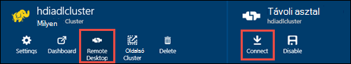

<properties
   pageTitle="HDInsight fürt létrehozása az Azure tó adattár erőforrás-kezelő sablonok használata |} Microsoft Azure"
   description="Erőforrás-kezelő Azure sablonok használatával hozhat létre és tó adattár Azure HDInsight fürt használata"
   services="data-lake-store,hdinsight"
   documentationCenter=""
   authors="nitinme"
   manager="jhubbard"
   editor="cgronlun"/>

<tags
   ms.service="data-lake-store"
   ms.devlang="na"
   ms.topic="article"
   ms.tgt_pltfrm="na"
   ms.workload="big-data"
   ms.date="10/21/2016"
   ms.author="nitinme"/>

# <a name="create-an-hdinsight-cluster-with-data-lake-store-using-azure-resource-manager-template"></a>Hozzon létre egy HDInsight fürthöz Azure erőforrás-kezelő sablonnal tó adattárhoz

> [AZURE.SELECTOR] - [Portálon](data-lake-store-hdinsight-hadoop-use-portal.md) - [PowerShell használatával](data-lake-store-hdinsight-hadoop-use-powershell.md) - [erőforrás-kezelő használatával](data-lake-store-hdinsight-hadoop-use-resource-manager-template.md)

Megtudhatja, hogyan egy HDInsight fürthöz konfigurálása Azure tó adattár hozzáféréssel rendelkező egy erőforrás-kezelő Azure-sablon segítségével. Ebben a kiadásban néhány fontos dolgot:

-   **A külső fürt (Linux), és a Hadoop/vihar fürt (Windows és Linux)**, az adatok tó áruházból csak akkor használható, egy további tárterület-fiók. Az ilyen fürt alapértelmezett tároló fiókja továbbra is Azure tároló BLOB (WASB).

-   Alapértelmezett tároló vagy további tárterület **-HBase fürt (Windows és Linux)**, az adatok tó áruházból használható.

> [AZURE.NOTE] Néhány fontos tudnivaló jegyezze fel.
>
> - HDInsight fürt létrehozásának tó adattár hozzáféréssel rendelkező csak 3,2 és 3.4 (a fürt Hadoop HBase és vihar Windows, valamint a Linux) HDInsight verzióiban érhető el. A külső fürt Linux ezt a beállítást megtalálható csak a HDInsight 3.4 fürt.
>
> - Fent említett tó adattár érhető el (Hadoop, külső, vihar) fürt másfajta további tárterületet, valamint alapértelmezett tárterület néhány fürt típusa (HBase). Adatok tó tárolót használó további tárterületet fiókként nincs hatással teljesítményét vagy az azt jelenti, hogy írható/olvasható a tárolóhoz eltávolítása a. Abban az esetben, ahol tó adattár további tárterületet szolgál fürt kapcsolatos (például a naplókat, stb.) írja a fájlt, az alapértelmezett tároló (Azure BLOB), miközben feldolgozása, amelyet az adatok tárolható egy tó adattár fiókot.
>

Ebben a cikkben további tárterületet, hogy kiépítése tó áruházzal Hadoop fürt.

## <a name="prerequisites"></a>Előfeltételek

Ebben az oktatóanyagban megkezdése előtt a következőket kell rendelkeznie:

-   **Az Azure-előfizetés**. Lásd: [Ismerkedés az Azure ingyenes próbaverziót](https://azure.microsoft.com/pricing/free-trial/).

-   **Azure PowerShell-s vagy újabb 1,0**. [Telepítse és állítsa be a Azure PowerShell](../powershell-install-configure.md)tájékozódhat.

- **Azure Active Directory-szolgáltatás egyszerű**. Az oktatóprogram lépéseit a a szolgáltatás rendszerbiztonsági tag létrehozása az Azure AD útmutatást. Azonban engedélyezni szeretné, hogy hozzon létre egy egyszerű Azure Active Directory rendszergazdának kell lennie. Ha Ön az Azure Active Directory-rendszergazda, ugorja át a előfeltétel, és folytassa az oktatóprogram.
    
    **Ha Ön nem egy Azure AD-rendszergazda**, nem tudja végrehajtani a hozzon létre egy egyszerű lépéseket. Ebben az esetben az Azure Active Directory-rendszergazda először létre kell hoznia egy egyszerű egy HDInsight fürthöz tó áruházzal létrehozása előtt. Is a szolgáltatás egyszerű segítségével kell létrehozni egy tanúsítványt, a [fő tanúsítvány szolgáltatás hozzon létre](../resource-group-authenticate-service-principal.md#create-service-principal-with-certificate)leírt módon.

## <a name="create-an-hdinsight-cluster-with-azure-data-lake-store"></a>Hozzon létre egy HDInsight fürthöz Azure tó adattárhoz

Az erőforrás-kezelő sablont, és a sablonnal előfeltételei a [Deploy a HDInsight Linux fürtre új adatok tó áruházzal](https://github.com/Azure/azure-quickstart-templates/tree/master/201-hdinsight-datalake-store-azure-storage)GitHub elérhetők. Kövesse a hozzon létre egy HDInsight fürtre tó adattár Azure, a további tárterületet, de ezt a hivatkozást a utasításokat.

Az imént említett lekérdezéstípusokról hivatkozásra a képernyőn megjelenő utasításokat a PowerShell szükség. Azokat a útmutató megkezdése előtt győződjön meg arról, hogy jelentkezzen be az Azure-fiók. Az asztalon nyisson meg egy új Azure PowerShell-ablakot, és írja be a következő kódrészletek. Amikor a rendszer kéri, jelentkezzen be a, ügyeljen az előfizetés admininistrators/tulajdonosa egyikeként jelentkezzen be:

```
# Log in to your Azure account
Login-AzureRmAccount

# List all the subscriptions associated to your account
Get-AzureRmSubscription

# Select a subscription
Set-AzureRmContext -SubscriptionId <subscription ID>
```

## <a name="upload-sample-data-to-the-azure-data-lake-store"></a>Töltse fel mintaadatokat az Azure tó adattárhoz

Az erőforrás-kezelő sablon létrehoz egy új tó adattár fiókot, és a HDInsight fürt társít. Az adatok tó Store most töltse fel mintaadatokat tartalmaz. A feladatok futtathat egy HDInsight fürthöz, melyhez hozzáféréssel a adatok tó tárolóban lévő adatok az oktatóprogram kell ezeket az adatokat. Adatok feltöltése, tanulmányozza [az adatok tó áruház fájl feltöltése](data-lake-store-get-started-portal.md#uploaddata). Ha tölthet fel mintaadatokat is tartalmazó keres, a az [Azure adatok tó mely számjegy tárházba](https://github.com/Azure/usql/tree/master/Examples/Samples/Data/AmbulanceData)kattint a **Mentővel adatok** mappát.

## <a name="set-relevant-acls-on-the-sample-data"></a>A mintaadatok megfelelő hozzáférés-vezérlési listák beállítása

Győződjön meg arról, a mintaadatok feltöltése érhető el a HDInsight fürtre, gondoskodnia kell arról, hogy az Azure AD-alkalmazás, amely a HDInsight fürtre és tó adattár között identitás hozzáfér a elérni kívánt fájl vagy mappa létrehozásához használt. Ehhez hajtsa végre az alábbi lépéseket.

1.  Keresse meg a társított HDInsight fürt és az adatok tó áruházból Azure AD-alkalmazás nevét. Keresse meg a nevét az egyik lehetőség, hogy nyissa meg a HDInsight fürt lap az erőforrás-kezelő-sablon segítségével létrehozott, kattintson a **Fürt AAD identitás** fülre, keresse meg a **Szolgáltatás egyszerű megjelenítendő név**értékét.

2.  Most adja meg az Azure Active Directory-alkalmazás hozzáférést a HDInsight fürt elérni kívánt fájl/mappa. A jobb oldali, a hozzáférés-vezérlési listák fájl/mappa adatok tó áruház című témakörben tájékozódhat [tó adattár biztonságossá tétele adatok](data-lake-store-secure-data.md#assign-users-or-security-group-as-acls-to-the-azure-data-lake-store-file-system).

## <a name="run-test-jobs-on-the-hdinsight-cluster-to-use-the-data-lake-store"></a>A HDInsight fürt az adatok tó áruház próba feladat futtatható

Után egy HDInsight fürthöz van beállítva, futtathatja a próba-feladatok a fürt tesztelése, hogy a HDInsight fürt hozzáférhet tó adattár. Kéri, hogy futtathatók egy minta struktúra feladat, amely a korábban a adattár tó feltöltött mintaadatokat tartalmazó táblázatot hoz létre.

### <a name="for-a-linux-cluster"></a>Linux fürt

Ebben a részben lehetővé teszi a SSH a csoportját, és a Futtatás a példa struktúra lekérdezésre. A Windows nem nyújt a beépített SSH ügyfél. **Gitt**, amely letölthető a [http://www.chiark.greenend.org.uk/~sgtatham/putty/download.html](http://www.chiark.greenend.org.uk/~sgtatham/putty/download.html)használata ajánlott.

GITT használatával kapcsolatos további tudnivalókért lásd: [Használata SSH a Linux alapú Hadoop a HDInsight a Windows ](../hdinsight/hdinsight-hadoop-linux-use-ssh-windows.md).

1.  Miután létrejött, először a struktúra CLI a következő parancsot:

    ```
    hive
    ```

2.  A CLI használ, írja be a következő kimutatások **járműveket** nevű a mintaadatokat az adatok tó áruházban használatával új tábla létrehozása:

    ```
    DROP TABLE vehicles;
    CREATE EXTERNAL TABLE vehicles (str string) LOCATION 'adl://<mydatalakestore>.azuredatalakestore.net:443/';
    SELECT * FROM vehicles LIMIT 10;
    ```

    Meg kell jelennie a kibocsátás, az alábbihoz hasonló:

    ```
    1,1,2014-09-14 00:00:03,46.81006,-92.08174,51,S,1
    1,2,2014-09-14 00:00:06,46.81006,-92.08174,13,NE,1
    1,3,2014-09-14 00:00:09,46.81006,-92.08174,48,NE,1
    1,4,2014-09-14 00:00:12,46.81006,-92.08174,30,W,1
    1,5,2014-09-14 00:00:15,46.81006,-92.08174,47,S,1
    1,6,2014-09-14 00:00:18,46.81006,-92.08174,9,S,1
    1,7,2014-09-14 00:00:21,46.81006,-92.08174,53,N,1
    1,8,2014-09-14 00:00:24,46.81006,-92.08174,63,SW,1
    1,9,2014-09-14 00:00:27,46.81006,-92.08174,4,NE,1
    1,10,2014-09-14 00:00:30,46.81006,-92.08174,31,N,1
    ```

### <a name="for-a-windows-cluster"></a>A Windows fürtre számára

Az alábbi parancsmag használatával a struktúra lekérdezés futtatása. Ebben a lekérdezésben hogy hozzon létre egy táblázatot az adatok tó áruházban az adatokat, és futtassa a létrehozott táblát a választó lekérdezés.

```
$queryString = "DROP TABLE vehicles;" + "CREATE EXTERNAL TABLE vehicles (str string) LOCATION 'adl://$dataLakeStoreName.azuredatalakestore.net:443/';" + "SELECT * FROM vehicles LIMIT 10;"

$hiveJobDefinition = New-AzureRmHDInsightHiveJobDefinition -Query $queryString

$hiveJob = Start-AzureRmHDInsightJob -ResourceGroupName $resourceGroupName -ClusterName $clusterName -JobDefinition $hiveJobDefinition -ClusterCredential $httpCredentials

Wait-AzureRmHDInsightJob -ResourceGroupName $resourceGroupName -ClusterName $clusterName -JobId $hiveJob.JobId -ClusterCredential $httpCredentials
```

Ez a következő kimenet lesz. **ExitValue** kimeneti 0 felajánlja a feladat sikeresen befejeződött.

```
Cluster         : hdiadlcluster.
HttpEndpoint    : hdiadlcluster.azurehdinsight.net
State           : SUCCEEDED
JobId           : job_1445386885331_0012
ParentId        :
PercentComplete :
ExitValue       : 0
User            : admin
Callback        :
Completed       : done
```

A kimenet beolvashatja a feladat használatával az alábbi parancsmagot:

```
Get-AzureRmHDInsightJobOutput -ClusterName $clusterName -JobId $hiveJob.JobId -DefaultContainer $containerName -DefaultStorageAccountName $storageAccountName -DefaultStorageAccountKey $storageAccountKey -ClusterCredential $httpCredentials
```

A feladat eredménye az alábbihoz hasonló:

```
1,1,2014-09-14 00:00:03,46.81006,-92.08174,51,S,1
1,2,2014-09-14 00:00:06,46.81006,-92.08174,13,NE,1
1,3,2014-09-14 00:00:09,46.81006,-92.08174,48,NE,1
1,4,2014-09-14 00:00:12,46.81006,-92.08174,30,W,1
1,5,2014-09-14 00:00:15,46.81006,-92.08174,47,S,1
1,6,2014-09-14 00:00:18,46.81006,-92.08174,9,S,1
1,7,2014-09-14 00:00:21,46.81006,-92.08174,53,N,1
1,8,2014-09-14 00:00:24,46.81006,-92.08174,63,SW,1
1,9,2014-09-14 00:00:27,46.81006,-92.08174,4,NE,1
1,10,2014-09-14 00:00:30,46.81006,-92.08174,31,N,1
```

## <a name="access-data-lake-store-using-hdfs-commands"></a>Az Access tó adattár Fájlrendszerhez parancsok használatával

A HDInsight fürtre adatok tó tároló használatára van beállítva, miután használhatja a Fájlrendszerhez rendszerhéj-parancsok az üzlet eléréséhez.

### <a name="for-a-linux-cluster"></a>Az a Linux fürtre

Ez a szakasz, SSH lesz a fürt be, és a Fájlrendszerhez parancsai futtathatók. A Windows nem nyújt a beépített SSH ügyfél. **Gitt**, amely letölthető a [http://www.chiark.greenend.org.uk/~sgtatham/putty/download.html](http://www.chiark.greenend.org.uk/~sgtatham/putty/download.html)használata ajánlott.

GITT használatával kapcsolatos további tudnivalókért lásd: [Használata SSH a Linux-alapú Hadoop meg a Windows HDInsight ](../hdinsight/hdinsight-hadoop-linux-use-ssh-windows.md).

Miután létrejött, a következő paranccsal Fájlrendszerhez formázáshoz a fájlokat az adatok tó áruházban listáját.

```
hdfs dfs -ls adl://<Data Lake Store account name>.azuredatalakestore.net:443/
```

Megjelenik a fájl korábbi feltöltött az adatok tó áruházból.

```
15/09/17 21:41:15 INFO web.CaboWebHdfsFileSystem: Replacing original urlConnectionFactory with org.apache.hadoop.hdfs.web.URLConnectionFactory@21a728d6
Found 1 items
-rwxrwxrwx   0 NotSupportYet NotSupportYet     671388 2015-09-16 22:16 adl://mydatalakestore.azuredatalakestore.net:443/mynewfolder
```

Is használhatja a `hdfs dfs -put` parancs, amellyel az egyes fájlok feltöltése a adatok tó áruházba, és írja be `hdfs dfs -ls` ellenőrizze, hogy a fájlok feltöltése sikeresen.

### <a name="for-a-windows-cluster"></a>A Windows fürthöz

1.  Jelentkezzen be az új [Azure-portálon](https://portal.azure.com).

2.  Kattintson a **Tallózás gombra**, kattintson a **HDInsight fürt**elemre, és válassza az Ön által létrehozott HDInsight fürt lehetőséget.

3.  A fürt lap a **Távoli asztal**gombra, és a **Távoli asztali** lap a **Csatlakozás**gombra.

    

    Amikor a rendszer kéri, adja meg a távoli asztali felhasználó megadott hitelesítő adatait.

4.  Indítsa el a Windows PowerShell a távoli munkamenetet, és formázáshoz Fájlrendszerhez parancsaival az Azure adattár tó a fájlok listája.

    ```
    hdfs dfs -ls adl://<Data Lake Store account name>.azuredatalakestore.net:443/
    ```

    Megjelenik a fájl korábbi feltöltött az adatok tó áruházból.

    ```
    15/09/17 21:41:15 INFO web.CaboWebHdfsFileSystem: Replacing original urlConnectionFactory with org.apache.hadoop.hdfs.web.URLConnectionFactory@21a728d6
    Found 1 items
    -rwxrwxrwx   0 NotSupportYet NotSupportYet     671388 2015-09-16 22:16 adl://mydatalakestore.azuredatalakestore.net:443/vehicle1_09142014.csv
    ```

    Is használhatja a `hdfs dfs -put` parancs, amellyel az egyes fájlok feltöltése a adatok tó áruházba, és írja be `hdfs dfs -ls` ellenőrizze, hogy a fájlok feltöltése sikeresen.

## <a name="next-steps"></a>Következő lépések

-   [Adatok másolása Azure BLOB-tároló tó adattárhoz](data-lake-store-copy-data-wasb-distcp.md)
