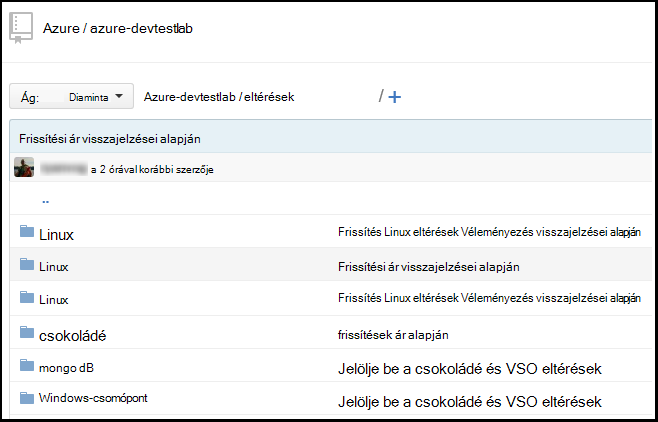
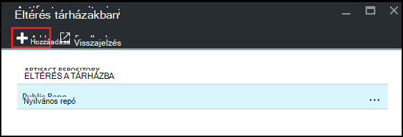
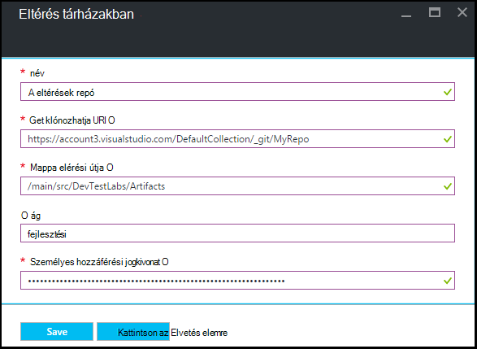

<properties
    pageTitle="Mely számjegy eltérés tár hozzáadása az Azure DevTest Labs laboratóriumi |} Microsoft Azure"
    description="Azure DevTest Labs GitHub vagy Visual Studio csapat szolgáltatások mely számjegy összegyűjti a egyéni eltérések-adatforrás hozzáadása"
    services="devtest-lab,virtual-machines,visual-studio-online"
    documentationCenter="na"
    authors="tomarcher"
    manager="douge"
    editor=""/>

<tags
    ms.service="devtest-lab"
    ms.workload="na"
    ms.tgt_pltfrm="na"
    ms.devlang="na"
    ms.topic="article"
    ms.date="09/06/2016"
    ms.author="tarcher"/>

# Az Azure DevTest Labs laboratóriumi mely számjegy eltérés tár hozzáadása

> [AZURE.VIDEO how-to-add-your-private-artifacts-repository-in-a-devtest-lab]

Azure DevTest Labs eltérések *Műveletek* – például egy virtuális létrehozásakor telepítése a szoftvert vagy futó parancsfájlok és parancsok - is. Alapértelmezés szerint laboratóriumi tartalmaz, a hivatalos Azure DevTest Labs eltérés tárházba való eltérések. Mely számjegy eltérés összegyűjti fűzheti hozzá a labor, amelyet fel szeretne venni az eltéréseket, amely a csapat hoz létre. A tár tárolhatja a [GitHub](https://github.com) , vagy a [Visual Studio csapat szolgáltatások (VSTS)](https://visualstudio.com).

- Megtudhatja, hogy miként hozhat létre olyan GitHub adattárban, olvassa el a [GitHub Bootcamp](https://help.github.com/categories/bootcamp/)című témakört.
- Mely számjegy összegyűjti a Team Services projekt létrehozása című témakörben olvashat, olvassa el a [Csatlakozás a Visual Studio Team Services](https://www.visualstudio.com/get-started/setup/connect-to-visual-studio-online)elemet.

Az alábbi képernyőfelvételen azt szemlélteti, hogyan nézhet meg GitHub eltérések tartalmazó tár:  

## A tárházba adatait, és a hitelesítő adatok beszerzése

Az eltérés tárházba hozzáadása a labor, először kérjen bizonyos adatok az a tárházba. Az alábbi szakaszok végigvezeti Önt az első ezt az információt eltérés tárházakban GitHub, és a Visual Studio Team Services is.

### A GitHub tárházba adatfeliratsor URL-cím és a személyes hozzáférési jogkivonat beszerzése

Ha a GitHub tárházba adatfeliratsor URL-CÍMEK és a személyes hozzáférési jogkivonat, kövesse az alábbi lépéseket:

1. Tallózással keresse meg a GitHub tárházba, amely tartalmazza az eltérés definíciók kezdőlapjára.

1. Válassza az **Adatfeliratsor vagy letöltése**.

1. Az gombra kattintva másolja a vágólapra a **HTTPS klónozhatja URL-címét** , és az URL-cím későbbi felhasználás céljából menteni.

1. Jelölje ki a profil kép GitHub jobb felső sarkában, és válassza a **Beállítások**.

1. A bal oldalon a **személyes beállítások** menüben válassza a **személyes hozzáférési jogkivonat**.

1. Jelölje be az **Új jogkivonat előállítása**.

1. **Új személyes jogkivonat** lapon írja be a **Leírás jogkivonat**, fogadja el az alapértelmezett elemeket, **Jelölje ki a tartományok**elemre, és válassza a **Token készítése**.

1. Mentse a létrehozott jogkivonat, később szükség szerint.

1. Most már bezárhatja GitHub.   

1. Továbbra is a [Csatlakozás a labor az eltérés tárházba](#connect-your-lab-to-the-artifact-repository) szakaszban.

### A Visual Studio Team Services tárházba adatfeliratsor URL-cím és a személyes hozzáférési jogkivonat beszerzése

Ha a Visual Studio Team Services tárházba adatfeliratsor URL-cím és a személyes hozzáférési jogkivonat, kövesse az alábbi lépéseket:

1. Nyissa meg a csapat webhelycsoport kezdőlapját (például `https://contoso-web-team.visualstudio.com`), és válassza a eltérés projektet.

1. A projekt a Kezdőlap lapon válassza ki a **kódot**.

1. Az adatfeliratsor URL-cím megtekintéséhez kattintson **a projekt kódlap** **Adatfeliratsor**kijelölése

1. Az URL-címet, hogy később az oktatóprogram mentése

1. Hozzon létre egy személyes hozzáférési jogkivonat, jelölje be **a profilomat** a felhasználói fiók legördülő menüből.

1. A felhasználóiprofil-adatok lapon kattintson a **Biztonság**lehetőséget.

1. A **Biztonság** lapon válassza a **Hozzáadás gombra**.

1. **A személyes jogkivonat létrehozása** lapon:

    - A token **leírásának** megadása
    - Jelölje ki a **180 nap** **Lejár** listából.
    - Válassza a **minden elérhető fiókok** a **partnerek** listából.
    - Válassza az **összes hatókör** lehetőséget.
    - Válassza a **Token létrehozása**.

1. Ha elkészült, az új jogkivonathoz jelenik meg a **Személyes hozzáférési jogkivonat** listában. Válassza a **Másolás jogkivonat**, és mentse a későbbi felhasználásra a token értéket.

1. Továbbra is a [Csatlakozás a labor az eltérés tárházba](#connect-your-lab-to-the-artifact-repository) szakaszban.

##Csatlakozás a labor az eltérés tárházba

1. Jelentkezzen be az [Azure-portálon](http://go.microsoft.com/fwlink/p/?LinkID=525040).

1. Jelölje ki a **További szolgáltatások**, és válassza ki a **DevTest Labs** a listából.

1. Labs listában jelölje ki a kívánt labor.   

1. Kattintson a labor lap válassza ki a **konfigurációt**.

1. Válassza a labor **konfigurációs** lap, **Eltérések Tárházakban**parancsát.

1. A a **Eltérések Tárházakban** lap válassza a **+ Hozzáadás**lehetőséget.

    
 
1. A második **Eltérések Tárházakban** lap adja meg a következőket:

    - **Név** - írjon be egy nevet a tárhoz.
    - **Mely számjegy Adatfeliratsor Url** - mely számjegy HTTPS adatfeliratsor URL-cím GitHub vagy a Visual Studio Team Services előbb másolt adja meg. 
    - **Mappa elérési útja** – adja meg a mappa elérési útvonala az adatfeliratsor URL-címet, amely tartalmazza a eltérés definíciók viszonyítva.
    - A **fiók** - adja meg a eltérés definíciók beszerzése a beállításra.
    - **Személyes hozzáférési jogkivonat** - adja meg a személyes jogkivonat GitHub vagy a Visual Studio Team Services korábban kapott. 
     
    

1. Válassza a **Mentés**.

[AZURE.INCLUDE [devtest-lab-try-it-out](../../includes/devtest-lab-try-it-out.md)]

## Kapcsolódó blogbejegyzések
- [Eltérések a AzureDevTestLabs adatkapcsolat hibák elhárítása](http://www.visualstudiogeeks.com/blog/DevOps/How-to-troubleshoot-failing-artifacts-in-AzureDevTestLabs)
- [Bekapcsolódás egy virtuális meglévő Active Directory-tartományhoz Azure fejlesztők vizsgálatot labor ARM sablonnal](http://www.visualstudiogeeks.com/blog/DevOps/Join-a-VM-to-existing-AD-domain-using-ARM-template-AzureDevTestLabs)