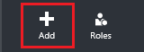
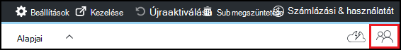

<properties
    pageTitle="Tulajdonosok és a felhasználók felvétele az Azure DevTest Labs |} Microsoft Azure"
    description="Tulajdonosok és a felhasználók felvétele az Azure DevTest Labs az Azure portálon vagy a PowerShell használatával"
    services="devtest-lab,virtual-machines"
    documentationCenter="na"
    authors="tomarcher"
    manager="douge"
    editor=""/>

<tags
    ms.service="devtest-lab"
    ms.workload="na"
    ms.tgt_pltfrm="na"
    ms.devlang="na"
    ms.topic="article"
    ms.date="09/12/2016"
    ms.author="tarcher"/>

# Tulajdonosok és a felhasználók felvétele az Azure DevTest Labs

> [AZURE.VIDEO how-to-set-security-in-your-devtest-lab]

Eléréséhez az Azure DevTest Labs vezérli [Azure Role-Based Access vezérlő (RBAC)](../active-directory/role-based-access-control-what-is.md). RBAC használ, akkor is újból feladatokat a csapaton belüli *szerepkörök* , ha csak a felhasználóknak munkájuk elvégzéséhez szükséges access mennyiségű engedélyez be. *Tulajdonos*, a *DevTest Labs felhasználó*és a *közös munka*közül három RBAC ezeket a szerepköröket. Ebben a cikkben megismerheti, milyen műveletek végezhetők a az egyes a három fő RBAC tartalmaz. Itt megismerheti, hogyan vehet fel felhasználókat az labor - mind a portál és keresztül egy PowerShell-parancsprogramot, és a felhasználók felvétele az előfizetés szintre.

## Az egyes szerepkör elvégezhető műveletek

Az hozzárendelheti egy felhasználó három fő szerepkör létezik:

- Tulajdonos
- DevTest Labs felhasználói
- Közös munka

Az alábbi táblázat bemutatja a műveleteket, amelyeket az egyes ezeket a szerepköröket felhasználók hajthatják:

| **A szerepkör a műveletek felhasználók hajthatják végre.** | **DevTest Labs felhasználói**            | **Tulajdonos** | **Közös munka** |
|---|---|---|---|
| **Labor feladatok**                          |                              |       |             |
| Felhasználók felvétele az laboratóriumi                     | nem                           | igen   | nem          |
| Költség-beállítások frissítése                   | nem                           | igen   | igen         |
| **Virtuális alap feladatok**                      |                              |       |             |
| Hozzáadás és eltávolítás egyéni képek           | nem                           | igen   | igen         |
| Hozzáadása, módosítása és törlése a képletek       | igen                          | igen   | igen         |
| Képek Whitelist Azure Marketplace szolgáltatásból     | nem                           | igen   | igen         |
| **Virtuális feladatok**                           |                              |       |             |
| VMs létrehozása                             | igen                          | igen   | igen         |
| Indítsa el, le, és VMs törlése            | Csak a felhasználó által létrehozott VMs | igen   | igen         |
| Virtuális házirendek frissítése                     | nem                           | igen   | igen         |
| Adatok lemez és a VMs hozzáadása és eltávolítása      | Csak a felhasználó által létrehozott VMs | igen   | igen         |
| **Eltérés feladatok**                     |                              |       |             |
| Hozzáadás és eltávolítás eltérés tárházakban   | nem                           | igen   | igen         |
| Eltérések alkalmazása                        | igen                          | igen   | igen         |

> [AZURE.NOTE] Amikor egy felhasználó létrehoz egy virtuális, az adott felhasználó automatikusan van rendelve a létrehozott virtuális **tulajdonosa** szerepe.

## Egy tulajdonosának vagy a felhasználó hozzáadása a labor szintjén

Tulajdonosok és a felhasználók felvehetők a labor szintjén az Azure portálon keresztül. Ide tartoznak a külső felhasználók érvényes [Microsoft-fiókkal (MSA)](devtest-lab-faq.md#what-is-a-microsoft-account).
Az alábbi lépéseket azon a folyamaton, egy tulajdonosának vagy a felhasználó hozzáadása az Azure DevTest Labs laboratóriumi útmutató:

1. Jelentkezzen be az [Azure-portálon](http://go.microsoft.com/fwlink/p/?LinkID=525040).

1. Jelölje ki a **További szolgáltatások**, és válassza a **DevTest Labs** a listából.

1. Labs listában jelölje ki a kívánt labor.

1. Kattintson a labor lap válassza ki a **konfigurációt**. 

1. A **konfiguráció** lap válassza a **felhasználók**lehetőséget.

1. Válassza a **felhasználók** lap **a + Hozzáadás gombra**.

    

1. **Jelölje ki azt a szerepkört** lap jelölje be a kívánt szerepkört. A szakasz [műveleteket hajthatják minden szerepkör](#actions-that-can-be-performed-in-each-role) a tulajdonos, DevTest felhasználói és munkatársi szerepkörök felhasználók hajthatják különböző műveletek láthatók.

1. A **felhasználók hozzáadása** a lap adja meg az e-mail címet vagy a megadott szerepkör a hozzáadni kívánt felhasználó nevét. A felhasználó nem található, hibaüzenet jelenik ismerteti, hogy ha a probléma. Ha a felhasználó található, a felhasználó a felsorolt és jelölve. 

1. Válassza a **lehetőséget**.

1. Válassza **az OK gombra** kattintva zárja be a **Hozzáadás az access** lap.

1. Vissza a **felhasználók** lap, amikor a felhasználó kerül.  

## Külső felhasználók felvétele a PowerShell használatá labor

Nemcsak a felhasználók hozzáadása az Azure-portálon, vehet egy külső felhasználó a labor egy PowerShell-parancsprogramot használatával. A következő példában egyszerűen módosítsa az **értékek módosítása** Megjegyzés alatt paraméter értékét.
Meghallgathatja a `subscriptionId`, `labResourceGroup`, és `labName` a labor lap az Azure-portálon értékeit.

> [AZURE.NOTE]
> A mintaparancsfájl feltételezi, hogy az adott felhasználó lett hozzáadva vendégként az Active Directory és meghiúsul, ha, amely nem áll fenn. Szeretne felvenni a felhasználó nem az Active Directoryban laboratóriumi, az Azure portal segítségével a felhasználó hozzárendelése szakaszban [tulajdonos hozzáadása vagy a felhasználó labor szintre](#add-an-owner-or-user-at-the-lab-level)bemutatott szerepkörhöz.   

    # Add an external user in DevTest Labs user role to a lab
    # Ensure that guest users can be added to the Azure Active directory:
    # https://azure.microsoft.com/en-us/documentation/articles/active-directory-create-users/#set-guest-user-access-policies

    # Values to change
    $subscriptionId = "<Enter Azure subscription ID here>"
    $labResourceGroup = "<Enter lab's resource name here>"
    $labName = "<Enter lab name here>"
    $userDisplayName = "<Enter user's display name here>"

    # Log into your Azure account
    Login-AzureRmAccount
    
    # Select the Azure subscription that contains the lab. 
    # This step is optional if you have only one subscription.
    Select-AzureRmSubscription -SubscriptionId $subscriptionId
    
    # Retrieve the user object
    $adObject = Get-AzureRmADUser -SearchString $userDisplayName
    
    # Create the role assignment. 
    $labId = ('subscriptions/' + $subscriptionId + '/resourceGroups/' + $labResourceGroup + '/providers/Microsoft.DevTestLab/labs/' + $labName)
    New-AzureRmRoleAssignment -ObjectId $adObject.Id -RoleDefinitionName 'DevTest Labs User' -Scope $labId

## Egy tulajdonosának vagy a felhasználó hozzáadása az előfizetés szintjén

Azure engedélyek szülő hatálya alól átkerülnek gyermek hatókör Azure-ban. Emiatt az Azure előfizetéssel labs tartalmazó tulajdonosai a program automatikusan adott labs tulajdonosai. Azok is a VMs és más erőforrások: a labor felhasználókat, és az Azure DevTest Labs szolgáltatás által létrehozott saját. 

További tulajdonosok vehet fel a labor az [Azure portálon](http://go.microsoft.com/fwlink/p/?LinkID=525040)keresztül laboratóriumi. Azonban a hozzáadott tulajdonosa felügyeleti hatóköre az előfizetés tulajdonosa hatókör-nél több keskeny. Például a hozzáadott tulajdonosok nincs hozzáférése van az egyes erőforrások az előfizetés a DevTest Labs szolgáltatás által létrehozott. 

Tulajdonos hozzáadása Azure előfizetéshez, kövesse az alábbi lépéseket:

1. Jelentkezzen be az [Azure-portálon](http://go.microsoft.com/fwlink/p/?LinkID=525040).

1. Jelölje ki a **További szolgáltatások**, és válassza **az előfizetések** a listából.

1. Jelölje ki a kívánt előfizetést.

1. Kattintson **az Access** ikonra. 

    

1. A **felhasználók** a lap válassza a **Hozzáadás**lehetőséget.

    

1. **Jelölje ki azt a szerepkört** lap a jelölje ki a **tulajdonosa**.

1. A **felhasználók hozzáadása** a lap adja meg az e-mail címet vagy a tulajdonos hozzáadni kívánt felhasználó nevét. Ha a felhasználó nem található, akkor hibaüzenet mailbe arról, hogy a problémát. Ha a felhasználó található, a felhasználó a **felhasználó** szövegdoboz fog megjelenni.

1. Jelölje ki a található felhasználó nevét.

1. Válassza a **lehetőséget**.

1. Válassza **az OK gombra** kattintva zárja be a **Hozzáadás az access** lap.

1. A **felhasználók** lap vissza, ha a felhasználó tulajdonos kerül. A felhasználó ettől kezdve egyik bármely labs létrehozott csoportban az előfizetés tulajdonosa, és így tudja tulajdonosa feladatokat. 

[AZURE.INCLUDE [devtest-lab-try-it-out](../../includes/devtest-lab-try-it-out.md)]
