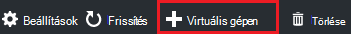
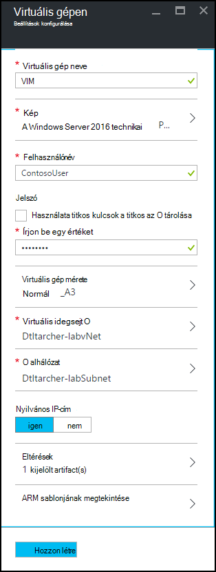
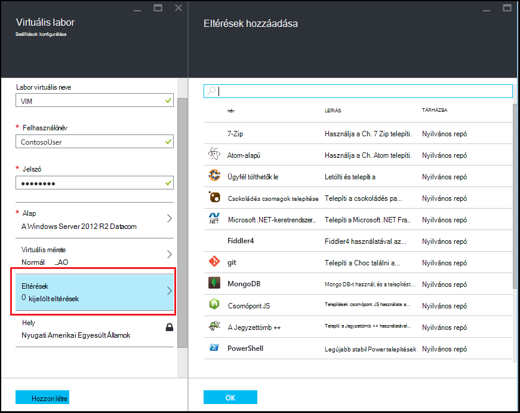
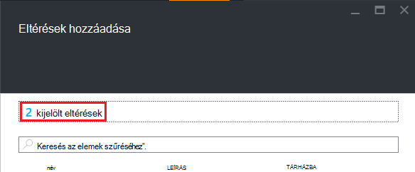

<properties
    pageTitle="A virtuális eltérések rendelkező hozzáadása az Azure DevTest Labs laboratóriumi |} Microsoft Azure"
    description="Megtudhatja, hogy miként vehet fel egy virtuális eltérések rendelkező Azure DevTest Labs"
    services="devtest-lab,virtual-machines"
    documentationCenter="na"
    authors="tomarcher"
    manager="douge"
    editor=""/>

<tags
    ms.service="devtest-lab"
    ms.workload="na"
    ms.tgt_pltfrm="na"
    ms.devlang="na"
    ms.topic="article"
    ms.date="08/30/2016"
    ms.author="tarcher"/>

# Az Azure DevTest Labs laboratóriumi egy virtuális eltérések rendelkező hozzáadása

> [AZURE.VIDEO how-to-create-vms-with-artifacts-in-a-devtest-lab]

Létrehozhat egy virtuális egy *Alap* , amely egy [egyéni képe](./devtest-lab-create-template.md), a [képlet](./devtest-lab-manage-formulas.md)vagy a [kép piactérről](./devtest-lab-configure-marketplace-images.md)származó laboratóriumi.

DevTest Labs *eltérések* megadhatja a virtuális létrehozásakor végrehajtott *Műveletek* . 

Eltérés műveleteket hajthat végre eljárások például futó Windows PowerShell-parancsfájlokat, Bash parancsok fut, és a szoftver telepítése. 

Eltérés *Paraméterek* lehetővé teszik az adott forgatókönyv az eltérés testreszabása.

Ez a cikk bemutatja, hogyan hozhat létre egy virtuális a labor eltérések rendelkező a.

## A virtuális eltérések rendelkező hozzáadása

1. Jelentkezzen be az [Azure-portálon](http://go.microsoft.com/fwlink/p/?LinkID=525040).

1. Jelölje ki a **További szolgáltatások**, és válassza a **DevTest Labs** a listából.

1. Labs listában jelölje ki a labor, amelyben létre szeretne hozni a virtuális.  

1. Kattintson a labor **áttekintése** lap válassza a **+ virtuális gép**elemre.  
    

1. A **Válasszon egy számrendszerben** lap a válassza ki a virtuális alapul.

1. A **virtuális gép** lap a a **virtuális gép neve** szövegmezőbe írja be az új virtuális gép nevét.

    

1. Adja meg, hogy megkapja a virtuális gépen rendszergazdai jogosultságokkal **Felhasználó nevét** .  

1. Ha azt szeretné, a *titkos áruházból*jelszóval, jelölje be **a titkos áruházból titkos kulcsok használata**választógombot, és adja meg a fő érték, amely megfelel a titkos (jelszó). Egyszerűen írja be a jelszót a szöveg mezőbe **Írjon be egy értéket**címkézett.
 
1. Jelölje ki a **virtuális gép méretét** , és válasszon egyet az előre definiált elemekre, adja meg a Processzormagok, RAM, és a merevlemez-meghajtó mérete a virtuális hozhat létre.

1. Jelölje ki **a virtuális hálózatot** , és válassza ki a kívánt virtuális hálózat.

1. Jelölje ki a **alhálózat** , és válassza ki a alhálózat.

1. A kijelölt alhálózat nyilvános IP-címek engedélyezése a labor házirend értéke, adja meg, hogy az IP-címek nyilvánosak, **Igen** vagy **nem**. Ezt a beállítást, letiltása és **nincs**kiválasztva. 

1. Jelölje ki az **eltérések** - eltérések - listából válassza ki, és az eltérések a viszonyítási képekhez kívánt konfigurálása. 
**Megjegyzés:** Ha most használja először a DevTest Labs vagy konfigurálása az eltéréseket, ugorjon a [Hozzáadás egy meglévő eltérés egy virtuális gép](#add-an-existing-artifact-to-a-vm) részre, és ezután térjen vissza ide befejezéskor.

1. Ha azt szeretné, hogy megtekintése vagy másolása az erőforrás-kezelő Azure-sablon, ugorjon a [sablon mentéséhez Azure erőforrás-kezelő](#save-arm-template) részre, és térjen vissza ide, ha végzett.

1. Jelölje ki a megadott virtuális hozzáadása a labor **létrehozása** .

1. A labor lap állapota a virtuális létrehozása; először mint **létrehozása**, majd a **futtatása** után a virtuális elindítva.

1. Ugorjon a [Következő lépésekkel](#next-steps) . 

## Egy meglévő eltérés felvétele egy virtuális

A virtuális létrehozásakor a meglévő eltérések is hozzáadhat. Minden egyes labor eltérések a nyilvános DevTest Labs eltérés tárházba, valamint a már létrehozott és a saját eltérés tárházba hozzáadott eltérések tartalmazza.
Megtudhatja, hogyan hozhat létre az eltéréseket, olvassa el, [megtudhatja, hogy miként készíthet saját eltérések DevTest Labs való használatra](devtest-lab-artifact-author.md).

1. Válassza a **virtuális gép** lap **eltérések**. 

1. Kattintson a **Hozzáadás az eltéréseket** a lap jelölje ki a kívánt eltérés.  

    

1. Adja meg a szükséges paraméterértékeket és választható paramétereket, szüksége van.  

1. Válassza a **Hozzáadás** az eltérés felvétele, és a **Eltérések hozzáadása** lap való visszatéréshez.

1. Vegye fel további eltéréseket, a virtuális szükség szerint.

1. Miután elhelyezte a eltéréseket, módosítható [a sorrendben, amelyben a eltérések futnak](#change-the-order-in-which-artifacts-are-run). Később is is visszatérhet [megtekintése](#view-or-modify-an-artifact)vagy módosítása az eltérés.

## Módosítsa a sorrendben, amelyben eltérések futtatási feltételének megadása

Alapértelmezés szerint az eltérések a végrehajtás abban a sorrendben, amelyben a virtuális hozzáadja őket. A következő lépések bemutatják, hogyan módosíthatja a sorrendben, amelyben a eltérések futnak.

1. A **Eltérések hozzáadása** a lap tetején a virtuális felvett eltérések számát megadó hivatkozásra.

    

1. A sorrendben, amelyben a eltérések futnak megadásához húzással helyezze az eltérések a kívánt sorrendbe. **Megjegyzés:** Ha problémákat tapasztal a eltérés húzása, ellenőrizze az eltérés bal oldalán áthúzása. 

1. Ha elkészült **az OK** gombra.  

## Megtekintése és módosítása az eltérés

A következő lépések bemutatják, hogyan lehet megtekinteni vagy módosítani az eltérés határozza meg:

1. A **Eltérések hozzáadása** a lap tetején a virtuális felvett eltérések számát megadó hivatkozásra.

    

1. A **Kijelölt eltérések** a lap jelölje be a eltérés, amelyet megtekinteni vagy szerkeszteni.  

1. Szükség szerint módosítsa a **Eltérés felvétele** lap, és válassza **az OK gombra** kattintva zárja be a **Eltérés felvétele** lap.

1. Válassza **az OK gombra** kattintva zárja be a **Kijelölt eltérések** lap.

## Erőforrás-kezelő Azure-sablon mentése

Egy erőforrás-kezelő Azure-sablon megismételhető telepítés meghatározásához deklaráció útján biztosít. Az alábbi lépéseket az erőforrás-kezelő Azure-sablon mentése a virtuális eredményezne ismertetik.
Miután mentette, az Azure erőforrás-kezelő sablon [Azure PowerShell új VMs](../azure-resource-manager/resource-group-overview.md#template-deployment)üzembe is használhatja.

1. Válassza a **virtuális gép** lap **ARM sablonjának megtekintése**.

1. A **Nézet Azure erőforrás-kezelő sablon lap**, a sablon szövegének kijelölése

1. A kijelölt szöveg másolása a vágólapra.

1. Válassza **az OK gombra** kattintva zárja be a **Nézet Azure erőforrás-kezelő sablon lap**.

1. Nyisson meg egy szövegszerkesztőt.

1. A sablon a vágólap tartalmának beillesztése

1. Mentse a fájlt a későbbi felhasználás céljából.

[AZURE.INCLUDE [devtest-lab-try-it-out](../../includes/devtest-lab-try-it-out.md)]

## Következő lépések

- A virtuális létrehozása után csatlakozhat a virtuális a virtuális lap a **Csatlakozás** kiválasztásával.
- Megtudhatja, hogy miként hozhat [létre egyéni eltérések a DevTest Labs virtuális](devtest-lab-artifact-author.md).
- Ismerje meg a [DevTest Labs ARM quickstart útmutató sablontár](https://github.com/Azure/azure-devtestlab/tree/master/ARMTemplates)