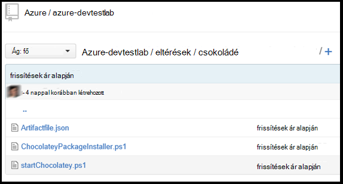

<properties 
    pageTitle="Hozzon létre egyéni eltérések a DevTest Labs virtuális |} Microsoft Azure"
    description="Megtudhatja, hogy miként készíthet saját eltérések DevTest Labs való használatra"
    services="devtest-lab,virtual-machines"
    documentationCenter="na"
    authors="tomarcher"
    manager="douge"
    editor=""/>

<tags
    ms.service="devtest-lab"
    ms.workload="na"
    ms.tgt_pltfrm="na"
    ms.devlang="na"
    ms.topic="article"
    ms.date="08/25/2016"
    ms.author="tarcher"/>

#Hozzon létre egyéni eltérések a DevTest Labs virtuális

> [AZURE.VIDEO how-to-author-custom-artifacts] 

## – Áttekintés
**Eltérések** üzembe helyezéséhez és konfigurálhatja az alkalmazást, miután egy virtuális már kiépítve szolgálnak. Az eltérés egy eltérés definíciós fájl és más parancsfájl mely számjegy összegyűjti mappában tárolt fájlok áll. Eltérés definition fájlok JSON, és adja meg, hogy mit szeretne egy virtuális telepítése használó kifejezések állnak. Ha például határozhatja meg eltérés, a parancs futtatása és a paraméterek elérhetővé tett, amikor a parancsot futtatja nevét. Név szerint hivatkozhat más parancsprogram-fájlok az eltérés-definíciós fájl belül.

##Eltérés definition fájlformátum
A következő példa bemutatja a szakaszok definíciós fájl alapszerkezetét alkotó.

    {
      "$schema": "https://raw.githubusercontent.com/Azure/azure-devtestlab/master/schemas/2015-01-01/dtlArtifacts.json",
      "title": "",
      "description": "",
      "iconUri": "",
      "targetOsType": "",
      "parameters": {
        "<parameterName>": {
          "type": "",
          "displayName": "",
          "description": ""
        }
      },
      "runCommand": {
        "commandToExecute": ""
      }
    }

| Elem neve | Szükség? | Leírás
| ------------ | --------- | -----------
| $schema      | nem        | A JSON-sémafájl, amely segít a tesztelés az-definíciós fájl érvényessége helyét.
| cím        | igen       | Az eltérés tesztkörnyezetben megjelenített neve.
| Leírás  | igen       | A megjelenített tesztkörnyezetben eltérés leírását.
| iconUri      | nem        | URI-tesztkörnyezetben megjelenített ikon.
| targetOsType | igen       | Operációs rendszer: a virtuális, ahol eltérés telepítve van. Támogatott lehetőségek: a Windows és Linux rendszerhez.
| Paraméterek   | nem        | Eltérés a telepítés parancs gépre futtatásakor kapott érték. Ez segít a eltérés testreszabása.
| ParancsFuttatása   | igen       | Eltérés telepítse parancs, amely egy virtuális végrehajtása.

###Eltérés paraméterei

Az-definíciós fájl paraméterek szakaszában megadhatja, hogy a felhasználó-eltérés telepítésekor értékeket adja meg. Ezek a eltérés telepítés parancs az értékek is hivatkozhat.

Az alábbi szerkezet definiálása paraméterek lesz.

    "parameters": {
        "<parameterName>": {
          "type": "<type-of-parameter-value>",
          "displayName": "<display-name-of-parameter>",
          "description": "<description-of-parameter>"
        }
      }

| Elem neve | Szükség? | Leírás
| ------------ | --------- | -----------
| típus         | igen       | Paraméter típusát. Lásd: az engedélyezett típusnál az alábbi listából:
| Igen displayName       | A paraméter egy felhasználóhoz, tesztkörnyezetben megjelenő neve.
| Leírás  | igen       | A paraméter laboratóriumi megjelenített leírását.

A megengedett típusok a következők:

- karakterlánc – bármely érvényes JSON-karakterlánc
- int – bármely érvényes JSON egész szám
- logikai – bármely érvényes JSON logikai
- tömb – bármely érvényes JSON tömb

##Eltérés kifejezésekről és függvényekről

Kifejezés használható, és a eltérés összeállításához függvények telepítése parancsot.
Kifejezések vannak szögletes zárójelekkel ([és]), és a eltérés telepítésekor értékeli ki. Kifejezések is tetszőleges JSON szöveges értékként jelennek meg, és egy másik JSON értéke mindig vissza. Ha szeretne egy konstans karakterlánccal kezdődik egy szögletes zárójel [, kell használnia, két zárójelek [[.
Általában segítségével kifejezések függvényekkel Egyenletszerkesztővel értéket. Hasonlóan a JavaScript, a függvény hívások formázott functionName(arg1,arg2,arg3)

A következő lista mutatja a leggyakoribb funkciókat.

- parameters(parameterName) – a eltérés parancs futtatásakor kapott paraméter értéket ad eredményül.
- összefűzés (arg1, arg2, arg3,...) - egyesíti a több megadott értékeket. Ez a függvény argumentumai tetszőleges számú is tarthat.

A következő példa bemutatja a kifejezés és a függvények használatát összeállításához értéket.

    runCommand": {
         "commandToExecute": "[concat('powershell.exe -File startChocolatey.ps1'
    , ' -RawPackagesList ', parameters('packages')
    , ' -Username ', parameters('installUsername')
    , ' -Password ', parameters('installPassword'))]"
    }

##Hozzon létre egy egyéni eltérés

Az egyéni eltérés létrehozása az alábbi lépésekkel:

1. A JSON-szerkesztő telepítése – szüksége lesz egy JSON szerkesztő eltérés definition fájlján dolgozhat. Azt javasoljuk, hogy segítségével [Visual Studio kódot](https://code.visualstudio.com/), amely Windows, a Linux és az OS X érhetők el.

1. Egy minta artifactfile.json Get - olvassa el az eltérések a hol van az eltéréseket, amely segít a multimédiás tár létrehozott saját [GitHub tárházba](https://github.com/Azure/azure-devtestlab) Azure DevTest Labs csoport által létrehozott létrehozása a saját eltérések. Eltérés definíciós fájl letöltésére, és fel saját eltérések létrehozásához.

1. Előhívható IntelliSense - emelés IntelliSense-eltérés definíciós fájl összeállításához használható érvényes elemek megtekintéséhez. A különböző beállításokat az értékek egy elem is láthatja. Például az IntelliSense jelzik, hogy a Windows vagy Linux rendszerhez két lehetőség közül választhat az **targetOsType** elem szerkesztésekor.

1. Az eltérés egy mely számjegy tárban tárolnak áruházból
    1. Hozzon létre külön könyvtárat minden eltérés, ahol a könyvtár neve megegyezik a eltérés nevét.
    1. Az eltérés-definíciós fájl (artifactfile.json) tárolását a címtárban hozott létre.
    1. A parancsfájlok eltérés telepítési parancs a hivatkozott tárolni.

    Íme egy példa hogyan nézhet ki egy eltérés mappát:

    

1. A eltérések-tár hozzáadása a labor - olvassa el a következő cikket [hozzáadása egy mely számjegy eltérés tárházba való laboratóriumi](devtest-lab-add-artifact-repo.md).

[AZURE.INCLUDE [devtest-lab-try-it-out](../../includes/devtest-lab-try-it-out.md)]

## Kapcsolódó blogbejegyzések
- [Eltérések a AzureDevTestLabs adatkapcsolat hibák elhárítása](http://www.visualstudiogeeks.com/blog/DevOps/How-to-troubleshoot-failing-artifacts-in-AzureDevTestLabs)
- [Bekapcsolódás egy virtuális meglévő Active Directory-tartományhoz Azure fejlesztők próba labor ARM sablonnal](http://www.visualstudiogeeks.com/blog/DevOps/Join-a-VM-to-existing-AD-domain-using-ARM-template-AzureDevTestLabs)

## Következő lépések

- Megtudhatja, hogy miként [vehet fel egy mely számjegy eltérés tárházba való laboratóriumi](devtest-lab-add-artifact-repo.md).
