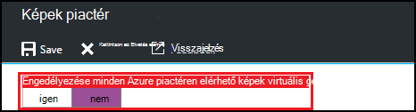
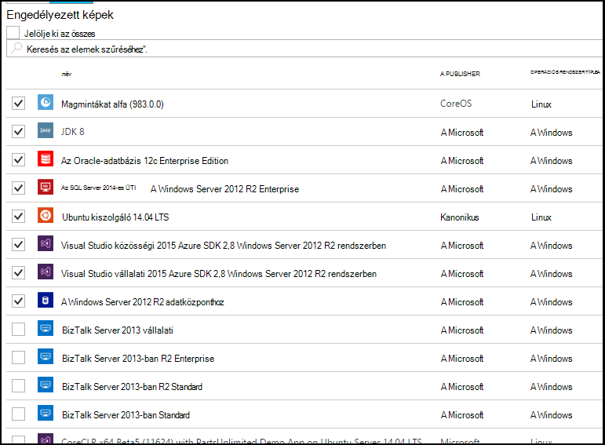

<properties
    pageTitle="Microsoft Azure piactéren kép beállításainak konfigurálása az Azure DevTest Labs |} Microsoft Azure"
    description="Melyik Microsoft Azure piactéren képek használhatók, amikor egy virtuális létrehozása az Azure DevTest Labs konfigurálása"
    services="devtest-lab,virtual-machines"
    documentationCenter="na"
    authors="tomarcher"
    manager="douge"
    editor=""/>

<tags
    ms.service="devtest-lab"
    ms.workload="na"
    ms.tgt_pltfrm="na"
    ms.devlang="na"
    ms.topic="article"
    ms.date="09/06/2016"
    ms.author="tarcher"/>

# Azure DevTest Labs Azure piactéren elérhető kép beállításainak konfigurálása

DevTest Labs támogatja az Azure piactéren elérhető képek attól függően, hogy hogyan beállította az Azure piactéren elérhető képek alapján létrehozása VMs a labor használhatók. Ez a cikk bemutatja, hogyan határozza meg, melyik, az Azure piactéren elérhető képeket lehet VMs laboratóriumi létrehozásakor használja.

## Jelölje ki, mely Azure piactéren elérhető képek engedélyezettek egy virtuális létrehozásakor

1. Jelentkezzen be az [Azure-portálon](http://go.microsoft.com/fwlink/p/?LinkID=525040).

1. Jelölje ki a **További szolgáltatások**, és válassza ki a **DevTest Labs** a listából.

1. Labs listában jelölje ki a kívánt labor. 

1. Kattintson a labor lap válassza ki a **konfigurációt**.
    
1. A **konfiguráció** lap labor meg jelölje be a **piactér képek**

1. Adja meg, hogy az összes a minősített Azure piactéren elérhető képek egy új virtuális gép alapjául használható. Ha az **Igen**lehetőséget választja, majd a következő feltételeknek megfelelő Azure piactéren elérhető képek engedélyezettek tesztkörnyezetben:

    - A kép hoz létre egy egyetlen virtuális **és**
    - A kép Azure erőforrás-kezelő kiépítése VMs, **és** használja.
    - A kép használatához nincs szükség, egy további licencelési csomag megvásárlása
    
    Ha azt szeretné, hogy nincsenek képek szeretné tenni, vagy meg szeretné adni, hogy mely képek is használható, válassza a **nem**lehetőséget.
 
    
 
1. Ha **nem** az előző lépésben gombra kattint, az **Engedélyezett képek/jelölje be az összes** jelölőnégyzet engedélyezve van. Használhatja ezt a lehetőséget a keresőmezőbe együtt gyors jelölje be, illetve jelenik meg a lista elemeinek.
Emellett bejelölheti a minden kép megfelelő jelölőnégyzet bejelölésével egyenként virtuális elrejtésével engedélyezni Azure piactéren elérhető képek.
Válassza a semmi sem a listából, ha nem szeretné lehetővé teszi az Azure piactéren elérhető laboratóriumi használandó képet.

    

[AZURE.INCLUDE [devtest-lab-try-it-out](../../includes/devtest-lab-try-it-out.md)]

## Következő lépések

Miután beállította, hogy hogyan Azure piactéren elérhető képek engedélyezettek egy virtuális létrehozásakor, következő lépésként [egy virtuális a labor szeretne](./devtest-lab-add-vm-with-artifacts.md)hozzáadni.