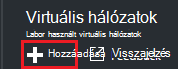
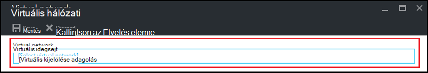
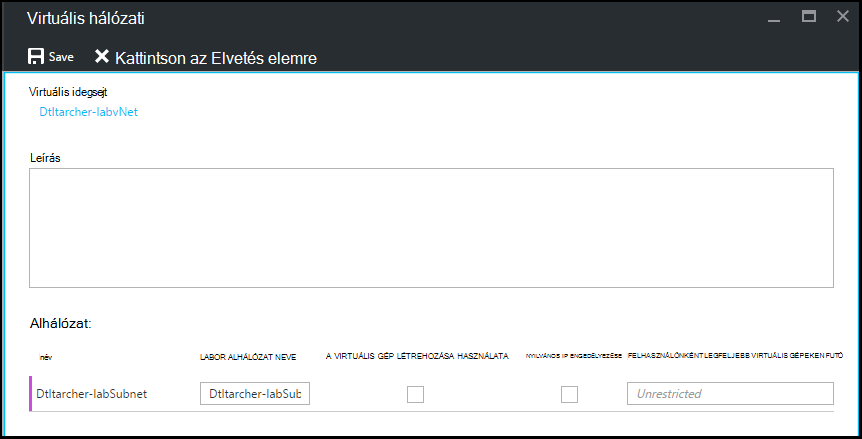

<properties
    pageTitle="Virtuális hálózat beállítása az Azure DevTest Labs |} Microsoft Azure"
    description="Megtudhatja, hogy miként konfigurálható egy meglévő virtuális hálózati és alhálózat és a hierarchiák használata egy virtuális az Azure DevTest Labs"
    services="devtest-lab,virtual-machines"
    documentationCenter="na"
    authors="tomarcher"
    manager="douge"
    editor=""/>

<tags
    ms.service="devtest-lab"
    ms.workload="na"
    ms.tgt_pltfrm="na"
    ms.devlang="na"
    ms.topic="article"
    ms.date="09/06/2016"
    ms.author="tarcher"/>

# Azure DevTest Labs virtuális hálózat beállítása

MAGYARÁZAT [hozzáadása egy virtuális laboratóriumi való eltérések rendelkező](devtest-lab-add-vm-with-artifacts.md), a cikkben egy virtuális laboratóriumi, létrehozásakor a beállított virtuális hálózati is megadhat. Egy helyzetleírás mindezt, meg kell-e az corpnet erőforrások elérése a VMs készült ExpressRoute vagy a webhely VPN konfigurált virtuális hálózaton keresztül. Az alábbi szakaszok bemutatják, hogyan lehet a meglévő virtuális hálózat beszúrhat egy labor virtuális hálózati beállításokat, hogy akkor érhető el, válassza ki a VMs létrehozásakor.

## Virtuális hálózat beállítása az Azure portálon laboratóriumi
Az alábbi lépésekkel ismerteti, hogy egy meglévő virtuális hálózati (és alhálózat) laboratóriumi való hozzáadásával, hogy egy virtuális azonos tesztkörnyezetben létrehozásakor is használható. 

1. Jelentkezzen be az [Azure-portálon](http://go.microsoft.com/fwlink/p/?LinkID=525040).

1. Jelölje ki a **További szolgáltatások**, és válassza a **DevTest Labs** a listából.

1. Labs listában jelölje ki a kívánt labor. 

1. Válassza a labor lap, a **konfigurációs**.

1. Válassza a labor **konfigurációs** lap, a **virtuális hálózatok**.

1. A **virtuális hálózatok** lap látni be van állítva az aktuális labor, valamint az alapértelmezett virtuális hálózat, amely a labor jön létre virtuális hálózatok listáját. 

1. Válassza **az + Add**.

    
    
1. Jelölje be a **virtuális hálózati** lap **[jelölje ki a virtuális hálózati]**.

    
    
1. A **virtuális hálózat kiválasztása** a lap jelölje be a kívánt virtuális hálózat. A lap a virtuális hálózatok, amelyek másként laboratóriumi előfizetésben azonos területnél jeleníti meg.  

1. Miután kiválasztotta a virtuális hálózat, a **virtuális hálózati** lap adja vissza, és több mezőt fognak.  

    

1. Adjon meg egy leírást a virtuális hálózathoz / labor kombinációt.

1. Virtuális létrehozási labor használandó alhálózat engedélyezéséhez jelölje be a **Használata a virtuális gép LÉTREHOZÁSÁT**.

1. Alhálózat nyilvános IP-címek engedélyezni, válassza a **Nyilvános IP engedélyezése**lehetőséget.

1. A **Maximális virtuális gépeken FUTÓ felhasználónként** mezőben adja meg a maximális VMs minden alhálózathoz felhasználónként. Ha azt szeretné, hogy VMs korlátlan számú, hagyja üresen a mezőt.

1. Válassza a **Mentés**.

1. Most, hogy a virtuális hálózat van konfigurálva, akkor kiválasztott egy virtuális létrehozásakor. Megtudhatja, hogy miként hozhat létre egy virtuális, és adjon meg egy virtuális hálózat, a következő cikket [hozzáadása egy virtuális laboratóriumi való eltérések rendelkező](devtest-lab-add-vm-with-artifacts.md)vonatkoznak. 

[AZURE.INCLUDE [devtest-lab-try-it-out](../../includes/devtest-lab-try-it-out.md)]

## Következő lépések

Miután elhelyezte a kívánt virtuális hálózat szeretne a labor, következő lépésként [egy virtuális a labor szeretne](devtest-lab-add-vm-with-artifacts.md)hozzáadni.