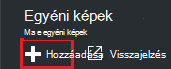
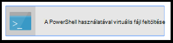
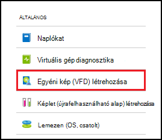
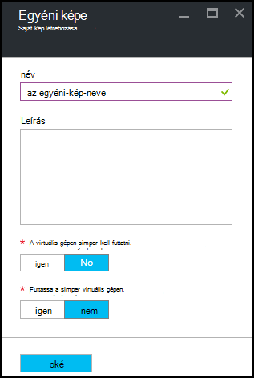

<properties
    pageTitle="Azure DevTest Labs egyéni képek VMs létrehozása kezelése |} Microsoft Azure"
    description="Megtudhatja, hogyan hozhat létre egyéni kép, vagy egy meglévő virtuális az Azure DevTest Labs virtuális fájlból"
    services="devtest-lab,virtual-machines"
    documentationCenter="na"
    authors="tomarcher"
    manager="douge"
    editor=""/>

<tags
    ms.service="devtest-lab"
    ms.workload="na"
    ms.tgt_pltfrm="na"
    ms.devlang="na"
    ms.topic="article"
    ms.date="09/07/2016"
    ms.author="tarcher"/>

# Azure DevTest Labs a VMs létrehozása egyéni képek kezelése

Egyéni képek Azure DevTest Labs lehetővé teszi azok VMs gyors létrehozásához a cél számítógépen telepíteni kell az összes szükséges szoftvert várakozás nélkül. Egyéni képek lehetővé teszi, hogy előre telepítse a szoftvert, amely egy virtuális fájlban van szüksége, és a virtuális fájl használatával hozzon létre egy virtuális. A szoftver már telepítve van, mert a virtuális létrehozásának ideje sokkal gyorsabban. Ezeken kívül egyéni képek VMs klónozhatja hoz létre egy egyéni képe egy virtuális, és kattintson a saját kép létrehozásának VMs használhatók.

Ebben a cikkben megismerheti, hogy miként:

- [Létrehozás fájlból virtuális egyéni képet](#create-a-custom-image-from-a-vhd-file) , hogy az adott egyéni kép majd létrehozhat egy virtuális. 
- [Egy egyéni képet egy virtuális létrehozása](#create-a-custom-image-from-a-vm) a gyors virtuális klónozhatja.

## Hozzon létre egy egyéni kép virtuális fájlból

Ebben a részben látni, hogyan hozhat létre egyéni kép virtuális fájlból.
Ebben a részben összes lépések végrehajtásához érvényes virtuális fájl hozzáféréssel kell rendelkeznie.   

1. Jelentkezzen be az [Azure-portálon](http://go.microsoft.com/fwlink/p/?LinkID=525040).

1. Jelölje ki a **További szolgáltatások**, és válassza a **DevTest Labs** a listából.

1. Labs listában jelölje ki a kívánt labor.  

1. Kattintson a labor lap válassza ki a **konfigurációt**. 

1. Válassza a labor **konfigurációs** lap az **egyéni képek**.

1. Válassza az **egyéni képek** lap **+ egyéni képe**.

    

1. Írja be a saját kép nevével. Ez a név alap képek listája megjelenik egy virtuális létrehozásakor.

1. Írja be a saját kép leírását. Ez a leírás alap képek listája megjelenik egy virtuális létrehozásakor.

1. Jelölje ki a **virtuális fájlt**.

1. Ha van hozzáférése egy virtuális fájl, amely nem szerepel a listában, a [virtuális fájl feltöltése](#upload-a-vhd-file) részben leírt utasításokat követve vegye fel, és térjen vissza ide befejezéskor.

1. Jelölje ki a kívánt virtuális fájlt.

1. Válassza **az OK gombra** kattintva zárja be a **Virtuális fájl** lap.

1. Jelölje ki az **operációs rendszer konfigurációja**.

1. Az **Operációs rendszer konfigurációja** lapon jelölje be a **Windows** vagy **Linux rendszerhez**.

1. **Windows** ki van jelölve, adja meg a jelölőnégyzet keresztül e *Sysprep* működött-e a számítógépen.

1. Válassza **az OK gombra** kattintva zárja be az **Operációs rendszer konfigurációja** lap.

1. Válassza az **OK gombra** a saját képét.

1. Ugorjon a [Következő lépésekkel](#next-steps) .

###Virtuális fájl feltöltése

Egyéni kép hozzáadásához szüksége van hozzáférésük ahhoz a virtuális fájl.

1. A **Virtuális fájl** lap jelölje be a **PowerShell használatá virtuális fájl feltöltése**.

    

1. A következő lap való módosítása, és egy PowerShell-parancsprogramot, amely az Azure-előfizetéséhez feltölt egy virtuális fájl futtatása jeleníti meg. 
**Megjegyzés:** Lehet, hogy ezt a folyamatot hosszas a a virtuális fájl méretét és a kapcsolat sebességétől függően.

## Egyéni kép készítése a virtuális
Ha egy virtuális, amely már be van állítva, a saját kép létrehozása a virtuális, és azt követően, hogy saját kép használata: más azonos VMs létrehozása. A következő lépések bemutatják, hogy miként hozhat létre egyéni kép egy virtuális:

1. Jelentkezzen be az [Azure-portálon](http://go.microsoft.com/fwlink/p/?LinkID=525040).

1. Jelölje ki a **További szolgáltatások**, és válassza ki a **DevTest Labs** a listából.

1. Labs listában jelölje ki a kívánt labor.  

1. A labor lap jelölje be **a virtuális gépeken futó**.
 
1. Jelölje be a virtuális, amelyhez képest a saját kép létrehozása a **saját virtuális gépeken futó** lap.

1. Válassza ki a virtuális lap, a **saját kép létrehozása (virtuális)**.

    

1. Adja meg a **kép létrehozása** lap nevét és leírását a saját kép. Amikor létrehoz egy virtuális ezt az információt a adatbázisok listájában megjelenik.

    

1. Válassza ki, hogy a virtuális sysprep lett futtatni. Ha a sysprep volt a virtuális nem fut, adja meg, hogy futtatni, amikor egy virtuális létrejön a saját kép sysprep.

1. Kattintson az **OK** befejezéskor a saját képét.

[AZURE.INCLUDE [devtest-lab-try-it-out](../../includes/devtest-lab-try-it-out.md)]

## Kapcsolódó blogbejegyzések

- [Egyéni képek vagy képletek?](https://blogs.msdn.microsoft.com/devtestlab/2016/04/06/custom-images-or-formulas/)
- [Azure DevTest Labs között egyéni képek másolása](http://www.visualstudiogeeks.com/blog/DevOps/How-To-Move-CustomImages-VHD-Between-AzureDevTestLabs#copying-custom-images-between-azure-devtest-labs)

##Következő lépések

Miután hozzáadott egy egyéni képet használata egy virtuális létrehozásakor, következő lépésként [egy virtuális a labor szeretne](./devtest-lab-add-vm-with-artifacts.md)hozzáadni.