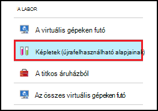
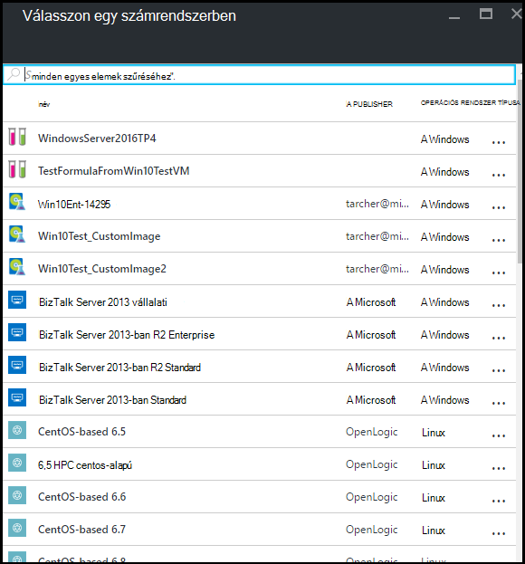
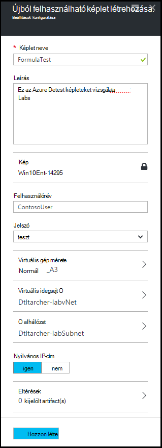
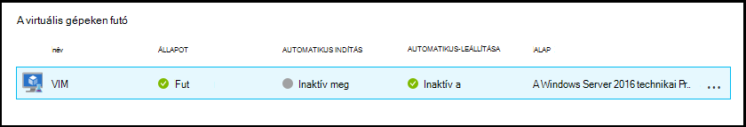
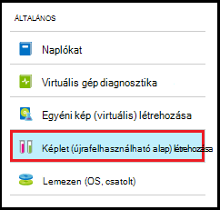
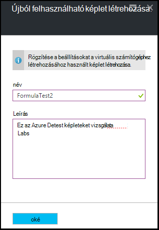
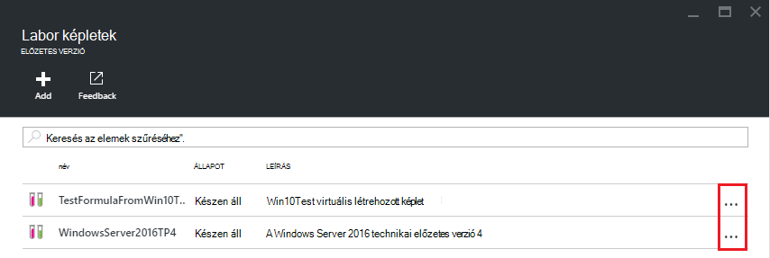
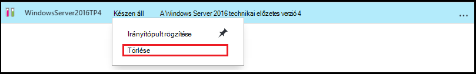

<properties
    pageTitle="Azure DevTest Labs VMs létrehozása a képletek kezelése |} Microsoft Azure"
    description="Megtudhatja, hogy miként létrehozása, módosítása, és Azure DevTest Labs képletek eltávolítása és használatával hozzon létre új VMs."
    services="devtest-lab,virtual-machines"
    documentationCenter="na"
    authors="tomarcher"
    manager="douge"
    editor=""/>

<tags
    ms.service="devtest-lab"
    ms.workload="na"
    ms.tgt_pltfrm="na"
    ms.devlang="na"
    ms.topic="article"
    ms.date="08/30/2016"
    ms.author="tarcher"/>

# DevTest Labs képletek létrehozása VMs kezelése

Azure DevTest Labs egy képlete virtuális gép (virtuális) létrehozásához használt alapértelmezett értékű listáját. Ha létrehoz egy virtuális képletből, az alapértelmezett értékeket is alkalmazható- vagy módosítani. [Egyéni képek](./devtest-lab-create-template.md) és a [piactér képek](./devtest-lab-configure-marketplace-images.md), például a képletek mechanizmusa gyors virtuális kialakítási.  

Ebben a cikkben Dióhéjban miként végezheti el az alábbi műveleteket:

- [Képlet létrehozása](#create-a-formula)
- [A virtuális kiépítése képlet használatával](#use-a-formula-to-provision-a-vm)
- [Képlet módosítása](#modify-a-formula)
- [Képlet törlése](#delete-a-formula)

> [AZURE.NOTE] Képletek – például [egyéni képek](./devtest-lab-create-template.md) - lehetővé teszi létrehozása alap képe virtuális fájlból. Az alap kép használható hozhatók létre egy új virtuális. Döntheti el, melyik a megfelelő az adott környezetben, tanulmányozza a következő cikket [Comparing egyéni képek és DevTest Labs képleteket](./devtest-lab-comparing-vm-base-image-types.md).

## Képlet létrehozása
A *felhasználók* DevTest Labs engedélyekkel rendelkező összes létrehozhatnak VMs alapjául képletet használ. Kétféleképpen képletekkel: 

- Az egy alap - használja, ha be szeretné állítani a képlet a tulajdonságait.
- Az egy meglévő labor virtuális - használja, ha egy képlet létrehozása egy meglévő virtuális beállításai alapján.

### Egy számrendszerben képlet létrehozása
Az alábbi lépésekkel Útmutató azon a folyamaton, egyéni kép, Marketplace képet vagy egy másik képletet a képletek létrehozásáról.

1. Jelentkezzen be az [Azure-portálon](http://go.microsoft.com/fwlink/p/?LinkID=525040).

1. Jelölje ki a **További szolgáltatások**, és válassza a **DevTest Labs** a listából.

1. Labs listában jelölje ki a kívánt labor.  

1. A labor lap jelölje be **a képletek (újrafelhasználható alapjainak)**.

    

1. Jelölje be a **labor a képletek** lap **+ Hozzáadás gombra**.

    

1. A **Válasszon egy számrendszerben** lap jelölje be az Alap (egyéni képe, piactér képe vagy képletet), amelyhez képest a képlet létrehozásához.

    

1. A **képlet a létrehozás** lap adja meg az alábbi értékeket:

    - A **képlet nevét** - nevezze el a képletet. Ez az érték jelenik meg a listában az alap képek egy virtuális létrehozásakor. A nevét, írja be azt, és nem érvényes, ha egy üzenet jelzi az érvényes nevet követelményei érvényességét.
    - **Leírás** – adja meg a képlet egy jól érthető nevet. Ezt az értéket a hoz létre egy virtuális esetén a képlet helyi menüből érhető el.
    - **Felhasználónév** - adja meg, hogy megkapja a rendszergazdai jogosultságokkal felhasználónév.
    - **Jelszó** - írja be - vagy a legördülő listából válassza ki - egy értéket az adott felhasználó használni kívánt titkos (jelszó) társított.  
    - **Kép** – Ez a mező látható az előző lap a kiválasztott viszonyítási kép nevével. 
    - **Virtuális gép méret** - válasszon egyet az előre definiált elemekre, amely a Processzormagok, RAM, és a merevlemez-meghajtó mérete a virtuális létrehozásához adja meg az.
    - **Virtuális hálózati** – adja meg a kívánt virtuális hálózat.
    - **Alhálózat** – adja meg a kívánt alhálózat.
    - **Nyilvános IP-cím** – a labor házirendjének értéke, a kijelölt alhálózat nyilvános IP-címek ahhoz, hogy adja meg, hogy az IP-címek nyilvánosak, **Igen** vagy **nem**kiválasztásával. Ezt a beállítást, letiltása és **nincs**kiválasztva.
    - **Eltérések** - jelölje ki, és állítsa be az eltéréseket, amelyet az alap képekhez. Biztonságos értékeket nem menti a program a képletet tartalmazó karakterlánc. Ezért biztonságos karakterláncok eltérés paramétert nem jelenik meg. 

        

1. Jelölje ki a képlet **létrehozása** .

### A virtuális képlet létrehozása
Az alábbi lépésekkel Útmutató azon a folyamaton, egy meglévő virtuális alapján képletek létrehozásáról. 

> [AZURE.NOTE] Ha szeretne létrehozni egy képlet egy virtuális, a virtuális létre kell hozni 2016 március 30 után. 

1. Jelentkezzen be az [Azure-portálon](http://go.microsoft.com/fwlink/p/?LinkID=525040).

1. Jelölje ki a **További szolgáltatások**, és válassza a **DevTest Labs** a listából.

1. Labs listában jelölje ki a kívánt labor.  

1. A labor **áttekintése** lap jelölje be a virtuális, amelyből ki szeretne a képlet létrehozása.

    

1. Válassza a virtuális lap, a **képlet (újrafelhasználható alap)**.

    

1. Kattintson a **Létrehozás képlet** lap írja be a **nevét** és **leírását** az új képletet.

    

1. A képlet létrehozása az **OK** gombra.

## A virtuális kiépítése képlet használatával
Miután létrehozta a képletet, létrehozhat egy virtuális képletet alapján. A szakasz [hozzáadása egy virtuális eltérések rendelkező](devtest-lab-add-vm-with-artifacts.md#add-a-vm-with-artifacts) végigvezeti a folyamat.

## Képlet módosítása
Képlet módosítása, kövesse az alábbi lépéseket:

1. Jelentkezzen be az [Azure-portálon](http://go.microsoft.com/fwlink/p/?LinkID=525040).

1. Jelölje ki a **További szolgáltatások**, és válassza a **DevTest Labs** a listából.

1. Labs listában jelölje ki a kívánt labor.  

1. A labor lap jelölje be **a képletek (újrafelhasználható alapjainak)**.

    

1. A **képletek labor** lap jelölje be a módosítani kívánt képletet.

1. **Képlet módosítása** lap végezze el a kívánt szerkesztéseket, és jelölje ki a **frissítést**.

## Képlet törlése 
Ha törölni szeretne egy képletben, kövesse az alábbi lépéseket:

1. Jelentkezzen be az [Azure-portálon](http://go.microsoft.com/fwlink/p/?LinkID=525040).

1. Jelölje ki a **További szolgáltatások**, és válassza a **DevTest Labs** a listából.

1. Labs listában jelölje ki a kívánt labor.  

1. Válassza a labor a **Beállítások** lap, **képleteket**.

    

1. Jelölje be a törölni kívánt képletet jobbra látható három pontot a **labor a képletek** lap.

    

1. A képlet helyi menüjében válassza a **Törlés**elemre.

    

1. Válassza a törlés megerősítését kérő párbeszédpanel **Igen** .

[AZURE.INCLUDE [devtest-lab-try-it-out](../../includes/devtest-lab-try-it-out.md)]

## Kapcsolódó blogbejegyzések

- [Egyéni képek vagy képletek?](https://blogs.msdn.microsoft.com/devtestlab/2016/04/06/custom-images-or-formulas/)

## Következő lépések
Létrehozását követően használható képlet egy virtuális létrehozásakor, következő lépésként [egy virtuális a labor szeretne](./devtest-lab-add-vm-with-artifacts.md)hozzáadni.