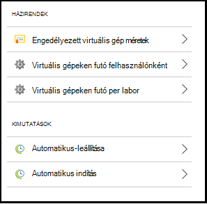
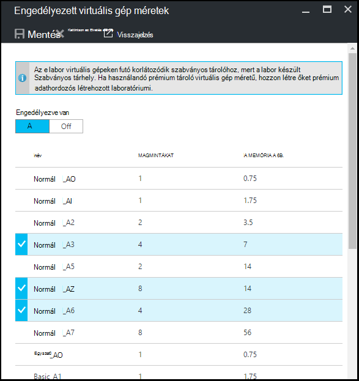
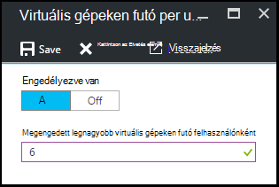
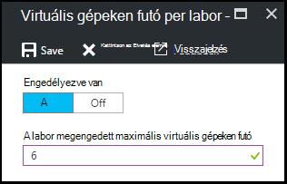
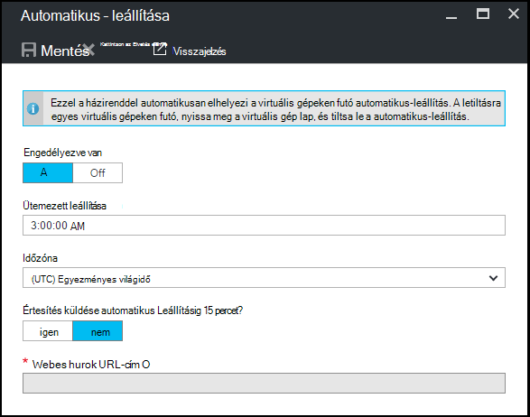
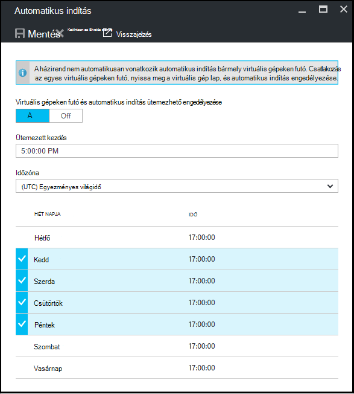

<properties
    pageTitle="Azure DevTest Labs labor házirendek meghatározása |} Microsoft Azure"
    description="Megtudhatja, hogy miként labor házirendek, például a virtuális méretek, egy felhasználó, és a Leállítás automatizálást maximális VMs megadása."
    services="devtest-lab,virtual-machines"
    documentationCenter="na"
    authors="tomarcher"
    manager="douge"
    editor=""/>

<tags
    ms.service="devtest-lab"
    ms.workload="na"
    ms.tgt_pltfrm="na"
    ms.devlang="na"
    ms.topic="article"
    ms.date="09/12/2016"
    ms.author="tarcher"/>

# Azure DevTest Labs labor házirendek meghatározása

> [AZURE.VIDEO how-to-set-vm-policies-in-a-devtest-lab]

Azure DevTest Labs lehetővé teszi, hogy adja meg, amelyek segítségével szabályozhatja a költség, és minimalizálhatja az labs hulladék kulcs házirendek. Ezek a házirendek labor felhasználónként és labor és különböző automatikus-leállítás és automatikus indítás beállítások / létrehozott VMs maximális számát tartalmazza. 

## Egy labor házirendek az Azure DevTest Labs elérése

Az alábbi lépésekkel végigvezeti Önt az Azure DevTest Labs laboratóriumi házirendek beállítása:

Megtekintése (és módosítása) a házirendek laboratóriumi, kövesse az alábbi lépéseket:

1. Jelentkezzen be az [Azure-portálon](http://go.microsoft.com/fwlink/p/?LinkID=525040).

1. Jelölje ki a **További szolgáltatások**, és válassza a **DevTest Labs** a listából.

1. Labs listában jelölje ki a kívánt labor.   

1. Válassza a **házirend-beállításokat**.

1. A **házirend-beállítások** lap megadható beállítások menü tartalma: 

    

    Ha többet szeretne tudni házirend beállítása, jelölje ki azt az alábbi lista:

    - [Engedélyezett virtuális gép méretű](#set-allowed-virtual-machine-sizes) - jelölje ki a listában a virtuális méretű laboratóriumi sorolja fel. A felhasználó VMs hozhat létre, csak a listából.

    - [Virtuális gépeken futó felhasználónként](#set-virtual-machines-per-user) – adja meg a felhasználó által létrehozott VMs maximális számát. 

    - [Virtuális gépeken futó labor egy](#set-virtual-machines-per-lab) - egy labor létrehozható VMs maximális számát adja meg. 

    - [Automatikus-leállítás](#set-auto-shutdown) - adja meg az időpontot, amikor az aktuális labor adatait a VMs automatikusan leáll.

    - [Automatikus indítás](#set-auto-start) - adja meg az időpontot, amikor az aktuális labor VMs automatikus elindításához.

## A virtuális gép méretű engedélyezett beállítása

A házirend beállítása a virtuális megengedett méretét, hogy határozza meg, hogy melyik virtuális méretű tesztkörnyezetben engedélyezésével labor hulladék minimalizálásához segítségével. Ha ezzel a házirenddel aktiválva van, csak virtuális méretű a listáról VMs létrehozásához használható.

1. Válassza a labor **házirend-beállítások** lap, **engedélyezett virtuális gépeken futó méretét**.

    
 
1. Jelölje ki **a** ahhoz, hogy ezt a házirendet, és **ki** letiltáshoz.

1. Ha engedélyezi a házirendet, jelölje be a labor hozhat létre egy vagy több virtuális méretét.

1. Válassza a **Mentés**.

## Beállítása virtuális gépeken futó felhasználónként

A házirend- **virtuális gépeken futó felhasználónként** lehetővé teszi, hogy az egyes felhasználók által létrehozott VMs maximális számát adja meg. Ha egy felhasználó megkísérel hozzon létre egy virtuális, a felhasználó által teljesülésekor, hibaüzenet jelenik azt jelzi, hogy a virtuális nem hozható létre. 

1. Válassza a labor **házirend-beállítások** lap, a **virtuális gépeken futó felhasználónként**.

    

1. Jelölje ki **a** ahhoz, hogy ezt a házirendet, és **ki** letiltáshoz.

1. Ha engedélyezi a házirendet, írja be a felhasználó által létrehozott VMs maximális számát megadó numerikus értéket. Ha megad egy szám, amely nem érvényes, az a felhasználói felület ehhez a mezőhöz engedélyezett maximális számát jeleníti meg.

1. Válassza a **Mentés**.

## Egy labor beállítása virtuális gépeken futó

A **virtuális gépeken futó per labor** házirend lehetővé teszi, hogy adja meg a jelenlegi labor létrehozott VMs maximális száma. Ha egy felhasználó megkísérel labor vonatkozó teljesülésekor, hozzon létre egy virtuális, hibaüzenet jelenik azt jelzi, hogy a virtuális nem hozható létre. 

1. Válassza a labor **házirend-beállítások** lap, a **virtuális gépeken futó per labor**.

    

1. Jelölje ki **a** ahhoz, hogy ezt a házirendet, és **ki** letiltáshoz.

1. Ha engedélyezi a házirendet, egy numerikus érték, amely a jelenlegi labor létrehozható VMs maximális számát megadó megadása Ha megad egy szám, amely nem érvényes, az a felhasználói felület ehhez a mezőhöz engedélyezett maximális számát jeleníti meg.

1. Válassza a **Mentés**.

## Automatikus-leállítás beállítása

Az automatikus-leállítás házirend azáltal, hogy adja meg az időt, amely a labor VMs leállítása labor hulladék minimalizálásához segítségével.

1. A labor **házirend-beállítások** lap válassza az **automatikus-leállítása**parancsot.

    

1. **A** ahhoz, hogy ezt a házirendet,- és **kikapcsolása** a letiltáshoz kijelölése

1. Ha engedélyezi a házirendet, adja meg a helyi idővé aktuális tesztkörnyezetben összes VMs leállítása.

1. Válassza a **Mentés**.

1. Alapértelmezés szerint engedélyezve van, a házirend vonatkozik az aktuális labor az összes VMs. Ha el szeretne távolítani egy adott virtuális ezt a beállítást, nyissa meg a virtuális lap, és az **Automatikus-leállítás** beállításának módosítása 

## Automatikus indítás beállítása

Az automatikus indítás házirend lehetővé teszi, hogy adja meg, ha az aktuális tesztkörnyezetben VMs el kell kezdődnie.  

1. Válassza a labor **házirend-beállítások** lap, az **Automatikus indítás**.

    

1. Jelölje ki **a** ahhoz, hogy ezt a házirendet, és **ki** letiltáshoz.

1. Ha engedélyezi ezt a házirendet, adja meg a helyi ütemezett indítsa el az időt és az idő vonatkozik, amelyhez a hét napjait. 

1. Válassza a **Mentés**.

1. Miután engedélyezte a, a házirend nem automatikusan érvényes bármely VMs aktuális tesztkörnyezetben. Egy adott virtuális ezt a beállítást alkalmazni, nyissa meg a virtuális lap, és az **Automatikus indítás** beállításának módosítása 

[AZURE.INCLUDE [devtest-lab-try-it-out](../../includes/devtest-lab-try-it-out.md)]

## Következő lépések

Miután definiált, illetve hogyan alkalmazza a különböző virtuális házirend-beállítások a labor, Íme néhány dolog, amit a teendő, következő:

- [Konfigurálása költség management](./devtest-lab-configure-cost-management.md) - szemlélteti, hogyan kell használni a **Havi becsült költség Trend** diagram  
az aktuális hónap megtekintéséhez adatait a becsült dátumáig költség és a tervezett költség hó végi.
- [Saját kép létrehozása](./devtest-lab-create-template.md) - egy virtuális létrehozásakor, adhatja meg lehet egyéni képet vagy egy piactér kép alapul. Ez a cikk bemutatja, hogyan hozhat létre egyéni kép virtuális fájlból.
- [Képek konfigurálása piactér](./devtest-lab-configure-marketplace-images.md) - Azure DevTest Labs támogatja létrehozása az Azure piactéren elérhető képek alapján VMs. Ez a cikk bemutatja, hogyan határozza meg, melyik, az Azure piactéren elérhető képeket lehet VMs laboratóriumi létrehozásakor használja.
- [Létrehozása egy virtuális laboratóriumi](./devtest-lab-add-vm-with-artifacts.md) - azt szemlélteti, hogyan hozhat létre egy virtuális alap képen lévő (vagy egyéni áruházában), és hogyan kell használni a virtuális gép eltérések rendelkező.
