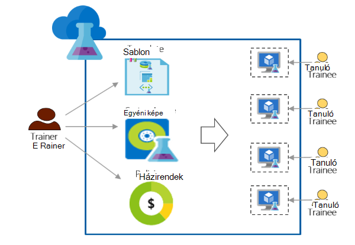

<properties
    pageTitle="Azure DevTest Labs használata – oktatás |} Microsoft Azure"
    description="Megtudhatja, hogy miként oktatás esetek Azure DevTest Labs használni."
    services="devtest-lab,virtual-machines"
    documentationCenter="na"
    authors="steved0x"
    manager="douge"
    editor=""/>

<tags
    ms.service="devtest-lab"
    ms.workload="na"
    ms.tgt_pltfrm="na"
    ms.devlang="na"
    ms.topic="article"
    ms.date="09/12/2016"
    ms.author="sdanie"/>

# Azure DevTest Labs használata – oktatás

Azure DevTest Labs fejlesztők/próba mellett számos esetek végrehajtásához használható. Ezeket az esetek egyike – oktatás laboratóriumi beállítása. Azure DevTest Labs lehetővé teszi, hogy hozzon létre egy labor, ahol megadhatja az egyéni sablonokat, amelyek minden tanuló hozhat létre azonos és elszigetelt környezetben – oktatás. Biztosíthatja, hogy oktatás környezetekben érhetők el az egyes tanuló csak akkor, ha szüksége van rájuk, és elég erőforrásokat – például virtuális gépeken futó - képzés szükséges tartalmaznak. Végül, egyszerűen megoszthatja a labor gyakornokok, amelyek egyetlen kattintással elérhetik azt.   

Azure DevTest Labs megfelel az alábbi bármilyen virtuális környezetben oktatás elvégzéséhez szükséges: 

-   Gyakornokok más gyakornokok által létrehozott VMs nem látható.
-   Minden oktatás gépi azonosnak kell lenniük.
-   Gyakornokok gyorsan lehet kiépítése környezetükben – oktatás
-   Költség szabályozhatja, hogy gyakornokok nem tudják elérni az további VMs szükségük van a képzés és is VMs leállítás, ha azok nem használja őket, mint biztosításával
-   Egyszerűen megoszthatja a oktatás labor az egyes tanuló
-   A tanfolyam labor újra és újra felhasználni

Ebben a cikkben megismerheti megfeleljen a korábban ismertetett oktatás követelményeknek és a részletes lépéseket követve állítsa be a labor – oktatás használható különböző Azure DevTest Labs szolgáltatásairól.  

## Az Azure DevTest Labs végrehajtási – oktatás

1. **Laboratóriumi létrehozása** 

    Labs az Azure DevTest Labs kiindulási pontként. Miután létrehozott egy labor, a feladatok hajthatók végre ilyen módon (gyakornokok) felhasználók felvétele az laboratóriumi házirendek beállítása szabályozhatja a költségek, határozza meg, hogy gyorsan hozhat létre virtuális képek és egyéb.   

    Megtudhatja, hogy az alábbi táblázatban lévő hivatkozásokra kattintva:

  	| Tevékenység                                                            | Milyen további                                                    |
|-----------------------------------------------------------------|----------------------------------------------------------------------|
| [Laboratóriumi létrehozása az Azure DevTest Labs](devtest-lab-create-lab.md) | Megtudhatja, hogy miként Azure DevTest Labs laboratóriumi létrehozása az Azure-portálon. |

2. **Hozzon létre oktatás VMs percben előre elkészített piactér képek és egyéni képek használatával** 
    
    Képek számos előre elkészített képeinek válassza az Azure piactéren elérhető, és elérhetővé teszi a tesztkörnyezetben gyakornokok számára. Ha előre elkészített képek nem felel meg igényeinek, létrehozhat egyéni kép: hozzon létre egy előre elkészített kép felhasználásával Azure piactérről a szükséges a képzés és mentése a virtuális tesztkörnyezetben egyéni képként szoftver telepítése virtuális laboratóriumi. 

    Megtudhatja, hogy az alábbi táblázatban lévő hivatkozásokra kattintva:

  	| Tevékenység                                                                              | Milyen további                                                                                                                                  |
|-----------------------------------------------------------------------------------|-------------------------------------------------------------------------------------------------------------------------------------------------|
| [Microsoft Azure piactéren képek konfigurálása](devtest-lab-configure-marketplace-images.md) | Megtudhatja, hogyan dolgozhat whitelist Azure piactéren elérhető képek; érdemes a – oktatás elérhetővé kijelölés csak a képeket.                 |
| [Hozzon létre egy egyéni képe](devtest-lab-create-template.md)                           | Egyéni kép készítése a szoftver van szüksége a használatáról, hogy a gyakornokok gyorsan létrehozhat egy virtuális az egyéni kép felhasználásával előre telepítésével. |

3. **Újból felhasználható sablonok, képzés gépekhez létrehozása** 

    Azure DevTest Labs egy képlete egy virtuális létrehozásához használt alapértelmezett értékű listáját. Létrehozhat egy képlet tesztkörnyezetben fejléccellát, kép, a virtuális méretet (Processzor és kombinációját RAM) és virtuális hálózat. Minden egyes tanuló megtekinthetik a képlet tesztkörnyezetben és egy virtuális létrehozásához. 

    Megtudhatja, hogy az alábbi táblázatban lévő hivatkozásokra kattintva:

  	| Tevékenység                                                                         | Milyen további                                                                                                          |
|------------------------------------------------------------------------------|-------------------------------------------------------------------------------------------------------------------------|
| [DevTest Labs képletek létrehozása VMs kezelése](devtest-lab-manage-formulas.md) | Megtudhatja, hogyan hozhat létre egy képlet által vesz fel egy képet, virtuális méretét (Processzor és RAM kombinációját) és egy virtuális hálózaton. |

4. **Vezérlőelem költségek**

    Azure DevTest Labs lehetővé teszi, hogy állított be egy házirendet laboratóriumi megadása egy tanuló tesztkörnyezetben létrehozott VMs maximális száma. 

    Ha többnapos oktatás tartja, és szeretné az összes VMs leállítása a nap egy adott időben, és automatikusan indítsa újra őket a következő napra, egyszerűen elvégezheti, hogy az automatikus-leállítás beállításával és automatikus indítás laboratóriumi házirendek. 

    Végül ha oktatóbemutató törölheti összes VMs egyszerre egy PowerShell-parancsprogramot futtatásával. 

    Megtudhatja, hogy az alábbi táblázatban lévő hivatkozásokra kattintva:

  	| Tevékenység                                                                                                                                    | Milyen további                                                      |
|-----------------------------------------------------------------------------------------------------------------------------------------|---------------------------------------------------------------------|
| [Labor házirendek meghatározása](devtest-lab-set-lab-policy.md)                                                                                    | Házirendek beállítása tesztkörnyezetben szabályozhatja költségeket.                       |
| [A labor használata egy PowerShell-parancsprogramot VMs törlése](devtest-lab-faq.md#how-can-i-automate-the-process-of-deleting-all-the-vms-in-my-lab) | Amikor befejeződött a képzés egy műveletet az összes labs törlése |

5. **Minden egyes tanuló laboratóriumi megosztása**

    Labs közvetlenül is elérhető, amely a gyakornokok megosztja-kapcsolaton keresztül. A gyakornokok még nincs Azure-fiókja van, feltéve, hogy egy [Microsoft-fiókkal](devtest-lab-faq.md#what-is-a-microsoft-account)rendelkeznek. Gyakornokok más gyakornokok által létrehozott VMs nem látható.  

    Megtudhatja, hogy az alábbi táblázatban lévő hivatkozásokra kattintva:

  	| Tevékenység                                                                                                                                | Milyen további                                                   |
|-------------------------------------------------------------------------------------------------------------------------------------|------------------------------------------------------------------|
| [Az Azure DevTest Labs laboratóriumi egy tanuló hozzáadása](devtest-lab-add-devtest-user.md)                                                     | Az Azure portal segítségével gyakornokok hozzáadása a oktatás labor.       |
| [Egy PowerShell-parancsprogramot használatával laboratóriumi gyakornokok hozzáadása](devtest-lab-add-devtest-user.md#add-an-external-user-to-a-lab-using-powershell) | A tanfolyam labor való felvételét gyakornokok automatizálhatja a PowerShell használatával. |
| [Laboratóriumi hivatkozását](devtest-lab-faq.md#how-do-i-share-a-direct-link-to-my-lab)                                                  | Megtudhatja, hogyan laboratóriumi is közvetlenül elérhető hivatkozás útján.        |

6. **A labor újra és újra felhasználni** 

    Automatizálható labor létrehozási, egyéni beállításait, például a erőforrás-kezelő sablon létrehozása és újra és újra létre azonos labs használatával. 

    Megtudhatja, hogy az alábbi táblázatban lévő hivatkozásokra kattintva:

  	| Tevékenység                                                                                                                               | Milyen további                                                      |
|------------------------------------------------------------------------------------------------------------------------------------|---------------------------------------------------------------------|
| [Erőforrás-kezelő sablon használatával laboratóriumi létrehozása](devtest-lab-faq.md#how-do-i-create-a-lab-from-an-azure-resource-manager-template) | Erőforrás-kezelő sablonok használata Azure DevTest Labs labs létrehozása |

[AZURE.INCLUDE [devtest-lab-try-it-out](../../includes/devtest-lab-try-it-out.md)]  

