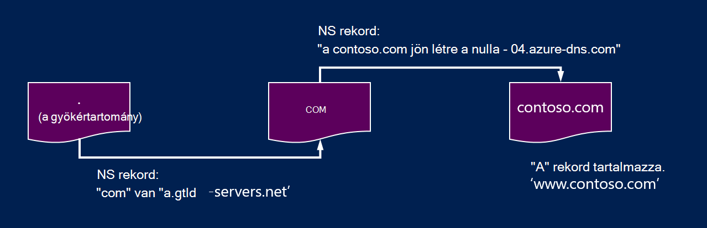
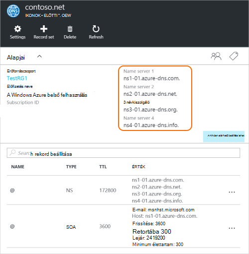

<properties
   pageTitle="A tartomány DNS Azure delegálása |} Microsoft Azure"
   description="Megtudhatja, hogyan tartomány meghatalmazás módosítása és Azure DNS-névkiszolgálók szolgáltatóra tartomány használatával."
   services="dns"
   documentationCenter="na"
   authors="sdwheeler"
   manager="carmonm"
   editor=""/>

<tags
   ms.service="dns"
   ms.devlang="na"
   ms.topic="get-started-article"
   ms.tgt_pltfrm="na"
   ms.workload="infrastructure-services"
   ms.date="06/30/2016"
   ms.author="sewhee"/>

# A tartomány Azure DNS delegálása

Azure DNS lehetővé teszi, hogy a DNS-zónát és Azure a tartomány DNS-rekordjának kezelését. Azure DNS elérjen egy adott tartomány DNS-lekérdezések sorrendben a tartománynak a szülő tartományból delegálni Azure DNS kell. Ne feledje Azure DNS nem a tartományregisztrálója. Ez a cikk ismerteti, hogy hogyan működik a tartomány meghatalmazás és Azure DNS-tartományok delegálásának.

## Hogyan működik a DNS-delegálás

### A tartományok és zónák

A Domain Name System tartományok hierarchia. A hierarchia elindítja a "" gyökértartomány, amelynek neve egyszerűen**.**.  Alatta a legfelső szintű tartományok, például "com", "nettó", "szervezeti", "Egyesült Királyság" vagy "jp" származnak.  Ezek alatti második szintű tartományok, például "org.uk" vagy "co.jp" is.  És így tovább. A tartomány DNS-hierarchiában van közzétéve külön DNS-zónák használatával. Ezek a zónák globálisan terjesztette, a világon a DNS-névkiszolgálók által üzemeltetett.

**A DNS-zóna**

A tartomány egy egyedi nevet a Domain Name System, például "contoso.com". A DNS-zóna használható egy adott tartomány DNS-rekordjait üzemelteti. Például a "contoso.com" tartomány DNS-rekordjait, például "mail.contoso.com" (a levelezési kiszolgáló) és a "www.contoso.com" (a webhelye) számos tartalmazhat.

**Tartományregisztrálónál**

Tartományregisztrálók olyan céget, akik megadhatja az internetes tartománynevet. Azok ellenőrzi, ha a használni kívánt internetes tartománynevet érhető el, és lehetővé teszi azt megvásárolni. Miután regisztrálta a tartománynevet, fogja a jogi tulajdonosa a tartomány nevét. Ha már van egy internetes tartománynevet, de a meglévő tartományregisztráló Azure DNS-delegálni kell használni.

>[AZURE.NOTE] További információt a ki a tulajdonosa egy adott tartomány nevét, vagy tartomány vásárlása olvashat, olvassa el [az Internet tartománykezelés az Azure Active Directory](https://msdn.microsoft.com/library/azure/hh969248.aspx).

### Meghatalmazás és felbontása

A DNS-kiszolgálók két típusa van:

- A _mérvadó_ DNS-kiszolgáló DNS-zónák tárolja. A DNS-lekérdezések csak azokat a zónák rekordok ad választ.
- _Rekurzív_ DNS-kiszolgáló nem működnek a DNS-zónák. Az összes DNS-lekérdezések hívja fel a szükséges adatok összegyűjtése mérvadó DNS-kiszolgálók ad választ.

>[AZURE.NOTE] Azure DNS-mérvadó DNS-szolgáltatást biztosít.  Nem ad egy rekurzív DNS-szolgáltatás.

> Egy rekurzív DNS-szolgáltatások biztosított külön-külön használni az Azure-féle infrastruktúra részeként automatikusan megtörténik a Felhőszolgáltatások és a VMs Azure-ban.  Ezeket a DNS-beállítások módosításával kapcsolatos további tudnivalókért lásd a [Névfeloldás Azure-ban](../virtual-network/virtual-networks-name-resolution-for-vms-and-role-instances.md#name-resolution-using-your-own-dns-server).

A PC-re és mobileszközökre DNS-ügyfelek általában hívja fel a egy rekurzív DNS-kiszolgálót az ügyfélalkalmazásokban szükséges DNS-lekérdezések végrehajtásához.

Amikor egy rekurzív DNS-kiszolgáló kap egy DNS-rekordot, például "www.contoso.com" lekérdezések, azt először kell keresse meg a névkiszolgáló a zónában, a "contoso.com" tartomány szolgáltatójánál. Ehhez azt a legfelső szintű névkiszolgálók kezdődik, és onnan megtalálja a névkiszolgáló a "com" zónában. Kattintson a "com" névkiszolgálókat keresse meg a névkiszolgáló a "contoso.com" zóna kérdezi le.  Végezetül alkalmas ezek "www.contoso.com" névkiszolgálóinak a lekérdezés.

Link feloldása a DNS-nevét. Feltétlenül elmondható DNS-feloldási például a következő CNAME további lépésekre is tartalmaz, de ez nem fontos, hogy hogyan működik a DNS-delegálás ismertetése.

Hogyan nem egy szülő-zónát "" és a névkiszolgálóira mutatnak a gyermek zóna? Ezt nem használja egy speciális típusú DNS-rekord neve az NS rekord (Névkiszolgáló jelző "névkiszolgáló"). Például a legfelső szintű zóna Névkiszolgálói rekordjait tartalmazza a "com", és látható a "com" zónában a Névkiszolgálók. A "com" zónába a Névkiszolgáló-rekordok "contoso.com", amely a "contoso.com" zónában a name servers jeleníti meg. A szülő a gyermek zónában a Névkiszolgáló-rekordok beállítása a tartomány delegálása nevezik.

Minden egyes meghatalmazás valójában két másolatát a Névkiszolgáló-rekordok; a szülő zónában, mutasson a gyermek, a másik pedig a gyermek zónában magát egy. A "a contoso.com a zónába a Névkiszolgáló-rekordok"contoso.com"(mellett a"com"a Névkiszolgáló-rekordok). Ezek az úgynevezett mérvadó Névkiszolgáló-rekordjait, és azok a gyermek zóna a csúcs elhelyezkedik.

## A tartomány Azure DNS delegálása

Miután létrehozta a DNS-zóna Azure DNS-ben, kell állítja be a szülő zónában Névkiszolgáló-rekordjait, hogy az Azure DNS névfeloldás a zóna mérvadó forrását. A tartományok tartományregisztrálótól vásárolta a tartományregisztráló tartalmazni fogja a Névkiszolgálói rekordok beállítása lehetőséget.

>[AZURE.NOTE] Nem kell a tartomány tulajdonjogával létrehozásához a DNS-zóna az Azure DNS-ben a tartomány nevét. Azonban kell Öné a tartomány beállítása az Azure DNS delegálás a tartományregisztrálónál.

Tegyük fel például, a "contoso.com" tartomány vásárlása, és a contoso.com nevét a zóna létrehozása az Azure DNS-ben. A tartomány tulajdonosa, mint a tartományregisztráló felajánlja a vezérlőt, amellyel a névkiszolgáló címei (Ez azt jelenti, hogy a Névkiszolgáló-rekordok) beállítása a tartomány. A tartományregisztráló ezeket a Névkiszolgáló-rekordokat a szülő tartományban, ebben az esetben ".com" tárolja. A világon ügyfelek majd irányítja át a tartományt az Azure DNS-zóna, "a contoso.com a DNS-rekordok feloldása meg.

### A név kiszolgálónevek keresése

A DNS-zóna Azure DNS-is delegálása, előtt először kell tudnia a zóna kiszolgálónevek nevét. Azure DNS lefoglalja a készletből névkiszolgálók minden alkalommal, amikor egy zóna jön létre.

A lásd: a zónába névkiszolgálók legegyszerűbben az Azure portálon keresztül.  Ebben a példában a "contoso.net" zóna névkiszolgálók rendelt "ns1-01.azure-dns.com", "ns2...-01.azure-dns .net", "ns3-01.azure-dns.org", és a "ns4-01.azure-dns.info":

 

Azure DNS mérvadó a Névkiszolgálói rekordok automatikusan létrehozza a zónában, a hozzárendelt névkiszolgálók tartalmazó.  A név kiszolgálónevek Azure PowerShell és Azure CLI megtekintéséhez egyszerűen beolvashatja ezeket a rekordokat.

Azure PowerShell használata esetén a mérvadó Névkiszolgáló-rekordok tudja visszaszerezni az alábbi képlettel történik. Megjegyzendő, hogy a rekord neve “@” hivatkozni kell a rekordokat a zóna a csúcs használják.

    PS> $zone = Get-AzureRmDnsZone –Name contoso.net –ResourceGroupName MyResourceGroup
    PS> Get-AzureRmDnsRecordSet –Name “@” –RecordType NS –Zone $zone

    Name              : @
    ZoneName          : contoso.net
    ResourceGroupName : MyResourceGroup
    Ttl               : 3600
    Etag              : 5fe92e48-cc76-4912-a78c-7652d362ca18
    RecordType        : NS
    Records           : {ns1-01.azure-dns.com, ns2-01.azure-dns.net, ns3-01.azure-dns.org,
                        ns4-01.azure-dns.info}
    Tags              : {}

A mérvadó Névkiszolgáló-rekordok beolvasásához, és így felfedezése a zónába névkiszolgálók is használhatja az Azure-platformok CLI:

    C:\> azure network dns record-set show MyResourceGroup contoso.net @ NS
    info:    Executing command network dns record-set show
        + Looking up the DNS Record Set "@" of type "NS"
    data:    Id                              : /subscriptions/.../resourceGroups/MyResourceGroup/providers/Microsoft.Network/dnszones/contoso.net/NS/@
    data:    Name                            : @
    data:    Type                            : Microsoft.Network/dnszones/NS
    data:    Location                        : global
    data:    TTL                             : 172800
    data:    NS records
    data:        Name server domain name     : ns1-01.azure-dns.com.
    data:        Name server domain name     : ns2-01.azure-dns.net.
    data:        Name server domain name     : ns3-01.azure-dns.org.
    data:        Name server domain name     : ns4-01.azure-dns.info.
    data:
    info:    network dns record-set show command OK

### Meghatalmazás beállítása

Minden tartományregisztráló a tartomány névkiszolgáló-rekordok módosítása a saját DNS-kezelő eszközök tartalmaz. A Névkiszolgáló-rekordok szerkesztése a tartományregisztráló DNS-kezelés lapot, és a Névkiszolgálói rekordok lecserélése készült Azure DNS szerint a lehetőségekből.

Ha a tartomány Azure DNS delegálása, Azure DNS által megadott név kiszolgálónevek kell használnia.  Mindig kell használni az összes 4 neve kiszolgálónevek, függetlenül attól, a tartomány nevét.  Tartomány meghatalmazás nincs szükség a legfelső szintű tartománynevek tartományként a tartomány neve-kiszolgáló neve.

Ne használjon "kapcsolása rekordok" mutasson az Azure DNS névkiszolgáló IP-címek, mivel az alábbi IP-címek a jövőben változhat. Neve kiszolgáló nevek használata a saját zónában, más néven "méltóság névkiszolgálókkal" küldöttségek jelenleg nem támogatottak a Azure DNS-ben.

### Ellenőrizze a névfeloldás használata

Miután elkészült a meghatalmazás, ellenőrizheti, hogy működik-e névfeloldás eszközzel például "nslookup" lekérdezése a SOA rekord a zóna (ez is automatikusan létrejön a zóna létrehozásakor).

Ne feledje, hogy nem kell az Azure DNS-névkiszolgálók, adja meg, mivel a normál DNS-felbontás folyamat fogja találni automatikusan a Névkiszolgálók, ha a meghatalmazás megfelelően be van állítva.

    nslookup –type=SOA contoso.com

    Server: ns1-04.azure-dns.com
    Address: 208.76.47.4

    contoso.com
    primary name server = ns1-04.azure-dns.com
    responsible mail addr = msnhst.microsoft.com
    serial = 1
    refresh = 900 (15 mins)
    retry = 300 (5 mins)
    expire = 604800 (7 days)
    default TTL = 300 (5 mins)

## Azure DNS-meghatalmazó alszint tartományok

Ha szeretné külön alárendelt zóna beállítása, átadhatja a alszint tartomány Azure DNS-ben. Például problémákat beállítása és delegált "contoso.com" az Azure DNS tegyük fel, hogy szeretné, hogy egy külön gyermek zóna beállítása "partners.contoso.com".

A normál meghatalmazás, állíthat be egy alszint tartományt követi a internetcímre. Az egyetlen különbség, amely a 3 a Névkiszolgáló-rekordjait a szülő zónában "contoso.com" Azure DNS, hanem az beállítja, hogy tartományregisztrálók keresztül kell létrehozni.

1. A gyermek zóna "partners.contoso.com" létrehozása az Azure DNS-ben.
2. Keresse meg a mérvadó Névkiszolgáló-rekordok a gyermek zónában beszerzése a névkiszolgáló a gyermek zóna Azure DNS-ben.
3. A gyermek zóna delegálása Névkiszolgáló-rekordjait a szülő zónában, mutasson a gyermek zóna konfigurálásával.

### A delegálni alszint tartomány

Az alábbi PowerShell példa bemutatja, hogyan működik. Ezeket a lépéseket az Azure-portálon keresztül, vagy az Azure-platformok CLI keresztül futtatható.

#### Lépés: 1. A szülő-gyermek zónák létrehozása

Elsőként hozzunk létre a szülő-gyermek zónák. Ezek az azonos erőforráscsoport vagy más erőforrás-csoportok lehetnek.

    $parent = New-AzureRmDnsZone -Name contoso.com -ResourceGroupName RG1
    $child = New-AzureRmDnsZone -Name partners.contoso.com -ResourceGroupName RG1

#### Lépés: 2. Lekérés a Névkiszolgálói rekordok

Ezután azt lekérni a mérvadó Névkiszolgáló-rekordok gyermek zónában, a következő példában látható módon.  A gyermek zónába névkiszolgálók tartalmaz.

    $child_ns_recordset = Get-AzureRmDnsRecordSet -Zone $child -Name "@" -RecordType NS

#### 3 a lépést. Meghatalmazott a gyermek zóna

A szülő zónában elvégzéséhez a meghatalmazás beállítása megfelelő NS rekord létrehozása Figyelje meg, hogy a rekord beállítása a szülő zónában megegyezik a gyermek zóna nevével, ebben az esetben "partnerek".

    $parent_ns_recordset = New-AzureRmDnsRecordSet -Zone $parent -Name "partners" -RecordType NS -Ttl 3600
    $parent_ns_recordset.Records = $child_ns_recordset.Records
    Set-AzureRmDnsRecordSet -RecordSet $parent_ns_recordset

### Ellenőrizze a névfeloldás használata

Ellenőrizheti, hogy minden helyesen van beállítva a SOA rekordot a gyermek zóna be megjeleníti.

    nslookup –type=SOA partners.contoso.com

    Server: ns1-08.azure-dns.com
    Address: 208.76.47.8

    partners.contoso.com
        primary name server = ns1-08.azure-dns.com
        responsible mail addr = msnhst.microsoft.com
        serial = 1
        refresh = 900 (15 mins)
        retry = 300 (5 mins)
        expire = 604800 (7 days)
        default TTL = 300 (5 mins)

## Következő lépések

[DNS-zónák kezelése](dns-operations-dnszones.md)

[DNS-rekordok kezelése](dns-operations-recordsets.md)

