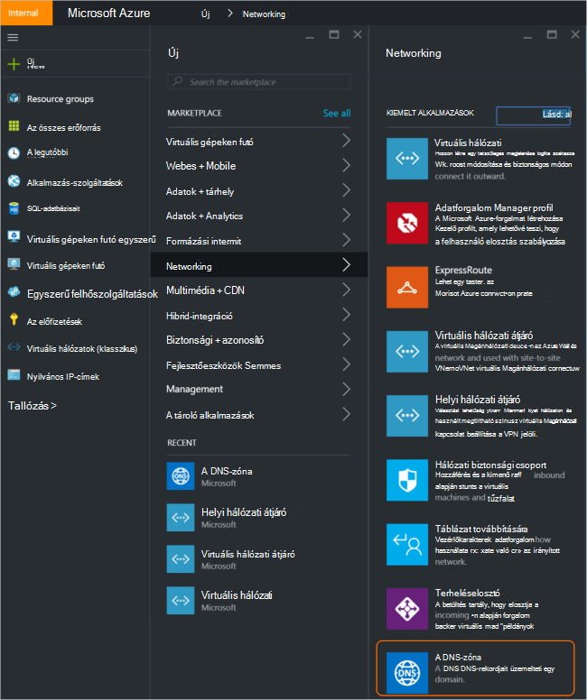
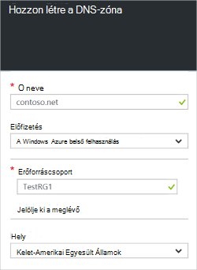
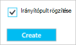
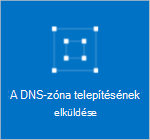
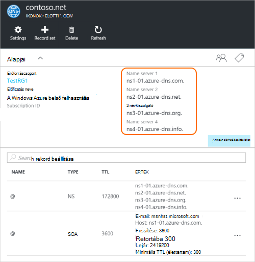
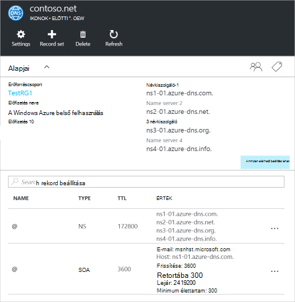

<properties
   pageTitle="Hogyan lehet létrehozni és kezelni a DNS-zóna az Azure-portálon |} Microsoft Azure"
   description="Megtudhatja, hogy miként hozhat létre a DNS-zónák Azure DNS. Ez a lépésenkénti útmutató létrehozása és kezelése a első DNS-és a DNS-tartományt az Azure portálon szolgáltatója."
   services="dns"
   documentationCenter="na"
   authors="sdwheeler"
   manager="carmonm"
   editor=""
   tags="azure-resource-manager"/>

<tags
   ms.service="dns"
   ms.devlang="na"
   ms.topic="article"
   ms.tgt_pltfrm="na"
   ms.workload="infrastructure-services"
   ms.date="08/16/2016"
   ms.author="sewhee"/>

# A DNS-zóna létrehozása az Azure-portálon

> [AZURE.SELECTOR]
- [Azure portál](dns-getstarted-create-dnszone-portal.md)
- [A PowerShell](dns-getstarted-create-dnszone.md)
- [Azure CLI](dns-getstarted-create-dnszone-cli.md)

Ez a cikk azt ismerteti, hogy a DNS-zóna létrehozása az Azure portál használatával lépéseit. A DNS-zóna PowerShell alrendszerrel vagy CLI is létrehozhat.

[AZURE.INCLUDE [dns-create-zone-about](../../includes/dns-create-zone-about-include.md)]

### Azure DNS-címkék

Címkék neve – érték párokká listáját, és Azure-kezelő által címke erőforrásokhoz számlázási vagy csoportosítási célokat szolgálnak. További információt a címkék témakörben [használata címkék az Azure erőforrások rendszerezéséhez](../resource-group-using-tags.md).

Címkék az Azure-portálon a **Beállítások** lap segítségével, a DNS-zóna hozzáadása.

## Hozzon létre egy DNS-zóna

1. Jelentkezzen be az Azure portálra

2. A központi menüben kattintson a **Új > Hálózat >** , és válassza a **DNS-zóna** a DNS-zóna lap megnyitásához.

    

3. Kattintson a **DNS-zóna** lap alján kattintson a **Létrehozás** gombra. Ekkor megnyílik a **Hozzon létre a DNS-zóna** lap.

    

4. Kattintson a **Hozzon létre a DNS-zóna** lap a DNS-zóna nevet. Például *: contoso.com*. [Tudnivalók a DNS-zóna nevek](#names) a fenti szakasz megjelenítéséhez.

5. Ezután adja meg a használni kívánt erőforráscsoport. Hozzon létre egy új erőforráscsoport, vagy válasszon egy beállítást, amely már létezik.

6. A **hely** legördülő listából az erőforráscsoport helyének megadása Megjegyzés: Ez a beállítás azt a helyet, nem a DNS-zóna helyet az erőforráscsoport hivatkozó. A tényleges DNS-zóna erőforrás automatikusan "globális" pedig nem, amit is (vagy kell) adja meg a portálon.

7. A **PIN-kód irányítópult** jelölőnégyzetet bejelölve, ha azt szeretné, egyszerűen keresse meg az új zóna az irányítópulton megtarthatja. Kattintson a **Létrehozás**gombra.

    

8. Után kattintson a Létrehozás gombra, látni fogja az új zóna épp konfigurálja az irányítópulton.

    

9. Az új zóna létrehozásakor a lap az új zóna az irányítópulton nyílik meg.

## Rekordok megtekintése

A DNS-zóna létrehozása is az alábbi rekordot hoz létre:

- A "Start a SOA" (jogosultság) rekord. A SOA a legfelső szintű minden DNS-zóna.
- A mérvadó névkiszolgálói (NS) rekordok. Ezek megjelenítése, mely névkiszolgálók üzemeltet a zóna. Azure DNS névkiszolgálók erőforráskészlethez tartozik használja, és így más névkiszolgálók is rendelt különböző zónák Azure DNS-ben. [A tartomány Azure DNS meghatalmazott](dns-domain-delegation.md) talál további információt.

A rekordok az Azure portálról megtekintése

1. A **DNS-zóna** lap kattintson a **minden beállítás** a DNS-zóna a **Beállítások lap** megnyitásához.

    

2. A Essentials ablak alsó részén akkor láthatja a rekordot a DNS-zóna állítja be.

    

## Teszt

A DNS-zóna tesztelheti a DNS-eszközök, például az nslookup, alaposabban vagy a [Feloldás-Dns_név PowerShell-parancsmag](https://technet.microsoft.com/library/jj590781.aspx)használatával.

Hogy Ön még nem még a tartomány használata az új zóna Azure DNS-ben, szüksége lesz irányítsa át a DNS-lekérdezés közvetlenül az egyik a Névkiszolgálók a zóna. A Névkiszolgálók a zóna szerepelnek a Névkiszolgáló-rekordok által megjelenített `Get-AzureRmDnsRecordSet` felett. Ügyeljen a helyette a megfelelő értékeket, a zóna be az alábbi parancsot.

    nslookup
    > set type=SOA
    > server ns1-01.azure-dns.com
    > contoso.com

    Server: ns1-01.azure-dns.com
    Address:  208.76.47.1

    contoso.com
            primary name server = ns1-01.azure-dns.com
            responsible mail addr = msnhst.microsoft.com
            serial  = 1
            refresh = 900 (15 mins)
            retry   = 300 (5 mins)
            expire  = 604800 (7 days)
            default TTL = 300 (5 mins)

## A DNS-zóna törlése

A DNS-zóna közvetlenül a portálon törölheti. Mielőtt törölné a DNS-zóna Azure DNS-ben, szüksége lesz rekordok minden készletben, kivéve a SOA és a Névkiszolgálói rekordok a legfelső szintű a zóna a zóna létrehozásakor automatikusan létrehozott törlése.

1. Keresse meg a törölni kívánt zónában a **DNS-zóna** lap, majd kattintson a **Törlés** elemre a lap tetején.

2. Megjelenik egy üzenet, tudatja, hogy törölnie kell a rekordokat minden készletben, kivéve a SOA és a Névkiszolgálói rekordok automatikusan létrehozott. Ha már törölte a rekord beállítása, kattintson az **Igen**gombra. Megjegyzendő, hogy a DNS-zóna törlésekor a portálról, az a DNS-zóna tartozó erőforráscsoport nem lehet törölni.

## Következő lépések

Miután létrehozta a DNS-zóna, létrehozása [rekord beállítása és a rekordok](dns-getstarted-create-recordset-portal.md) névfeloldás tartománya internetes indításához.
