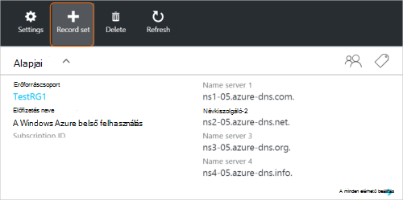
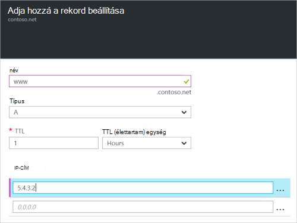

<properties
   pageTitle="Hozzon létre egy rekordkészletben és az Azure portálon DNS-zóna rekordjainak |} Microsoft Azure"
   description="A host rekordok létrehozása az Azure DNS és rekord beállítása és az Azure portálon rekordok létrehozása"
   services="dns"
   documentationCenter="na"
   authors="sdwheeler"
   manager="carmonm"
   editor=""
   tags="azure-resource-manager"/>

<tags
   ms.service="dns"
   ms.devlang="na"
   ms.topic="article"
   ms.tgt_pltfrm="na"
   ms.workload="infrastructure-services"
   ms.date="08/16/2016"
   ms.author="sewhee"/>

# DNS-rekord beállítása és a rekordok létrehozása az Azure portál használatával

> [AZURE.SELECTOR]
- [Azure portál](dns-getstarted-create-recordset-portal.md)
- [A PowerShell](dns-getstarted-create-recordset.md)
- [Azure CLI](dns-getstarted-create-recordset-cli.md)

Ebben a cikkben megismerkedhet azon a folyamaton, bejegyzések és a rekordok beállítása létrehozása az Azure portál használatával. Miután létrehozta a DNS-zóna, a tartomány felvétele a DNS-rekordokat. Ehhez először megtudhatja, hogy DNS-rekordokat és a rekord beállítása.

[AZURE.INCLUDE [dns-about-records-include](../../includes/dns-about-records-include.md)]

## Hozzon létre egy rekordot, és a rekord

A következő példa bemutatja egy rekordkészletben és a rekord létrehozásának az Azure portál használatával. A "A" DNS-rekordtípus használjuk.

1. Jelentkezzen be a portálra.

2. A **DNS-zóna** lap, amelyben létre szeretne hozni egy rekordkészletben megnyitásához.

3. A **DNS-zóna** a lap tetején jelölje be a **rekord beállítása** a **Hozzáadás rekord megadása** lap megnyitásához.

    

4. Kattintson a **Hozzáadás rekord megadása** lap a rekordkészletben nevet. Ha például a rekordkészletben "**www**" sikerült nevet.

    

5. Jelölje ki a megfelelő rekordtípusra szeretne létrehozni. Ha például jelölje be **A**.

6. A **TTL (élettartam)**beállítása. Az alapértelmezett a portálon live érdemes egy órával.

7. Adja hozzá az IP-címek, soronként egy IP-címet. A javasolt rekordkészletben neve és a korábban ismertetett rekordtípus használata esetén adja hozzá a IPv4-címek **a www rekordkészlet rekordjában** .

8. Futtatása után vegye fel az IP-címét, jelölje be a lap alján az **OK gombra** . A DNS-rekord beállítása jön létre.

## Következő lépések

A rekordot, és a rekordok című témakörben [az Azure portál használatával kezelheti a DNS-rekordokat és a rekord állítja be](dns-operations-recordsets-portal.md).

Azure DNS szolgáltatással kapcsolatos további tudnivalókért olvassa el a az [Azure DNS – áttekintés](dns-overview.md)című témakört.
