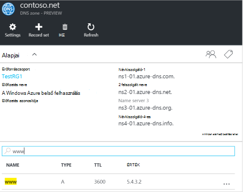
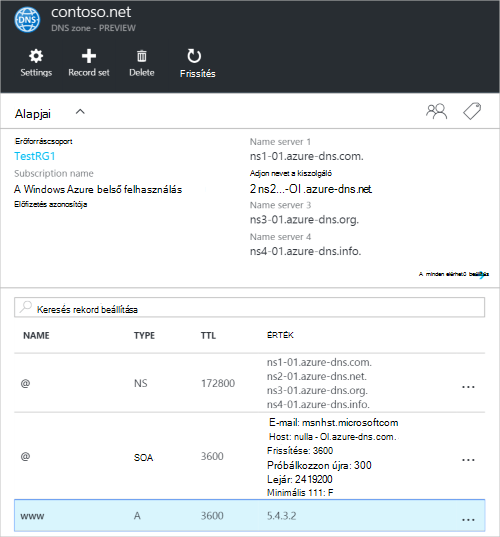
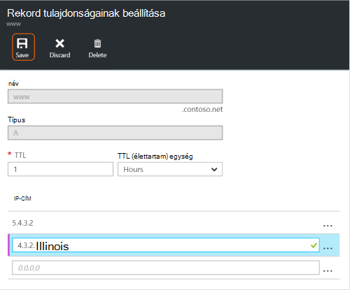
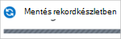
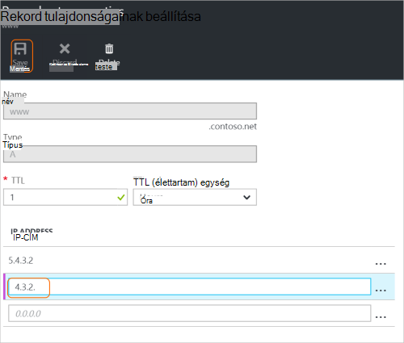
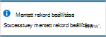
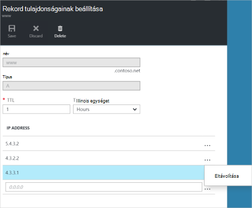
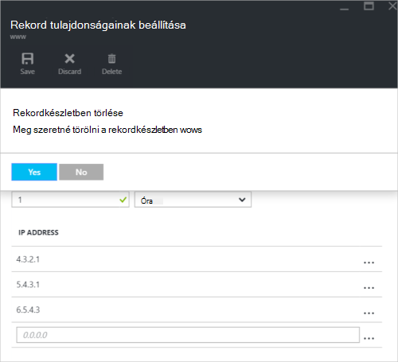

<properties
   pageTitle="DNS-rekord beállítása és az Azure portálon rekordok kezelése |} Microsoft Azure"
   description="DNS kezelése rekord állítja be, és rekordok, ha a tartomány Azure DNS-szolgáltatója."
   services="dns"
   documentationCenter="na"
   authors="sdwheeler"
   manager="carmonm"
   editor=""
   tags="azure-resource-manager"/>

<tags
   ms.service="dns"
   ms.devlang="na"
   ms.topic="article"
   ms.tgt_pltfrm="na"
   ms.workload="infrastructure-services"
   ms.date="08/16/2016"
   ms.author="sewhee"/>

# DNS-rekordok kezelése, és a rekord beállítja az Azure portál használatával

> [AZURE.SELECTOR]
- [Azure portál](dns-operations-recordsets-portal.md)
- [Azure CLI](dns-operations-recordsets-cli.md)
- [A PowerShell](dns-operations-recordsets.md)

Ez a cikk bemutatja, hogyan kezelheti a rekord beállítása és a DNS-zóna rekordjainak az Azure portál használatával.

Fontos, hogy a DNS-rekord beállítása és az egyes DNS-rekordok közötti különbség. Egy rekordkészletben gyűjteménye, amely lehet ugyanaz a neve, azonos típusú rekordok zónában. További tudnivalókért lásd: [Hozzon létre a DNS-rekord beállítása és a rekordok az Azure portál használatával](dns-getstarted-create-recordset-portal.md).

## Hozzon létre egy új rekordkészletben és rögzítése

Az Azure-portálon beállítása egy rekord létrehozásához, olvassa el a [DNS-rekordok létrehozása az Azure portál használatával](dns-getstarted-create-recordset-portal.md)című témakört.

## Megtekintheti egy rekordkészletben

1. Az Azure-portálon nyissa meg a **DNS-zóna** lap.

2. Keresse meg a rekordkészlet, és jelölje ki. Ekkor megnyílik a rekord is beállítható tulajdonságokat.

    

## Új rekord hozzáadása egy rekordkészletben

Bármely rekordkészletben legfeljebb 20 rekordok is adhat. Egy rekordkészletben két elemekről nem tartalmazhat. Üres rekord beállítása (a nulla rekordok) hozhatók létre, de nem jelennek meg az Azure DNS-névkiszolgálókat. Típusú CNAME rekord beállítása egy rekord legfeljebb is tartalmazhat.

1. Kattintson a DNS-zóna **rekord tulajdonságok megadása** lap a-rekord létrehozása kívánt rekord beállítása.

    

2. Adja meg a bejegyzés tulajdonságainak beállítása úgy, hogy a mezők kitöltése.

    

2. Kattintson a **Mentés** elemre a lap tetején a beállítások mentéséhez. Zárja be a lap.

3. Sarokban jelenik meg, hogy menti-e a rekordot.

    

Miután mentette a rekordot, a **DNS-zóna** lap az értékek tükrözni fogja az új rekord.

## Rekordok frissítését

Ha egy meglévő rekord beállítása egy rekord, akkor a mezőket, frissítheti a megfelelő rekordtípusra dolgozik függ.

1. A rekordok beállítása a **rekord tulajdonságok megadása** lap a keresse meg a bejegyzést.

2. Módosítsa a rekordot. Ha módosítja egy rekordot, módosíthatja a rendelkezésre álló beállítások a bejegyzéshez. A következő példában az **IP-cím** mező be van jelölve, és az IP-cím éppen módosított.

    

3. Kattintson a **Mentés** elemre a lap tetején a beállítások mentéséhez. A jobb felső sarokban látni fogja az értesítést, amely a rekord mentette.

    

A rekord mentését követően az értékeket a rekord beállítása a **DNS-zóna** lap tükrözni fogja a frissített rekordot.

## Rekord eltávolítása egy rekordkészletben

Ha el szeretne távolítani egy rekordkészletben rekordok az Azure portálon is használhatja. Figyelje meg, hogy az utolsó rekord eltávolítása egy rekordkészletben a program nem törli a rekord is beállítható.

1. A rekordok beállítása a **rekord tulajdonságok megadása** lap a keresse meg a bejegyzést.

2. Kattintson a bejegyzésre, amelyet el szeretne távolítani. Válassza a **eltávolítása**.

    

3. Kattintson a **Mentés** elemre a lap tetején a beállítások mentéséhez.

3. A rekord eltávolítása után az értékeket az a rekordot a **DNS-zóna** lap a tükrözni fogja eltávolítása.

## Rekord törlése

1. A **rekord tulajdonságainak beállítása** a rekord lap meg, kattintson a **Törlés**gombra.

    

2. Egy üzenetben kérdés jelenik meg, ha a rekordkészlet törölni szeretné.

3. Győződjön meg arról, hogy neve megegyezik a rekordkészlet kívánt törlése, és kattintson az **Igen**gombra.

4. A **DNS-zóna** lap ellenőrizze, hogy a rekordkészlet már nem látható.

## NS és SOA a rekordokkal végezhető műveletek

Automatikusan létrehozott SOA és a Névkiszolgálói rekordok másképp kezelhetők a többi rekordtípust.

### SOA rekordok módosítása

Nem lehet hozzáadni, vagy távolítsa el a bejegyzéseket a zóna csúcs értéken automatikusan létrehozott SOA rekordból (neve = "@"). A paraméterek (kivéve az "Host") a SOA rekordon belül bármelyikét módosíthatja, és a rekord beállítása a TTL (élettartam).

### A zone csúcs a Névkiszolgálói rekordok módosítása

Nem hozzáadása, eltávolítása, és nem módosíthatók a rekordokat, az automatikusan létrehozott, a zóna csúcs értéken NS rekord (neve = "@"). Csak módosítása, hogy engedélyezve van, hogy a TTL (élettartam) rekordkészlet módosítása.

### Törölje a SOA vagy NS rekord beállítása

Nem lehet törölni a SOA és NS rekord állítja be, a zóna csúcs (neve = "@") , amelyek automatikusan jönnek létre a zóna létrehozásakor. Törölt automatikusan a zóna törlésekor.

## Következő lépések

-   Azure DNS szolgáltatással kapcsolatos további tudnivalókért olvassa el a az [Azure DNS – áttekintés](dns-overview.md)című témakört.
-   DNS automatizálása kapcsolatos további tudnivalókért olvassa el a [létrehozásához a DNS-zónák és rekord beállítása a .NET SDK használatával](dns-sdk.md)című témakört.
-   További információt a fordított DNS-rekordok [kezelése a PowerShell használatá szolgáltatások fordított DNS-rekordok](dns-reverse-dns-record-operations-ps.md)megtekintése
