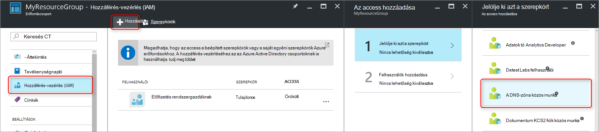
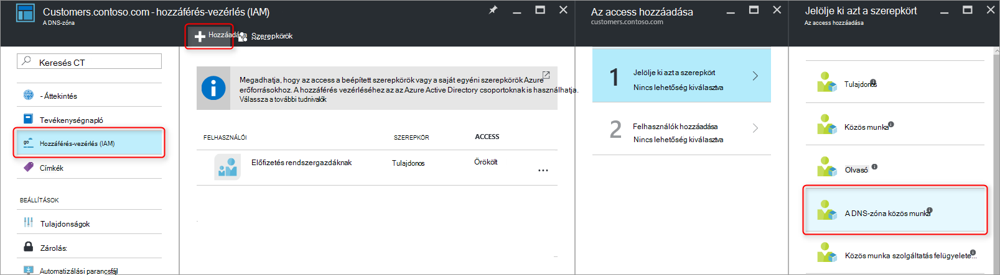
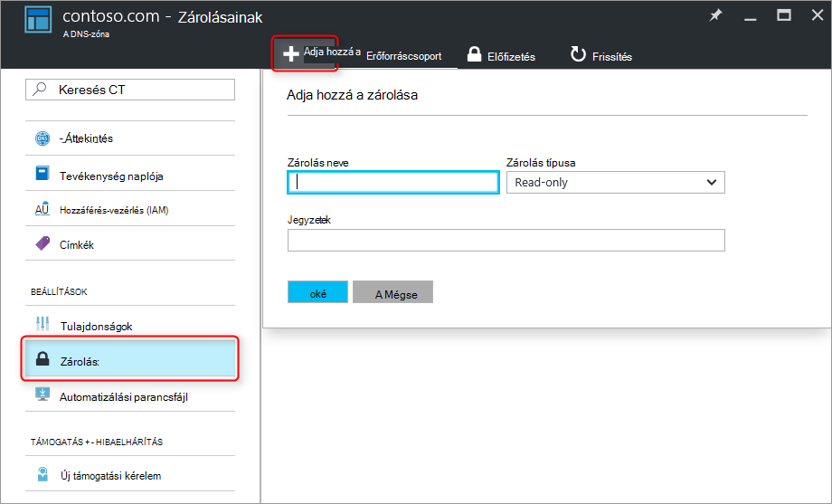

<properties 
   pageTitle="DNS-zónák és a rekordok |} Microsoft Azure" 
   description="Hogyan védheti a DNS-zónák és a Microsoft Azure DNS-rekord beállítása." 
   services="dns" 
   documentationCenter="na" 
   authors="jtuliani" 
   manager="carmonm" 
   editor=""/>

<tags
   ms.service="dns"
   ms.devlang="na"
   ms.topic="article"
   ms.tgt_pltfrm="na"
   ms.workload="infrastructure-services" 
   ms.date="10/20/2016"
   ms.author="jtuliani"/>

# Védelmét a DNS-zónák és rekordok

DNS-zónák és a rekordok olyan fontos erőforrásoktól. A DNS-zóna vagy akár csak egyetlen DNS-rekord törlése egy teljes szolgáltatás üzemszünetek eredményez.  Éppen ezért fontos, hogy a kritikus DNS-zónák és rekordok védeni-e illetéktelenül vagy véletlen módosítások.

Ez a cikk bemutatja, hogyan Azure DNS lehetővé teszi, hogy a DNS-zónák és a rekordok, ezek a változások elleni védelmét.  Azt alkalmazni az Azure-kezelő által biztosított két hatékony biztonsági funkciókat: [szerepköralapú hozzáférés-vezérlés](../active-directory/role-based-access-control-what-is.md) és az [erőforrás-zárolások](../resource-group-lock-resources.md).

## Szerepköralapú hozzáférés-vezérlés

Azure szerepköralapú hozzáférés vezérlő (RBAC) lehetővé teszi, hogy az Azure felhasználók, csoportok és erőforrások külön hozzáférés kezelése. RBAC használ, adhat az access mennyiségét pontosan, hogy a felhasználók munkájuk elvégzéséhez szükséges. Miként RBAC segít hozzáférés kezelése a kapcsolatos további tudnivalókért olvassa el a [Mi az szerepköralapú hozzáférés-vezérlés](../active-directory/role-based-access-control-what-is.md)című témakört.

### A "DNS Zone közreműködői" szerepkör

A "DNS Zone közreműködői" feladata DNS erőforrások kezelésére szolgáló Azure által biztosított beépített szerepkörbe.  DNS-zóna közreműködői engedélyek hozzárendelése egy felhasználónak vagy csoportnak lehetővé teszi, hogy a csoport DNS erőforrásokat, de nem bármilyen más típusú erőforrások kezelése.

Tegyük fel, hogy az erőforrás csoport "myzones" Contoso Corporation öt zónák tartalmazza. A DNS-rendszergazda erőforráscsoport "DNS Zone közös munka" engedélyek megadása, lehetővé teszi, hogy ezeket a DNS-zónák teljes hozzáféréssel. Elkerülhető is szükséges engedélyek megadására, például a DNS-rendszergazda nem hozható létre vagy állítsa le a virtuális gépeken futó.

A RBAC engedélyeket társíthat a legegyszerűbben [az Azure portálon keresztül](../active-directory/role-based-access-control-configure.md).  Nyissa meg a "Hozzáférés-vezérlés (IAM)" lap az erőforráscsoport, majd kattintson a "Hozzáadás", jelölje ki a "DNS Zone közreműködői" szerepkört és elemet, majd a szükséges felhasználók vagy csoportok engedélyeket szeretne adni.

Engedélyek is lehet [nyújtani Azure PowerShell használatával](../active-directory/role-based-access-control-manage-access-powershell.md):

    # Grant 'DNS Zone Contributor' permissions to all zones in a resource group
    New-AzureRmRoleAssignment -SignInName <user email address> -RoleDefinitionName "DNS Zone Contributor" -ResourceGroupName <resource group name>

A megfelelő parancs [az Azure CLI keresztül](../active-directory/role-based-access-control-manage-access-azure-cli.md)is érhető el:

    # Grant 'DNS Zone Contributor' permissions to all zones in a resource group
    azure role assignment create --signInName  <user email address> --roleName "DNS Zone Contributor" --resourceGroup <resource group name>

### Zóna szintjét RBAC

Azure RBAC szabályok alkalmazható egy előfizetését, egy erőforrás csoportot vagy egy adott erőforrás. Azure DNS, ha adott erőforrás egy egyéni DNS-zóna, vagy akár egyéni rekordkészletben lehet.

Tegyük fel, hogy az erőforrás csoport "myzones" a contoso.com zónában, és egy subzone "customers.contoso.com", amelyben CNAME rekordok létrehozása az egyes ügyfélfiók tartalmazza.  A CNAME rekordok kezelésére szolgáló fiókot kell-e kiosztani engedélyek csak a "customers.contoso.com" zóna rekordjainak létrehozásához, az access nem kell a többi zóna.

Lehet adni a zóna RBAC engedélyek beállítása az Azure portálon keresztül.  Nyissa meg a "Hozzáférés-vezérlés (IAM)" lap, a zóna, majd kattintson a "Hozzáadás", majd jelölje ki a "DNS Zone közreműködői" szerepkört és jelölje ki a szükséges felhasználók vagy csoportok engedélyeket szeretne adni.

Engedélyek is lehet [nyújtani Azure PowerShell használatával](../active-directory/role-based-access-control-manage-access-powershell.md):

    # Grant 'DNS Zone Contributor' permissions to a specific zone
    New-AzureRmRoleAssignment -SignInName <user email address> -RoleDefinitionName "DNS Zone Contributor" -ResourceGroupName <resource group name> -ResourceName <zone name> -ResourceType Microsoft.Network/DNSZones

A megfelelő parancs [az Azure CLI keresztül](../active-directory/role-based-access-control-manage-access-azure-cli.md)is érhető el:

    # Grant 'DNS Zone Contributor' permissions to a specific zone
    azure role assignment create --signInName <user email address> --roleName "DNS Zone Contributor" --resource-name <zone name> --resource-type Microsoft.Network/DNSZones --resource-group <resource group name>

### Rekord szint RBAC beállítása

További is lépjen egy lépésben. Fontolja meg a levelezési rendszergazda Contoso Corporation, akinek az MX rekordok és a TXT rekordok a csúcs a "contoso.com" zóna hozzáférésre van szüksége.  Noémi a nem más MX vagy a TXT rekordok, illetve bármely más típusú rekordok hozzáférésre van szükségük.  Azure DNS lehetővé teszi, hogy pontosan, hogy a levelezési rendszergazda hozzáférésre van szüksége a rekordok rekordkészletben szintre, de engedélyeket társíthat.  A levelezési rendszergazda meg kell adni a pontosan a vezérlő kikkel van szüksége, és nem tudja, hogy a módosításokat.
  
Az Azure portálon, a "Felhasználók" gomb használata a rekordkészletben lap keresztül rekordkészlet – webhelycsoportszintű RBAC engedélyek állítható be:

Rekordkészlet – webhelycsoportszintű RBAC engedélyek is lehet [nyújtani Azure PowerShell használatával](../active-directory/role-based-access-control-manage-access-powershell.md):

    # Grant permissions to a specific record set
    New-AzureRmRoleAssignment -SignInName <user email address> -RoleDefinitionName "DNS Zone Contributor" -Scope "/subscriptions/<subscription id>/resourceGroups/<resource group name>/providers/Microsoft.Network/dnszones/<zone name>/<record type>/<record name>" 

A megfelelő parancs [az Azure CLI keresztül](../active-directory/role-based-access-control-manage-access-azure-cli.md)is érhető el:

    # Grant permissions to a specific record set
    azure role assignment create --signInName <user email address> --roleName "DNS Zone Contributor" --scope "/subscriptions/<subscription id>/resourceGroups/<resource group name>/providers/Microsoft.Network/dnszones/<zone name>/<record type>/<record name>"

### Egyéni szerepkörök

A beépített "DNS Zone közreműködői" szerepkör lehetővé teszi, hogy a DNS-erőforrás teljes hozzáféréssel. Akkor is létrehozásához a saját felhasználói Azure szerepkörök, akár finomabb eltérés figyelembevételével vezérlő megadását.

Fontolja meg újra a példában, amelyben minden egyes Contoso Corporation ügyfélfiók egy CNAME rekordot a zónában "customers.contoso.com" létrejön.  A következő CNAME kezelésére szolgáló fiók engedélyt fognak csak a CNAME rekordok kezelésére.  Majd még nem lehet (például az MX rekordok módosítása) más típusú rekordok módosítását, vagy végezzen zóna szintű műveletek, például a zóna törlése.

A következő példa bemutatja egy egyéni szerepkör-definíció csak a CNAME rekordok kezelésére szolgáló:

    {
        "Name": "DNS CNAME Contributor",
        "Id": "",
        "IsCustom": true,
        "Description": "Can manage DNS CNAME records only.",
        "Actions": [
            "Microsoft.Network/dnsZones/CNAME/*",
            "Microsoft.Network/dnsZones/read",
            "Microsoft.Authorization/*/read",
            "Microsoft.Insights/alertRules/*",
            "Microsoft.ResourceHealth/availabilityStatuses/read",
            "Microsoft.Resources/deployments/*",
            "Microsoft.Resources/subscriptions/resourceGroups/read",
            "Microsoft.Support/*"
        ],
        "NotActions": [
        ],
        "AssignableScopes": [
            "/subscriptions/ c276fc76-9cd4-44c9-99a7-4fd71546436e"
        ]
    }

A műveletek tulajdonság a következő DNS-specifikus engedélyeket határozza meg:

- `Microsoft.Network/dnsZones/CNAME/*`CNAME rekordok teljes hozzáféréssel támogatás
- `Microsoft.Network/dnsZones/read`olvassa el a DNS-zónák, de nem módosíthatja őket, így kívánt lásd: a zóna, amelyben a CNAME létrehozása engedélyt.

A hátralévő tevékenységek másolja a [DNS Zone munkatársi beépített szerepkörök](../active-directory/role-based-access-built-in-roles.md#dns-zone-contributor).

>[AZURE.NOTE] Egyéni RBAC szerepkör alapján, hogy a rekord beállítása törlés, miközben továbbra is lehetővé teheti, hogy frissíteni kell nem hatékony ellenőrzése. Megakadályozza, hogy rekord beállítása törléséről, de nem akadályozza meg őket már nem módosítható.  Engedélyezett módosításokat tartalmazza, felvétele és eltávolítása a rekordok rekordkészletben, beleértve a rekordokat hagyja az "üres" rekordkészletben eltávolítása. Eredménye ugyanaz, mint a rekord beállítása DNS felbontás szempontból törlése azt.

Egyéni szerepkör-definíciók jelenleg nem lehet besorolni a az Azure portálon keresztül. A szerepkör-definíció alapuló egyéni szerepkört Azure PowerShell használatával hozható létre:

    # Create new role definition based on input file
    New-AzureRmRoleDefinition -InputFile <file path>

Is létrehozhatók az Azure CLI keresztül:

    # Create new role definition based on input file
    azure role create –inputfile <file path>

A szerepkör majd tevékenységekhez hozzárendelhető ugyanúgy, mint a beépített szerepkörök, a korábban a jelen cikkben leírt módon.

Létrehozásával kapcsolatos további tudnivalókért felügyeletét látja el, és egyéni szerepköröket rendelhet hozzájuk, [Egyéni szerepkörök az Azure RBAC](../active-directory/role-based-access-control-custom-roles.md)című témakör tartalmaz.

## Erőforrás zárolás:

Azure erőforrás-kezelő kívül RBAC, támogatja a biztonsági vezérlő, azaz az azt jelenti, hogy "lock" erőforrások egy másik típusú. Hol RBAC szabályok lehetővé teszi a vezérlő a műveletek a megadott felhasználók és csoportok, az erőforrás zárolásainak az erőforrás van hozzárendelve és mindenütt hatékony minden felhasználó és szerepkörök. További információért témakörökben [zárolása az Azure erőforrás-kezelő](../resource-group-lock-resources.md).

Az erőforrás-zárolás két típusa van: **DoNotDelete** és a **csak olvasható**. Ezeket a DNS-zóna, vagy egy különálló rekordkészletben alkalmazhatók.  Az alábbi szakaszok ismertetik, néhány gyakori alkalmazási területek, és hogyan támogatja őket erőforrás zárolások.

### A minden módosítás elleni védelem

Bármely végrehajtott módosítások elkerülése érdekében a zóna csak olvasható lakat vonatkozik.  Ez megakadályozza új rekord beállítása módosítás vagy törlés létrehozása és a meglévő rekord beállítása.

Az Azure portálon keresztül zóna szintű erőforrás zárolások hozhat létre.  Kattintson a DNS-zóna lap "Zárolások", majd "hozzáadása":

Zóna szintű zárolások is létrehozhatók Azure PowerShell erőforrás:

    # Lock a DNS zone
    New-AzureRmResourceLock -LockLevel <lock level> -LockName <lock name> -ResourceName <zone name> -ResourceType Microsoft.Network/DNSZones -ResourceGroupName <resource group name> 

Azure erőforrás zárolások konfigurálása jelenleg nem támogatott az Azure CLI keresztül.

### Egyes rekordok védelme
Egy meglévő DNS-rekord módosítási ellen beállítása elkerülése érdekében a rekordkészlet csak olvasható lakat vonatkozik.

>[AZURE.NOTE] DoNotDelete lakat alkalmazása egy rekordkészletben nem hatékony ellenőrzése. Megakadályozza, hogy a rekord beállítása törlését, de nem akadályozza meg már nem módosítható.  Engedélyezett módosítások felvétele és eltávolítása a rekordok rekordkészletben, beleértve a rekordokat hagyja az "üres" rekordkészletben eltávolítása tartalmazzák. Eredménye ugyanaz, mint a rekord beállítása DNS felbontás szempontból törlése azt.

Rekordkészletben szintű erőforrás zárolások is jelenleg csak akkor konfigurált Azure PowerShell használatával.  Azok az által nem támogatott az Azure portálja vagy az Azure CLI.

    # Lock a DNS record set
    New-AzureRmResourceLock -LockLevel <lock level> -LockName <lock name> -ResourceName <zone name>/<record set name> -ResourceType Microsoft.Network/DNSZones/<record type> -ResourceGroupName <resource group name> 

### Zóna törlés elleni védelem

Törlésekor zónán Azure DNS-ben, az összes rekord beállítása a zónában is törlődnek.  Ez a művelet nem vonható vissza.  A lehetséges egy üzleti jelentős hatást véletlenül törlése a fontos zónán tartalmaz.  Nagyon fontos, ezért és vírusvédelmet zóna véletlen törlését.

DoNotDelete lakat alkalmazása zónán megakadályozza, hogy az a zóna törlését.  Azonban zárolások gyermek erőforrás szerinti öröklik, mivel is megakadályozza, hogy minden rekord beállítása a zónában törlését, amely lehet, hogy nemkívánatos.  Továbbá ahogy a fenti értesítést, érdemes emellett hatástalan rekordok továbbra is eltávolítható a meglévő rekord beállítása óta.

Fontolja meg egy alternatív megoldás DoNotDelete lakat alkalmazása a zónában, például a SOA rekordkészlet beállítása egy rekord.  A zone is törlése a rekord beállítása nélkül nem törölhető, mivel ez védelmet zóna törlés, miközben továbbra is lehetővé teszi a rekord beállítása szabadon módosítani kell a zónán belül. Egy kísérlet a zóna törlése, ha a Azure erőforrás-kezelő észleli, ezt is szeretné törölni a SOA rekordkészlet, és blokkolja a hívást, mert a SOA zárolva van.  Nincs rekord beállítása törlődnek.

Az alábbi PowerShell-parancsot a megadott zóna SOA rekordon DoNotDelete lakat hozza létre:

    # Protect against zone delete with DoNotDelete lock on the record set
    New-AzureRmResourceLock -LockLevel DoNotDelete -LockName <lock name> -ResourceName <zone name>/@ -ResourceType Microsoft.Network/DNSZones/SOA -ResourceGroupName <resource group name> 

Úgy is véletlen zóna törlésének megakadályozása ahhoz, hogy az operátor egyéni szerepkört használatával, és a zónák kezelésére szolgáló szolgáltatás fiókok nem rendelkezik a zóna engedélyek törlése. Ha törölni szeretne egy zónában, a zóna törlése egy két lépésből álló törlés, első nyújtó zóna engedélyek törlése (a zóna hatókörének, hogy a megfelelő zónában törlése) és másod alkalmazhat.

Ez a második megközelítés tartalmaz az előnye, hogy az összes zónára anélkül, hogy ne felejtse el minden zárolások létrehozása e-fiók esetén elérhető működik. Az, hogy bármely zónában engedélyek törlése, például az előfizetés tulajdonosa fiókok véletlenül továbbra is törölheti a kritikus zóna hátránya rendelkezik.

Mindkét megközelítésnek - erőforrás zárolások és egyéni szerepkörök - használni egy időben, mint a DNS-zóna védelmet védelmet a – z megközelítése lehetőség.

## Következő lépések

- RBAC használata további információt talál [az Azure-portálon hozzáférés-kezelés – első lépések](../active-directory/role-based-access-control-what-is.md) 
- További információt az erőforrás zárolások használata témakörökben [zárolása az Azure erőforrás-kezelő](../resource-group-lock-resources.md).
- Az Azure erőforrások biztonságossá tétele kapcsolatos további tudnivalókért olvassa el a [biztonsági megfontolások az Azure erőforrás-kezelő](../best-practices-resource-manager-security.md)című témakört.
