<properties 
    pageTitle="DocumentDB módosítása az összefüggés-alkalmazások használata értesítések |} Microsoft Azure" 
    description="." 
    keywords="értesítés módosítása"
    services="documentdb" 
    authors="hedidin" 
    manager="jhubbard" 
    editor="mimig" 
    documentationCenter=""/>

<tags 
    ms.service="documentdb" 
    ms.workload="data-services" 
    ms.tgt_pltfrm="na" 
    ms.devlang="rest-api" 
    ms.topic="article" 
    ms.date="09/23/2016" 
    ms.author="b-hoedid"/>

# <a name="notifications-for-new-or-changed-documentdb-resources-using-logic-apps"></a>Értesítés az új vagy módosított DocumentDB erőforrások az összefüggés-alkalmazások használata

Ez a cikk származik lehet látta közzétett közül az Azure DocumentDB közösségi fórumain kérdést. A kérdés volt **jelent DocumentDB támogatja a módosított erőforrások az értesítéseket**?

E évek BizTalk kiszolgálóval dolgozott, és a [WCF LOB kártya](https://msdn.microsoft.com/library/bb798128.aspx)használata esetén: olyan gyakori eset az. Úgy lehet úgy döntött, hogy látható, ha ezt a funkciót DocumentDB az új vagy módosított dokumentumokat lehet sikerült-e ismétlődő.

Ez a cikk áttekintést nyújt az módosítása értesítés megoldás, amelyek tartalmazzák még a [kiváltó ok mező](documentdb-programming.md#trigger) és egy [Logikai alkalmazás](../app-service-logic/app-service-logic-what-are-logic-apps.md)összetevő. Fontos kódtöredék beágyazott szolgálnak, és a teljes megoldást [GitHub](https://github.com/HEDIDIN/DocDbNotifications)elérhető.

## <a name="use-case"></a>Használati eset

A következő szövegegység a helyzet használata Ez a cikk.

DocumentDB állapot szint hét nemzetközi (HL7) a gyors Healthcare Interoperability erőforrások (FHIR) dokumentumok tárháza. Tegyük fel, hogy az DocumentDB adatbázis kombinálni a API-val és a logika alkalmazás kezdeményezése egy HL7 FHIR kiszolgáló.  Egészségügyi létesítmény a DocumentDB betegek adatok tárolása "Betegek" adatbázist. Vannak több gyűjtemények belül az betegek adatbázisban. Klinikai, azonosítás stb. Betegek információk alapján azonosító esik.  Ha a "Türelemmel" nevű gyűjtemény.

A kardiológia részleg követi nyomon a személyes adatok puszták és torna. Új vagy módosított betegek rekordok keresése sok időt vesz igénybe. Ha nincs olyan módon, hogy új vagy módosított betegek rekordok értesítést kapnak az informatikai részleg azok kéri.  

Az informatikai részleg said, azok is egyszerűen található ez. Azok is said, hogy azok is leküldéses a dokumentumok [Azure Blob](https://azure.microsoft.com/services/storage/) -tárolóhoz, a kardiológia részleg is egyszerűen elérheti őket.

## <a name="how-the-it-department-solved-the-problem"></a>Hogyan a az informatikai részleg megoldódott a probléma

Az informatikai részleg létrehozásához az alkalmazás, úgy döntött, hogy először modell azt.  Business Process Model and a BPMN-használatáról a szép dolog, hogy technikai és a nem technikai jellegű személyek könnyen érthető azt. A teljes értesítési folyamat üzleti folyamatok számít. 

## <a name="high-level-view-of-notification-process"></a>Értesítési folyamat magas szintű nézete

1. Indítsa el, amely tartalmazza az időzítőszolgáltatás eseményindító logika alkalmazással. Alapértelmezés szerint a az eseményindító óránként lefut.
2. Ezután kövesse a HTTP POST a logika alkalmazásba.
3. A logikai alkalmazás hajtja végre a munkáját.

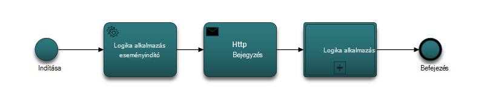

### <a name="lets-take-a-look-at-what-this-logic-app-does"></a>Most tekintsünk át egy logikai alkalmazás leírása
Ha megnézi az alábbi ábrán több lépésből áll a LogicApp munkafolyamatban.

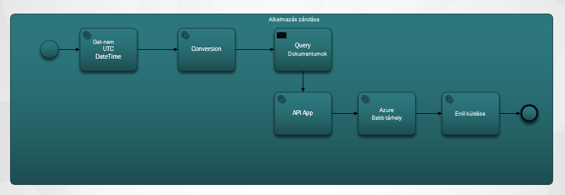

A lépések a következők:

1. Úgy juthat az aktuális UTC DateTime API alkalmazás szüksége.  Az alapértelmezett érték egy órával korábbi.

2. Unix időbélyeg formátumot a UTC DateTime alakul. Ez a időbélyegeket DocumentDB az alapértelmezett formátumát.

3. Az érték KÜLDENI API alkalmazás, amely tartalmaz egy DocumentDB lekérdezést. A értékét használja egy lekérdezésben.

    ```SQL
        SELECT * FROM Patients p WHERE (p._ts >= @unixTimeStamp)
    ```

    > [AZURE.NOTE] A _ts összes DocumentDB erőforrás időbélyeg metaadatait jelöli.

4. Található dokumentumok esetén, a válasz szervezet küldi el az Azure Blob-tárolóhoz.

    > [AZURE.NOTE] BLOB-tárolóhoz az Azure tárterület-fiók szükséges. Azure Blob-tároló fiók kiépítése, és adja hozzá a páciensek nevű új Blob szüksége. További tudnivalókért olvassa el a [kapcsolatos Azure tároló fiókok](../storage/storage-create-storage-account.md) és [Azure Blob-tárolóhoz – első lépések](../storage/storage-dotnet-how-to-use-blobs.md)című témakört.

5. Végül egy e-mailt küldi el, amely jelzi, hogy a címzett található dokumentumok száma. Ha nem található dokumentum, az e-mail törzsében "0 dokumentumok található" lesz. 

Most, hogy arról, mit jelent a munkafolyamatot, most tekintsünk át egy hogyan alkalmazhat.

### <a name="lets-start-with-the-main-logic-app"></a>Kezdjük a fő logika alkalmazás

Ha Ön nem ismeri a logika alkalmazások érhetők el a [Microsoft Azure piactéren](https://portal.azure.com/)és a velük kapcsolatos többet is megtudhat [logika alkalmazások melyek?](../app-service-logic/app-service-logic-what-are-logic-apps.md)

Amikor hoz létre egy új logika alkalmazást, rákérdez **hogyan szeretne elindítani?**

Amikor a szövegdobozon belüli kattint, választhat a teljes. Logika az alkalmazás jelölje ki a **Kézi – Ha a HTTP-kérelem érkezik** alább látható módon.

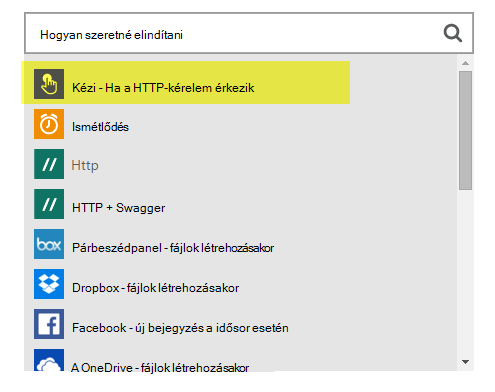

### <a name="design-view-of-your-completed-logic-app"></a>A kész logika alkalmazás Tervező nézetben
Vegyük Ugrás a következő, és tekintse meg a bejegyzett Tervező nézetben, a logika alkalmazáshoz, amelynek DocDB neve.


A műveletek a logika alkalmazás tervezőben szerkesztésekor meg, hogy kijelöli **kimeneti értékeket** a HTTP-kérés vagy az előző művelet ahogy az alábbi sendMail művelet.

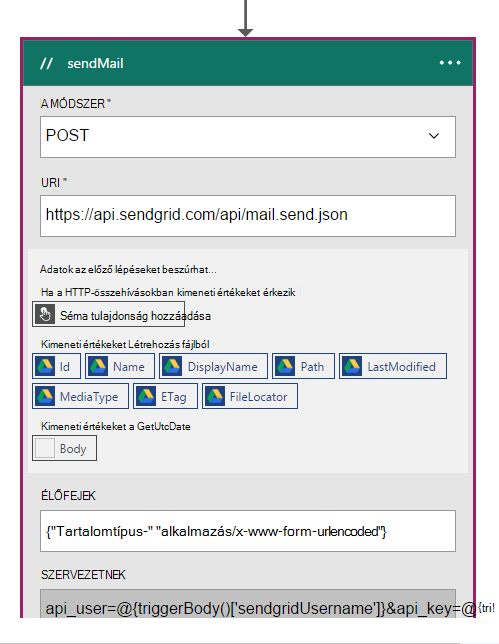

A munkafolyamat minden művelet előtt teheti döntés; **Hozzáadás művelet** vagy a **feltétel hozzáadása** az alábbi ábrán látható módon.

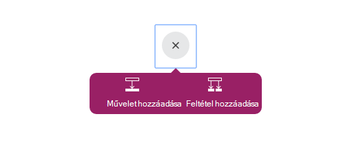

Ha kijelöl **egy feltétel hozzáadása**, akkor jelennek meg az űrlapok, a logika megadása az alábbi ábrán látható módon.  Ez a szabály üzleti lényegében.  Ha belül mező gombra kattint, választhat a paraméterek kijelölése a az előző művelet. Az értékek közvetlenül is megadhat.

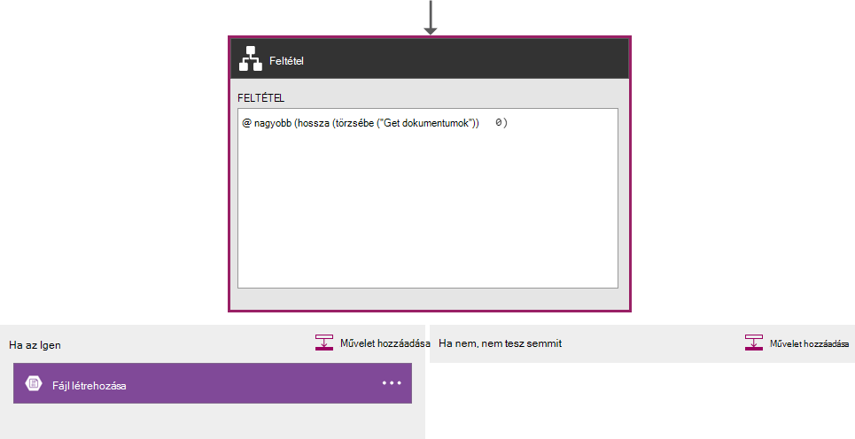

> [AZURE.NOTE] Írja be a szolgáltatás Kódnézet képes is telepítve van.

Most tekintsünk át egy befejezett logika alkalmazás kód nézetben.  

```JSON
   
    "$schema": "https://schema.management.azure.com/providers/Microsoft.Logic/schemas/2015-08-01-preview/workflowdefinition.json#",
    "actions": {
        "Conversion": {
            "conditions": [
                {
                    "dependsOn": "GetUtcDate"
                }
            ],
            "inputs": {
                "method": "post",
                "queries": {
                    "currentdateTime": "@{body('GetUtcDate')}"
                },
                "uri": "https://docdbnotificationapi-debug.azurewebsites.net/api/Conversion"
            },
            "metadata": {
                "apiDefinitionUrl": "https://docdbnotificationapi-debug.azurewebsites.net/swagger/docs/v1",
                "swaggerSource": "custom"
            },
            "type": "Http"
        },
        "Createfile": {
            "conditions": [
                {
                    "expression": "@greater(length(body('GetDocuments')), 0)"
                },
                {
                    "dependsOn": "GetDocuments"
                }
            ],
            "inputs": {
                "body": "@body('GetDocuments')",
                "host": {
                    "api": {
                        "runtimeUrl": "https://logic-apis-westus.azure-apim.net/apim/azureblob"
                    },
                    "connection": {
                        "name": "@parameters('$connections')['azureblob']['connectionId']"
                    }
                },
                "method": "post",
                "path": "/datasets/default/files",
                "queries": {
                    "folderPath": "/patients",
                    "name": "Patient_@{guid()}.json"
                }
            },
            "type": "ApiConnection"
        },
        "GetDocuments": {
            "conditions": [
                {
                    "dependsOn": "Conversion"
                }
            ],
            "inputs": {
                "method": "post",
                "queries": {
                    "unixTimeStamp": "@body('Conversion')"
                },
                "uri": "https://docdbnotificationapi-debug.azurewebsites.net/api/Patient"
            },
            "metadata": {
                "apiDefinitionUrl": "https://docdbnotificationapi-debug.azurewebsites.net/swagger/docs/v1",
                "swaggerSource": "custom"
            },
            "type": "Http"
        },
        "GetUtcDate": {
            "conditions": [],
            "inputs": {
                "method": "get",
                "queries": {
                    "hoursBack": "@{int(triggerBody()['GetUtcDate_HoursBack'])}"
                },
                "uri": "https://docdbnotificationapi-debug.azurewebsites.net/api/Authorization"
            },
            "metadata": {
                "apiDefinitionUrl": "https://docdbnotificationapi-debug.azurewebsites.net/swagger/docs/v1",
                "swaggerSource": "custom"
            },
            "type": "Http"
        },
        "sendMail": {
            "conditions": [
                {
                    "dependsOn": "GetDocuments"
                }
            ],
            "inputs": {
                "body": "api_user=@{triggerBody()['sendgridUsername']}&api_key=@{triggerBody()['sendgridPassword']}&from=@{parameters('fromAddress')}&to=@{triggerBody()['EmailTo']}&subject=@{triggerBody()['Subject']}&text=@{int(length(body('GetDocuments')))} Documents Found",
                "headers": {
                    "Content-type": "application/x-www-form-urlencoded"
                },
                "method": "POST",
                "uri": "https://api.sendgrid.com/api/mail.send.json"
            },
            "type": "Http"
        }
    },
    "contentVersion": "1.0.0.0",
    "outputs": {
        "Results": {
            "type": "String",
            "value": "@{int(length(body('GetDocuments')))} Records Found"
        }
    },
    "parameters": {
        "$connections": {
            "defaultValue": {},
            "type": "Object"
        },
        "fromAddress": {
            "defaultValue": "user@msn.com",
            "type": "String"
        },
        "toAddress": {
            "defaultValue": "XXXXX@XXXXXXX.net",
            "type": "String"
        }
    },
    "triggers": {
        "manual": {
            "inputs": {
                "schema": {
                    "properties": {},
                    "required": [],
                    "type": "object"
                }
            },
            "type": "Manual"
        }
    
```

Ha nem ismeri a különböző szakaszok, a kód jelöl, megtekintheti a [Logika alkalmazás munkafolyamat Definition Language](http://aka.ms/logicappsdocs) dokumentációt.

A munkafolyamat- [HTTP Webhook eseményindító](https://sendgrid.com/blog/whats-webhook/)esetén. Ha, tekintse meg a fenti kódot, látni fogja a paraméterek, például a következő példa.

```C#

    =@{triggerBody()['Subject']}

```

A `triggerBody()` a paramétereket a logika alkalmazás REST API-többi bejegyzés törzsében szereplő jelöli. A `()['Subject']` jelöli a mezőt. Összes ezeket a paramétereket a JSON alkotó formázva, hogy a szervezet. 

> [AZURE.NOTE] A webes hurok használatával lehet a teljes hozzáférés az élőfej és az eseményindító összehívás törzsében. Ez az alkalmazás a szervezet kívánt.

A korábban említett, a tervező segítségével paraméterek hozzárendelése, vagy a Kódnézet.
Ha mégis kód nézetben, majd definiálása mely tulajdonságokat kell egy értéket a következő kódot minta látható módon. 

```JSON

    "triggers": {
        "manual": {
            "inputs": {
            "schema": {
                "properties": {
            "Subject": {
                "type" : "String"   

            }
            },
                "required": [
            "Subject"
                 ],
                "type": "object"
            }
            },
            "type": "Manual"
        }
        }
```

Mit tesz hoz létre, amelyek a JSON séma a HTTP-bejegyzés törzsében.
Az eseményindító műveletkifejezést, szüksége lesz a visszahívási URL-címet.  Megtanulhatja, hogyan belül az oktatóprogram létrehozásához.  

## <a name="actions"></a>Műveletek
Lássuk, mit jelent az egyes műveletek a logika alkalmazásban.

### <a name="getutcdate"></a>GetUTCDate

**Tervező nézetben**

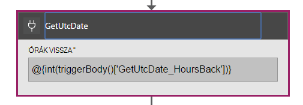

**Kódnézet**

```JSON

    "GetUtcDate": {
            "conditions": [],
            "inputs": {
            "method": "get",
            "queries": {
                "hoursBack": "@{int(triggerBody()['GetUtcDate_HoursBack'])}"
            },
            "uri": "https://docdbnotificationapi-debug.azurewebsites.net/api/Authorization"
            },
            "metadata": {
            "apiDefinitionUrl": "https://docdbnotificationapi-debug.azurewebsites.net/swagger/docs/v1"
            },
            "type": "Http"
        },

```

Ez a HTTP-művelet GET műveletet hajt végre.  Az API-alkalmazás GetUtcDate módszer meghívja. A Uri használja a "GetUtcDate_HoursBack" tulajdonság átadott az eseményindító törzsébe.  A "GetUtcDate_HoursBack" értéke az első logikai alkalmazásban. További tudnivalók az eseményindító logika alkalmazás megtanulhatja belül az oktatóprogram.

Ez a művelet hívja fel az API-alkalmazást, a UTC dátum karakterlánc értéket adja eredményül.

#### <a name="operations"></a>Műveletek

**Kérés**

```JSON

    {
        "uri": "https://docdbnotificationapi-debug.azurewebsites.net/api/Authorization",
        "method": "get",
        "queries": {
          "hoursBack": "24"
        }
    }

```

**Válasz**

```JSON

    {
        "statusCode": 200,
        "headers": {
          "pragma": "no-cache",
          "cache-Control": "no-cache",
          "date": "Fri, 26 Feb 2016 15:47:33 GMT",
          "server": "Microsoft-IIS/8.0",
          "x-AspNet-Version": "4.0.30319",
          "x-Powered-By": "ASP.NET"
        },
        "body": "Fri, 15 Jan 2016 23:47:33 GMT"
    }

```

A következő lépésként az Egyezményes DateTime típusú érték konvertálása a Unix időbélyeg, amely a .NET dupla típusú.

### <a name="conversion"></a>Átalakítás

##### <a name="designer-view"></a>Tervező nézetben

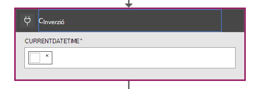

##### <a name="code-view"></a>Kódnézet

```JSON

    "Conversion": {
        "conditions": [
        {
            "dependsOn": "GetUtcDate"
        }
        ],
        "inputs": {
        "method": "post",
        "queries": {
            "currentDateTime": "@{body('GetUtcDate')}"
        },
        "uri": "https://docdbnotificationapi-debug.azurewebsites.net/api/Conversion"
        },
        "metadata": {
        "apiDefinitionUrl": "https://docdbnotificationapi-debug.azurewebsites.net/swagger/docs/v1"
        },
        "type": "Http"
    },

```

Ebben a lépésben a sikeres a GetUTCDate által visszaadott érték a.  Van egy dependsOn feltétel, ami azt jelenti, hogy GetUTCDate művelet sikeresen kell végeznie. Ha nem, majd a művelet kimarad. 

Ez a művelet hívások kezelése a konvertálás az API-alkalmazás.

#### <a name="operations"></a>Műveletek

##### <a name="request"></a>Kérés

```JSON

    {
        "uri": "https://docdbnotificationapi-debug.azurewebsites.net/api/Conversion",
        "method": "post",
        "queries": {
        "currentDateTime": "Fri, 15 Jan 2016 23:47:33 GMT"
        }
    }   
```

##### <a name="response"></a>Válasz

```JSON

    {
        "statusCode": 200,
        "headers": {
          "pragma": "no-cache",
          "cache-Control": "no-cache",
          "date": "Fri, 26 Feb 2016 15:47:33 GMT",
          "server": "Microsoft-IIS/8.0",
          "x-AspNet-Version": "4.0.30319",
          "x-Powered-By": "ASP.NET"
        },
        "body": 1452901653
    }
```

A következő műveletben egy bejegyzés műveletet az API-alkalmazásba hajt végre.

### <a name="getdocuments"></a>GetDocuments 

##### <a name="designer-view"></a>Tervező nézetben


##### <a name="code-view"></a>Kódnézet

```JSON

    "GetDocuments": {
        "conditions": [
        {
            "dependsOn": "Conversion"
        }
        ],
        "inputs": {
        "method": "post",
        "queries": {
            "unixTimeStamp": "@{body('Conversion')}"
        },
        "uri": "https://docdbnotificationapi-debug.azurewebsites.net/api/Patient"
        },
        "metadata": {
        "apiDefinitionUrl": "https://docdbnotificationapi-debug.azurewebsites.net/swagger/docs/v1"
        },
        "type": "Http"
    },

```

A GetDocuments művelet fogja válasz törzsébe át a átalakítási műveletet. Ez a paraméter az URI:

 
```C#

    unixTimeStamp=@{body('Conversion')}

```

A QueryDocuments művelet a HTTP-bejegyzés művelet hajtja végre a API alkalmazásba. 

A hívott metódus **QueryForNewPatientDocuments**.

#### <a name="operations"></a>Műveletek

##### <a name="request"></a>Kérés

```JSON

    {
        "uri": "https://docdbnotificationapi-debug.azurewebsites.net/api/Patient",
        "method": "post",
        "queries": {
        "unixTimeStamp": "1452901653"
        }
    }
```

##### <a name="response"></a>Válasz

```JSON

    {
        "statusCode": 200,
        "headers": {
        "pragma": "no-cache",
        "cache-Control": "no-cache",
        "date": "Fri, 26 Feb 2016 15:47:35 GMT",
        "server": "Microsoft-IIS/8.0",
        "x-AspNet-Version": "4.0.30319",
        "x-Powered-By": "ASP.NET"
        },
        "body": [
        {
            "id": "xcda",
            "_rid": "vCYLAP2k6gAXAAAAAAAAAA==",
            "_self": "dbs/vCYLAA==/colls/vCYLAP2k6gA=/docs/vCYLAP2k6gAXAAAAAAAAAA==/",
            "_ts": 1454874620,
            "_etag": "\"00007d01-0000-0000-0000-56b79ffc0000\"",
            "resourceType": "Patient",
            "text": {
            "status": "generated",
            "div": "<div>\n      \n      <p>Henry Levin the 7th</p>\n    \n    </div>"
            },
            "identifier": [
            {
                "use": "usual",
                "type": {
                "coding": [
                    {
                    "system": "http://hl7.org/fhir/v2/0203",
                    "code": "MR"
                    }
                ]
                },
                "system": "urn:oid:2.16.840.1.113883.19.5",
                "value": "12345"
            }
            ],
            "active": true,
            "name": [
            {
                    "family": [
                        "Levin"
                    ],
                    "given": [
                        "Henry"
                    ]
                }
            ],
            "gender": "male",
            "birthDate": "1932-09-24",
            "managingOrganization": {
                "reference": "Organization/2.16.840.1.113883.19.5",
                "display": "Good Health Clinic"
            }
        },

```

A következő műveletet is menti a dokumentumokat az [Azure-Blog tárolóba](https://azure.microsoft.com/services/storage/). 

> [AZURE.NOTE] BLOB-tárolóhoz az Azure tárterület-fiók szükséges. Azure Blob-tároló fiók kiépítése, és adja hozzá a páciensek nevű új Blob szüksége. További tudnivalókért olvassa el a [Azure Blob-tárolóhoz – első lépések](../storage/storage-dotnet-how-to-use-blobs.md)című témakört.

### <a name="create-file"></a>Fájl létrehozása

##### <a name="designer-view"></a>Tervező nézetben

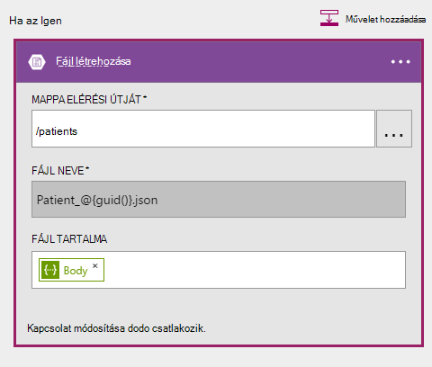

##### <a name="code-view"></a>Kódnézet

```JSON

    {
    "host": {
        "api": {
            "runtimeUrl": "https://logic-apis-westus.azure-apim.net/apim/azureblob"
        },
        "connection": {
            "name": "subscriptions/fxxxxxc079-4e5d-b002-xxxxxxxxxx/resourceGroups/Api-Default-Central-US/providers/Microsoft.Web/connections/azureblob"
        }
    },
    "method": "post",
    "path": "/datasets/default/files",
    "queries": {
        "folderPath": "/patients",
        "name": "Patient_17513174-e61d-4b56-88cb-5cf383db4430.json"
    },
    "body": [
        {
            "id": "xcda",
            "_rid": "vCYLAP2k6gAXAAAAAAAAAA==",
            "_self": "dbs/vCYLAA==/colls/vCYLAP2k6gA=/docs/vCYLAP2k6gAXAAAAAAAAAA==/",
            "_ts": 1454874620,
            "_etag": "\"00007d01-0000-0000-0000-56b79ffc0000\"",
            "resourceType": "Patient",
            "text": {
                "status": "generated",
                "div": "<div>\n      \n      <p>Henry Levin the 7th</p>\n    \n    </div>"
            },
            "identifier": [
                {
                    "use": "usual",
                    "type": {
                        "coding": [
                            {
                                "system": "http://hl7.org/fhir/v2/0203",
                                "code": "MR"
                            }
                        ]
                    },
                    "system": "urn:oid:2.16.840.1.113883.19.5",
                    "value": "12345"
                }
            ],
            "active": true,
            "name": [
                {
                    "family": [
                        "Levin"
                    ],
                    "given": [
                        "Henry"
                    ]
                }
            ],
            "gender": "male",
            "birthDate": "1932-09-24",
            "managingOrganization": {
                "reference": "Organization/2.16.840.1.113883.19.5",
                "display": "Good Health Clinic"
            }
        },

```

A kódot a művelet a tervezőben jön létre. Nem kell módosítsa a kódot.

Ha nem ismeri a Azure Blob-API, olvassa el a [API Azure blob-tárolóhoz – első lépések](../connectors/connectors-create-api-azureblobstorage.md)című témakört.

#### <a name="operations"></a>Műveletek

##### <a name="request"></a>Kérés

```JSON

    "host": {
        "api": {
            "runtimeUrl": "https://logic-apis-westus.azure-apim.net/apim/azureblob"
        },
        "connection": {
            "name": "subscriptions/fxxxxxc079-4e5d-b002-xxxxxxxxxx/resourceGroups/Api-Default-Central-US/providers/Microsoft.Web/connections/azureblob"
        }
    },
    "method": "post",
    "path": "/datasets/default/files",
    "queries": {
        "folderPath": "/patients",
        "name": "Patient_17513174-e61d-4b56-88cb-5cf383db4430.json"
    },
    "body": [
        {
            "id": "xcda",
            "_rid": "vCYLAP2k6gAXAAAAAAAAAA==",
            "_self": "dbs/vCYLAA==/colls/vCYLAP2k6gA=/docs/vCYLAP2k6gAXAAAAAAAAAA==/",
            "_ts": 1454874620,
            "_etag": "\"00007d01-0000-0000-0000-56b79ffc0000\"",
            "resourceType": "Patient",
            "text": {
                "status": "generated",
                "div": "<div>\n      \n      <p>Henry Levin the 7th</p>\n    \n    </div>"
            },
            "identifier": [
                {
                    "use": "usual",
                    "type": {
                        "coding": [
                            {
                                "system": "http://hl7.org/fhir/v2/0203",
                                "code": "MR"
                            }
                        ]
                    },
                    "system": "urn:oid:2.16.840.1.113883.19.5",
                    "value": "12345"
                }
            ],
            "active": true,
            "name": [
                {
                    "family": [
                        "Levin"
                    ],
                    "given": [
                        "Henry"
                    ]
                }
            ],
            "gender": "male",
            "birthDate": "1932-09-24",
            "managingOrganization": {
                "reference": "Organization/2.16.840.1.113883.19.5",
                "display": "Good Health Clinic"
            }
        },….


```

##### <a name="response"></a>Válasz

```JSON

    {
        "statusCode": 200,
        "headers": {
        "pragma": "no-cache",
        "x-ms-request-id": "2b2f7c57-2623-4d71-8e53-45c26b30ea9d",
        "cache-Control": "no-cache",
        "date": "Fri, 26 Feb 2016 15:47:36 GMT",
        "set-Cookie": "ARRAffinity=29e552cea7db23196f7ffa644003eaaf39bc8eb6dd555511f669d13ab7424faf;Path=/;Domain=127.0.0.1",
        "server": "Microsoft-HTTPAPI/2.0",
        "x-AspNet-Version": "4.0.30319",
        "x-Powered-By": "ASP.NET"
        },
        "body": {
        "Id": "0B0nBzHyMV-_NRGRDcDNMSFAxWFE",
        "Name": "Patient_47a2a0dc-640d-4f01-be38-c74690d085cb.json",
        "DisplayName": "Patient_47a2a0dc-640d-4f01-be38-c74690d085cb.json",
        "Path": "/Patient/Patient_47a2a0dc-640d-4f01-be38-c74690d085cb.json",
        "LastModified": "2016-02-26T15:47:36.215Z",
        "Size": 65647,
        "MediaType": "application/octet-stream",
        "IsFolder": false,
        "ETag": "\"c-g_a-1OtaH-kNQ4WBoXLp3Zv9s/MTQ1NjUwMTY1NjIxNQ\"",
        "FileLocator": "0B0nBzHyMV-_NRGRDcDNMSFAxWFE"
        }
    }
```

Az utolsó lépésként küldje el e-mailben értesítést

### <a name="sendemail"></a>EmailKüldése

##### <a name="designer-view"></a>Tervező nézetben

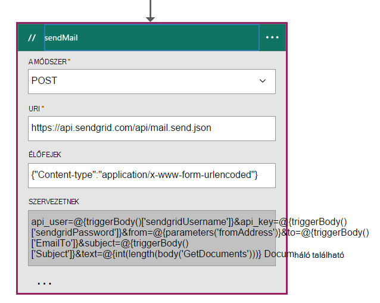

##### <a name="code-view"></a>Kódnézet

```JSON


    "sendMail": {
        "conditions": [
        {
            "dependsOn": "GetDocuments"
        }
        ],
        "inputs": {
        "body": "api_user=@{triggerBody()['sendgridUsername']}&api_key=@{triggerBody()['sendgridPassword']}&from=@{parameters('fromAddress')}&to=@{triggerBody()['EmailTo']}&subject=@{triggerBody()['Subject']}&text=@{int(length(body('GetDocuments')))} Documents Found",
        "headers": {
            "Content-type": "application/x-www-form-urlencoded"
        },
        "method": "POST",
        "uri": "https://api.sendgrid.com/api/mail.send.json"
        },
        "type": "Http"
    }
```

Ez a művelet az e-mailben értesítést küld.  [SendGrid](https://sendgrid.com/marketing/sendgrid-services?cvosrc=PPC.Bing.sendgrib&cvo_cid=SendGrid%20-%20US%20-%20Brand%20-%20&mc=Paid%20Search&mcd=BingAds&keyword=sendgrib&network=o&matchtype=e&mobile=&content=&search=1&utm_source=bing&utm_medium=cpc&utm_term=%5Bsendgrib%5D&utm_content=%21acq%21v2%2134335083397-8303227637-1649139544&utm_campaign=SendGrid+-+US+-+Brand+-+%28English%29)esetén.   

Ez a kód jött létre logika alkalmazás és a [101-összefüggés-alkalmazás – sendgrid Github tárházba](https://github.com/Azure/azure-quickstart-templates/tree/master/101-logic-app-sendgrid), SendGrid sablon használatával.
 
A HTTP-művelet a bejegyzés. 

Az engedély paramétereket vannak a kiváltó ok mező tulajdonságai

```JSON

    },
        "sendgridPassword": {
             "type": "SecureString"
         },
         "sendgridUsername": {
            "type": "String"
         }

        In addition, other parameters are static values set in the Parameters section of the Logic App. These are:
        },
        "toAddress": {
            "defaultValue": "XXXX@XXXX.com",
            "type": "String"
        },
        "fromAddress": {
            "defaultValue": "XXX@msn.com",
            "type": "String"
        },
        "emailBody": {
            "defaultValue": "@{string(concat(int(length(actions('QueryDocuments').outputs.body)) Records Found),'/n', actions('QueryDocuments').outputs.body)}",
            "type": "String"
        },

```

A emailBody van kifejezések, amely lehet "0" vagy a több, együtt, a lekérdezés által visszaadott "Rekordok található" dokumentumok száma. A paraméterek a többi a kiváltó ok mező paraméterekből vannak beállítva.

Ez a művelet attól függ, hogy a **GetDocuments** műveletet.

#### <a name="operations"></a>Műveletek

##### <a name="request"></a>Kérés
```JSON

    {
        "uri": "https://api.sendgrid.com/api/mail.send.json",
        "method": "POST",
        "headers": {
        "Content-type": "application/x-www-form-urlencoded"
        },
        "body": "api_user=azureuser@azure.com&api_key=Biz@Talk&from=user@msn.com&to=XXXX@XXXX.com&subject=New Patients&text=37 Documents Found"
    }

```

##### <a name="response"></a>Válasz

```JSON

    {
        "statusCode": 200,
        "headers": {
        "connection": "keep-alive",
        "x-Frame-Options": "DENY,DENY",
        "access-Control-Allow-Origin": "https://sendgrid.com",
        "date": "Fri, 26 Feb 2016 15:47:35 GMT",
        "server": "nginx"
        },
        "body": {
        "message": "success"
        }
    }
```

Végül szeretne láthatja az eredményeket az összefüggés-alkalmazás az Azure-portálon. Ehhez vesz fel a paramétert a kimeneti értékeket szakaszban.


```JSON

    "outputs": {
        "Results": {
            "type": "String",
            "value": "@{int(length(actions('QueryDocuments').outputs.body))} Records Found"
        }

```

Ez az e-mail törzsében küldött azonos értékét adja eredményül. Az alábbi ábrán látható példát, ahol "29 rekordok található".

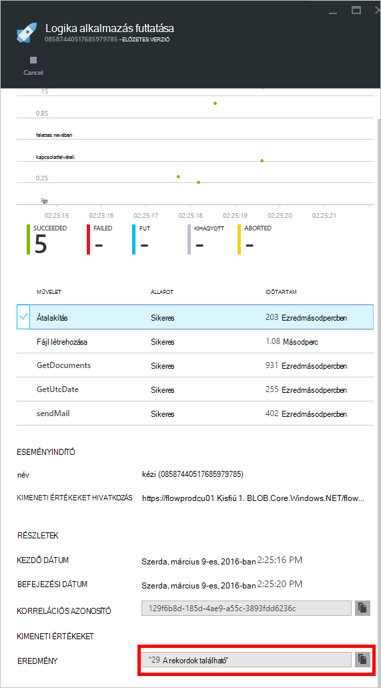

## <a name="metrics"></a>Mértékek
Beállíthatja, hogy a portálon fő logika alkalmazás figyelése. Ez lehetővé teszi, hogy a Futtatás időtartam és más eseményeket, az alábbi ábrán látható módon.

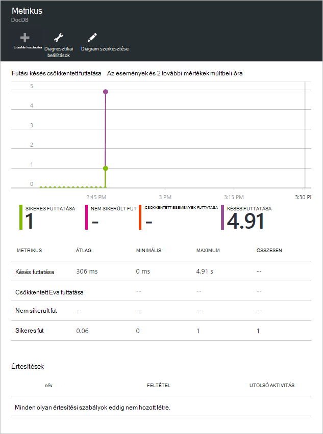

## <a name="docdb-trigger"></a>Eseményindító DocDb

Logika az alkalmazás, amely elindítja a munkafolyamatot a fő logika alkalmazásba az eseményindító.

Az alábbi ábrán látható a Tervező nézetben.

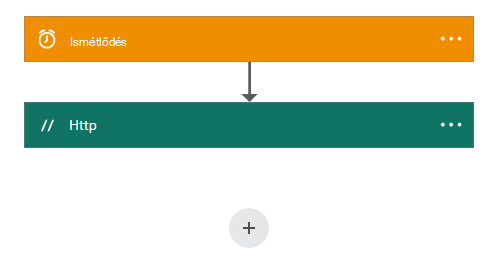

```JSON

    {
        "$schema": "https://schema.management.azure.com/providers/Microsoft.Logic/schemas/2015-08-01-preview/workflowdefinition.json#",
        "actions": {
        "Http": {
            "conditions": [],
            "inputs": {
            "body": {
                "EmailTo": "XXXXXX@XXXXX.net",
                "GetUtcDate_HoursBack": "24",
                "Subject": "New Patients",
                "sendgridPassword": "********",
                "sendgridUsername": "azureuser@azure.com"
            },
            "method": "POST",
            "uri": "https://prod-01.westus.logic.azure.com:443/workflows/12a1de57e48845bc9ce7a247dfabc887/triggers/manual/run?api-version=2015-08-01-preview&sp=%2Ftriggers%2Fmanual%2Frun&sv=1.0&sig=ObTlihr529ATIuvuG-dhxOgBL4JZjItrvPQ8PV6973c"
            },
            "type": "Http"
        }
        },
        "contentVersion": "1.0.0.0",
        "outputs": {
        "Results": {
            "type": "String",
            "value": "@{body('Http')['status']}"
        }
        },
        "parameters": {},
        "triggers": {
        "recurrence": {
            "recurrence": {
            "frequency": "Hour",
            "interval": 24
            },
            "type": "Recurrence"
        }
        }
    }

```

Az eseményindító beállítása a 24 óra megismétlődése. A műveletet, amely a visszahívás URL-címet használja a fő logika alkalmazáshoz HTTP POST nem. A szöveg tartalmazza a paramétereket, amelyeket a JSON sémában. 

#### <a name="operations"></a>Műveletek

##### <a name="request"></a>Kérés

```JSON

    {
        "uri": "https://prod-01.westus.logic.azure.com:443/workflows/12a1de57e48845bc9ce7a247dfabc887/triggers/manual/run?api-version=2015-08-01-preview&sp=%2Ftriggers%2Fmanual%2Frun&sv=1.0&sig=ObTlihr529ATIuvuG-dhxOgBL4JZjItrvPQ8PV6973c",
        "method": "POST",
        "body": {
        "EmailTo": "XXXXXX@XXXXX.net",
        "GetUtcDate_HoursBack": "24",
        "Subject": "New Patients",
        "sendgridPassword": "********",
        "sendgridUsername": "azureuser@azure.com"
        }
    }

```

##### <a name="response"></a>Válasz

```JSON

    {
        "statusCode": 202,
        "headers": {
        "pragma": "no-cache",
        "x-ms-ratelimit-remaining-workflow-writes": "7486",
        "x-ms-ratelimit-burst-remaining-workflow-writes": "1248",
        "x-ms-request-id": "westus:2d440a39-8ba5-4a9c-92a6-f959b8d2357f",
        "cache-Control": "no-cache",
        "date": "Thu, 25 Feb 2016 21:01:06 GMT"
        }
    }
```

Most Vegyük szemügyre az API-alkalmazást.

## <a name="docdbnotificationapi"></a>DocDBNotificationApi

Habár az alkalmazásban többféle műveletek, csak fogja használni a három.

* GetUtcDate
* ConvertToTimeStamp
* QueryForNewPatientDocuments

### <a name="docdbnotificationapi-operations"></a>DocDBNotificationApi műveletek
Most tekintsünk át egy Swagger dokumentációjában

> [AZURE.NOTE] Engedélyezni, hogy hívja fel a műveletek a külső felhasználókkal, akkor hozzon létre egy CORS megengedett origin értéket "*" (idézőjeleket) a beállításai között az API-alkalmazást, az alábbi ábrán látható módon.

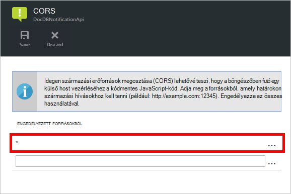

#### <a name="getutcdate"></a>GetUtcDate

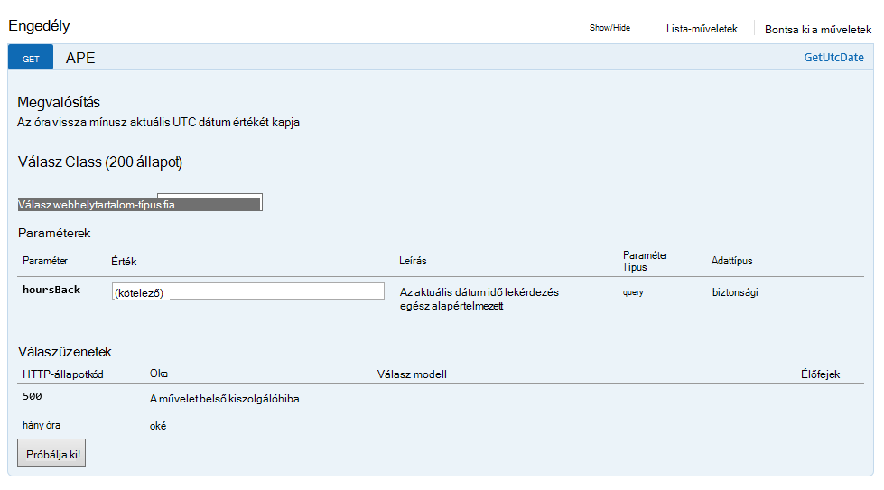

#### <a name="converttotimestamp"></a>ConvertToTimeStamp

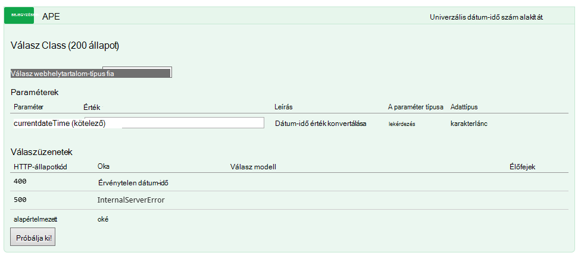

#### <a name="queryfornewpatientdocuments"></a>QueryForNewPatientDocuments

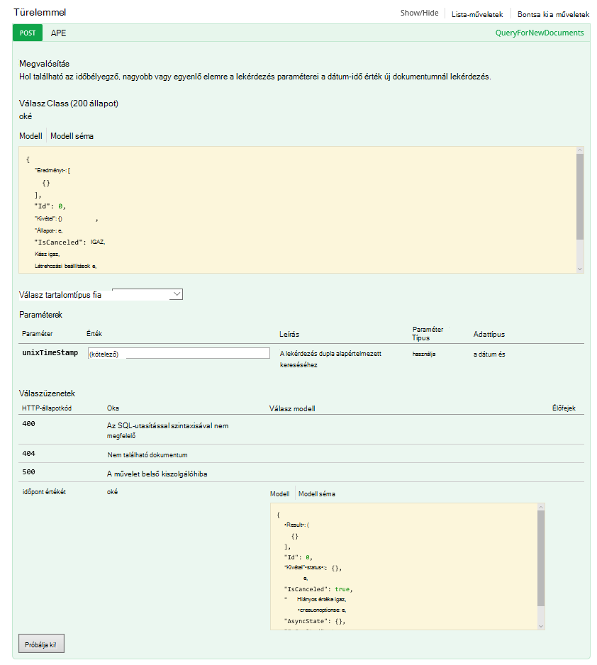

Most tekintsünk át egy mögött ehhez a művelethez a kódot.

#### <a name="getutcdate"></a>GetUtcDate

```C#

    /// <summary>
    /// Gets the current UTC Date value
    /// </summary>
    /// <returns></returns>
    [H ttpGet]
    [Metadata("GetUtcDate", "Gets the current UTC Date value minus the Hours Back")]
    [SwaggerOperation("GetUtcDate")]
    [SwaggerResponse(HttpStatusCode.OK, type: typeof (string))]
    [SwaggerResponse(HttpStatusCode.InternalServerError, "Internal Server Operation Error")]
    public string GetUtcDate(
       [Metadata("Hours Back", "How many hours back from the current Date Time")] int hoursBack)
    {


        return DateTime.UtcNow.AddHours(-hoursBack).ToString("r");
    }
```

Ez a művelet egyszerűen adja eredményül a ismét mínusz HoursBack értékét az aktuális UTC DateTime.

#### <a name="converttotimestamp"></a>ConvertToTimeStamp

``` C#

        /// <summary>
        ///     Converts DateTime to double
        /// </summary>
        /// <param name="currentdateTime"></param>
        /// <returns></returns>
        [Metadata("Converts Universal DateTime to number")]
        [SwaggerResponse(HttpStatusCode.OK, null, typeof (double))]
        [SwaggerResponse(HttpStatusCode.BadRequest, "DateTime is invalid")]
        [SwaggerResponse(HttpStatusCode.InternalServerError)]
        [SwaggerOperation(nameof(ConvertToTimestamp))]
        public double ConvertToTimestamp(
            [Metadata("currentdateTime", "DateTime value to convert")] string currentdateTime)
        {
            double result;

            try
            {
                var uncoded = HttpContext.Current.Server.UrlDecode(currentdateTime);

                var newDateTime = DateTime.Parse(uncoded);
                //create Timespan by subtracting the value provided from the Unix Epoch
                var span = newDateTime - new DateTime(1970, 1, 1, 0, 0, 0, 0).ToLocalTime();

                //return the total seconds (which is a UNIX timestamp)
                result = span.TotalSeconds;
            }
            catch (Exception e)
            {
                throw new Exception("unable to convert to Timestamp", e.InnerException);
            }

            return result;
        }

```

Ez a művelet értékké a válasz a GetUtcDate műveletből dupla.

#### <a name="queryfornewpatientdocuments"></a>QueryForNewPatientDocuments

```C#

        /// <summary>
        ///     Query for new Patient Documents
        /// </summary>
        /// <param name="unixTimeStamp"></param>
        /// <returns>IList</returns>
        [Metadata("QueryForNewDocuments",
            "Query for new Documents where the Timestamp is greater than or equal to the DateTime value in the query parameters."
            )]
        [SwaggerOperation("QueryForNewDocuments")]
        [SwaggerResponse(HttpStatusCode.OK, type: typeof (Task<IList<Document>>))]
        [SwaggerResponse(HttpStatusCode.BadRequest, "The syntax of the SQL Statement is incorrect")]
        [SwaggerResponse(HttpStatusCode.NotFound, "No Documents were found")]
        [SwaggerResponse(HttpStatusCode.InternalServerError, "Internal Server Operation Error")]
        // ReSharper disable once ConsiderUsingAsyncSuffix
        public IList<Document> QueryForNewPatientDocuments(
            [Metadata("UnixTimeStamp", "The DateTime value used to search from")] double unixTimeStamp)
        {
            var context = new DocumentDbContext();
            var filterQuery = string.Format(InvariantCulture, "SELECT * FROM Patient p WHERE p._ts >=  {0}",
                unixTimeStamp);
            var options = new FeedOptions {MaxItemCount = -1};


            var collectionLink = UriFactory.CreateDocumentCollectionUri(DocumentDbContext.DatabaseId,
                DocumentDbContext.CollectionId);

            var response =
                context.Client.CreateDocumentQuery<Document>(collectionLink, filterQuery, options).AsEnumerable();

            return response.ToList();
    }

```

Ehhez a művelethez használja a [DocumentDB.NET SDK](documentdb-sdk-dotnet.md) dokumentum lekérdezés létrehozása. 

```C#
     CreateDocumentQuery<Document>(collectionLink, filterQuery, options).AsEnumerable();
```

A válasz, a ConvertToTimeStamp műveletből (unixTimeStamp) át. A művelet eredménye a dokumentumok listájának `IList<Document>`.

A korábban azt beszélgetett a CallbackURL. A fő alkalmazásban logika a munkafolyamat indítása, hogy szüksége lesz hívja meg a CallbackURL használatával.

## <a name="callbackurl"></a>CallbackURL

Elindításához szüksége lesz az Azure Active Directory jogkivonat.  Lehet, hogy azt nehéz ez jogkivonat. Egy egyszerű módszert keresek volt, és Kovács Hollan, aki az Azure logika alkalmazás program manager, javasolt a [armclient](http://blog.davidebbo.com/2015/01/azure-resource-manager-client.html) PowerShell használatával.  Ez a képernyőn megjelenő utasításokat követve telepítheti.

A használni kívánt műveleteket, hogy jelentkezzen be, és hívja fel a ARM API-val.
 
Bejelentkezés: Az Azure-portálra naplózás-et a hitelesítő adatait. 

A hívás ARM Api művelet, amely a CallBackURL hoz létre.

A PowerShell hogy hívja meg az alábbi képlettel történik:  

```powershell

    ArmClient.exe post https://management.azure.com/subscriptions/[YOUR SUBSCRIPTION ID/resourcegroups/[YOUR RESOURCE GROUP]/providers/Microsoft.Logic/workflows/[YOUR LOGIC APP NAME/triggers/manual/listcallbackurl?api-version=2015-08-01-preview

```

Az eredmény így néz ki:

```powershell

    https://prod-02.westus.logic.azure.com:443/workflows/12a1de57e48845bc9ce7a247dfabc887/triggers/manual/run?api-version=2015-08-01-prevaiew&sp=%2Ftriggers%2Fmanual%2Frun&sv=1.0&sig=XXXXXXXXXXXXXXXXXXX

```

Használhatja például [postman](http://www.getpostman.com/) eszköz, fő logika alkalmazásban tesztelje az alábbi ábrán látható módon.

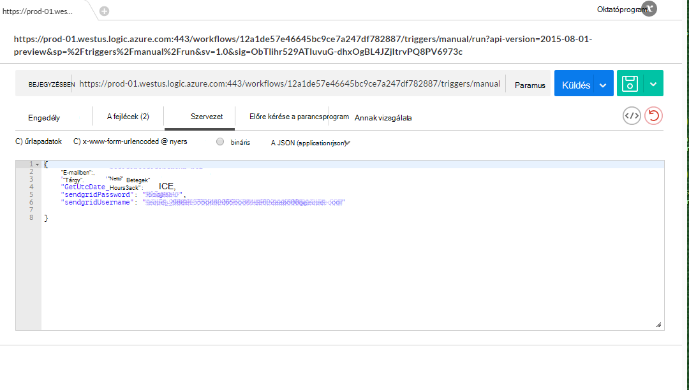

Az alábbi táblázat a kiváltó ok mező paramétereket a DocDB eseményindító logika alkalmazás törzsében alkotó.

Paraméter | Leírás 
--- | --- 
GetUtcDate_HoursBack | A keresés kezdő dátum órák számának beállítására szolgáló
sendgridUsername | A keresés kezdő dátum órák számának beállítására szolgáló
sendgridPassword | A felhasználó nevét a rács küldése e-mailben
Mailként | Az e-mail címet, az e-mailben értesítést kap
Tárgy | A levelezéshez a tulajdonos

## <a name="viewing-the-patient-data-in-the-azure-blob-service"></a>Az Azure Blob-szolgáltatás a betegek adatainak megtekintése

Nyissa meg a Azure tárterület-fiókját, és válassza ki a BLOB a szolgáltatások a következő ábrán látható módon.

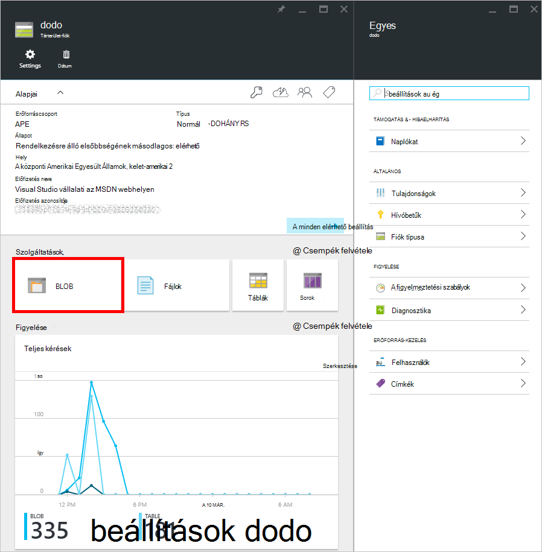 

Fogja tudni megtekinteni a betegek blob információkat alább látható módon.

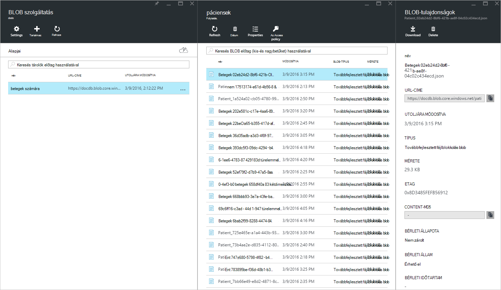


## <a name="summary"></a>Összefoglalás

Az útmutató az alábbi már megtanulta:

* Értesítések megvalósítását a DocumentDB lehetőség.
* Logika alkalmazások használatával automatizálhatja a folyamat.
* Logika alkalmazások használatával csökkentheti az idő, amíg az alkalmazások előadásához.
* HTTP használatával összefüggés-alkalmazásból API alkalmazás egyszerű felhasználni.
* Egyszerűen létrehozhat egy CallBackURL, amely a HTTP-figyelő váltja fel.
* Egyszerűen létrehozhat egyéni munkafolyamatok logika alkalmazások tervezővel.

A kulcs tervezés, és modellezése a munkafolyamat fut.

## <a name="next-steps"></a>Következő lépések
Töltse le, és használja a logika alkalmazás [Github](https://github.com/HEDIDIN/DocDbNotifications)adni. Tudok meghívni, hogy az alkalmazás épülnek, és küldje el a a repó módosításait. 

Többet szeretne tudni a DocumentDB, látogasson el a [Tanulási javaslat](https://azure.microsoft.com/documentation/learning-paths/documentdb/).
