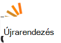
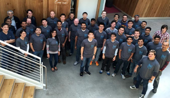

<properties
  pageTitle="DocumentDB közösségi és a hírolvasó |} Microsoft Azure"
  description="Kapcsolatok létrehozása, megjelenítve a munkahelyi és tovább finomítható a szakértelem az Azure DocumentDB Közösség csatlakozni."
  services="documentdb"
  documentationCenter=""
  authors="aliuy"
  manager="johnmac"
  editor="mimig"/>

<tags
  ms.service="documentdb"
  ms.devlang="na"
  ms.topic="article"
  ms.tgt_pltfrm="na"
  ms.workload="data-services"
  ms.date="09/26/2016"
  ms.author="andrl"/>

# Közösségi portál

## Közösségi reflektorfény

Tudassa velünk előléptetése a project! Legyen a Soft projekt DocumentDB a dolgozik, és hogy segítséget nyújt a genius megosztás a világgal. A projekt küldéséhez küldjön e-mailt a: [askdocdb@microsoft.com](mailto:askdocdb@microsoft.com).

### documentdb-lumenize

*Endre Maccherone szerint*

Összesítések (Group by kimutatás és háromdimenziós N kocka) és időpontot, amikor a sorozat átalakítások DocumentDB a tárolt eljárás szerint.

Vegye ki azt a [Github](https://github.com/lmaccherone/documentdb-lumenize) és [npm](https://www.npmjs.com/package/lumenize).

### DocumentDB Studio

*Ming Liu szerint*

Egy ügyfél kezelése megjelenítő/explorer Microsoft Azure DocumentDB szolgáltatáshoz.

Vegye ki azt a [Github](https://github.com/mingaliu/DocumentDBStudio).

### DoQmentDB

*Ariel Mashraki szerint*

DoQmentDB egy Node.js cikk megvásárlását fel-alapú ügyfél, MongoDB hasonló réteg DocumentDB fölött.

Vegye ki azt a [Github](https://github.com/a8m/doqmentdb) és [npm](https://www.npmjs.com/package/doqmentdb).

### Swagger REST API-DocumentDB

*Howard Edidin szerint*

Az API-App egyszerűen rendszerbe DocumentDB REST API-Swagger fájlt.

Vegye ki azt a [Github](https://github.com/HEDIDIN/DocumentDB-REST/tree/master/DocumentDBRestApi).

### Fluent beépülő modul documentdb

*Yoichi Kawasaki szerint*

Fluent beépülő modul documentdb egy Fluentd beépülő modul az Azure DocumentDB írása.

Vegye ki azt a [Github](https://github.com/yokawasa/fluent-plugin-documentdb) és [rubygems](https://rubygems.org/gems/fluent-plugin-documentdb).

*További Megnyitás [GitHub](https://github.com/search?p=4&q=documentdb&type=Repositories)DocumentDB projektek találja.*

## Hírek, blogok és cikkek

Megtarthatja naprakész-e a legújabb DocumentDB híreket és szolgáltatások következő [blogbejegyzés](https://azure.microsoft.com/blog/tag/documentdb/)szerint.

**Közösségi bejegyzések:**

- [**Közösségi DocumentDB az Áttekintés**](https://blogs.msdn.microsoft.com/mvpawardprogram/2016/03/15/going-social-with-documentdb/) - *Matias Quarantaas szerint*

- [**UWP, Azure alkalmazás szolgáltatások és DocumentDB leves: A fénykép-megosztás alkalmazás**](https://blogs.windows.com/buildingapps/2016/03/17/uwp-azure-app-services-and-documentdb-soup-a-photo-sharing-app/) - *Eric Langland szerint*

- [**Új vagy módosított DocumentDB erőforrások az összefüggés-alkalmazások használata az értesítéseket**](documentdb-change-notification.md) - *Howard Edidin szerint*

- [**A naplók gyűjt a fluent beépülő modul documentdb használatával Azure DocumentDB**](http://unofficialism.info/posts/collecting-logs-into-azure-documentdb-using-fluent-plugin-documentdb/) - *Yoichi Kawasaki szerint*

- [**DocumentDB javított változat rész 1/2 – az elmélet**](https://peterintheazuresky.wordpress.com/2016/02/19/documentdb-revisited-part-12-the-theory/) - *Péter Mannerhult szerint*

- [**Teendők: közkedvelt és közkedvelt Azure-féle DocumentDB kapcsolatos**](http://blog.falafel.com/4-what-to-love-and-hate-about-azures-documentdb/) - *György Saadeh szerint*

- [**Azure DocumentDB kiszolgálóoldali parancsfájlok**](https://www.simple-talk.com/cloud/cloud-data/azure-documentdb-server-side-scripting/) - *Robert Sheldon szerint*

- [**Az Azure Értékáram-elemzés gyűjtése adatokat DocumentDB**](http://janatdevelopment.com/2015/12/11/documentdb-as-a-data-sink-for-azure-stream-analytics/?utm_source=twitterfeed&utm_medium=twitter) - *Jan Hentschel szerint*

- [**A gyártási Azure DocumentDB!** ](http://blog.nexapp.ca/2015/11/30/azure-documentdb-in-production/)  -  *Alexandre Walsh és törköly-Olivier Duval*

- [**Azure keresési indexelő – DocumentDB lekérdezések (spanyol)**](http://www.ealsur.com.ar/wp/index.php/2015/11/19/azure-search-indexers-documentdb-queries/) - *Matthias Quaranta szerint*

- [**Azure DocumentDB SQL-lekérdezés alapjai (japán)**](http://beachside.hatenablog.com/entry/2015/12/06/000045) - *Atsushi Yokohama szerint*

- [**Adatpontok - Aurelia megfelel-e DocumentDB: Egy Matchmaker utazás**](https://msdn.microsoft.com/magazine/mt620011.aspx) - *Ágnes Lerman szerint*

- [**Infrastruktúra kódot, valamint egy Node.js + Azure DocumentDB megoldás a folyamatos telepítésének**](http://www.talmeida.net/blog/2015/10/26/infrastructure-as-code-and-continuous-deployment-of-a-nodejs-azure-documentdb-solution) - *Thiago Almedia szerint*

- [**Miért DocumentDb értelemszerű jó üzleti bizonyos projektek**](http://www.iquestllc.com/blogs/read/405/why-documentdb-makes-good-business-sense-for-some-projects) - *Samuel Uresin szerint*

- [**Azure DocumentDB fejlesztési mozgatása előre – az ügyfél osztály (1 / 2) fejlesztésének (japán)**](http://beachside.hatenablog.com/entry/2015/10/01/202734) - *Atsushi Yokohama szerint*

- [**Dolgot kell tudnia Azure DocumentDB (japán) használata esetén**](http://beachside.hatenablog.com/entry/2015/10/01/202734) - *Atsushi Yokohama szerint*

- [**Azure DocumentDB RequestRateTooLarge hibáinak kezelése, és a teljesítmény vizsgálata**](http://blogs.msdn.com/b/bigdatasupport/archive/2015/09/02/dealing-with-requestratetoolarge-errors-in-azure-documentdb-and-testing-documentdb-performance.aspx) - *Azim Uddin szerint*

- [**Microsoft Azure DocumentDB áttekintése adatpontok -**](https://msdn.microsoft.com/magazine/mt147238.aspx) - *Ágnes Lerman szerint*

- [**DocumentDB használata F #**](https://jamessdixon.wordpress.com/2014/12/30/using-documentdb-with-f/) - *János Dixon szerint*

- [**Elemzésére alkalmazás jelentkezik DocumentDB**](http://vincentlauzon.com/2015/09/06/analysing-application-logs-with-documentdb/) - *Vincent-Philippe Lauzon szerint*

- [**Azure DocumentDB – idő biztonsági mentés pont**](http://softwarejuancarlos.com/2015/09/06/azure-documentdb-point-in-time-backups/) - *Juan Carlos Sanchez szerint*

*Van egy blogbejegyzés, kód minta vagy esettanulmány meg szeretné osztani? [Tudassa velünk](mailto:askdocdb@microsoft.com)!*

## Az események és felvételek

### A legutóbbi és a közelgő eseményekről

| Esemény neve                                                                                                                 | Előadói                                                     | Hely             | Dátum                     | Kettős keresztes címke |
| -------------------------------------------------------------------------------------------------------------------------- | ----------------------------------------------------------- | -------------------- | ------------------------ | ------- |
| [Meggyulladnak 2016-ban](https://myignite.microsoft.com/sessions?q=documentdb)  [Konferencián: Engedélyezi a A.C.I.D túlzott hatékonyságát használata Joseph Sirosh digitális átalakítása](https://myignite.microsoft.com/sessions/34953)  [Munkamenet: A tömeges méreteket Azure DocumentDB: ügyfél sikeres és tervezés mintázatok Syam Kumar Nair és Andrew Liu](https://myignite.microsoft.com/sessions/3066)  [Munkamenet: Node.js és a Joshua Szilvia DocumentDB IoT eszközök kezelése](https://myignite.microsoft.com/sessions/39704)  [Munkamenet: Microsoft Azure-adatbázis szolgáltatás használata az Tara Jana és Moshe Gutman végezhesse munkáját és méretezhető alkalmazások összeállítása](https://myignite.microsoft.com/sessions/2633)| Andrew Liu Syam Kumar Nair és Tara Jana | Szegeden, Georgia | Szeptember 26 – 30, 2016-ban | [#MSIgnite](https://twitter.com/MS_Ignite) |
| [A Ignite Meetup: DocumentDB: speciális szolgáltatások nagyméretű alkalmazásai](http://www.meetup.com/Azure-in-the-ATL/events/234252070/) | Andrew Liu, Syam Kumar Nair |  Szegeden, Georgia | 2016 szeptember 27 | [#MSIgnite](https://twitter.com/MS_Ignite)[@FlatironCity](https://twitter.com/FlatironCity) |
| [Rétegek + Hadoop világ](http://conferences.oreilly.com/strata/hadoop-big-data-ny/?cmp=kn-data-confreg-home-stny16_bing_branded) | Beépített részei, látogasson el a stand! | Budapest | Szeptember 26-29, 2016-ban | [#StrataConf](https://twitter.com/strataconf) |
| [Nagy város .NET felhasználók csoport](http://www.meetup.com/tally-dot-net/events/233768568/) | Santosh Hari | Tallahassee, FL | November 3 2016 | a #hiányzik |

*Szeretne a felolvasás vagy esemény szolgáltatója? [Tudassa velünk,](mailto:askdocdb@microsoft.com) hogy miként lehet a segítségére!*

### Előző események és felvételek

| Esemény neve                                                                                                                 | Előadói                                                     | Hely             | Dátum                   | Felvétel |
| -------------------------------------------------------------------------------------------------------------------------- | ----------------------------------------------------------- | -------------------- | ---------------------- | --------- |
| [DevTeach](http://devteach.com/) | Tóth Cenerelli  | Montrealra, Kanada | Július 4-8, 2016-ban | [NoSQL, nem probléma, Azure DocumentDB használatával](http://www.slideshare.net/KenCenerelli) |
| [Integráció és IoT](http://www.btug.be/events) | Eldert Grootenboer | Kontich, Belgium | Június 30, 2016-ban | a #hiányzik |
| [MongoDB nemzetközi 2016-ban](https://www.mongodb.com/world16) | Kirill Gavrylyuk | New York, New York | Június 28-29, 2016-ban | a #hiányzik |
| [Felhasználócsoport integrációja](http://www.integrationusergroup.com/do-logic-apps-support-error-handling/) | Howard s Edidin | Élő adás | Június 20, 2016-ban | [Logika alkalmazásokat támogatják hibakezelés?](http://www.integrationusergroup.com/do-logic-apps-support-error-handling/) |
| [Meetup: Egyesült Királyság-Azure felhasználócsoport](http://www.meetup.com/UKAzureUserGroup/events/229673468/)| Andrew Liu  | London, Egyesült Királyság | 2016 május 12 | a #hiányzik
|[Meetup: ONETUG - Orlando .NET felhasználó csoport](http://www.meetup.com/ONETUG/events/230797164/)| Santosh Hari| Orlando, FL| 2016 május 12| a #hiányzik 
| [SQLBits XV.](https://sqlbits.com/)                                                                                         | Andrew Liu, Aravind Ramachandran                            | Liverpool, Egyesült Királyság        | Május 4-7, 2016-ban            | a #hiányzik| 
| [Meetup: Következőt: .NET fejlesztők csoport](http://www.meetup.com/NYC-NET-Developers/events/230396260/)                            | Leonard Lobel                                               | New York City, NY    | 2016 áprilisi 21           | a #hiányzik |
| [Felhasználócsoport integrációja](http://www.integrationusergroup.com/#)                                                            | Howard Edidin                                               | Webinárium              | 2016 áprilisi 25           | a #hiányzik |
| [Globális Azure Bootcamp: SoCal](http://xprs.imcreator.com/free/vishalishere/gab2016)                                        | Leonard Lobel                                               | Narancssárga, hitelesítésszolgáltató           | 2016 áprilisi 16           | a #hiányzik |
| [Globális Azure Bootcamp: Redmond](https://www.eventbrite.com/e/2016-global-azure-bootcamp-redmond-wa-tickets-21387752343)   | Belinszki Makogon                                               | Redmond, Postafiók          | 2016 áprilisi 16           | a #hiányzik |
| [SQL szombat #481 - Izrael 2016-ban](http://www.sqlsaturday.com/481/Sessions/Details.aspx?sid=40912)                          | Leonard Lobel                                               | HaMerkaz, Israel     | 2016 áprilisi 04         | a #hiányzik |
| [Szerkesztés 2016-ban](https://build.microsoft.com/)                                                                                 | Adott Macintyre                                              | Nyíregyháza, hitelesítésszolgáltató    | 2016 március 31-én         | [Alkalmazások előadásához a méretezés a DocumentDB, Azure-féle NoSQL dokumentum adatbázis](https://channel9.msdn.com/Events/Build/2016/B840)
| [SQL szombat #505 - Belgium 2016-ban](http://www.sqlsaturday.com/505/Sessions/Details.aspx?sid=44217)                         | Mihail Mateev                                               | Antwerpen, Belgium     | Március 19, 2016-ban         | a #hiányzik |
| [Meetup: CloudTalk](http://www.meetup.com/CloudTalk/events/227963695/)                                                     | Kirat Pandya                                                | Verőcei, Postafiók         | Március 3, 2016-ban          | a #hiányzik |
| [Meetup: Azure Kőszeg](http://www.meetup.com/azureaustin/events/228209275/)                                                | Merwan Chinta                                               | Kőszeg, TX           | Január 28, 2016-ban       | a #hiányzik |
| [Meetup: msdevmtl](http://www.meetup.com/msdevmtl/events/223839818/)                                                       | Vincent-Philippe Lauzon                                     | Montrealra, QC, Kanada | December 1 2015       | a #hiányzik |
| [Meetup: SeattleJS](http://www.meetup.com/seattlejs/events/220102664/)                                                     | Belinszki Makogon                                               | A Seattle, Postafiók          | November 12 2015      | a #hiányzik |
| [A sikeres Summit 2015](http://www.sqlpass.org/summit/2015/)                                                                    | Kovács Renz, Andrew Hoh, Aravind Ramachandran, János Macintyre | A Seattle, Postafiók          | Október 27-30, 2015    | [Azure alkalmazásokat Modern kialakítása](https://www.youtube.com/watch?v=k5Z24HX-RyQ) |
| [A Skype 2015 CloudDevelop](http://www.clouddevelop.org/)                                                                          | Belinszki Makogon, Ryan Crawcour                                | Columbus, OH         | 2015 október 23       | a #hiányzik |
| [SQL #454 - Torinó 2015 szombat](http://www.sqlsaturday.com/454/Sessions/Details.aspx?sid=40130)                           | Marco De Nittis                                             | Torinó, Olaszország         | 2015 október 10       | a #hiányzik |
| [SQL #430 - Szófia 2015 szombat](http://www.sqlsaturday.com/430/Sessions/Details.aspx?sid=36090)                           | Leonard Lobel                                               | Szófia, Bulgária      | 2015 október 10       | a #hiányzik |
| [SQL #444 - Kansas város 2015 szombat](http://www.sqlsaturday.com/444/Sessions/Details.aspx?sid=38576)                     | Kovács Renz                                                   | Kansas város, HÓ      | 2015 október 3        | a #hiányzik |
| [SQL #429 - hatálybalépéséig 2015 szombat](http://www.sqlsaturday.com/429/Sessions/Details.aspx?sid=36089)                          | Leonard Lobel                                               | Hatálybalépéséig, Portugália     | 2015 október 3        | a #hiányzik |
| [AzureCon](https://azure.microsoft.com/azurecon/)                                                                          | Belinszki Makogon, Ryan Crawcour, János Macintyre                | Virtuális esemény        | 2015 szeptember 29     | [Azure adatok és az elemzést platform](https://channel9.msdn.com/events/Microsoft-Azure/AzureCon-2015/ACON207) [A DocumentDB NoSQL adatkezelés](https://channel9.msdn.com/Events/Microsoft-Azure/AzureCon-2015/ACON338) |
| [SQL #434 - Holland 2015 szombat](http://www.sqlsaturday.com/434/Sessions/Details.aspx?sid=36413)                         | Leonard Lobel                                               | Utrecht, Hollandia | 2015 szeptember 26.     | [Azure DocumentDB – bevezetés](https://channel9.msdn.com/Blogs/Windows-Azure/SQL-Saturday-Holland-2015-Introduction-to-Azure-DocumentDB) |
| [SQL #441 - Denver 2015 szombat](http://www.sqlsaturday.com/441/Sessions/Details.aspx?sid=39191)                          | Kovács Renz                                                   | Denver, vá           | 2015 szeptember 19     | a #hiányzik |
| [Meetup: San Francisco fiókba terület Azure fejlesztők számára](http://www.meetup.com/bayazure/events/223943785/)                        | Andrew Liu                                                  | Nyíregyháza, hitelesítésszolgáltató    | 2015 szeptember 15     | a #hiányzik |
| [Belarusz Azure felhasználócsoport értekezlet felfelé](https://www.facebook.com/events/786540124800276/)                                       | Alex Zyl                                                    | Minszk, Belarusz       | 2015 szeptember 9      | [DocumentDB fogalom áttekintése, konzisztencia szintek, sharding stratégiák – bevezetés](https://www.youtube.com/watch?v=Uc_qwWzJKH8) |
| [NoSQL most!](http://nosql2015.dataversity.net/)                                                                            | Belinszki Makogon, Ryan Crawcour                                | San Béres, hitelesítésszolgáltató         | Augusztus a 18 – 20, 2015     | a #hiányzik |
| [@ScaleA Seattle](http://www.atscaleconference.com/)                                                                        | Dharma Shukla                                               | A Seattle, Postafiók          | 2015 június 17          | [Azure DocumentDB indexelés séma felismerése nélkül](https://www.youtube.com/watch?v=VJQ_5qFFVP4) |
| [A Skype 2015 technikai frissítés](https://channel9.msdn.com/Events/DXPortugal/Tech-Refresh-2015)                                         | Bruno Lopes                                                 | Lisszaboni, Portugália     | 2015 június 15          | [DocumentDB 101](https://channel9.msdn.com/Events/DXPortugal/Tech-Refresh-2015/DPDEV01) |
| [SQL #417 - Srí Lanka 2015 szombat](http://www.sqlsaturday.com/417/Sessions/Details.aspx?sid=21415)                       | Mihail Mateev                                               | Colombo, Srí Lanka   | 2015 június 06          | a #hiányzik |
| [Meetup: A Seattle-méretezhetőség Meetup](http://www.meetup.com/Seattle-Scalability-Meetup/events/204010442/)                    | Dharma Shukla                                               | A Seattle, Postafiók          | 2015 május 27           | a #hiányzik |
| [SQL #377 - Kijev 2015 szombat](http://www.sqlsaturday.com/377/Sessions/Details.aspx?sid=20322)                            | Mihail Mateev                                               | Kijev, Ukraine (україна)        | 2015 május 23           | a #hiányzik |
| [Adatbázis hónap](http://www.databasemonth.com/database/azure-documentdb)                                                   | Dharma Shukla                                               | Budapest         | 2015 május 19           | [Azure DocumentDB: Nagymértékben méretezhető, több bérlői dokumentum adatbázis-szolgáltatás](https://www.youtube.com/watch?v=iZsqBc3Dkbk) |
| [Meetup: London SQL Server felhasználói csoport](http://www.meetup.com/London-SQL-Server-User-Group/events/221525058/)               | Allan Endre                                              | London, Egyesült Királyság           | 2015 május 19           | a #hiányzik |
| [DevIntersection](https://devintersection.com/)                                                                            | Andrew Liu                                                  | Scottsdale, AZ       | Május a 18-21, 2015        | a #hiányzik |
| [Meetup: Seattle Web App fejlesztők csoport](http://www.meetup.com/Seattle-Web-App-Developers-Group/events/220591071/)       | Andrew Liu                                                  | A Seattle, Postafiók          | 2015 május 14           | a #hiányzik |
| [Meggyulladnak](http://ignite.microsoft.com/)                                                                                     | Andrew Hoh, János Macintyre                                  | Chicago, IL          | Május 4-8, 2015          | [VÁLASSZA a legújabb a DocumentDB videó](https://azure.microsoft.com/documentation/videos/microsoft-ignite-2015-select-latest-from-microsoft-azure-documentdb/) [DocumentDB és Azure hdinsight szolgáltatáshoz: hatékonyabb közös videó](https://azure.microsoft.com/documentation/videos/microsoft-ignite-2015-microsoft-azure-documentdb-and-azure-hdinsight-better-together/) |
| [A Skype 2015 összeállításához](http://www.buildwindows.com/)                                                                                 | Ryan Crawcour                                               | Nyíregyháza, hitelesítésszolgáltató    | Április 29 - május 1, a Skype 2015 | [A következő nagy módszerrel Azure-féle NoSQL szolgáltatással összeállítása: DocumentDB](https://channel9.msdn.com/Events/Build/2015/2-729) |
| [Globális Azure Bootcamp 2015 - spanyol](http://azurebootcamp.es/)                                                             | Péter Ruiz Pavon, Roberto GONZALES                           | Madrid, Spanyolország        | 2015 április 25         | [#DEAN DocumentDB + Express + AngularJS + Azure futó NodeJS](https://channel9.msdn.com/events/Developers-Spain-Events/Global-Azure-Bootcamp-2015/DEAN-DocumentDB--Express--AngularJS--NodeJS-running-on-Azure) |
| [Meetup: Azure Felhasznalok Dánia](http://www.meetup.com/Azure-Usergroup-Denmark/events/221026670/)                         | Belinszki Holm Diget                                        | Koppenhága, Dánia  | 2015 április 16         | a #hiányzik |
| [Meetup: Charlotte Microsoft Cloud](http://www.meetup.com/Charlotte-Microsoft-Cloud/events/221503519/)                     | János Rance                                                 | Charlotte, Észak-Karolina        | 2015 április 8          | a #hiányzik |
| [SQL #375 - szilícium völgyi 2015 szombat](http://www.sqlsaturday.com/375/Sessions/Details.aspx?sid=15289)                  | IKE Ellis                                                   | A hegyet ábrázoló nézet, hitelesítésszolgáltató    | 2015 március 28         | a #hiányzik |
| [Meetup: Isztambul Azure Meetup](http://www.meetup.com/istanbul-azure-meetup/events/220325538/)                             | Daron Yondem                                                | Isztambul, Törökország     | 2015 március 7          | a #hiányzik |
| [Meetup: nagyszerű tavakat .net felhasználói területdiagramok](http://www.meetup.com/Great-Lakes-Area-NET-User-Group-MIGANG/events/220364576/) | Michael Collier                                             | Southfield, MI       | 2015 február 18      | a #hiányzik |
| [TechX Azure](https://www.youtube.com/channel/UCDRlI2E4z5qmHsBXTrFOE2Q)                                                    | Magnus Mårtensson                                           | Stockholm, Svédország    | Január 28-29, 2015    | [Az új NoSQL lehetőséget a felhőben az Azure-ban DocumentDB](https://www.youtube.com/watch?v=Hw7hDYoChNI) |

### Videók és podcastok

| Megjelenítése                                        | Előadói                     | Dátum               | Rész |
| ------------------------------------------- | --------------------------- | ------------------ | ------- |
| Csatorna 9: A Microsoft + forrás megnyitása          | Béres Miguel Parrella         | 2016 áprilisi 14    | [A KÖZÉPÉRTÉK való DEAN Bitnami, virtuális skála beállítása és DocumentDB Azure-ban](https://channel9.msdn.com/Blogs/Open/From-MEAN-to-DEAN-in-Azure-with-Bitnami-VM-Scale-Sets-and-DocumentDB) |
| Wired2WinWebinar                            | Sai Sankar Kunnathukuzhiyil | Március 9-es, 2016-ban      | [Azure DocumentDB megoldások fejlesztésére](https://www.youtube.com/watch?v=xKttEwXv_bs)
| Felhasználócsoport integrációja                      | Han Wong                    | 2016 február 17  | [Elemzése és DocumentDB + Power BI-relációs adatok ábrázolása](http://www.integrationusergroup.com/analyze-visualize-non-relational-data-documentdb-power-bi/) |
| Az Azure Podcast                           | Méretezés Teeter                 | Január 14, 2016-ban   | [Rész 110: DocumentDB és a keresés használatával](http://azpodcast.azurewebsites.net/post/Episode-110-Using-DocumentDB-Search) |
| Csatorna 9: Modern alkalmazások              | Tara Shankar Jana           | December 13 2016  | [Vigye a modern megközelítés adatainak-alkalmazások](https://channel9.msdn.com/Series/Modern-Applications/Take-a-modern-approach-to-data-in-your-apps) |
| NinjaTips                                   | Miguel Quintero             | December 10 2015  | [DocumentDB – általános Un vistazo](https://channel9.msdn.com/Series/Ninja-Tips/31-NinjaTips-Desarrollo-DocumentDB-1-Vistazo-general) |
| Felhasználócsoport integrációja                      | Howard Edidin               | November 9 2015   | [Azure DocumentDB egészségügyi integrációs – 2 kijelző](http://www.integrationusergroup.com/azure-documentdb-for-healthcare-integration-part-2/) |
| Felhasználócsoport integrációja                      | Howard Edidin               | 2015 október 5    | [Egészségügyi integrálása az Azure DocumentDB](http://www.integrationusergroup.com/?event=azure-documentdb-and-biztalk) |
| DX Olaszország - #TecHeroes                       | Alessandro Melchiori        | 2015 október 2    | [#TecHeroes - DocumentDB](https://channel9.msdn.com/Shows/TecHeroes/TecHeroes-DocumentDB) |
| Microsoft Cloud megjelenítése - Podcast              | Andrew Liu                  | 2015 szeptember 30 | [Rész 099 - Andrew Liu az Azure DocumentDB](http://www.microsoftcloudshow.com/podcast/Episodes/099-azure-documentdb-with-andrew-liu) |
| .NET sziklák!  -Podcast                      | Ryan Crawcour               | 2015 szeptember 29 | [Adatokat tartalmazó Ryan CrawCour DocumentDB](https://www.dotnetrocks.com/?show=1197) |
| Megjelenített adatok                                | Ryan Crawcour               | 2015 szeptember 28 | [Milyen Újdonságok az Azure DocumentDB óta kiadás](https://channel9.msdn.com/Shows/Data-Exposed/Whats-New-with-Azure-DocumentDB-Since-GA) |
| Az Azure Podcast                           | Méretezés Teeter                 | 2015 szeptember 17 | [Rész 94: azpodcast.com re-architektúra](http://azpodcast.azurewebsites.net/post/Episode-94-azpodcastcom-re-architecture) |
| Felhőalapú Faxfedőlap                                 | Ryan Crawcour               | 2015 szeptember 4  | [Rész 185: Ryan CrawCour DocumentDB frissül](https://channel9.msdn.com/Shows/Cloud+Cover/Episode-185-DocDB-Updates-with-Ryan-CrawCour) |
| CodeChat 033                                | Greg Doerr                  | 2015 július 28      | [A Azure DocumentDB Greg Doerr](https://channel9.msdn.com/Shows/codechat/033) |
| NoSql központi                               | Király Wilder                 | 2015 május 25       | [Golf nyilvántartása – hogyan lehet webalkalmazás AngularJS, WebApi 2 és DocumentDB fölött A videó áttekintése.](http://www.nosqlcentral.net/Story/Details/videos/kahanu/1-documentdb-golf-tracker-overview) |
| A memóriában technológiák FÁZIS virtuális fejezet | Stephen Baron               | 2015 május 25       | [Helló DocumentDB](https://www.youtube.com/watch?v=itFXQCd9-dI) |
| Megjelenített adatok                                | Ryan Crawcour               | 2015 április 8      | [Általános elérhetőség DocumentDB, és milyen újdonságok!](https://channel9.msdn.com/Shows/Data-Exposed/DocumentDB-General-Availability-and-Whats-New) |
| Megjelenített adatok                                | Andrew Liu                  | 2015 március 17     | [Java SDK DocumentDB](https://channel9.msdn.com/Shows/Data-Exposed/Java-SDK-for-DocumentDB) |
| #DevHangout                                 | Gustavo Alzate Sandoval     | 2015 március 11     | [DocumentDB, la alap, de datos NoSql de Microsoft Azure](https://www.youtube.com/watch?v=8Ud3jB8KOBA) |
| Adatok architektúra virtuális fejezet FÁZIS      | IKE Ellis                   | 2015 február 25  | [DocumentDB – bevezetés](https://www.youtube.com/watch?v=7BQYdFUkz6s) |

### Online osztályok

| Tanulási partnernek                                                                                                                                                                      | Leírás |
| ------------------------------------------------------------------------------------------------------------------------------------------------------------------------------------- | ----------- |
|  | Tanfolyamok a Súgó Azure DocumentDB összeállítása, akik a [**Microsoft virtuális Academy**](https://mva.microsoft.com/en-US/training-courses/deploying-web-apps-to-azure-app-service-16629) kínál. |
|                                                       | [**Pluralsight**](http://www.pluralsight.com/courses/azure-documentdb-introduction) a partnere kulcs a Microsoft Azure oktatás kínáló. Ha Ön az MSDN előfizetői, használhatja a előnyökkel jár a tanfolyamok a Microsoft Azure eléréséhez. |
|                                                  | [**OpsGility**](https://www.opsgility.com/courses/player/introduction_to_azure_documentdb) Ez a témakör a Microsoft Azure mély technikai képzés. Ismerkedés a oktató által vezetett tanfolyamok a helyszíni, vagy egy távoli osztálytermi által az üzleti ismerni az oktatók keresztül. |

## Vitafórum

### Twitter

A twitteren bátran [@DocumentDB](https://twitter.com/DocumentDB) és mindig a legújabb beszélgetéssel az [#DocumentDB](https://twitter.com/hashtag/DocumentDB) kettős keresztes címke a naprakész maradjon.

### Online fórumok

| Fórum szolgáltató                                                                                                                  | Leírás |
| ------------------------------------------------------------------------------------------------------------------------------- | ----------- |
|  | A nyelv független szerkesztett programozóknak kérdés és válasz webhely másokkal együttműködve. A címke követéséhez tegye: [azure-documentdb](http://stackoverflow.com/questions/tagged/azure-documentdb) |
|                                 | A helyes hely támogatási és véleményezhessék Microsoft Azure funkciók és szolgáltatások, például a webhelyek, DocumentDB stb. |

## A csoport munkatársaitól kaphat

Segítségre van szüksége technikai? Kérdései vannak? Szeretné tudni, hogy-e a NoSQL közelítését, hogy? Azt is megteheti [közvetlenül a csoporttal DocumentDB mérnöki egy 1:1 Csevegés ütemezése](http://www.askdocdb.com/). Is kilövési kapcsolatfelvételi [e-mail](mailto:askdocdb@microsoft.com) , illetve a kapcsolatfelvételi tweet [@DocumentDB](https://twitter.com/DocumentDB). 

## Megnyitás projektek

Ezek a projektek aktívan kattintson a Megnyitás közösségi együttműködés a dokumentumokon az Azure DocumentDB csoport által kifejlesztett.

### SDK

| Platform | Github                                                                      | Csomag |
| -------- | --------------------------------------------------------------------------- | ------- |
| NODE.js  | [Azure-documentdb-csomópont](https://github.com/Azure/azure-documentdb-node)     | [npm](https://www.npmjs.com/package/documentdb) |
| Java     | [a java documentdb Azure](https://github.com/Azure/azure-documentdb-java)     | [Maven tesztelése](http://search.maven.org/#search%7Cga%7C1%7Ca%3A%22azure-documentdb%22) |
| Python   | [Azure-documentdb-python](https://github.com/Azure/azure-documentdb-python) | [PyPI](https://pypi.python.org/pypi/pydocumentdb) |

### Más projektekben

| név                | Github                                                                                            | Webhely |
| ------------------- | ------------------------------------------------------------------------------------------------- | ------- |
| Dokumentáció       | [Azure-tartalom](https://github.com/Azure/azure-content/tree/master/articles/documentdb)           | [Dokumentáció webhely](https://azure.microsoft.com/documentation/services/documentdb/) |
| Hadoop-összekötő    | [Azure-documentdb-hadoop](https://github.com/Azure/azure-documentdb-hadoop)                       | [Maven tesztelése](http://search.maven.org/#search%7Cga%7C1%7Ca%3A%22azure-documentdb-hadoop%22) |
| Adatok áttelepítési eszköz | [Azure-documentdb-datamigrationtool](https://github.com/Azure/azure-documentdb-datamigrationtool) | [A Microsoft letöltőközpontból.](http://www.microsoft.com/en-us/download/details.aspx?id=46436) |

## DocumentDB varázslók

DocumentDB varázslók közösségi vezető, akik már igazolni mások hatékony kihasználása az Azure DocumentDB lennének segítséget nyújt a következő kötelezettséget. Azok a rendkívüli golgotavirág, valós életből ismeretek és technikai tapasztalatok megosztására, a Közösséggel és megosztása a DocumentDB csoporttal.

Varázsló | Kép 
 --- | --- 
 [Allan Endre](https://twitter.com/allansqlis) |  
 [Jen mérőkengyelre](https://twitter.com/jenstirrup) |             
 [Lenni Lobel](https://twitter.com/lennilobel) |  |          
 [Mihail Mateev](https://twitter.com/mihailmateev) |  |
 [Endre Maccherone](https://twitter.com/lmaccherone) |  
 [Howard Edidin](https://twitter.com/hsedidin) |  
 [Santosh Hari](https://twitter.com/_s_hari) |  

Szeretne egy DocumentDB varázsló válik? Nincs megfelelő viszonyítási alap DocumentDB varázsló valamit ugyan, a feltételeket, azt a kiértékelendő néhány milyen következményekkel járnak a kijelölt személy adományok online fórumokban, például StackOverflow és; az MSDN webhelyen wikik és az online tartalmak; konferenciák és a felhasználói csoportok; podcastok, webhelyek, blogok és közösségi hálózat; cikkek, és a címjegyzék. Saját maga vagy valaki más hozzászólásokra, [mailt küld](mailto:askdocdb@microsoft.com).
