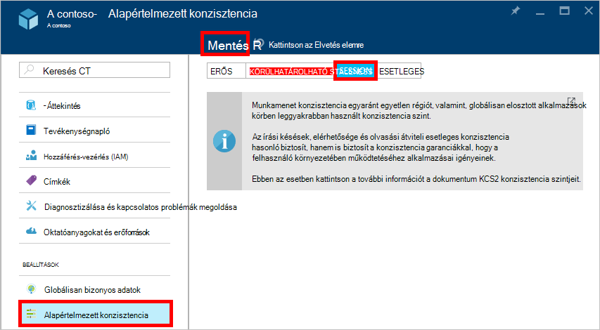

<properties
    pageTitle="Egységesebb szintjén DocumentDB |} Microsoft Azure"
    description="DocumentDB négyszintű konzisztencia egyenleg esetleges konzisztencia, az elérhetőség és a késés kompromisszumok."
    keywords="esetleges összhangot, documentdb azure, a Microsoft azure"
    services="documentdb"
    authors="syamkmsft"
    manager="jhubbard"
    editor="cgronlun"
    documentationCenter=""/>

<tags
    ms.service="documentdb"
    ms.workload="data-services"
    ms.tgt_pltfrm="na"
    ms.devlang="na"
    ms.topic="article"
    ms.date="08/24/2016"
    ms.author="syamk"/>

# DocumentDB konzisztencia szintjén

Azure DocumentDB szolgál az alapoktól kezdve be globális eloszláshoz szem előtt. Kínálnak kiszámíthatóan kis késés garanciákkal, egy 99.99 % elérhetősége SLA és több pontosan meghatározott mérsékelten konzisztencia modellek szolgál. Jelenleg DocumentDB tartalmaz-e négy konzisztencia szintek: erős, határolt staleness, munkamenetet, és az esetleges. A **erős** és az **esetleges konzisztencia** mellett modellek gyakran által kínált más NoSQL adatbázisok DocumentDB is kínál két gondosan kódolt és operationalized konzisztencia modell – **staleness határolt** és a **munkamenet**-, és a valós használati eset ellen használhatóságát érvényesített. Közösen e négy konzisztencia szintek lehetővé teszi, hogy jól indokolt kompromisszumok konzisztencia, az elérhetőség és a késés között. 

## Egységesebb köre

Egyetlen felhasználó kérésre konzisztencia granularitása megfelelően változik. Az írási kérelem a Beszúrás, a csere, a upsert felel meg, vagy törlése (vagy anélkül társított előtti vagy utáni eseménykód végrehajtásának) tranzakció. Vagy fölé egy partíciót belül több dokumentum működő JavaScript tárolt eljárás tranzakció alapú végrehajtásának írási kérelem előfordulhat, hogy egyeznek. Az írások, az olvasási/lekérdezés tranzakció is hatóköre arra a felhasználói egyetlen. A felhasználó szükség lehet egy nagy fölé megjelenítheti-eredményhalmaz, több partíciót tartó, de egyes olvasni, tranzakció egyetlen oldalra változik, és egy partíciót belül a felszolgált.

## Egységesebb szintek

Egy alapértelmezett konzisztencia szint adhatja meg az adatbázis-fiókot alkalmazott összes gyűjtemények (át az adatbázisok mindegyikét) területen az adatbázis-fiókot. Olvasás és a lekérdezések szemben a felhasználó által definiált erőforrások kiadott alapértelmezés szerint az alapértelmezett konzisztencia szint az adatbázis-fiókot a megadott fogja használni. Egy adott olvasási/lekérdezés kérelmet konzisztencia szintjét azonban az [[x ms-konzisztencia-szintű]](https://msdn.microsoft.com/library/azure/mt632096.aspx) kérés fejléce megadásával is enyhítése. Négyféle konzisztencia szintek a DocumentDB replikációs protokoll által támogatott egy adott konzisztencia garanciáit és a teljesítmény elérése érdekében között a világos csökkentés nyújtó alábbiakban leírtak szerint.

![Jól DocumentDB kínál több, meghatározott (mérsékelten) konzisztencia modellek közül választhat][1]

**Erős**: 

- Erős konzisztencia felajánlja a különféle [linearizability](https://aphyr.com/posts/313-strong-consistency-models) garancia, az olvasás garantált visszaadja egy dokumentum legutóbbi változatát. 
- Erős konzisztencia biztosítja, hogy az írási csak látható, a legtöbb kvórum kópiák a tartósan lekötött után. Az írási vagy lelassulását elkötelezte magát tartósan az elsődleges és a formátumú másodlagos zónák a határozatképességhez, vagy megszakadt azt. A legtöbb, olvassa el a kvórum szerint mindig ismerni a olvasási, egy ügyfél-nem véglegesített vagy részleges írási soha nem látható, és mindig a legújabb elismert írás olvasása garantált. 
- Erős konzisztencia használatára konfigurált fiókok DocumentDB DocumentDB fiókjukat nem egynél több Azure régió társítani. 
- Olvasási művelet ( [kérés egységek](documentdb-request-units.md) elfogyasztott mennyiség) számát tekintve költségét erős konzisztencia nagyobb, mint a munkamenet és az esetleges, de körülhatárolható staleness megegyezik.
 

**Bounded staleness**: 

- Az olvasás késleltetés mögött írások által kell nagyobb a *K* verziókat és a prefixumokban a dokumentum vagy a *t* staleness konzisztencia biztosítékokat határolt időköz. 
- Emiatt kiválasztása határolt staleness, amikor a "staleness" beállíthatók kétféle módon: 
    - A dokumentumot, amellyel az olvasás mögött az írások időbeli eltérés *K* verzióinak száma
    - Időtartam- *t* 
- Határolt staleness ajánlatok teljes globális rendelési kivételével a "staleness"ablakon belül. Belső és külső is az "staleness ablak" terület látható, hogy az monoton olvasás garantálja szerepel. 
- Körülhatárolható staleness munkamenet vagy esetleges konzisztencia erősebb konzisztencia garanciát nyújt. Globálisan elosztott alkalmazások esetén ajánlott körülhatárolható staleness felhasználási területei hol szeretné, hogy erős konzisztencia van, de is szeretné a 99.99 % rendelkezésre állásának és a kis késés. 
- Körülhatárolható staleness konzisztencia konfigurált fiókok DocumentDB Azure régiók tetszőleges számú társíthat a DocumentDB fiókjukkal. 
- Az olvasási művelet (értelmez RUs az elfogyasztott mennyiség) költsége körülhatárolható staleness nagyobb, mint a munkamenet és esetleges összhangot, de erős konzisztencia megegyezik.

**Munkamenet**: 

- A globális konzisztencia modellek erős és amelyeket staleness konzisztencia szintek által kínált, eltérően munkamenet konzisztencia ügyfél munkamenetre megfelelően változik. 
- Munkamenet konzisztencia ideális minden olyan esetben, ahol van szó egy eszköz vagy a felhasználó-munkamenetet, mivel monoton olvasása, monoton írások és a saját írások (RYW) garantálja olvasás biztosítja. 
- Munkamenet konzisztencia kiszámíthatóan konzisztencia nyújt a munkamenetet, és a maximális, olvassa el az átviteli kínáló a legalacsonyabb késés írása és olvasása közben. 
- A munkamenet konzisztencia konfigurált fiókok DocumentDB Azure régiók tetszőleges számú társíthat a DocumentDB fiókjukkal. 
- Az olvasási művelet (értelmez RUs az elfogyasztott mennyiség) költsége munkamenet konzisztencia szinten van kisebb, mint erős, és amelyeket staleness, de több, mint az esetleges konzisztencia
 

**Esetleges**: 

- Esetleges konzisztencia garantálja, hogy minden további írások hiányában a replikák csoporton belül fog ahányat szerveződik. 
- Esetleges konzisztencia hol hozzá a ügyfél előfordulhat, hogy az értékek, amelyek régebbi, mint a látott volna lehetőségekből konzisztencia leggyengébb formájában.
- Esetleges konzisztencia leggyengébb olvasási következetességét rendelkezik, de a legalacsonyabb várakozási olvasása és írása is kínál.
- Az esetleges konzisztencia konfigurált fiókok DocumentDB Azure régiók tetszőleges számú társíthat a DocumentDB fiókjukkal. 
- Az olvasási művelet (értelmez RUs az elfogyasztott mennyiség) költsége az esetleges konzisztencia szinten a legalacsonyabb a DocumentDB konzisztencia szintek.

## Egységesebb garanciákkal

Az alábbi táblázat a négy konzisztencia szintek megfelelő különböző konzisztencia garanciákkal rögzíti.

| Garancia                                                         |    Erős                                       |    Körülhatárolható Staleness                                                                           |    Munkamenet                                       |    Esetleges                                 |
|----------------------------------------------------------|-------------------------------------------------|------------------------------------------------------------------------------------------------|--------------------------------------------------|--------------------------------------------------|
|    **Teljes globális rendelési**                                |    igen                                          |    Igen, a "staleness ablak" kívül                                                      |    Nem, részleges "munkamenet" rendelés                   |    nem                                            |
|    **Egységes előtag garancia**                       |    igen                                          |    igen                                                                                         |    igen                                           |    igen                                           |
|    **Monoton olvasása**                                   |    igen                                          |    Igen, egy terület, mindig belül és kívül a staleness ablak területek között.     |    Igen, az adott munkamenetben                    |    nem                                            |
|    **Monoton írása**                                  |    igen                                          |    igen                                                                                         |    igen                                           |    igen                                           |
|    **Az írás olvasása**                                  |    igen                                          |    igen                                                                                         |    Igen (a régióban írási)                      |    nem                                            |

## Az alapértelmezett konzisztencia szint konfigurálása

1.  Kattintson az [Azure portálon](https://portal.azure.com/), a Jumpbar, **DocumentDB (NoSQL)**.

2. Jelölje ki az adatbázis-fiókot módosításához a **DocumentDB (NoSQL)** lap.

3. Kattintson a fiók lap **alapértelmezett konzisztencia**.

4. Az **Alapértelmezett konzisztencia** lap jelölje be az új konzisztencia szint, és kattintson a **Mentés**gombra.

    

## A lekérdezések konzisztencia szintek

A felhasználó által definiált erőforrások, alapértelmezés szerint konzisztencia lekérdezések szintje ugyanaz, mint a konzisztencia szint az olvasást. Alapértelmezés szerint az index frissítése szinkron minden Beszúrás, cseréje vagy törlése a webhelycsoport egy dokumentumot. Lehetővé teszi, hogy a dokumentum olvasása konzisztencia azonos szintű elfogadja a lekérdezések. DocumentDB optimalizált írási és támogatja a dokumentum írások, szinkron index karbantartási és egységes lekérdezések szolgáló tartós mennyiségű, miközben az index lazily frissítéséhez egyes webhelycsoportok is beállíthatja. További Lusta indexelés a írási hanghatások és ideális tömeges bevitel esetek elsősorban olvasható nehéz terhelési esetén.  

Az indexelési mód|  Olvasás|  Lekérdezések  
-------------|-------|---------
Azonos (alapértelmezett)|   Kijelölés az erős, körülhatárolható staleness munkamenetet, és az esetleges|    Kijelölés az erős, körülhatárolható staleness munkamenetet, és az esetleges|
Lusta|   Kijelölés az erős, körülhatárolható staleness munkamenetet, és az esetleges|    Esetleges  

Mint olvasási kéréseivel csökkenthető adott kérést konzisztencia szintjét az [x az ms-konzisztencia-szintű](https://msdn.microsoft.com/library/azure/mt632096.aspx) kérés fejléce megadásával.

## Következő lépések

Végezze el a további olvasási kapcsolatos összhangot szintjeivel és a kompromisszumok mezőkódokkal, javasoljuk az alábbi forrásokat:

-   Doug Terry. Replikált adatok konzisztencia magyarázata baseballban (videó) keresztül.   
[https://www.YouTube.com/watch?v=gluIh8zd26I](https://www.youtube.com/watch?v=gluIh8zd26I)
-   Doug Terry. Replikált adatok konzisztencia magyarázata baseballban keresztül.   
[http://Research.microsoft.com/Pubs/157411/ConsistencyAndBaseballReport.PDF](http://research.microsoft.com/pubs/157411/ConsistencyAndBaseballReport.pdf)
-   Doug Terry. Munkamenet garanciákkal gyengén egységes replikált adatokhoz.   
[http://DL.ACM.org/CITATION.cfm?id=383631](http://dl.acm.org/citation.cfm?id=383631)
-   Daniel Abadi. A régi elosztott rendszerek adatbázisterv konzisztencia kompromisszumok: Vonalvég része csak a szövegegység ".   
[http://Computer.org/CSDL/mags/Co/2012/02/mco2012020037-ABS.HTML](http://computer.org/csdl/mags/co/2012/02/mco2012020037-abs.html)
-   Péter Bailis, Shivaram Venkataraman, Lukács J. Franklin, Joseph M. Hellerstein, Ion Stoica. Probabilisztikus határolt Staleness (PBS) vonatkozó gyakorlati részleges határozatképességére.   
[http://vldb.org/pvldb/vol5/p776_peterbailis_vldb2012.PDF](http://vldb.org/pvldb/vol5/p776_peterbailis_vldb2012.pdf)
-   Wernernek Vogels. Esetleges egységes - javított változat.    
[http://allthingsdistributed.com/2008/12/eventually_consistent.HTML](http://allthingsdistributed.com/2008/12/eventually_consistent.html)

[1]: ./media/documentdb-consistency-levels/consistency-tradeoffs.png
