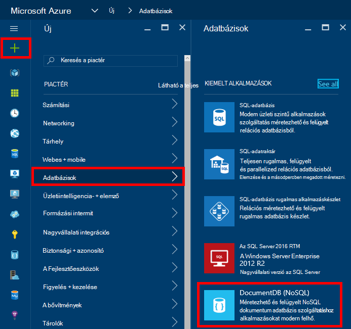
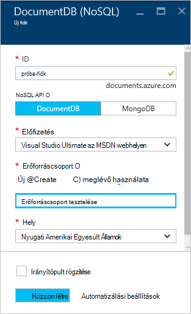
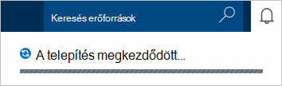
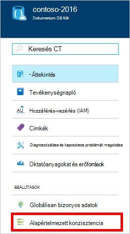
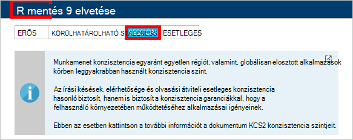

<properties
    pageTitle="Hogyan hozhat létre egy DocumentDB fiók |} Microsoft Azure"
    description="Azure DocumentDB NoSQL adatbázis készítése. Ezek a lépések egy DocumentDB fiók létrehozása és az blazing gyors, a globális skála NoSQL adatbázis létrehozása." 
    keywords="adatbázis készítéséhez"
    services="documentdb"
    documentationCenter=""
    authors="mimig1"
    manager="jhubbard"
    editor="monicar"/>

<tags
    ms.service="documentdb"
    ms.workload="data-services"
    ms.tgt_pltfrm="na"
    ms.devlang="na"
    ms.topic="get-started-article"
    ms.date="10/17/2016"
    ms.author="mimig"/>

# Hogyan lehet az Azure portálon DocumentDB NoSQL fiók létrehozása

> [AZURE.SELECTOR]
- [Azure portál](documentdb-create-account.md)
- [Azure CLI és Azure erőforrás-kezelő](documentdb-automation-resource-manager-cli.md)

Microsoft Azure DocumentDB adatbázis készítéséhez a következőket kell tennie:

- Azure-fiók van. Ha nincs telepítve egyik már egy [ingyenes Azure-fiók](https://azure.microsoft.com/free) elérheti. 
- Hozzon létre egy DocumentDB fiókot.  

Létrehozhat egy DocumentDB fiókot a következők egyikét használja, az Azure portál, erőforrás-kezelő Azure sablonok vagy Azure parancssori kezelőfelületről. Ebből a cikkből megtudhatja, hogyan hozhat létre egy DocumentDB fiókot az Azure portálon. Hozzon létre egy fiókot, erőforrás-kezelő Azure vagy Azure CLI használatával, olvassa el a [DocumentDB automatizálása az adatbázis-fiók létrehozása](documentdb-automation-resource-manager-cli.md).

Még nem használta az DocumentDB? [Ebből](https://azure.microsoft.com/documentation/videos/create-documentdb-on-azure/) a videóból négy perces által Scott Hanselman megtudhatja, hogy miként az online portálon a leggyakoribb feladatok elvégzésére.

1.  Jelentkezzen be az [Azure-portálon](https://portal.azure.com/).
2.  A Jumpbar, a kattintson az **Új** **adatbázisok**kattintson, és válassza a **DocumentDB (NoSQL)**. 

      

3. Az **Új fiók** lap adja meg a kívánt konfiguráció DocumentDB fiók.

    

    - Az **azonosító** mezőbe írja be egy nevet, amely azonosítja a DocumentDB fiókot.  Amikor **azonosító** érvényesítése, zöld pipa jelzi megjelenik az **azonosító** mezőbe. Az **azonosító** értéke az állomásnév belül a URI lesz. Az **azonosító** tartalmazhat csak a kisbetűket, számok, és a "-" karakter, és a 3 és 50 karakter közé kell lennie. Figyelje meg, hogy *documents.azure.com* van ellátva, amelynek eredménye változik a DocumentDB fiók végpont lehetőséget választja, végpontjának neve.

    - A **NoSQL API** mezőben válassza ki a programozási modellt:
        - **DocumentDB**: az DocumentDB API .NET, Java, Node.js, Python és JavaScript [SDK](documentdb-sdk-dotnet.md), valamint HTTP [többi](https://msdn.microsoft.com/library/azure/dn781481.aspx)keresztül érhető el, és az összes DocumentDB funkciója programozott hozzáférést biztosít. 
       
        - **MongoDB**: **MongoDB** API-khoz is kínál [protokoll szintű támogatási](documentdb-protocol-mongodb.md) DocumentDB. Ha a MongoDB API lehetőséget választja, a meglévő MongoDB SDK és [eszközök](documentdb-mongodb-mongochef.md) segítségével DocumentDB beszélhet. Akkor [áthelyezése](documentdb-import-data.md) a meglévő MongoDB alkalmazások használatához [nincs szükség kód módosításai](documentdb-connect-mongodb-account.md), DocumentDB, és szolgáltatásként korlátlan skála, globális replikációs és más funkciók teljes körű felügyelt adatbázis előnyeit.

    - **Előfizetés**jelölje be az Azure előfizetés DocumentDB fióknak használni kívánt. Ha a fiók csak egy előfizetéssel rendelkezik, a fiók alapértelmezés szerint van jelölve.

    - **Erőforráscsoport**jelölje be, vagy hozzon létre egy erőforrás csoportot a DocumentDB fiók.  Alapértelmezés szerint új erőforráscsoport jön létre. További tudnivalókért lásd: [az Azure portálon kezelheti az Azure erőforrások](../articles/azure-portal/resource-group-portal.md).

    - **Hely** segítségével adja meg, amelyben tárolni a DocumentDB fiók földrajzi helyét. 

4.  Miután az új DocumentDB a Fiókbeállítások van beállítva, kattintson a **Létrehozás**gombra. A telepítés állapotának ellenőrzése, jelölje be az értesítések-központban.  

      

    

5.  A DocumentDB fiók létrehozását követően az alapértelmezett beállításokkal használatra kész. Az alapértelmezett konzisztencia DocumentDB fiók **munkamenet**értékre van állítva.  Beállíthatja, hogy az alapértelmezett konzisztencia az erőforrás menü **Alapértelmezett konzisztencia** gombra kattintva. További DocumentDB által kínált kapcsolatos összhangot, olvassa el a [DocumentDB konzisztencia szintjén](documentdb-consistency-levels.md)című témakört.

      

      

[How to: Create a DocumentDB account]: #Howto
[Next steps]: #NextSteps
[documentdb-manage]:../articles/documentdb/documentdb-manage.md

## Következő lépések

Most, hogy DocumentDB fiókkal rendelkezik, a következő lépésként hozzon létre egy DocumentDB gyűjtemény és az adatbázis. 

Egy új gyűjtemény és az adatbázis hozhat létre a következő módszerek valamelyikével:

- Az Azure portál [létrehozása az Azure portálon DocumentDB gyűjtemény](documentdb-create-collection.md)leírtak szerint.
- A mindent magában foglaló oktatóanyagok, amelyek lehetnek a mintaadatok: [.NET](documentdb-get-started.md), [.NET MVC](documentdb-dotnet-application.md), [Java](documentdb-java-application.md), [Node.js](documentdb-nodejs-application.md)vagy [Python](documentdb-python-application.md).
- A [.NET](documentdb-dotnet-samples.md#database-examples), [Node.js](documentdb-nodejs-samples.md#database-examples)vagy [Python](documentdb-python-samples.md#database-examples) minta kódot GitHub érhető el.
- A [.NET](documentdb-sdk-dotnet.md), [Node.js](documentdb-sdk-node.md), [Java](documentdb-sdk-java.md), [Python](documentdb-sdk-python.md)és [többi](https://msdn.microsoft.com/library/azure/mt489072.aspx) SDK.

Az adatbázis és a webhelycsoport létrehozása, után kell a [Dokumentumok hozzáadása](documentdb-view-json-document-explorer.md) a gyűjtemények.

Után dokumentumok a gyűjteményben, használhatja [DocumentDB SQL](documentdb-sql-query.md) [lekérdezések végrehajtása](documentdb-sql-query.md#executing-queries) szemben a dokumentumait. A [Lekérdezés Explorer](documentdb-query-collections-query-explorer.md) a portálon, a [REST API -t](https://msdn.microsoft.com/library/azure/dn781481.aspx)vagy a [SDK](documentdb-sdk-dotnet.md)közül a lekérdezések hajthat végre.

### tudj meg többet

Ha többet szeretne tudni DocumentDB, az alábbi források:

-   [Tanulási javaslat DocumentDB számára](https://azure.microsoft.com/documentation/learning-paths/documentdb/)
-   [DocumentDB hierarchikus erőforrás modell és fogalmak](documentdb-resources.md)
