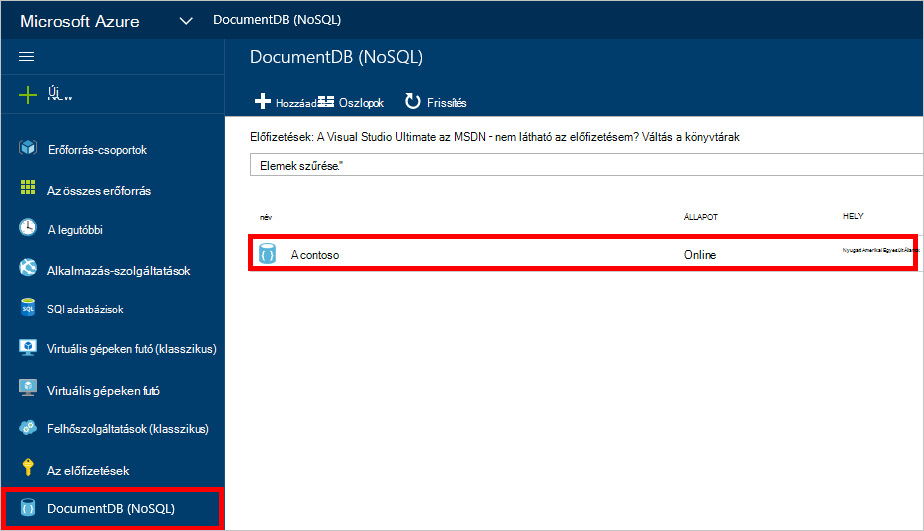
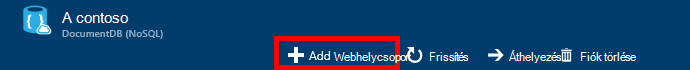
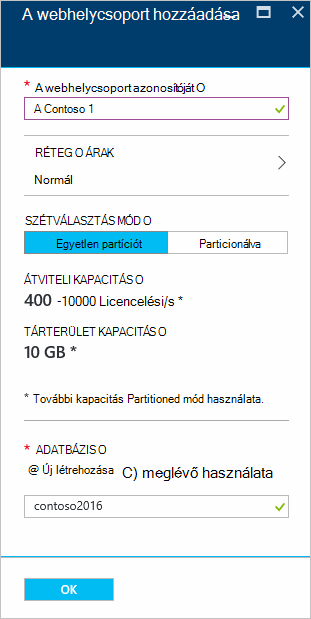
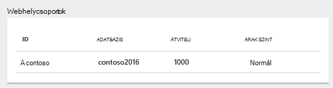
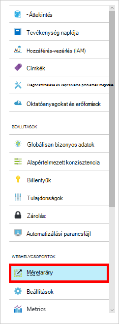

<properties 
    pageTitle="Hozzon létre egy DocumentDB adatbázis és a webhelycsoport |} Microsoft Azure" 
    description="Megtudhatja, hogy miként hozza létre az adatbázisokat NoSQL és JSON dokumentum gyűjtemények az online szolgáltatás portál használatával az Azure DocumentDB, felhő alapú dokumentum adatbázisban. Ismerkedés a ma ingyenes próbaverziót." 
    services="documentdb" 
    authors="mimig1" 
    manager="jhubbard" 
    editor="monicar" 
    documentationCenter=""/>

<tags 
    ms.service="documentdb" 
    ms.workload="data-services" 
    ms.tgt_pltfrm="na" 
    ms.devlang="na" 
    ms.topic="article" 
    ms.date="10/17/2016" 
    ms.author="mimig"/>

# Egy DocumentDB gyűjtemény és az Azure portálon adatbázis létrehozása

Microsoft Azure DocumentDB használatához rendelkeznie kell egy [DocumentDB fiók](documentdb-create-account.md), az adatbázis, a gyűjtemény és a dokumentumokat. Ez a témakör ismerteti a DocumentDB gyűjtemény létrehozása az Azure-portálon. 

Nem biztos abban, hogy milyen egy webhelycsoport van? Lásd: [Mi gyűjteménye DocumentDB?](#what-is-a-documentdb-collection)

1.  Az [Azure portált](https://portal.azure.com/)a Jumpbar, a **DocumentDB (NoSQL)**gombra, és a **DocumentDB (NoSQL)** lap, válassza a fiókot, amelyhez hozzá kívánja adni a webhelycsoport. Ha nincs olyan fiókjaihoz, kell [DocumentDB fiók létrehozása](documentdb-create-account.md).

    
    
    Ha nem látható a Jumpbar **DocumentDB (NoSQL)** , kattintson a **További szolgáltatások** elemre, és válassza a **DocumentDB (NoSQL)**. Ha nincs olyan fiókjaihoz, kell [DocumentDB fiók létrehozása](documentdb-create-account.md).

2. A kijelölt fiók **DocumentDB fiók** lap kattintson a **Webhelycsoport hozzáadása**gombra.

    

3. A **Gyűjtemény felvétele** fel az **azonosító** mezőbe írja be az új webhelycsoport azonosítója. A webhelycsoport neve 1 és 255 karakter között kell lennie, és nem tartalmazhat `/ \ # ?` vagy záró szóköz. Amikor érvényesítése a nevét, zöld pipa jelzi megjelenik az azonosító mezőbe.

    

4. Alapértelmezés szerint **Árak réteg** értéke **szabványos** , hogy testre szabhatja a teljesítmény és tárhely a webhelycsoporthoz. A árak réteg kapcsolatos további tudnivalókért olvassa el a [teljesítményszint a DocumentDB](documentdb-performance-levels.md)című témakört.  

5. Válassza ki a webhelycsoport **Partíciót** vagy a **Partitioned** **particionálására módban** . 

    **Egyetlen partíciót** egy fenntartott tárolókapacitással rendelkezik biztosított 10 gigabájtos Korlátot van-e, és beállíthatja, hogy átviteli szintek 400-10 000 kérelem egységek/második (Licencelési/s). A dokumentum 1KB olvasási kapacitásának egy Licencelési felel meg. További információt a kérelem egységek lásd: a [kérelem egységek](documentdb-request-units.md). 

    **Particionált webhelycsoport** tárolási korlátlan mennyiségű kezelésére több partíciót keresztül is méretezhető, és beállíthatja, hogy átviteli szintek 10,100 Licencelési/s karaktertől kezdve. A portálon a legnagyobb tároló foglalhat 250 GB, és a legtöbb átviteli foglalhat 250 000 Licencelési/s. Bármelyik kvóta növeléséhez küldje el a kérést [kérelem nagyobb DocumentDB fiók kvóták](documentdb-increase-limits.md)leírt módon. Particionált gyűjtemények kapcsolatos további információk megadására olvassa el a [partíciót és particionált gyűjtemények](documentdb-partition-data.md#single-partition-and-partitioned-collections)című témakört.

    Alapértelmezés szerint az új partíciót gyűjtemény átviteli értéke Licencelési 1000 s tárolókapacitású biztosított 10 gigabájtos Korlátot. A webhelycsoport átviteli particionált gyűjtemény, 10100 Licencelési/s 250 GB tárolókapacitású van beállítva. A webhelycsoport létrehozását követően módosíthatja a teljesítmény és a webhelycsoport-tároló. 

6. Particionált gyűjtemény hoz létre, ha jelölje ki a webhelycsoport **Partíciót billentyűt** . Jelölje ki a megfelelő partíciót billentyűt fontos performant gyűjtemény létrehozásához. Partition kulcs kijelölése a további tudnivalókért olvassa el a [szétválasztás megtervezése](documentdb-partition-data.md#designing-for-partitioning)című témakört.

7. Az **adatbázis** lap az új adatbázis létrehozásához, vagy egy meglévőt használ. Adatbázis 1 és 255 karakter között kell lennie, és nem tartalmazhat `/ \ # ?` vagy záró szóköz. Ellenőrizze a nevére, kattintson a szövegdobozon kívülre. Ha érvényesítése a nevét, zöld pipa jelzi megjelenik a mezőben.

8. Kattintson az **OK gombra** a képernyő alján az új webhelycsoport létrehozása. 

9. Most az új webhelycsoport a **webhelycsoportok** lens meg az **Áttekintés** lap jelenik meg.
 
    

10. **Nem kötelező:** A webhelycsoport a portálon kapacitásának módosításához kattintson az erőforrás menü **skála** . 

    

## ActiveX-vezérlőket DocumentDB gyűjteménye 

Egy webhelycsoport JSON dokumentumokat és a kapcsolódó JavaScript-alkalmazás logika tároló. Egy webhelycsoport még egy számlázható egységek, ha a [költség](documentdb-performance-levels.md) határozza meg a webhelycsoport a kiépített kapacitásának. Webhelycsoportok egy vagy több partíciót/kiszolgálón is kiterjedhet, és tároló vagy átviteli gyakorlatilag korlátlan mennyiségű kezelésére is méretezhető.

Webhelycsoportok be egy vagy több fizikai kiszolgáló automatikusan particionálva a DocumentDB szerint. Amikor létrehoz egy webhelycsoport, a második és főbb tulajdonságait partíciót egy kérés egységek számát tekintve kiépített átviteli is megadhat. Ez a tulajdonság értékét használandó által DocumentDB osszon meg dokumentumokat partíciók és útvonal kérelmeket, például a lekérdezések között. A partíciók kulcsmező értékét is végpontként tárolt eljárások és indítók tranzakció határa. Minden egyes webhelycsoport egy átviteli, hogy a webhelycsoportban nincs megosztva más gyűjtemények ugyanazzal a fiókkal az adott fenntartott mennyiségű tartalmaz. Ezért méretezheti meg az alkalmazást, mind a tárhely és a teljesítmény. 

Webhelycsoportok sem ugyanaz, mint a táblák relációs adatbázisok. Webhelycsoportok nem érvényesítése a séma, valójában DocumentDB nem a hivatkozási bármely sémák, érdemes adatbázis sémája ingyenes. Ezért tárolhat dokumentumok különböző sémák a különböző típusú ugyanazt a webhelycsoportban. Megadhatja a táblákkal ugyanúgy kell egyetlen típusú objektumok gyűjtemények használva. A legjobb modell függ, hogy csak az adatok megjelenése közös lekérdezések és tranzakciók.

## Hozzon létre egy DocumentDB gyűjteményt egyéb módjai

Webhelycsoportok nem rendelkezik a portálon létrehozni, szükség esetén létrehozhatja őket a [DocumentDB SDK](documentdb-sdk-dotnet.md) és a REST API-t. 

- C# kód minta a [C# webhelycsoport minták](documentdb-dotnet-samples.md#collection-examples)című témakör tartalmaz. 
- Node.js kód minta [Node.js webhelycsoport minták](documentdb-nodejs-samples.md#collection-examples)című témakör tartalmaz.
- Python kód minta [Python webhelycsoport minták](documentdb-python-samples.md#collection-examples)című témakör tartalmaz.
- Minta REST API-t a [egy webhelycsoport létrehozása](https://msdn.microsoft.com/library/azure/mt489078.aspx)című témakör tartalmaz.

## Hibaelhárítás

**Webhelycsoport hozzáadása** az Azure-portálon le van tiltva, ha ez azt jelenti, a fiók le van tiltva, a szokásos módon amely fordul elő, ha az adott hónap előnyeinek credits használják.   

## Következő lépések

Most, hogy van egy webhelycsoport, következő lépésként dokumentumok hozzáadása és dokumentumok importálása a gyűjteményben. Amikor a dokumentumok hozzáadása egy webhelycsoport, akkor néhány lehetőség közül választhat:

- Azt is megteheti [Dokumentumok hozzáadása](documentdb-view-json-document-explorer.md) a dokumentum Intézővel a portálon.
- Használatával az DocumentDB adatok áttelepítési eszköz, amely lehetővé teszi, hogy JSON és a CSV-fájlok importálása, valamint az SQL Server, MongoDB, Azure táblatárolóhoz és más DocumentDB gyűjtemények adatainak [importálása dokumentumok és adatok](documentdb-import-data.md) is. 
- Vagy a [DocumentDB SDK](documentdb-sdk-dotnet.md)használatával dokumentumokat is hozzáadhat. DocumentDB .NET, Java, Python, Node.js és JavaScript API SDK tartalmaz. C# kód minták ábrázoló a DocumentDB .NET SDK használatával dokumentumokkal dolgozik a [C# dokumentum minták](documentdb-dotnet-samples.md#document-examples)című témakör tartalmaz. Dokumentumok kezelése a DocumentDB Node.js SDK használatával ábrázoló Node.js mintakódok a [Node.js dokumentum minták](documentdb-nodejs-samples.md#document-examples)című témakör tartalmaz.

Után dokumentumok a gyűjteményben, segítségével [DocumentDB SQL](documentdb-sql-query.md) [lekérdezések végrehajtása](documentdb-sql-query.md#executing-queries) szemben a dokumentumokat a portálon, a [REST API -t](https://msdn.microsoft.com/library/azure/dn781481.aspx)vagy a [SDK](documentdb-sdk-dotnet.md)közül a [Lekérdezés Intéző](documentdb-query-collections-query-explorer.md) használatával. 
