<properties 
    pageTitle="DocumentDB és Azure alkalmazás szolgáltatás Web Apps-Azure erőforrás-kezelő sablonnal telepítése |} Microsoft Azure" 
    description="Megtudhatja, hogy miként üzembe egy DocumentDB partner, a Azure alkalmazás szolgáltatás Web Apps alkalmazások és a minta webalkalmazás erőforrás-kezelő Azure-sablon segítségével." 
    services="documentdb, app-service\web" 
    authors="h0n" 
    manager="jhubbard" 
    editor="monicar" 
    documentationCenter=""/>

<tags 
    ms.service="documentdb" 
    ms.workload="data-services" 
    ms.tgt_pltfrm="na" 
    ms.devlang="na" 
    ms.topic="article" 
    ms.date="08/02/2016" 
    ms.author="hawong"/>

# DocumentDB és Azure alkalmazás szolgáltatás Web Apps-Azure erőforrás-kezelő sablonnal terjesztése

Ebből az oktatóanyagból megtudhatja, hogyan üzembe helyezéséhez és integráció a [Microsoft Azure DocumentDB](https://azure.microsoft.com/services/documentdb/), az [Azure alkalmazás szolgáltatás](http://go.microsoft.com/fwlink/?LinkId=529714) web app és minta webalkalmazás egy erőforrás-kezelő Azure-sablon segítségével.

Erőforrás-kezelő Azure sablonok használata, egyszerűen automatizálhatja a telepítési és konfigurációs Azure erőforrásait.  Ebből az oktatóanyagból megtudhatja, hogy miként webalkalmazás telepítése, és automatikusan konfigurálja a kapcsolat fiókadatok DocumentDB.

Ebben az oktatóanyagban befejeztével fogja tudni az alábbi kérdésekre választ:  

-   Hogyan használhatom az erőforrás-kezelő Azure-sablon üzembe helyezéséhez és egy DocumentDB fiók és egy webalkalmazás Azure App szolgáltatásban?
-   Hogyan használhatom az erőforrás-kezelő Azure-sablon üzembe helyezéséhez és integráció a DocumentDB fiók, az alkalmazás szolgáltatás webalkalmazásokban webalkalmazást és egy Webdeploy alkalmazás?

## Előfeltételek
> [AZURE.TIP] Ebben az oktatóanyagban nem tegyük fel, az erőforrás-kezelő Azure sablonok vagy JSON előzetes élmény, miközben kell módosítani kívánt a hivatkozott sablonok és telepítési lehetőségek, majd az egyes ezekre a területekre Tudásbázis frissítenie kell.

Ebben az oktatóanyagban utasításai előtt győződjön meg arról, hogy a következő:

- Egy Azure-előfizetést. Azure platform előfizetés-alapú.  Előfizetés beszerzésével kapcsolatos további tudnivalókért lásd: a [Vételi beállítások](https://azure.microsoft.com/pricing/purchase-options/), [Tag kínál](https://azure.microsoft.com/pricing/member-offers/), vagy az [Ingyenes próbaverziót](https://azure.microsoft.com/pricing/free-trial/).

##Lépés: 1: A sablon fájlok letöltése ##
Első lépésként a sablonfájlokat fogjuk használni az oktatóprogram letöltése.

1. Töltse le az [egy DocumentDB fiókot, a Web Apps, készíthetnek és helyezhetnek üzembe a bemutató alkalmazás minta](https://portalcontent.blob.core.windows.net/samples/DocDBWebsiteTodo.json) helyi mappát (például C:\DocumentDBTemplates). Ez a sablon egy DocumentDB fiókot, az alkalmazás szolgáltatás web app és webalkalmazás telepítésének.  Azt is automatikusan beállítja a DocumentDB fiókhoz való csatlakozáshoz a webes alkalmazás.

2. Töltse le az [DocumentDB fiók létrehozása és Web Apps alkalmazások minta](https://portalcontent.blob.core.windows.net/samples/DocDBWebSite.json) helyi mappát (például C:\DocumentDBTemplates). Ezzel a sablonnal DocumentDB-fiókja, az alkalmazás szolgáltatás web app telepítésének és módosítja könnyen felszíni DocumentDB kapcsolat adatait a webhely beállításai, de nem tartalmaz egy webalkalmazást.  

##Lépés: 2: A fiók DocumentDB, alkalmazás szolgáltatás web app és a bemutató alkalmazás minta terjesztése

Most vegyük üzembe az első sablont.

> [AZURE.TIP] A sablon nem ellenőrzi, hogy a web app és alatti megadott DocumentDB fiók nevét, hogy a) érvényes és b) érhető el.  Ajánlott megbizonyosodott róla, hogy a nevét adja meg a telepítési elküldése előtt szeretné az elérhető.

1. Bejelentkezés a [Azure portál](https://portal.azure.com), kattintson az új gombra, és a "Sablon telepítéshez" Keresés.
    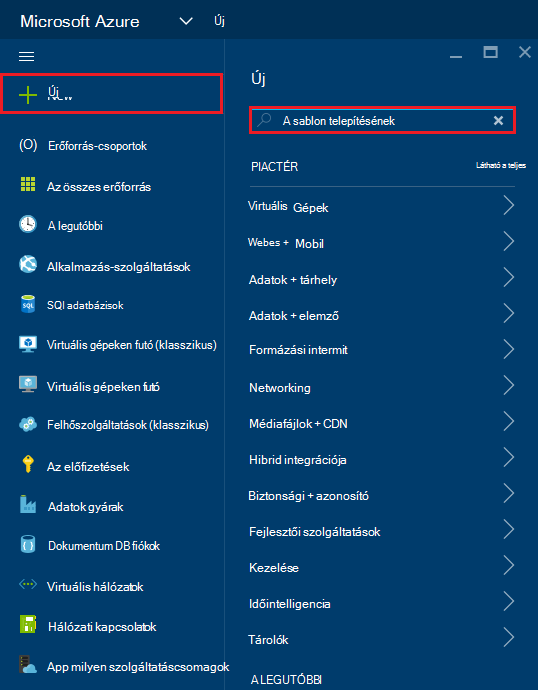

2. Jelölje ki a sablon telepítési elemet, és kattintson a **Létrehozás**
    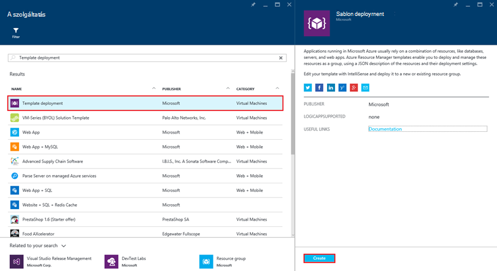

3.  Kattintson a **sablon szerkesztése**, a DocDBWebsiteTodo.json sablonfájl tartalmának beillesztése, és kattintson a **Mentés**gombra.
    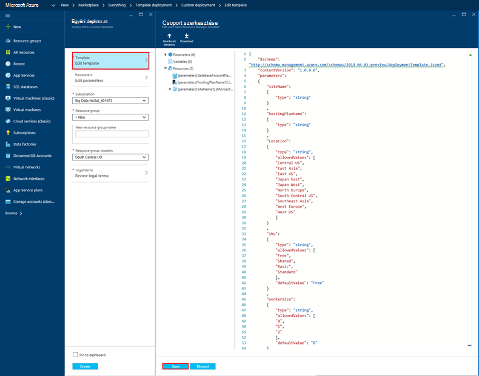

4. Kattintson a **szerkesztése paramétereinek**, adjon meg értéket a kötelező paraméterek mindegyikében, és kattintson az **OK gombra**.  A paraméterek a következők:

    1. SITENAME: Web app alkalmazás szolgáltatás neve és az URL-címet a web app eléréséhez használt összeállításához (például ha, adja meg a "mydemodocdbwebapp", akkor az URL-cím, amellyel a web app fér lesz mydemodocdbwebapp.azurewebsites.net).

    2. HOSTINGPLANNAME: Itt adhatja meg az alkalmazás szolgáltatás üzemeltetési előfizetésére hozhat létre.

    3. HELYE: Itt adhatja meg az Azure helyet, ahová a DocumentDB és web app erőforrások létrehozása.

    4. DATABASEACCOUNTNAME: A neve a DocumentDB fiók létrehozásához.   

    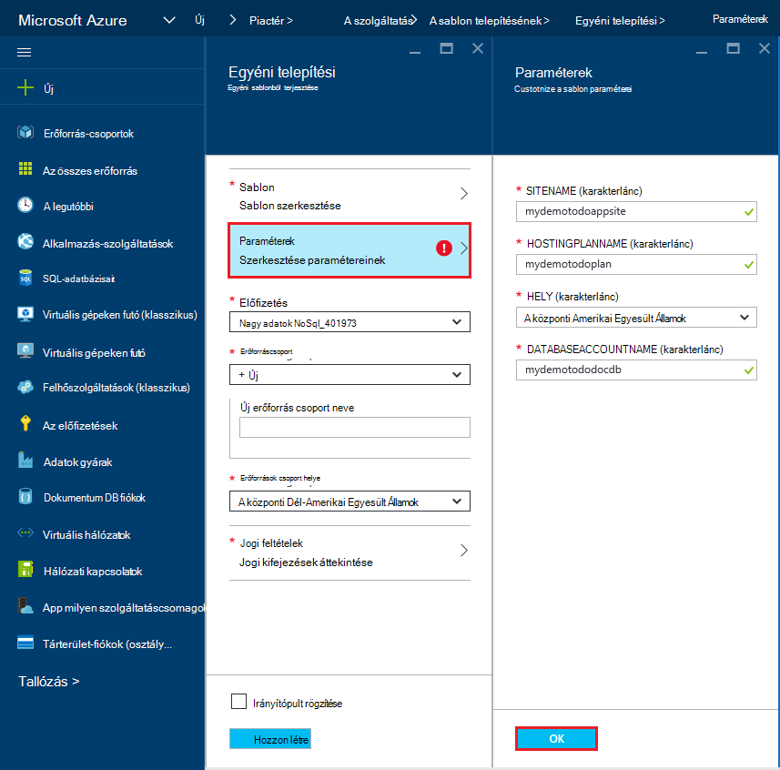

5. Válassza a meglévő erőforráscsoport vagy adja meg, hogy új erőforráscsoport a nevét, és válasszon egy helyet az erőforráscsoport.
    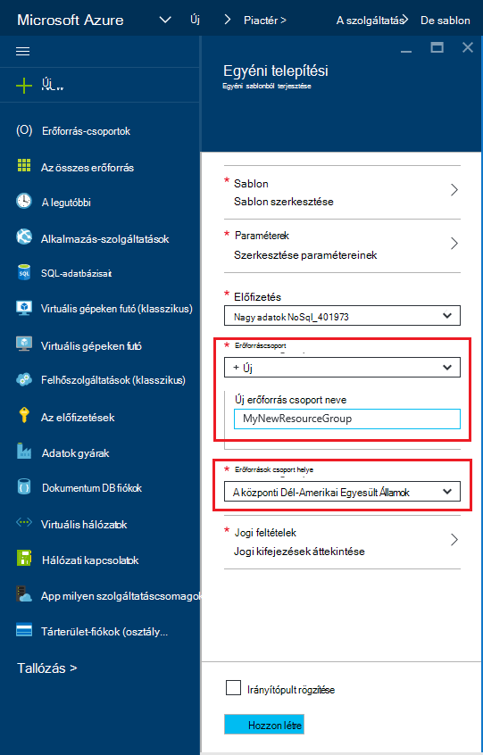
  
6.  Kattintson a **Véleményezés jogi feltételek**, **megvásárlása**, és kattintson a **Create** a telepítés megkezdéséhez.  Jelölje be a **Pin-irányítópult** , így az eredményül kapott telepítési egyszerűen látható, az Azure portál Kezdőlap lapján.
    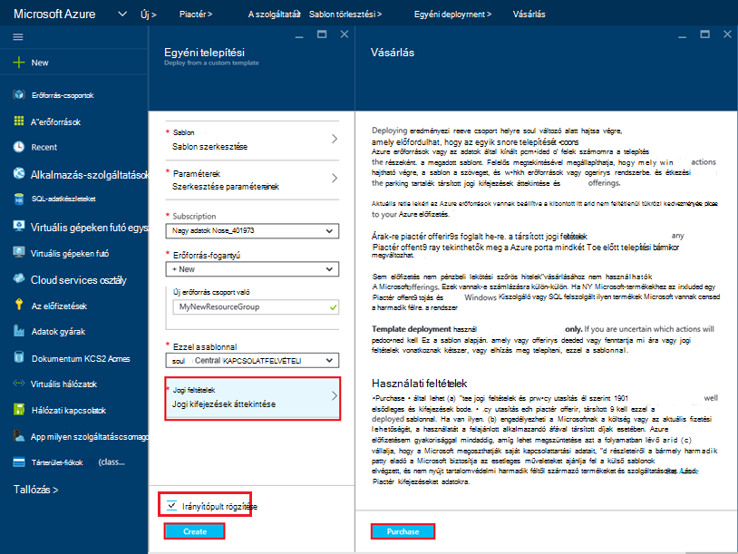

7.  Amikor befejeződött a telepítés, az erőforrás csoport lap nyílik meg.
    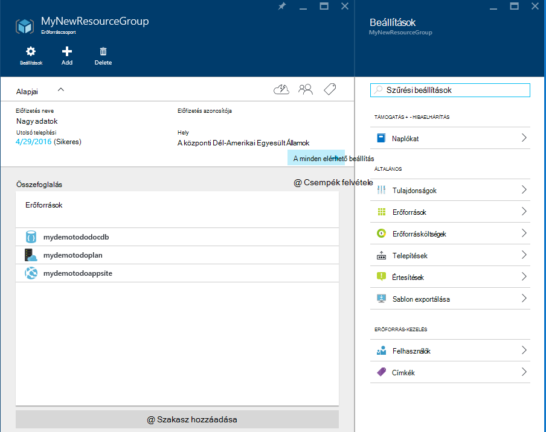  

8.  Az alkalmazás használatát, egyszerűen keresse meg a web app URL-címe (a példában az URL-cím lenne http://mydemodocdbwebapp.azurewebsites.net).  A következő webalkalmazás jelenik meg:

    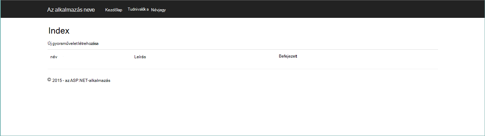

9. Jóváhagyást, és néhány feladatok létrehozása a web App alkalmazásban, és térjen vissza az erőforrás csoport lap az Azure-portálon. Kattintson a DocumentDB fiók erőforrásra erőforrások listában, és kattintson a **Lekérdezés Explorer**gombra.
    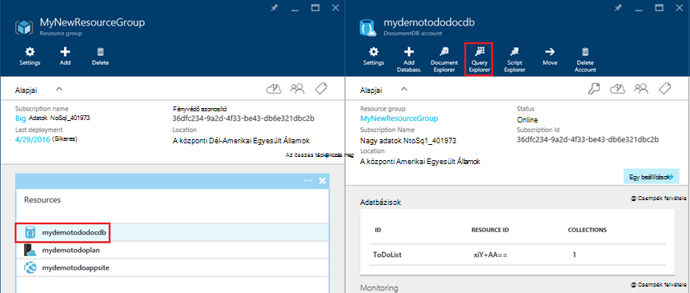  

10. Futtassa az alapértelmezett lekérdezés, a "SELECT *FROM c", és nézze meg az eredményeket.  Figyelje meg, hogy a lekérdezés fogadta 7 a fenti lépésben létrehozott teendők elemek JSON ábrázolása.  Nyugodtan kísérletezhet a lekérdezések; Válassza ki például hibaelhárító* a c WHERE c.isComplete = igaz, amely a készként megjelölt összes teendő-elemeket kell visszaadni.

    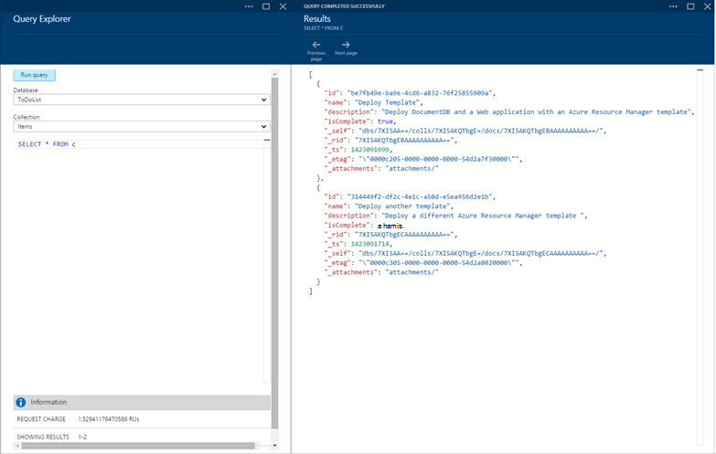

11. Nyugodtan feltárása a DocumentDB portál felület, vagy módosítsa az minta teendők alkalmazást.  Ha készen áll, nézzük üzembe egy másikat.
    
 
## 3 lépés: A dokumentum fiók és a web app minta terjesztése

Most vegyük üzembe a második sablont.  Ezzel a sablonnal akkor hasznos, hogyan, is DocumentDB kapcsolat adatait, például fiók végpontot, és a fő kulcs helyezhet el egy web app alkalmazás beállításait, vagy egy egyéni kapcsolat-karakterlánc megjelenítéséhez. Ha például talán van a saját webalkalmazás, amelyeket szeretne DocumentDB fiókkal telepítése, és a kapcsolat adatait automatikusan kitölti a rendszer a telepítés során.

> [AZURE.TIP] A sablon nem ellenőrzi, hogy a web app és alatti megadott DocumentDB fiók nevét, hogy a) érvényes és b) érhető el.  Ajánlott megbizonyosodott róla, hogy a nevét adja meg a telepítési elküldése előtt szeretné az elérhető.

1. Az [Azure-portálon](https://portal.azure.com)kattintson az új webhelyet, és keressen "Sablon telepítéshez".
    

2. Jelölje ki a sablon telepítési elemet, és kattintson a **Létrehozás**
    

3.  Kattintson a **sablon szerkesztése**, a DocDBWebSite.json sablonfájl tartalmának beillesztése, és kattintson a **Mentés**gombra.
    

4. Kattintson a **szerkesztése paramétereinek**, adjon meg értéket a kötelező paraméterek mindegyikében, és kattintson az **OK gombra**.  A paraméterek a következők:

    1. SITENAME: Web app alkalmazás szolgáltatás neve és az URL-címet a web app eléréséhez használt összeállításához (például ha, adja meg a "mydemodocdbwebapp", akkor az URL-cím, amellyel a web app fér lesz mydemodocdbwebapp.azurewebsites.net).

    2. HOSTINGPLANNAME: Itt adhatja meg az alkalmazás szolgáltatás üzemeltetési előfizetésére hozhat létre.

    3. HELYE: Itt adhatja meg az Azure helyet, ahová a DocumentDB és web app erőforrások létrehozása.

    4. DATABASEACCOUNTNAME: A neve a DocumentDB fiók létrehozásához.   

    

5. Válassza a meglévő erőforráscsoport vagy adja meg, hogy új erőforráscsoport a nevét, és válasszon egy helyet az erőforráscsoport.
    
  
6.  Kattintson a **Véleményezés jogi feltételek**, **megvásárlása**, és kattintson a **Create** a telepítés megkezdéséhez.  Jelölje be a **PIN-kód irányítópult** , így az eredményül kapott telepítési egyszerűen látható, az Azure portál Kezdőlap lapján.
    

7.  Amikor befejeződött a telepítés, az erőforrás csoport lap nyílik meg.
      

8. Kattintson a Web App erőforrásra erőforrások listában, és kattintson az **alkalmazás beállításainak**
      

9. Figyelje meg, hogyan vannak a DocumentDB végpont és DocumentDB fő kulcsok bemutató beállításai.
    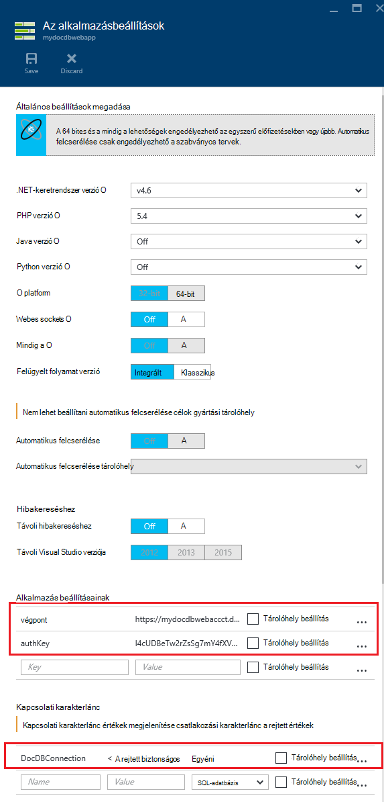  

10. Nyugodtan továbbra is az Ismerkedés az Azure-portálra, vagy hajtsa végre a saját DocumentDB [minták](http://go.microsoft.com/fwlink/?LinkID=402386) hozzon létre saját DocumentDB alkalmazást.

    
    

## Következő lépések

Gratulálok! Már telepítette a DocumentDB, az alkalmazás szolgáltatás web app és a minta webalkalmazás Azure erőforrás-kezelő sablonok használatával.

- Többet szeretne tudni a DocumentDB, kattintson [ide](http://azure.com/docdb).
- Többet szeretne tudni az Azure alkalmazás szolgáltatás Web Apps alkalmazások, kattintson [ide](http://go.microsoft.com/fwlink/?LinkId=325362).
- Többet szeretne tudni az erőforrás-kezelő Azure sablonokat, kattintson [ide](https://msdn.microsoft.com/library/azure/dn790549.aspx).

## Mi változott
* Módosítása egy segédvonalat a webhelyekre alkalmazás szolgáltatáshoz lásd: [Azure alkalmazás szolgáltatás, és a hatás a meglévő Azure-szolgáltatások](http://go.microsoft.com/fwlink/?LinkId=529714)
* Egy segédvonalat a változás az új portálra a régi portál lásd: [Összefoglalás: a Navigálás az Azure klasszikus portálra](http://go.microsoft.com/fwlink/?LinkId=529715)

>[AZURE.NOTE] Ha azt szeretné, mielőtt feliratkozna az Azure-fiók használatbavételéhez Azure alkalmazás szolgáltatás, [Próbálja meg alkalmazás szolgáltatás](http://go.microsoft.com/fwlink/?LinkId=523751), ahol azonnal létrehozhat egy rövid életű starter web app alkalmazás szolgáltatásban megnyitásához. Nem kötelező, hitelkártyák Nincs nyilatkozatát.
 
