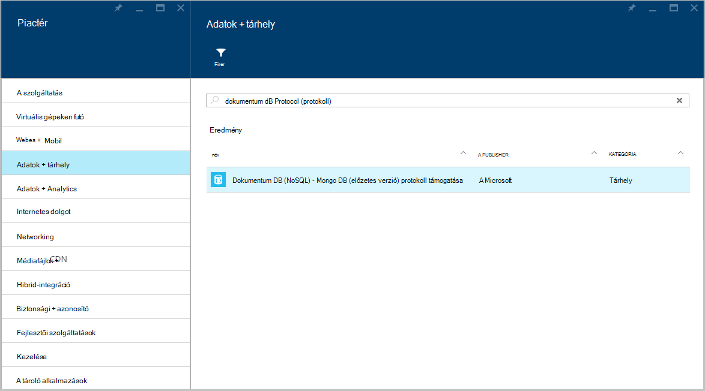
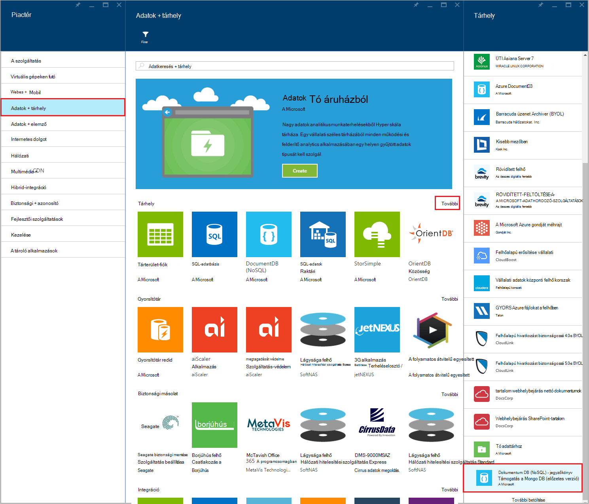
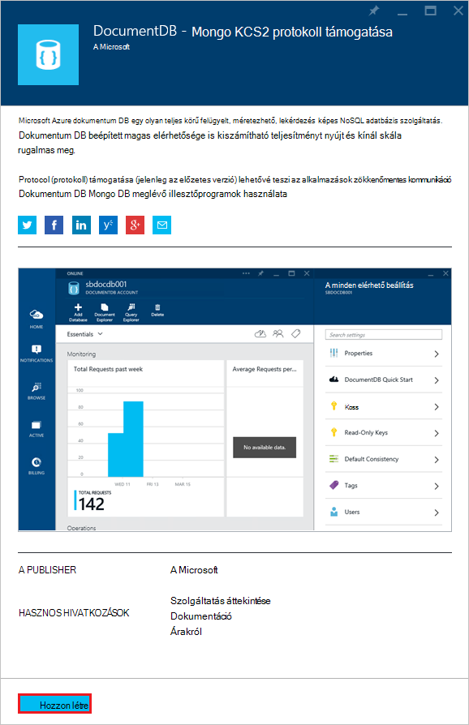
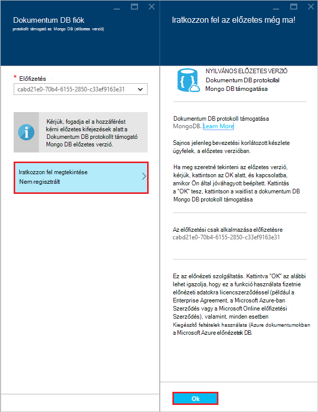
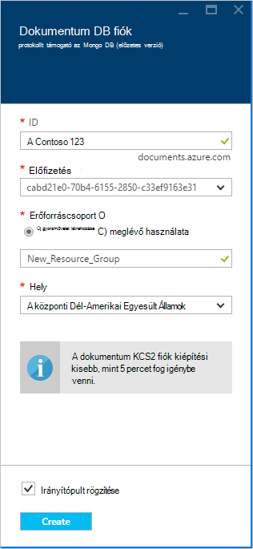
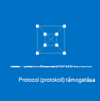
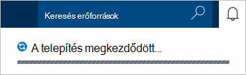
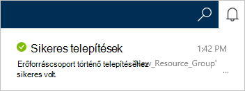
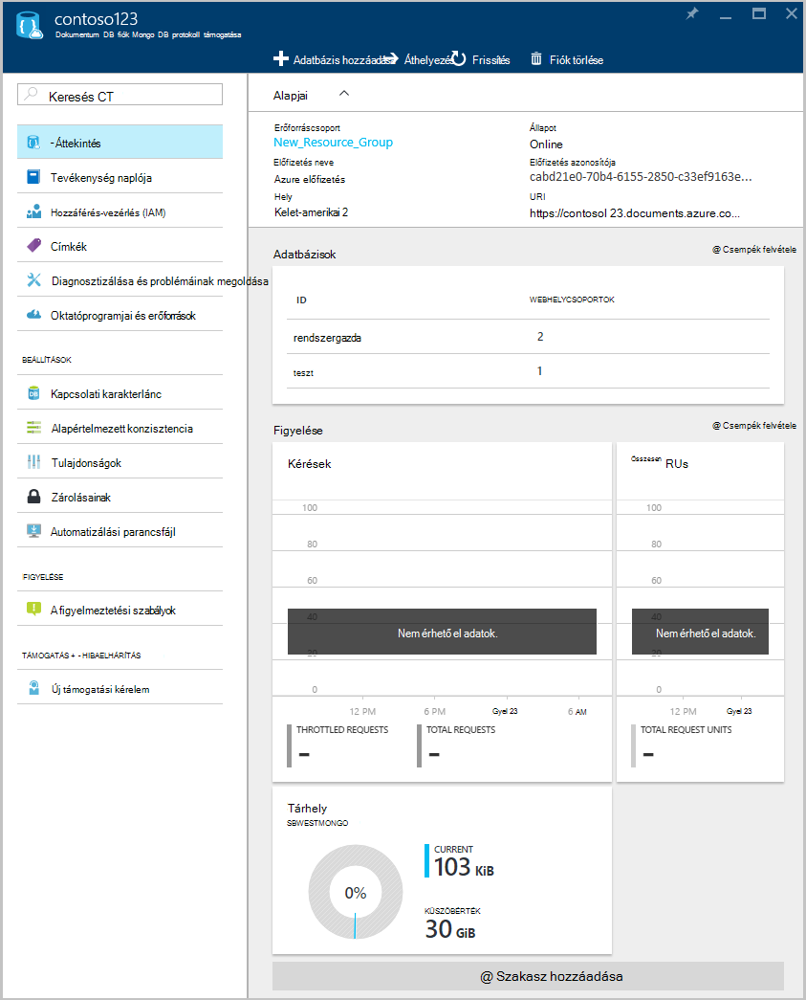

<properties 
    pageTitle="DocumentDB-fiók létrehozása MongoDB protocol támogatása |} Microsoft Azure" 
    description="Megtudhatja, hogy miként DocumentDB fiók létrehozása protokoll támogatása MongoDB, most előzetes elérhető." 
    services="documentdb" 
    authors="AndrewHoh" 
    manager="jhubbard" 
    editor="" 
    documentationCenter=""/>

<tags 
    ms.service="documentdb" 
    ms.workload="data-services" 
    ms.tgt_pltfrm="na" 
    ms.devlang="na" 
    ms.topic="article" 
    ms.date="10/20/2016" 
    ms.author="anhoh"/>

# Hogyan DocumentDB fiók létrehozása az Azure portálon MongoDB protokoll támogatása

Azure DocumentDB fiók létrehozását MongoDB protokoll támogatása, a következőket kell tennie:

- Azure-fiók van. Ha nincs telepítve egyik már egy [ingyenes Azure-fiók](https://azure.microsoft.com/free/) elérheti.

## A fiók létrehozása  

MongoDB protokoll támogatása DocumentDB fiók létrehozásához hajtsa végre az alábbi lépéseket.

1. Új ablakban jelentkezzen be az [Azure-portálon](https://portal.azure.com).
2. Kattintson az **Új**gombra, kattintson az **adatok + tárhely**, kattintson a **látható a teljes**és keresse meg a "DocumentDB protokoll" **adatok + tárhely** kategóriájára. Kattintson a **DocumentDB - MongoDB protokoll támogatása**.

    

3. Azt is megteheti **adatok + tárhely** kategóriában, a **tárhely**, kattintson a **További**, és válassza a **További betöltése** egyszer vagy többször **DocumentDB - MongoDB Protocol támogatása**megjelenítéséhez. Kattintson a **DocumentDB - MongoDB protokoll támogatása**.

    

4. Kattintson a **DocumentDB - MongoDB (előzetes verzió) protokoll támogatása** lap **létrehozása** az előnézeti regisztrációs folyamat elindításához.

    

5. Kattintson a **fiók DocumentDB** lap **előzetes regisztráció**. Olvassa el az információkat, és kattintson **az OK**gombra.

    

6.  Az előnézet feltételek elfogadása, után, visszakerül a Létrehozás lap.  A **fiók DocumentDB** lap adja meg a kívánt konfiguráció a fiókhoz.

    

    - Az **azonosító** mezőbe írja be egy nevet, azonosítani tudja a fiókot.  Amikor **azonosító** érvényesítése, zöld pipa jelzi megjelenik az **azonosító** mezőbe. Az **azonosító** értéke az állomásnév belül a URI lesz. Az **azonosító** tartalmazhat csak a kisbetűket, számok, és a "-" karakter, és a 3 és 50 karakter közé kell lennie. Figyelje meg, hogy *documents.azure.com* van ellátva a eredményét lesz a fiók végpont lehetőséget választja, végpontjának neve.

    - **Előfizetés**jelölje be az Azure előfizetést, amelyet használni a fiókhoz. Ha a fiók csak egy előfizetéssel rendelkezik, a fiók alapértelmezés szerint van jelölve.

    - **Erőforráscsoport**jelölje be, vagy hozzon létre egy erőforrás csoportot a fiók.  Alapértelmezés szerint az Azure előfizetés a meglévő erőforráscsoport választja ki.  Azonban dönthet hozhat létre, amelyhez a fiók hozzáadása kívánt új erőforráscsoport kijelöléséhez. További tudnivalókért lásd: [az Azure portálon kezelheti az Azure erőforrások](resource-group-portal.md).

    - **Hely** segítségével adja meg, amelyben tárolni a fiók földrajzi helyét.
    
    - Nem kötelező: Jelölőnégyzet **Irányítópult PIN-kódot**. A kiemelt irányítópult, hajtsa végre a **lépés 8** az alábbi megtekintése az új fiók bal oldali navigációs ablakban.

7.  Miután az új fiók beállításainak van beállítva, kattintson a **Létrehozás**gombra.  Eltarthat néhány percig a fiók létrehozása.  Az irányítópult kiemelt, ha figyelheti a Startboard a kiépítési végrehajtását.  
      

    Ha nem az irányítópult kiemelt, az értesítések központból állapotának figyelheti meg.  

      

    

8.  Az új fiók eléréséhez **DocumentDB (NoSQL)** kattintson a bal oldali menüben. A normál DocumentDB és DocumentDB Mongo protocol támogatási fiókoknál, kattintson az új fiók nevére.

9.  Most már készen is használatra az alapértelmezett beállításokkal. 

    
    

## Következő lépések

- Megtudhatja, hogyan való [Csatlakozás](documentdb-connect-mongodb-account.md) egy DocumentDB fiók protokollal támogatása MongoDB.

 
