<properties 
    pageTitle="ASP.NET MVC oktatóprogramja DocumentDB: a webes alkalmazások fejlesztése |} Microsoft Azure" 
    description="ASP.NET MVC oktatóprogram hozzon létre egy MVC webalkalmazást DocumentDB használatával. Fog tárolni a JSON, és nem érheti adatok a teendők alkalmazást Azure webhelyek - ASP nettó MVC oktatóprogram lépésenkénti is." 
    keywords="ASP.NET mvc oktatóprogram, a webes alkalmazások fejlesztése, mvc webalkalmazás, asp nettó mvc oktatóprogram lépésről lépésre"
    services="documentdb" 
    documentationCenter=".net" 
    authors="syamkmsft" 
    manager="jhubbard" 
    editor="cgronlun"/>

<tags 
    ms.service="documentdb" 
    ms.workload="data-services" 
    ms.tgt_pltfrm="na" 
    ms.devlang="dotnet" 
    ms.topic="hero-article" 
    ms.date="08/25/2016" 
    ms.author="syamk"/>

# ASP.NET MVC oktatóprogram: A webes alkalmazások fejlesztése DocumentDB együtt

> [AZURE.SELECTOR]
- [.NET](documentdb-dotnet-application.md)
- [NODE.js](documentdb-nodejs-application.md)
- [Java](documentdb-java-application.md)
- [Python](documentdb-python-application.md) 

Jelölje ki, hogyan dolgozhat hatékonyabban is kihasználhatja Azure DocumentDB tárolására és a lekérdezés JSON dokumentumokat, ebben a cikkben egy végpontok közötti segédlet jeleníti meg, hogyan hozhat létre az Azure DocumentDB a teendők alkalmazást. A tevékenységek az Azure DocumentDB JSON dokumentumként szeretne tárolni.

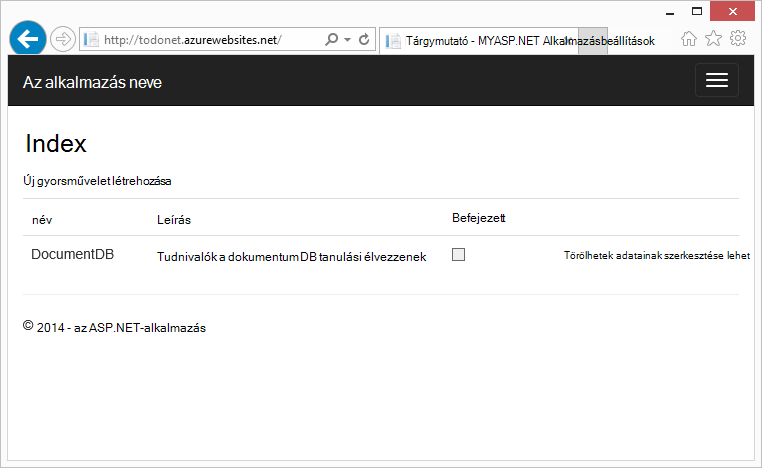

Ez a segédlet bemutatja, hogyan a DocumentDB szolgáltatás, Azure által biztosított használatának tárolására és egy ASP.NET MVC webalkalmazás Azure is hozzáférhetnek az adataikhoz. Ha az, amit keres, amelyek csak a DocumentDB, és nem az ASP.NET MVC összetevők koncentrál oktatóanyagot, olvassa el a [egy DocumentDB C# konzol alkalmazás összeállítása](documentdb-get-started.md).

> [AZURE.TIP] Ebben az oktatóanyagban feltételezi, hogy rendelkezik-e előzetes élmény ASP.NET MVC és Azure-webhelyek használatával. Ha új ASP.NET vagy [kapcsolatban előzetesen szükséges eszközök](#_Toc395637760), azt javasoljuk, a teljes minta projekt letöltése, [GitHub][] , és a következő példában az utasításokat követve. Ha befejezte, a beépített, áttekintheti Ez a cikk a kódot a projekt környezetében ismereteket szerezhet.

## Az adatbázis oktatóanyagban vonatkozó követelmények

Ez a cikk utasításait követve, előtt bizonyosodjon meg arról, hogy a következőkre van:

- Azure active fiók. Nem rendelkeznek fiókkal, ha mindössze néhány perc is létrehozhat ingyenes próba-fiók. A részletekért lásd: [Azure ingyenes próbaverziót](https://azure.microsoft.com/pricing/free-trial/).
- [Visual Studio 2015](http://www.visualstudio.com/) vagy Visual Studio 2013 frissítés 4-es vagy újabb verziójában. Visual Studio 2013 használata esetén szüksége lesz a C# 6.0 támogatásának hozzáadása [Microsoft.Net.Compilers nuget csomag](https://www.nuget.org/packages/Microsoft.Net.Compilers/) telepítéséhez. 
- A .NET rendszerhez verzió 2.5.1 Azure SDK vagy újabb, a [Microsoft webes Platform telepítő][]keresztül érhető el.

Ez a cikk a képernyőképek nyílt frissítés 4-es alkalmazott és az Azure SDK Visual Studio 2013 használata .NET 2.5.1 verziója. Ha a rendszer úgy van konfigurálva, lehetséges, hogy a képernyőn és a beállítások nem egyeznek teljesen, de ha a fenti előfeltételek teljesíti a megoldás kell-e működniük különböző verzióival.

## Lépés: 1: DocumentDB adatbázis-fiók létrehozása

Első lépésként DocumentDB fiók létrehozása. Ha már rendelkezik fiókkal, kihagyhatja létrehozása [Új ASP.NET MVC alkalmazást](#_Toc395637762).

[AZURE.INCLUDE [documentdb-create-dbaccount](../../includes/documentdb-create-dbaccount.md)]

[AZURE.INCLUDE [documentdb-keys](../../includes/documentdb-keys.md)]

 
Fog most végigvezetjük hogy miként hozhat létre egy új ASP.NET MVC alkalmazást a alapokról fel. 

## Lépés: 2: Új ASP.NET MVC-alkalmazás létrehozása

Most, hogy van egy fiókot, hozzunk létre az új ASP.NET-projektet.

1. A Visual Studióban, kattintson a **fájl** menü **Új**pontjára, és kattintson a **Projekt**.

    Az **Új projekt** párbeszédpanel jelenik meg.
2. A **projekttípusok** ablakban bontsa ki a **sablonok**, **Visual C#**, **Web**, és válassza a **ASP.NET webalkalmazást**.

    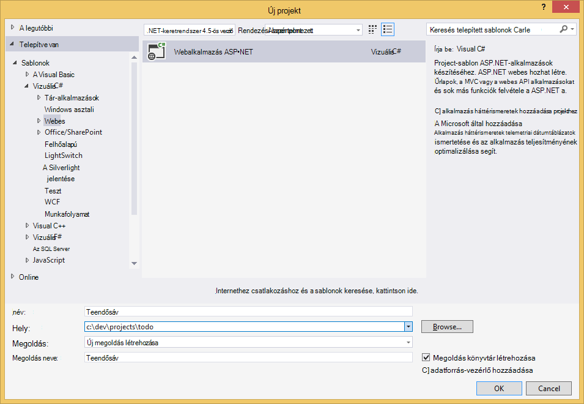

3. A **név** mezőbe írja be a projekt nevére. Ebben az oktatóanyagban használja a "teendő" nevet. Ha úgy dönt, hogy ez től használja, majd bárhol a teendők névtér ebben az oktatóanyagban szól, módosítania kell a megadott mintakódok bármilyen nevű az alkalmazás használatához. 

4. Kattintson a **Tallózás gombra** kattintva nyissa meg azt a mappát, ahová szeretné, hogy a projekt létrehozása, és kattintson **az OK**gombra.

    A **Új ASP.NET** párbeszédpanel jelenik meg.

    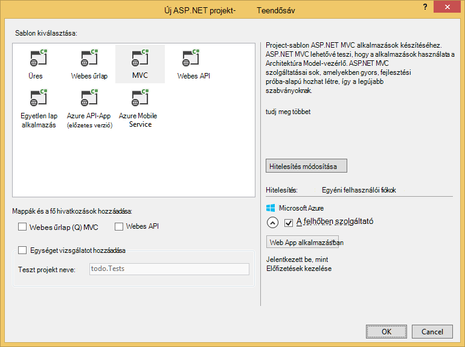

5. Jelölje ki a sablonok munkaablakban **MVC**.

6. Ha az alkalmazás Azure-ban válassza a **Host a felhőben** , hogy az alkalmazás szolgáltató Azure jobb alsó sarkában lévő. Azt választotta, a felhőben tárolni, és futtassa az alkalmazást az Azure-webhelyen tárolt. Ezt a lehetőséget választva az Azure webhely preprovision meg és leírási_idő sokkal egyszerűbbé tétele amikor kerül a végső munkaidő-alkalmazás telepítéséhez. Ha nem szeretné konfigurálni az Azure upfront vagy szeretné tárolni a máshol, csak törölje **Host a felhőben**.

7. Kattintson az **OK gombra** , és mondja el a funkciójú körül az üres ASP.NET MVC sablon scaffolding Visual Studio. 

8. Ha azt választotta, a felhőben tárolni a kéri, hogy az Azure-fiók bejelentkezni, és adja meg a bizonyos értékeket az új webhely legalább egy további képernyő jelenik meg. Adja meg a további értékeket, és továbbra is. 

    Tudok még nem választott "adatbázis-kiszolgálóval" Itt mert azt nem használja az Azure SQL-adatbázis kiszolgálója itt, megyünk kell új Azure DocumentDB fiók létrehozása később az Azure-portálon.

    Többet szeretne tudni az **alkalmazás szolgáltatáscsomagja** és **erőforráscsoport**közül választhat [Azure alkalmazás szolgáltatás csomagok meg szeretné vizsgálni áttekintése](../app-service/azure-web-sites-web-hosting-plans-in-depth-overview.md)című témakörben találhat.

    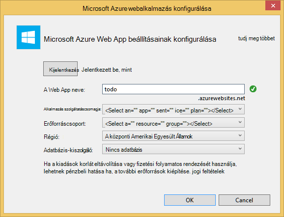

9. Visual Studio befejezte az újrafelhasználható MVC alkalmazás létrehozását követően helyileg futtatva üres ASP.NET alkalmazás.

    Azt fogja ugorja át a projekt fut a helyi meghajtóra, mert emlékszem, hogy az összes láthatta, a "Helló, világ" ASP.NET alkalmazást. Most lépjen közvetlenül DocumentDB hozzáadása a projekthez, és az alkalmazás fejlesztésére.

## 3 lépés: A MVC webes alkalmazás projekt DocumentDB hozzáadása

Most, hogy elkészült a ASP.NET MVC vízvezetékek, hogy a megoldás szükséges a legtöbb, pedig hozzuk működésbe ebben az oktatóanyagban Azure DocumentDB hozzáadása a MVC webalkalmazás valós célját.

1. A DocumentDB .NET SDK csomagolása és NuGet csomag meghatározva. A NuGet csomag a Visual Studióban, használja a NuGet csomag kezelő a Visual Studio: kattintson a jobb gombbal a **Megoldást Intézőben** a projekten, és válassza a **NuGet csomagok kezelése**.

    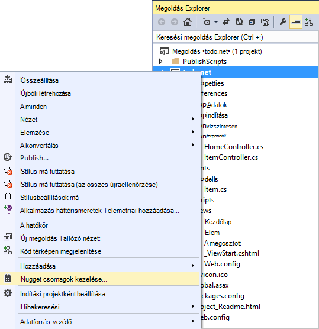

    A **NuGet csomagok kezelése** párbeszédpanel jelenik meg.

2. A NuGet **Tallózás** párbeszédpanelen írja be az ***Azure DocumentDB***.
    
    Az eredmények között telepítse a **Microsoft Azure DocumentDB ügyfél tár** csomag. Ezzel töltse le és telepítse a DocumentDB csomag, valamint az összes függőségek, például Newtonsoft.Json. Kattintson **az OK gombra** az **előnézeti** ablakban, és az **elfogadom** a **Licenc elfogadó** ablakban a telepítés befejezéséhez.

    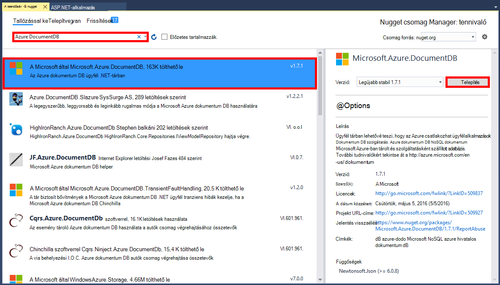

    Másik lehetőségként használhatja a csomag kezelője konzol a csomag telepítéséhez. Ehhez az **eszközök** menüben kattintson a **NuGet csomag Manager**, és válassza a **Csomag kezelője konzol**. A parancssorba írja be a következőt.

        Install-Package Microsoft.Azure.DocumentDB

3. A csomag telepítését követően a Visual Studio megoldás kell az alábbihoz a két új hivatkozás hozzáadása Microsoft.Azure.Documents.Client és Newtonsoft.Json.

    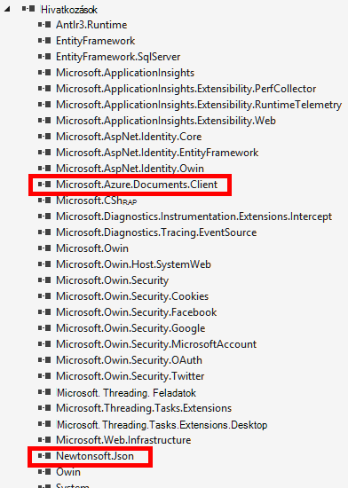

##Lépés: 4: Az ASP.NET MVC alkalmazás beállítása
 
Most vegyük MVC alkalmazás hozzáadása a modellek, nézetek és vezérlők:

- [Hozzáadás a modell](#_Toc395637764).
- [Egy vezérlő hozzáadása](#_Toc395637765).
- [Nézetek hozzáadása](#_Toc395637766).

### Adja hozzá a JSON adatmodell

Lássunk hozzá az **M** MVC, a modell létrehozásával. 

1. A **Megoldás Explorer**kattintson a jobb gombbal a **modellek** mappát, kattintson a **Hozzáadás**gombra, és kattintson az **Osztályjegyzetfüzet**.

    Az **Új elem hozzáadása** párbeszédpanel jelenik meg.

2. Nevezze el az új osztályához **Item.cs** , és kattintson a **Hozzáadás**gombra. 

3. Az ezt az új **Item.cs** fájlt adja meg a következő *utasítással*utolsó után.
        
        using Newtonsoft.Json;
    
4. Ez a kód most cseréje 
        
        public class Item
        {
        }

    a következő kódjával.

        public class Item
        {
            [JsonProperty(PropertyName = "id")]
            public string Id { get; set; }
             
            [JsonProperty(PropertyName = "name")]
            public string Name { get; set; }

            [JsonProperty(PropertyName = "description")]
            public string Description { get; set; }

            [JsonProperty(PropertyName = "isComplete")]
            public bool Completed { get; set; }
        }

    DocumentDB az összes adat a hálózaton átadott és JSON tárolja. Vezérelheti, hogy a objektumai által is használhatja az **JsonProperty** attribútum, ahogyan az imént létrehozott **elem** osztály JSON.NET szerializálásának/deszerializálni. Nem **rendelkezik** a de ehhez annak érdekében, hogy az tulajdonságokat követni a JSON camelCase elnevezési szabályai szeretném. 
    
    Nem, csak akkor szabályozhatja a Formátum tulajdonság neve magától JSON be, de teljesen átnevezheti a .NET-tulajdonságok megismert lehet a **Leírás** tulajdonság. 
    

### Egy vezérlő hozzáadása

Amely gondoskodik az **M**most vegyük létrehozása a **C** MVC, a vezérlő osztály.

1. A **Megoldás Explorer**kattintson a jobb gombbal a **vezérlők** mappát, kattintson a **Hozzáadás**gombra, és válassza a **vezérlő**.

    Ekkor megjelenik a **Scaffold hozzáadása** párbeszédpanel.

2. Jelölje ki a **MVC 5 vezérlő - üres** , és kattintson a **Hozzáadás**gombra.

    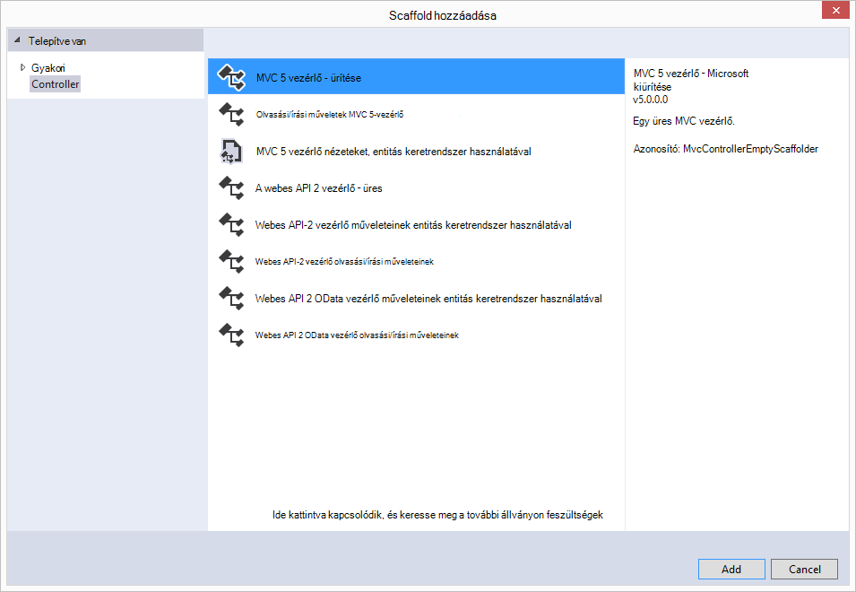

3. Nevezze el az új vezérlő **ItemController.**

    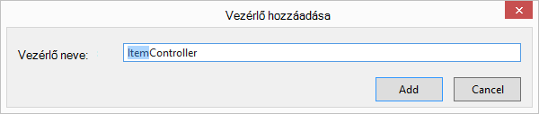

    Amikor létrejött a fájlt, a Visual Studio megoldás kell az alábbihoz **Solution Explorer**új ItemController.cs fájllal. A korábban létrehozott új Item.cs fájlt is megjelennek.

    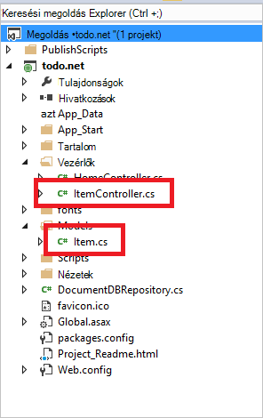

    Zárja be az ItemController.cs, azt fogja térjen vissza az azt később. 

### Nézetek hozzáadása

Ezután a **V** a MVC, a nézetek létrehozása:

- [Egy elem Index nézet hozzáadása](#AddItemIndexView).
- [Hozzáadás új elem nézet gombra](#AddNewIndexView).
- [Az elem szerkesztése nézet hozzáadása](#_Toc395888515).

#### Egy elem Index nézet felvétele

1. A **Megoldás Explorer**bontsa ki a **nézetek** mappát, kattintson a jobb gombbal a Visual Studio jött létre, ha a korábban hozzáadott a **ItemController** **elem** mappa ürítése, kattintson a **Hozzáadás**gombra, és kattintson a **Nézet**.

    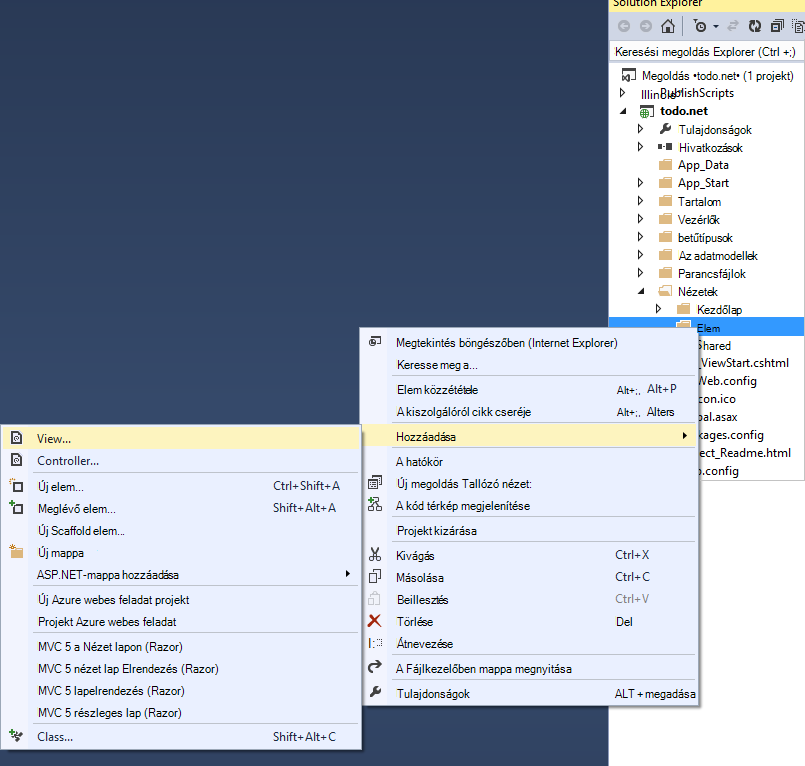

2. **Nézet hozzáadása** párbeszédpanelen tegye a következőket:
    - A **nézet neve** mezőbe írja be az ***Index***.
    - A **sablon** mezőben jelölje ki a ***listát***.
    - A **modell osztályához** mezőben jelölje ki a ***elem (teendő. Az adatmodellek)***.
    - Az **adatok helyi osztály** mezőben hagyja üresen. 
    - Az elrendezés lap mezőbe írja be ***~/Views/Shared/_Layout.cshtml***.
    
    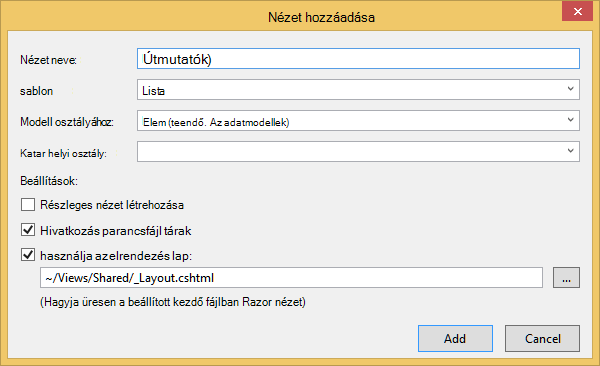

3. Ezek az értékek vannak beállítva, kattintson a **Hozzáadás** gombra, és hozzon létre egy új sablon nézetet a Visual Studio segítségével. Miután befejeződött, kattintva megnyílik a létrehozott cshtml fájlt. Azt bezárhatja a fájlt a Visual Studióban, ahogy azt fogja térjen vissza az azt később.

#### Új elem nézet felvétele

Hasonlóan egy **Elem Index** nézet létrehozott hogyan azt most létrehozza az új **elemek**létrehozása új nézet.

1. A **Megoldás Explorer**kattintson ismét a jobb gombbal a **elem** mappát, kattintson a **Hozzáadás**gombra, és kattintson a **Nézet**.

2. **Nézet hozzáadása** párbeszédpanelen tegye a következőket:
    - A **nézet neve** mezőbe írja be a ***Létrehozás***.
    - A **sablon** mezőben válassza a ***létrehozása***lehetőséget.
    - A **modell osztályához** mezőben jelölje ki a ***elem (teendő. Az adatmodellek)***.
    - Az **adatok helyi osztály** mezőben hagyja üresen.
    - Az elrendezés lap mezőbe írja be ***~/Views/Shared/_Layout.cshtml***.
    - Kattintson a **hozzáadása**gombra.

#### Egy elem szerkesztése nézet felvétele

És végül vegye fel az utolsó nézet valamelyikében, az **elem** szerkesztése a ugyanúgy, mint előtt.

1. A **Megoldás Explorer**kattintson ismét a jobb gombbal a **elem** mappát, kattintson a **Hozzáadás**gombra, és kattintson a **Nézet**.

2. **Nézet hozzáadása** párbeszédpanelen tegye a következőket:
    - A **nézet neve** mezőbe írja be a ***szerkesztése***elemre.
    - A **sablon** mezőben válassza a ***Szerkesztés***elemre.
    - A **modell osztályához** mezőben jelölje ki a ***elem (teendő. Az adatmodellek)***.
    - Az **adatok helyi osztály** mezőben hagyja üresen. 
    - Az elrendezés lap mezőbe írja be ***~/Views/Shared/_Layout.cshtml***.
    - Kattintson a **hozzáadása**gombra.

Miután ez megtörtént, ahogy azt ad vissza ezeket a nézetek később zárja be a Visual Studióban cshtml dokumentumok.

## Lépés az 5: Huzalozási DocumentDB felfelé

Most, hogy a szabványos MVC elemek van készített kezeli, nézzük kapcsolja be a kódot a DocumentDB hozzáadására. 

Ebben a részben adunk kezelésére, a következő kódot:

- [Hiányos felsoroló](#_Toc395637770).
- [Elemek felvétele](#_Toc395637771).
- Az [elemek szerkesztését](#_Toc395637772).

### A MVC webalkalmazásban hiányos felsoroló

A legfontosabb dolog itt való kapcsolódáshoz és DocumentDB használja a logika tartalmazó osztály hozzáadása. Ebben az oktatóprogramban az összes e logika a DocumentDBRepository nevű tárházba osztály azt fogja beágyazására. 

1. A **Megoldás Explorer**kattintson a jobb gombbal a projekten, kattintson a **Hozzáadás**gombra, és kattintson az **Osztályjegyzetfüzet**. Nevezze el az új osztály **DocumentDBRepository** , és kattintson a **Hozzáadás**gombra.
 
2. Az újonnan létrehozott **DocumentDBRepository** az osztály, és a következő *kimutatások használatával* a *névtér* nyilatkozat feletti hozzáadása
        
        using Microsoft.Azure.Documents; 
        using Microsoft.Azure.Documents.Client; 
        using Microsoft.Azure.Documents.Linq; 
        using System.Configuration;
        using System.Linq.Expressions;
        using System.Threading.Tasks;

    Ez a kód most cseréje 

        public class DocumentDBRepository
        {
        }

    a következő kódjával.

        public static class DocumentDBRepository<T> where T : class
        {
            private static readonly string DatabaseId = ConfigurationManager.AppSettings["database"];
            private static readonly string CollectionId = ConfigurationManager.AppSettings["collection"];
            private static DocumentClient client;
    
            public static void Initialize()
            {
                client = new DocumentClient(new Uri(ConfigurationManager.AppSettings["endpoint"]), ConfigurationManager.AppSettings["authKey"]);
                CreateDatabaseIfNotExistsAsync().Wait();
                CreateCollectionIfNotExistsAsync().Wait();
            }
    
            private static async Task CreateDatabaseIfNotExistsAsync()
            {
                try
                {
                    await client.ReadDatabaseAsync(UriFactory.CreateDatabaseUri(DatabaseId));
                }
                catch (DocumentClientException e)
                {
                    if (e.StatusCode == System.Net.HttpStatusCode.NotFound)
                    {
                        await client.CreateDatabaseAsync(new Database { Id = DatabaseId });
                    }
                    else
                    {
                        throw;
                    }
                }
            }
    
            private static async Task CreateCollectionIfNotExistsAsync()
            {
                try
                {
                    await client.ReadDocumentCollectionAsync(UriFactory.CreateDocumentCollectionUri(DatabaseId, CollectionId));
                }
                catch (DocumentClientException e)
                {
                    if (e.StatusCode == System.Net.HttpStatusCode.NotFound)
                    {
                        await client.CreateDocumentCollectionAsync(
                            UriFactory.CreateDatabaseUri(DatabaseId),
                            new DocumentCollection { Id = CollectionId },
                            new RequestOptions { OfferThroughput = 1000 });
                    }
                    else
                    {
                        throw;
                    }
                }
            }
        }

    > [AZURE.TIP] Amikor hoz létre egy új DocumentCollection adja meg a OfferType, amely lehetővé teszi, hogy adja meg az új webhelycsoport teljesítményével választható RequestOptions paraméter. Ha a paraméter nincs átadott az alapértelmezett ajánlat típus lesz. A további tudnivalók a DocumentDB ajánlat típusok olvassa el a [DocumentDB teljesítményszint](documentdb-performance-levels.md)

3. Azt az egyes értékeit konfigurációs, így nyissa meg **a fájlt az alkalmazás** , és adja hozzá a következő sort a olvasott a `<AppSettings>` szakaszban.
    
        <add key="endpoint" value="enter the URI from the Keys blade of the Azure Portal"/>
        <add key="authKey" value="enter the PRIMARY KEY, or the SECONDARY KEY, from the Keys blade of the Azure  Portal"/>
        <add key="database" value="ToDoList"/>
        <add key="collection" value="Items"/>
    
4. Most frissítse a *végpont* és a billentyűk lap az Azure Portal segítségével *authKey* értékeit. A **URI** a billentyűk lap a használja az endpoint beállítás értékeként, és az **Elsődleges kulcs**vagy a **Másodlagos KULCSA** használni a authKey beállítás értékét a billentyűk lap a.

    Hogy a veszi ellátása huzalozási felfelé a DocumentDB tárházba most vegyük hozzáadása az alkalmazás összefüggés.

5. Először is engedélyezni szeretné a Teendők lista alkalmazással szeretnénk lesz, a teljes elemek megjelenítéséhez.  Másolja és illessze be a következő kódrészletet bárhol az **DocumentDBRepository** osztály belül.

        public static async Task<IEnumerable<T>> GetItemsAsync(Expression<Func<T, bool>> predicate)
        {
            IDocumentQuery<T> query = client.CreateDocumentQuery<T>(
                UriFactory.CreateDocumentCollectionUri(DatabaseId, CollectionId))
                .Where(predicate)
                .AsDocumentQuery();

            List<T> results = new List<T>();
            while (query.HasMoreResults)
            {
                results.AddRange(await query.ExecuteNextAsync<T>());
            }

            return results;
        }

6. Nyissa meg a **ItemController** hogy korábban hozzáadott és felvétele a következő *kimutatások használatával* a névtér nyilatkozat felett.

        using System.Net;
        using System.Threading.Tasks;
        using todo.Models;

    Ha a projekt neve nem "teendő", majd frissítenie kell használata a "teendő. Az adatmodellek"; a projekt nevének megfelelően.

    Ez a kód most cseréje

        //GET: Item
        public ActionResult Index()
        {
            return View();
        }

    a következő kódjával.

        [ActionName("Index")]
        public async Task<ActionResult> IndexAsync()
        {
            var items = await DocumentDBRepository<Item>.GetItemsAsync(d => !d.Completed);
            return View(items);
        }
    
7. Nyissa meg a **Global.asax.cs** , és adja hozzá a következő sort a **Application_Start** módszerrel 
 
        DocumentDBRepository<todo.Models.Item>.Initialize();
    
Ezen a ponton a megoldás látnia kell a hibák nélkül össze.

Ha futtatta az alkalmazás letöltése, volna lépjen a **HomeController** és a vezérlő **Index** nézetében. Ez az alapértelmezett működés a MVC sablon projekt elején választottunk, de nem szeretné, hogy, amely! Ez a jelenség megváltoztathatja MVC az alkalmazás a továbbítás nézzük módosítása

Nyissa meg ***alkalmazás\_Start\RouteConfig.cs*** , és keresse meg a vonal kezdődő "alapértelmezett:" módosítja, az alábbihoz.

        defaults: new { controller = "Item", action = "Index", id = UrlParameter.Optional }

A most azt jelenti, ha nem adta meg egy értéket az URL-cím a útválasztási viselkedésének szabályozásához, amely inkább **Kezdőlap**, használja az **elemet** a vezérlő és a felhasználó **Index** nézettel ASP.NET MVC.

Ha az alkalmazás, akkor fogja felhívása a **ItemController** , amely a tárházba osztály betárcsázni és a GetItems módszernek az alkalmazását a teljes elemek visszatérni a **nézetek**most\\**elem**\\**Index** megtekintése. 

Ha össze, és ehhez a projekthez futtatása, most látnia kell, amit keres meg.    

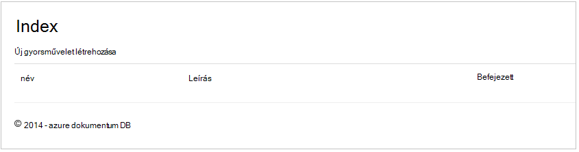

### Elemek hozzáadása

Az adatbázis helyezni, néhány elem vegyük úgy van még valami több, mint egy üres rács vizsgálata.

Kód hozzáadása DocumentDBRepository, és a ItemController továbbra is fennáll a DocumentDB az a rekordot.

1.  Az alábbi módon adhat a **DocumentDBRepository** osztály.

        public static async Task<Document> CreateItemAsync(T item)
        {
            return await client.CreateDocumentAsync(UriFactory.CreateDocumentCollectionUri(DatabaseId, CollectionId), item);
        }

    Ez a módszer egyszerűen megnyitja a neki átadott objektum, és továbbra is fennáll DocumentDB.

2. Nyissa meg a ItemController.cs fájlt, és adja hozzá a következő kódrészletet az osztály belül. Ez a hogyan ASP.NET MVC tudja, hogy mi a teendő az **létrehozása** művelet. Ebben az esetben meg közvetlenül a korábban létrehozott társított Create.cshtml nézet.

        [ActionName("Create")]
        public async Task<ActionResult> CreateAsync()
        {
            return View();
        }

    A vezérlő, amely a **Create** view ajánlata akkor fogad el a további kód most szükséges.

2. A következő időtartomány kód hozzáadása a ItemController.cs osztály, amely arra utasítja az ASP.NET MVC, mi a teendő, ha a vezérlőhöz űrlap BEJEGYZÉST.
    
        [HttpPost]
        [ActionName("Create")]
        [ValidateAntiForgeryToken]
        public async Task<ActionResult> CreateAsync([Bind(Include = "Id,Name,Description,Completed")] Item item)
        {
            if (ModelState.IsValid)
            {
                await DocumentDBRepository<Item>.CreateItemAsync(item);
                return RedirectToAction("Index");
            }

            return View(item);
        }

    Kód hívásainak a DocumentDBRepository, és használja a CreateItemAsync módszer marad meg az új teendő elemet az adatbázishoz. 
 
    **Biztonsági megjegyzés**: A **ValidateAntiForgeryToken** attribútum ennek az alkalmazásnak a webhelyközi kérelem hamisítása támadások ellen védelmet Itt használatos. Több azt csak az adott jellemző hozzáadása, a nézetek kell használnia, valamint a elleni token. A tárgy, és a példa a végrehajtásához megfelelően, című témakörben bővebben [Webhelyközi kérése hamisítása megakadályozása][]. A szolgáltatott [GitHub][] forráskód rendelkezik a teljes körű.

    **Biztonsági megjegyzés**: azt is használhatja a **kötést** attribútum a módszer paraméterre túlságosan könyvelési támadások elleni védekezéshez. További részletekért olvassa el [Az ASP.NET MVC alapműveletek CRUD][].

Ez megállapítja, hogy a kód szükséges új elemek hozzáadása az adatbázishoz.

### Elemek szerkesztése

Végezze el nekünk utolsó egyvalamihez, és ez az **elem** szerkesztése az adatbázis és megjelölése befejezettként támogatni. A nézet szerkesztésre már projekthez való hozzáadásának a, így csak szükség kód a vezérlőt, és a **DocumentDBRepository** osztály újbóli hozzáadásához.

1. Adja hozzá a következő **DocumentDBRepository** osztály.

        public static async Task<Document> UpdateItemAsync(string id, T item)
        {
            return await client.ReplaceDocumentAsync(UriFactory.CreateDocumentUri(DatabaseId, CollectionId, id), item);
        }

        public static async Task<T> GetItemAsync(string id)
        {
            try
            {
                Document document = await client.ReadDocumentAsync(UriFactory.CreateDocumentUri(DatabaseId, CollectionId, id));
                return (T)(dynamic)document;
            }
            catch (DocumentClientException e)
            {
                if (e.StatusCode == HttpStatusCode.NotFound)
                {
                    return null;
                }
                else
                {
                    throw;
                }
            }
        }
    
    Az első, az alábbi módszerek egyikét **GetItem** fetches egy elemet a DocumentDB, amely átadott vissza az **ItemController** , majd **a szerkesztőnézetben** alkalmazásba című témakör tartalmaz.
    
    A második módszerek azt közvetlenül a felvétele után a **ItemController**az átadott a **dokumentumot** a **dokumentum** verziójával DocumentDB cseréli.

2. Adja hozzá a következő **ItemController** osztály.

        [HttpPost]
        [ActionName("Edit")]
        [ValidateAntiForgeryToken]
        public async Task<ActionResult> EditAsync([Bind(Include = "Id,Name,Description,Completed")] Item item)
        {
            if (ModelState.IsValid)
            {
                await DocumentDBRepository<Item>.UpdateItemAsync(item.Id, item);
                return RedirectToAction("Index");
            }

            return View(item);
        }

        [ActionName("Edit")]
        public async Task<ActionResult> EditAsync(string id)
        {
            if (id == null)
            {
                return new HttpStatusCodeResult(HttpStatusCode.BadRequest);
            }

            Item item = await DocumentDBRepository<Item>.GetItemAsync(id);
            if (item == null)
            {
                return HttpNotFound();
            }

            return View(item);
        }
    
    Az első módszer kezeli a Http GET történik, amikor a felhasználó gombra kattint a **Szerkesztés** hivatkozásra a **Tárgymutató** -nézetben. Ez a módszer a DocumentDB beolvassa a [**dokumentumot**](http://msdn.microsoft.com/library/azure/microsoft.azure.documents.document.aspx) , és átadja **a szerkesztőnézetben** .

    A nézet **szerkesztése** a **IndexController**Http POST majd mindent. 
    
    A második módszer jelöltük kezeli a frissített objektumot átadása DocumentDB, hogy az adatbázisban tárolt kell.

Ez az, hogy minden futtassa az alkalmazást, hiányos **elemek**listája, adja hozzá az új **elemek**és **elemek**szerkesztése szükség van rá.

## Lépés a 6: Alkalmazásnak a futtatására a helyi meghajtóra

Ha tesztelni szeretné az alkalmazás a helyi számítógépen, tegye a következőket:

1. Találati F5 billentyűparancs hatására az alkalmazás hibakeresési módban össze a Visual Studio. Célszerű az alkalmazás összeállítása és indítása előtt bekerül az üres rács lappal böngészőben:

    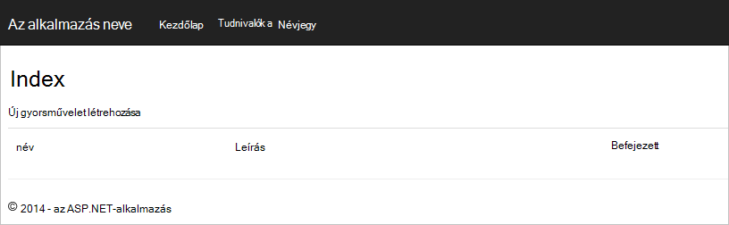

    Ha a Visual Studio 2013 használ, és hibaüzenet jelenik meg a "Nem kerülve a tényleges záradékot törzsében." a [Microsoft.Net.Compilers nuget csomag](https://www.nuget.org/packages/Microsoft.Net.Compilers/)telepítéséhez szükséges. Összehasonlíthatja a minta projekt [GitHub][]szemben a kódot is. 

2. Kattintson az **Új létrehozása** hivatkozásra, és a **név** és **Leírás** mezőben adjon értéket. Szabadság **befejeződött** nincs bekapcsolva jelölőnégyzetet egyébként az új **elem** egy befejezett állapot megjelenik és nem jelennek meg a kezdeti listában.

    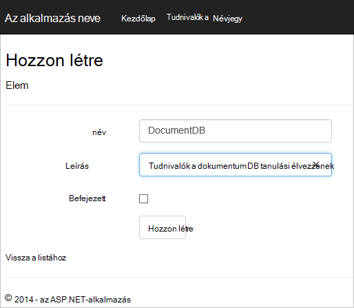

3. Kattintson a **Létrehozás** gombra, és megnyílik a **Tárgymutató** nézethez való visszatéréshez, és megjelenik az **elemet** a listában.

    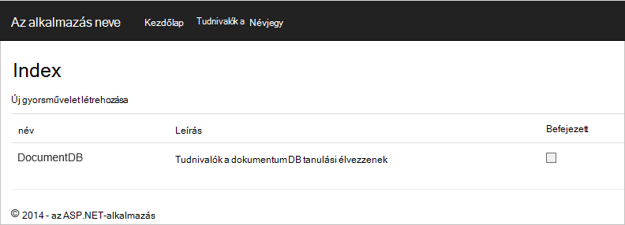

    Nyugodtan néhány további **elemek** hozzáadása a teendőlista.

3. A mellett a listában egy **elem** **szerkesztése** gombra kattintva megnyílik **a szerkesztőnézetben** hol frissítheti az objektum, például a **Befejezett** jelölőre bármely tulajdonsága és. Ha a **teljes** jelző megjelölni, és kattintson a **Mentés**gombra, az **elem** törlődik az Elvégzetlen feladatok listájából.

    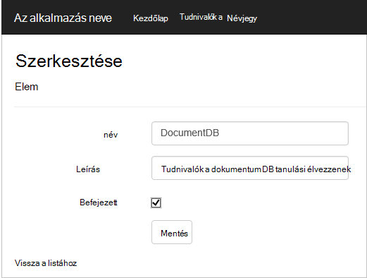

4. Egyszer, által vizsgált az alkalmazást, nyomja le a Ctrl + F5 le szeretné állítani az alkalmazás hibakeresése során. Készen áll a üzembe!

## 7 lépés: Az Azure webhelyek alkalmazás telepítése

Most, hogy van-e a teljes kérelem megfelelően működik-e a DocumentDB megyünk Azure webhelyek szeretne telepíteni, a web App alkalmazásban. Ha bejelölte **a felhőben Host** ASP.NET MVC üres projekt létrehozása után a Visual Studio megkönnyíti ezt valójában, és a munkát a legtöbb jelent meg. 

1. Közzétenni, ez az alkalmazás összes kell tennie, kattintson a jobb gombbal a projekten a **Megoldást Intézőben** , és kattintson a **Közzététel**gombra.

    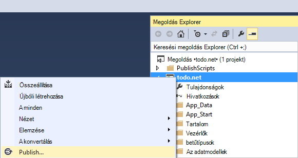

2. A szolgáltatás már kell konfigurálni aszerint, hogy a hitelesítő adatait; valójában a webhely már létezik az Azure meg a **Célhely URL-CÍMÉT** látható, az összes kell tennie, kattintson a **Közzététel**gombra.

    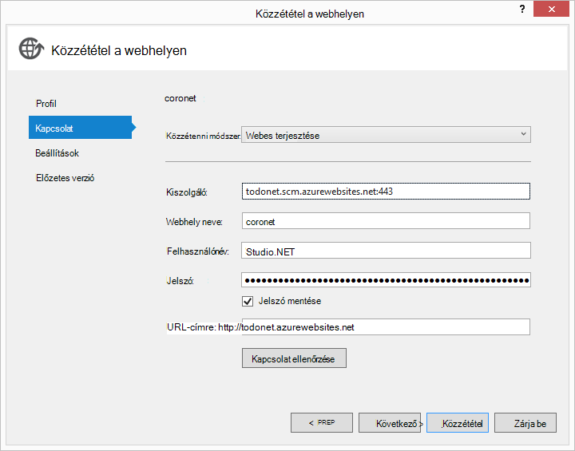

Néhány másodperc alatt a Visual Studio a webalkalmazás közzététel befejezéséhez, és indítsa el a a böngészőben, ahol megtekintheti a praktikus munka Azure-ban futó!

## Következő lépések

Gratulálok! Csak az első ASP.NET MVC webalkalmazás használatával Azure DocumentDB beépített és Azure-webhelyeken közzétett azt. A teljes alkalmazásához, beleértve a részletek és törlés funkciókat, amelyek nem szerepeltek ebben az oktatóanyagban forráskód letöltve, vagy a [GitHub][]klónozva is. Ha az alkalmazás hozzáadása, amely érdekli, így ragadni a kódot, és vegye fel az alkalmazás.

További funkciókkal az alkalmazás, tekintse át a [DocumentDB .NET-dokumentumtár](https://msdn.microsoft.com/library/azure/dn948556.aspx) elérhető API-khoz, és nyugodtan közreműködés [GitHub][]DocumentDB .NET tárban. 

[\*]: https://microsoft.sharepoint.com/teams/DocDB/Shared%20Documents/Documentation/Docs.LatestVersions/PicExportError
[Visual Studio Express]: http://www.visualstudio.com/products/visual-studio-express-vs.aspx
[A Microsoft webes Platform telepítő]: http://www.microsoft.com/web/downloads/platform.aspx
[Webhelyközi kérelem hamisítása megakadályozása]: http://go.microsoft.com/fwlink/?LinkID=517254
[ASP.NET MVC egyszerű CRUD műveletek]: http://go.microsoft.com/fwlink/?LinkId=317598
[GitHub]: https://github.com/Azure-Samples/documentdb-net-todo-app
