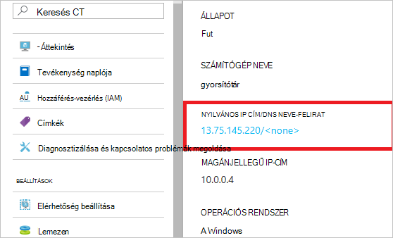

<properties
    pageTitle="DocumentDB tűzfal támogatási |} Microsoft Azure"
    description="Megtudhatja, hogy miként IP hozzáférési szabályok tűzfal-támogatás az Azure DocumentDB adatbázis fiókok használata."
    keywords="IP-hozzáférés-vezérlés, a tűzfal támogatás"
    services="documentdb"
    authors="shahankur11"
    manager="jhubbard"
    editor=""
    tags="azure-resource-manager"
    documentationCenter=""/>

<tags 
    ms.service="documentdb" 
    ms.workload="data-services" 
    ms.tgt_pltfrm="na" 
    ms.devlang="na" 
    ms.topic="article" 
    ms.date="10/17/2016" 
    ms.author="ankshah; kraman"/>

# DocumentDB tűzfal támogatás

Azure DocumentDB adatbázis fiók tárolt adatok védelme, DocumentDB megadott támogatása a titkos alapján [engedélyezési modell](https://msdn.microsoft.com/library/azure/dn783368.aspx) , amely egy erős kivonat-alapú üzenet hitelesítési kódot (HMAC) segítségével. A titkos alapú engedélyezési modell kívül DocumentDB támogatja házirend-alapú IP-alapú hozzáférés vezérlők bejövő tűzfal ügyfélszolgálatával. Ez a modell nagyon hasonlít a hagyományos adatbázis rendszer tűzfalszabályokat bejegyzései, és egy további DocumentDB adatbázis fiókjában biztonsági szintet. Ez a modell egy DocumentDB adatbázis-fiókot kell gépek jóváhagyott készletből csak elérhető, illetve cloud services most beállíthatja. Az alábbi számítógépek és a szolgáltatások jóváhagyott csoportja DocumentDB erőforrásokhoz való hozzáférést továbbra is szükség a hívó felet a bemutató egy érvényes jóváhagyási jogkivonat.

## Hozzáférés vezérlő IP-– áttekintés

Alapértelmezés szerint DocumentDB adatbázis-fiókot érhető el az internetről nyilvános mindaddig, amíg a kérést egy érvényes jóváhagyási jogkivonat együtt. IP-házirend-alapú hozzáférés-vezérlés konfigurálásához a felhasználónak meg kell adnia IP-címek és IP-címtartományok CIDR formában fog szerepelni az ügyfél IP-címei adott adatbázis-fiók engedélyezési listájára csoportja. Ebben a konfigurációban alkalmazza, miután kívül a engedélyezési listájára gépek származó összes kérelmet, azzal blokkolhatja a kiszolgáló.  Az alábbi ábra a kapcsolatot az IP-alapú hozzáférés-vezérlés munkafolyamat feldolgozása ismerteti.

## Kapcsolatok a felhőbeli szolgáltatások

Az Azure-felhőszolgáltatások hatékonyan gyakori középső szolgáltatás logika DocumentDB használatával elhelyezésére. Hozzáférés engedélyezése egy DocumentDB adatbázis-fiókjába a egy felhőalapú szolgáltatásba, a felhőbeli szolgáltatástól nyilvános IP-címe hozzá kell adnia a engedélyezett IP-címek a DocumentDB adatbázis-fiókjához tartozó [Azure ügyfélszolgálat](#configure-ip-policy)megkeresésével listáját.  Ez gondoskodhat arról, hogy szerepkör összes előfordulását felhőszolgáltatások az DocumentDB adatbázis-fiók elérésének. IP-címek meghallgathatja az Azure-portálon a felhőbeli szolgáltatásokhoz, az alábbi képernyőképen látható módon. 

Méretezni a felhőalapú szolgáltatás ki további szerepkör-példányok hozzáadásával, amikor e új példányok automatikusan hozzáférést kap a DocumentDB adatbázis-fiókot óta ugyanazt a felhőalapú szolgáltatást részét képezik.

## A virtuális gépeken futó kapcsolatok

[Virtuális gépeken futó](https://azure.microsoft.com/services/virtual-machines/) vagy a [virtuális gép skála állítja be](../virtual-machine-scale-sets/virtual-machine-scale-sets-overview.md) szeretné üzemeltetni a középső szolgáltatások DocumentDB használatával is használható.  A DocumentDB konfigurálása virtuális gépeken futó, nyilvános IP-címek a virtuális gép és/vagy a virtuális gép skála megadása a hozzáférés engedélyezése adatbázis-fiókot kell beállítania az engedélyezett IP-címek DocumentDB adatbázis fiókjának egyikeként [Azure ügyfélszolgálat](#configure-ip-policy)megkeresésével. Az alábbi képernyőképen látható módon meghallgathatja IP-címek virtuális gépeken futó az Azure-portálon.

A csoport további virtuális gép példányok hozzáadásakor automatikusan megadták az DocumentDB adatbázis-fiók elérésének.

## Az internetről kapcsolatok

Elérésekor DocumentDB adatbázis-fiókot az interneten olyan számítógépről, az ügyfél IP-cím vagy a gép IP-címtartományokat hozzá kell adnia az adatbázis-fiókot DocumentDB IP-címe engedélyezett listájára. 

## Az IP-hozzáférési vezérlő házirend beállítása

Az Azure portal segítségével küldje el a [Támogatási Azure](https://portal.azure.com/?#blade/Microsoft_Azure_Support/HelpAndSupportBlade) ahhoz, hogy az IP-hozzáférési vezérlő házirendet, az adatbázis-fiókot a kérést.

1. Válassza a [Súgó + támogatási](https://portal.azure.com/?#blade/Microsoft_Azure_Support/HelpAndSupportBlade) lap **új támogatási kérelem**.
2. Jelölje ki az **új támogatási kérelem** lap **alapjai**.
3. Az **alapvető tudnivalók** lap jelölje ki a következőket:
    - **Hiba típusa**: kvóta
    - **Előfizetés**: az előfizetés annak a fióknak, amelyben az IP-access vezérlő házirendet szeretne adni.
    - **Kvóta típusa**: DocumentDB
    - **Támogatás terv**: kvóta támogatása – tartalmazza.
4. A **probléma** a lap kövesse az alábbi lépéseket:
    - **Súlyosságát**: jelölje be a C - minimális hatás
    - **Részletek**: másolja az alábbi szöveget a szövegdobozba, és a fiók neve/s és IP-cím vagy végű: "szeretném tűzfal támogatásának engedélyezése a saját DocumentDB adatbázis-fiókot. Adatbázis-fiók: *Felvétel fiók neve/s*. Engedélyezett IP-címtartományok: *olyan IP cím vagy tartomány CIDR formátumban, például 13.91.6.132, 13.91.6.1/24*. "
    - Kattintson a **Tovább**gombra. 
5. A **kapcsolattartási adatok** lap töltse ki a kapcsolattartási adatai, és kattintson a **Létrehozás**gombra. 

Miután a kérelem érkezik, IP-hozzáférés-vezérlés engedélyezni kell 24 órán belül. Jelenik meg értesítés elkészülte után a kérést.

## Az IP-hozzáférési vezérlő házirend – hibaelhárítás

### Portál műveletek

Az IP-hozzáférési vezérlő házirend DocumentDB adatbázis fiókjának engedélyezésével gépek kívül a beállított összes hozzáférést a DocumentDB adatbázis-fiókjába engedélyezett blokkolt IP-címek tartományai listáját. Ez a modell alapján böngészési az adatok sík művelet a portálon is blokkolja a hozzáférés-vezérlés integritását. 

### SDK & Rest API-val

A biztonsági okokból hozzáférést SDK vagy a REST API-t a megengedett listán nem szereplő gépek általános 404-es nem található választ nincs további részletekkel ad eredményül. Ellenőrizze, hogy be van állítva a DocumentDB adatbázis-fiókot lista engedélyezett IP alkalmazásához a megfelelő házirend beállítása a DocumentDB adatbázis-fiókjába.

## Következő lépések

Hálózati információt kapcsolódó teljesítményt tippeket [látható tippeket](documentdb-performance-tips.md)talál.