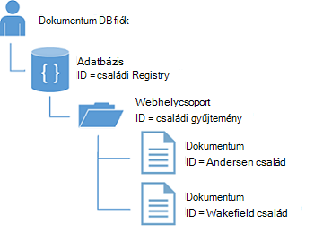

<properties
    pageTitle="NoSQL oktatóprogram: DocumentDB .NET SDK |} Microsoft Azure"
    description="NoSQL oktatóanyagot, amelyek az online adatbázisra és C# konzol alkalmazást a DocumentDB .NET SDK hoz létre. DocumentDB JSON NoSQL adatbázis."
    keywords="nosql oktatóanyagban online adatbázisra, c# konzol alkalmazás"
    services="documentdb"
    documentationCenter=".net"
    authors="AndrewHoh"
    manager="jhubbard"
    editor="monicar"/>

<tags
    ms.service="documentdb"
    ms.workload="data-services"
    ms.tgt_pltfrm="na"
    ms.devlang="dotnet"
    ms.topic="hero-article"
    ms.date="08/29/2016"
    ms.author="anhoh"/>

# NoSQL oktatóprogram: összeállítása egy DocumentDB C# konzol alkalmazás

> [AZURE.SELECTOR]
- [.NET](documentdb-get-started.md)
- [NODE.js](documentdb-nodejs-get-started.md)

Üdvözli az NoSQL oktatóprogram az Azure DocumentDB .NET SDK az! Ebben az oktatóanyagban számított, után is létrehoz egy konzol alkalmazás és a lekérdezések DocumentDB erőforrásokat.

Fogja foglalkozunk:

- Hozhat létre, és egy DocumentDB keresztüli
- A Visual Studio megoldás konfigurálása
- Az online adatbázis létrehozása
- A webhelycsoport létrehozása
- JSON-dokumentumok létrehozása
- A webhelycsoport lekérdezésére.
- Dokumentum cseréje
- Dokumentum törlése
- Az adatbázis törlése

Nincs időt? ne aggódj! Az ideális megoldás [GitHub](https://github.com/Azure-Samples/documentdb-dotnet-getting-started)érhető el. Ugrás a [a ideális megoldás szakasz első](#GetSolution) rövid utasításokat.

Ezután használja a szavazógombok tetején vagy alján a visszajelzést. Ha szeretné, hogy közvetlenül kapcsolatba lépni Önnel, nyugodtan az e-mail cím szerepeltetni a megjegyzéseit.

Most már lássunk hozzá!

## Előfeltételek

Győződjön meg arról, hogy a következőket:

- Azure active fiók. Ha nincs telepítve egyik, jelentkezzen [ingyenes fiókot](https://azure.microsoft.com/free/).
- [Visual Studio 2013 / Visual Studio 2015](http://www.visualstudio.com/).
- .NET-keretrendszer 4.6.

## Lépés: 1: DocumentDB-fiók létrehozása

Hozzunk létre egy DocumentDB fiókot. Ha már rendelkezik a használni kívánt fiókkal, ugorjon [A Visual Studio megoldás](#SetupVS)beállítása.

[AZURE.INCLUDE [documentdb-create-dbaccount](../../includes/documentdb-create-dbaccount.md)]

## Lépés: 2: A Visual Studio megoldás beállítása

1. A számítógépen nyissa meg a **Visual Studio 2015** .
2. A **fájl** menüben válassza az **Új**elemet, és válassza a **Projekt**gombra.
3. Az **Új projekt** párbeszédpanelen jelölje ki a **sablonok** / **Visual C#** / **Konzol alkalmazás**, a projekt neve, és kattintson **az OK**gombra.

4. Az **Intéző megoldást**kattintson a jobb gombbal az új konzol alkalmazás, a Visual Studio megoldás alatt.
5. A menü alkalmazáson **... NuGet csomagok kezelése** gombja 
 
6. A **Nuget** lapon kattintson a **Tallózás gombra**, és a Keresés mezőbe írja be a **azure documentdb** .
7. Az eredmények belül **Microsoft.Azure.DocumentDB** keresése, és kattintson a **telepítés**gombra.
A csomag Azonosítót a DocumentDB ügyfél tár [Microsoft.Azure.DocumentDB](https://www.nuget.org/packages/Microsoft.Azure.DocumentDB)

nagyszerű! Most, hogy a beállítás befejezése azt első néhány kódírás. Ebben az oktatóanyagban bejegyzett kód projektté a [GitHub](https://github.com/Azure-Samples/documentdb-dotnet-getting-started/blob/master/src/Program.cs)is megkeresheti.

## 3 lépés: A DocumentDB fiók csatlakoztatása

Első lépésként vegyen fel ezeket a hivatkozásokat, a C# alkalmazást, elejére a Program.cs fájl:

    using System;
    using System.Linq;
    using System.Threading.Tasks;

    // ADD THIS PART TO YOUR CODE
    using System.Net;
    using Microsoft.Azure.Documents;
    using Microsoft.Azure.Documents.Client;
    using Newtonsoft.Json;

> [AZURE.IMPORTANT] NoSQL oktatóprogram elvégzéséhez győződjön meg arról, hogy felvette a fenti függőségeket.

Most vegye fel a következő két állandókat és az *ügyfél* változó a nyilvános osztály *Program*alatt.

    public class Program
    {
        // ADD THIS PART TO YOUR CODE
        private const string EndpointUri = "<your endpoint URI>";
        private const string PrimaryKey = "<your key>";
        private DocumentClient client;

Következő, a fej az [Azure-portálon](https://portal.azure.com) beolvasni a URI és az elsődleges kulcs. A DocumentDB URI és az elsődleges kulcs szükségesek az alkalmazás megértéséhez hol lehet csatlakozni, és a kapcsolat az alkalmazás megbízhatónak DocumentDB.

Az Azure-portálon nyissa meg a DocumentDB fiókjába, és válassza a **billentyűk**.

A portálon a URI másolja és illessze be `<your endpoint URI>` a program.cs fájlban. Másolja a vágólapra az elsődleges kulcs a portálról, majd illessze be `<your key>`.

![Képernyőkép: a használja az NoSQL oktatóprogram C# console-alkalmazás létrehozása az Azure-portálon. Egy DocumentDB fiók látható-e a aktív, kiemelt hubhoz, a BILLENTYŰK a DocumentDB fiók lap gombja és a billentyűk lap kiemelt URI, az elsődleges kulcs és a másodlagos KULCSA értékeket][keys]

Lássuk először a keresztüli lépések alkalmazás: hozzon létre egy új példányát a **DocumentClient**.

A **fő** módszer alatti új aszinkron feladat **GetStartedDemo**, amely fog hozható létre az új **DocumentClient**nevű hozzáadása.

    static void Main(string[] args)
    {
    }

    // ADD THIS PART TO YOUR CODE
    private async Task GetStartedDemo()
    {
        this.client = new DocumentClient(new Uri(EndpointUri), PrimaryKey);
    }

Adja hozzá a következő kódot a aszinkron feladat lebonyolítása a **fő** módot. A **fő** módszer kivételek elfog, és a őket írni a konzolt.

    static void Main(string[] args)
    {
            // ADD THIS PART TO YOUR CODE
            try
            {
                    Program p = new Program();
                    p.GetStartedDemo().Wait();
            }
            catch (DocumentClientException de)
            {
                    Exception baseException = de.GetBaseException();
                    Console.WriteLine("{0} error occurred: {1}, Message: {2}", de.StatusCode, de.Message, baseException.Message);
            }
            catch (Exception e)
            {
                    Exception baseException = e.GetBaseException();
                    Console.WriteLine("Error: {0}, Message: {1}", e.Message, baseException.Message);
            }
            finally
            {
                    Console.WriteLine("End of demo, press any key to exit.");
                    Console.ReadKey();
            }

Nyomja le az **F5 billentyűparancs hatására** az alkalmazásnak a futtatására.

Gratulálok! Sikerült csatlakoztatni DocumentDB-fiókjába, most nézzük egy DocumentDB erőforrások használata.  

## Lépés: 4: Adatbázis létrehozása
Az adatbázis létrehozására szolgáló a kód hozzáadásához adja hozzá a konzolhoz írásához a segítő módszer.

Másolja és illessze be a **WriteToConsoleAndPromptToContinue** módszer a **GetStartedDemo** módszer alatt.

    // ADD THIS PART TO YOUR CODE
    private void WriteToConsoleAndPromptToContinue(string format, params object[] args)
    {
            Console.WriteLine(format, args);
            Console.WriteLine("Press any key to continue ...");
            Console.ReadKey();
    }

A **DocumentClient** osztály [CreateDatabaseAsync](https://msdn.microsoft.com/library/microsoft.azure.documents.client.documentclient.createdatabaseasync.aspx) módszerrel a DocumentDB [adatbázist](documentdb-resources.md#databases) hozhat létre. A logikai tároló JSON dokumentum tárolási particionálva webhelycsoportok között egy adatbázis.

Másolja és illessze be a **CreateDatabaseIfNotExists** módszer a **WriteToConsoleAndPromptToContinue** módszer alatt.

    // ADD THIS PART TO YOUR CODE
    private async Task CreateDatabaseIfNotExists(string databaseName)
    {
            // Check to verify a database with the id=FamilyDB does not exist
            try
            {
                    await this.client.ReadDatabaseAsync(UriFactory.CreateDatabaseUri(databaseName));
                    this.WriteToConsoleAndPromptToContinue("Found {0}", databaseName);
            }
            catch (DocumentClientException de)
            {
                    // If the database does not exist, create a new database
                    if (de.StatusCode == HttpStatusCode.NotFound)
                    {
                            await this.client.CreateDatabaseAsync(new Database { Id = databaseName });
                            this.WriteToConsoleAndPromptToContinue("Created {0}", databaseName);
                    }
                    else
                    {
                            throw;
                    }
            }
    }

Másolja és illessze be a következő kódot az **GetStartedDemo** módjának az ügyfél létrehozása alatt. Ezzel létrehoz egy adatbázist, *FamilyDB*nevű.

    private async Task GetStartedDemo()
    {
        this.client = new DocumentClient(new Uri(EndpointUri), PrimaryKey);

        // ADD THIS PART TO YOUR CODE
        await this.CreateDatabaseIfNotExists("FamilyDB_oa");

Nyomja le az **F5 billentyűparancs hatására** az alkalmazásnak a futtatására.

Gratulálok! DocumentDB adatbázis sikeresen létrehozott.  

## 5 lépés: A webhelycsoport létrehozása  

> [AZURE.WARNING] **CreateDocumentCollectionAsync** hoz létre egy új webhelycsoport fenntartott átviteli, amely mellett a következmények árak. További információra kíváncsi keresse fel a [árak, oldal](https://azure.microsoft.com/pricing/details/documentdb/).

Egy [webhelycsoport](documentdb-resources.md#collections) **DocumentClient** osztály [CreateDocumentCollectionAsync](https://msdn.microsoft.com/library/microsoft.azure.documents.client.documentclient.createdocumentcollectionasync.aspx) módszerrel hozhat létre. Egy webhelycsoport JSON dokumentumok és a kapcsolódó, JavaScript alkalmazás logika tároló.

Másolja és illessze be a **CreateDocumentCollectionIfNotExists** módszer a **CreateDatabaseIfNotExists** mód alatt.

    // ADD THIS PART TO YOUR CODE
    private async Task CreateDocumentCollectionIfNotExists(string databaseName, string collectionName)
    {
        try
        {
            await this.client.ReadDocumentCollectionAsync(UriFactory.CreateDocumentCollectionUri(databaseName, collectionName));
            this.WriteToConsoleAndPromptToContinue("Found {0}", collectionName);
        }
        catch (DocumentClientException de)
        {
            // If the document collection does not exist, create a new collection
            if (de.StatusCode == HttpStatusCode.NotFound)
            {
                DocumentCollection collectionInfo = new DocumentCollection();
                collectionInfo.Id = collectionName;

                // Configure collections for maximum query flexibility including string range queries.
                collectionInfo.IndexingPolicy = new IndexingPolicy(new RangeIndex(DataType.String) { Precision = -1 });

                // Here we create a collection with 400 RU/s.
                await this.client.CreateDocumentCollectionAsync(
                    UriFactory.CreateDatabaseUri(databaseName),
                    collectionInfo,
                    new RequestOptions { OfferThroughput = 400 });

                this.WriteToConsoleAndPromptToContinue("Created {0}", collectionName);
            }
            else
            {
                throw;
            }
        }
    }

Másolja és illessze be a következő kódot az **GetStartedDemo** módjának az adatbázis létrehozása alatt. A dokumentum a webhelycsoport *FamilyCollection_oa*nevű ez hoz létre.

        this.client = new DocumentClient(new Uri(EndpointUri), PrimaryKey);

        await this.CreateDatabaseIfNotExists("FamilyDB_oa");

        // ADD THIS PART TO YOUR CODE
        await this.CreateDocumentCollectionIfNotExists("FamilyDB_oa", "FamilyCollection_oa");

Nyomja le az **F5 billentyűparancs hatására** az alkalmazásnak a futtatására.

Gratulálok! Sikeresen létrehozott dokumentum DocumentDB gyűjteménye.  

## Lépés a 6: JSON-dokumentumok létrehozása
[Dokumentum](documentdb-resources.md#documents) a **DocumentClient** osztály [CreateDocumentAsync](https://msdn.microsoft.com/library/microsoft.azure.documents.client.documentclient.createdocumentasync.aspx) módszerrel hozhat létre. Dokumentumok olyan felhasználó által definiált (tetszőleges) JSON tartalmat. Azt is beszúrhat egy vagy több dokumentum most. Ha rendelkezik az adatbázis tárolni kívánt adatok, DocumentDB cég [adatainak áttelepítési eszköz](documentdb-import-data.md)is használhatja.

Először is azt kell, amelye DocumentDB tárolva a következő példában az objektumok **család** osztály létrehozása. Azt is hoz létre, **szülő** **gyermek**, **Pet**- **cím** alosztályok **család**belül használt. Ne feledje, hogy dokumentumokat kell egy **Id** tulajdonság szerializálásának **azonosító** a JSON-ban. Ezek az osztályok létrehozása után a **GetStartedDemo** módszer a következő belső alszint osztályok hozzáadásával.

Másolása és beillesztése a **család**, a **szülő**, a **gyermek**, a **Pet**és a **cím** osztályok alatt a **WriteToConsoleAndPromptToContinue** módszer.

    private void WriteToConsoleAndPromptToContinue(string format, params object[] args)
    {
        Console.WriteLine(format, args);
        Console.WriteLine("Press any key to continue ...");
        Console.ReadKey();
    }

    // ADD THIS PART TO YOUR CODE
    public class Family
    {
        [JsonProperty(PropertyName = "id")]
        public string Id { get; set; }
        public string LastName { get; set; }
        public Parent[] Parents { get; set; }
        public Child[] Children { get; set; }
        public Address Address { get; set; }
        public bool IsRegistered { get; set; }
        public override string ToString()
        {
                return JsonConvert.SerializeObject(this);
        }
    }

    public class Parent
    {
        public string FamilyName { get; set; }
        public string FirstName { get; set; }
    }

    public class Child
    {
        public string FamilyName { get; set; }
        public string FirstName { get; set; }
        public string Gender { get; set; }
        public int Grade { get; set; }
        public Pet[] Pets { get; set; }
    }

    public class Pet
    {
        public string GivenName { get; set; }
    }

    public class Address
    {
        public string State { get; set; }
        public string County { get; set; }
        public string City { get; set; }
    }

Másolja és illessze be a **CreateFamilyDocumentIfNotExists** módszer a **CreateDocumentCollectionIfNotExists** mód alatt.

    // ADD THIS PART TO YOUR CODE
    private async Task CreateFamilyDocumentIfNotExists(string databaseName, string collectionName, Family family)
    {
        try
        {
            await this.client.ReadDocumentAsync(UriFactory.CreateDocumentUri(databaseName, collectionName, family.Id));
            this.WriteToConsoleAndPromptToContinue("Found {0}", family.Id);
        }
        catch (DocumentClientException de)
        {
            if (de.StatusCode == HttpStatusCode.NotFound)
            {
                await this.client.CreateDocumentAsync(UriFactory.CreateDocumentCollectionUri(databaseName, collectionName), family);
                this.WriteToConsoleAndPromptToContinue("Created Family {0}", family.Id);
            }
            else
            {
                throw;
            }
        }
    }

És két dokumentumot, egy az egyes a Andersen család, a Wakefield család szúrja be.

Másolja és illessze be a következő kódot a **GetStartedDemo** módszerrel a dokumentum a webhelycsoport létrehozása alatt.

    await this.CreateDatabaseIfNotExists("FamilyDB_oa");

    await this.CreateDocumentCollectionIfNotExists("FamilyDB_oa", "FamilyCollection_oa");

    // ADD THIS PART TO YOUR CODE
    Family andersenFamily = new Family
    {
            Id = "Andersen.1",
            LastName = "Andersen",
            Parents = new Parent[]
            {
                    new Parent { FirstName = "Thomas" },
                    new Parent { FirstName = "Mary Kay" }
            },
            Children = new Child[]
            {
                    new Child
                    {
                            FirstName = "Henriette Thaulow",
                            Gender = "female",
                            Grade = 5,
                            Pets = new Pet[]
                            {
                                    new Pet { GivenName = "Fluffy" }
                            }
                    }
            },
            Address = new Address { State = "WA", County = "King", City = "Seattle" },
            IsRegistered = true
    };

    await this.CreateFamilyDocumentIfNotExists("FamilyDB_oa", "FamilyCollection_oa", andersenFamily);

    Family wakefieldFamily = new Family
    {
            Id = "Wakefield.7",
            LastName = "Wakefield",
            Parents = new Parent[]
            {
                    new Parent { FamilyName = "Wakefield", FirstName = "Robin" },
                    new Parent { FamilyName = "Miller", FirstName = "Ben" }
            },
            Children = new Child[]
            {
                    new Child
                    {
                            FamilyName = "Merriam",
                            FirstName = "Jesse",
                            Gender = "female",
                            Grade = 8,
                            Pets = new Pet[]
                            {
                                    new Pet { GivenName = "Goofy" },
                                    new Pet { GivenName = "Shadow" }
                            }
                    },
                    new Child
                    {
                            FamilyName = "Miller",
                            FirstName = "Lisa",
                            Gender = "female",
                            Grade = 1
                    }
            },
            Address = new Address { State = "NY", County = "Manhattan", City = "NY" },
            IsRegistered = false
    };

    await this.CreateFamilyDocumentIfNotExists("FamilyDB_oa", "FamilyCollection_oa", wakefieldFamily);

Nyomja le az **F5 billentyűparancs hatására** az alkalmazásnak a futtatására.

Gratulálok! Két DocumentDB dokumentumok sikeresen létrehozott.  

##7 lépés: A lekérdezés DocumentDB erőforrások

DocumentDB támogatja a multimédiás [lekérdezések](documentdb-sql-query.md) JSON dokumentumok egyes tárolt szemben.  A következő példa kódot különböző lekérdezések - mindkét DocumentDB SQL-szintaxisa jeleníti meg az előző lépésben beszúrt, hogy azt futtatását is lehetővé teszi a dokumentumok ellen azt LINQ - és.

Másolja és illessze be a **ExecuteSimpleQuery** módszer a **CreateFamilyDocumentIfNotExists** mód alatt.

    // ADD THIS PART TO YOUR CODE
    private void ExecuteSimpleQuery(string databaseName, string collectionName)
    {
        // Set some common query options
        FeedOptions queryOptions = new FeedOptions { MaxItemCount = -1 };

            // Here we find the Andersen family via its LastName
            IQueryable<Family> familyQuery = this.client.CreateDocumentQuery<Family>(
                    UriFactory.CreateDocumentCollectionUri(databaseName, collectionName), queryOptions)
                    .Where(f => f.LastName == "Andersen");

            // The query is executed synchronously here, but can also be executed asynchronously via the IDocumentQuery<T> interface
            Console.WriteLine("Running LINQ query...");
            foreach (Family family in familyQuery)
            {
                    Console.WriteLine("\tRead {0}", family);
            }

            // Now execute the same query via direct SQL
            IQueryable<Family> familyQueryInSql = this.client.CreateDocumentQuery<Family>(
                    UriFactory.CreateDocumentCollectionUri(databaseName, collectionName),
                    "SELECT * FROM Family WHERE Family.LastName = 'Andersen'",
                    queryOptions);

            Console.WriteLine("Running direct SQL query...");
            foreach (Family family in familyQueryInSql)
            {
                    Console.WriteLine("\tRead {0}", family);
            }

            Console.WriteLine("Press any key to continue ...");
            Console.ReadKey();
    }

Másolja és illessze be a következő kódot az **GetStartedDemo** módjának alatt a második dokumentum létrehozása.

    await this.CreateFamilyDocumentIfNotExists("FamilyDB_oa", "FamilyCollection_oa", wakefieldFamily);

    // ADD THIS PART TO YOUR CODE
    this.ExecuteSimpleQuery("FamilyDB_oa", "FamilyCollection_oa");

Nyomja le az **F5 billentyűparancs hatására** az alkalmazásnak a futtatására.

Gratulálok! Van sikeresen lekérdezett DocumentDB gyűjtemény szemben.

Az alábbi ábra szemlélteti, hogyan a lekérdezés szintaxisát nevezik szemben a létrehozott gyűjtemény DocumentDB SQL és ugyanazon logika vonatkozik, valamint a LINQ lekérdezést.

A [FROM](documentdb-sql-query.md#from-clause) kulcsszót a lépés nem kötelező, a lekérdezés, DocumentDB lekérdezések már tükrözik egyetlen gyűjteménye, mert. Ezért "Feladó családok f" is cserél "A legfelső szintű-r" vagy bármely más változó nevet, válassza a. DocumentDB fog előállítani az adott családok, legfelső szintű vagy a választott változó név alapján, az aktuális gyűjtemény hivatkozás alapértelmezés szerint.

##Lépés 8: Cseréje JSON-dokumentum

DocumentDB tagjára JSON dokumentumok támogatja.  

Másolja és illessze be a **ReplaceFamilyDocument** módszer a **ExecuteSimpleQuery** mód alatt.

    // ADD THIS PART TO YOUR CODE
    private async Task ReplaceFamilyDocument(string databaseName, string collectionName, string familyName, Family updatedFamily)
    {
        try
        {
            await this.client.ReplaceDocumentAsync(UriFactory.CreateDocumentUri(databaseName, collectionName, familyName), updatedFamily);
            this.WriteToConsoleAndPromptToContinue("Replaced Family {0}", familyName);
        }
        catch (DocumentClientException de)
        {
            throw;
        }
    }

Másolja és illessze be a következő kódot az **GetStartedDemo** módjának a lekérdezés-végrehajtási alatt. Ez a dokumentum cseréje, után ugyanazon lekérdezés megtekintéséhez a módosított dokumentum fog futni.

    await this.CreateFamilyDocumentIfNotExists("FamilyDB_oa", "FamilyCollection_oa", wakefieldFamily);

    this.ExecuteSimpleQuery("FamilyDB_oa", "FamilyCollection_oa");

    // ADD THIS PART TO YOUR CODE
    // Update the Grade of the Andersen Family child
    andersenFamily.Children[0].Grade = 6;

    await this.ReplaceFamilyDocument("FamilyDB_oa", "FamilyCollection_oa", "Andersen.1", andersenFamily);

    this.ExecuteSimpleQuery("FamilyDB_oa", "FamilyCollection_oa");

Nyomja le az **F5 billentyűparancs hatására** az alkalmazásnak a futtatására.

Gratulálok! Ha sikeresen cserélte DocumentDB dokumentum.

##Lépés a 9: JSON dokumentum törlése

DocumentDB törlése JSON dokumentumok támogatja.  

Másolja és illessze be a **DeleteFamilyDocument** módszer a **ReplaceFamilyDocument** mód alatt.

    // ADD THIS PART TO YOUR CODE
    private async Task DeleteFamilyDocument(string databaseName, string collectionName, string documentName)
    {
        try
        {
            await this.client.DeleteDocumentAsync(UriFactory.CreateDocumentUri(databaseName, collectionName, documentName));
            Console.WriteLine("Deleted Family {0}", documentName);
        }
        catch (DocumentClientException de)
        {
            throw;
        }
    }

Másolja és illessze be a következő kódot az **GetStartedDemo** módjának a második lekérdezés-végrehajtási alatt.

    await this.ReplaceFamilyDocument("FamilyDB_oa", "FamilyCollection_oa", "Andersen.1", andersenFamily);

    this.ExecuteSimpleQuery("FamilyDB_oa", "FamilyCollection_oa");

    // ADD THIS PART TO CODE
    await this.DeleteFamilyDocument("FamilyDB_oa", "FamilyCollection_oa", "Andersen.1");

Nyomja le az **F5 billentyűparancs hatására** az alkalmazásnak a futtatására.

Gratulálok! Törölt dokumentum DocumentDB sikeresen.

##10 lépés: Az adatbázis törlése

A létrehozott adatbázis törli az adatbázist, és az összes alárendelt kifejezésekkel erőforrás (gyűjtemények, dokumentumok stb.).

És másolása és beillesztése a következő kódot az **GetStartedDemo** módjának alatt a dokumentum törlése a Törlés a teljes adatbázist összes gyermekek erőforrás.

    this.ExecuteSimpleQuery("FamilyDB_oa", "FamilyCollection_oa");

    await this.DeleteFamilyDocument("FamilyDB_oa", "FamilyCollection_oa", "Andersen.1");

    // ADD THIS PART TO CODE
    // Clean up/delete the database
    await this.client.DeleteDatabaseAsync(UriFactory.CreateDatabaseUri("FamilyDB_oa"));

Nyomja le az **F5 billentyűparancs hatására** az alkalmazásnak a futtatására.

Gratulálok! Sikeresen törölt DocumentDB adatbázis.

##Lépés 11: Futtatás a C# konzol alkalmazás az összes együtt!

Találati F5 billentyűparancs hatására az alkalmazás hibakeresési módban össze a Visual Studio.

Meg kell jelennie a kimenet: az első lépések alkalmazást. A kimenet azt hozzá, és az alábbi példa szövegét meg kell egyeznie a lekérdezés eredményének jelennek meg.

    Created FamilyDB_oa
    Press any key to continue ...
    Created FamilyCollection_oa
    Press any key to continue ...
    Created Family Andersen.1
    Press any key to continue ...
    Created Family Wakefield.7
    Press any key to continue ...
    Running LINQ query...
        Read {"id":"Andersen.1","LastName":"Andersen","District":"WA5","Parents":[{"FamilyName":null,"FirstName":"Thomas"},{"FamilyName":null,"FirstName":"Mary Kay"}],"Children":[{"FamilyName":null,"FirstName":"Henriette Thaulow","Gender":"female","Grade":5,"Pets":[{"GivenName":"Fluffy"}]}],"Address":{"State":"WA","County":"King","City":"Seattle"},"IsRegistered":true}
    Running direct SQL query...
        Read {"id":"Andersen.1","LastName":"Andersen","District":"WA5","Parents":[{"FamilyName":null,"FirstName":"Thomas"},{"FamilyName":null,"FirstName":"Mary Kay"}],"Children":[{"FamilyName":null,"FirstName":"Henriette Thaulow","Gender":"female","Grade":5,"Pets":[{"GivenName":"Fluffy"}]}],"Address":{"State":"WA","County":"King","City":"Seattle"},"IsRegistered":true}
    Replaced Family Andersen.1
    Press any key to continue ...
    Running LINQ query...
        Read {"id":"Andersen.1","LastName":"Andersen","District":"WA5","Parents":[{"FamilyName":null,"FirstName":"Thomas"},{"FamilyName":null,"FirstName":"Mary Kay"}],"Children":[{"FamilyName":null,"FirstName":"Henriette Thaulow","Gender":"female","Grade":6,"Pets":[{"GivenName":"Fluffy"}]}],"Address":{"State":"WA","County":"King","City":"Seattle"},"IsRegistered":true}
    Running direct SQL query...
        Read {"id":"Andersen.1","LastName":"Andersen","District":"WA5","Parents":[{"FamilyName":null,"FirstName":"Thomas"},{"FamilyName":null,"FirstName":"Mary Kay"}],"Children":[{"FamilyName":null,"FirstName":"Henriette Thaulow","Gender":"female","Grade":6,"Pets":[{"GivenName":"Fluffy"}]}],"Address":{"State":"WA","County":"King","City":"Seattle"},"IsRegistered":true}
    Deleted Family Andersen.1
    End of demo, press any key to exit.

Gratulálok! Ebben az oktatóanyagban NoSQL végrehajtása után, és egy munka C# konzol alkalmazást!

##A teljes oktatóanyag NoSQL megoldást beszerzése
A GetStarted megoldást, amely tartalmazza a jelen cikkben összes minta létrehozásához, a következőkre lesz szüksége:

- Azure active fiók. Ha nincs telepítve egyik, jelentkezzen [ingyenes fiókot](https://azure.microsoft.com/free/).
-   A [fiók DocumentDB][documentdb-create-account].
-   Elérhető a GitHub [GetStarted](https://github.com/Azure-Samples/documentdb-dotnet-getting-started) megoldás.

Vissza szeretné állítani a DocumentDB .NET SDK a Visual Studióban hivatkozik, kattintson a jobb gombbal a **GetStarted** megoldást a megoldást Intézőben, és kattintson a **Engedélyezése NuGet csomag visszaállítása**gombra. Ezután a App.config fájlban a EndpointUrl és AuthorizationKey értékek frissítése a [Microsoft-fiókhoz DocumentDB](#Connect)leírt módon.

## Következő lépések

- Összetettebb ASP.NET MVC NoSQL oktatóanyagot van szüksége? Lásd: az [ASP.NET MVC DocumentDB használatával webalkalmazás létrehozása](documentdb-dotnet-application.md).
- Méretezés és a teljesítmény DocumentDB a tesztelés végrehajtása szeretne? Lásd: a [Teljesítmény és a méretezés az Azure DocumentDB tesztelése](documentdb-performance-testing.md)
-   Megtudhatja, hogyan [monitor egy DocumentDB fiókot](documentdb-monitor-accounts.md).
-   Lekérdezések futtatása a minta adatkészlet a [Lekérdezés játszótéri](https://www.documentdb.com/sql/demo)a szemben.
-   További tudnivalók a [DocumentDB dokumentáció lap](https://azure.microsoft.com/documentation/services/documentdb/)fejlesztése részében programozási modell.

[documentdb-create-account]: documentdb-create-account.md
[documentdb-manage]: documentdb-manage.md
[keys]: media/documentdb-get-started/nosql-tutorial-keys.png
