<properties
    pageTitle="Adatbázis-áttelepítési eszköz DocumentDB |} Microsoft Azure"
    description="Megtudhatja, hogy miként be a Megnyitás DocumentDB adatok áttelepítési eszközökkel DocumentDB MongoDB, SQL Server, táblázat tárhely, Amazon DynamoDB, CSV és JSON fájlokat is beleértve különböző forrásokból származó adatok importálását. CSV JSON alakítása."
    keywords="a json, áttelepítési Adatbáziseszközök CSV csv átalakítása json"
    services="documentdb"
    authors="andrewhoh"
    manager="jhubbard"
    editor="monicar"
    documentationCenter=""/>

<tags
    ms.service="documentdb"
    ms.workload="data-services"
    ms.tgt_pltfrm="na"
    ms.devlang="na"
    ms.topic="article"
    ms.date="10/06/2016"
    ms.author="anhoh"/>

# Adatok importálása DocumentDB az adatbázis áttelepítési eszközzel

Ez a cikk bemutatja, hogyan hivatalos Megnyitás DocumentDB adatok áttelepítési eszköz használata a [Microsoft Azure DocumentDB](https://azure.microsoft.com/services/documentdb/) adatok importálása különböző forrásokból, beleértve a JSON-fájlokat, CSV-fájlok, SQL, MongoDB, Azure táblatárolóhoz, Amazon DynamoDB és DocumentDB gyűjtemények.

Ez a cikk elolvasása, után is az alábbi kérdésekre választ:  

-   Hogyan tudom importálhat JSON-fájl, CSV-fájl, SQL Server vagy adatok MongoDB DocumentDB?
-   Hogyan lehet lehet adatok importálása az Azure-táblából tárhely, az Amazon DynamoDB és HBase DocumentDB?
-   Hogyan tudom áttelepíteni adatok DocumentDB gyűjtemények között?

##Előfeltételek

Ez a cikk utasításait követve, előtt győződjön meg arról, hogy az alábbi programok telepítése:

- [Microsoft .NET-keretrendszer 4.51](https://www.microsoft.com/download/developer-tools.aspx) vagy újabb verziójában.

##Az adatok DocumentDB áttelepítési eszköz áttekintése

A DocumentDB adatok áttelepítési eszköz egy Megnyitás megoldás, amely DocumentDB az adatok importálása különböző forrásokból, beleértve a következő:

- JSON-fájlok
- MongoDB
- Az SQL Server
- CSV-fájlok
- Azure táblatárolóhoz
- Amazon DynamoDB
- HBase
- DocumentDB gyűjtemények

Miközben az importálási eszköz grafikus felhasználói felület (dtui.exe) tartalmaz, azt is is kell vezetni a parancssorból (dt.exe). Erre valójában van a társított parancs kimeneti importálási keresztül a felhasználói felület beállítása után beállítást. Táblázatos forrásadatok (például SQL Server- vagy CSV fájlok) konvertálhatók, hogy az importálás során hierarchikus kapcsolatok (aldokumentumokkal) hozható létre. Folytassa az olvasást többet szeretne tudni az adatforrás beállításai, parancssorokat importálása a minden forrás, a cél beállításokat, és a Megtekintés importálása eredmények minta.

##A DocumentDB adatok áttelepítési eszköz telepítése

Az áttelepítési eszköz forráskód érhető el a GitHub [Ez a tár](https://github.com/azure/azure-documentdb-datamigrationtool) és a lefordított verziója érhető el [a Microsoft](http://www.microsoft.com/downloads/details.aspx?FamilyID=cda7703a-2774-4c07-adcc-ad02ddc1a44d)letöltőközpontból. Előfordulhat, hogy vagy állíthat össze a megoldást vagy egyszerűen csak töltse le és bontsa ki a lefordított egy tetszés szerinti mappába. Futtassa vagy:

- **Dtui.exe**: az eszköz grafikus felületen verziója
- **DT.exe**: az eszköz parancssori verziója

##JSON-fájlok importálása

A JSON fájl forrás importáló beállítás teszi importálása egy vagy több egyetlen dokumentum JSON vagy JSON fájlokat, hogy minden tartalmaz-e a JSON dokumentumok tömb. Importálása JSON-fájlokat tartalmazó mappák hozzáadásakor meg, hogy az almappák fájlok keresése rekurzív.

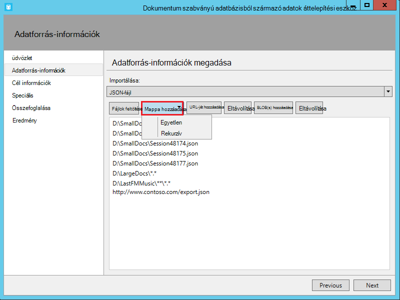

Íme néhány parancssori minták JSON-fájlok importálása:

    #Import a single JSON file
    dt.exe /s:JsonFile /s.Files:.\Sessions.json /t:DocumentDBBulk /t.ConnectionString:"AccountEndpoint=<DocumentDB Endpoint>;AccountKey=<DocumentDB Key>;Database=<DocumentDB Database>;" /t.Collection:Sessions /t.CollectionThroughput:2500

    #Import a directory of JSON files
    dt.exe /s:JsonFile /s.Files:C:\TESessions\*.json /t:DocumentDBBulk /t.ConnectionString:" AccountEndpoint=<DocumentDB Endpoint>;AccountKey=<DocumentDB Key>;Database=<DocumentDB Database>;" /t.Collection:Sessions /t.CollectionThroughput:2500

    #Import a directory (including sub-directories) of JSON files
    dt.exe /s:JsonFile /s.Files:C:\LastFMMusic\**\*.json /t:DocumentDBBulk /t.ConnectionString:" AccountEndpoint=<DocumentDB Endpoint>;AccountKey=<DocumentDB Key>;Database=<DocumentDB Database>;" /t.Collection:Music /t.CollectionThroughput:2500

    #Import a directory (single), directory (recursive), and individual JSON files
    dt.exe /s:JsonFile /s.Files:C:\Tweets\*.*;C:\LargeDocs\**\*.*;C:\TESessions\Session48172.json;C:\TESessions\Session48173.json;C:\TESessions\Session48174.json;C:\TESessions\Session48175.json;C:\TESessions\Session48177.json /t:DocumentDBBulk /t.ConnectionString:"AccountEndpoint=<DocumentDB Endpoint>;AccountKey=<DocumentDB Key>;Database=<DocumentDB Database>;" /t.Collection:subs /t.CollectionThroughput:2500

    #Import a single JSON file and partition the data across 4 collections
    dt.exe /s:JsonFile /s.Files:D:\\CompanyData\\Companies.json /t:DocumentDBBulk /t.ConnectionString:"AccountEndpoint=<DocumentDB Endpoint>;AccountKey=<DocumentDB Key>;Database=<DocumentDB Database>;" /t.Collection:comp[1-4] /t.PartitionKey:name /t.CollectionThroughput:2500

##Importálás a MongoDB

Az adatforrás-MongoDB importáló beállítást lehetővé teszi, hogy az egyes MongoDB gyűjteményt importálása, és tetszés szerint szűrni a lekérdezés használata dokumentumok és/vagy a dokumentum szerkezetét módosítása a kivetítés használatával.  

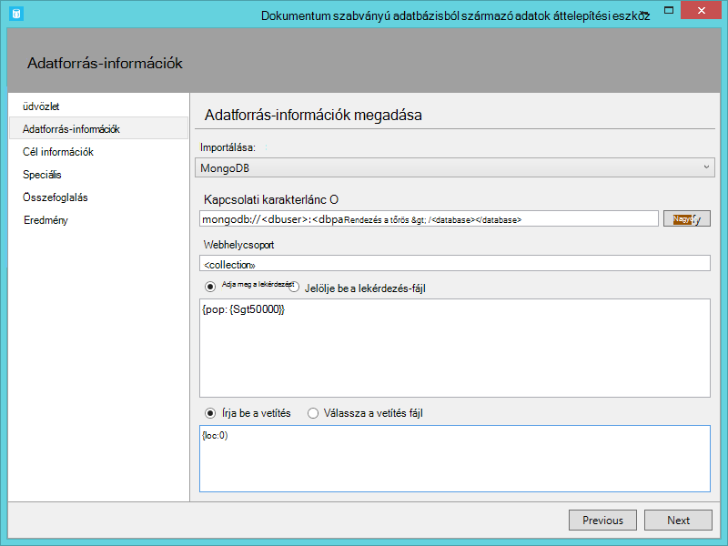

A szokásos MongoDB formátumban van a kapcsolati karakterláncot:

    mongodb://<dbuser>:<dbpassword>@<host>:<port>/<database>

> [AZURE.NOTE] Az ellenőrzés paranccsal annak érdekében, hogy a kapcsolati karakterlánc mezőben lévő megadott MongoDB példány is elérhető.

Adja meg a gyűjteményben, amelyből adatokat importált nevét. Tetszés szerint adja meg, illetve lehet adja meg a lekérdezés egy fájlt (például {pop: {$gt: 5000}}) és/vagy a kivetítés (például {loc:0}) szűrése és az importált adatok.

Íme néhány parancssori minták MongoDB importálása:

    #Import all documents from a MongoDB collection
    dt.exe /s:MongoDB /s.ConnectionString:mongodb://<dbuser>:<dbpassword>@<host>:<port>/<database> /s.Collection:zips /t:DocumentDBBulk /t.ConnectionString:"AccountEndpoint=<DocumentDB Endpoint>;AccountKey=<DocumentDB Key>;Database=<DocumentDB Database>;" /t.Collection:BulkZips /t.IdField:_id /t.CollectionThroughput:2500

    #Import documents from a MongoDB collection which match the query and exclude the loc field
    dt.exe /s:MongoDB /s.ConnectionString:mongodb://<dbuser>:<dbpassword>@<host>:<port>/<database> /s.Collection:zips /s.Query:{pop:{$gt:50000}} /s.Projection:{loc:0} /t:DocumentDBBulk /t.ConnectionString:"AccountEndpoint=<DocumentDB Endpoint>;AccountKey=<DocumentDB Key>;Database=<DocumentDB Database>;" /t.Collection:BulkZipsTransform /t.IdField:_id/t.CollectionThroughput:2500

##MongoDB export-fájlok importálása

A MongoDB exportálási JSON fájl forrás importáló beállítást az egy vagy több JSON fájlt a mongoexport segédprogram előállított importálását teszi lehetővé.  

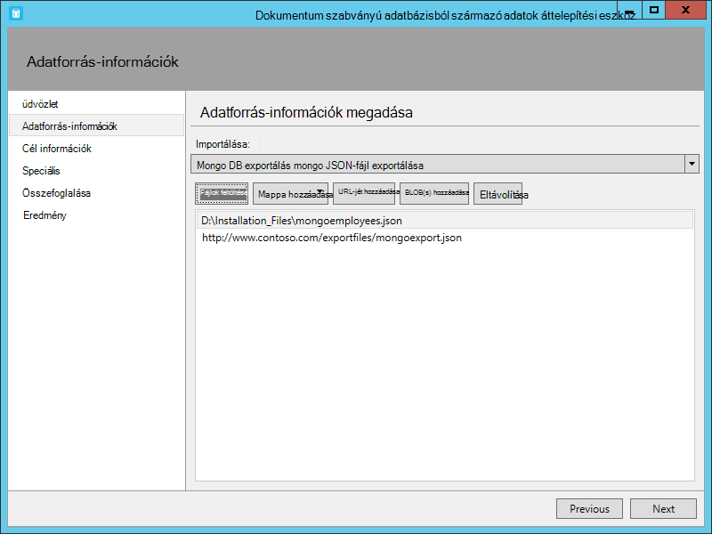

MongoDB exportálás JSON-fájlok importálása tartalmazó mappák hozzáadásakor meg, hogy az almappák fájlok keresése rekurzív.

Az alábbiakban MongoDB exportálás JSON-fájlok importálása parancssori minta:

    dt.exe /s:MongoDBExport /s.Files:D:\mongoemployees.json /t:DocumentDBBulk /t.ConnectionString:"AccountEndpoint=<DocumentDB Endpoint>;AccountKey=<DocumentDB Key>;Database=<DocumentDB Database>;" /t.Collection:employees /t.IdField:_id /t.Dates:Epoch /t.CollectionThroughput:2500

##Az SQL Server importálása

Az SQL forrás importáló beállítással importálása egy egyéni SQL Server-adatbázishoz, és tetszés szerint szűrheti a rekordokat, hogy importálható lekérdezés használata. Ezeken kívül módosíthatja a dokumentum szerkezetét (további tudnivalókat, hogy később) beágyazási elválasztó megadásával.  

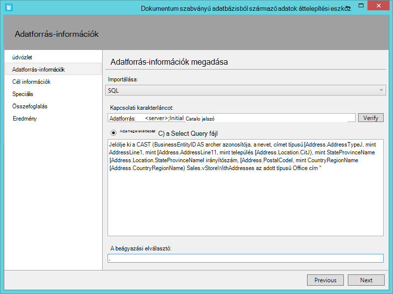

A kapcsolati karakterlánc formátuma SQL-kapcsolati karakterlánc szabványos formátuma.

> [AZURE.NOTE] Az ellenőrzés paranccsal annak érdekében, hogy az SQL Server-példányt a kapcsolati karakterlánc mezőben megadott is elérhető.

A beágyazási elválasztó tulajdonság létrehozása (alszint dokumentumok) hierarchikus kapcsolatok az importálás során szolgál. Vegye figyelembe az alábbi SQL-lekérdezés:

*Válassza a azonosító, nevét, AddressType, mint [Address.AddressType], AddressLine1, mint [Address.AddressLine1], [Address.Location.City], a város, StateProvinceName, mint [Address.Location.StateProvinceName], irányítószám, mint [Address.PostalCode], CountryRegionName, mint [Address.CountryRegionName] Sales.vStoreWithAddresses hol AddressType a CAST (BusinessEntityID AS varchar) = "Fő Office"*

A következő (részleges) eredményt ad, amely:

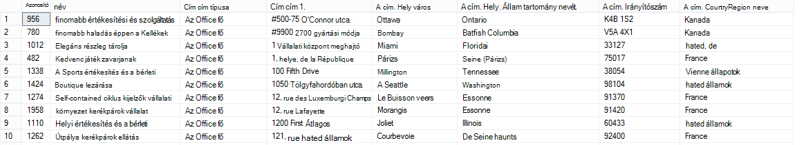

Megjegyzés: az aliasokat, például Address.AddressType és Address.Location.StateProvinceName. A beágyazási elválasztó megadásával ".", az importálási eszköz hoz létre a cím és Address.Location aldokumentumokkal, az importálás során. Íme egy példa DocumentDB az eredményül kapott dokumentum:

*{"azonosító": "956", "név": "Finomabb értékesítési és szolgáltatás", "Cím": {"AddressType": "Fő Office", "AddressLine1": "#500-75 O'Connor Street", "Hely": {"Város": "Ottawa", "StateProvinceName": "Ontario"}, "Irányítószám": "K4B 1S2", "CountryRegionName": "Kanada"}}*

Íme néhány parancssori minták importálni az SQL Server:

    #Import records from SQL which match a query
    dt.exe /s:SQL /s.ConnectionString:"Data Source=<server>;Initial Catalog=AdventureWorks;User Id=advworks;Password=<password>;" /s.Query:"select CAST(BusinessEntityID AS varchar) as Id, * from Sales.vStoreWithAddresses WHERE AddressType='Main Office'" /t:DocumentDBBulk /t.ConnectionString:" AccountEndpoint=<DocumentDB Endpoint>;AccountKey=<DocumentDB Key>;Database=<DocumentDB Database>;" /t.Collection:Stores /t.IdField:Id /t.CollectionThroughput:2500

    #Import records from sql which match a query and create hierarchical relationships
    dt.exe /s:SQL /s.ConnectionString:"Data Source=<server>;Initial Catalog=AdventureWorks;User Id=advworks;Password=<password>;" /s.Query:"select CAST(BusinessEntityID AS varchar) as Id, Name, AddressType as [Address.AddressType], AddressLine1 as [Address.AddressLine1], City as [Address.Location.City], StateProvinceName as [Address.Location.StateProvinceName], PostalCode as [Address.PostalCode], CountryRegionName as [Address.CountryRegionName] from Sales.vStoreWithAddresses WHERE AddressType='Main Office'" /s.NestingSeparator:. /t:DocumentDBBulk /t.ConnectionString:" AccountEndpoint=<DocumentDB Endpoint>;AccountKey=<DocumentDB Key>;Database=<DocumentDB Database>;" /t.Collection:StoresSub /t.IdField:Id /t.CollectionThroughput:2500

##Importálása CSV-fájlok - konvertálása CSV JSON-ba

A CSV-fájl forrás importáló lehetőség lehetővé teszi, hogy egy vagy több CSV-fájlok importálása. Hozzáadása CSV-fájl importálása tartalmazó mappákat, ha rekurzív almappák fájlok keresése lehetőséget.

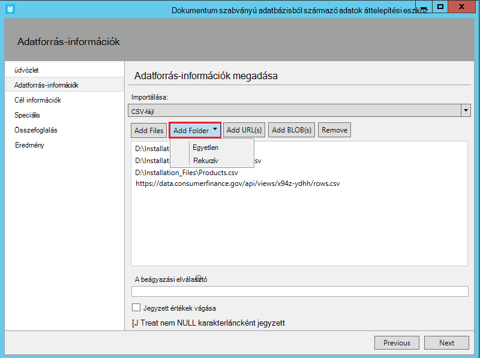

Hasonlóan, mint az SQL-forrást, a beágyazási elválasztó tulajdonság használható az importálás során (alszint dokumentumok) hierarchikus kapcsolatok létrehozásához. Vegye figyelembe az alábbi CSV-fejléc sor és az adatsorok:

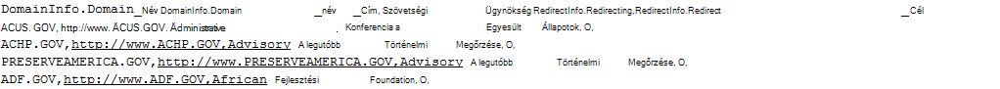

Megjegyzés: az aliasokat, például DomainInfo.Domain_Name és RedirectInfo.Redirecting. A beágyazási elválasztó megadásával ".", az importálási eszköz DomainInfo és RedirectInfo aldokumentumokkal hoz létre az importálás során. Íme egy példa DocumentDB az eredményül kapott dokumentum:

*{"DomainInfo": {"Tartománynév": "ACUS.GOV", "Domain_Name_Address": "http://www.ACUS.GOV"}, "Szövetségi ügynökség": "felügyeleti konferencia az Amerikai Egyesült államokbeli", "RedirectInfo": {"Átirányítás": "0", "Redirect_Destination": ""}, "azonosító": "9cc565c5-ebcd-1c03-ebd3-cc3e2ecd814d"}*

Az importálás eszközzel megpróbálja előállítani adatainak jegyzett értékek CSV-fájlok (jegyzett értékek mindig számít karakterláncok) alapján.  Fájltípusok azonosítja a következő sorrendben: szám, dátum és idő, logikai érték.  

Két dolgot más CSV importálása kapcsolatos megjegyzés:

1.  Alapértelmezés szerint nem jegyzett értékek mindig elrejti a program tabulátorok és szóközök, miközben jegyzett értékek őrződnek meg – van. Ez a jelenség felülírható a /s.TrimQuoted parancssori kapcsoló és a Trim jegyzett értékek jelölőnégyzet.

2.  Alapértelmezés szerint egy jegyzett null null értéket kell kezelni. Ez a jelenség felülírható (azaz tekinti-jegyzett null "üres" karakterláncot) és a Treat nem jegyzett üres karakterlánc jelölőnégyzetet, vagy a /s.NoUnquotedNulls parancssori kapcsoló.

Az alábbiakban a minta CSV-importáláshoz parancssori:

    dt.exe /s:CsvFile /s.Files:.\Employees.csv /t:DocumentDBBulk /t.ConnectionString:"AccountEndpoint=<DocumentDB Endpoint>;AccountKey=<DocumentDB Key>;Database=<DocumentDB Database>;" /t.Collection:Employees /t.IdField:EntityID /t.CollectionThroughput:2500

##Azure táblatárolóhoz importálása

Az Azure-táblából tárolási forrás importáló lehetőség lehetővé teszi, hogy az egyes Azure-táblából tároló tábla importálása, és tetszés szerint szűrheti az importálni kívánt táblázat szervezetek.  

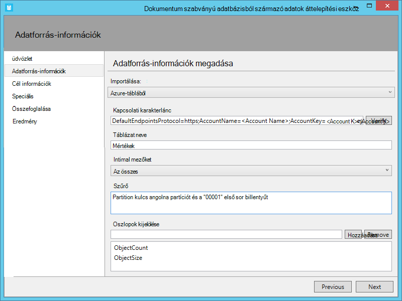

A csatlakozási karakterlánc Azure-táblából tárolási formátuma:

    DefaultEndpointsProtocol=<protocol>;AccountName=<Account Name>;AccountKey=<Account Key>;

> [AZURE.NOTE] Az ellenőrzés paranccsal annak érdekében, hogy az Azure-táblából tárterület-példány a kapcsolati karakterlánc mezőben megadott is elérhető.

Írja be a nevét az Azure táblázat, amelyből adatokat importált. [Szűrő](https://msdn.microsoft.com/library/azure/ff683669.aspx)tetszés szerint adja meg.

Az Azure-táblából tárolási forrás importáló lehetőség van a következő további lehetőségeket:

1. Belső mezőket
    2. All - tartalmazza az összes belső mezők (PartitionKey RowKey és időbélyeg)
    3. Nincs – kizárja az összes belső mező
    4. RowKey - csak tartalmazzák a RowKey mező
3. Oszlopok kijelölése
    1. Azure tábla tárolási szűrők nem támogatják az előrejelzések. Ha csak az adott Azure-táblából entitás tulajdonságai importálni kívánt, felveheti az oszlopok kiválasztása listában. Minden személy tulajdonság figyelmen kívül hagyja.

Az alábbiakban parancssori minta importálása az Azure táblatárolóhoz:

    dt.exe /s:AzureTable /s.ConnectionString:"DefaultEndpointsProtocol=https;AccountName=<Account Name>;AccountKey=<Account Key>" /s.Table:metrics /s.InternalFields:All /s.Filter:"PartitionKey eq 'Partition1' and RowKey gt '00001'" /s.Projection:ObjectCount;ObjectSize  /t:DocumentDBBulk /t.ConnectionString:" AccountEndpoint=<DocumentDB Endpoint>;AccountKey=<DocumentDB Key>;Database=<DocumentDB Database>;" /t.Collection:metrics /t.CollectionThroughput:2500

##Importálás a Amazon DynamoDB

Az adatforrás-Amazon DynamoDB importáló beállítást lehetővé teszi, hogy az egyes Amazon DynamoDB táblázat importálása, és tetszés szerint szűrheti az importálni kívánt személyek. Több sablont, hogy a importálási beállítása ugyanolyan egyszerű, mint a lehetséges állnak rendelkezésre.

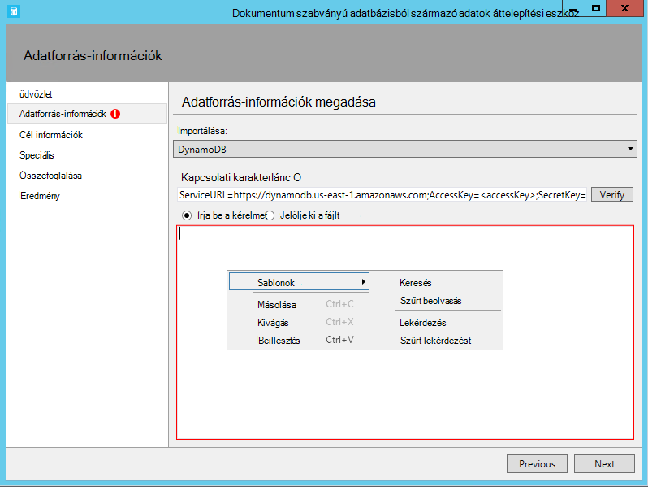

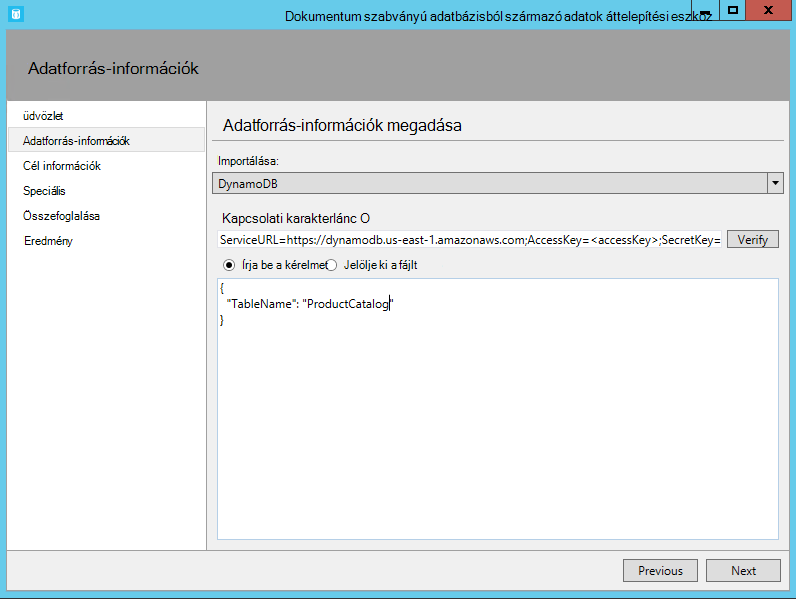

Az Amazon DynamoDB kapcsolati karakterlánc formátuma:

    ServiceURL=<Service Address>;AccessKey=<Access Key>;SecretKey=<Secret Key>;

> [AZURE.NOTE] A tulajdonjogának igazolása paranccsal annak érdekében, hogy az Amazon DynamoDB példány a kapcsolati karakterlánc mezőben megadott is elérhető.

Az alábbiakban az Amazon DynamoDB importálása parancssori minta:

    dt.exe /s:DynamoDB /s.ConnectionString:ServiceURL=https://dynamodb.us-east-1.amazonaws.com;AccessKey=<accessKey>;SecretKey=<secretKey> /s.Request:"{   """TableName""": """ProductCatalog""" }" /t:DocumentDBBulk /t.ConnectionString:"AccountEndpoint=<DocumentDB Endpoint>;AccountKey=<DocumentDB Key>;Database=<DocumentDB Database>;" /t.Collection:catalogCollection /t.CollectionThroughput:2500

##Fájlok importálása az Azure Blob-tárolóhoz

A JSON-fájlt, a MongoDB exportált fájlt és a CSV fájl forrás importáló beállításai lehetővé teszik egy vagy több fájlt importálása az Azure Blob-tárolóhoz. Miután megadta a Blob-tárolóhoz URL-cím és a Fiókkulcs, egyszerűen adja meg a reguláris kifejezéseket, jelölje be a fájl importálásához.

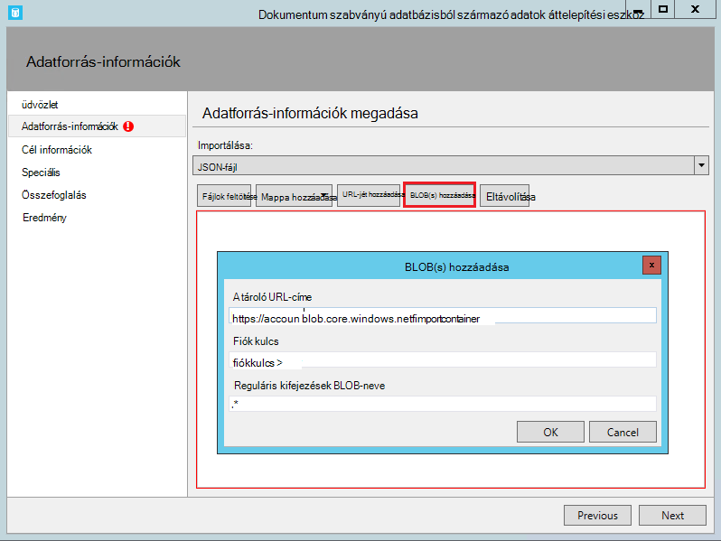

Az alábbiakban a JSON-fájlok importálása az Azure Blob-tárolóhoz parancssori minta:

    dt.exe /s:JsonFile /s.Files:"blobs://<account key>@account.blob.core.windows.net:443/importcontainer/.*" /t:DocumentDBBulk /t.ConnectionString:"AccountEndpoint=<DocumentDB Endpoint>;AccountKey=<DocumentDB Key>;Database=<DocumentDB Database>;" /t.Collection:doctest

##Importálás a DocumentDB

Az adatforrás-DocumentDB importáló beállítást lehetővé teszi, hogy egy vagy több DocumentDB gyűjtemények importálhatja az adatokat, és tetszés szerint szűrni a lekérdezés használata dokumentumok.  

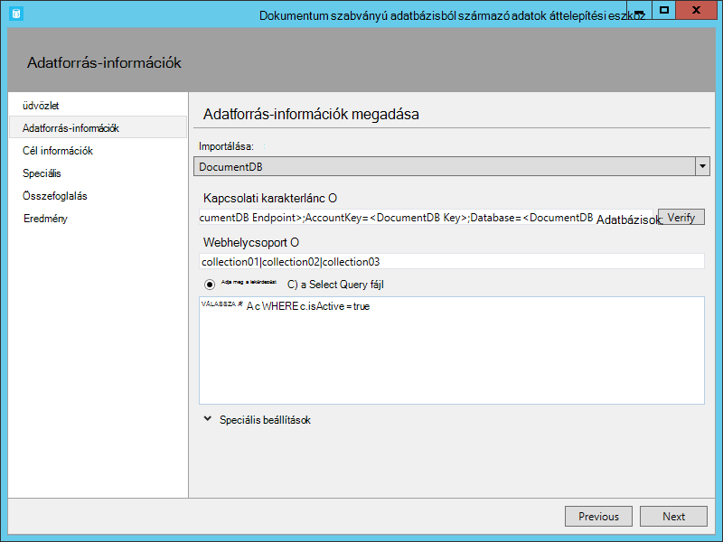

A DocumentDB kapcsolati karakterlánc formátuma:

    AccountEndpoint=<DocumentDB Endpoint>;AccountKey=<DocumentDB Key>;Database=<DocumentDB Database>;

A fiók kapcsolati karakterlánc is lehet beolvasni a billentyűk lap a Azure portál DocumentDB, [egy DocumentDB fiók kezelése](documentdb-manage-account.md), leírtak szerint azonban az adatbázis nevét kell hozzáfűzi a kapcsolati karakterláncot, a következő formátumban:

    Database=<DocumentDB Database>;

> [AZURE.NOTE] Az ellenőrzés paranccsal annak érdekében, hogy a kapcsolati karakterlánc mezőben lévő megadott DocumentDB példány is elérhető.

Egyetlen DocumentDB gyűjteményből importálni, adja meg a gyűjteményben, amelyből adatokat importált nevét. Szeretne több DocumentDB gyűjtemények importálni, adja meg a reguláris kifejezéseket megfelelően egy vagy több webhelycsoport nevét (például collection01 |} collection02 |} collection03). Ön tetszés szerint adja meg, és adja meg a fájlt, a lekérdezés szűrő és az alakzat az importálni kívánt adatokat.

> [AZURE.NOTE] Mivel a gyűjtemény mezőben reguláris kifejezések, fogadja el, ha importál egy egyetlen különféle, amelynek reguláris kifejezésekkel karaktereket tartalmaz, majd ezeket a karaktereket kell megjelölni megfelelően.

Az adatforrás-DocumentDB importáló beállítást az alábbi speciális beállítások foglalja magában:

1. Többek között a belső mezők: Itt adhatja meg DocumentDB dokumentum Rendszertulajdonságok szerepeltetése az Exportálás (pl. _rid, _ts) kell-e.
2. Hiba esetén ismétlések számát: DocumentDB tranziens hibák (például a hálózati kapcsolat munka megszakítását) esetén a kapcsolat próbálkozások számát adja meg.
3. Újrapróbálkozási időköz: Itt adhatja meg mennyi ideig várjon között, hogy újra próbálkozik DocumentDB tranziens hibák (például a hálózati kapcsolat megszakítás) esetén a kapcsolat.
4. Csatlakozási mód: Itt adhatja meg a csatlakozási mód DocumentDB használatára. A választható DirectTcp, DirectHttps és az átjáró. A közvetlen kapcsolat beállításai gyorsabb, míg az átjáró mód további tűzfal rövid csak használ a 443-as port.

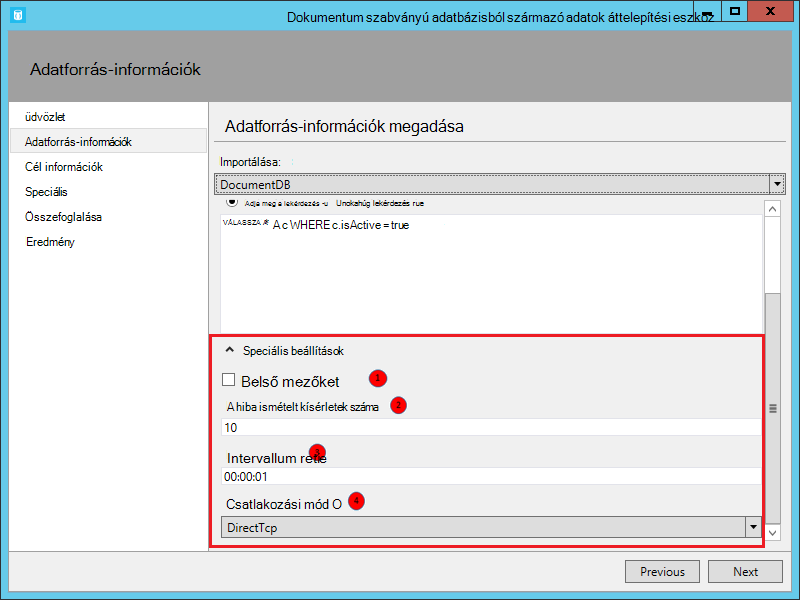

> [AZURE.TIP] Az importálási eszköz alapértelmezett csatlakozási mód DirectTcp. Ha tűzfalat problémákat tapasztal, váltson csatlakozási mód átjárót, csak megköveteli a 443-as port.

Íme néhány parancssori minták DocumentDB importálása:

    #Migrate data from one DocumentDB collection to another DocumentDB collections
    dt.exe /s:DocumentDB /s.ConnectionString:"AccountEndpoint=<DocumentDB Endpoint>;AccountKey=<DocumentDB Key>;Database=<DocumentDB Database>;" /s.Collection:TEColl /t:DocumentDBBulk /t.ConnectionString:" AccountEndpoint=<DocumentDB Endpoint>;AccountKey=<DocumentDB Key>;Database=<DocumentDB Database>;" /t.Collection:TESessions /t.CollectionThroughput:2500

    #Migrate data from multiple DocumentDB collections to a single DocumentDB collection
    dt.exe /s:DocumentDB /s.ConnectionString:"AccountEndpoint=<DocumentDB Endpoint>;AccountKey=<DocumentDB Key>;Database=<DocumentDB Database>;" /s.Collection:comp1|comp2|comp3|comp4 /t:DocumentDBBulk /t.ConnectionString:"AccountEndpoint=<DocumentDB Endpoint>;AccountKey=<DocumentDB Key>;Database=<DocumentDB Database>;" /t.Collection:singleCollection /t.CollectionThroughput:2500

    #Export a DocumentDB collection to a JSON file
    dt.exe /s:DocumentDB /s.ConnectionString:"AccountEndpoint=<DocumentDB Endpoint>;AccountKey=<DocumentDB Key>;Database=<DocumentDB Database>;" /s.Collection:StoresSub /t:JsonFile /t.File:StoresExport.json /t.Overwrite /t.CollectionThroughput:2500

##Importálás a HBase

A HBase forrás importáló beállítással importálhatja az adatokat egy HBase táblából, és tetszés szerint szűrheti az adatokat. Több sablont, hogy a importálási beállítása ugyanolyan egyszerű, mint a lehetséges állnak rendelkezésre.

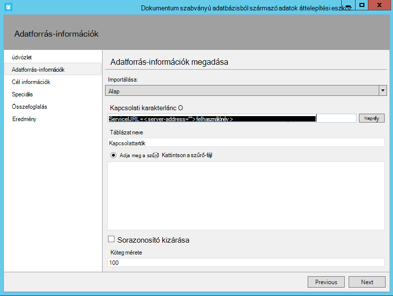

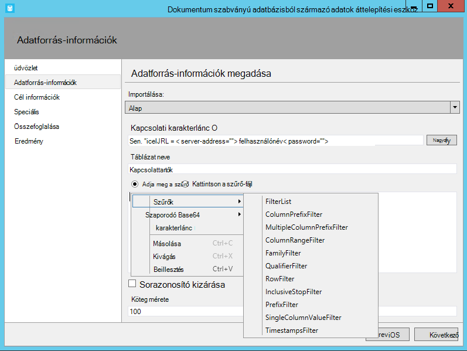

A HBase Stargate kapcsolati karakterlánc formátuma:

    ServiceURL=<server-address>;Username=<username>;Password=<password>

> [AZURE.NOTE] Az ellenőrzés paranccsal annak érdekében, hogy a kapcsolati karakterlánc mezőben lévő megadott HBase példány is elérhető.

Az alábbiakban parancssori minta HBase importálása:

    dt.exe /s:HBase /s.ConnectionString:ServiceURL=<server-address>;Username=<username>;Password=<password> /s.Table:Contacts /t:DocumentDBBulk /t.ConnectionString:"AccountEndpoint=<DocumentDB Endpoint>;AccountKey=<DocumentDB Key>;Database=<DocumentDB Database>;" /t.Collection:hbaseimport

##Importálás a DocumentDB (tömeges importálása)

A tömeges DocumentDB importáló importálása a rendelkezésre álló forrás beállításokat, a hatékonyság DocumentDB tárolt eljárás használatával teszi lehetővé. Az eszköz támogat, és egy másik egyetlen DocumentDB webhelycsoport importálás egyaránt sharded importálása, amellyel az adatok több egy másik DocumentDB gyűjtemények keresztül particionálva van. Adatok szétválasztás kapcsolatos további tudnivalókért olvassa el a [particionálására és Azure DocumentDB a méretezés](documentdb-partition-data.md)című témakört. Az eszköz létrehozása, hajtsa végre, és törölje a tárolt eljárás a cél collection(s) a.  

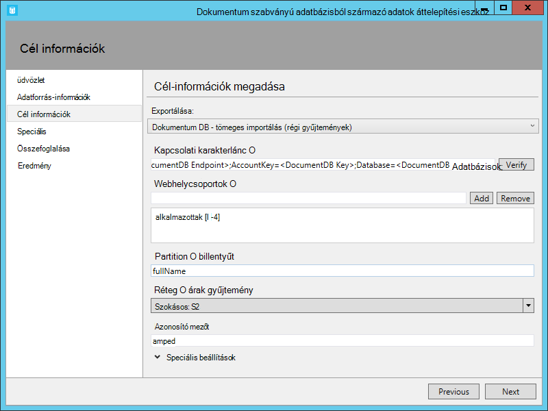

A DocumentDB kapcsolati karakterlánc formátuma:

    AccountEndpoint=<DocumentDB Endpoint>;AccountKey=<DocumentDB Key>;Database=<DocumentDB Database>;

A fiók kapcsolati karakterlánc is lehet beolvasni a billentyűk lap a Azure portál DocumentDB, [egy DocumentDB fiók kezelése](documentdb-manage-account.md), leírtak szerint azonban az adatbázis nevét kell hozzáfűzi a kapcsolati karakterláncot, a következő formátumban:

    Database=<DocumentDB Database>;

> [AZURE.NOTE] Az ellenőrzés paranccsal annak érdekében, hogy a kapcsolati karakterlánc mezőben lévő megadott DocumentDB példány is elérhető.

Egyetlen gyűjtemény importálása, írja be a nevét, amelyhez adatokat importált, és kattintson a Hozzáadás gombra a gyűjtemény. Több gyűjtemények importálni, adja meg a webhelycsoport neveket egyenként vagy több gyűjtemények adja meg a következő szintaxissal: *collection_prefix*[kezdési index - vége index]. A fenti szintaxis keresztül több gyűjtemények megadásakor tartsa szem előtt a következőket:

1. Csak az egész tartomány neve mintázatok támogatottak. Például adja meg a webhelycsoport [0-3-as] hoznak létre a következő gyűjtemények: collection0, collection1, collection2, collection3.
2. Szeretné használni egy rövidített szintaxist: [3] webhelycsoport fog elhelyezése ugyanazok a webhelycsoportok említett lépés: 1.
3. Egynél több helyettesítése adható meg. Például a webhelycsoport [0 – 1] [0 – 9-es] létrehozza 20 webhelycsoport nevét, bevezető nullákkal (collection01, … 02. 03).

A webhelycsoport neve megadása után válassza ki a kívánt kapacitásának a collection(s) (10 000 RUs való 400 RUs). Importálás jobb teljesítmény elérése érdekében válasszon egy újabb átviteli. Teljesítményszint kapcsolatos további tudnivalókért olvassa el a [teljesítményszint a DocumentDB](documentdb-performance-levels.md)című témakört.

> [AZURE.NOTE] A teljesítmény átviteli beállítás csak a webhelycsoport létrehozása vonatkozik. Ha a megadott gyűjtemény már létezik, az átviteli nem módosítható.

Több gyűjtemények importálásakor a az importálás eszköz támogatja a kivonat sharding alapján. Ebben az esetben, adja meg a partíciót kulcsként használni kívánt dokumentumtulajdonság (Ha partíciót kulcs üresen hagyja, dokumentumok lesz sharded véletlenszerűen végig a cél gyűjtemények).

Előfordulhat, hogy tetszés szerint megadhatja az importálás forrásban melyik mezőt kell használni a DocumentDB dokumentumtulajdonság azonosító (figyelje meg, hogy ha a dokumentumok ezt a tulajdonságot tartalmaz, majd az importálási eszköz hoz létre GUID azonosítója tulajdonság értékként) importáláskor.

Nincsenek több speciális lehetőség az importálás során. Első lépésként, miközben az eszköz tartalmaz egy alapértelmezett tömeges importálása a tárolt eljárás (BulkInsert.js), adja meg a saját tárolt importálási műveletet végezheti:

 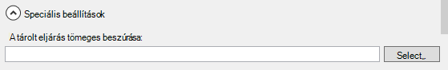

Ezenkívül dátumtípus (például az SQL Server vagy MongoDB) importálásakor választhat három importálása lehetőség közül választhat:

 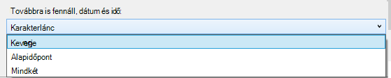

-   Karakterlánc: Szöveges értékként áll fenn
-   Alapidőpont: Értéket ad alapidőpont áll fenn
-   Mind: A probléma továbbra is fennáll, karakterlánc és alapidőpont érték is. Ez a beállítás létrehoz egy aldokumentumokban, például: "date_joined": {"Érték": "2013 – 10-21T21:17:25.2410000Z", "alapidőpont": 1382390245}

A tömeges DocumentDB importáló rendelkezik-e a következő további speciális beállítások:

1. Köteg mérete: Az eszköz alapértelmezés szerint egy köteg 50 méretét.  Ha az importálni kívánt dokumentumok nagy, akkor fontolja meg a köteg méretének csökkentése. Viszont ha importálni kívánt dokumentumokat kis, fontolja meg a tétel méretét emelése.
2. Max parancsfájl méret (bájt): az eszköz alapértelmezés szerint 512KB parancsfájl maximális mérete
3. Letiltása automatikus azonosító létrehozása: Ha minden importálni kívánt dokumentum-azonosító mező tartalmazza, majd ezt a lehetőséget választva is teljesítmény növelése érdekében. Egyedi azonosító mező hiányzó dokumentumok nem fog importálni.
4. Frissítés meglévő dokumentumok: Az eszköz alapértelmezés szerint nem lecserélve a meglévő dokumentumok azonosító ütközések. Ezt a lehetőséget választva engedélyezi a meglévő dokumentumok felülírása egyező azonosítóit tartalmazó. Ez a funkció akkor hasznos, amelyek meglévőket frissíteni ütemezett áttelepítések.
5. Hiba esetén ismétlések számát: DocumentDB tranziens hibák (például a hálózati kapcsolat munka megszakítását) esetén a kapcsolat próbálkozások számát adja meg.
6. Újrapróbálkozási időköz: Itt adhatja meg mennyi ideig várjon között, hogy újra próbálkozik DocumentDB tranziens hibák (például a hálózati kapcsolat megszakítás) esetén a kapcsolat.
7. Csatlakozási mód: Itt adhatja meg a csatlakozási mód DocumentDB használatára. A választható DirectTcp, DirectHttps és az átjáró. A közvetlen kapcsolat beállításai gyorsabb, míg az átjáró mód további tűzfal rövid csak használ a 443-as port.

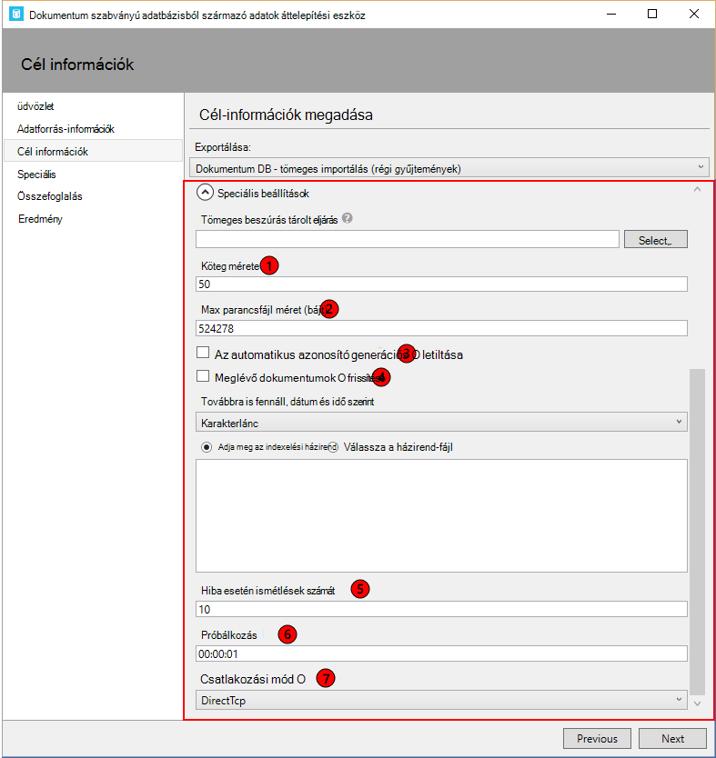

> [AZURE.TIP] Az importálási eszköz alapértelmezett csatlakozási mód DirectTcp. Ha tűzfalat problémákat tapasztal, váltson csatlakozási mód átjárót, csak megköveteli a 443-as port.

##Importálás a DocumentDB (egymás után következő rekord importálása)

A DocumentDB egymást bejegyzéshez importáló bármilyen rekord által rekord alapon forrástípus beállítások importálását teszi lehetővé. Előfordulhat, hogy válassza ezt a lehetőséget, ha egy meglévő webhelycsoport, tárolt eljárások kvótáját kapott importál. Az eszköz egy Single (egyszeres-partíciót és több partíciót) DocumentDB a webhelycsoportban, valamint sharded importálni, amellyel több egyetlen-partíciót és/vagy a több elem partition DocumentDB gyűjtemények keresztül particionált adatok importálása támogatja. Adatok szétválasztás kapcsolatos további tudnivalókért olvassa el a [particionálására és Azure DocumentDB a méretezés](documentdb-partition-data.md)című témakört.

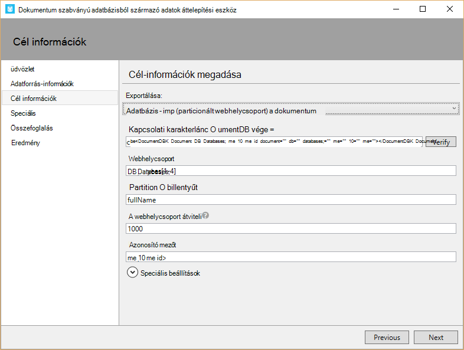

A DocumentDB kapcsolati karakterlánc formátuma:

    AccountEndpoint=<DocumentDB Endpoint>;AccountKey=<DocumentDB Key>;Database=<DocumentDB Database>;

A fiók kapcsolati karakterlánc is lehet beolvasni a billentyűk lap a Azure portál DocumentDB, [egy DocumentDB fiók kezelése](documentdb-manage-account.md), leírtak szerint azonban az adatbázis nevét kell hozzáfűzi a kapcsolati karakterláncot, a következő formátumban:

    Database=<DocumentDB Database>;

> [AZURE.NOTE] Az ellenőrzés paranccsal annak érdekében, hogy a kapcsolati karakterlánc mezőben lévő megadott DocumentDB példány is elérhető.

Egyetlen gyűjtemény importálása, írja be a nevét, amelyhez adatokat importált, és kattintson a Hozzáadás gombra a gyűjtemény. Több gyűjtemények importálni, adja meg a webhelycsoport neveket egyenként vagy több gyűjtemények adja meg a következő szintaxissal: *collection_prefix*[kezdési index - vége index]. A fenti szintaxis keresztül több gyűjtemények megadásakor tartsa szem előtt a következőket:

1. Csak az egész tartomány neve mintázatok támogatottak. Például adja meg a webhelycsoport [0-3-as] hoznak létre a következő gyűjtemények: collection0, collection1, collection2, collection3.
2. Szeretné használni egy rövidített szintaxist: [3] webhelycsoport fog elhelyezése ugyanazok a webhelycsoportok említett lépés: 1.
3. Egynél több helyettesítése adható meg. Például a webhelycsoport [0 – 1] [0 – 9-es] létrehozza 20 webhelycsoport nevét, bevezető nullákkal (collection01, … 02. 03).

A webhelycsoport neve megadása után válassza ki a kívánt kapacitásának a collection(s) (250 000 RUs való 400 RUs). Importálás jobb teljesítmény elérése érdekében válasszon egy újabb átviteli. Teljesítményszint kapcsolatos további tudnivalókért olvassa el a [teljesítményszint a DocumentDB](documentdb-performance-levels.md)című témakört. Bármely importálást gyűjtemények átviteli a > 10 000 RUs partíciót kulcs van szükség. Ha úgy dönt, hogy több mint 250 000 RUs, olvassa el a [kérése a nagyobb DocumentDB fiók korlátozások](documentdb-increase-limits.md)című témakört.

> [AZURE.NOTE] A teljesítmény beállítás csak a webhelycsoport létrehozása vonatkozik. Ha a megadott gyűjtemény már létezik, az átviteli nem módosítható.

Több gyűjtemények importálásakor a az importálás eszköz támogatja a kivonat sharding alapján. Ebben az esetben, adja meg a partíciót kulcsként használni kívánt dokumentumtulajdonság (Ha partíciót kulcs üresen hagyja, dokumentumok lesz sharded véletlenszerűen végig a cél gyűjtemények).

Előfordulhat, hogy tetszés szerint megadhatja az importálás forrásban melyik mezőt kell használni a DocumentDB dokumentumtulajdonság azonosító (figyelje meg, hogy ha a dokumentumok ezt a tulajdonságot tartalmaz, majd az importálási eszköz hoz létre GUID azonosítója tulajdonság értékként) importáláskor.

Nincsenek több speciális lehetőség az importálás során. Első lépésként dátumtípus (például az SQL Server vagy MongoDB) importálásakor közül választhat három importálása lehetőség közül választhat:

 

-   Karakterlánc: Szöveges értékként áll fenn
-   Alapidőpont: Értéket ad alapidőpont áll fenn
-   Mind: A probléma továbbra is fennáll, karakterlánc és alapidőpont érték is. Ez a beállítás létrehoz egy aldokumentumokban, például: "date_joined": {"Érték": "2013 – 10-21T21:17:25.2410000Z", "alapidőpont": 1382390245}

A DocumentDB – az egymás után következő rekord importáló a következő további speciális beállítások magában:

1. A párhuzamos kérések száma: 2 párhuzamos kérések alapértelmezés szerint az eszközt. Ha a dokumentumok importálni kívánt kis, akkor fontolja meg a emelése párhuzamos kérések száma. Figyelje meg, hogy ha a szám túl nagy a akkor következik be, az importálás merülhetnek fel szabályozásának.
2. Letiltása automatikus azonosító létrehozása: Ha minden importálni kívánt dokumentum-azonosító mező tartalmazza, majd ezt a lehetőséget választva is teljesítmény növelése érdekében. Egyedi azonosító mező hiányzó dokumentumok nem fog importálni.
3. Frissítés meglévő dokumentumok: Az eszköz alapértelmezés szerint nem lecserélve a meglévő dokumentumok azonosító ütközések. Ezt a lehetőséget választva engedélyezi a meglévő dokumentumok felülírása egyező azonosítóit tartalmazó. Ez a funkció akkor hasznos, amelyek meglévőket frissíteni ütemezett áttelepítések.
4. Hiba esetén ismétlések számát: DocumentDB tranziens hibák (például a hálózati kapcsolat munka megszakítását) esetén a kapcsolat próbálkozások számát adja meg.
5. Újrapróbálkozási időköz: Itt adhatja meg mennyi ideig várjon között, hogy újra próbálkozik DocumentDB tranziens hibák (például a hálózati kapcsolat megszakítás) esetén a kapcsolat.
6. Csatlakozási mód: Itt adhatja meg a csatlakozási mód DocumentDB használatára. A választható DirectTcp, DirectHttps és az átjáró. A közvetlen kapcsolat beállításai gyorsabb, míg az átjáró mód további tűzfal rövid csak használ a 443-as port.

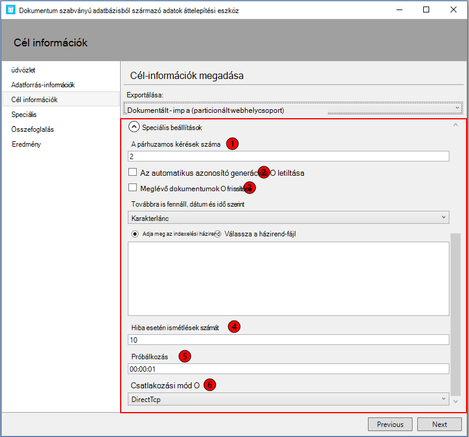

> [AZURE.TIP] Az importálási eszköz alapértelmezett csatlakozási mód DirectTcp. Ha tűzfalat problémákat tapasztal, váltson csatlakozási mód átjárót, csak megköveteli a 443-as port.

##Adja meg az indexelési házirend, DocumentDB webhelycsoportok létrehozása

Ha engedélyezi az áttelepítési eszköz webhelycsoportok létrehozása az importálás során, akkor megadhatja az indexelési házirendet a gyűjtemények. A Speciális beállítások szakaszában DocumentDB tömeges importálni, és DocumentDB egymás után következő beállítás, nyissa meg a házirend indexelés szakaszt.

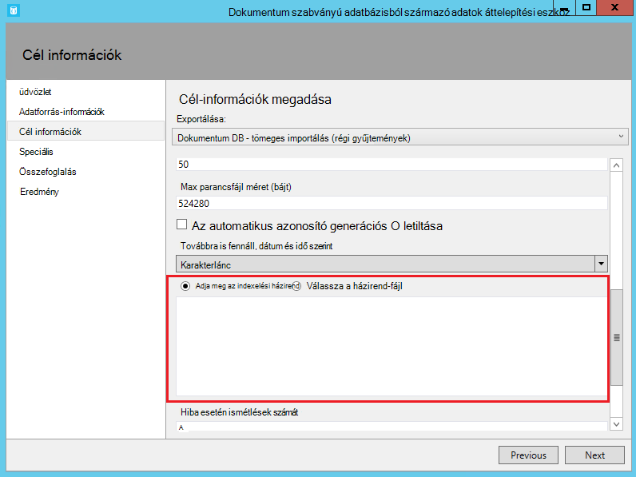

A házirenddel az indexelés speciális beállítás akkor is válasszon ki egy indexelési házirend-fájlt, manuálisan adja meg az indexelési házirend vagy kattintva válassza ki az alapértelmezett sablonok közül (jobbra az indexelési házirend rendelés_részletei.mennyiség).

A házirend-sablonok az eszköz biztosít a következők:

- Az alapértelmezett nyelv. Ezzel a házirenddel a legjobb, ha éppen elvégzéséhez karakterláncok egyenlő lekérdezéseket és számok ORDER BY, a tartomány és a egyenlő lekérdezések segítségével. Ez a házirend mint tartomány alsó index tároló terhelést rendelkezik.
- Tartomány. Ezzel a házirenddel a legjobb használ ORDER BY, tartomány- és egyenlő lekérdezések számok és a karakterláncok. Ez a házirend egy újabb index tároló terhelést, mint az alapértelmezett vagy kivonat rendelkezik.

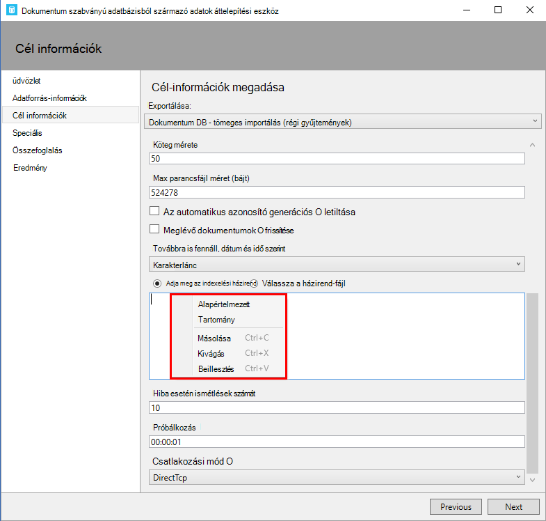

> [AZURE.NOTE] Ha nem adja meg az indexelési házirend, majd az alapértelmezett házirend fog vonatkozni. Az indexelési házirendek kapcsolatos további tudnivalókért lásd: a [DocumentDB indexelési házirendek](documentdb-indexing-policies.md).

## JSON-fájl exportálása

A DocumentDB JSON exportáló lehetővé teszi a rendelkezésre álló forrás beállítások bármelyikét exportálása JSON dokumentumok tömbképletet tartalmazó JSON-fájlba. Az eszköz az Exportálás ki fogja kezelni, vagy megtekintheti az eredményül kapott áttelepítési parancsot, és futtassa a parancsot választja. Az eredményül kapott JSON-fájlban a helyben vagy Azure Blob-tárolóhoz tárolhatók.

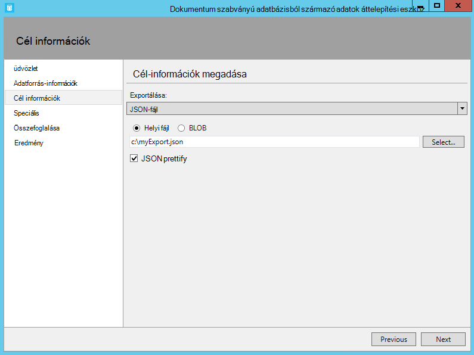

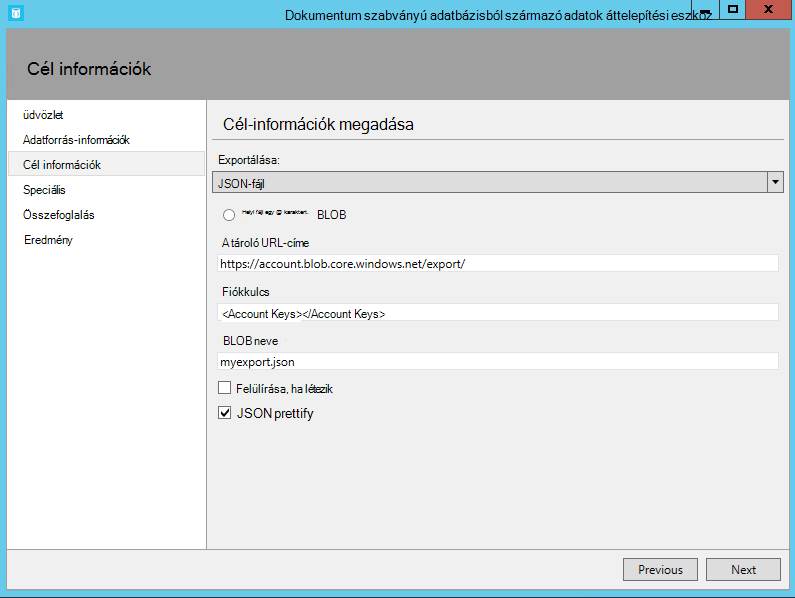

Tetszés szerint végezheti el az eredményül kapott JSON, és miközben tartalmát több lesz az eredményül kapott dokumentum méretének növelése prettify emberi olvasható.

    Standard JSON export
    [{"id":"Sample","Title":"About Paris","Language":{"Name":"English"},"Author":{"Name":"Don","Location":{"City":"Paris","Country":"France"}},"Content":"Don's document in DocumentDB is a valid JSON document as defined by the JSON spec.","PageViews":10000,"Topics":[{"Title":"History of Paris"},{"Title":"Places to see in Paris"}]}]

    Prettified JSON export
    [
    {
    "id": "Sample",
    "Title": "About Paris",
    "Language": {
      "Name": "English"
    },
    "Author": {
      "Name": "Don",
      "Location": {
        "City": "Paris",
        "Country": "France"
      }
    },
    "Content": "Don's document in DocumentDB is a valid JSON document as defined by the JSON spec.",
    "PageViews": 10000,
    "Topics": [
      {
        "Title": "History of Paris"
      },
      {
        "Title": "Places to see in Paris"
      }
    ]
    }]

## Speciális beállítások

A Speciális beállítások képernyőn adja meg, amelyre meg szeretné a írt hibák naplója-fájl helyét. A következő szabályok lépnek érvénybe, erre a lapra:

1.  Ha nem adja meg a fájl nevét, majd a program összes hibát visszatér az eredmények lapon.
2.  Amennyiben a fájl nevét a címtár nélkül, majd a fájl fog kell létrehozott (vagy felül) az aktuális környezet könyvtárban.
3.  Ha bejelöli a meglévő fájl, majd a fájl felülíródnak, és nincs hozzáfűző beállítás.

Válassza a mind, a naplózását kritikus, vagy nincs hibaüzenetek jelennek meg. Végül döntse el, hogy milyen gyakran az a képernyő továbbított üzenet fognak frissülni meghívási folyamat.

    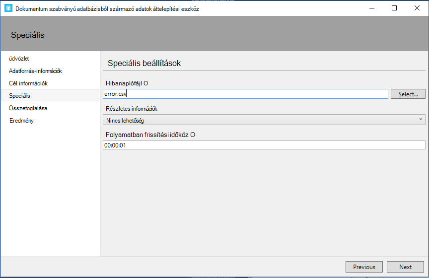

## Erősítse meg az importálási beállítások és a sor megtekintése parancs

1. Adatforrás-információk, a cél adatok és a Speciális beállítások megadását, követően ellenőrzése az összefoglaló áttelepítés, és tetszés szerint/példány megtekintése az eredményül kapott áttelepítési parancs (a parancs másolás akkor hasznos, importálási műveletekhez automatizálása):

    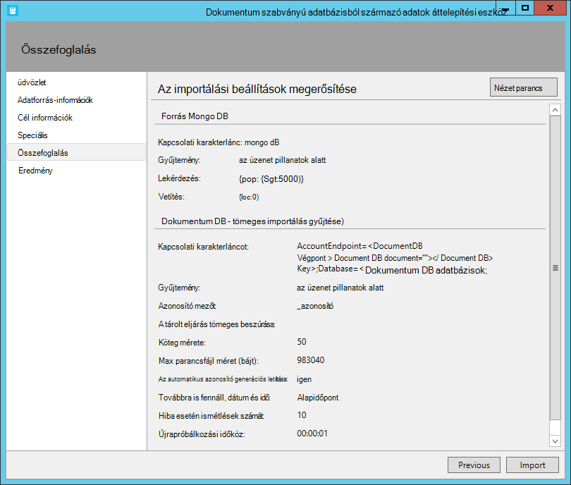

    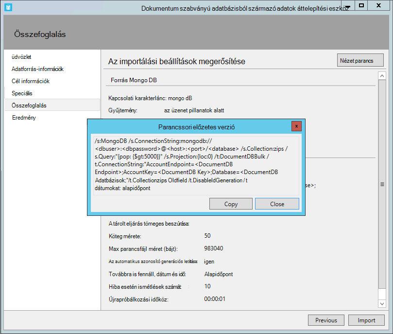

2. Ha elégedett a forrás- és célwebhelyek beállításokat, kattintson az **Importálás**gombra. Az eltelt idő, a átvitt darab és a hiba információk (Ha a fájl nevét a speciális konfigurációs nem nyújt) frissíteni fogjuk folyamatban van az importálást. Miután elkészült, exportálhatja az eredmények (pl. kell foglalkozni az importálási hibák).

    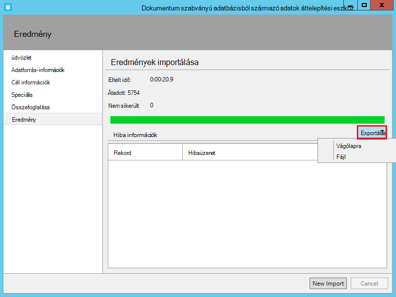

3. Teendők is egy új importálása, vagy hagyja a meglévő beállításokat (például csatlakozási karakterlánc információkat, forrás- és célwebhelyek választási lehetőségek, stb.), vagy alaphelyzetbe állítása az összes érték.

    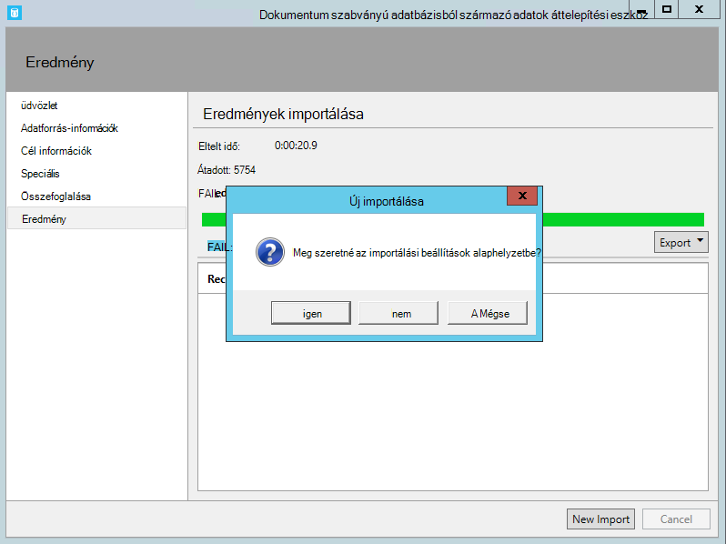

## Következő lépések

- DocumentDB kapcsolatos további információért olvassa el a [Tanulási javaslat](https://azure.microsoft.com/documentation/learning-paths/documentdb/)című témakört.
