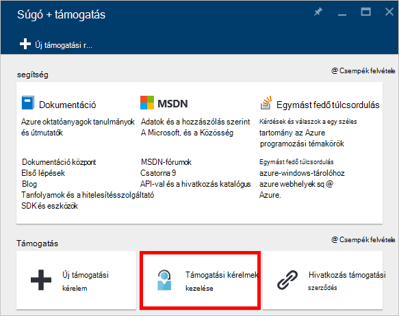

<properties
    pageTitle="Kérés nagyobb DocumentDB fiók kvóták |} Microsoft Azure"
    description="Megtudhatja, hogy hogyan kérhet DocumentDB adatbázis kvóták, például a dokumentumok tárolása és a webhelycsoport használati átviteli helyesbítése."
    services="documentdb"
    authors="AndrewHoh"
    manager="jhubbard"
    editor="monicar"
    documentationCenter=""/>

<tags
    ms.service="documentdb"
    ms.workload="data-services"
    ms.tgt_pltfrm="na"
    ms.devlang="na"
    ms.topic="article"
    ms.date="08/25/2016"
    ms.author="anhoh"/>

# Kérés nagyobb DocumentDB fiók korlátai

[Microsoft Azure DocumentDB](https://azure.microsoft.com/services/documentdb/) tartozik egy alapértelmezett kvóták Azure ügyfélszolgálat megkeresésével módosítható.  Ebből a cikkből megtudhatja, hogy hogyan kérhet egy kvóta növelése.

Ez a cikk elolvasása, után is az alábbi kérdésekre választ:  

-   Melyik DocumentDB adatbázis kvóták Azure ügyfélszolgálat megkeresésével módosítható?
-   Hogyan kérheti egy DocumentDB fiók kvóta kapcsolatos korrekció

##DocumentDB fiók kvóták

Az alábbi táblázat ismerteti a DocumentDB kvótákat. A csillaggal (*) kvótákat Azure ügyfélszolgálat megkeresésével módosítható:

[AZURE.INCLUDE [azure-documentdb-limits](../../includes/azure-documentdb-limits.md)]

##Egy kvóta Módosítás kérése
A következő lépések bemutatják, hogy hogyan kérhet egy kvóta kiigazítás.

1. Az [Azure-portálon](https://portal.azure.com)kattintson a **További szolgáltatások**elemre, és válassza a **Súgó + támogatás**.

    

2. Kattintson a **Súgó + támogatási** lap **új támogatási kérelem**.

    

3. Kattintson az **új támogatási kérelem** lap **alapjai**. **Kvóta**és az **előfizetés** -előfizetéséhez, amelyen a DocumentDB következő, állítsa be **probléma típusú** fiók, **DocumentDB** **kvóta típusát** , és **támogatási terv** **Kvóta**támogatás - tartalmazza. Kattintson a **Tovább gombra**.

    

4. A **probléma** a lap válasszon egy súlyosságát, és írja be a kvóta növelése kapcsolatos információkat **részletes**. Kattintson a **Tovább**gombra.

    

5. Végezetül töltse ki a **kapcsolattartási adatok** lap kapcsolattartási adatait, majd kattintson a **Létrehozás**gombra.

A támogatás jegy létrehozása után a támogatási kérelem szám mailben kap.  A **Súgó + támogatási** lap a **kezelés támogatási kérelmek** gombra kattintva is tekinthető meg a támogatási kérelmet.

##Következő lépések
- Többet szeretne tudni a DocumentDB, kattintson [ide](http://azure.com/docdb).
