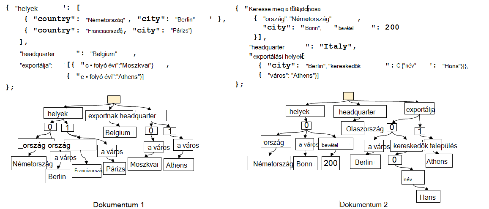
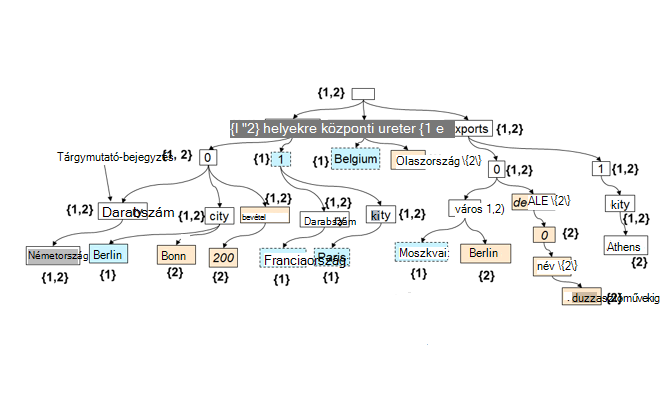

<properties 
    pageTitle="Automatikus indexelés DocumentDB |} Microsoft Azure" 
    description="Tudjon meg többet az Azure DocumentDB az Automatikus indexelés működik." 
    services="documentdb" 
    authors="arramac" 
    manager="jhubbard" 
    editor="mimig" 
    documentationCenter=""/>

<tags 
    ms.service="documentdb" 
    ms.workload="data-services" 
    ms.tgt_pltfrm="na" 
    ms.devlang="na" 
    ms.topic="article" 
    ms.date="10/27/2016" 
    ms.author="arramac"/>
    
# Automatikus indexelés az Azure DocumentDB

Ez a cikk a ["séma-felismerése nélkül indexelés az Azure DocumentDB"](http://www.vldb.org/pvldb/vol8/p1668-shukla.pdf) papír formában a [Belső konferencia 41st nagyon nagy adatbázisok](http://www.vldb.org/2015/) közötti augusztus 31 - szeptember 4, a Skype 2015, a rendszer származik, és van egy bevezető ismerteti, hogyan működik, de Azure DocumentDB indexelés. 

Ez elolvasása, után, fog kell választ adni a következő kérdéseket:

- Hogyan DocumentDB JSON a dokumentumokból a séma használata?
- Hogyan nem generál DocumentDB index elemezve dokumentumok között?
- Hogyan nem DocumentDB végezze el a méretezés Automatikus indexelés?

##Az indexelés DocumentDB működése

[Microsoft Azure DocumentDB](https://azure.microsoft.com/services/documentdb/) célja egy true séma ingyenes adatbázis JSON épített. Nem várt, és nem igényel séma vagy másodlagos tárgymutató-definíciók adatait indexelni a méretezés. Így gyorsan meghatározása és találta a alkalmazás adatmodellek DocumentDB használatával. Dokumentumok elhelyezése a gyűjteményt, mint a DocumentDB automatikusan indexek minden dokumentum tulajdonságai, így azok elérhetők, a lekérdezés. Automatikus indexelés lehetővé teszi, anélkül, hogy a sémák vagy másodlagos indexek teljesen tetszőleges sémák tartozó dokumentumok tárolásához.

Az adatbázis és az alkalmazás programozási modelljei közötti impedancia eltérés kiküszöbölése érdekében cél, a DocumentDB kihasználva, az egyszerű, a JSON és a séma specifikáció hiánya. A dokumentumokkal kapcsolatos nincs feltételezésekkel és a lehetővé teszi a dokumentumok egy DocumentDB gyűjteményben sémában mellett a példány konkrét értékek változhat. Más dokumentum adatbázisok alkalmazással szemben DocumentDB's adatbázismotort működik, közvetlenül a JSON nyelvhelyesség-ellenőrzés, a dokumentum séma fogalmának agnostic hátralévő és a dokumentumok szerkezetének és példány értékek közötti határ életlenítés szintjén. A, a-viszont lehetővé teszi, hogy automatikusan index dokumentumok séma vagy másodlagos indexek nélkül.

Az indexelés DocumentDB a előnyeit arra, hogy JSON nyelvhelyesség-ellenőrzés lehetővé teszi a dokumentumok **fák ábrázolva**lesz. Egy JSON dokumentum jeleníthető meg a fastruktúrájú egy üres legfelső szintű csomópont kell hozható létre, amely parents a többi tényleges csomópontok alatt a dokumentumban. Minden címke, többek között a tömb indexek JSON dokumentumokban a fa csomópont lesz. Az alábbi ábrán a egy példa JSON-dokumentum és a megfelelő fa ábrázolt mutatja be.

>[AZURE.NOTE] Mivel a JSON önálló leíró tehát minden dokumentum tartalmaz-e séma (metaadatok), mind az adatokat, például `{"locationId": 5, "city": "Moscow"}` során kiderül, hogy nincsenek-e két tulajdonságok `locationId` és `city`, és arról, hogy egy numerikus és karakterlánc tulajdonságértékeit. DocumentDB el tudja-e előállítani a dokumentumok a séma alapján és index őket, ha a beszúrt, vagy azok nélkül, bármikor, hogy a sémák vagy másodlagos indexek definiálása.

**JSON-dokumentumok, mint a fák:**

Ha például a példában a fent látható:

- A JSON tulajdonság `{"headquarters": "Belgium"}` tulajdonság a fenti példa az elérési út/központ/Belgium felel meg.
- A JSON tömb `{"exports": [{"city": “Moscow"}`, `{"city": Athens"}]}` felel meg az elérési út `/exports/[]/city/Moscow` és `/exports/[]/city/Athens`.

Az Automatikus indexelés, (1) minden elérési út a dokumentum fában indexelt (kivéve, ha a Fejlesztőeszközök kifejezetten beállította az indexelési házirend kizárni bizonyos elérési mintázatok). (2) a dokumentumok DocumentDB gyűjteménye, minden frissítése végigvezeti a struktúra (tehát okok hozzáadása vagy eltávolítása csomópontok) az index frissítéséhez. A dokumentumok automatikus indexelési elsődleges követelmények egyikének győződjön meg arról, hogy a tárgymutató-lekérdezés mélyen beágyazott struktúra dokumentumot, és mondja ki a 10 szintek költséget, ha csak egy szint megadott értékekkel mély tartalmazó egyszerű, strukturálatlan JSON dokumentum, amely megegyezik. A normalizált elérési út megadott ezért a foundation, amelyen mind az Automatikus indexelés és a lekérdezés alrendszerek kialakításának.

Kezelésének egyaránt fontos hatásainak egyenletesen elérési út pedig sémával és egy példány értékeket, amely csak, amelyekkel logikailag, mint az egyedi dokumentumokat, a két dokumentumok látható, amely megőrzi a közötti út a térképen index és a dokumentumazonosítók, az elérési út tartalmazó is lehet fa ábrázolva. DocumentDB használja a FAKT egy index fa, amelyek kívül az összes webhelycsoporton belüli egyedi dokumentumokat, amely a fák Szövetségének összeállítás összeállítása. A tárgymutató fa DocumentDB tartozó nő időbeli új dokumentum hozzáadása vagy a webhelycsoport frissítése.

**A fastruktúrájú, Index DocumentDB:**

Annak ellenére, hogy a séma ingyenes, DocumentDB meg az SQL- és JavaScript lekérdezési nyelvű dokumentumokat, térbeli műveletek és csupán a JavaScript írt UDF meghívását relációs előrejelzések és a szűrőket, a hierarchikus navigációs révén. A DocumentDB lekérdezés futtatókörnyezet el tudja támogatja a ezeket a lekérdezéseket, mert azt is működik, közvetlenül a tárgymutató fa az adatok ábrázolására szemben.

Az alapértelmezett indexelési házirend automatikusan indexek minden dokumentum tulajdonságainak és egységes lekérdezések (azaz a tárgymutató szinkron frissül a dokumentum írási) tartalmaz. Hogyan támogatja a méretezés az index fa egységes frissítések DocumentDB? DocumentDB optimalizált írási használ, ingyenes zárolása, és jelentkezzen be a strukturált index karbantartási technikákat. Ez azt jelenti, hogy DocumentDB támogatniuk kell a gyors írás közben is egységes lekérdezések tartós mennyiségig. 

Indexelő DocumentDB meg lett tervezve tároló hatékonyság és kezelje a több elem bérleti. Költség hatékonyság, az a lemezen tároló terhelést az index kiszámíthatóvá és kis. Index frissítések is megtörténik a rendszer-erőforrásokat DocumentDB webhelycsoport projektenként a költségvetés keretei között.

##Következő lépések
- Töltse le a ["séma-felismerése nélkül indexelés az Azure DocumentDB"](http://www.vldb.org/pvldb/vol8/p1668-shukla.pdf), be kell mutatni a nagyon nagy adatbázisok 41st belső konferencián augusztus 31-2015 szeptember 4.
- [Lekérdezés, amelynek DocumentDB SQL](documentdb-sql-query.md)
- Tudnivalók arról, hogy miként szabhatja testre a DocumentDB index [Itt](documentdb-indexing-policies.md)
 
