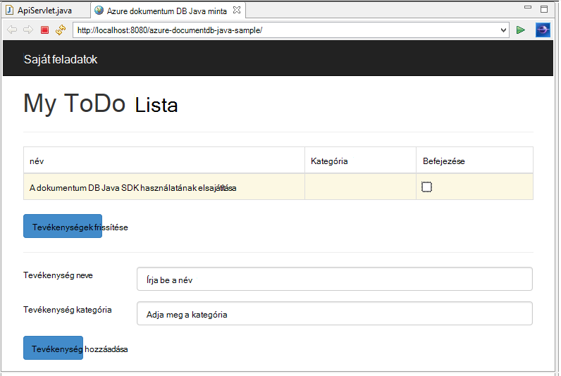
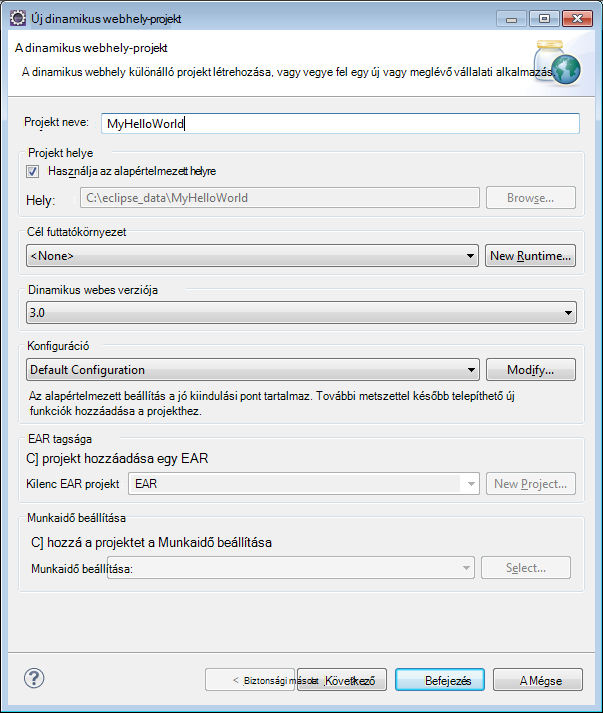
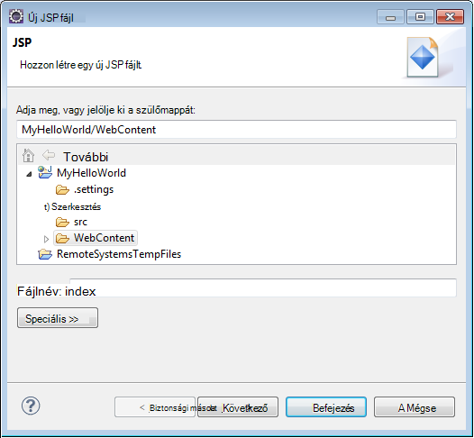
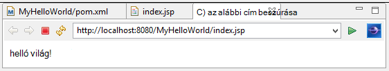
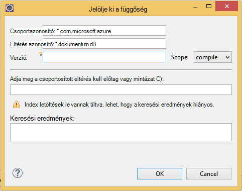

<properties
    pageTitle="Java alkalmazás fejlesztési oktatóprogram DocumentDB használatával |} Microsoft Azure"
    description="Java webes alkalmazás oktatóprogram megtudhatja, hogyan az Azure DocumentDB szolgáltatás használatának tárolására és Azure-webhelyeken tárolt Java-alkalmazásból az access-adatok."
    keywords="Alkalmazások fejlesztése, adatbázis oktatóprogram, java-alkalmazások, java webes alkalmazás oktatóprogram, documentdb, azure, a Microsoft azure"
    services="documentdb"
    documentationCenter="java"
    authors="dennyglee"
    manager="jhubbard"
    editor="mimig"/>

<tags
    ms.service="documentdb"
    ms.devlang="java"
    ms.topic="hero-article"
    ms.tgt_pltfrm="NA"
    ms.workload="data-services"
    ms.date="08/24/2016"
    ms.author="denlee"/>

# Java webalkalmazás használatával DocumentDB összeállítása

> [AZURE.SELECTOR]
- [.NET](documentdb-dotnet-application.md)
- [NODE.js](documentdb-nodejs-application.md)
- [Java](documentdb-java-application.md)
- [Python](documentdb-python-application.md)

Java webes alkalmazás oktatóprogram megtudhatja, hogyan lehet a [Microsoft Azure DocumentDB](https://portal.azure.com/#gallery/Microsoft.DocumentDB) szolgáltatás használatának tárolására és Azure-webhelyeken tárolt Java-alkalmazásból az access-adatok. Ebben a témakörben megismerheti:

- Egy egyszerű JSP-alkalmazás Holdas létrehozásának módját.
- Hogyan lehet a [DocumentDB Java SDK](https://github.com/Azure/azure-documentdb-java)Azure DocumentDB szolgáltatás használata.

Java-alkalmazás oktatóprogram megtudhatja, hogyan hozhat létre egy webes tevékenységkezeléshez alkalmazás, amely lehetővé teszi, hogy létrehozása, beolvasásához és tevékenységek megjelölése készként, az alábbi képen látható. A teendőlista feladatai mindegyike az Azure DocumentDB JSON-dokumentumként tárolja.

> [AZURE.TIP] Az alkalmazás fejlesztési oktatóanyag feltételezi, hogy rendelkezik-e előzetes élmény Java használatával. Ha új Java vagy [kapcsolatban előzetesen szükséges eszközök](#Prerequisites), az azt javasoljuk, a teljes [Teendők](https://github.com/Azure-Samples/documentdb-java-todo-app) projekt letöltésével GitHub, és [Ez a cikk végén](#GetProject)útmutatást követve összeállítása. Ha befejezte, a beépített, áttekintheti a kódot a projekt környezetében ismereteket szerezhet a cikk.  

##Java webes alkalmazás oktatóprogram előfeltételei
Az alkalmazás fejlesztési oktatóanyag megkezdése előtt a következőket kell rendelkeznie:

- Azure active fiók. Nem rendelkeznek fiókkal, ha mindössze néhány perc is létrehozhat ingyenes próba-fiók. A részletekért lásd: [Azure ingyenes próbaverziót](https://azure.microsoft.com/pricing/free-trial/).
- [Java Development Kit (JDK) 7 +](http://www.oracle.com/technetwork/java/javase/downloads/index.html).
- [Holdas IDE Java EE fejlesztők számára.](http://www.eclipse.org/downloads/packages/eclipse-ide-java-ee-developers/lunasr1)
- [Java futtatókörnyezet-környezettel rendelkező (pl. Tomcat vagy rakodóhely) engedélyezett Azure webhelyet.](../app-service-web/web-sites-java-get-started.md)

Ha első alkalommal telepíti ezeket az eszközöket, a coreservlets.com egy segédlet az első lépések szakaszában a telepítési folyamatot biztosít a [oktatóprogram: TomCat7 telepítése és használata a Holdas](http://www.coreservlets.com/Apache-Tomcat-Tutorial/tomcat-7-with-eclipse.html) cikk.

##Lépés: 1: DocumentDB adatbázis-fiók létrehozása

Első lépésként DocumentDB fiók létrehozása. Ha már rendelkezik fiókkal, akkor hagyja ki [2 lépés: az Java JSP-alkalmazás létrehozása](#CreateJSP).

[AZURE.INCLUDE [documentdb-create-dbaccount](../../includes/documentdb-create-dbaccount.md)]

[AZURE.INCLUDE [documentdb-keys](../../includes/documentdb-keys.md)]

##Lépés: 2: Az Java JSP-alkalmazás létrehozása

A JSP-alkalmazás létrehozása:

1. Először lássuk először Java projekt létrehozásával. Holdas, indítsa el, majd kattintson a **fájl**, kattintson az **Új**gombra, és válassza a **Dinamikus a Project Web**. Ha nem látható a **Dinamikus webes projekt** szerepel a listában elérhető projektként, tegye a következőket: kattintson a **fájl**kattintson az **Új**gombra, kattintson **a Project**..., bontsa ki a **webes**, kattintson a **Dinamikus webhely projekt**, és kattintson a **Tovább**gombra.

    

2. A **Projekt neve** mezőbe, és a **Cél futtatókörnyezet** legördülő menüjében írja be a projektnév, tetszés szerint adjon meg egy értéket (például Apache Tomcat 7.0), és kattintson a **Befejezés gombra**. Jelölje ki a cél futtatókörnyezet lehetővé teszi a helyben futtathatja a projekt Holdas.
3. Bontsa ki a projekt Holdas, a Project Explorer nézetben. Kattintson a jobb gombbal a **Web tartalma**, kattintson az **Új**gombra, és válassza a **Fájl JSP**.
4. **Új JSP fájlt** párbeszédpanelen nevezze el a fájlt **index.jsp**. A szülő mappából megtartandó **Web tartalma**, az alábbi ábrán látható módon, és kattintson a **Tovább gombra**.

    

5. **JSP sablon kiválasztása** párbeszédpanelen céljából ebben az oktatóanyagban jelölje be az **Új JSP fájl (html)**, és kattintson a **Befejezés gombra**.

6. A index.jsp fájl megnyitásakor a Holdas hozzáadása a megjelenítendő szöveg **Helló, világ!** a meglévő belül <body> elemet. A frissített <body> tartalmakat például a következő kódot kell kinéznie:

        <body>
            <% out.println("Hello World!"); %>
        </body>

8. Mentse a index.jsp fájlt.
9. Ha lépés: 2 állítja be a cél futtatókörnyezet, rákattintva **Projekt** , majd **futtassa** a JSP alkalmazás helyileg futtatásához:

    

##3 lépés: A DocumentDB Java SDK telepítése ##

A lekérje a DocumentDB Java SDK és függőségét a legegyszerűbben [Apache maven tesztelése](http://maven.apache.org/)keresztül.

Ehhez szüksége lesz a projekt átalakítása maven tesztelése projekt az alábbi lépéseket követve:

1. Kattintson a jobb gombbal a projektet a Project Explorer, kattintson a **Konfigurálás**gombra, kattintson a **Projekt maven tesztelése konvertálás**parancsra.
2. Az **Új POM létrehozása** ablakban fogadja el az alapértelmezett beállításokat, és kattintson a **Befejezés gombra**.
3. A **Project Explorer**a pom.xml fájlra.
4. A **függőségeket** lapon a **függőségek** ablakban kattintson a **Hozzáadás**gombra.
4. A **Függőséget kiválasztása** ablakban tegye a következőket:
 - A **Csoportazonosító** mezőbe írja be a com.microsoft.azure.
 - Az **Eltérés azonosító** mezőbe írja be az azure-documentdb.
 - A **verzió** mezőben adja meg a 1.5.1.

    

    Vagy vegye fel a függőséget XML csoportazonosító és ArtifactId közvetlenül a pom.xml szövegszerkesztőben keresztül:

        <dependency>
            <groupId>com.microsoft.azure</groupId>
            <artifactId>azure-documentdb</artifactId>
            <version>1.5.1</version>
        </dependency>

5. Kattintson az **OK gombra** , és maven tesztelése telepíti a DocumentDB Java SDK csomagjában talál.
6. Mentse a pom.xml fájlt.

##Lépés: 4: A DocumentDB szolgáltatását használja Java-alkalmazások

1. Először nézzük meghatározása a TodoItem objektum:

        @Data
        @Builder
        public class TodoItem {
            private String category;
            private boolean complete;
            private String id;
            private String name;
        }

    Az ehhez a projekthez azt [Projekt Lombok](http://projectlombok.org/) létrehozásához használt konstruktorának, Getterek, alkotóival és a Makrószerkesztő elemet. Azt is megteheti kézzel írja be a kódot, vagy az azt készítése IDE van.

2. A DocumentDB szolgáltatás meghívni, létre kell hozni egy új **DocumentClient**. Az általános célszerű **DocumentClient** - újrafelhasználása minden későbbi kérelme új ügyfél létrehozása helyett. Az ügyfél által az ügyfél tördelése egy **DocumentClientFactory**felhasználhatja azt. Ez akkor is, ahol szükséges illessze be a vágólapra az [1](#CreateDB)mentett URI és az elsődleges kulcs értékét. Cseréje [a\_VÉGPONT\_itt] URI és csere [a\_kulcs\_itt], az elsődleges kulcs.

        private static final String HOST = "[YOUR_ENDPOINT_HERE]";
        private static final String MASTER_KEY = "[YOUR_KEY_HERE]";

        private static DocumentClient documentClient;

        public static DocumentClient getDocumentClient() {
            if (documentClient == null) {
                documentClient = new DocumentClient(HOST, MASTER_KEY,
                        ConnectionPolicy.GetDefault(), ConsistencyLevel.Session);
            }

            return documentClient;
        }

3. Most egy Data Access objektum (DAO) absztrakt pályától tartós DocumentDB a teendők elemek létrehozása.

    Annak érdekében, hogy egy webhelycsoport teendők elemek menteni, az ügyfél kell tudnia, hogy melyik adatbázis és továbbra is fennáll, hogy a webhelycsoport (által hivatkozott önálló hivatkozások). Általánosságban elmondható célszerű az adatbázist, és a webhelycsoport, amikor csak lehetséges további állapotát az adatbázishoz a körbejárásokhoz elkerülése érdekében a gyorsítótárban.

    A következő kódrészlet szemlélteti, hogyan beolvasni a adatbázis és a webhelycsoportban, ha létezik, vagy hozzon létre egy újat, ha még nem létezik:

        public class DocDbDao implements TodoDao {
            // The name of our database.
            private static final String DATABASE_ID = "TodoDB";

            // The name of our collection.
            private static final String COLLECTION_ID = "TodoCollection";

            // The DocumentDB Client
            private static DocumentClient documentClient = DocumentClientFactory
                    .getDocumentClient();

            // Cache for the database object, so we don't have to query for it to
            // retrieve self links.
            private static Database databaseCache;

            // Cache for the collection object, so we don't have to query for it to
            // retrieve self links.
            private static DocumentCollection collectionCache;

            private Database getTodoDatabase() {
                if (databaseCache == null) {
                    // Get the database if it exists
                    List<Database> databaseList = documentClient
                            .queryDatabases(
                                    "SELECT * FROM root r WHERE r.id='" + DATABASE_ID
                                            + "'", null).getQueryIterable().toList();

                    if (databaseList.size() > 0) {
                        // Cache the database object so we won't have to query for it
                        // later to retrieve the selfLink.
                        databaseCache = databaseList.get(0);
                    } else {
                        // Create the database if it doesn't exist.
                        try {
                            Database databaseDefinition = new Database();
                            databaseDefinition.setId(DATABASE_ID);

                            databaseCache = documentClient.createDatabase(
                                    databaseDefinition, null).getResource();
                        } catch (DocumentClientException e) {
                            // TODO: Something has gone terribly wrong - the app wasn't
                            // able to query or create the collection.
                            // Verify your connection, endpoint, and key.
                            e.printStackTrace();
                        }
                    }
                }

                return databaseCache;
            }

            private DocumentCollection getTodoCollection() {
                if (collectionCache == null) {
                    // Get the collection if it exists.
                    List<DocumentCollection> collectionList = documentClient
                            .queryCollections(
                                    getTodoDatabase().getSelfLink(),
                                    "SELECT * FROM root r WHERE r.id='" + COLLECTION_ID
                                            + "'", null).getQueryIterable().toList();

                    if (collectionList.size() > 0) {
                        // Cache the collection object so we won't have to query for it
                        // later to retrieve the selfLink.
                        collectionCache = collectionList.get(0);
                    } else {
                        // Create the collection if it doesn't exist.
                        try {
                            DocumentCollection collectionDefinition = new DocumentCollection();
                            collectionDefinition.setId(COLLECTION_ID);

                            collectionCache = documentClient.createCollection(
                                    getTodoDatabase().getSelfLink(),
                                    collectionDefinition, null).getResource();
                        } catch (DocumentClientException e) {
                            // TODO: Something has gone terribly wrong - the app wasn't
                            // able to query or create the collection.
                            // Verify your connection, endpoint, and key.
                            e.printStackTrace();
                        }
                    }
                }

                return collectionCache;
            }
        }

4. A következő lépésként a probléma továbbra is fennáll a TodoItems a gyűjteménybe az egyes kódírás. Ebben a példában fogjuk használni [Gson](https://code.google.com/p/google-gson/) szerializálni és vonja szerializálni TodoItem egyszerű régi Java objektumok (POJOs) JSON dokumentumokat. [Jackson](http://jackson.codehaus.org/) vagy a saját egyéni szerializáló is remek alternatívák POJOs szerializálása.

        // We'll use Gson for POJO <=> JSON serialization for this example.
        private static Gson gson = new Gson();

        @Override
        public TodoItem createTodoItem(TodoItem todoItem) {
            // Serialize the TodoItem as a JSON Document.
            Document todoItemDocument = new Document(gson.toJson(todoItem));

            // Annotate the document as a TodoItem for retrieval (so that we can
            // store multiple entity types in the collection).
            todoItemDocument.set("entityType", "todoItem");

            try {
                // Persist the document using the DocumentClient.
                todoItemDocument = documentClient.createDocument(
                        getTodoCollection().getSelfLink(), todoItemDocument, null,
                        false).getResource();
            } catch (DocumentClientException e) {
                e.printStackTrace();
                return null;
            }

            return gson.fromJson(todoItemDocument.toString(), TodoItem.class);
        }

5. DocumentDB adatbázisok és webhelycsoportok, például dokumentumok is hivatkozott által önálló hivatkozások. A következő segítő függvény lehetővé teszi, hogy us dokumentumok beolvashatja egy másik attribútum (például "azonosító"), és nem önálló hivatkozás:

        private Document getDocumentById(String id) {
            // Retrieve the document using the DocumentClient.
            List<Document> documentList = documentClient
                    .queryDocuments(getTodoCollection().getSelfLink(),
                            "SELECT * FROM root r WHERE r.id='" + id + "'", null)
                    .getQueryIterable().toList();

            if (documentList.size() > 0) {
                return documentList.get(0);
            } else {
                return null;
            }
        }

6. Azt használható a segítő módszer az 5 beolvasásához TodoItem JSON dokumentumok azonosító alapján, és ezután deszerializálni azt a egy POJO:

        @Override
        public TodoItem readTodoItem(String id) {
            // Retrieve the document by id using our helper method.
            Document todoItemDocument = getDocumentById(id);

            if (todoItemDocument != null) {
                // De-serialize the document in to a TodoItem.
                return gson.fromJson(todoItemDocument.toString(), TodoItem.class);
            } else {
                return null;
            }
        }

7. A DocumentClient azt is használható, ha a webhelycsoport vagy a DocumentDB SQL használatával TodoItems listája:

        @Override
        public List<TodoItem> readTodoItems() {
            List<TodoItem> todoItems = new ArrayList<TodoItem>();

            // Retrieve the TodoItem documents
            List<Document> documentList = documentClient
                    .queryDocuments(getTodoCollection().getSelfLink(),
                            "SELECT * FROM root r WHERE r.entityType = 'todoItem'",
                            null).getQueryIterable().toList();

            // De-serialize the documents in to TodoItems.
            for (Document todoItemDocument : documentList) {
                todoItems.add(gson.fromJson(todoItemDocument.toString(),
                        TodoItem.class));
            }

            return todoItems;
        }

8. Számos módon dokumentum frissítse a DocumentClient. A lista teendők alkalmazást szeretnénk engedélyezni szeretné, állítsa be, hogy egy TodoItem befejeződött. Ez a dokumentumon belül az "elvégzettként" attribútum frissítésével érhető el:

        @Override
        public TodoItem updateTodoItem(String id, boolean isComplete) {
            // Retrieve the document from the database
            Document todoItemDocument = getDocumentById(id);

            // You can update the document as a JSON document directly.
            // For more complex operations - you could de-serialize the document in
            // to a POJO, update the POJO, and then re-serialize the POJO back in to
            // a document.
            todoItemDocument.set("complete", isComplete);

            try {
                // Persist/replace the updated document.
                todoItemDocument = documentClient.replaceDocument(todoItemDocument,
                        null).getResource();
            } catch (DocumentClientException e) {
                e.printStackTrace();
                return null;
            }

            return gson.fromJson(todoItemDocument.toString(), TodoItem.class);
        }

9. Végezetül azt szeretné, az azt jelenti, hogy egy TodoItem törlése a listából. Ehhez a azt korábbi írt önálló hivatkozás olvashat be és megállapítani, hogy a törli az ügyfél segítő módszer használható azt:

        @Override
        public boolean deleteTodoItem(String id) {
            // DocumentDB refers to documents by self link rather than id.

            // Query for the document to retrieve the self link.
            Document todoItemDocument = getDocumentById(id);

            try {
                // Delete the document by self link.
                documentClient.deleteDocument(todoItemDocument.getSelfLink(), null);
            } catch (DocumentClientException e) {
                e.printStackTrace();
                return false;
            }

            return true;
        }

##5 lépés: A többi huzalozási a Java alkalmazás fejlesztési projekt csoportosítása

Most, hogy végzett az bittel - összes, amely balra össze egy rövid felhasználói felületet, valamint vezetékes azt a DAO felfelé a megvalósítás.

1. Első lépésként kezdjük hívja fel a DAO egy vezérlő létrehozása:

        public class TodoItemController {
            public static TodoItemController getInstance() {
                if (todoItemController == null) {
                    todoItemController = new TodoItemController(TodoDaoFactory.getDao());
                }
                return todoItemController;
            }

            private static TodoItemController todoItemController;

            private final TodoDao todoDao;

            TodoItemController(TodoDao todoDao) {
                this.todoDao = todoDao;
            }

            public TodoItem createTodoItem(@NonNull String name,
                    @NonNull String category, boolean isComplete) {
                TodoItem todoItem = TodoItem.builder().name(name).category(category)
                        .complete(isComplete).build();
                return todoDao.createTodoItem(todoItem);
            }

            public boolean deleteTodoItem(@NonNull String id) {
                return todoDao.deleteTodoItem(id);
            }

            public TodoItem getTodoItemById(@NonNull String id) {
                return todoDao.readTodoItem(id);
            }

            public List<TodoItem> getTodoItems() {
                return todoDao.readTodoItems();
            }

            public TodoItem updateTodoItem(@NonNull String id, boolean isComplete) {
                return todoDao.updateTodoItem(id, isComplete);
            }
        }

    A vezérlő összetettebb alkalmazást, előfordulhat, hogy használna elrendezésére a bonyolult logikájának DAO fölött.

2. Ezután a HTTP-kérelmek a vezérlő servlet létrehoznia azt:

        public class TodoServlet extends HttpServlet {
            // API Keys
            public static final String API_METHOD = "method";

            // API Methods
            public static final String CREATE_TODO_ITEM = "createTodoItem";
            public static final String GET_TODO_ITEMS = "getTodoItems";
            public static final String UPDATE_TODO_ITEM = "updateTodoItem";

            // API Parameters
            public static final String TODO_ITEM_ID = "todoItemId";
            public static final String TODO_ITEM_NAME = "todoItemName";
            public static final String TODO_ITEM_CATEGORY = "todoItemCategory";
            public static final String TODO_ITEM_COMPLETE = "todoItemComplete";

            public static final String MESSAGE_ERROR_INVALID_METHOD = "{'error': 'Invalid method'}";

            private static final long serialVersionUID = 1L;
            private static final Gson gson = new Gson();

            @Override
            protected void doGet(HttpServletRequest request,
                    HttpServletResponse response) throws ServletException, IOException {

                String apiResponse = MESSAGE_ERROR_INVALID_METHOD;

                TodoItemController todoItemController = TodoItemController
                        .getInstance();

                String id = request.getParameter(TODO_ITEM_ID);
                String name = request.getParameter(TODO_ITEM_NAME);
                String category = request.getParameter(TODO_ITEM_CATEGORY);
                boolean isComplete = StringUtils.equalsIgnoreCase("true",
                        request.getParameter(TODO_ITEM_COMPLETE)) ? true : false;

                switch (request.getParameter(API_METHOD)) {
                case CREATE_TODO_ITEM:
                    apiResponse = gson.toJson(todoItemController.createTodoItem(name,
                            category, isComplete));
                    break;
                case GET_TODO_ITEMS:
                    apiResponse = gson.toJson(todoItemController.getTodoItems());
                    break;
                case UPDATE_TODO_ITEM:
                    apiResponse = gson.toJson(todoItemController.updateTodoItem(id,
                            isComplete));
                    break;
                default:
                    break;
                }

                response.getWriter().println(apiResponse);
            }

            @Override
            protected void doPost(HttpServletRequest request,
                    HttpServletResponse response) throws ServletException, IOException {
                doGet(request, response);
            }
        }

3. Elvégezheti a webhely felhasználói felület jelenít meg a felhasználó kell rendelkeznie. Vegyük újból írni a index.jsp régebbi verzióiban létrehozott:

        <html>
        <head>
          <meta http-equiv="Content-Type" content="text/html; charset=ISO-8859-1">
          <meta http-equiv="X-UA-Compatible" content="IE=edge;" />
          <title>Azure DocumentDB Java Sample</title>

          <!-- Bootstrap -->
          <link href="//ajax.aspnetcdn.com/ajax/bootstrap/3.2.0/css/bootstrap.min.css" rel="stylesheet">

          
        </head>
        <body>
          <!-- Nav Bar -->
          

            

              

                <a class="navbar-brand" href="#">My Tasks</a>
              

            

          

          <!-- Body -->
          

            <h1>My ToDo List</h1>

            

            <!-- The ToDo List -->
            

              <table class="table table-bordered table-striped" id="todoItems">
                <thead>
                  <tr>
                    <th>Name</th>
                    <th>Category</th>
                    <th>Complete</th>
                  </tr>
                </thead>
                <tbody>
                </tbody>
              </table>

              <!-- Update Button -->
              

                <form class="form-horizontal" role="form">
                  <button type="button" class="btn btn-primary">Update Tasks</button>
                </form>
              

            

            

            <!-- Item Input Form -->
            

              <form class="form-horizontal" role="form">
                

                  <label for="inputItemName" class="col-sm-2">Task Name</label>
                  

                    <input type="text" class="form-control" id="inputItemName" placeholder="Enter name">
                  

                

                

                  <label for="inputItemCategory" class="col-sm-2">Task Category</label>
                  

                    <input type="text" class="form-control" id="inputItemCategory" placeholder="Enter category">
                  

                

                <button type="button" class="btn btn-primary">Add Task</button>
              </form>
            

          

          <!-- Placed at the end of the document so the pages load faster -->
          
          
          
        </body>
        </html>

4. És végül írjon néhány ügyféloldali Javascript a webhely felhasználói felület és a servlet kötik össze:

        var todoApp = {
          /*
           * API methods to call Java backend.
           */
          apiEndpoint: "api",

          createTodoItem: function(name, category, isComplete) {
            $.post(todoApp.apiEndpoint, {
                "method": "createTodoItem",
                "todoItemName": name,
                "todoItemCategory": category,
                "todoItemComplete": isComplete
              },
              function(data) {
                var todoItem = data;
                todoApp.addTodoItemToTable(todoItem.id, todoItem.name, todoItem.category, todoItem.complete);
              },
              "json");
          },

          getTodoItems: function() {
            $.post(todoApp.apiEndpoint, {
                "method": "getTodoItems"
              },
              function(data) {
                var todoItemArr = data;
                $.each(todoItemArr, function(index, value) {
                  todoApp.addTodoItemToTable(value.id, value.name, value.category, value.complete);
                });
              },
              "json");
          },

          updateTodoItem: function(id, isComplete) {
            $.post(todoApp.apiEndpoint, {
                "method": "updateTodoItem",
                "todoItemId": id,
                "todoItemComplete": isComplete
              },
              function(data) {},
              "json");
          },

          /*
           * UI Methods
           */
          addTodoItemToTable: function(id, name, category, isComplete) {
            var rowColor = isComplete ? "active" : "warning";

            todoApp.ui_table().append($("<tr>")
              .append($("<td>").text(name))
              .append($("<td>").text(category))
              .append($("<td>")
                .append($("<input>")
                  .attr("type", "checkbox")
                  .attr("id", id)
                  .attr("checked", isComplete)
                  .attr("class", "isComplete")
                ))
              .addClass(rowColor)
            );
          },

          /*
           * UI Bindings
           */
          bindCreateButton: function() {
            todoApp.ui_createButton().click(function() {
              todoApp.createTodoItem(todoApp.ui_createNameInput().val(), todoApp.ui_createCategoryInput().val(), false);
              todoApp.ui_createNameInput().val("");
              todoApp.ui_createCategoryInput().val("");
            });
          },

          bindUpdateButton: function() {
            todoApp.ui_updateButton().click(function() {
              // Disable button temporarily.
              var myButton = $(this);
              var originalText = myButton.text();
              $(this).text("Updating...");
              $(this).prop("disabled", true);

              // Call api to update todo items.
              $.each(todoApp.ui_updateId(), function(index, value) {
                todoApp.updateTodoItem(value.name, value.value);
                $(value).remove();
              });

              // Re-enable button.
              setTimeout(function() {
                myButton.prop("disabled", false);
                myButton.text(originalText);
              }, 500);
            });
          },

          bindUpdateCheckboxes: function() {
            todoApp.ui_table().on("click", ".isComplete", function(event) {
              var checkboxElement = $(event.currentTarget);
              var rowElement = $(event.currentTarget).parents('tr');
              var id = checkboxElement.attr('id');
              var isComplete = checkboxElement.is(':checked');

              // Toggle table row color
              if (isComplete) {
                rowElement.addClass("active");
                rowElement.removeClass("warning");
              } else {
                rowElement.removeClass("active");
                rowElement.addClass("warning");
              }

              // Update hidden inputs for update panel.
              todoApp.ui_updateForm().children("input[name='" + id + "']").remove();

              todoApp.ui_updateForm().append($("<input>")
                .attr("type", "hidden")
                .attr("class", "updateComplete")
                .attr("name", id)
                .attr("value", isComplete));

            });
          },

          /*
           * UI Elements
           */
          ui_createNameInput: function() {
            return $(".todoForm #inputItemName");
          },

          ui_createCategoryInput: function() {
            return $(".todoForm #inputItemCategory");
          },

          ui_createButton: function() {
            return $(".todoForm button");
          },

          ui_table: function() {
            return $(".todoList table tbody");
          },

          ui_updateButton: function() {
            return $(".todoUpdatePanel button");
          },

          ui_updateForm: function() {
            return $(".todoUpdatePanel form");
          },

          ui_updateId: function() {
            return $(".todoUpdatePanel .updateComplete");
          },

          /*
           * Install the TodoApp
           */
          install: function() {
            todoApp.bindCreateButton();
            todoApp.bindUpdateButton();
            todoApp.bindUpdateCheckboxes();

            todoApp.getTodoItems();
          }
        };

        $(document).ready(function() {
          todoApp.install();
        });

5. Nagyszerű! Most, hogy marad az összes, hogy az alkalmazás tesztelése. Helyi meghajtóra futtassa az alkalmazást, és néhány teendők elem hozzáadása a tétel neve és a kategória kitöltésével, és kattintson a **Feladat hozzáadása**.

6. Az elem jelenik meg, miután frissítheti a választás a jelölőnégyzetet, és kattintson a **Tevékenységek frissítése**teljes kerül.

##Lépés a 6: Az Azure-webhelyekre Java-alkalmazások terjesztése

Azure webhelyek teszi csupán az alkalmazás exportálása HÁBORÚ fájlként és vagy feltöltése az adatforrás-vezérlő (pl. mely Számjegy) keresztül Java-alkalmazások telepítése vagy FTP.

1. Szeretné exportálni az alkalmazás egy HÁBORÚ, kattintson a jobb gombbal a projekt, a **Project Explorer**, kattintson az **Exportálás**gombra, és válassza a **Fájl HÁBORÚ**.
2. A **Háborús exportálása** ablakban tegye a következőket:
 - A webhelyen a project mezőbe írja be azure-documentdb-java-minta.
 - A Címzett mezőben válassza ki a helyet, a HÁBORÚ fájl mentéséhez.
 - Kattintson a **Befejezés gombra**.

3. Most, hogy az aktuális HÁBORÚ fájllal rendelkezik, egyszerűen feltöltheti a Azure webhely **webalkalmazás** Directoryban. A fájl feltöltése, tanulmányozza [az Azure Java webhelyéhez alkalmazások felvétele](../app-service-web/web-sites-java-add-app.md).

    A háborús fájlt töltenek fel a webalkalmazás könyvtárra, miután a futtatókörnyezet észleli, hogy korábban megadott, és automatikusan tölteni az.
4. A kész termék megtekintéséhez nyissa meg azt a http://YOUR\_webhely\_NAME.azurewebsites.net/azure-documentdb-java-sample/ és a tevékenységek felvétele kezdő!

##A projekt beolvasása GitHub

Ebben az oktatóanyagban összes minta GitHub [teendő](https://github.com/Azure-Samples/documentdb-java-todo-app) projekt szerepelnek. A teendő projekt importálása Holdas, hogy biztosan, hogy a szoftver- és a [vonatkozó követelmények](#Prerequisites) szakaszban erőforrások, majd tegye a következőket:

1. Telepítse a [Projekt Lombok](http://projectlombok.org/). Lombok konstruktorok, Getterek, alkotóival készítése a projekthez szolgál. Miután letöltötte a lombok.jar fájlt, kattintson duplán a telepítéshez, vagy a parancssorból telepítheti.
2. Ha Holdas meg nyitva, zárja be, és indítsa újra a Lombok betöltése.
3. Holdas, a **fájl** menüben kattintson az **Importálás**gombra.
4. Az **importálási** ablakban kattintson a **mely számjegy**, kattintson a **Projekt mely számjegy a**, és kattintson a **Tovább gombra**.
5. Kattintson a **Tárházba forrás válassza a** képernyő **Adatfeliratsor URI**.
6. A **Forrás mely számjegy tárházba** képernyőn **URI** mezőbe írja be a https://github.com/Azure-Samples/documentdb-java-todo-app.git, és kattintson a **Tovább gombra**.
7. A **Kijelölés ág** képernyőn győződjön meg arról, hogy **fő** választógombot, és kattintson a **Tovább gombra**.
8. Kattintson a **Helyi cél** képernyő **tallózással keresse meg** azt a mappát, ahol a tárházba is másolhatja, és kattintson a **Tovább gombra**.
9. **Jelölje ki a használandó projekt importálása varázsló** képernyőn győződjön meg arról, hogy **importálja a meglévő projektek** választógombot, és kattintson a **Tovább gombra**.
10. A **Projektek importálása** képernyőn kijelölésének megszüntetése a **DocumentDB** projekt, és kattintson a **Befejezés gombra**. A projektben DocumentDB hozzáadunk függőség, hanem DocumentDB Java SDK.
11. A **Project Explorer**azure-documentdb-java-sample\src\com.microsoft.azure.documentdb.sample.dao\DocumentClientFactory.java nyissa meg a HOST és MASTER_KEY értékek cseréje a URI-és DocumentDB fiókjának elsődleges kulcs és mentse a fájlt. További tudnivalókért olvassa el a [lépés 1 című témakört. Hozzon létre egy DocumentDB adatbázis fiókot](#CreateDB).
12. A **Project Explorer**kattintson a jobb gombbal az **azure-documentdb-java-minta**, **Összeállítása elérési útját**, gombmenü **Összeállítása elérési konfigurálása**.
13. A **Java összeállítása elérési** képernyőn a jobb oldali ablaktáblán jelölje be a **tárak** fülre, és kattintson a **Külső JARs hozzáadása**gombra. Nyissa meg azt a lombok.jar-fájl helyét, és kattintson a **Megnyitás**gombra, és kattintson **az OK**gombra.
14. Nyissa meg újra a **Tulajdonságok** ablak a lépésben 12 használatával, és kattintson a bal oldali ablaktáblában kattintson a **Célzott szükséges**.
15. A **Célzott szükséges** képernyőn kattintson az **Új**gombra, jelölje ki a **Apache Tomcat 7.0**, és kattintson **az OK**gombra.
16. Nyissa meg újra a **Tulajdonságok** ablak lépésben 12 használja, és kattintson a bal oldali ablaktáblában kattintson a **Projekt metszettel**.
17. A **Projekt metszettel** képernyőn jelölje be a **Dinamikus webhely modulban** és **Java**, és kattintson **az OK**gombra.
18. Képernyőjének **kiszolgálók** lapján, a képernyő alján kattintson a jobb gombbal a **Tomcat 7.0 localhost kiszolgálón** , és kattintson a **Hozzáadás és eltávolítás**gombra.
19. Kattintson a **Hozzáadás és eltávolítás** ablakban **azure-documentdb-java-minta** Ugrás a **beállított** mezőre, és kattintson a **Befejezés gombra**.
20. **Kiszolgálója** lapján kattintson a jobb gombbal a **Tomcat 7.0 localhost kiszolgálón**, és kattintson az **Újraindítás**gombra.
21. A böngészőben nyissa meg 8080/azure-documentdb-java-minta / és a feladatlista helyezzen el. Megjegyzés: Ha megváltoztatta a alapértékek port változó 8080 megadott értéket.
22. A projekt-Azure webhely telepítéséhez olvassa el a [lépés 6. Az Azure webhelyek alkalmazás telepítéséhez](#Deploy).

[1]: media/documentdb-java-application/keys.png
