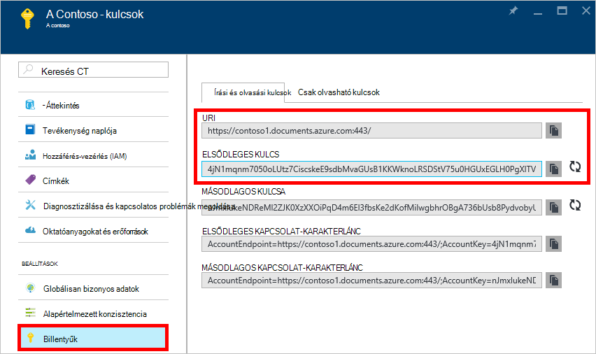
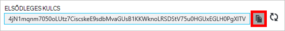
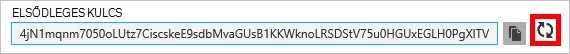
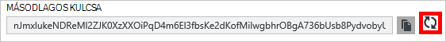
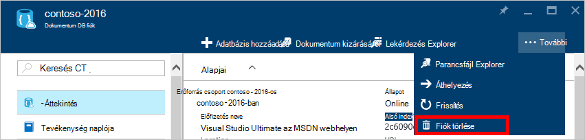
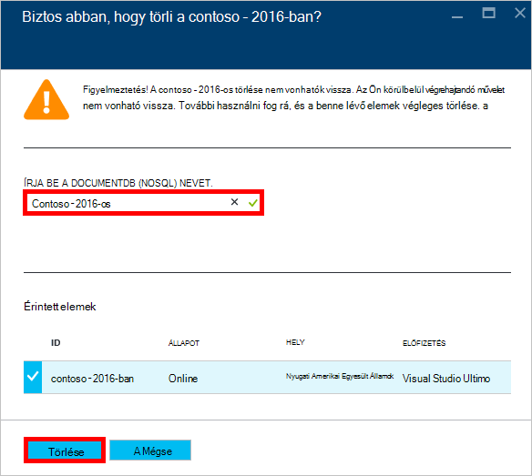

<properties
    pageTitle="Az Azure-portálon keresztül egy DocumentDB fiók kezelése |} Microsoft Azure"
    description="Megtudhatja, hogy miként kezelheti a DocumentDB fiókját az Azure-portálon keresztül. Keresse meg az Azure portál használatával megtekintheti, másolja a vágólapra, törlése és fiókok elérése útmutató."
    keywords="Azure documentdb, az azure, a Microsoft azure portálon"
    services="documentdb"
    documentationCenter=""
    authors="kirillg"
    manager="jhubbard"
    editor="cgronlun"/>

<tags
    ms.service="documentdb"
    ms.workload="data-services"
    ms.tgt_pltfrm="na"
    ms.devlang="na"
    ms.topic="article"
    ms.date="10/14/2016"
    ms.author="kirillg"/>

# Egy DocumentDB fiók kezelése

Megtudhatja, hogy miként globális konzisztencia beállítása, billentyűk használata és az Azure-portálon DocumentDB fiók törlése.

## DocumentDB konzisztencia beállításainak kezelése

Jelölje ki a megfelelő konzisztencia szint attól függ, hogy az alkalmazás szemantikáját. Meg kell megismerkedhet a rendelkezésre álló konzisztencia szinteket DocumentDB [használata konzisztencia szintek maximális elérhetőség és a teljesítmény DocumentDB]olvasásával [consistency]. DocumentDB konzisztencia, elérhetőségét és teljesítménybeli garanciákkal minden konzisztencia elérhető az adatbázis-fiók szinten biztosít. Az adatbázis-fiók konfigurálása erős konzisztencia szintű szükséges, hogy az adatok egyetlen Azure területére zárt és globálisan nem érhető el. A többi készlet, a mérsékelten konzisztencia szintek - körülhatárolható staleness, a munkamenet és az esetleges engedélyezése, tetszőleges számú Azure régiók társíthatja az adatbázis-fiókot. A következő egyszerű lépéseket követnie jelölje ki az alapértelmezett konzisztencia szint az adatbázis-fiók. 

### Az alapértelmezett konzisztencia DocumentDB fiókot megadása

1. Az [Azure portált](https://portal.azure.com/)a DocumentDB fiók elérésére.
2. Kattintson a fiók lap **alapértelmezett konzisztencia**.
3. Az **Alapértelmezett konzisztencia** lap jelölje be az új konzisztencia szint, és kattintson a **Mentés**gombra.
    ![Alapértelmezett konzisztencia munkamenethez][5]

## Nézet, a másolás és a újragenerálása hívóbetűk
Amikor létrehoz egy DocumentDB fiókot, a szolgáltatás a két fő hívóbetűk a DocumentDB fiók megnyitásakor hitelesítéshez használt hoz létre. Két hívóbetűk megadásával DocumentDB lehetővé teszi, hogy a újragenerálása a billentyűket a megszakítás nélkül DocumentDB fiókjára. 

Az [Azure portál](https://portal.azure.com/)elérése a **billentyűk** lap a **DocumentDB fiók** lap megtekintése, másolja a vágólapra, és a hívóbetűk a DocumentDB fiók eléréséhez használt újragenerálása erőforrás menüjében.

> [AZURE.NOTE] A **billentyűk** lap is tartalmaz az elsődleges és másodlagos kapcsolat karakterláncot szeretne csatlakozni a fiókjához a [Adatainak áttelepítési eszköz](documentdb-import-data.md)használható.

Csak olvasható billentyűk Ez a lap is elérhetők. Olvasás és a lekérdezések csak olvasható műveletek közben hoz létre, törlése, és nincsenek cseréli.

### Hívóbetű másolása az Azure-portálon

Kattintson a **billentyűk** lap jobb oldalán a másolni kívánt billentyűt a **Másolás** gombra.

### Hívóbetűk újragenerálása

Módosítania kell a hívóbetűk, az DocumentDB fiókjába rendszeres biztonságosabbá a kapcsolatokat. Két hívóbetűk lehetővé teszi a DocumentDB fiókra egy access-billentyűt, miközben a többi hívóbetű követező létrehozásakor kapcsolatok kezelése van rendelve.

> [AZURE.WARNING] Bezárhatja a hívóbetűk hatással van az aktuális kulcs függő alkalmazásokat. A hívóbetű a DocumentDB fiók eléréséhez használt összes ügyfelek kell frissíteni az új termékkulccsal.

Ha alkalmazások vagy felhőszolgáltatások DocumentDB-fiókkal rendelkezik, el fog veszni a kapcsolatok, újragenerálása kulcsok, ha csak a billentyűk forgassa. Az alábbi lépésekkel tagolása a folyamatot, a billentyűk közbeni részt.

1. Frissítse a hívóbetű az alkalmazás kód, a másodlagos hívóbetű DocumentDB fiók hivatkozni szeretne.
2. Az elsődleges hívóbetű DocumentDB fiókjának újragenerálása. Az [Azure-portált](https://portal.azure.com/)a DocumentDB fiók elérésére.
3. Kattintson a **Fiók DocumentDB** lap **kulcsok**gombra.
4. A **billentyűk** lap a újragenerálása gombra, majd kattintson az **OK gombra** kattintva erősítse meg, hogy szeretne-e előállítani új kulcsot.
    

5. Miután ellenőrizte, hogy az új kulcs használható (körülbelül 5 perccel később újbóli), frissítse a hívóbetű alkalmazás kódban az új access elsődleges kulcs hivatkozni szeretne.
6. A másodlagos hívóbetű újragenerálása.

    

> [AZURE.NOTE] Eltarthat néhány percig, amíg egy újonnan létrehozott kulcsot a DocumentDB fiók elérésére használható.

## A kapcsolati karakterláncát

A kapcsolati karakterlánc beolvasásához, tegye a következőket: 

1. Az [Azure portált](https://portal.azure.com)a DocumentDB fiók elérésére.
2. Az erőforrás menüjében kattintson a **kulcsra**.
3. Az **Elsődleges kapcsolati karakterlánc** vagy **Másodlagos csatlakozási karakterlánc** mező melletti **Másolás** gombjára. 

A kapcsolati karakterlánc használatakor az [Adatbázis-áttelepítési eszköz DocumentDB](documentdb-import-data.md)hozzáfűzése a kapcsolati karakterlánc végén az adatbázis nevét. `AccountEndpoint=< >;AccountKey=< >;Database=< >`.

## DocumentDB fiók törlése
Az Azure portálról, amely már nem használja egy DocumentDB fiók eltávolításához használata a **Fiók törlése** parancs a **DocumentDB fiók** lap.

1. Az [Azure portál](https://portal.azure.com/)a törölni kívánt DocumentDB fiók elérésére.
2. A **fiók DocumentDB** lap kattintson a **Továbbiak**gombra, és kattintson a **Fiók törlése**gombra. Vagy kattintson a jobb gombbal az adatbázis nevét, és kattintson a **Fiók törlése**gombra.
3. Írja be a DocumentDB fiók nevére kattintva erősítse meg, hogy szeretné-e a fiók törlése a kapott visszaigazoló lap.
4. Kattintson a **Törlés** gombra.

## Következő lépések

Megtudhatja, hogyan [DocumentDB fiókjához](http://go.microsoft.com/fwlink/p/?LinkId=402364).

További tudnivalók a DocumentDB, az Azure DocumentDB dokumentációjában [azure.com](http://go.microsoft.com/fwlink/?LinkID=402319&clcid=0x409)a.

<!--Image references-->
[1]: ./media/documentdb-manage-account/documentdb_add_region-1.png
[2]: ./media/documentdb-manage-account/documentdb_add_region-2.png
[3]: ./media/documentdb-manage-account/documentdb_change_write_region-1.png
[4]: ./media/documentdb-manage-account/documentdb_change_write_region-2.png
[5]: ./media/documentdb-manage-account/documentdb_change_consistency-1.png
[6]: ./media/documentdb-manage-account/chooseandsaveconsistency.png

<!--Reference style links - using these makes the source content way more readable than using inline links-->
[bcdr]: https://azure.microsoft.com/documentation/articles/best-practices-availability-paired-regions/
[consistency]: https://azure.microsoft.com/documentation/articles/documentdb-consistency-levels/
[azureregions]: https://azure.microsoft.com/en-us/regions/#services
[offers]: https://azure.microsoft.com/en-us/pricing/details/documentdb/
