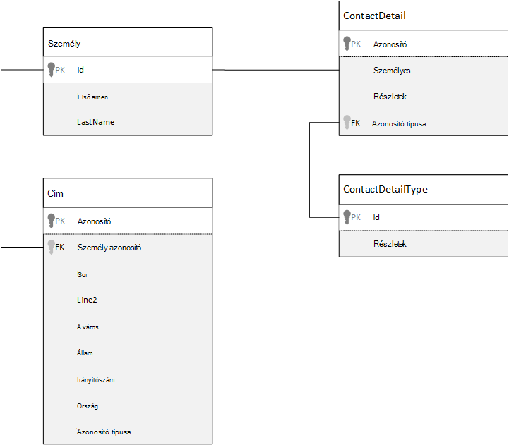
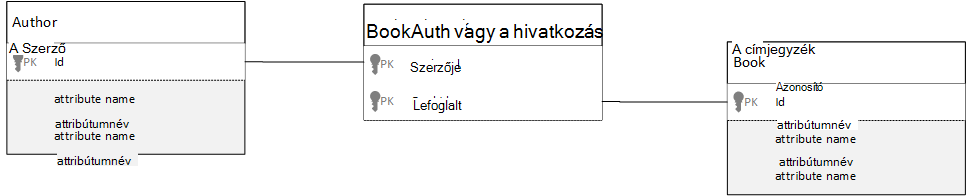

<properties 
    pageTitle="Adatok az Azure DocumentDB modellezése |} Microsoft Azure" 
    description="További tudnivalók: adatok modellezés a DocumentDB, NoSQL dokumentum adatbázis." 
    keywords="modellezési adatok"
    services="documentdb" 
    authors="kiratp" 
    manager="jhubbard" 
    editor="mimig1" 
    documentationCenter=""/>

<tags 
    ms.service="documentdb" 
    ms.workload="data-services" 
    ms.tgt_pltfrm="na" 
    ms.devlang="na" 
    ms.topic="article" 
    ms.date="08/05/2016" 
    ms.author="kipandya"/>

#Modellezési DocumentDB az adatok#
Miközben séma ingyenes adatbázisok, például Azure DocumentDB, így azok kiemelt egyszerűen kibővül az adatmodell módosításainak kell továbbra is töltött bizonyos idő "témájú kapcsolatos adatok. 

Hogyan fog tárolni adatok? Hogyan fog olvashat be és adatok lekérdezése az alkalmazás? Az alkalmazás, olvassa el a vastag vagy a írási nehéz? 

Ez a cikk elolvasása, után fogja tudni az alábbi kérdésekre választ:

- Hogyan kell figyelni a dokumentum adatbázis dokumentumokra vonatkozó?
- Mi az, hogy adatmodellezés, és miért célszerű lehet érdekli? 
- Miben különbözik a dokumentum-adatbázisban tárolt adatok modellezési relációs adatbázisok?
- Hogyan Express terméket az adatok kapcsolatok nem relációs adatbázisban?
- Amikor beágyazása adatokat, és ha csatol adatokat?

##Adatok beágyazása##
Egy dokumentum mentése, az adatok modellezési elindításakor például DocumentDB, próbálja meg a személyek tekinti **önálló dokumentumok** JSON ábrázolt.

Mielőtt azt kördiagramjaira túl jóval tovább tudassa velünk néhány lépést visszavétele, és hogyan akkor lehet, hogy modell valamit, amit egy relációs adatbázisban, az adott tárgyhoz tartozó us számos már jól ismert meg van. A következő példa bemutatja, hogyan személy lehetséges tárolási helyei egy relációs adatbázisban. 

A relációs adatbázisok használatakor azt korábban már tanulási normalizálása, normalizálása, normalizálása évig.

A normalizálás általában tényezői: véve egy egyed, például egy személy, és friss azt diszkrét csatolt fájllal. A fenti példában az a személy beállíthatja, hogy több részlet névjegy rekordot, valamint több címrekord. Azt is egy lépéssel további és kapcsolattartási adatai szerint lebontva további kiolvasó közös mezők, mint egy típust. Ugyanazt a címet, az egyes rekordok itt van egy típus, például *otthoni* vagy *üzleti* 

A irányadó helyi adatok normalizálása esetén **ne tároljon a felesleges adatok** egyes rekordok, és inkább hivatkozhat adatokra. Ebben a példában olvassa el a saját kapcsolattartási adatai és a címeket, egy személy szüksége ILLESZTÉSEK használatával hatékonyan futásidőben a az adatok összesítése.

    SELECT p.FirstName, p.LastName, a.City, cd.Detail
    FROM Person p
    JOIN ContactDetail cd ON cd.PersonId = p.Id
    JOIN ContactDetailType on cdt ON cdt.Id = cd.TypeId
    JOIN Address a ON a.PersonId = p.Id

Írási műveleteket egy személy frissítése a kapcsolattartási adatai és a címek szükséges egyes táblák között. 

Most már most tekintsünk át egy hogyan azt szeretné ugyanazokat az adatokat egy önálló egységek dokumentum adatbázisban modell.
        
    {
        "id": "1",
        "firstName": "Thomas",
        "lastName": "Andersen",
        "addresses": [
            {            
                "line1": "100 Some Street",
                "line2": "Unit 1",
                "city": "Seattle",
                "state": "WA",
                "zip": 98012
            }
        ],
        "contactDetails": [
            {"email: "thomas@andersen.com"},
            {"phone": "+1 555 555-5555", "extension": 5555}
        ] 
    }

Most **denormalizált** személy rögzítése hol van a fenti megközelítés alkalmazásával azt **beágyazott** a egyetlen JSON dokumentum ez személynek kapcsolattartási adatai és a cím, például kapcsolatos összes információt.
Ezenkívül mert azt esetén nem korlátozódik a rögzített séma van még a lehetősége, hogy teljesen problémákat kapcsolattartási adatai több különböző alakzatra, többek között. 

Teljes személy rekord beolvasása az adatbázisból mostantól egyetlen, olvassa el a művelet egyetlen gyűjtemény ellen, és egy dokumentumhoz. Egy személy rekord frissítése a kapcsolattartási adatai és a címeket, akkor is egyetlen írási művelet egyetlen dokumentum szemben.

Által denormalizing adatokat, az alkalmazás hiba kevesebb lekérdezések és frissítések gyakori műveletek elvégzéséhez szükséges. 

###Mikor érdemes beágyazása

Általánosságban elmondható, használja a beágyazott adatkapcsolat modellek, ha:

- Nincsenek kapcsolatok **tartalmaz** entitás között.
- Nincsenek kapcsolatok **egy néhány példa** entitás között.
- Nincs beágyazott adat, hogy **ritkán változó**.
- Nincs beágyazott adatok nem nagyobb **kötött nélkül**.
- **Az integrál téma** egy dokumentumban adatok beágyazott adatok nem.

> [AZURE.NOTE] Általában nem normalizált adatok modellek nyújt **További** jobb teljesítményt.

###Mikor nem célszerű beágyazása

Noha a szabályt a legjobb megoldás dokumentum adatbázisban denormalize mindent és beágyazása egy dokumentumot az összes adatot, ez vezethet bizonyos esetekben előfordulhat, hogy el kell kerülni.

A JSON kódtöredékének venni.

    {
        "id": "1",
        "name": "What's new in the coolest Cloud",
        "summary": "A blog post by someone real famous",
        "comments": [
            {"id": 1, "author": "anon", "comment": "something useful, I'm sure"},
            {"id": 2, "author": "bob", "comment": "wisdom from the interwebs"},
            …
            {"id": 100001, "author": "jane", "comment": "and on we go ..."},
            …
            {"id": 1000000001, "author": "angry", "comment": "blah angry blah angry"},
            …
            {"id": ∞ + 1, "author": "bored", "comment": "oh man, will this ever end?"},
        ]
    }

Ez akkor lehet, hogy milyen egy bejegyzésbe beágyazott megjegyzések egyed lenne azt modellezése voltak tipikus blog vagy CMS, a rendszer. Ez a példa problémája, hogy van-e a megjegyzések tömb **határolatlan**, ami azt jelenti, hogy nincs-e a megjegyzések beállíthatja, hogy minden olyan egyszeri bejegyzésbe száma (gyakorlati) korlátozva. Ez a probléma lesz, növekedésével a dokumentum méretéhez sikerült jelentősen.

> [AZURE.TIP] Dokumentumok DocumentDB van a maximális méretet. Erről bővebben [DocumentDB korlátozások](documentdb-limits.md)vonatkoznak.

A dokumentum mérete az azt jelenti, hogy az adatátvitel vezetékes, valamint olvasási és frissítése a dokumentumot, a méretarány növekedésével hatással lesz.

Ebben az esetben lenne jobb figyelembe az alábbi modell.
        
    Post document:
    {
        "id": "1",
        "name": "What's new in the coolest Cloud",
        "summary": "A blog post by someone real famous",
        "recentComments": [
            {"id": 1, "author": "anon", "comment": "something useful, I'm sure"},
            {"id": 2, "author": "bob", "comment": "wisdom from the interwebs"},
            {"id": 3, "author": "jane", "comment": "....."}
        ]
    }

    Comment documents:
    {
        "postId": "1"
        "comments": [
            {"id": 4, "author": "anon", "comment": "more goodness"},
            {"id": 5, "author": "bob", "comment": "tails from the field"},
            ...
            {"id": 99, "author": "angry", "comment": "blah angry blah angry"}
        ]
    },
    {
        "postId": "1"
        "comments": [
            {"id": 100, "author": "anon", "comment": "yet more"},
            ...
            {"id": 199, "author": "bored", "comment": "will this ever end?"}
        ]
    }

Ez a modell van a legutóbbi három bejegyzés magát, a rögzített tömböt alkotó beágyazott megjegyzések kötött ezúttal. A többi megjegyzéseket 100 megjegyzések kötegenként a csoportosított és külön dokumentumokat tárolja. A köteg méretének 100-ként választotta, mert a kitalált alkalmazás lehetővé teszi, hogy a felhasználó 100 megjegyzések betölteni egy időben.  

Egy másik esetben, ha beágyazási adatok nem célszerű esetén a beágyazott adatok dokumentumok között gyakran használt, és gyakran változik. 

A JSON kódtöredékének venni.

    {
        "id": "1",
        "firstName": "Thomas",
        "lastName": "Andersen",
        "holdings": [
            {
                "numberHeld": 100,
                "stock": { "symbol": "zaza", "open": 1, "high": 2, "low": 0.5 }
            },
            {
                "numberHeld": 50,
                "stock": { "symbol": "xcxc", "open": 89, "high": 93.24, "low": 88.87 }
            }
        ]
    }

Ez egy személy tőzsdei portfólió jelképezhet. Azt választotta, a készlet információkat az egyes portfólió dokumentum beágyazása. Olyan környezetben, amelyben kapcsolódó adatok gyakran változnak például egy kereskedési alkalmazás, a beágyazás adatok gyakran változnak készlet fog jelenti, hogy állandóan frissít minden portfólió dokumentum minden alkalommal, amikor egy árfolyam forgalmazott van.

Raktári *zaza* kerülhetnek egyetlen nap időpontok több száz és a felhasználók ezer sikerült *zaza* a a portfólió. Egy adatmodellt, például a fenti azt szeretné, hogy sok ezer portfólió dokumentumok sokszor frissítése minden nap, amelyek a rendszer, amely nem méretezheti nagyon jól. 

##Hivatkozási adatok##

Igen adatok beágyazása működik megfelelően legyenek rendezve sok esetben az, de világos, hogy vannak helyzetek, amikor az adatok denormalizing fog problémákhoz több mint érdemes. Hogy mi a teendő most? 

Relációs adatbázisok sem a csak helyre, ahol entitás közötti kapcsolatokat hozhat létre. Dokumentum adatbázisban a dokumentumban, hogy valójában vonatkozik, más dokumentumok adatokat is tartalmazhatnak információt. Ezután lehet vagyok nem javasolni egy percig, még akkor is, hogy azt összeállítása volna kell jobban igazodó DocumentDB a relációs adatbázisból vagy bármely más dokumentumot adatbázis rendszerek, de egyszerű kapcsolatok rendben, és a nagyon hasznos lehet. 

Az alábbi JSON korábbi kívánja használni a példában a készlet portfólió a választottunk, de ezúttal hivatkozunk beágyazás helyett a portfólió készlet elemére. Ezzel a módszerrel megváltozásakor a készlet elem gyakran rájuk a csoporttal az egyetlen dokumentumot frissíteni kell a egyetlen tárolt dokumentum. 

    Person document:
    {
        "id": "1",
        "firstName": "Thomas",
        "lastName": "Andersen",
        "holdings": [
            { "numberHeld":  100, "stockId": 1},
            { "numberHeld":  50, "stockId": 2}
        ]
    }
    
    Stock documents:
    {
        "id": "1",
        "symbol": "zaza",
        "open": 1,
        "high": 2,
        "low": 0.5,
        "vol": 11970000,
        "mkt-cap": 42000000,
        "pe": 5.89
    },
    {
        "id": "2",
        "symbol": "xcxc",
        "open": 89,
        "high": 93.24,
        "low": 88.87,
        "vol": 2970200,
        "mkt-cap": 1005000,
        "pe": 75.82
    }
    

Bár egy azonnali downside ezt a megközelítést, ha jelenjen meg információ minden egyes árfolyam, amikor egy személy portfólió; megjelenített tartott szükség-e az alkalmazás Ebben az esetben kellene, hogy több utakat az adatbázishoz való betöltéséhez minden tárolt dokumentum adatait. Itt végeztünk a döntés hatékonyabbá írási műveleteket, amelyek gyakran egész nap fordulhat elő, de a veszélyezteti az olvasási műveletekről, amelyek esetleg hatással kisebb e adott rendszer teljesítményét.

> [AZURE.NOTE] Normalizált adatok modellek **További ciklikus utakat kérheti** a kiszolgálóra.

### Mit kell tudni az idegen kulcs?
Jelenleg nem ismerik korlátozás, mert idegen kulcs vagy más módon dokumentumok rendelkező dokumentum közötti kapcsolatok hatékony "gyenge hivatkozások" és az adatbázis magát nem ellenőrzi. Ha szeretné biztosítani, hogy az adatok, dokumentum hivatkozva ténylegesen létezik, majd szüksége ehhez az alkalmazásban, vagy kiszolgálóoldali indítók vagy DocumentDB a tárolt eljárásokat.

###Ha a hivatkozás
Az általános a normalizált adatok használata modellek, ha:

- **Egy-a-többhöz** kapcsolatot jelképező.
- **Több-a-többhöz** kapcsolatot jelképező.
- Kapcsolódó adatok **gyakran változnak**.
- Hivatkozott adatok lehet **határolatlan**.

> [AZURE.NOTE] **Írás** jobb teljesítményt általában normalizálás biztosít.

###Hol helyezi el a kapcsolatot?
A kapcsolat értéknövekedésével segítségével megállapíthatja, hogy melyik dokumentum tárolja a hivatkozást.

Ha megnézi, az a JSON, amely a modellek közzétevők és könyvek.

    Publisher document:
    {
        "id": "mspress",
        "name": "Microsoft Press",
        "books": [ 1, 2, 3, ..., 100, ..., 1000]
    }

    Book documents:
    {"id": "1", "name": "DocumentDB 101" }
    {"id": "2", "name": "DocumentDB for RDBMS Users" }
    {"id": "3", "name": "Taking over the world one JSON doc at a time" }
    ...
    {"id": "100", "name": "Learn about Azure DocumentDB" }
    ...
    {"id": "1000", "name": "Deep Dive in to DocumentDB" }

Ha a per publisher könyvek hány korlátozott NÖV kicsi, majd tárolja a könyv hivatkozás a publisher dokumentumon belüli akkor lehet hasznos. Jó helyen jár Ha egy publisher könyvek hány határolatlan, majd e adatmodellt eredményezne változtatható, egyre növekvő tömbök, ahogy a fenti példa a publisher dokumentumot. 

Váltás dolog, amit egy kicsit körül eredményezne, továbbra is jelöli ugyanazokat az adatokat, de most elkerülhető ezek nagy változtatható a gyűjtemények modell.

    Publisher document: 
    {
        "id": "mspress",
        "name": "Microsoft Press"
    }
    
    Book documents: 
    {"id": "1","name": "DocumentDB 101", "pub-id": "mspress"}
    {"id": "2","name": "DocumentDB for RDBMS Users", "pub-id": "mspress"}
    {"id": "3","name": "Taking over the world one JSON doc at a time"}
    ...
    {"id": "100","name": "Learn about Azure DocumentDB", "pub-id": "mspress"}
    ...
    {"id": "1000","name": "Deep Dive in to DocumentDB", "pub-id": "mspress"}

A fenti példában azt van eltávolítja a határolatlan gyűjtemény a publisher dokumentumra. Ehelyett egyszerűen felkínálunk egy hivatkozást a Publisher minden könyv dokumentumot.

###Hogyan lehet modell sok: sok kapcsolatok?
Egy relációs adatbázisban a *sok: sok* kapcsolatok is gyakran modellezni illesztés táblázatokkal, amely csak fűzhetők össze a másik tábla rekordjait. 

Előfordulhat, hogy bizonyos dokumentumok használata a célt szolgálja, és egy adatmodellt, amely az alábbiakhoz hasonló kiszámítására kísértésbe.

    Author documents: 
    {"id": "a1", "name": "Thomas Andersen" }
    {"id": "a2", "name": "William Wakefield" }
    
    Book documents:
    {"id": "b1", "name": "DocumentDB 101" }
    {"id": "b2", "name": "DocumentDB for RDBMS Users" }
    {"id": "b3", "name": "Taking over the world one JSON doc at a time" }
    {"id": "b4", "name": "Learn about Azure DocumentDB" }
    {"id": "b5", "name": "Deep Dive in to DocumentDB" }
    
    Joining documents: 
    {"authorId": "a1", "bookId": "b1" }
    {"authorId": "a2", "bookId": "b1" }
    {"authorId": "a1", "bookId": "b2" }
    {"authorId": "a1", "bookId": "b3" }

Ez esetben működik. Jó helyen jár az illető könyvek vagy Szerző betöltése, vagy a könyv betöltése a szerző neve, akkor mindig szükséges legalább két további lekérdezéseket. Több lekérdezés a csatlakozó dokumentumot, és kattintson egy másik lekérdezés-ból a tényleges dokumentumot, az illesztés alatt álló. 

Ha a csatlakozás táblázatban végez az összes van kapcsolása együttes két csatolt fájllal, majd miért nem engedje el teljesen?
Vegye figyelembe az alábbiakat.

    Author documents:
    {"id": "a1", "name": "Thomas Andersen", "books": ["b1, "b2", "b3"]}
    {"id": "a2", "name": "William Wakefield", "books": ["b1", "b4"]}
    
    Book documents: 
    {"id": "b1", "name": "DocumentDB 101", "authors": ["a1", "a2"]}
    {"id": "b2", "name": "DocumentDB for RDBMS Users", "authors": ["a1"]}
    {"id": "b3", "name": "Learn about Azure DocumentDB", "authors": ["a1"]}
    {"id": "b4", "name": "Deep Dive in to DocumentDB", "authors": ["a2"]}

Most kellett egy szerző, ha azonnal tudom, melyik könyvek írták őket, és fordítva, ha a címjegyzék-dokumentum betöltött kellett volna tudom, az azonosítók a szerző(k) nevét. Ez a adott közvetítő lekérdezése az illesztés táblázat csökkentése kiszolgáló számát kerekíteni utakat, hogy még az alkalmazás menti. 

##Hibrid adatmodellek##
A Microsoft most volt beágyazás (vagy denormalizing) és hivatkozó (vagy normalizálás), minden egyes adata azok upsides és minden egyes kompromisszumok naplójában azt van. 

Nem lehet mindig kell, vagy nem Ijedt kissé keverjen ki dolog, amit szeretne. 

Az alkalmazás adott szokásai és lehetnek olyan esetek, amikor keverése beágyazva munkaterhelésekből alapján és hivatkozott adatok van ilyesmire lehetőség, és kevesebb kiszolgálóval egyszerűbb alkalmazás logika vezethet kerekítéséhez utakat továbbra is a jó teljesítményt szintű megőrzésével.

Vegye figyelembe az alábbi JSON. 

    Author documents: 
    {
        "id": "a1",
        "firstName": "Thomas",
        "lastName": "Andersen",     
        "countOfBooks": 3,
        "books": ["b1", "b2", "b3"],
        "images": [
            {"thumbnail": "http://....png"}
            {"profile": "http://....png"}
            {"large": "http://....png"}
        ]
    },
    {
        "id": "a2",
        "firstName": "William",
        "lastName": "Wakefield",
        "countOfBooks": 1,
        "books": ["b1"],
        "images": [
            {"thumbnail": "http://....png"}
        ]
    }
    
    Book documents:
    {
        "id": "b1",
        "name": "DocumentDB 101",
        "authors": [
            {"id": "a1", "name": "Thomas Andersen", "thumbnailUrl": "http://....png"},
            {"id": "a2", "name": "William Wakefield", "thumbnailUrl": "http://....png"}
        ]
    },
    {
        "id": "b2",
        "name": "DocumentDB for RDBMS Users",
        "authors": [
            {"id": "a1", "name": "Thomas Andersen", "thumbnailUrl": "http://....png"},
        ]
    }

(Főként) Itt azt által követni a beágyazott modell, ahol más személyektől származó adatokat a legfelső szintű dokumentumban vannak beágyazva, de más adatok hivatkozott. 

Ha megnézi a címjegyzék-dokumentum, azt is látni fogja néhány érdekes mezőit, ha megnézi az a szerzők tömb. Egy *azonosító* mező, amelyet a mező és ahhoz, hogy egy szerző dokumentumban normalizált adatmodell, szabványos gyakorlat hivatkozhat, de azt is választhat *nevét* és *thumbnailUrl*. Hogy sikerült már csak *azonosítójú* problémákat tapasztal, és úgy juthat az esetleges további információkat szükség a megfelelő Szerző a dokumentumot, a "hivatkozás" használatával az alkalmazás bal, de az alkalmazás megjeleníti a szerző neve és a miniatűr kép minden könyv jelenik meg, mert azt mentheti a üzenetváltási a kiszolgálóra, a lista / denormalizing a Szerző **néhány** adatát.

Győződjön meg róla Ha a szerző neve megváltozik, vagy azok a fényképére, azt szeretné, hogy frissítés Ugrás frissítése szeretett volna minden könyv minden eddiginél közzététel, de az alkalmazás azon a feltételezésen, hogy Szerző nem nagyon gyakran változtatja nevük alapján esetén ez egy elfogadható tervezési döntés.  

A példában szereplő értékek **előre számított összegzések** drága feldolgozás mentéséhez kattintson egy olvasási művelet is. A példában az adatokat a szerző a dokumentum beágyazva egy része, hogy mindig futásidőben adatok. Minden alkalommal, amikor egy új munkafüzet közzététele könyv dokumentum jön létre, **és** a countOfBooks mező értéke a számított értékkel könyv megtalálható az egy adott szerző dokumentumainak száma alapján. Ez az optimalizálás lenne jó olvasási nehéz rendszerekben ahol azt is engedheti meg magának számítások elvégzésére írások olvasás optimalizálása érdekében.

Az azt jelenti, hogy elkészült a modell előre számított mezőket tartalmazó lehetséges végeznek, mert DocumentDB **többdokumentumos tranzakciók**támogatja. Annyi NoSQL áruházban nem végezze el a tranzakciók dokumentumok között, és ezért lehetőségekhez rovat tervezés döntéseket, például a "mindig beágyazása mindent", a korlátozás miatt. DocumentDB, a kiszolgálóoldali eseményindítók és tárolt eljárások, könyvek beszúrhat és frissíthet a szerző minden savas tranzakción belül is használhatja. Most már nem **kell** mindent egy dokumentumot csak ügyeljen arra, hogy az adatok egységes szeretne beágyazni.

##Következő lépések

A legfontosabb takeaways Ez a cikk a megértéséhez, hogy a séma ingyenes világ adatmodellezése csak ugyanolyan fontos mint minden eddiginél. 

Nincs valamilyen képernyőn adatok ábrázolásához egyetlen mód, ahogyan nincs az adatok egyetlen mód. Meg kell megtudhatja, hogy az alkalmazást, és hogyan akkor hoznak létre, felhasználása, és az adatfeldolgozás. Ezt követően alkalmazza az útmutatásokat mutatják be az alábbi néhány beállíthatja, hogy modell, amely megszünteti a az alkalmazás azonnal igényeinek megfelelően létrehozásával kapcsolatban. Ha módosítania kell az alkalmazások, séma ingyenes adatbázis kibővül, módosítása és is alapkoncepciójára egyszerűen az adatmodell rugalmasan is élvezheti. 

Azure DocumentDB kapcsolatos további információért olvassa el a szolgáltatás [dokumentációja](https://azure.microsoft.com/documentation/services/documentdb/) lapot. 

Azure DocumentDB eszközbeállítási indexek kapcsolatos további tudnivalókért olvassa el a [házirendek indexelés](documentdb-indexing-policies.md)jelentkező.

Ha meg szeretné érteni, hogy hogyan szeretné shard keresztül több partíciók, az adatok hivatkozhat [szétválasztás DocumentDB](documentdb-partition-data.md). 

És végül modellezési adatok és a több elem bérlői alkalmazások sharding útmutatást, olvassa el [a több elem bérlői alkalmazások Azure DocumentDB a méretezés](http://blogs.msdn.com/b/documentdb/archive/2014/12/03/scaling-a-multi-tenant-application-with-azure-documentdb.aspx).
 
