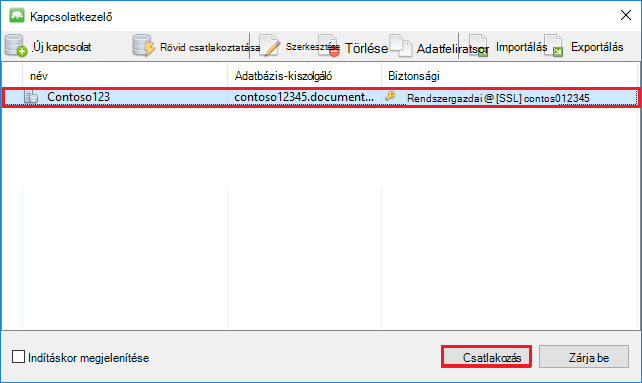

<properties 
    pageTitle="Használja a MongoChef MongoDB protokoll támogatása DocumentDB fiókkal |} Microsoft Azure" 
    description="Megtudhatja, hogy miként használható MongoChef protokoll támogatásával az előzetes verzióhoz elérhető MongoDB DocumentDB fiókkal." 
    keywords="mongochef"
    services="documentdb" 
    authors="AndrewHoh" 
    manager="jhubbard" 
    editor="" 
    documentationCenter=""/>

<tags 
    ms.service="documentdb" 
    ms.workload="data-services" 
    ms.tgt_pltfrm="na" 
    ms.devlang="na" 
    ms.topic="article" 
    ms.date="08/25/2016" 
    ms.author="anhoh"/>

# MongoChef használata egy DocumentDB fiók MongoDB protokoll támogatása

Protokoll támogatása MongoChef használatával MongoDB Azure DocumentDB fiókja csatlakozik, a következőket kell tennie:

- Töltse le és telepítse a [MongoChef](http://3t.io/mongochef)
- Használja a DocumentDB fiókját protokollt támogató MongoDB [kapcsolati karakterlánc](documentdb-connect-mongodb-account.md) információt

## A kapcsolat létrehozása a MongoChef  

Protocol (protokoll) támogatása MongoDB DocumentDB fiók hozzáadása a MongoChef kapcsolatkezelő, hajtsa végre az alábbi lépéseket.

1. A protokoll támogatásával az útmutatást követve MongoDB kapcsolatadatainak DocumentDB beolvasásához [Itt](documentdb-connect-mongodb-account.md).

    

2. Kattintson a **Csatlakozás** a Kapcsolatkezelő megnyitásához, majd kattintson az **Új kapcsolat**

    
    
2. Az **Új kapcsolat** ablakában a **kiszolgálója** lapon adja meg a HOST (FQDN) protokollt támogató MongoDB és a PORT DocumentDB fiók.
    
    

3. Az **Új kapcsolat** ablakában a **hitelesítési** lapon válassza a **Standard (MONGODB-CR vagy SCARM-SHA-1)** hitelesítési mód, és írja be a FELHASZNÁLÓNEVÉT és JELSZAVÁT.  Fogadja el az alapértelmezett hitelesítési db (rendszergazda), vagy adja meg a saját értéket.

    

4. Az **Új kapcsolat** ablakában a **SSL** lapon jelölje be a **használja az SSL protokoll csatlakozni** jelölőnégyzetet, és az **Elfogadás önaláírt SSL-tanúsítványok** választógomb.

    

5. A **Kapcsolat tesztelése** gombra kattintva ellenőrizze a kapcsolat adatait, kattintson az **OK gombra** kattintva térhet vissza az új kapcsolat ablakban, és kattintson a **Mentés**.

    

## Hozzon létre egy adatbázist, a webhelycsoport és a dokumentumokat a MongoChef használatával  

Hozzon létre egy adatbázist, a webhelycsoport és a dokumentumok MongoChef használatával, hajtsa végre az alábbi lépéseket.

1. **Kapcsolatkezelő**jelölje ki a kapcsolatot, és kattintson a **Csatlakozás**gombra.

    

2. Kattintson a jobb gombbal a host, és válassza az **Adatbázis hozzáadása**.  Adja meg az adatbázis nevét, és kattintson az **OK gombra**.
    
    

3. Kattintson a jobb gombbal az adatbázist, és válassza a **Gyűjtemény felvétele**.  Adja meg a webhelycsoport nevét, és kattintson a **Létrehozás**gombra.

    

4. A **webhelycsoport** menüpontra, majd kattintson a **Dokumentum hozzáadása**gombra.

    

5. A dokumentum hozzáadása párbeszédpanelen illessze be a következőt, és kattintson a **Dokumentum hozzáadása**gombra.

        {
        "_id": "AndersenFamily",
        "lastName": "Andersen",
        "parents": [
            { "firstName": "Thomas" },
            { "firstName": "Mary Kay"}
        ],
        "children": [
        {
            "firstName": "Henriette Thaulow", "gender": "female", "grade": 5,
            "pets": [{ "givenName": "Fluffy" }]
        }
        ],
        "address": { "state": "WA", "county": "King", "city": "seattle" },
        "isRegistered": true
        }

    
6. Adja hozzá egy másik dokumentumba, az alábbi tartalom ezt az időt.

        {
        "_id": "WakefieldFamily",
        "parents": [
            { "familyName": "Wakefield", "givenName": "Robin" },
            { "familyName": "Miller", "givenName": "Ben" }
        ],
        "children": [
            {
                "familyName": "Merriam", 
                "givenName": "Jesse", 
                "gender": "female", "grade": 1,
                "pets": [
                    { "givenName": "Goofy" },
                    { "givenName": "Shadow" }
                ]
            },
            { 
                "familyName": "Miller", 
                "givenName": "Lisa", 
                "gender": "female", 
                "grade": 8 }
        ],
        "address": { "state": "NY", "county": "Manhattan", "city": "NY" },
        "isRegistered": false
        }

7. Egy minta lekérdezés végrehajtása. Például családoknak, ahol a Vezetéknév "Andersen" kereshet, és a szülők és az állapot mező vissza.

    
    

## Következő lépések

- Ismerkedjen meg DocumentDB protokollt támogató MongoDB [minták](documentdb-mongodb-samples.md).

 
