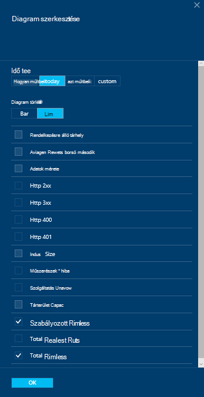

<properties
    pageTitle="Figyelheti a DocumentDB kérések és tároló |} Microsoft Azure"
    description="Útmutató a Lync-összehívások és a kiszolgáló hibákat, például a teljesítménymutatók és mértékek használatát, például a tárterület-felhasználás DocumentDB fiókját."
    services="documentdb"
    documentationCenter=""
    authors="mimig1"
    manager="jhubbard"
    editor="cgronlun"/>

<tags
    ms.service="documentdb"
    ms.workload="data-services"
    ms.tgt_pltfrm="na"
    ms.devlang="na"
    ms.topic="article"
    ms.date="10/17/2016"
    ms.author="mimig"/>

# Figyelje DocumentDB kérelmeket, a használatát és tárhely

Figyelheti a Azure DocumentDB fiókok az [Azure-portálon](https://portal.azure.com/). Az összes DocumentDB fiókhoz mindkét teljesítménymutatók kérések és kiszolgálói hibák és mérőszámok használatát, például a tárterület-felhasználás, például érhetők el.

A fiók lap vagy az új mértékek lap, mértékek ellenőrizhetőek.

## Kattintson a mértékek lap nézet teljesítménymutatók

1. Egy új ablakban nyissa meg az [Azure portált](https://portal.azure.com/), kattintson a **További szolgáltatások**, **DocumentDB (NoSQL)**gombra, és kattintson a nevére, amelynek meg szeretné tekinteni a teljesítménymutatók DocumentDB fiók parancsra.
2. Erőforrás menüben kattintson a **Mértékek**elemet.

A mértékek lap megnyílik, és választhatja ki, tekintse át a gyűjteményben. Tekintse át az elérhetőség, kérelmeket, átviteli és tárolási mértékek, és hasonlítsa össze a DocumentDB SLA.

## Kattintson a fiók lap nézet teljesítménymutatók
1.  Egy új ablakban nyissa meg az [Azure-portálon](https://portal.azure.com/)kattintson a **További szolgáltatások**, **DocumentDB (NoSQL)**gombra, és kattintson a nevére, amelynek meg szeretné tekinteni a teljesítménymutatók DocumentDB fiók.

2.  A **Figyelés** lens az alábbi csempék alapértelmezés szerint jeleníti meg:
    *   Az adott napra kérések teljes.
    *   Tárhelyet.

    Ha a táblázat nem jelenít meg **adatokat érhető el** , és úgy gondolja, hogy az adatbázis adatainak van, a [hibaelhárítási](#troubleshooting) témakörben talál.

    

3.  A **kérések** vagy **tároló** kattintva a csempe a részletes **metrikus** lap nyílik meg.
4.  A **metrikus** lap, részletes adatait jeleníti meg a Mértékek kiválasztása után.  A lap tetején egy diagramon ábrázolt óránként megkeresések, és, az alábbi képen a táblát, amely szabályozott és teljes kérések összesítési értékeit mutatja.  A metrikus lap is megjelennek a riasztások, amely definiálva van, a mértékek, az aktuális metrikus lap megjelenő szűrve (ezzel a módszerrel számos riasztások, ha csak látni fogja a megfelelő lehetőségekből itt bemutatott).   

    

## A portál teljesítményét metrikus nézetek testreszabása

1.  A mértékek, amely egy adott diagramra testreszabásához kattintson arra a diagramra kattintva nyissa meg azt a **metrikus** lap, és kattintson a **diagram szerkesztése**gombra.  
    

2.  Kattintson a **Diagram szerkesztése** lap lehetőség a mértékek, a diagram, valamint a időtartomány megjelenítő módosításához szükséges engedélyekkel.  
    

3.  Ha módosítani szeretné a mértékek, megjelenik a részében, egyszerűen jelölje ki vagy törölje a jelet a rendelkezésre álló teljesítménymutatók, és kattintson az **OK gombra** a lap alján.  
4.  Időtartomány módosításához válasszon egy másik tartomány (például **egyéni**), és kattintson a lap alján az **OK gombra** .  

    

## Egymás mellett diagramok létrehozása a portálon
Az Azure-portálra a egymás mellett metrikus diagramok létrehozását teszi lehetővé.  

1.  Először kattintson a jobb gombbal a diagramra, és válassza ki a **testreszabása**.

    

2.  Kattintson a **Adatfeliratsor** másolja a kijelzőt, és kattintson a **kész testreszabása**menü.

      

Előfordulhat, hogy most kezelik ebben a részben más metrikus keretében, a mértékek és időtartományt, megjelenik a részében testreszabása.  Ezzel az eljárással megjelenik egy időben két különböző mértékek diagram egymás mellé.  
      

## A portál értesítések beállítása
1.  Az [Azure-portálon](https://portal.azure.com/)kattintson a **További szolgáltatások**, **DocumentDB (NoSQL)**gombra, és kattintson a nevére, amelynek szeretné teljesítmény metrikus értesítések beállítása DocumentDB fiók.

2.  Az erőforrás menüjében kattintson a **Riasztási szabályok** kattintva nyissa meg a riasztási szabályok lap elemre.  
    

3.  A **riasztási szabályok** a lap kattintson a **Hozzáadás értesítés**.  
    

4.  A **riasztási szabály hozzáadása** lap adja meg:
    *   A riasztási szabály neve beállításakor.
    *   Az új szabályt leírását.
    *   A riasztási szabály metrikus egységek.
    *   A feltétel küszöbértéket és időszak, amelyek meghatározzák, amikor a figyelmeztető aktiválja. Például kiszolgálóhiba megszámolása nagyobb, mint 5 az utolsó 15 percet fölé.
    *   Hogy a szolgáltatás rendszergazdája és a coadministrators vannak küldve a figyelmeztető akkor indul el, ha.
    *   További e-mail címek az értesítéseket.  
    

## DocumentDB programozottan figyelése
A fiók szintű mérési módja miatt a portálon, például a fiók tároló használatát és a teljes kérelmeket, rendelkezésre álló DocumentDB API-khoz keresztül nem érhetők el. A webhelycsoport szintjén használati adatainak meghallgathatja azonban a DocumentDB API-k használatával. A webhelycsoport szintű adatok beolvasásához, tegye a következőket:

- A REST API-t, [végezze el a webhelycsoport a GET](https://msdn.microsoft.com/library/mt489073.aspx)használni. A webhelycsoport kvóta és használati adatait értéket adja vissza az x-ms-erőforráskvótát és az x-ms-erőforrás-használati fejlécek, a válasz
- A .NET SDK, használja a [DocumentClient.ReadDocumentCollectionAsync](https://msdn.microsoft.com/library/microsoft.azure.documents.client.documentclient.readdocumentcollectionasync.aspx) módszer használatát tulajdonságait, például a **CollectionSizeUsage**, **DatabaseUsage**, **DocumentUsage**és az egyéb számos tartalmazó [ResourceResponse](https://msdn.microsoft.com/library/dn799209.aspx) adja eredményül.

További mértékek eléréséhez használja az [Azure Monitor SDK csomagjában talál](https://www.nuget.org/packages/Microsoft.Azure.Insights). Rendelkezésre álló metrikus definíciók tudja visszaszerezni hívja fel:

    https://management.azure.com/subscriptions/{SubscriptionId}/resourceGroups/{ResourceGroup}/providers/Microsoft.DocumentDb/databaseAccounts/{DocumentDBAccountName}/metricDefinitions?api-version=2015-04-08

Egyes mértékek beolvasásához lekérdezések használata a következő formátumban:

    https://management.azure.com/subscriptions/{SubecriptionId}/resourceGroups/{ResourceGroup}/providers/Microsoft.DocumentDb/databaseAccounts/{DocumentDBAccountName}/metrics?api-version=2015-04-08&$filter=%28name.value%20eq%20%27Total%20Requests%27%29%20and%20timeGrain%20eq%20duration%27PT5M%27%20and%20startTime%20eq%202016-06-03T03%3A26%3A00.0000000Z%20and%20endTime%20eq%202016-06-10T03%3A26%3A00.0000000Z

További tudnivalókért lásd: az [Erőforrás mértékek lekérése az Azure Monitor REST API-e](https://blogs.msdn.microsoft.com/cloud_solution_architect/2016/02/23/retrieving-resource-metrics-via-the-azure-insights-api/). Figyelje meg, hogy a "Azure Inights" lett neve "Azure Monitor".  Ez a blogbejegyzés a régi fájlnevén hivatkozik.

## Hibaelhárítás
Ha a megfigyeléssel csempék az **nem érhető el adatok** üzenetet jeleníthet meg, és a legutóbb kérelmet vagy adatok hozzáadva az adatbázishoz, szerkesztheti a csempe megfelelően a legutóbbi használatát.

### Aktuális adatok csempe szerkesztése
1.  A mérési módja miatt egy adott kijelzőben megjelenő testreszabásához kattintson arra a diagramra kattintva nyissa meg a **metrikus** lap, és kattintson a **Diagram szerkesztése**gombra.  
    

2.  A **Diagram szerkesztése** lap **Időtartomány** csoportban a **órával korábbi**gombra, és kattintson **az OK**gombra.  
    

3.  A mozaik most frissítse az aktuális adatokat, és a használatát.  
    

## Következő lépések
Többet szeretne tudni a DocumentDB kapacitás, lásd: [kezelése DocumentDB kapacitása](documentdb-manage.md).
