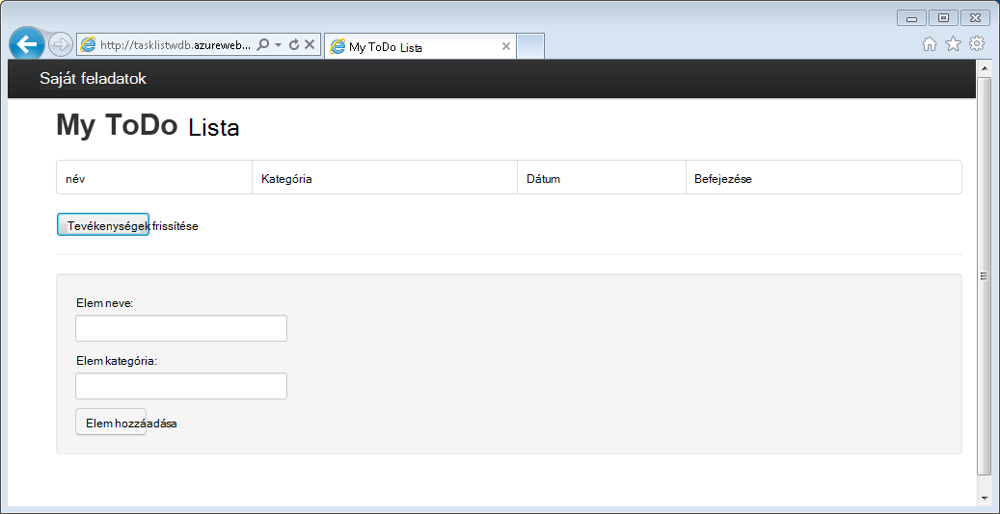
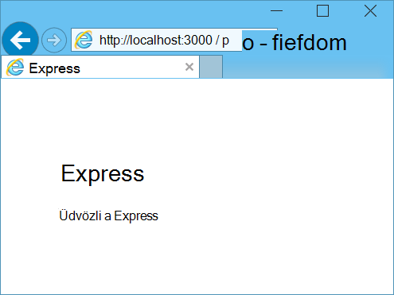
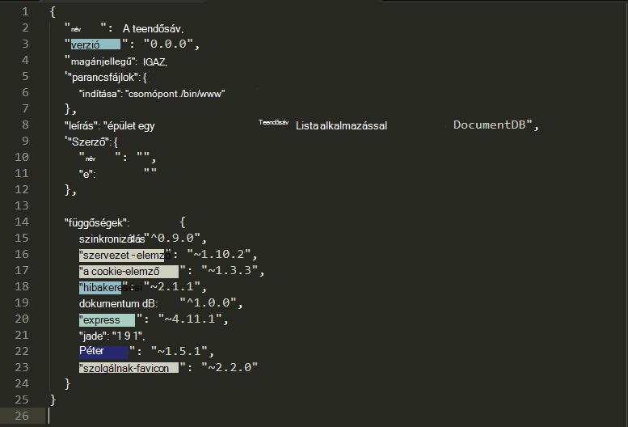
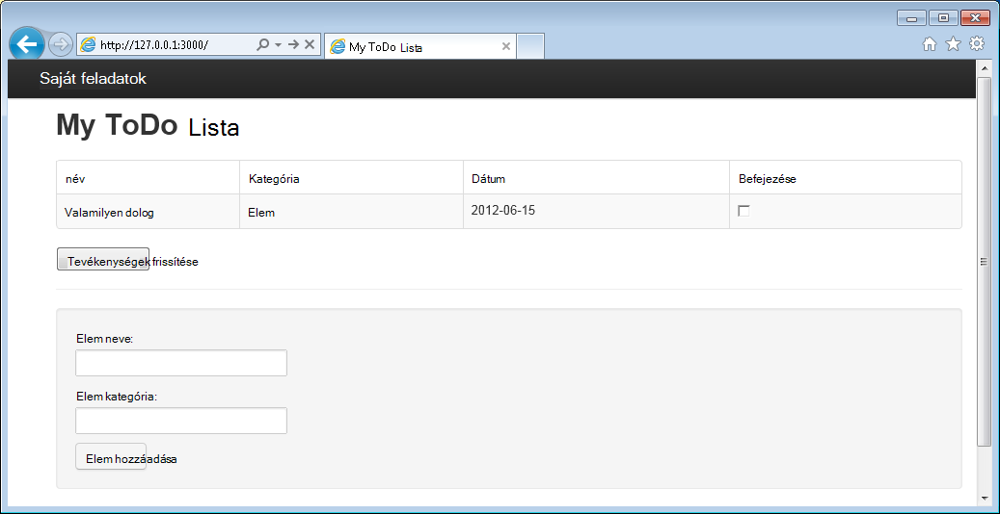

<properties 
    pageTitle="További tudnivalók a Node.js - DocumentDB Node.js oktatóprogram |} Microsoft Azure" 
    description="Ismerje meg, hogy Node.js! Oktatóprogram tallózása használatáról a Microsoft Azure DocumentDB tárolásához és az access-adatok egy Node.js Express webalkalmazás Azure-webhelyekre is." 
    keywords="Alkalmazások fejlesztése, adatbázis oktatóanyagból megtudhatja node.js, node.js oktatóprogram, documentdb, azure, a Microsoft azure"
    services="documentdb" 
    documentationCenter="nodejs" 
    authors="syamkmsft" 
    manager="jhubbard" 
    editor="cgronlun"/>

<tags 
    ms.service="documentdb" 
    ms.workload="data-services" 
    ms.tgt_pltfrm="na" 
    ms.devlang="nodejs" 
    ms.topic="hero-article" 
    ms.date="08/25/2016" 
    ms.author="syamk"/>

# Node.js webalkalmazás használatával DocumentDB összeállítása

> [AZURE.SELECTOR]
- [.NET](documentdb-dotnet-application.md)
- [NODE.js](documentdb-nodejs-application.md)
- [Java](documentdb-java-application.md)
- [Python](documentdb-python-application.md)

Ebben az oktatóanyagban Node.js megtudhatja, hogyan az Azure DocumentDB szolgáltatás használatának tárolására és Azure-webhelyeken tárolt Node.js Express alkalmazásból az access-adatok.

Azt javasoljuk, hogy az első lépések a következő videót, ahol megtanulhatja Azure DocumentDB adatbázis fiók kiépítése és JSON a dokumentumok tárolása a Node.js alkalmazásban. 

> [AZURE.VIDEO azure-demo-getting-started-with-azure-documentdb-on-nodejs-in-linux]

Ezután térjen vissza Node.js oktatóprogram hol megismerheti az alábbi kérdésekre adott válaszok:

- Hogyan működnek együtt a documentdb npm modulról DocumentDB?
- Hogyan egyszerre telepíteni a webalkalmazás az Azure-webhelyre?

Az adatbázis oktatóanyag követve fog generál egy egyszerű webes tevékenység-kezelő alkalmazás, amely lehetővé teszi, hogy hozhat létre, a retrieving és a feladatok befejezése. A tevékenységek az Azure DocumentDB JSON dokumentumként szeretne tárolni.

Nem az oktatóprogram elvégzéséhez időpontot, és egyszerűen szeretné, hogy a teljes megoldást? Nem probléma, amely letölthető a teljes minta megoldást [GitHub][].

## Előfeltételek

> [AZURE.TIP] Ebben az oktatóanyagban Node.js feltételezi, hogy rendelkezik-e bizonyos előzetes élmény Node.js és Azure-webhelyek használatával.

Ez a cikk utasításait követve, előtt bizonyosodjon meg arról, hogy a következőkre van:

- Azure active fiók. Nem rendelkeznek fiókkal, ha mindössze néhány perc is létrehozhat ingyenes próba-fiók. A részletekért lásd: [Azure ingyenes próbaverziót](https://azure.microsoft.com/pricing/free-trial/).
- [Node.js][] verzió v0.10.29 vagy újabb verziójában.
- [Express-nyilvántartás-készítő alkalmazás](http://www.expressjs.com/starter/generator.html) (Ez keresztül telepítheti `npm install express-generator -g`)
- [Mely számjegy][].

## Lépés: 1: DocumentDB adatbázis-fiók létrehozása

Első lépésként DocumentDB fiók létrehozása. Ha már rendelkezik fiókkal, akkor hagyja ki [lépés 2: hozzon létre egy új Node.js alkalmazás](#_Toc395783178).

[AZURE.INCLUDE [documentdb-create-dbaccount](../../includes/documentdb-create-dbaccount.md)]

[AZURE.INCLUDE [documentdb-keys](../../includes/documentdb-keys.md)]

## Lépés: 2: Megtudhatja, miként Node.js új alkalmazás létrehozása

Most vegyük megismerheti, hogyan kell a [Express](http://expressjs.com/) keretrendszer egyszerű helló világ Node.js projekt létrehozása.

1. Nyissa meg a kedvenc terminált.

2. Használja a sürgős nyilvántartás-készítő alkalmazás **Teendők**nevű új alkalmazás létrehozására.

        express todo

3. Nyissa meg az új **teendő** könyvtár, és telepítse a függőségeket.

        cd todo
        npm install

4. Az új alkalmazásnak a futtatására.

        npm start

5. Akkor is, akkor az új alkalmazás megtekintése a böngésző [http://localhost:3000](http://localhost:3000)navigálással.

    

## Lépés 3: További modul telepítése

A **package.json** fájlt nevezzük a legfelső szintű a projekt létrehozott fájlok. Ez a fájl a Node.js alkalmazás szükséges további modulok listáját tartalmazza. Később ez az alkalmazás-Azure webhelyek telepítésekor ezt a fájlt használatos megállapításához, hogy mely modulokat Azure az alkalmazás támogatja a telepítésére van szükség. Továbbra is szükség két további csomagok telepítése ebben az oktatóanyagban.

1. Vissza a terminált, telepíteni a **aszinkron** modul npm keresztül.

        npm install async --save

1. Telepítse a **documentdb** modul npm keresztül. Ez az a modul, ahol minden DocumentDB mágikus történik.

        npm install documentdb --save

3. Az alkalmazás **package.json** fájl gyors ellenőrzése meg kell jelennie a további modulokat. Ezt a fájlt a program tájékoztatja Azure mely csomagok letöltése és telepítése az alkalmazás futtatásakor. Érdemes hasonló, akkor az alábbi példában:

    

    Ez azt jelenti az csomópont (és Azure később), hogy az alkalmazás függ, hogy ezeket a modulokat.

## Lépés: 4: A DocumentDB szolgáltatását használja a csomópont-alkalmazások

Amely megnyitja érdekli a kezdeti beállítás és konfiguráció, most vegyük get lefelé a miért az alábbiakban, és ez az Azure DocumentDB kódírás néhány.

### A modell létrehozása

1. A projekt könyvtárában **modellek**nevű új könyvtár létrehozása.
2. A **modellek** címtárban **taskDao.js**nevű új fájl létrehozása. Ez a fájl a modellt, az alkalmazás által létrehozott tevékenységek is tartalmaz.
3. Ugyanabban a mappában **modellek** hozzon létre egy másik, **docdbUtils.js**nevű új fájlt. Ez a fájl tartalmaz néhány hasznos, újrafelhasználható, kódot, amely során az alkalmazás fogjuk használni. 
4. Másolja a következő kódot a **docdbUtils.js**

        var DocumentDBClient = require('documentdb').DocumentClient;
            
        var DocDBUtils = {
            getOrCreateDatabase: function (client, databaseId, callback) {
                var querySpec = {
                    query: 'SELECT * FROM root r WHERE r.id= @id',
                    parameters: [{
                        name: '@id',
                        value: databaseId
                    }]
                };
        
                client.queryDatabases(querySpec).toArray(function (err, results) {
                    if (err) {
                        callback(err);
        
                    } else {
                        if (results.length === 0) {
                            var databaseSpec = {
                                id: databaseId
                            };
        
                            client.createDatabase(databaseSpec, function (err, created) {
                                callback(null, created);
                            });
        
                        } else {
                            callback(null, results[0]);
                        }
                    }
                });
            },
        
            getOrCreateCollection: function (client, databaseLink, collectionId, callback) {
                var querySpec = {
                    query: 'SELECT * FROM root r WHERE r.id=@id',
                    parameters: [{
                        name: '@id',
                        value: collectionId
                    }]
                };             
                
                client.queryCollections(databaseLink, querySpec).toArray(function (err, results) {
                    if (err) {
                        callback(err);
        
                    } else {        
                        if (results.length === 0) {
                            var collectionSpec = {
                                id: collectionId
                            };
                            
                            client.createCollection(databaseLink, collectionSpec, function (err, created) {
                                callback(null, created);
                            });
        
                        } else {
                            callback(null, results[0]);
                        }
                    }
                });
            }
        };
                
        module.exports = DocDBUtils;

    > [AZURE.TIP] createCollection paramétert egy választható requestOptions ajánlat típusának megadásához a gyűjtemény használható. Ha nincs requestOptions.offerType érték van megadva kattintson a webhelycsoport létrejön az alapértelmezett kínálnak típus használatával.
    >
    > DocumentDB ajánlat típusok olvashat olvassa el [a DocumentDB teljesítményszint](documentdb-performance-levels.md) 
        
3. Mentse és zárja be a **docdbUtils.js** fájlt.

4. A **taskDao.js** fájl elején adja hozzá a **DocumentDBClient** és a fenti létrehozott **docdbUtils.js** mutató hivatkozás a következő kódot:

        var DocumentDBClient = require('documentdb').DocumentClient;
        var docdbUtils = require('./docdbUtils');

4. Ezután hozzáadásának meghatározása és a tevékenység-objektum exportálása kódot. Ez a felelős a tevékenység objektum inicializálása, és állítsa be az adatbázis és a dokumentum a webhelycsoport fogjuk használni.

        function TaskDao(documentDBClient, databaseId, collectionId) {
          this.client = documentDBClient;
          this.databaseId = databaseId;
          this.collectionId = collectionId;
        
          this.database = null;
          this.collection = null;
        }
        
        module.exports = TaskDao;

5. Ezután adja hozzá a következő kódot további módszerek definiálása a a tevékenység objektumra, amelyek lehetővé teszik a kapcsolati DocumentDB tárolt adatokkal.

        TaskDao.prototype = {
            init: function (callback) {
                var self = this;
        
                docdbUtils.getOrCreateDatabase(self.client, self.databaseId, function (err, db) {
                    if (err) {
                        callback(err);
                    } else {
                        self.database = db;
                        docdbUtils.getOrCreateCollection(self.client, self.database._self, self.collectionId, function (err, coll) {
                            if (err) {
                                callback(err);
        
                            } else {
                                self.collection = coll;
                            }
                        });
                    }
                });
            },
        
            find: function (querySpec, callback) {
                var self = this;
        
                self.client.queryDocuments(self.collection._self, querySpec).toArray(function (err, results) {
                    if (err) {
                        callback(err);
        
                    } else {
                        callback(null, results);
                    }
                });
            },
        
            addItem: function (item, callback) {
                var self = this;
        
                item.date = Date.now();
                item.completed = false;
        
                self.client.createDocument(self.collection._self, item, function (err, doc) {
                    if (err) {
                        callback(err);
        
                    } else {
                        callback(null, doc);
                    }
                });
            },
        
            updateItem: function (itemId, callback) {
                var self = this;
        
                self.getItem(itemId, function (err, doc) {
                    if (err) {
                        callback(err);
        
                    } else {
                        doc.completed = true;
        
                        self.client.replaceDocument(doc._self, doc, function (err, replaced) {
                            if (err) {
                                callback(err);
        
                            } else {
                                callback(null, replaced);
                            }
                        });
                    }
                });
            },
        
            getItem: function (itemId, callback) {
                var self = this;
        
                var querySpec = {
                    query: 'SELECT * FROM root r WHERE r.id = @id',
                    parameters: [{
                        name: '@id',
                        value: itemId
                    }]
                };
        
                self.client.queryDocuments(self.collection._self, querySpec).toArray(function (err, results) {
                    if (err) {
                        callback(err);
        
                    } else {
                        callback(null, results[0]);
                    }
                });
            }
        };

6. Mentse és zárja be a **taskDao.js** fájlt. 

### A vezérlő létrehozása

1. A projekt **útvonalak** címtárban **tasklist.js**nevű új fájl létrehozása. 
2. A következő kód hozzáadása a **tasklist.js**. Betöltése a DocumentDBClient és aszinkron modulban, amelyet **tasklist.js**használnak. Ez is a **TaskList** függvény, amely a korábban definiált **tevékenység** objektum egy példány átadott meghatározása:

        var DocumentDBClient = require('documentdb').DocumentClient;
        var async = require('async');
        
        function TaskList(taskDao) {
          this.taskDao = taskDao;
        }
        
        module.exports = TaskList;

3. Továbbra is, hogy milyen módszerekkel **showTasks addTask**és **completeTasks**hozzáadásával **tasklist.js** fájl hozzáadása:
        
        TaskList.prototype = {
            showTasks: function (req, res) {
                var self = this;
        
                var querySpec = {
                    query: 'SELECT * FROM root r WHERE r.completed=@completed',
                    parameters: [{
                        name: '@completed',
                        value: false
                    }]
                };
        
                self.taskDao.find(querySpec, function (err, items) {
                    if (err) {
                        throw (err);
                    }
        
                    res.render('index', {
                        title: 'My ToDo List ',
                        tasks: items
                    });
                });
            },
        
            addTask: function (req, res) {
                var self = this;
                var item = req.body;
        
                self.taskDao.addItem(item, function (err) {
                    if (err) {
                        throw (err);
                    }
        
                    res.redirect('/');
                });
            },
        
            completeTask: function (req, res) {
                var self = this;
                var completedTasks = Object.keys(req.body);
        
                async.forEach(completedTasks, function taskIterator(completedTask, callback) {
                    self.taskDao.updateItem(completedTask, function (err) {
                        if (err) {
                            callback(err);
                        } else {
                            callback(null);
                        }
                    });
                }, function goHome(err) {
                    if (err) {
                        throw err;
                    } else {
                        res.redirect('/');
                    }
                });
            }
        };

4. Mentse és zárja be a **tasklist.js** fájlt.
 
### Config.js hozzáadása

1. A projekt címtárában **config.js**nevű új fájl létrehozása.
2. Adja hozzá a következő **config.js**. Konfigurációs beállítások és az alkalmazáshoz szükséges értékek határozza meg.

        var config = {}
        
        config.host = process.env.HOST || "[the URI value from the DocumentDB Keys blade on http://portal.azure.com]";
        config.authKey = process.env.AUTH_KEY || "[the PRIMARY KEY value from the DocumentDB Keys blade on http://portal.azure.com]";
        config.databaseId = "ToDoList";
        config.collectionId = "Items";
        
        module.exports = config;

3. A **config.js** fájlban HOST és a billentyűk lap a DocumentDB fiókja a [Microsoft Azure-portálon](https://portal.azure.com)található értékekkel AUTH_KEY értékének frissítése:

4. Mentse és zárja be a **config.js** fájlt.
 
### App.js módosítása

1. A projekt könyvtárában nyissa meg a **app.js** fájlt. A fájl korábbi verziójában készült létrehozott Express webalkalmazás.
2. Adja hozzá a következő kódot **app.js** elejére
    
        var DocumentDBClient = require('documentdb').DocumentClient;
        var config = require('./config');
        var TaskList = require('./routes/tasklist');
        var TaskDao = require('./models/taskDao');

3. Kód meghatározza a konfigurációs fájl használható, és ki a fájlt az egyes fogjuk használni hamarosan változók értékek olvasható során.
4. Az alábbi két sort a fájlban **app.js** cseréje:

        app.use('/', routes);
        app.use('/users', users); 

      az a következő kódtöredékének:

        var docDbClient = new DocumentDBClient(config.host, {
            masterKey: config.authKey
        });
        var taskDao = new TaskDao(docDbClient, config.databaseId, config.collectionId);
        var taskList = new TaskList(taskDao);
        taskDao.init();
        
        app.get('/', taskList.showTasks.bind(taskList));
        app.post('/addtask', taskList.addTask.bind(taskList));
        app.post('/completetask', taskList.completeTask.bind(taskList));
        app.set('view engine', 'jade');

6. Ezek azok a sorok a **TaskDao** objektum új példányának megadása DocumentDB (az értékekkel olvasni a **config.js**) szeretne új kapcsolatot, és a tevékenység objektum inicializálni, majd kötni Űrlapműveletek módszerek a **TaskList** vezérlőn. 

7. Végezetül mentse és zárja be a **app.js** fájlt, azt szinte végzett.
 
## 5 lépés: A felhasználói felület összeállítása

Most vegyük kapcsolja be a figyelmet a felhasználói felület összeállítását, így a felhasználó ténylegesen együttműködhet az alkalmazás. A létrehozott Express alkalmazást használja a nézet motor **Jade** . További információt a Jade hivatkozzon [http://jade-lang.com/](http://jade-lang.com/).

1. A **nézetek** címtárban a **layout.jade** fájl globális sablonként szolgál más **.jade** fájlokat. Ebben a lépésben fog módosíthatja, hogy az [Betöltő Twitter](https://github.com/twbs/bootstrap), amely egy eszközkészlet, amely megkönnyíti, egy jó megjelenésű webhelyet. 
2. Nyissa meg a **layout.jade** fájlt a **nézetek** mappában található, és cserélje le a tartalom a következő;
    
        doctype html
        html
          head
            title= title
            link(rel='stylesheet', href='//ajax.aspnetcdn.com/ajax/bootstrap/3.3.2/css/bootstrap.min.css')
            link(rel='stylesheet', href='/stylesheets/style.css')
          body
            nav.navbar.navbar-inverse.navbar-fixed-top
              div.navbar-header
                a.navbar-brand(href='#') My Tasks
            block content
            script(src='//ajax.aspnetcdn.com/ajax/jQuery/jquery-1.11.2.min.js')
            script(src='//ajax.aspnetcdn.com/ajax/bootstrap/3.3.2/bootstrap.min.js')

    Ez hatékony azt jelenti az egyes HTML, az alkalmazás jeleníti meg a **Jade** motor, és a **blokk** nevű **tartalom** hol azt is ki az elrendezést a tartalmi lapok hoz létre.
    Mentse és zárja be a **layout.jade** fájlt.

4. Most már a **index.jade** fájl megnyitásához, a nézet, amely az alkalmazás által használandó, és a fájl tartalmát lecserélése a következőre:

        extends layout
        
        block content
          h1 #{title}
          br
        
          form(action="/completetask", method="post")
            table.table.table-striped.table-bordered
              tr
                td Name
                td Category
                td Date
                td Complete
              if (typeof tasks === "undefined")
                tr
                  td
              else
                each task in tasks
                  tr
                    td #{task.name}
                    td #{task.category}
                    - var date  = new Date(task.date);
                    - var day   = date.getDate();
                    - var month = date.getMonth() + 1;
                    - var year  = date.getFullYear();
                    td #{month + "/" + day + "/" + year}
                    td
                      input(type="checkbox", name="#{task.id}", value="#{!task.completed}", checked=task.completed)
            button.btn(type="submit") Update tasks
          hr
          form.well(action="/addtask", method="post")
            label Item Name:
            input(name="name", type="textbox")
            label Item Category:
            input(name="category", type="textbox")
            br
            button.btn(type="submit") Add item

    Elrendezés kiterjed, és a **tartalom** helyőrző bekerül a **layout.jade** fájl korábbi nyújt a tartalom.
    
    Ebben az elrendezésben létrehozott két HTML-űrlap. 
    Az első űrlap tartalmazza a táblát, hogy adatait és egy gomb, amellyel us elemek frissítése hírcsatornán keresztüli a vezérlő **/completetask** metódusát.
    A második űrlap két beviteli mező és egy gomb, amellyel számunkra, hogy az új elem létrehozása hírcsatornán keresztüli **/addtask** módszer a vezérlő tartalmazza.
    
    Ennek a munkát az alkalmazáshoz szükséges összes kell.

5. Nyissa meg a **style.css** fájlt **public\stylesheets** directory és a kód lecserélése a következőre:

        body {
          padding: 50px;
          font: 14px "Lucida Grande", Helvetica, Arial, sans-serif;
        }
        a {
          color: #00B7FF;
        }
        .well label {
          display: block;
        }
        .well input {
          margin-bottom: 5px;
        }
        .btn {
          margin-top: 5px;
          border: outset 1px #C8C8C8;
        }

    Mentse és zárja be a **style.css** fájlt.

## Lépés a 6: Alkalmazásnak a futtatására a helyi meghajtóra

1. Ha tesztelni szeretné az alkalmazás a helyi számítógépen, a Futtatás `npm start` indítsa el az alkalmazást, és indítsa el a böngészőben, egy lappal, amely hasonlít az alábbi képen egy terminálablakba:

    

2. Az elem, az elem neve és a kategória megadott mezők használatával adja meg adatait, és kattintson a **Elem hozzáadása**gombra.

3. Az oldal frissíteni kell a teendőlista jeleníthet meg az újonnan létrehozott elemet.

    

4. A tevékenység befejezéséhez, egyszerűen jelölje be a jelölőnégyzetet, a teljes oszlop, és kattintson a **tevékenységek frissítése**gombra.

## 7 lépés: Az alkalmazás fejlesztési projekt telepítése Azure webhelyek

1. Ha még nem tette meg, mely számjegy összegyűjti a Azure webhely engedélyezése Ehhez a [Helyi mely számjegy telepítési Azure alkalmazás szolgáltatás](../app-service-web/app-service-deploy-local-git.md) témakörben olvashat talál utasításokat.

2. Vegye fel a Azure webhelyét egy távoli mely számjegy.

        git remote add azure https://username@your-azure-website.scm.azurewebsites.net:443/your-azure-website.git

3. Telepítse a távoli közvetítheti.

        git push azure master

4. Néhány másodperc alatt mely számjegy a webalkalmazás közzététel befejezéséhez, és indítsa el a a böngészőben, ahol megtekintheti a praktikus munka Azure-ban futó!

## Következő lépések

Gratulálok! Csak az első Node.js Express webalkalmazás használatával Azure DocumentDB beépített és Azure-webhelyeken közzétett azt.

A teljes hivatkozást alkalmazáshoz forráskódot letölthető [GitHub][].

További tudnivalókért lásd: a [Node.js Developer Center](https://azure.microsoft.com/develop/nodejs/).

[NODE.js]: http://nodejs.org/
[Mely számjegy]: http://git-scm.com/
[Github]: https://github.com/Azure-Samples/documentdb-node-todo-app
 
