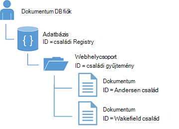
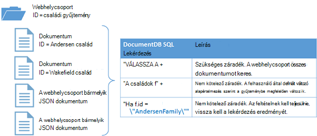

<properties
  pageTitle="DocumentDB NoSQL Node.js oktatóprogramja |} Microsoft Azure"
  description="NoSQL Node.js oktatóanyagot, hogy létrehoz egy csomópont adatbázis és konzolhoz alkalmazást a DocumentDB Node.js SDK használatával. DocumentDB JSON NoSQL adatbázis."
    keywords="NODE.js oktatóanyagban csomópont-adatbázis"
  services="documentdb"
  documentationCenter="node.js"
  authors="AndrewHoh"
  manager="jhubbard"
  editor="monicar"/>

<tags
  ms.service="documentdb"
  ms.workload="data-services"
  ms.tgt_pltfrm="na"
  ms.devlang="node"
  ms.topic="hero-article"
  ms.date="08/11/2016"
  ms.author="anhoh"/>

# <a name="nosql-nodejs-tutorial-documentdb-nodejs-console-application"></a>NoSQL Node.js oktatóprogram: DocumentDB Node.js konzol alkalmazás  

> [AZURE.SELECTOR]
- [.NET](documentdb-get-started.md)
- [NODE.js](documentdb-nodejs-get-started.md)

Üdvözli az Node.js oktatóprogram az Azure DocumentDB Node.js SDK az! Ebben az oktatóanyagban elvégeztük is létrehoz egy konzolhoz alkalmazás és a lekérdezések DocumentDB erőforrások, köztük az adatbázis csomópontot.

Fogja foglalkozunk:

- Hozhat létre, és egy DocumentDB keresztüli
- Az alkalmazás beállítása
- A csomópont-adatbázis létrehozása
- A webhelycsoport létrehozása
- JSON-dokumentumok létrehozása
- A webhelycsoport lekérdezésére.
- Dokumentum cseréje
- Dokumentum törlése
- A csomópont-adatbázis törlése

Nincs időt? ne aggódj! Az ideális megoldás [GitHub](https://github.com/Azure-Samples/documentdb-node-getting-started)érhető el. Lásd: [Ismerkedés a ideális megoldás](#GetSolution) rövid utasításokat.

Miután befejezte a Node.js oktatóprogram, használja a szavazógombok tetején és alján a visszajelzést. Ha szeretné, hogy közvetlenül kapcsolatba lépni Önnel, nyugodtan az e-mail cím szerepeltetni a megjegyzéseit.

Most már lássunk hozzá!

## <a name="prerequisites-for-the-nodejs-tutorial"></a>Az Node.js oktatóprogram előfeltételei

Győződjön meg arról, hogy a következőket:

- Azure active fiók. Ha nincs telepítve egyik, jelentkezzen az [Ingyenes Azure próbaverzió](https://azure.microsoft.com/pricing/free-trial/).
- [Node.js](https://nodejs.org/) verzió v0.10.29 vagy újabb verziójában.

## <a name="step-1-create-a-documentdb-account"></a>Lépés: 1: DocumentDB-fiók létrehozása

Hozzunk létre egy DocumentDB fiókot. Ha már rendelkezik a használni kívánt fiókkal, ugorjon [a Node.js alkalmazás](#SetupNode)beállítása.

[AZURE.INCLUDE [documentdb-create-dbaccount](../../includes/documentdb-create-dbaccount.md)]

## <a id="SetupNode"></a>Lépés: 2: A Node.js alkalmazás beállítása

1. Nyissa meg a kedvenc terminált.
2. Keresse meg azt a mappát vagy a címtár, ahol meg szeretné menteni a Node.js alkalmazás.
3. Hozzon létre két üres JavaScript-fájlok az alábbi parancsokat:
  - Windows:
      * ```fsutil file createnew app.js 0```
        * ```fsutil file createnew config.js 0```
  - Linux/OS x
      * ```touch app.js```
        * ```touch config.js```
4. Telepítse a documentdb modul npm keresztül. A következő parancsot használja:
    * ```npm install documentdb --save```

nagyszerű! Most, hogy befejezte beállítását, első néhány kódírás.

## <a id="Config"></a>3 lépés: Az alkalmazás-konfiguráció beállítása

Nyissa meg ```config.js``` a kedvenc szövegszerkesztőben.

Ezután, másolás és beillesztés az alábbi kódtöredéket és tulajdonságainak beállítása ```config.endpoint``` és ```config.primaryKey``` a DocumentDB végpont uri és az elsődleges kulcs. Mindkét őket az [Azure-portálon](https://portal.azure.com)találhatók.

![NODE.js oktatóanyag – az Azure portálon, rajta egy DocumentDB fiókot a aktív, kiemelt hubhoz, a BILLENTYŰK a DocumentDB fiók lap gombja és a billentyűk lap - csomópont adatbázis kiemelt URI, az elsődleges kulcs és a másodlagos KULCSA értékeket képe][keys]

    // ADD THIS PART TO YOUR CODE
    var config = {}

    config.endpoint = "~your DocumentDB endpoint uri here~";
    config.primaryKey = "~your primary key here~";

Másolása és beillesztése a ```database id```, ```collection id```, és ```JSON documents``` szeretne a ```config``` objektum az alábbi hol beállítása a ```config.endpoint``` és ```config.authKey``` tulajdonságait. Ha rendelkezik az adatbázis tárolni kívánt adatok, DocumentDB cég [adatainak áttelepítési eszköz](documentdb-import-data.md) , hanem hozzáadása a dokumentum-definíciók is használhatja.

    config.endpoint = "~your DocumentDB endpoint uri here~";
    config.primaryKey = "~your primary key here~";

    // ADD THIS PART TO YOUR CODE
    config.database = {
        "id": "FamilyDB"
    };

    config.collection = {
        "id": "FamilyColl"
    };

    config.documents = {
        "Andersen": {
            "id": "Anderson.1",
            "lastName": "Andersen",
            "parents": [{
                "firstName": "Thomas"
            }, {
                    "firstName": "Mary Kay"
                }],
            "children": [{
                "firstName": "Henriette Thaulow",
                "gender": "female",
                "grade": 5,
                "pets": [{
                    "givenName": "Fluffy"
                }]
            }],
            "address": {
                "state": "WA",
                "county": "King",
                "city": "Seattle"
            }
        },
        "Wakefield": {
            "id": "Wakefield.7",
            "parents": [{
                "familyName": "Wakefield",
                "firstName": "Robin"
            }, {
                    "familyName": "Miller",
                    "firstName": "Ben"
                }],
            "children": [{
                "familyName": "Merriam",
                "firstName": "Jesse",
                "gender": "female",
                "grade": 8,
                "pets": [{
                    "givenName": "Goofy"
                }, {
                        "givenName": "Shadow"
                    }]
            }, {
                    "familyName": "Miller",
                    "firstName": "Lisa",
                    "gender": "female",
                    "grade": 1
                }],
            "address": {
                "state": "NY",
                "county": "Manhattan",
                "city": "NY"
            },
            "isRegistered": false
        }
    };


Az adatbázis, a webhelycsoport és a dokumentum-definíciók jár a DocumentDB ```database id```, ```collection id```, és a dokumentumok adatokat.

Végezetül exportálása a ```config``` objektum, így azt belül hivatkozhat a ```app.js``` fájlt.

            },
            "isRegistered": false
        }
    };

    // ADD THIS PART TO YOUR CODE
    module.exports = config;

##<a id="Connect"></a>Lépés: 4: Egy DocumentDB fiók csatlakoztatása

Nyissa meg a kiürítés ```app.js``` szövegszerkesztőben fájlt. Másolja és illessze be az alábbi importálandó a ```documentdb``` modul és az újonnan létrehozott ```config``` modulra.

    // ADD THIS PART TO YOUR CODE
    "use strict";

    var documentClient = require("documentdb").DocumentClient;
    var config = require("./config");
    var url = require('url');

Másolás és beillesztés a kódot, és használja a korábban mentett ```config.endpoint``` és ```config.primaryKey``` hozhat létre egy új DocumentClient.

    var config = require("./config");
    var url = require('url');

    // ADD THIS PART TO YOUR CODE
    var client = new documentClient(config.endpoint, { "masterKey": config.primaryKey });

Most, hogy a kódot a documentdb ügyfél inicializálni, most tekintsünk át egy DocumentDB erőforrások használata.

## <a name="step-5-create-a-node-database"></a>5 lépés: A csomópont-adatbázis létrehozása
Másolja és illessze be az alábbi a HTTP-állapot beállítása nem található, az adatbázis URL-cím és a webhelycsoport URL-címe. Az alábbi URL-, hogyan a DocumentDB ügyfél megtalálja a megfelelő adatbázist, és a webhelycsoport.

    var client = new documentClient(config.endpoint, { "masterKey": config.primaryKey });

    // ADD THIS PART TO YOUR CODE
    var HttpStatusCodes = { NOTFOUND: 404 };
    var databaseUrl = `dbs/${config.database.id}`;
    var collectionUrl = `${databaseUrl}/colls/${config.collection.id}`;

[Adatbázis](documentdb-resources.md#databases) **DocumentClient** osztály a [createDatabase](https://azure.github.io/azure-documentdb-node/DocumentClient.html) függvény használatával hozhat létre. A dokumentum tárolási keresztül gyűjtemények particionálva logikai tároló egy adatbázis.

Másolás és beillesztés a **getDatabase** függvény az új adatbázis létrehozásához a app.js kiterjesztésű a ```id``` megadott a ```config``` objektumot. A függvény ellenőrzi, ha az adatbázis ugyanazzal a ```FamilyRegistry``` azonosító még nem létezik. Ha létezik, azt, hogy újat hozna létre adatbázissal fog megjelenni.

    var collectionUrl = `${databaseUrl}/colls/${config.collection.id}`;

    // ADD THIS PART TO YOUR CODE
    function getDatabase() {
        console.log(`Getting database:\n${config.database.id}\n`);

        return new Promise((resolve, reject) => {
            client.readDatabase(databaseUrl, (err, result) => {
                if (err) {
                    if (err.code == HttpStatusCodes.NOTFOUND) {
                        client.createDatabase(config.database, (err, created) => {
                            if (err) reject(err)
                            else resolve(created);
                        });
                    } else {
                        reject(err);
                    }
                } else {
                    resolve(result);
                }
            });
        });
    }

Másolja és illessze be a kódot, amelyekben ad meg, hogy a **getDatabase** -függvénnyel minden teljesülő feltételhez segítő függvény **lépjen ki** lesz nyomtatva, a Kilépés üzenet, és a hívást **getDatabase** függvény alatt.

                } else {
                    resolve(result);
                }
            });
        });
    }

    // ADD THIS PART TO YOUR CODE
    function exit(message) {
        console.log(message);
        console.log('Press any key to exit');
        process.stdin.setRawMode(true);
        process.stdin.resume();
        process.stdin.on('data', process.exit.bind(process, 0));
    }

    getDatabase()
    .then(() => { exit(`Completed successfully`); })
    .catch((error) => { exit(`Completed with error ${JSON.stringify(error)}`) });

Keresse meg a terminált, a ```app.js``` fájlt, és a parancs futtatásával:```node app.js```

Gratulálok! DocumentDB adatbázis sikeresen létrehozott.

##<a id="CreateColl"></a>Lépés a 6: Gyűjtemény létrehozása  

> [AZURE.WARNING] **CreateDocumentCollectionAsync** hoz létre új gyűjteménye, amely mellett a következmények árak. További információra kíváncsi keresse fel a [árak, oldal](https://azure.microsoft.com/pricing/details/documentdb/).

Egy [webhelycsoport](documentdb-resources.md#collections) **DocumentClient** osztály a [createCollection](https://azure.github.io/azure-documentdb-node/DocumentClient.html) függvény használatával hozhat létre. Egy webhelycsoport JSON dokumentumok és a kapcsolódó, JavaScript alkalmazás logika tároló.

Másolás és beillesztés a **getDatabase** függvény hozhat létre az új webhelycsoport az alatt a **getCollection** függvény a ```id``` megadott a ```config``` objektum. Ismét azt is ellenőrizze, hogy ugyanazzal a gyűjtemény ```FamilyCollection``` azonosító még nem létezik. Ha létezik, azt ekkor visszalép a webhelycsoport helyett újat hozna létre.

                } else {
                    resolve(result);
                }
            });
        });
    }

    // ADD THIS PART TO YOUR CODE
    function getCollection() {
        console.log(`Getting collection:\n${config.collection.id}\n`);

        return new Promise((resolve, reject) => {
            client.readCollection(collectionUrl, (err, result) => {
                if (err) {
                    if (err.code == HttpStatusCodes.NOTFOUND) {
                        client.createCollection(databaseUrl, config.collection, { offerThroughput: 400 }, (err, created) => {
                            if (err) reject(err)
                            else resolve(created);
                        });
                    } else {
                        reject(err);
                    }
                } else {
                    resolve(result);
                }
            });
        });
    }

Másolja és illessze be a kódot alatti **getDatabase** végrehajtani a **getCollection** függvény a hívást.

    getDatabase()

    // ADD THIS PART TO YOUR CODE
    .then(() => getCollection())
    // ENDS HERE

    .then(() => { exit(`Completed successfully`); })
    .catch((error) => { exit(`Completed with error ${JSON.stringify(error)}`) });

Keresse meg a terminált, a ```app.js``` fájlt, és a parancs futtatásával:```node app.js```

Gratulálok! Sikeresen létrehozott DocumentDB gyűjteménye.

##<a id="CreateDoc"></a>7 lépés: Dokumentum létrehozása
[Dokumentum](documentdb-resources.md#documents) **DocumentClient** osztály a [createDocument](https://azure.github.io/azure-documentdb-node/DocumentClient.html) függvény használatával hozhat létre. Dokumentumok olyan felhasználó által definiált (tetszőleges) JSON tartalmat. A dokumentum most beillesztése DocumentDB.

Másolás és beillesztés a **getFamilyDocument** függvény a **getCollection** függvény a mentett JSON adatokat tartalmazó dokumentumok készítésére alatt a ```config``` objektumot. Ismét azt fogja ellenőrizze az azonos azonosító dokumentum még nem létezik.

                } else {
                    resolve(result);
                }
            });
        });
    }

    // ADD THIS PART TO YOUR CODE
    function getFamilyDocument(document) {
        let documentUrl = `${collectionUrl}/docs/${document.id}`;
        console.log(`Getting document:\n${document.id}\n`);

        return new Promise((resolve, reject) => {
            client.readDocument(documentUrl, { partitionKey: document.district }, (err, result) => {
                if (err) {
                    if (err.code == HttpStatusCodes.NOTFOUND) {
                        client.createDocument(collectionUrl, document, (err, created) => {
                            if (err) reject(err)
                            else resolve(created);
                        });
                    } else {
                        reject(err);
                    }
                } else {
                    resolve(result);
                }
            });
        });
    };

Másolja és illessze be a kódot alatti **getCollection** végrehajtani a **getFamilyDocument** függvény a hívást.

    getDatabase()
    .then(() => getCollection())

    // ADD THIS PART TO YOUR CODE
    .then(() => getFamilyDocument(config.documents.Andersen))
    .then(() => getFamilyDocument(config.documents.Wakefield))
    // ENDS HERE

    .then(() => { exit(`Completed successfully`); })
    .catch((error) => { exit(`Completed with error ${JSON.stringify(error)}`) });

Keresse meg a terminált, a ```app.js``` fájlt, és a parancs futtatásával:```node app.js```

Gratulálok! Egy DocumentDB dokumentumok sikeresen létrehozott.



##<a id="Query"></a>Lépés 8: A lekérdezés DocumentDB erőforrások

DocumentDB támogatja a [multimédiás lekérdezések](documentdb-sql-query.md) JSON dokumentumok egyes tárolt ellen. A példa egy lekérdezést, amely a webhelycsoport szemben a dokumentumok futtatható jeleníti meg.

Másolja és illessze be a **queryCollection** függvény a **getFamilyDocument** függvény alatt. DocumentDB SQL-szerű lekérdezések támogatja az alább látható módon. További tájékoztatást a komplex lekérdezések összeállítását tanulmányozza a [Lekérdezés játszótéri](https://www.documentdb.com/sql/demo) és a [lekérdezés dokumentációjának](documentdb-sql-query.md).

                } else {
                    resolve(result);
                }
            });
        });
    }

    // ADD THIS PART TO YOUR CODE
    function queryCollection() {
        console.log(`Querying collection through index:\n${config.collection.id}`);

        return new Promise((resolve, reject) => {
            client.queryDocuments(
                collectionUrl,
                'SELECT VALUE r.children FROM root r WHERE r.lastName = "Andersen"'
            ).toArray((err, results) => {
                if (err) reject(err)
                else {
                    for (var queryResult of results) {
                        let resultString = JSON.stringify(queryResult);
                        console.log(`\tQuery returned ${resultString}`);
                    }
                    console.log();
                    resolve(results);
                }
            });
        });
    };


A következő ábra bemutatja, hogyan a DocumentDB SQL-lekérdezés szintaxisa nevezik szemben a gyűjteményben, létrehozott.



A [FROM](documentdb-sql-query.md#from-clause) kulcsszót a lépés nem kötelező, a lekérdezés, DocumentDB lekérdezések már tükrözik egyetlen gyűjteménye, mert. Ezért "Feladó családok f" is cserél "A legfelső szintű-r" vagy bármely más változó nevet, válassza a. DocumentDB fog előállítani az adott családok, legfelső szintű vagy a választott változó név alapján, az aktuális gyűjtemény hivatkozás alapértelmezés szerint.

Másolja és illessze be a kódot alatti **getFamilyDocument** végrehajtani a **queryCollection** függvény a hívást.

    .then(() => getFamilyDocument(config.documents.Andersen))
    .then(() => getFamilyDocument(config.documents.Wakefield))

    // ADD THIS PART TO YOUR CODE
    .then(() => queryCollection())
    // ENDS HERE

    .then(() => { exit(`Completed successfully`); })
    .catch((error) => { exit(`Completed with error ${JSON.stringify(error)}`) });

Keresse meg a terminált, a ```app.js``` fájlt, és a parancs futtatásával:```node app.js```

Gratulálok! Sikeresen ad olyan DocumentDB dokumentumokat.

##<a id="ReplaceDocument"></a>Lépés a 9: Dokumentum cseréje
DocumentDB tagjára JSON dokumentumok támogatja.

Másolja és illessze be a **replaceDocument** függvény a **queryCollection** függvény alatt.

                    }
                    console.log();
                    resolve(result);
                }
            });
        });
    }

    // ADD THIS PART TO YOUR CODE
    function replaceFamilyDocument(document) {
        let documentUrl = `${collectionUrl}/docs/${document.id}`;
        console.log(`Replacing document:\n${document.id}\n`);
        document.children[0].grade = 6;

        return new Promise((resolve, reject) => {
            client.replaceDocument(documentUrl, document, (err, result) => {
                if (err) reject(err);
                else {
                    resolve(result);
                }
            });
        });
    };

Másolja és illessze be a kódot alatti **queryCollection** végrehajtani a **replaceDocument** függvény a hívást. Hozzáadhat a kódot, és ellenőrizze, hogy a dokumentum sikeresen megváltoztak hívása **queryCollection** újra.

    .then(() => getFamilyDocument(config.documents.Andersen))
    .then(() => getFamilyDocument(config.documents.Wakefield))
    .then(() => queryCollection())

    // ADD THIS PART TO YOUR CODE
    .then(() => replaceFamilyDocument(config.documents.Andersen))
    .then(() => queryCollection())
    // ENDS HERE

    .then(() => { exit(`Completed successfully`); })
    .catch((error) => { exit(`Completed with error ${JSON.stringify(error)}`) });

Keresse meg a terminált, a ```app.js``` fájlt, és a parancs futtatásával:```node app.js```

Gratulálok! Ha sikeresen cserélte DocumentDB dokumentum.

##<a id="DeleteDocument"></a>10 lépés: A dokumentum törlése
DocumentDB törlése JSON dokumentumok támogatja.

Másolja és illessze be a **deleteDocument** függvény a **replaceDocument** függvény alatt.

                else {
                    resolve(result);
                }
            });
        });
    };

    // ADD THIS PART TO YOUR CODE
    function deleteFamilyDocument(document) {
        let documentUrl = `${collectionUrl}/docs/${document.id}`;
        console.log(`Deleting document:\n${document.id}\n`);

        return new Promise((resolve, reject) => {
            client.deleteDocument(documentUrl, (err, result) => {
                if (err) reject(err);
                else {
                    resolve(result);
                }
            });
        });
    };

Másolja és illessze be a kódot a hívást a második **queryCollection** végrehajtani a **deleteDocument** függvény alatt.

    .then(() => queryCollection())
    .then(() => replaceFamilyDocument(config.documents.Andersen))
    .then(() => queryCollection())

    // ADD THIS PART TO YOUR CODE
    .then(() => deleteFamilyDocument(config.documents.Andersen))
    // ENDS HERE

    .then(() => { exit(`Completed successfully`); })
    .catch((error) => { exit(`Completed with error ${JSON.stringify(error)}`) });

Keresse meg a terminált, a ```app.js``` fájlt, és a parancs futtatásával:```node app.js```

Gratulálok! Törölt dokumentum DocumentDB sikeresen.

##<a id="DeleteDatabase"></a>11 lépés: A csomópont-adatbázis törlése

A létrehozott adatbázis törli az adatbázist, és az összes alárendelt kifejezésekkel erőforrás (gyűjtemények, dokumentumok stb.).

És másolása és beillesztése a következő kódrészletet (függvény **karbantartása**) Ha el szeretné távolítani az adatbázis összes gyermekek erőforrás.

                else {
                    resolve(result);
                }
            });
        });
    };

    // ADD THIS PART TO YOUR CODE
    function cleanup() {
        console.log(`Cleaning up by deleting database ${config.database.id}`);

        return new Promise((resolve, reject) => {
            client.deleteDatabase(databaseUrl, (err) => {
                if (err) reject(err)
                else resolve(null);
            });
        });
    }

Másolja és illessze be a kódot alatti **deleteDocument** végrehajtani a **Lemezkarbantartó** függvény a hívást.

    .then(() => deleteFamilyDocument(config.documents.Andersen))

    // ADD THIS PART TO YOUR CODE
    .then(() => cleanup())
    // ENDS HERE

    .then(() => { exit(`Completed successfully`); })
    .catch((error) => { exit(`Completed with error ${JSON.stringify(error)}`) });

##<a id="Run"></a>Lépés a 12: Futtatás az összes együtt Node.js alkalmazás!

Teljesen a függvények hívása DLL-sorrendet így néz ki:

    getDatabase()
    .then(() => getCollection())
    .then(() => getFamilyDocument(config.documents.Andersen))
    .then(() => getFamilyDocument(config.documents.Wakefield))
    .then(() => queryCollection())
    .then(() => replaceFamilyDocument(config.documents.Andersen))
    .then(() => queryCollection())
    .then(() => deleteFamilyDocument(config.documents.Andersen))
    .then(() => cleanup())
    .then(() => { exit(`Completed successfully`); })
    .catch((error) => { exit(`Completed with error ${JSON.stringify(error)}`) });

Keresse meg a terminált, a ```app.js``` fájlt, és a parancs futtatásával:```node app.js```

Meg kell jelennie a kimenet: az első lépések alkalmazást. A kimenet egyeznie kell az alábbi példa szövegben.

    Getting database:
    FamilyDB

    Getting collection:
    FamilyColl

    Getting document:
    Anderson.1

    Getting document:
    Wakefield.7

    Querying collection through index:
    FamilyColl
        Query returned [{"firstName":"Henriette Thaulow","gender":"female","grade":5,"pets":[{"givenName":"Fluffy"}]}]

    Replacing document:
    Anderson.1

    Querying collection through index:
    FamilyColl
        Query returned [{"firstName":"Henriette Thaulow","gender":"female","grade":6,"pets":[{"givenName":"Fluffy"}]}]

    Deleting document:
    Anderson.1

    Cleaning up by deleting database FamilyDB
    Completed successfully
    Press any key to exit

Gratulálok! Létrehozta, akkor végzett az Node.js oktatóprogram, és telepítve van az első DocumentDB konzolhoz alkalmazás!

## <a id="GetSolution"></a>A teljes oktatóanyag Node.js megoldást beszerzése
A GetStarted megoldást, amely tartalmazza a jelen cikkben összes minta létrehozásához, a következőkre lesz szüksége:

-   [DocumentDB fiók][documentdb-create-account].
-   Elérhető a GitHub [GetStarted](https://github.com/Azure-Samples/documentdb-node-getting-started) megoldás.

Telepítse a **documentdb** modul npm keresztül. A következő parancsot használja:
* ```npm install documentdb --save```

A következő, a ```config.js``` fájlt, a config.endpoint és config.authKey értékek frissítése, ismertetett módon [a 3: az alkalmazás-konfiguráció beállítása](#Config).

## <a name="next-steps"></a>Következő lépések

-   Összetettebb Node.js minta van szüksége? Lásd: [DocumentDB használatával Node.js webalkalmazás létrehozása](documentdb-nodejs-application.md).
-  Megtudhatja, hogyan [monitor egy DocumentDB fiókot](documentdb-monitor-accounts.md).
-  Lekérdezések futtatása a minta adatkészlet a [Lekérdezés játszótéri](https://www.documentdb.com/sql/demo)a szemben.
-  További tudnivalók a [DocumentDB dokumentáció lap](https://azure.microsoft.com/documentation/services/documentdb/)fejlesztése részében programozási modell.

[documentdb-create-account]: documentdb-create-account.md
[documentdb-manage]: documentdb-manage.md

[keys]: media/documentdb-nodejs-get-started/node-js-tutorial-keys.png
