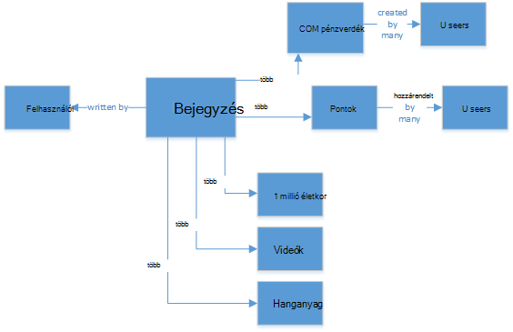

<properties
    pageTitle="Mikor érdemes használni a NoSQL viewben SQL |} Microsoft Azure"
    description="Összehasonlíthatja a NoSQL nem relációs megoldások és az SQL-megoldások használatának előnyeit. Megtudhatja, hogy egy Microsoft Azure NoSQL szolgáltatások, például a legjobb SQL Server illeszkedik a levelezés."
    keywords="nosql viewben sql, NoSQL, sql viewben nosql használata"
    services="documentdb"
    documentationCenter=""
    authors="mimig1"
    manager="jhubbard"
    editor=""/>

<tags
    ms.service="documentdb"
    ms.workload="data-services"
    ms.tgt_pltfrm="na"
    ms.devlang="dotnet"
    ms.topic="article" 
    ms.date="06/24/2016"
    ms.author="mimig"/>

# SQL NoSQL viewben

SQL Server és a relációs adatbázisok (RDBMS) már vannak a go adatbázisok 20 év. Nagyobb kötet és az adatok hamar fajták feldolgozása megnövelt kell azonban módosította az adatok tárolására van szükség, alkalmazásfejlesztő jellegét. Ahhoz, hogy ebben az esetben, a Népszerűségi szerzett NoSQL adatbázisok, amelyekben a méretezés eltérő strukturált és strukturálatlan adatokat tároljon. 

NoSQL egy kategóriát az adatbázisok jelentősen eltérnek SQL-adatbázisait. Adatok kezelése rendszerek, amelyek a "Nem SQL" vagy az adatok kezelése, amely tartalmazza a "nem csak SQL" megközelítés hivatkozni NoSQL gyakran használatos. Számos NoSQL kategória, dokumentum-adatbázisok, elsődlegeskulcs-értékének tárolja, oszlop családi tárolók és játék, közösségi, a népszerű graph adatbázisok és IoT alkalmazások technológiákkal.

Ez a cikk célja NoSQL és SQL közötti különbségek Ismerkedjen meg, és a NoSQL és az SQL utolsó lépéseként ajánlott programok a Microsoft-– bevezetés nyújt segítséget.  

## Mikor érdemes használni a NoSQL?

Vegyük tegyük fel, közösségi tetszés szerint elmélyedhet új webhely szeretne összeállítani. Felhasználók létrehozása a bejegyzések és elhelyezése képek, videók és zenét őket. Más felhasználók bejegyzések fűzni, és a bejegyzések értékelése a pontok (tetszésnyilvánítások) ad. A céloldal lesz a hírcsatorna bejegyzéseinek, hogy a felhasználók megosztása és kezelése. 

Igen, hogyan tárolja az adatokat? Ha jártas az SQL, előfordulhat, hogy indítása rajz az alábbihoz hasonló:

Olyan mértékben, hogy jó, de most átgondolni struktúrájának egyszeri bejegyzésbe, és hogyan jelenítheti meg. Ha szeretné megjeleníteni a bejegyzés és a kapcsolódó képeket, a hang, videó, megjegyzések, pontok és felhasználói adatok egy webhely vagy az alkalmazás, végezze el a lekérdezés nyolc JOIN ugyanúgy kell kérnie a tartalmat az kellene. Most már Képzelje el, amely dinamikusan betöltése és a képernyőn megjelenő bejegyzések adatfolyam és, egyszerűen előrejelzésére, ezer lekérdezések és illesztés a feladat végrehajtásához szükséges fog.

Most, segítségével relációs megoldást például SQL Server tárolja az adatokat –, de a másik lehetőség, a egyszerűbbé teszi a megközelítés NoSQL lehetőségek közül. Átalakítása JSON-dokumentumokba a bejegyzés például az alábbi és tárolja őket DocumentDB, az Azure NoSQL dokumentum adatbázis szolgáltatásainak teljesítmény növelése és a teljes bejegyzés több lekérdezést, és nincs illesztések beolvasásához. Egyszerűbb, további egyértelmű, és további performant eredménye.

    {
        "id":"ew12-res2-234e-544f",
        "title":"post title",
        "date":"2016-01-01",
        "body":"this is an awesome post stored on NoSQL",
        "createdBy":User,
        "images":["http://myfirstimage.png","http://mysecondimage.png"],
        "videos":[
            {"url":"http://myfirstvideo.mp4", "title":"The first video"},
            {"url":"http://mysecondvideo.mp4", "title":"The second video"}
        ],
        "audios":[
            {"url":"http://myfirstaudio.mp3", "title":"The first audio"},
            {"url":"http://mysecondaudio.mp3", "title":"The second audio"}
        ]
    }

Ezeken kívül az adatok lehet particionálni bejegyzés azonosító lehetővé teszi az adatok méretezni természetesen és kihasználhatja NoSQL skála jellemzők alapján. NoSQL rendszerek lehetővé teszi a fejlesztők lazábbá tehető egységesebb és könnyen hozzáférhető alkalmazások felajánl.  Végül a megoldás nincs szükség a fejlesztők meghatározása, kezelése és az adatok réteg gyors közelítés engedélyezése séma kezelése.

Kattintson a megoldás más Azure szolgáltatás használatával épülnek:

- [Azure keresés](https://azure.microsoft.com/services/search/) engedélyezése a felhasználók bejegyzéseit keresése a web app keresztül használható.
- [Azure alkalmazás Services](https://azure.microsoft.com/services/app-service/) használható alkalmazások és háttérfolyamatok tárolni.
- [Azure Blob-tárolóhoz](https://azure.microsoft.com/services/storage/) használható teljes felhasználói profilok, beleértve a képeket tárolja.
- [Azure SQL-adatbázis](https://azure.microsoft.com/services/sql-database/) nagy mennyiségű adat, például a bejelentkezési adatok és használati adatainak tárolására használható.
- [Azure gépi tanulási](https://azure.microsoft.com/services/machine-learning/) ismeretek és intelligenciával kapcsolatos funkciók, amelyek képesek visszajelzést adhat a folyamat és előadása a megfelelő tartalmat a megfelelő felhasználók súgó létrehozásához használható.

A közösségi tetszés szerint elmélyedhet webhely egyike csak egy helyzetleírás NoSQL adatbázis nem a megfelelő adatmodellt a feladathoz. Ha ebben az esetben és az adatok minta DocumentDB közösségi hálózat alkalmazásokban kapcsolatban további olvasási érdekli, olvassa el a [közösségi DocumentDB az Áttekintés](documentdb-social-media-apps.md)című témakört. 

## NoSQL viewben SQL összehasonlítása

Az alábbi táblázat a fő különbségeiről NoSQL SQL hasonlítja össze. 

Ha NoSQL adatbázis legjobban az igényeinek, folytassa a következő szakaszban olvashat a rendelkezésre álló az Azure NoSQL szolgáltatásokat. Ha egy SQL-adatbázis legjobb igényeinek, ugorjon [Mik azok a Microsoft SQL-ajánlataiban?](#what-are-the-microsoft-sql-offerings)

## Mik azok a Microsoft Azure NoSQL ajánlataiban?

Azure négy teljes körű felügyelt NoSQL szolgáltatásokat foglalja magában: 

- [Azure DocumentDB](https://azure.microsoft.com/services/documentdb/)
- [Azure Táblatárolója](https://azure.microsoft.com/services/storage/)
- [Azure HBase HDInsight részeként](https://azure.microsoft.com/services/hdinsight/)
- [Azure vgx.dll gyorsítótár](https://azure.microsoft.com/services/cache/)

A következő összehasonlító diagram meg az egyes szolgáltatásokhoz a fő differentiators rendeli hozzá. Melyiket amelyik a legpontosabban ismerteti az alkalmazás igényeinek megfelelően? 

Ha az alábbi szolgáltatások közül egy vagy több előfordulhat, hogy felel meg az alkalmazás az igényeinek, ismerje meg az alábbi forrásokat: 

- [DocumentDB tanulási javaslat](https://azure.microsoft.com/documentation/learning-paths/documentdb/) és [DocumentDB használjon esetekben](documentdb-use-cases.md)
- [Első lépések az Azure táblatárolóhoz](../storage/storage-dotnet-how-to-use-tables.md)
- [Mi az a HDInsight HBase](../hdinsight/hdinsight-hbase-overview.md)
- [Tanulási javaslat gyorsítótár vgx.dll](https://azure.microsoft.com/documentation/learning-paths/redis-cache/)

Ingyenes próbaverzió információt, majd nyissa meg a [következő lépések](#next-steps) .

## Mik azok a Microsoft SQL-ajánlataiban?

A Microsoft SQL-ajánlataiban öt magában: 

- [Azure SQL-adatbázis](https://azure.microsoft.com/services/sql-database/)
- [Azure virtuális gépeken futó SQL Server](https://azure.microsoft.com/services/virtual-machines/sql-server/)
- [Az SQL Server](https://www.microsoft.com/server-cloud/products/sql-server-2016/)
- [Az SQL Azure-adatraktár (előzetes verzió)](https://azure.microsoft.com/services/sql-data-warehouse/)
- [Elemzési Platform rendszer (a helyszíni készülék)](https://www.microsoft.com/en-us/server-cloud/products/analytics-platform-system/)

Ha az SQL Server egy virtuális gépen vagy SQL-adatbázis érdekli, olvassa el [Válassza az SQL Server lehetőség felhő: (PaaS) Azure SQL-adatbázis vagy SQL Server Azure VMs (IaaS)](../sql-database/sql-database-paas-vs-sql-server-iaas.md) a kettő közötti különbségekről olvashat.

Ha SQL hangok elégedett a legjobb megoldást, majd folytassa [Az SQL Server](https://www.microsoft.com/server-cloud/products/) bővebb információkat, hogy milyen a Microsoft SQL-termékek és szolgáltatások vannak kínálnak.

Kattintson [a következő lépések](#next-steps) az ingyenes próbaverziót és értékelési hivatkozások.

## Következő lépések

Azt meghívása, ha többet szeretne tudni az SQL- és NoSQL termékei ki szeretné próbálni őket az ingyenes szerint. 

- Az összes Azure-szolgáltatások is regisztrálhat egy [ingyenes próbaverziója hónap](https://azure.microsoft.com/pricing/free-trial/) és fogadhatja $200, hogy mennyit költsön az Azure szolgáltatások közül.
    - [Azure DocumentDB](https://azure.microsoft.com/services/documentdb/)
    - [Azure HBase HDInsight részeként](https://azure.microsoft.com/services/hdinsight/)
    - [Azure vgx.dll gyorsítótár](https://azure.microsoft.com/services/cache/)
    - [Az SQL Azure-adatraktár (előzetes verzió)](https://azure.microsoft.com/services/sql-data-warehouse/)
    - [Azure SQL-adatbázis](https://azure.microsoft.com/services/sql-database/)
    - [Azure Táblatárolója](https://azure.microsoft.com/services/storage/)

- Léptetőnyíl vezérlőelem egy [SQL Server 2016 virtuális gépen próbaverziója](https://azure.microsoft.com/marketplace/partners/microsoft/sqlserver2016ctp33evaluationwindowsserver2012r2/) felfelé, vagy egy [SQL Server próbaverziója](https://www.microsoft.com/en-us/evalcenter/evaluate-sql-server-2016)letöltése.
    - [Az SQL Server](https://www.microsoft.com/server-cloud/products/sql-server-2016/)
    - [Azure virtuális gépeken futó SQL Server](https://azure.microsoft.com/services/virtual-machines/sql-server/)

