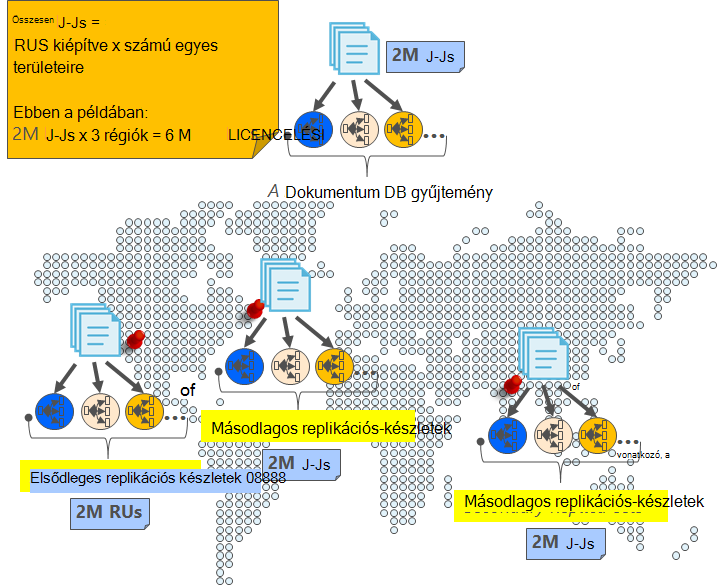
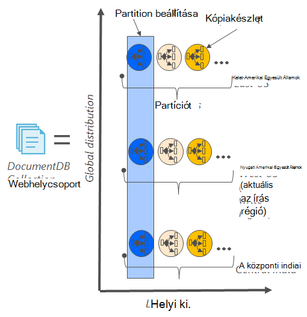
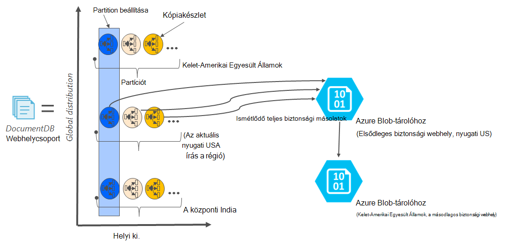

<properties
    pageTitle="Online biztonsági mentése és visszaállítása a DocumentDB |} Microsoft Azure"
    description="Megtudhatja, hogy miként végezze el az automatikus biztonsági mentés és visszaállítás NoSQL adatbázisok Azure DocumentDB együtt."
    keywords="biztonsági mentési és visszaállítási, online biztonsági mentése"
    services="documentdb"
    documentationCenter=""
    authors="RahulPrasad16"
    manager="jhubbard"
    editor="monicar"/>

<tags
    ms.service="documentdb"
    ms.workload="data-services"
    ms.tgt_pltfrm="na"
    ms.devlang="multiple"
    ms.topic="article"
    ms.date="09/23/2016"
    ms.author="raprasa"/>

# Az automatikus online biztonsági mentése és visszaállítása a DocumentDB 

Azure DocumentDB automatikusan megnyitja az összes adat biztonsági másolatok rendszeres időközönként. Az automatikus biztonsági mentést kell venni a teljesítmény és a NoSQL adatbázis-műveletek elérhetőségének módosítása nélkül. A biztonsági másolatok tárolódnak külön-külön egy másik tárhelyszolgáltatáshoz, és ezeket a biztonsági másolatok globálisan replikált tűrőképessége területi katasztrófák ellen. Ha véletlenül töröl a DocumentDB webhelycsoport, majd később szükség adatok helyreállítás vagy katasztrófa helyreállítási megoldást szánt esetek az automatikus biztonsági mentést.  

Ez a cikk az adatok redundancia és elérhetőség az DocumentDB egy rövid recap kezdődik, és ismerteti, hogy a biztonsági másolatok. 

## A DocumentDB – egy recap magas elérhetősége

DocumentDB lett tervezve [globálisan elosztott](documentdb-distribute-data-globally.md) : lehetővé teszi, hogy átviteli méretezni feladatátvevő és a átlátszó több webhelykezelési API-alapú házirend együtt több Azure területek között. Egy adatbázis-rendszer [99.99 % elérhetősége SLA](https://azure.microsoft.com/support/legal/sla/documentdb/v1_0/)kínáló DocumentDB az összes írások áll tartósan lekötött helyi lemezen a helyi adatok központon belül kópiák határozatképességének által az ügyfélnek igazolása előtt. Ne feledje, hogy az DocumentDB magas elérhető helyi tároló támaszkodik nem minden olyan külső tároló technológiák függ. Emellett az adatbázis-fiókja társítva egynél több Azure régió, ha a írások vannak replikált, valamint egyéb területek között. Ha át kívánja méretezni az átviteli és az access-adatok a alacsony késések, számos olvasni, ha szeretne a adatbázis-fiókjához tartozó régiók is. Mindegyik olvasási régióban (replikált) adatok tartósan állandó egy keresztül.  

Ahogy az alábbi ábra szemlélteti, egy egyetlen DocumentDB gyűjteménye [vízszintesen particionálva](documentdb-partition-data.md). A következő diagram egy körének "Partíciót" helyén, és egyes partíciók elérhetővé válik a nagyon keresztül egy. Ez az egyetlen Azure területet (az X tengely lel) helyi megosztásáról. Ezután van a további, minden partíciót (a megfelelő kópiakészlet) globálisan elosztva az adatbázis-fiókkal (például régiókban ezt a három ábra – kelet-Amerikai Egyesült Államok, a nyugati USA-beli és a központi indiai) társított több területre. A "partíciót beállítása" globálisan elosztott van entitás alkotó példányok az adatok minden régióban (az Y tengely lel). Prioritást rendelhet a régiók a adatbázis-fiókjához tartozó és DocumentDB fog átlátszó katasztrófa esetén a következő terület áttérni. Manuálisan is szimulálhatja áttérni tesztelje az alkalmazás a végpontok közötti elérhetőségét.  

Az alábbi képen a DocumentDB redundancia magas fokú mutatja be.

## Teljes, automatikus, online biztonsági másolatok

Oops a törölt webhelycsoport vagy a adatbázis! A DocumentDB nem csak az adatokat, de az adatok másolatait is nagyon felesleges és rugalmassá területi katasztrófák. Ezek az automatikus biztonsági mentés körülbelül négy óránként jelenleg venni. 

A biztonsági másolatok kell venni a teljesítmény és elérhetőség az adatbázis-műveletek módosítása nélkül. DocumentDB megnyitja a biztonsági mentés a háttérben fut, a kiépített RUs használata más vagy a teljesítményt befolyásoló és az NoSQL adatbázis elérhetőségének módosítása nélkül. 

Az automatikus biztonsági mentést eltérően a DocumentDB belül tárolt adatokhoz Azure Blob-tárolóhoz szolgáltatásban tárolja. A kis késés/hatékony feltöltés zökkenőmentes, a biztonsági másolat pillanatképét feltöltött Azure blobtárolóhoz ugyanabban a régióban DocumentDB adatbázis-fiókját az aktuális írási terület szerint egy példánya. Tűrőképessége területi katasztrófa ellen az adatok biztonsági másolatának Azure Blob-tárolóban lévő minden pillanatképét újra replikált keresztül geo felesleges tároló (GRS) másik területére. Az alábbi ábra mutatja, hogy egy távoli Azure Blob-tárolóhoz fiókban nyugati USA-beli mentésben a teljes DocumentDB gyűjtemény (ha az összes három elsődleges partíciót nyugati Amerikai Egyesült Államokban, ebben a példában), és majd GRS replikált kelet us. 

Az alábbi képen GRS Azure-tárolóban lévő összes DocumentDB entitás periodikus teljes másolatait mutatja be.

## Egy adott pillanatképet az adatmegőrzési időszak

Fentebb ismertetett azt rendszeres időközönként pillanatképek az adatok és a megfelelőség szabályok című azt fenntartja a legújabb Pillanatkép mentése előtt ahányat kap törölve 90 napon. Ha a webhelycsoport vagy a fiók törlődik, DocumentDB az utolsó biztonsági másolat 90 napig tárolja.

## Adatbázis visszaállítása biztonsági másolatból online

Abban az esetben, ha véletlenül töröl az adatok, [egy támogatási jegyek fájl](https://portal.azure.com/?#blade/Microsoft_Azure_Support/HelpAndSupportBlade) vagy is [Azure az ügyfélszolgálat](https://azure.microsoft.com/support/options/) visszaállíthatja az adatokat a legutolsó automatikus biztonsági mentés. A biztonsági másolat készítése visszaállíthatók adott pillanatképét DocumentDB igényel, hogy az adatokat az adott pillanatkép biztonsági út időtartama legalább találhatók meg velünk volt.

## Következő lépések

Az NoSQL adatbázis több adatközpontokban a replikáció, olvassa el [a adatokat globálisan DocumentDB terjesztése](documentdb-distribute-data-globally.md). 

Fájl partnernek Azure-támogatási, [az Azure portálról jegy fájlt](https://portal.azure.com/?#blade/Microsoft_Azure_Support/HelpAndSupportBlade).