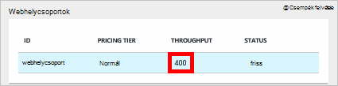

<properties
    pageTitle="A DocumentDB teljesítményszint |} Microsoft Azure"
    description="Tudjon meg többet hogyan teljesítményszint a DocumentDB lehetővé teszi azok lefoglalása egy webhelycsoport alapon kapacitása."
    services="documentdb"
    authors="mimig1"
    manager="jhubbard"
    editor="monicar"
    documentationCenter=""/>

<tags
    ms.service="documentdb"
    ms.workload="data-services"
    ms.tgt_pltfrm="na"
    ms.devlang="na"
    ms.topic="article"
    ms.date="08/26/2016"
    ms.author="mimig"/>

# A DocumentDB teljesítményszint

Ez a cikk a [Microsoft Azure DocumentDB](https://azure.microsoft.com/services/documentdb/)teljesítményszint áttekintést nyújt.

Ez a cikk elolvasása, után is az alábbi kérdésekre választ:  

-   Mi az a teljesítményszint?
-   Hogyan átviteli fenntartott egy adatbázis-fiókot?
-   Hogyan működnek a teljesítményszint?
-   Hogyan tapasztalok számlát kapni a teljesítményszint?

## Teljesítményszint – bevezetés

Minden egyes létrehozott fióktulajdonos csoportjában DocumentDB webhelycsoport van egy társított teljesítményszint kiépítve. Az adatbázis minden egyes webhelycsoport beállíthatja, hogy egy másik teljesítményszint lehetővé teszi, hogy kijelöli a gyakran használt gyűjtemény és a ritkán használt gyűjtemények átviteli kisebb további kapacitása. DocumentDB mindkét felhasználói teljesítményszint támogatja, és előre definiált teljesítményszint.  

Minden egyes teljesítményszint-os egy társított [kérelem egység (Licencelési)](documentdb-request-units.md) ráta érvényes. Ez a teljesítmény szintekre alapján gyűjtemény lefoglalt átviteli, és érhető el, hogy a webhelycsoport által használt kizárólag.

<table border="0" cellspacing="0" cellpadding="0">
    <tbody>
        <tr>
            <td valign="top">

</td>
            <td valign="top">
Részletek
</td>
            <td valign="top">
Átviteli korlátai
</td>
            <td valign="top">
Tárterületkorlátok
</td>
            <td valign="top">
Verzió
</td>
            <td valign="top">
API-hoz
</td>            
        </tr>
        <tr>
            <td valign="top">
Felhasználó által definiált teljesítmény
</td>
            <td valign="top">
Tárterület GB alapján használatát forgalmi.

Átviteli 100 Licencelési/s mértékegysége
</td>
            <td valign="top">
Korlátlan. 400 – 250,000 kérjen erőforrás-mennyiség/s alapértelmezett (magasabb igényei szerint)
</td>
            <td valign="top">
Korlátlan. 250 GB (igényei szerint magasabb) alapértelmezés szerint 
</td>
            <td valign="top">
V2
</td>
            <td valign="top">
A Skype 2015 API-12-16 és újabb
</td>  
        </tr>
        <tr>
            <td valign="top">
Előre definiált teljesítmény
</td>
            <td valign="top">
Tárhely foglalt 10 gigabájtos Korlátot.

S1 = 250 Licencelési/s, S2 = 1000 Licencelési/s, S3 = 2 500 Licencelési/s
</td>
            <td valign="top">
2 500 Licencelési/s
</td>
            <td valign="top">
10 GB
</td>
            <td valign="top">
V1
</td>
            <td valign="top">
Bármely
</td>  
        </tr>        
    </tbody>
</table>                

Az adatbázis-műveletek, többek között a lekérdezéseket, a felhasználó által definiált függvények (UDF), lekérdezések, tárolt eljárások és indítók széles körű DocumentDB tesz lehetővé. Ezek a műveletek társított feldolgozás költsége alapú Processzor, IO és a művelet befejezéséhez szükséges memória változhatnak. Ehelyett gondolat és kezelése a hardver-erőforrások, mint az erőforrásokhoz tartozó egyetlen intézkedés kérelem egység érdemes elképzelnie szükséges feladatokat hajtanak végre különféle adatbázis és szolgáltatási kérelem felkérés.

A [Microsoft Azure-portálon](https://portal.azure.com), a [REST API -t](https://msdn.microsoft.com/library/azure/mt489078.aspx) vagy a [DocumentDB SDK](https://msdn.microsoft.com/library/azure/dn781482.aspx)bármelyikét keresztül gyűjtemények hozhat létre. A DocumentDB API-k gyűjtemény a teljesítmény szint megadását teszi lehetővé.

> [AZURE.NOTE] A gyűjtemény teljesítményszint módosítható az API-hoz vagy a [Microsoft Azure-portálon](https://portal.azure.com/)keresztül. 3 percen belül befejezéséhez teljesítmény webhelyszintű módosításokat végezhet várható.

## Webhelycsoportok teljesítményszint beállítása
A webhelycsoport létrehozása után a kijelölt teljesítményszint alapján RUs teljes megoszlása a gyűjtemény vannak fenntartva.

Figyelje meg, hogy a felhasználó által definiált és az előre definiált teljesítmény szintekhez DocumentDB működik átviteli fenntartása alapján. Egy webhelycsoport létrehozásával az alkalmazások lefoglalt, illetve fenntartott átviteli függetlenül, hogy mennyi adott átviteli aktívan használja a számlázott. Felhasználó által definiált teljesítményszint tárolására van forgalmi felhasználás alapján, de az előre definiált teljesítményszint, a webhelycsoport létrehozása idején 10 GB-nyi tárhelyet van fenntartva.  

Webhelycsoportok létrehozása után módosíthatja a teljesítményszint a DocumentDB SDK vagy az Azure klasszikus portálon keresztül.

> [AZURE.IMPORTANT] DocumentDB Standard gyűjtemények vannak számlát kapni a egy óradíj értéket, és minden egyes webhelycsoport hoz létre egy minimális egy órával a használatát fog számlát kapni.

Ha úgy módosítja a teljesítményszint után egy órával gyűjtemény, számlázható a legmagasabb teljesítményt szint beállítása során az órát. Például ha a teljesítmény növelése 8:53: am a gyűjtemény, ráterheljük az új szint kezdve 8:00 de. Hasonlóképpen ha csökkenti a teljesítményszint: 8:53 am, az új ráta fog vonatkozni a 9:00 de.

Kérés egységek minden alapján a teljesítmény szint beállítása webhelycsoport számára fenntartott. Kérés egység felhasználás kiértékelése egy második ráta per. Alkalmazásokat, amelyekre a kiépített kérelem egység ráta (vagy teljesítményszint) a gyűjtemény fog szabályozott, amíg a ráta fenntartott szint, hogy a gyűjtemény alatti esik. Ha az alkalmazás átviteli magasabb szintű van szüksége, az egyes szintjének a teljesítmény növelésével.

> [AZURE.NOTE] Amikor az alkalmazás egy vagy több webhelycsoport teljesítményszint meghaladja, a program egy webhelycsoport alapon szabályozott kéréseket. Ez azt jelenti, hogy egyes alkalmazás kérések sikerülhet, míg mások esetleg szabályozott. Az ismétlések, amikor annak érdekében, hogy kezelje a kérelem forgalom kiugrásainak megfelelő szabályozott kisszámú hozzáadása ajánlott.

## Teljesítményszint használata
DocumentDB gyűjtemények csoportosíthatja az adatokat, a lekérdezés mintázatok és a teljesítmény az alkalmazás igényeinek megfelelően alapján teszi lehetővé. A DocumentDB's Automatikus indexelés és a lekérdezések támogatását általában igazán eltérő dokumentumok ugyanazt a webhelycsoporton belüli helymegosztást. A fő megfontolások annak eldöntésében, hogy külön gyűjtemények használják-e a következők:

- Lekérdezések – egy webhelycsoport a lekérdezés-végrehajtási hatókörét. Ha olyan lekérdezése kell a lehető leghatékonyabb olvasási mintázatok egyetlen gyűjtemény helymegosztást dokumentumok származik.
- Tranzakciók – az összes tranzakció egyetlen gyűjtemény belül az korlátozódik. Ha egyetlen tárolt eljárás vagy eseményindító kell frissíteni a dokumentumok, azokat egy webhelycsoporton belüli kell tárolni. Pontosabban egy partíciót egy webhelycsoport belül kulcsa a tranzakciók határérték. További információt [a DocumentDB particionálására](documentdb-partition-data.md) című.
- Teljesítmény elkülönítési – a gyűjtemény egy társított teljesítményszint tartalmaz. Ezzel biztosíthatja, hogy egyes van-e egy kiszámíthatóan teljesítmény fenntartott RUs keresztül. Adatok kiosztható különböző gyűjtemények, a különböző teljesítményszint access gyakoriság alapján.

> [AZURE.IMPORTANT] Fontos, hogy az alkalmazás által létrehozott gyűjtemények száma alapján teljes szabványos kamatlába számlázható megértéséhez.

Azt ajánljuk, hogy van-e az alkalmazás használata gyűjtemények kisszámú nagy tároló vagy átviteli követelmények működött. Győződjön meg arról, hogy jól érthető alkalmazás mintázatok új webhelycsoportok létrehozását. Előfordulhat, hogy az alkalmazás kívül kezeli management műveletként webhelycsoport létrehozása lefoglalása választhatja. Hasonlóképpen a gyűjtemény teljesítményszint eredményhez tartozó változik a óradíj értéket, amelynél a webhelycsoport számlát kapni. Webhelycsoport teljesítményszint kell figyelni, ha az alkalmazás dinamikusan igazítása ezeket.

## A felhasználó által definiált teljesítmény S1, S2, S3 átállítása

Kövesse ezeket a lépéseket követve módosíthatja az előre definiált átviteli szintek használatával a felhasználó által definiált átviteli szintekre az Azure-portálon. Felhasználó által definiált átviteli szintek használatával szabja testre a átviteli igényeinek. És ha S1 fiók továbbra is használ, az alapértelmezett átviteli 250 Licencelési/s 400 Licencelési/s mindössze néhány kattintással növelheti.

A módosítások árak kapcsolódó felhasználói és előre definiált átviteli kapcsolatos további tudnivalókért lásd a a blogbejegyzésből [DocumentDB: az új árak beállításokkal kapcsolatos tudnivalók a szolgáltatás](https://azure.microsoft.com/blog/documentdb-use-the-new-pricing-options-on-your-existing-collections/).

> [AZURE.VIDEO changedocumentdbcollectionperformance]

1. A böngészőben nyissa meg az [**Azure-portálon**](https://portal.azure.com).
2. Kattintson a **Tallózás** -> **DocumentDB fiókok**, majd jelölje ki a módosítandó DocumentDB-fiókot.   
3. Az **adatbázisok** Lens módjai között jelölje ki a módosítandó az adatbázist, és az **adatbázis** lap, válassza a gyűjtemény módosítása. Előre definiált átviteli fiókot egy S1, S2 vagy S3 árak szint rendelkezik.

      

4. A **webhelycsoportok** lap kattintson az **Egyebek**, majd **Beállítások** felső sávon.   
5. A **Beállítások** lap a **Réteg árak** gombra, és figyelje meg, hogy az egyes terv havi költségbecslés a **Válassza ki a árak réteg** lap jelenik meg. Felhasználó által definiált átviteli módosításához kattintson a **normál**gombra, és kattintson a **Jelölje ki** a módosításainak mentéséhez gombra.

      

6. A **Beállítások** lap a **Réteg árak** megfelelően módosul **szabványos** , és a **átviteli (Licencelési/s)** mezőben 400 alapértelmezett érték jelenik meg. A átviteli közötti 400 és 10 000 [egység kérése](documentdb-request-units.md)beállítása /second (Licencelési/s). Az **Összefoglaló árak** az oldal alján automatikusan frissíti a havi költség becslése megadását. Kattintson az **OK gombra** a módosítások mentéséhez.

    

7. Jelentkezzen be az **adatbázis** lap ellenőrizheti a gyűjtemény az új kapacitása.

    

Ha úgy dönt, hogy szüksége van további átviteli (nagyobb, mint 10 000 Licencelési/s) vagy további tárterület (10GB-nál nagyobb) particionált gyűjtemény hozhat létre. Particionált gyűjtemény létrehozásához, olvassa el a [egy webhelycsoport létrehozása](documentdb-create-collection.md)című témakört.

>[AZURE.NOTE] Egy webhelycsoport teljesítmény szintek módosítása 2 percig tart.

## A .NET SDK használatával teljesítményszint módosítása

A webhelycsoportok teljesítményszint módosításának alternatíva a SDK keresztül. Ez csak a rész a [.NET SDK](https://msdn.microsoft.com/library/azure/dn948556.aspx)használatával egy webhelycsoport teljesítményszint módosítása, de a többi [SDK](https://msdn.microsoft.com/library/azure/dn781482.aspx)hasonló a folyamat. Ha nem a .NET SDK, látogasson el az [első lépések az oktatóprogram](documentdb-get-started.md).

Az alábbiakban az ajánlat átviteli megtekinthetővé 50 000 kérelem mennyiség / szekundum kódtöredék:

    //Fetch the resource to be updated
    Offer offer = client.CreateOfferQuery()
                      .Where(r => r.ResourceLink == collection.SelfLink)    
                      .AsEnumerable()
                      .SingleOrDefault();

    // Set the throughput to 5000 request units per second
    offer = new OfferV2(offer, 5000);

    //Now persist these changes to the database by replacing the original resource
    await client.ReplaceOfferAsync(offer);

    // Set the throughput to S2
    offer = new Offer(offer);
    offer.OfferType = "S2";

    //Now persist these changes to the database by replacing the original resource
    await client.ReplaceOfferAsync(offer);

> [AZURE.NOTE] A gyűjtemények területen 10 000 kérelem mennyiség / kiépítve második telepíthető át a felhasználó által definiált átviteli ajánlatok és az előre definiált átvitel (S1, S2, S3) bármikor között. Webhelycsoportok, amely fölött 10 000 kérelem mennyiség / kiépítve második nem alakítható előre definiált átviteli szintre.

Keresse fel az [MSDN](https://msdn.microsoft.com/library/azure/microsoft.azure.documents.client.documentclient.aspx) további példákat mutat be, és a további tudnivalók az ajánlat módszereket:

- [**ReadOfferAsync**](https://msdn.microsoft.com/library/azure/microsoft.azure.documents.client.documentclient.readofferasync.aspx)
- [**ReadOffersFeedAsync**](https://msdn.microsoft.com/library/azure/microsoft.azure.documents.client.documentclient.readoffersfeedasync.aspx)
- [**ReplaceOfferAsync**](https://msdn.microsoft.com/library/azure/microsoft.azure.documents.client.documentclient.replaceofferasync.aspx)
- [**CreateOfferQuery**](https://msdn.microsoft.com/library/azure/microsoft.azure.documents.linq.documentqueryable.createofferquery.aspx)

## A gyűjtemény átviteli módosítása

Ha már használja a teljesítmény felhasználó által definiált, módosíthatja a webhelycsoport átviteli az alábbiak szerint. Ha szüksége módosítása egy S1, S2 vagy S3 teljesítményszint (előre definiált teljesítmény) a felhasználó által definiált teljesítmény, lásd: [S1, S2, a felhasználó által definiált teljesítmény S3 módosítása](#changing-performance-levels-using-the-azure-portal).

1. A böngészőben nyissa meg az [**Azure-portálon**](https://portal.azure.com).
2. Kattintson a **Tallózás** -> **DocumentDB fiókok**, majd jelölje ki a módosítandó DocumentDB-fiókot.   
3. **DocumentDB fiók** fel az **adatbázisok** lens jelölje ki a módosítandó az adatbázist, és az **adatbázis** lap, válassza a gyűjtemény módosítása.
4. Kattintson a **webhelycsoportok** lap **Beállítások** felső sávon.   
5. A **Beállítások** lap növelje a **átviteli (Licencelési/s)** mezőben, és kattintson az **OK gombra** kattintva mentheti a módosításokat. A lap alján az **Összefoglaló árak** frissíti mutatja, hogy az új becsült havi költséget, hogy a webhelycsoport egyetlen területen.

    

Ha nem biztos abban, hogy mennyi növelheti a teljesítményt, [Estimating átviteli van szüksége](documentdb-request-units.md#estimating-throughput-needs) , és a [egység Számológép kérése](https://www.documentdb.com/capacityplanner)témakörben talál.

## Következő lépések

Többet szeretne tudni a árak, és az Azure DocumentDB adatok kezelése, hogy az alábbi források:

- [DocumentDB árak](https://azure.microsoft.com/pricing/details/documentdb/)
- [DocumentDB kapacitás kezelése](documentdb-manage.md)
- [Modellezési DocumentDB az adatok](documentdb-modeling-data.md)
- [Adatok DocumentDB szétválasztás](documentdb-partition-data.md)
- [Erőforrás-mennyiség kérése](http://go.microsoft.com/fwlink/?LinkId=735027)

DocumentDB olvashat az Azure DocumentDB- [dokumentáció](https://azure.microsoft.com/documentation/services/documentdb/)talál.

A méretezés és teljesítményének a DocumentDB tesztelésekor, című cikkben ismerkedhet [Teljesítmény és a méretezés az Azure DocumentDB vizsgálat](documentdb-performance-testing.md).

[1]: ./media/documentdb-performance-levels/documentdb-change-collection-performance7-9.png
[2]: ./media/documentdb-performance-levels/documentdb-change-collection-performance10-11.png
