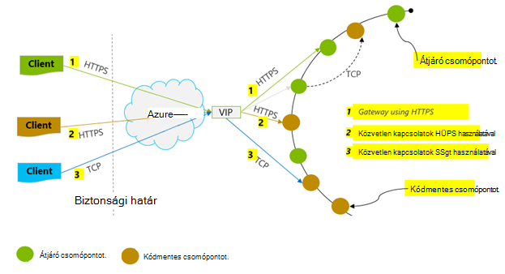
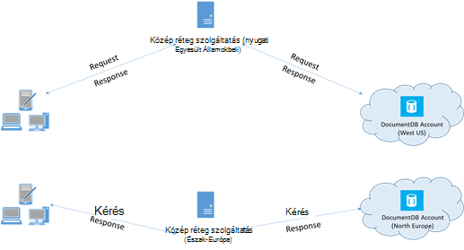

<properties 
    pageTitle="DocumentDB látható tippeket |} Microsoft Azure" 
    description="Ismerje meg az ügyfél konfigurációs beállításai Azure DocumentDB adatbázis teljesítmény javítása érdekében"
    keywords="Hogyan adatbázis a teljesítmény javítása érdekében"
    services="documentdb" 
    authors="mimig1" 
    manager="jhubbard" 
    editor="" 
    documentationCenter=""/>

<tags 
    ms.service="documentdb" 
    ms.workload="data-services" 
    ms.tgt_pltfrm="na" 
    ms.devlang="na" 
    ms.topic="article" 
    ms.date="10/17/2016" 
    ms.author="mimig"/>

# Tippek a teljesítmény DocumentDB

Azure DocumentDB gyors és rugalmas elosztott adatbázis, amelynek garantált időtartama és átviteli zökkenőmentes méretezze át. Nem rendelkezik fő architektúra módosításához, vagy ha át kívánja méretezni, az adatbázis DocumentDB összetett kódírás. Méretezés felfelé és lefelé akkor ugyanolyan egyszerű, mint egy egyetlen API-hívást, és [hívja SDK módszer](documentdb-performance-levels.md#changing-performance-levels-using-the-net-sdk)tétele. DocumentDB hálózati hívások keresztül érhető el, mivel vannak azonban olyan ügyféloldali optimalizálásokat teheti csúcs teljesítmény elérése érdekében.

Így mintaüzenetet "Hogyan javítható az adatbázis teljesítményét?" Vegye figyelembe az alábbiakat:

## Hálózati

1. **Kapcsolat házirendje: közvetlen kapcsolat üzemmód használata**
    
    Egy ügyfél kapcsolódását Azure DocumentDB van fontos következmények teljesítmény, különösen értelmez megfigyelt ügyféloldali késés. Két fő konfigurációs beállítások áll rendelkezésre az ügyfél kapcsolati házirend – a csatlakozási *mód* és a [kapcsolat *Protocol (protokoll)*](#connection-protocol)beállításával.  Kétféleképpen érhető el a következők:

    1. Átjáró mód (alapértelmezett)
    2. Közvetlen mód

    DocumentDB rendszer elosztott tárhely, mivel DocumentDB erőforrások, mint a webhelycsoportok vannak particionálva számos gépek között, és minden partíciót van replikált magas elérhetőség. Fizikai címfordítást logikai maradjanak útválasztási táblázat, amely szintén belső elérhető erőforrásként.

    Átjáró módban a DocumentDB átjáró gépek hajtsa végre a továbbítás, téve az ügyfél-kódot úgy, hogy a egyszerű és tömör. Ügyfélalkalmazás kérések hibák az átjáró DocumentDB gépek, mely a logikai URI az értekezlet-összehívást a kódmentes csomópont fizikai címét a fordítás, és továbbítja a kérelmet megfelelően.  Viszont közvetlen módban ügyfelek kell karbantartása – rendszeresen frissítése – a útválasztási tábla másolatának és közvetlenül csatlakozhat az kódmentes DocumentDB csomópontok.

    Átjáró mód minden SDK platformon támogatott, és a beállított alapértelmezett.  Ha az alkalmazás futtatása a vállalati hálózaton belül szigorú tűzfal korlátozásokkal átjáró módja a legjobb választás óta használja a szabványos HTTPS-port és egy végpontot. A teljesítmény útján azonban, hogy az átjáró mód érint egy további hálózati azonosítható minden alkalommal adatok elolvasásáról vagy DocumentDB írni.   Emiatt közvetlen kínál miatt kevesebb hálózati Ugrás jobb teljesítményt.

2. **Kapcsolat házirendje: a TCP protokoll használatára**

    Feljebb helyezése közvetlen mód, ha két lehetőség protokoll érhető el:

    - TCP
    - HTTPS

    DocumentDB egy egyszerű kínál, és nyissa meg a RESTful programozási modell HTTPS. Emellett az általa kínált egy hatékony TCP protokoll, amely is RESTful a kapcsolati modell és a .NET-ügyfél SDK keresztül érhető el. Közvetlen TCP- és a HTTPS SSL használata a kezdeti hitelesítési és titkosítási forgalmat. A legjobb teljesítmény elérése érdekében lehetőség szerint a TCP protokollt használja. 

    Amikor TCP átjáró módban, TCP Port 443-as a DocumentDB port, akinek 10250 a MongoDB API port. Amikor TCP közvetlen mód, az átjáró portokon kívül, kell biztosítása érdekében a port 10000 és 20000 közötti nyitva, mert DocumentDB dinamikus TCP-portok használja. Ha ezek nem nyitva legyen, és próbálja meg használni a TCP, a 503 szolgáltatás nem érhető el hibaüzenetet kap. 

    A csatlakozási mód van konfigurálva, a létrehozás ConnectionPolicy paraméter DocumentClient példányának során. Közvetlen üzemmód használata esetén a protokoll is beállítható, hogy a ConnectionPolicy paraméter belül.

        var serviceEndpoint = new Uri("https://contoso.documents.net");
        var authKey = new "your authKey from Azure Mngt Portal";
        DocumentClient client = new DocumentClient(serviceEndpoint, authKey, 
        new ConnectionPolicy
        {
            ConnectionMode = ConnectionMode.Direct,
            ConnectionProtocol = Protocol.Tcp
        });

    Mivel TCP csak támogatja a közvetlen módban, ha átjárón-üzemmód használata az Access, a HTTPS protokollt kommunikálni az átjáró mindig használják, és a protokoll oszlopbeli értéket, a ConnectionPolicy a függvény figyelmen kívül hagyja.

    

3. **Hívás OpenAsync indítási késés első kérésre elkerülése**

    Alapértelmezés szerint az első kérés fog rendelkezni egy újabb késés, mert-ból a cím útválasztási táblából. A indítási késés az első kérésre elkerülése érdekében célszerű hívja OpenAsync() inicializálni során egyszer az alábbi képlettel történik.

        await client.OpenAsync();

4. **A teljesítmény elérése érdekében azonos Azure régióban ügyfelek helymegosztást**

    Ha lehetséges, helyezze DocumentDB hívása ugyanabban a régióban DocumentDB adatbázisként alkalmazásokat. Közelítő összehasonlításra DocumentDB hívások ugyanabban a régióban belül belül 1-2 ms befejezéséhez, de a nyugati és az USA keleti coast között a késés > 50 ms. A késés valószínűleg a igénylésével használatától függően eltérő lehet a útvonalát a kérelmet, továbbítja az ügyféltől az Azure adatközponthoz oszlopazonosító. A legalacsonyabb esetleges késés a hívó alkalmazás található kiépített DocumentDB végpontjának azonos Azure régión belüli biztosításával érhető el. Elérhető régiójában, című témakör [Azure régiók](https://azure.microsoft.com/regions/#services).

    

5. **Szálak/feladatok számának növelése**

    DocumentDB a hívások a hálózaton keresztül, mivel előfordulhat, hogy az ügyfélalkalmazás kérelmek között Várakozás nagyon kis időt tölt eltérő lehet a párhuzamos igényeinek fokú. Ha például használ. NETTÓ meg a [Tevékenység párhuzamos tár](https://msdn.microsoft.com//library/dd460717.aspx)sorrend a tevékenységek DocumentDB írása vagy olvasása 100s létrehozása.

## SDK használatát

1. **A legutóbbi SDK telepítése**

    A DocumentDB SDK a program folyamatosan javítani a legjobb teljesítmény elérése érdekében. Lásd: a legutóbbi SDK megállapítja, és tekintse át a javítása a [DocumentDB SDK](documentdb-sdk-dotnet.md) oldalak. 

2. **Az alkalmazás élettartama egyszeres DocumentDB ügyfél használata**
  
    Figyelje meg, hogy minden DocumentClient példány szál vannak, és hatékony kapcsolat kezelése és a cím gyorsítótárazás közvetlen üzemmódban. Ahhoz, hogy hatékony kapcsolat kezelése és által DocumentClient jobb teljesítményt, ajánlott per AppDomain DocumentClient egyetlen példánya használható az alkalmazás élettartama.

3. **System.Net MaxConnections növelése egy host**

    DocumentDB kérések alapértelmezés szerint készülnek HTTPS/többi fölé, és van kitéve hostname (állomásnév) vagy IP-címe egy alapértelmezett kapcsolat maximális. Előfordulhat, hogy kell beállítania a MaxConnections (100-1000) nagyobb értéket, hogy az ügyfél tár DocumentDB több egyidejű kapcsolatot használhat. A .NET SDK 1.8.0 és a fenti [ServicePointManager.DefaultConnectionLimit](https://msdn.microsoft.com/library/system.net.servicepointmanager.defaultconnectionlimit.aspx) alapértelmezett értéke az 50, és módosítsa az értéket, beállíthatja, hogy a [Documents.Client.ConnectionPolicy.MaxConnectionLimit](https://msdn.microsoft.com/en-us/library/azure/microsoft.azure.documents.client.connectionpolicy.maxconnectionlimit.aspx) nagyobb értéket.  

4. **A párhuzamos lekérdezések particionált gyűjtemények finombeállítása**

     DocumentDB .NET SDK verzió 1.9.0 és támogatási párhuzamos lekérdezéseket, amely lehetővé teszi, hogy a lekérdezés párhuzamosan particionált gyűjtemény fölött (lásd: [a SDK használatáról](documentdb-partition-data.md#working-with-the-sdks) és a kapcsolódó további információk, [mintakódok](https://github.com/Azure/azure-documentdb-dotnet/blob/master/samples/code-samples/Queries/Program.cs) ). A párhuzamos lekérdezések készült lekérdezési időtartama és a teljesítmény javítása a soros megfelelőjük fölé. A párhuzamos lekérdezések adja meg a két paramétereket, hogy a felhasználók is finomhangolása egyéni-Papírméretnyi követelményeik (a) MaxDegreeOfParallelism: szabályozhatja a partíciók maximális száma, mint a szélesség és a (b) MaxBufferedItemCount lekérdezhető: a sorszám előre lehívott eredmények. 
    
    (a) ***hangolása MaxDegreeOfParallelism\: *** 
    lekérdezés works párhuzamos párhuzamosan több partíciót lekérdezésével. Azonban egy egyéni particionált vegyük fel adatokat olvas be sorozatban részletez a lekérdezést. Igen a MaxDegreeOfParallelism beállítása a partíciók száma igazolta a maximális esély elérése a legtöbb performant lekérdezés változatlan marad az összes egyéb rendszer feltétel. Ha nem tudja, hogy a számot a partíciók, beállíthatja, hogy a MaxDegreeOfParallelism magas számra, és a rendszer a minimális (partíciók, a felhasználó által megadott beviteli száma), a MaxDegreeOfParallelism választja ki. 
    
    Fontos tudni, hogy a párhuzamos lekérdezések konzerv legjobb előnyökkel jár, ha az adatok egyenletesen elosztva az összes partíciót a lekérdezés részletez. Ha a particionált gyűjtemény particionált oly módon, hogy vagy annak egy lekérdezés által visszaadott adatok többségét összpontosul néhány partíciót (egy partíciót a legrosszabb eset), majd a lekérdezés teljesítményének volna bottlenecked, ezekről szerint. 
    
    (b) ***hangolása MaxBufferedItemCount\: *** 
    párhuzamos lekérdezés eredménye előre lehívására, az aktuális köteget az eredmények az ügyfél által feldolgozása közben lett tervezve. A lekérdezés teljes időtartama fokozása előre beolvasása segítségével. MaxBufferedItemCount előre lehívott eredmények mennyiségét korlátozni a paraméter értéke. MaxBufferedItemCount eredménye a várt száma (vagy egy nagyobb számot) beállítás lehetővé teszi, hogy a lekérdezés maximális kedvezménye fogadásához előre lekérését. 
    
    Ne feledje, hogy előre beolvasása működési módja a MaxDegreeOfParallelism függetlenül, az összes partíciót adatait egyetlen puffer van.  

5. **Kapcsolja be a kiszolgálóoldali globális Katalógus**
    
    Bizonyos esetekben segíthet a szemétgyűjtő gyakoriságának csökkentése. A .NET [gcServer](https://msdn.microsoft.com/library/ms229357.aspx) beállítás igaz értékű.

6. **Megvalósítása visszalépési RetryAfter időközönként**
 
    Teljesítmény tesztelése során növelni kell betöltés mindaddig, amíg egy kis ráta kérelmek első szabályozott. Szabályozott, ha az ügyfélalkalmazás kell a szabályozási visszalépési a kiszolgáló által meghatározott újrapróbálkozási időköz. A visszalépési tiszteletben biztosítja, hogy töltött próbálkozások közötti várakozási idő minimális összegét. Ismét házirend támogatási megtalálható verziójában 1.8.0 és feletti DocumentDB [.NET](documentdb-sdk-dotnet.md) és [Java](documentdb-sdk-java.md)és verzió 1.9.0 és feletti [Node.js](documentdb-sdk-node.md) és [Python](documentdb-sdk-python.md). További tudnivalókért lásd: [Exceeding fenntartott átviteli korlátozza](documentdb-request-units.md#exceeding-reserved-throughput-limits) és [RetryAfter](https://msdn.microsoft.com/library/microsoft.azure.documents.documentclientexception.retryafter.aspx).

7. **Az ügyfél terhelést méretezése**

    Átviteli magas szintű tesztelése (> 50 000 Licencelési/s), az ügyfélalkalmazás válhat miatt a gép kapacitástól meg a Processzor vagy a hálózati kihasználtsági szűk. Ha ez a pont elér, továbbra is a DocumentDB fiók további leküldéses több kiszolgálón keresztül, a ügyfélalkalmazásokban méretezéssel.

8. **Az alsó olvasási késés gyorsítótár dokumentum URL-címe**

    Gyorsítótár-dokumentum URL-címe, ha lehetséges, akkor a legjobb olvasási teljesítményt.

9. **Az oldalméret lekérdezések/olvasott hírcsatornák jobb teljesítmény finomhangolása**

    Tömeges elvégzéséhez olvasása olvasható használata dokumentumok hírcsatorna funkciók (tehát ReadDocumentFeedAsync) vagy egy DocumentDB SQL-lekérdezés kiállító, amikor a visszaadott eredmény szegmentált módon ha az eredményhalmaz túl nagy. Alapértelmezés szerint 100 elemeket és 1 MB mennyiségű a visszaadott eredmény, amelyik korlát találati első. 

    Célszerű kevesebb hálózati kerekíteni utakat, minden esetben eredmények beolvasásához szükséges, és megnövelheti a oldalméretet, x-ms-max-elemek-száma kérelem fejlécet legfeljebb 1000. Azokban az esetekben, ahol szükséges eredményként csak néhány például a felhasználói felület vagy a program az API csak 10 eredménye találatok egyszerre, csökkentheti a oldalméretet, az elfogyasztott mennyiség megjelenítésére, az Olvasás és a lekérdezések átviteli csökkentése 10.

    Az oldalméret, használja a rendelkezésre álló DocumentDB SDK is megadhat.  Példa:
    
        IQueryable<dynamic> authorResults = client.CreateDocumentQuery(documentCollection.SelfLink, "SELECT p.Author FROM Pages p WHERE p.Title = 'About Seattle'", new FeedOptions { MaxItemCount = 1000 });

10. **Szálak/feladatok számának növelése**

    Lásd: a [beszélgetésekben/feladatok számának növelése](#increase-threads) hálózati szakaszában.

## Az indexelési házirend

1. **Gyorsabb maximális időt bevitel egységdíjakat Lusta indexelés használata**

    DocumentDB lehetővé teszi, hogy az indexelő szabályt, amely lehetővé teszi, hogy adja meg, a dokumentumok indexelni automatikusan, vagy nem a webhelycsoport – a webhelycsoport szintjén – Itt adhatja meg.  Ezeken kívül dönthet úgy is aszinkron (Lusta) index frissítés és a szinkronizált (azonos) között. Alapértelmezés szerint az index frissítése szinkron minden Beszúrás, cseréje vagy törlése a webhelycsoport egy dokumentumot. Szinkron mód lehetővé teszi a lekérdezések azonos [szintű konzisztencia](documentdb-consistency-levels.md) , a dokumentum Olvasás "tájékozódást segíti", hogy az index késedelem nélkül elfogadja.
    
    Lusta indexelés tekinthetők, amelyben adatok írott felszakadásáig felhasználási területei, és a tartalom indexelése hosszabb időszakra vetített állapotával szükséges munka amortize szeretne. Lusta indexelés is lehetővé teszi a kiépített átviteli hatékonyan és írási kérelem szolgálnak csúcs időpontokban minimális válaszidejű. Fontos, hogy ne feledje, hogy Lusta indexelés engedélyezve van, ha lekérdezés eredménye lesz ahányat egységes, függetlenül a DocumentDB fiókok konzisztencia szintjét.

    Így egységes indexelési mód (IndexingPolicy.IndexingMode azonos van állítva) vonz. a legmagasabb kérelem egység díjat per írás közben mód (Lusta IndexingPolicy.IndexingMode beállítása), és nincs indexelés indexelés Lusta (IndexingPolicy.Automatic hamis értékre van állítva) nulla az indexelő költség rendelkezik írási idején.

2. **Gyorsabb írások az indexelő még nem használt elérési utak kizárása**

    DocumentDB meg az indexelési házirend azt is lehetővé teszi, hogy mely dokumentum elérési belefoglalásához vagy kizárásához indexelésből feljebb helyezése indexelés elérési utak (IndexingPolicy.IncludedPaths és IndexingPolicy.ExcludedPaths) szerint adja meg. Elérési út az indexelés e is kínál a továbbfejlesztett írási teljesítménnyel és alsó index tárhely, amelyben a lekérdezés mintázatok ismert előzetesen felhasználási területei, mivel az indexelő költségek közvetlenül a indexelt egyedi elérési utak száma közötti kapcsolatot.  A következő kódot például megmutatja, a dokumentumok teljes szakaszokat (más néven kizárása egy részfa) az indexelő használja a "*" helyettesítő.

        var collection = new DocumentCollection { Id = "excludedPathCollection" };
        collection.IndexingPolicy.IncludedPaths.Add(new IncludedPath { Path = "/*" });
        collection.IndexingPolicy.ExcludedPaths.Add(new ExcludedPath { Path = "/nonIndexedContent/*");
        collection = await client.CreateDocumentCollectionAsync(UriFactory.CreateDatabaseUri("db"), excluded);

    További tudnivalókért lásd: a [DocumentDB indexelési házirendek](documentdb-indexing-policies.md).

## Átviteli

1. **Mérje és finomhangolása alsó kérelme erőforrás-mennyiség/második használatát**

    DocumentDB kínál az adatbázis-műveletek, többek között a relációs és hierarchikus lekérdezések UDF, tárolt eljárások és indítók – a dokumentumokon belül egy adatbázis webhelycsoport összes üzemi széles körű. A Processzor, IO és a művelet befejezéséhez szükséges memória függően változnak, ezek a műveletek társított költséget. Helyett gondolkodni és kezelni a hardver-erőforrások érdemes elképzelnie kérelem egység (Licencelési) megegyezik egy egyetlen mértéke, az adatbázis-műveletek végrehajtása és a szolgáltatási kérelem felkérés szükséges források.

    [Erőforrás-mennyiség kérése](documentdb-request-units.md) kiépített környezetet nyújt az összes adatbázis-fiókhoz vásárolhat kapacitás egységek száma alapján. Kérés egység felhasználási kiértékelése másodpercenként egy díjértéket. Az alkalmazásokat, amelyekre a kiépített kérelem egység ráta, a saját fiók korlátozódik, amíg a ráta esik, a fiók fenntartott szint alatt. Ha az alkalmazás átviteli magasabb szintű igényel, vásárolhat további kapacitás egységek.

    A lekérdezés komplexitását hatással van, hány kérése egységek felhasznált művelet. Predikátumok számú, a predikátumok, UDF számát és az összes adatforrás adatkészlet méretének természeti befolyásolja a lekérdezési műveletek a költségét.

    Az általános bármely művelet mérésére (létrehozása, módosítása és törlése), nézze meg az x az ms-kérés-ingyenes élőfej (vagy a ResourceResponse egyenértékű RequestCharge tulajdonság<T> vagy FeedResponse<T> a .NET SDK) felmérni, ezek a műveletek elfogyasztott kérelem egységek számát.

        // Measure the performance (request units) of writes
        ResourceResponse<Document> response = await client.CreateDocumentAsync(collectionSelfLink, myDocument);
        Console.WriteLine("Insert of document consumed {0} request units", response.RequestCharge);
        // Measure the performance (request units) of queries
        IDocumentQuery<dynamic> queryable = client.CreateDocumentQuery(collectionSelfLink, queryString).AsDocumentQuery();
        while (queryable.HasMoreResults)
             {
                  FeedResponse<dynamic> queryResponse = await queryable.ExecuteNextAsync<dynamic>();
                  Console.WriteLine("Query batch consumed {0} request units", queryResponse.RequestCharge);
             }
        
    A kérés díjat adja vissza, a fejléc tört részét a kiépített átviteli (tehát 2000 RUs / második). Ha például a fenti lekérdezés 1000 1KB dokumentumok ad vissza, a művelet a költség 1000 lesz. Ilyen belül egy második, a kiszolgáló végzett betartja csak két megkeresések ezután valaki szabályozásának előtt. További tudnivalókért lásd: a [kérelem mennyiség](documentdb-request-units.md) és a [kérelem egység Számológép](https://www.documentdb.com/capacityplanner).

2. **Ráta korlátozása/kérelem ráta túl nagy kezelése**

    Amikor egy ügyfél megkísérel haladja meg a fenntartott átviteli a fiókjához, vannak nincs teljesítmény csökkenése a kiszolgálón, és nem túl a fenntartott szint átviteli kapacitás felhasználása. A kiszolgáló preemptively befejezheti a kérelmet, RequestRateTooLarge (HTTP állapotkód 429), és lépjen vissza az x-ms-újrapróbálkozási-után-az ms fejléc, az időtartamot ezredmásodpercben, a felhasználónak kell várniuk, mielőtt a kérelem megoldódhat jelző.
 
        HTTP Status 429,
        Status Line: RequestRateTooLarge
        x-ms-retry-after-ms :100

    A SDK összes implicit módon tájékozódást segíti, a válasz, a kiszolgáló által meghatározott újrapróbálkozási után fejléc tiszteletben, és ismételje meg a kérelmet. A fiók egy időben használatban van több ügyfél által, kivéve a következő újrapróbálkozási fog sikerülni.

    Ha egynél több ügyfél felett a kérelem ráta egységes összesítve működő, az alapértelmezett kísérletek száma jelenleg meg a 9-es belső az ügyfél által esetleg nem elegendő; Ebben az esetben az ügyfél, állapotkód 429 egy DocumentClientException okoz az alkalmazást. Az alapértelmezett kísérletek száma a RetryOptions ConnectionPolicy példányon megadásával is módosíthatók. Alapértelmezés szerint a DocumentClientException 429 állapotkód ad vissza egy összesített várakozási idő 30 másodperc után a kérelem továbbra is működnek a kérelem ráta felett. Ez akkor fordul elő, még ha az aktuális kísérletek száma nem kisebb, mint a maximális kísérletek száma, legyen az alapértelmezett 9 vagy felhasználó által definiált értéket.

    Miközben működését automatikus újrapróbálkozási segít tűrőképessége és a legtöbb alkalmazások használhatóság javítása, azt merülhetnek bármikor odds során a teljesítménymutatókat, különösen akkor, ha a késés mérési.  Az ügyfél mintából késés fog lefoglalását, ha a kísérlet a kiszolgáló szabályozási találatok, és megjeleníti az ügyfél SDK meg automatikusan újra. Késés kiugrásainak megfelelő teljesítmény kísérletek elkerülése a az egyes műveletek által visszaadott díjat mérjük, és győződjön meg arról, hogy kérések működik-e fenntartott kérelem gyakorisága alatt. További tudnivalókért olvassa el a [egységek kérése](documentdb-request-units.md)című témakört.
   
3. **Nagyobb teljesítmény kisebb dokumentumok megtervezése**

    Egy adott művelet kérelem költség (azaz összehívás feldolgozása költség) a dokumentum méretéhez közvetlenül összefüggésbe van. Nagyméretű dokumentumokat műveleteket többe, mint kis dokumentumok művelet.

## Egységesebb szintek

1. **Jobb olvasási késések gyengébb konzisztencia szintek használata**

    Egy másik fontos DocumentDB alkalmazások teljesítményének javítása során figyelembe kell vennie tényező konzisztencia szintjét. Egységesebb szint választható teljesítményre olvasása és írása is rendelkezik. Az alapértelmezett konzisztencia szint adhatja meg az adatbázis-fiókot, és a választott konzisztencia szint majd alkalmaz a a gyűjtemények (minden az adatbázisok) a DocumentDB számla belüli. Értelmez írási műveletek konzisztencia szint módosításának hatása van megfigyelt kérelem késés. Erősebb konzisztencia szintek használja, az írási késések megnöveli. Kézzel az olvasási műveletek konzisztencia szintet hatását értelmez átviteli figyelhető meg. Szintek engedélyezése magasabb gyengébb konzisztencia olvassa el az átviteli abban az esetben az ügyfél által.

    Olvasás és a lekérdezések kiadott szemben a felhasználó által definiált erőforrások alapértelmezett az alapértelmezett konzisztencia szint az adatbázis-fiókot a megadott fogja használni. Egy adott olvasási/lekérdezés kérelmet konzisztencia szintjét is, azonban alsó, az x az ms-konzisztencia-szintű kérés fejléce megadásával. További tudnivalókért lásd: [DocumentDB konzisztencia szintjén](documentdb-consistency-levels.md).

## Következő lépések

Egy minta alkalmazás DocumentDB kiértékeléséhez nagy teljesítményű felhasználási területei néhány ügyfélszámítógépekre használ olvassa el a [Teljesítmény és tesztelje az Azure DocumentDB skála](documentdb-performance-testing.md)című témakört.

Az alkalmazás a méretezés és a nagy teljesítményű tervezésével kapcsolatos további információért tájékoztatás [particionálására és Azure DocumentDB méretezési](documentdb-partition-data.md).
