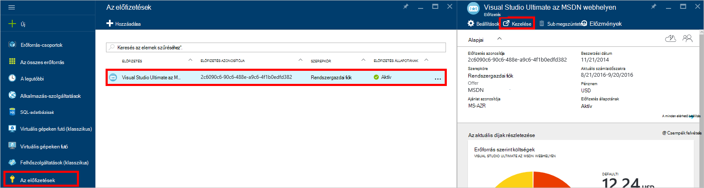
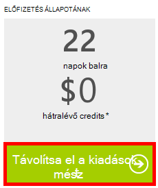

<properties
    pageTitle="DocumentDB portál kapcsolatos problémák elhárítása |} Microsoft Azure"
    description="Megtudhatja, hogy az DocumentDB Azure-portálon problémák megoldásához." 
    services="documentdb"
    documentationCenter=""
    authors="mimig1"
    manager="jhubbard"
    editor="monicar"/>

<tags
    ms.service="documentdb"
    ms.workload="data-services"
    ms.tgt_pltfrm="na"
    ms.devlang="na"
    ms.topic="article"
    ms.date="08/29/2016"
    ms.author="mimig"/>

# Azure DocumentDB portal hibaelhárítási tippek

Ez a cikk ismerteti, hogyan az Azure-portálon DocumentDB problémák megoldásához. 

## Hiányoznak a források

**A jelenség**: adatbázisok vagy gyűjtemények hiányoznak a portál pengéit.

**Megoldás**: alsó csoportban a gyűjtemény a maximális sebesség kvótája működtetéséhez alkalmazás használatát. 

**Magyarázat**: A portálon egy olyan alkalmazás, mint bármely más kezdeményezhet hívásokat a DocumentDB adatbázis és a webhelycsoport. Ha a kérelmek a vannak jelenleg szabályozott miatt hívások éppen egy külön alkalmazásból, a portálon előfordulhat, hogy is kell szabályozott, okozó erőforrások nem jelennek meg a portálon. A probléma megoldásához, a probléma okát, a nagy átviteli használatát a cím, majd frissítse az a portál lap. Információk felmérni, hogy miként és az alsó átviteli használatát a [Teljesítmény tippek](documentdb-performance-tips.md) a cikk [átviteli](documentdb-performance-tips.md#throughput) szakaszában találhatók.
 
## Lapok vagy pengéit nem töltődik be

**A jelenség**: lapok és a portálon pengéit ne jelenjen meg.

**Megoldás**: alsó csoportban a gyűjtemény a maximális sebesség kvótája működtetéséhez alkalmazás használatát. 

**Magyarázat**: A portálon egy olyan alkalmazás, mint bármely más, kezdeményezhet hívásokat a DocumentDB adatbázis és a webhelycsoport. Ha a kérések a vannak jelenleg szabályozott miatt hívások éppen egy külön alkalmazásból, a portálon előfordulhat, hogy is kell szabályozott, okozó erőforrások nem jelennek meg a portálon. A probléma megoldásához, a probléma okát, a nagy átviteli használatát a cím, majd frissítse az a portál lap. Információk felmérni, hogy miként és az alsó átviteli használatát a [Teljesítmény tippek](documentdb-performance-tips.md) a cikk [átviteli](documentdb-performance-tips.md#throughput) szakaszában találhatók.

## Adja hozzá a webhelycsoport gomb nem érhető el

**A jelenség**: meg az adatbázist a lap, a **Webhelycsoport hozzáadása** gomb nem érhető el.

**Magyarázat**: Azure-előfizetése társítva a kedvezménye credits, például az MSDN előfizetésből felajánlott ingyenes jóváírások és használt összes a credits a hónap, ha nem tudja DocumentDB további gyűjtemények létrehozásához.

**Megoldás**: a kiadások korlát eltávolítása a fiókjából.

1. Az Azure portálon a Jumpbar kattintson az **előfizetések elemre**, kattintson az előfizetés a DocumentDB adatbázis társított és az **előfizetés** a lap, a **kezelés**gombra. 
    

2. Az új böngészőablakban láthatja, hogy nem maradt jóváírások. Kattintson a csak az aktuális számlaidőszakra és végtelen időre szóló kiadások eltávolítandó **kiadások korlát eltávolítása** gombra. Kattintson a varázsló hozzáadása, és erősítse meg a hitelkártyaadatait. 
    

 
## Lekérdezés Explorer hibákkal befejezése

Lásd: a [lekérdezés Explorer hibaelhárítása](documentdb-query-collections-query-explorer.md#troubleshoot).

## Nem érhető el a mozaikok figyelése adatok

Lásd: a [Hibaelhárítás figyelése csempék](documentdb-monitor-accounts.md#troubleshooting).

## Vissza a dokumentum Intézőben dokumentum

Lásd: a [dokumentum Explorer hibaelhárítás](documentdb-view-json-document-explorer.md#troubleshoot).

## Következő lépések

Ha továbbra is tapasztalja a portálon problémák, kérjük, e-mailben [askdocdb@microsoft.com](mailto:askdocdb@microsoft.com) segítséget, vagy a fájl egy támogatás kérése a portálon: kattintson a **Tallózás gombra**, **Súgó + támogatási**, és válassza a **Create támogatási kérelmet**.
