<properties
    pageTitle="A Power BI oktatóprogram DocumentDB összekötő |} Microsoft Azure"
    description="Ez az oktatóanyag a Power BI segítségével JSON importálása, osztályon jelentések létrehozása és használata az DocumentDB és a Power BI összekötő adatok ábrázolása."
    keywords="üzleti intelligencia oktatóprogram Power, adatok, üzleti intelligencia összekötő power ábrázolása"
    services="documentdb"
    authors="h0n"
    manager="jhubbard"
    editor="mimig"
    documentationCenter=""/>

<tags
    ms.service="documentdb"
    ms.workload="data-services"
    ms.tgt_pltfrm="na"
    ms.devlang="na"
    ms.topic="article"
    ms.date="09/22/2016"
    ms.author="hawong"/>

# A Power BI oktatóprogramja DocumentDB: a Power BI connector használatakor adatok ábrázolása

[PowerBI.com](https://powerbi.microsoft.com/) egy online szolgáltatás, ahol létrehozhat és irányítópultok és a jelentések megosztása az Ön és szervezete fontos adatokat tartalmazó.  A Power BI Desktop dedikált jelentéskészítő eszköz, amely lehetővé teszi, hogy a különböző forrásokból származó adatok beolvasásához, egyesítése és az adatokat a, sokoldalú jelentések és adatábrázolások létrehozása és a jelentések közzététel a Power BI.  A Power BI Desktop legújabb verziójával most csatlakozhat az DocumentDB összekötő keresztül DocumentDB fiókját a Power BI.   

Power BI ebben az oktatóanyagban azt csatlakoztatása a Power BI Desktop egy DocumentDB fiókhoz, nyissa meg a webhelycsoport, ahol szeretnénk bontsa ki az adatokat a kezelő, átalakíthatja a JSON-adatok használata a Power BI Desktop Lekérdezésszerkesztő táblázatosan lépéseinek és készítése és közzététele a jelentés PowerBI.com.

Miután elkészült a Power BI-oktatóanyag, is az alábbi kérdésekre választ:  

-   Hogyan tudom nyújthat adatokat tartalmazó jelentések DocumentDB a Power BI Desktop használata?
-   Hogyan tudok csatlakozni a Power BI Desktop DocumentDB-fiók?
-   Hogyan lehet adatok beolvasása a Power BI Desktop gyűjteményből?
-   Hogyan alakíthatják beágyazott JSON-adatok a Power BI Desktop?
-   Hogyan lehet közzététele és megosztása a saját jelentések a PowerBI.com?

## Előfeltételek

Ez az oktatóanyag a Power BI utasításai előtt győződjön meg arról, hogy a következő:

- [A Power BI Desktop legújabb verzióját](https://powerbi.microsoft.com/desktop).
- A bemutató fiók vagy a Azure DocumentDB fiók adatainak való hozzáférést.
    - A bemutató fiók kitölti az mexikói adatokat, ebben az oktatóanyagban látható. A bemutató fiók nem kötik bármely SLA, és csak a bemutató célokra jelenti.  Hogy fenntartja a jogot arra, hogy a módosításait, beleértve a bemutató fiók, de nem korlátozódik, leáll a fiókot, a kulcs módosítása, módosítása, hozzáférés korlátozása, és az adatok törléséhez előzetes értesítés és ok nélkül bármikor.
        - URL-címe: https://analytics.documents.azure.com
        - Csak olvasható kulcs: MSr6kt7Gn0YRQbjd6RbTnTt7VHc5ohaAFu7osF0HdyQmfR + YhwCH2D2jcczVIR1LNK3nMPNBD31losN7lQ/fkw ==
    - Másik lehetőségként a saját fiók létrehozása, lásd: [az Azure portálon DocumentDB adatbázis fiók létrehozása](https://azure.microsoft.com/documentation/articles/documentdb-create-account/). Ezt a minta mexikói, amely hasonlít az, hogy milyen adatokat használatos ebben az oktatóanyagban (de nem tartalmaz GeoJSON blokkok) kapni, a [NOAA webhely](https://www.ngdc.noaa.gov/nndc/struts/form?t=102557&s=5&d=5) lehetőséget, majd importálja az adatokat a [DocumentDB adatok áttelepítési eszköz](https://azure.microsoft.com/documentation/articles/documentdb-import-data/).

A jelentéseket a PowerBI.com megosztásához a PowerBI.com-fiókkal kell rendelkezniük.  További tudnivalók a Power BI ingyenes és a Power BI Pro, kérjük, keresse fel a [https://powerbi.microsoft.com/pricing](https://powerbi.microsoft.com/pricing).

## Első lépések
Ebben az oktatóanyagban vegyük elképzelheti, hogy Ön egy geologist tanulmányozása vulkánok alakították a világon.  A Mexikói adatok egy DocumentDB fiók vannak tárolva, és a JSON dokumentumok keresse meg a olyanra, mint az alábbi.

    {
        "Volcano Name": "Rainier",
        "Country": "United States",
        "Region": "US-Washington",
        "Location": {
            "type": "Point",
            "coordinates": [
            -121.758,
            46.87
            ]
        },
        "Elevation": 4392,
        "Type": "Stratovolcano",
        "Status": "Dendrochronology",
        "Last Known Eruption": "Last known eruption from 1800-1899, inclusive"
    }

Szeretne mexikói adatokat beolvashatja a DocumentDB fiók és egy interaktív a Power BI-jelentésben olyanra, mint az alábbi adatok ábrázolása.

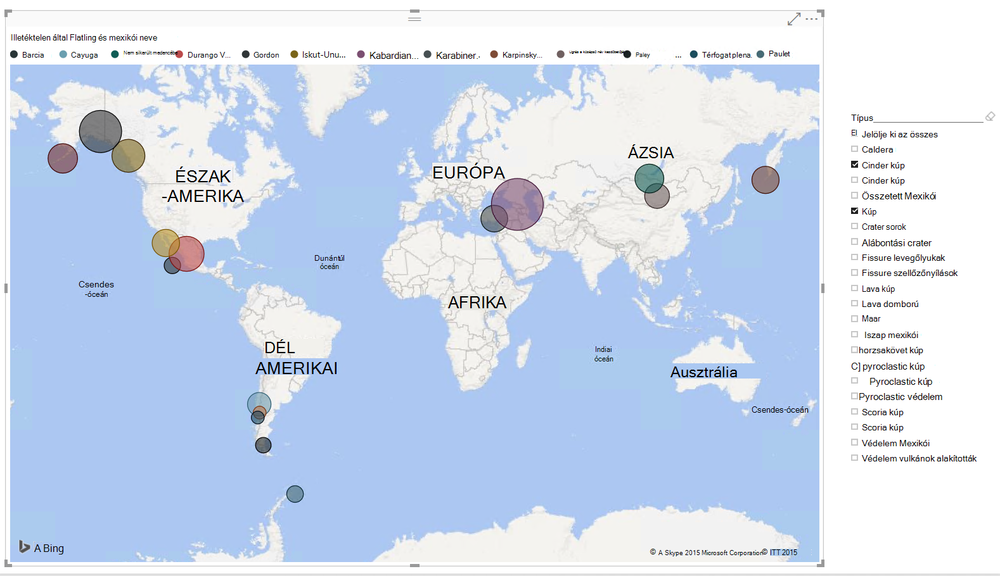

Készen áll a tegyen egy próbát? Lássunk hozzá.

1. A Power BI Desktop futtassa a számítógépen.
2. A Power BI Desktop elindul, amint egy *üdvözlő* képernyője jelenik meg.

    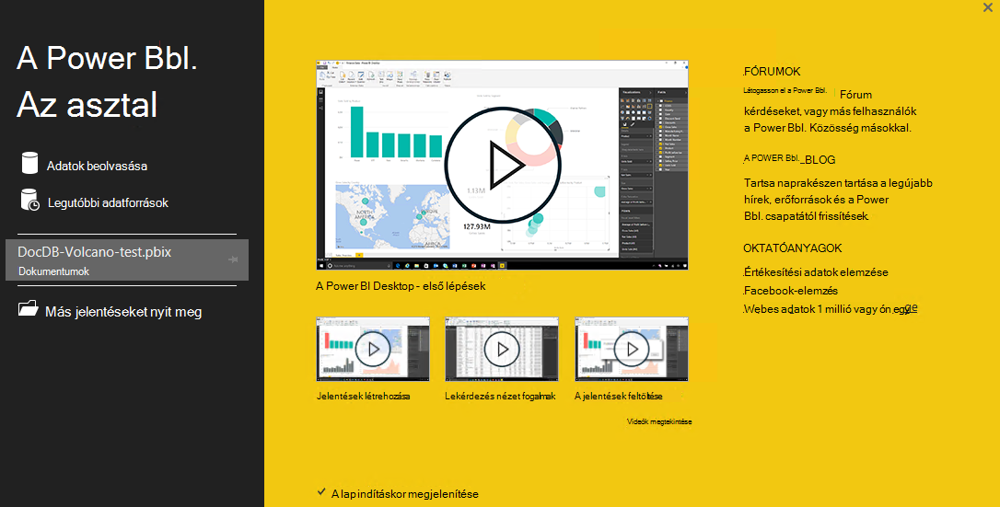

3. **Adatok beolvasása**, lásd: **A legutóbbi adatforrások**vagy **Megnyitása más jelentéseket** is közvetlenül *Az üdvözlőképernyő* .  Kattintson jobb felső sarokban lévő X ikonra a képernyő bezárásához. A **jelentés** megtekintése a Power BI Desktop jelenik meg.

    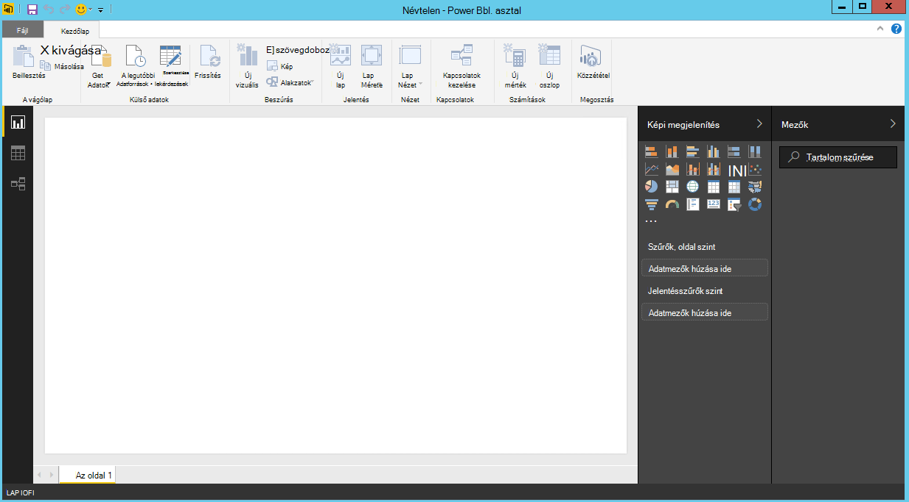

4. Jelölje ki a **Home** menüszalag, majd kattintson az **Adatok beolvasása**a.  Az **Adatok beolvasása** ablak jelenjenek meg.

5. Kattintson a **Azure**, jelölje be a **Microsoft Azure DocumentDB (Beta)**, és kattintson a **Csatlakozás**.  A **Microsoft Azure DocumentDB csatlakozás** ablak jelenjenek meg.

    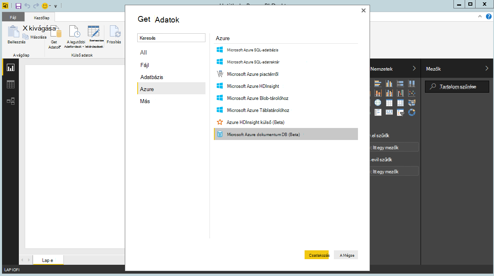

6. Adja meg a DocumentDB fiók végpont URL-CÍMÉT szeretné, hogy az adatok beolvasásához alább látható módon, és kattintson **az OK**gombra. Az URL-cím lekérése az Azure-portálra a **[billentyűk](documentdb-manage-account.md#keys)** lap URI mezőjében vagy a bemutató fiókot is használhatja, ebben az esetben az URL-cím `https://analytics.documents.azure.com`. 

    Az adatbázis neve, a webhelycsoport nevét és SQL-utasítást üresen hagyja, ezeket a mezőket nem kötelező.  Ehelyett fogjuk használni a kezelő jelölje be az adatbázis és a webhelycsoport azonosíthatja, hogy honnan származnak az adatok.

    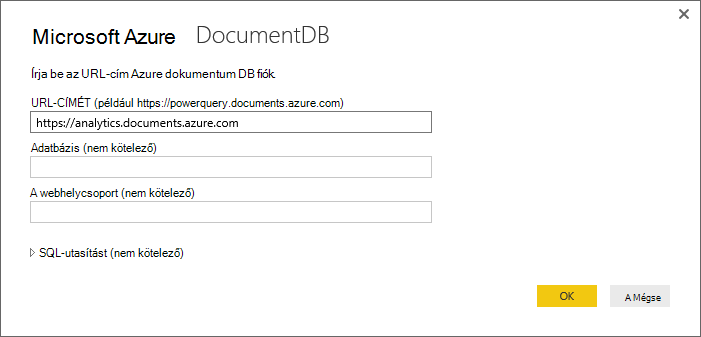

7. Ha a végpont először csatlakozik, a rendszer kéri, a fiók kulcs.  A kulcs lekérése az Azure-portálra a **[csak olvasható billentyűk](documentdb-manage-account.md#keys)** lap **Elsődleges kulcs** mezőjében vagy használhatja a bemutató fiókot, amelyben a kulcs eset még `RcEBrRI2xVnlWheejXncHId6QRcKdCGQSW6uSUEgroYBWVnujW3YWvgiG2ePZ0P0TppsrMgscoxsO7cf6mOpcA==`. Írja be a fiókkulcs, és kattintson a **Csatlakozás**gombra.

    Javasoljuk, hogy jelentések létrehozásakor a csak olvasható billentyűt használja.  A felesleges információk megjelenítése a minta kulcs megakadályozására biztonsági kockázatot. A csak olvasható billentyűt a [billentyűk](documentdb-manage-account.md#keys) lap a Azure portál elérhető, vagy használhatja a fenti bemutató-fiók adatait.

    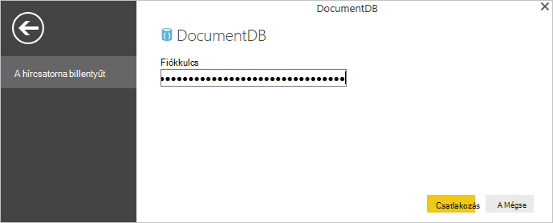

8. Ha a fiókot sikeresen csatlakozik, a **kezelő** jelenik meg.  A **kezelő** jelennek meg a fiókon adatbázisok listáját.
9. Kattintson, és bontsa ki az adatbázisban, ahol az adatokat a kimutatáshoz származnak, használata a bemutató fiókot, a választó **volcanodb**.   

10. Ezután jelölje ki a gyűjteménye, amely meg beolvassa az adatokat. Ha a bemutató fiók használata esetén válassza a **volcano1**.

    A betekintő ablaktáblában **rekord** elemeinek listáját jeleníti meg.  A dokumentum egy **rekord** típusa, a Power BI jelöli. Hasonlóképpen egy dokumentumon belüli egymásba ágyazott JSON blokkokból álló is egy **rekordot**.

    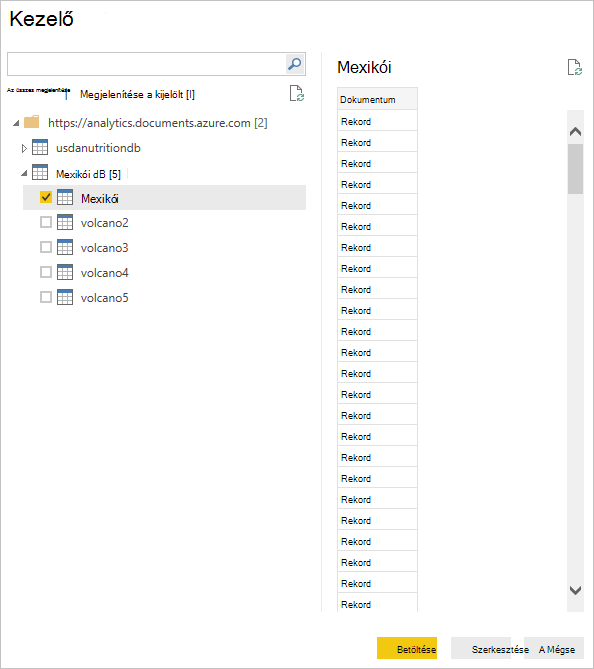

11. Kattintson a **Szerkesztés** indítsa el a Lekérdezésszerkesztőben, így azt alakíthatják át az adatokat.

## Simítás és JSON dokumentumok átalakítása
1. A Power BI Lekérdezésszerkesztőben, meg kell jelennie egy **dokumentum** oszlop, a középső ablaktáblában.
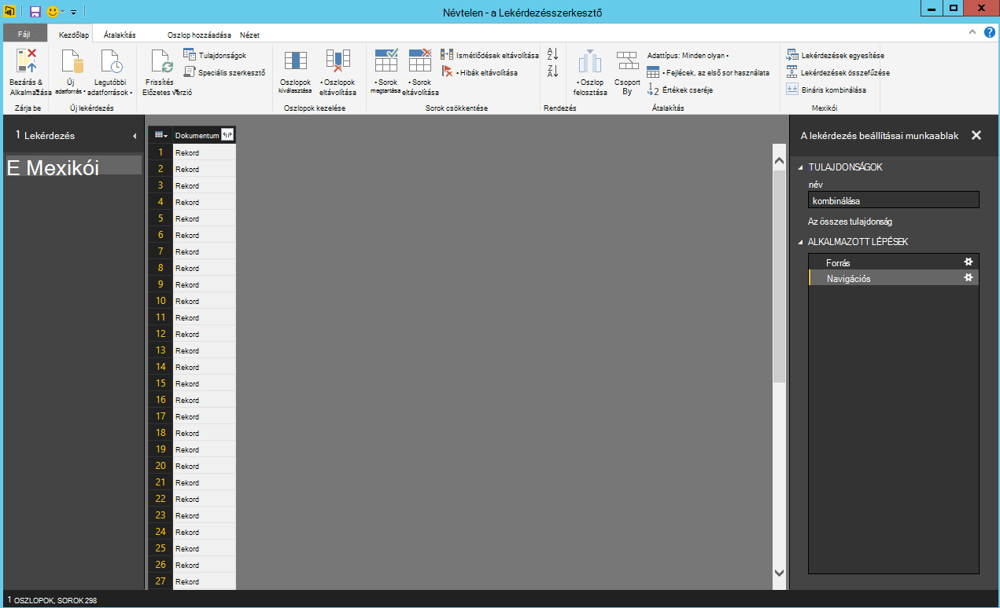

2. Kattintson a **dokumentum** oszlopfejléc jobb szélén a expander.  A helyi menü és a mezők fog megjelenni.  Jelölje ki a mezőket a jelentésben, például mexikói nevét, ország, régió, hely, illetéktelen, típusát, állapot és utolsó, hogy határozzák van szüksége, és kattintson **az OK**gombra.

    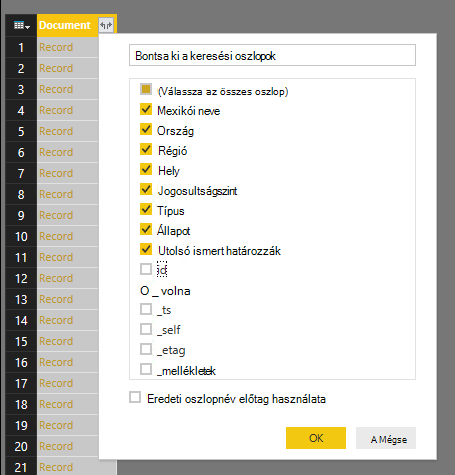

3. A középső ablaktáblában, az eredmény előnézete megjelenik a kijelölt mezők.

    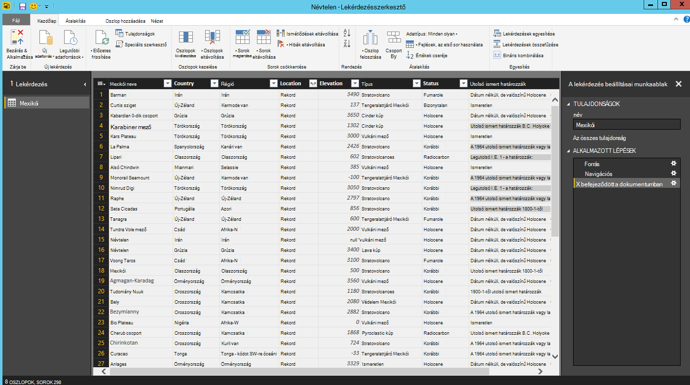

4. Ebben a példában a hely tulajdonság értéke egy GeoJSON szövegrészt a dokumentumban.  Amint látható, a Power BI Desktop a **rekord** fájltípus helyét jelöli.  
5. Kattintson a hely oszlopfejléc jobb oldalán a expander.  A helyi menü típusa és koordinátáit tartalmazó mezővel fog megjelenni.  Most jelölje ki a koordináták mezőt, és kattintson az **OK gombra**.

    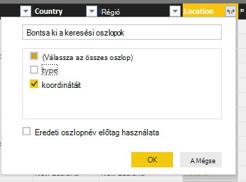

6. A középső ablaktáblában megjelenik a **lista** típusú koordináták oszlop.  Ahogy azt az oktatóprogram az elején, GeoJSON ebben az oktatóanyagban adatai pont típusú a koordináták tömb felvett szélesség és hosszúság értékű.

    Az koordináták [0] elemet hosszúság jelöl, miközben koordináták [1] jelöli a szélesség.
    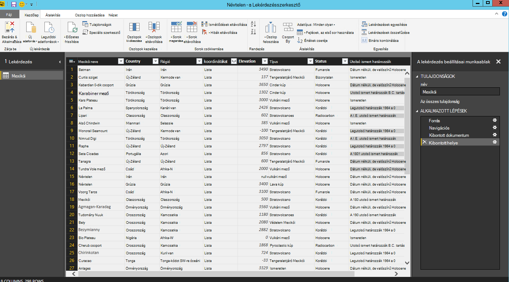

7. A koordináták tömb összeolvasztása, az azt **Az egyéni oszlop** neve LatLong hoz létre.  Jelölje be az **Oszlop hozzáadása** a menüszalagon, majd kattintson **Az egyéni oszlop hozzáadása**.  Az **Egyéni oszlop hozzáadása** ablakban jelenjenek meg.

8. Nevezze el az új oszlop, például LatLong.

9. Ezután adja meg az új oszlopot az egyéni képlet.  Példa azt fogja ÖSSZEFŰZ a szélesség és hosszúság értékek vesszővel elválasztva, a következő képlettel alább látható módon: `Text.From([Document.Location.coordinates]{1})&","&Text.From([Document.Location.coordinates]{0})`. Kattintson az **OK gombra**.

    További információt a adatelemzési kifejezések (DAX) többek között a DAX-függvények, kérjük, keresse fel [A Power BI Desktop egyszerű DAX](https://support.powerbi.com/knowledgebase/articles/554619-dax-basics-in-power-bi-desktop).

    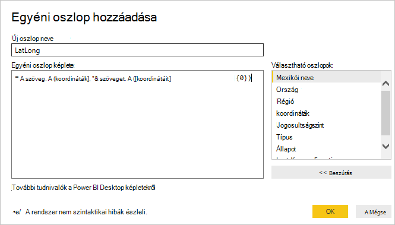

10. Most a középső ablaktáblában jelennek meg az új LatLong oszlop automatikusan beírja a szélesség és hosszúság értékek vesszővel elválasztott értékekkel.

    

    Ha egy hibaüzenet jelenik meg az új oszlopba, győződjön meg arról, hogy a lekérdezés beállításai munkaablak alkalmazott lépéseit egyezik-e az alábbi ábrán:

    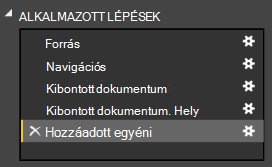

    A lépései attól, ha törli a felesleges lépéseket, és próbálkozzon újra az egyéni oszlop hozzáadása. 

11. Most már azt befejeződött, az adatok összeolvasztása táblázatos formátumba.  Kihasználhatja az összes a funkciót a Lekérdezésszerkesztőben alakzatra, és DocumentDB az adatokat.  Ha a minta használata esetén módosításához az adattípus jogosultságszint **egész** számra a **Home** menüszalagon **Adattípus** módosítása.

    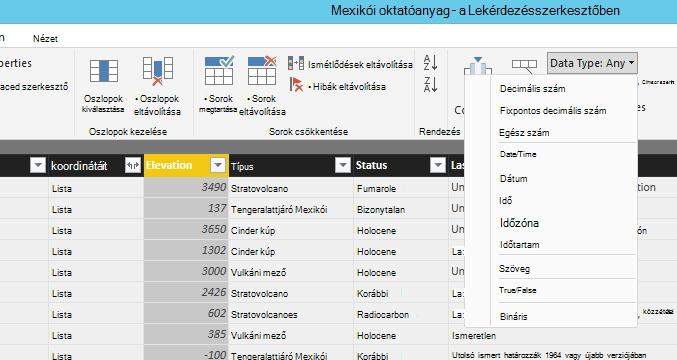

12. Kattintson a **Bezárás gombra, és az alkalmazás** menti az adatmodellbe.

    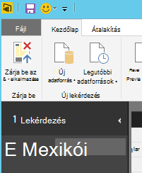

## A jelentések készítése
A Power BI Desktop jelentés nézet, ahol elkezdheti az adatok ábrázolása jelentések készítése.  Jelentések létrehozása, húzza a mezőket a **jelentés** Vászon be.

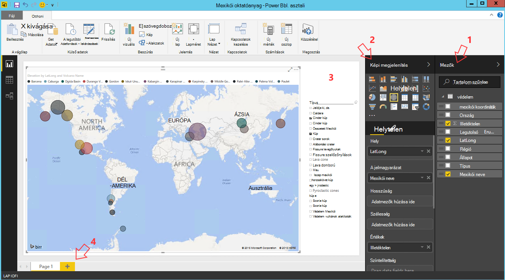

A jelentés nézetben keresse meg:

 1. A **mezők** ablaktábla, ez az, ha látni fogja adatmodelljeinek használata a jelentések létrehozásához használható mezők listája.

 2. A **képi megjelenítések** ablakban. A jelentés egy vagy több megjelenítés is tartalmazhat.  Válassza ki a vizuális típusú igazítás, a **képi megjelenítések** ablakból az igényeinek.

 3. A **jelentés** vászon, ahol gyűjt a vizuális az jelentés: az.

 4. A **jelentés** lapon. A Power BI Desktop többoldalas jelentés is hozzáadhat.

Az alábbi példában látható az alapvető lépések egy egyszerű interaktív térkép View nézetet tartalmazó jelentés létrehozása.

1. Példa azt az egyes mexikói rajta map-nézetet hoz létre.  A **képi megjelenítések** ablakban kattintson a térkép vizuális típusú kiemelve a fenti a képernyőképet.  Meg kell jelennie a **jelentés** vászonra festett térkép vizuális típusát.  A **Megjelenítés** ablaktábla is megjelenjen a térkép vizuális típus kapcsolódó tulajdonságait.

2. Most húzással a LatLong mezőt a **mezők** ablakból a **hely** tulajdonság **megjelenítések** ablaktáblában.
3. Ezután húzással helyezze a Mexikói neve mezőt a **Jelmagyarázat** tulajdonságot.  

4. Ezután húzással helyezze a **Size** tulajdonság a jogosultságszint mezőt.  

5. Ekkor megjelenik a térkép megjelenítése egy sor olyan buborékok használatával történik a a Mexikói kiterjesztését a buborék mérete az egyes mexikói helyét jelző vizuális.

6. Most már létrehozott egy egyszerű jelentés.  További további képi megjelenítések hozzáadásával testre szabhatja a jelentést.  Ebben az esetben jelöltük meg, hogy a jelentés interaktív mexikói típus szeletelő.  

    

## Közzététele és a jelentés megosztása
A jelentés megosztásához a PowerBI.com-fiókkal kell rendelkezniük.

1. A Power BI Desktopot kattintson a **Kezdőlap** menüszalagon.
2. Kattintson a **Közzététel**gombra.  A PowerBI.com fiók a felhasználónév és jelszó megadását kéri.
3. A hitelesítő adatok hitelesítését követően a jelentést a megadott helyre van közzétéve.
4. Kattintson a **Megnyitás "PowerBITutorial.pbix" a Power BI** megjelenítéséhez, és a jelentés a PowerBI.com megosztása gombra.

    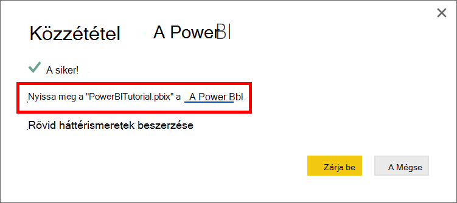

## A PowerBI.com irányítópult létrehozása

Most, hogy van egy jelentést, lehetővé teszi, hogy ossza meg a PowerBI.com

A jelentés a Power BI Desktop PowerBI.com közzétételekor hoz létre egy **jelentés** és egy **adatkészlet** a PowerBI.com bérlői webhelyén. Ha például **PowerBITutorial** a PowerBI.com nevű jelentés közzététele után látni fogja PowerBITutorial **jelentéseket** és **adatkészleteket** szakaszok a PowerBI.com.

   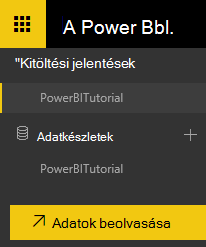

Megosztható irányítópult létrehozása, kattintson a **PIN-kód Live** gomb a PowerBI.com jelentésben.

   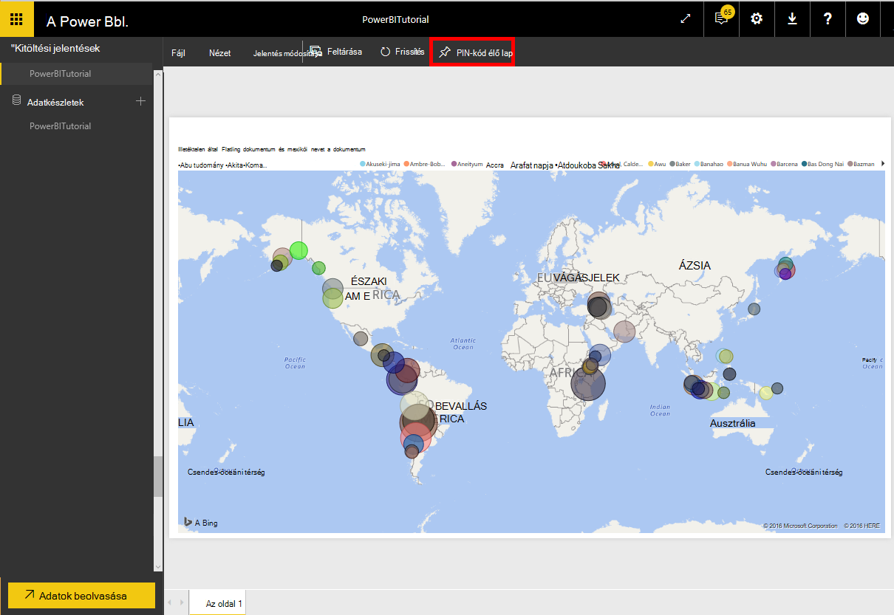

Ezután kövesse a [PIN-kód egy mozaikon a jelentés](https://powerbi.microsoft.com/documentation/powerbi-service-pin-a-tile-to-a-dashboard-from-a-report/#pin-a-tile-from-a-report) egy új irányítópult létrehozása. 

Jelentés alkalmi módosításai irányítópult létrehozása előtt is elvégezhető. Ajánlott azonban használata a Power BI Desktop végezze el a módosításokat, és tegye közzé újra a PowerBI.com a jelentést.

## Adatok frissítése a PowerBI.com

Kétféleképpen frissítheti az adatokat, az ütemezett és alkalmi.

Az egy alkalmi frissítést egyszerűen kattintson a az **adatkészlet**, például PowerBITutorial által a (...) eclipses. Meg kell jelennie műveletek, többek között a **Frissítés most**listáját. Kattintson a **Frissítés most** az adatok frissítéséhez.

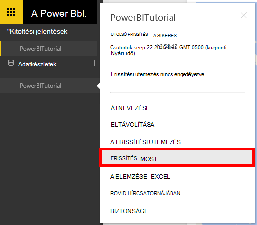

Az ütemezett frissítést tegye a következőket:

1. A művelet listában kattintson a **Frissítési ütemezés** . 
    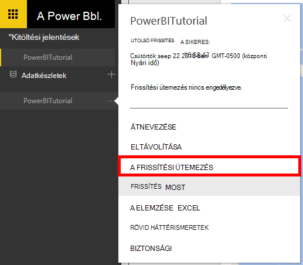

2. Bontsa ki a **Beállítások** lap **az adatforrás hitelesítő adatait**. 

3. Kattintson a **hitelesítő adatok szerkesztése**. 

    A Configure előugró jelenik meg. 

4. Adja meg, hogy az adatkészlet számára az DocumentDB fiókhoz való csatlakozáshoz a kulcsot, majd kattintson a **Bejelentkezés**gombra. 

5. Bontsa ki a **Frissítési ütemezés** , és állítsa be az ütemezés az adatkészlet frissíteni kívánt. 
  
6. Kattintson az **Alkalmaz** gombra, és végzett az ütemezett frissítés beállításáról.

## Következő lépések
- További tudnivalók a Power BI, olvassa el a [Power BI – első lépések](https://powerbi.microsoft.com/documentation/powerbi-service-get-started/)című témakört.
- DocumentDB kapcsolatos további tudnivalókért lásd: a [céloldal DocumentDB dokumentációt](https://azure.microsoft.com/documentation/services/documentdb/).
