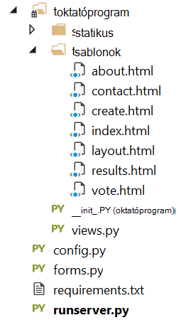
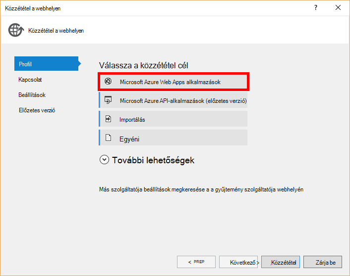

<properties
    pageTitle="Python lombikot webes alkalmazások fejlesztése DocumentDB |} Microsoft Azure"
    description="Tekintse át a DocumentDB használatáról tárolására és elérni az adatokat az Azure is Python lombikot webalkalmazás adatbázis oktatóanyagot. Alkalmazás fejlesztési megoldások megkeresésére." 
    keywords="Alkalmazások fejlesztése, adatbázis oktatóprogram, python lombikot, python webalkalmazás, python webes fejlesztése, documentdb, azure, a Microsoft azure"
    services="documentdb"
    documentationCenter="python"
    authors="syamkmsft"
    manager="jhubbard"
    editor="cgronlun"/>

<tags
    ms.service="documentdb"
    ms.workload="data-management"
    ms.tgt_pltfrm="na"
    ms.devlang="python"
    ms.topic="hero-article"
    ms.date="08/25/2016"
    ms.author="syamk"/>

# <a name="python-flask-web-application-development-with-documentdb"></a>Python lombikot webes alkalmazások fejlesztése DocumentDB

> [AZURE.SELECTOR]
- [.NET](documentdb-dotnet-application.md)
- [NODE.js](documentdb-nodejs-application.md)
- [Java](documentdb-java-application.md)
- [Python](documentdb-python-application.md)

Ebből az oktatóanyagból megtudhatja, hogy miként Azure DocumentDB használva elemre, és egy Python az access-adatok a webalkalmazásban is Azure megvalósító, hogy bizonyos előzetes élmény Python és Azure-webhelyek használata.

Adatbázis oktatóprogram tartalma:

1. Létrehozásáról és a kiépítési egy DocumentDB fiókot.
2. Egy Python MVC-alkalmazás létrehozása.
3. Kapcsolódik, és Azure DocumentDB használata a webes levelezőprogramból.
4. Üzembe helyezése a webalkalmazás az Azure-webhelyre.

Ebben az oktatóanyagban követve generál egy egyszerű szavazási alkalmazás, amely lehetővé teszi, hogy a szavazáshoz szavazás lesz.


## <a name="database-tutorial-prerequisites"></a>Adatbázis oktatóanyag vonatkozó követelmények

Ez a cikk utasításait követve, előtt bizonyosodjon meg arról, hogy rendelkezik-e az alábbi programok telepítése:

- Azure active fiók. Nem rendelkeznek fiókkal, ha mindössze néhány perc is létrehozhat ingyenes próba-fiók. A részletekért lásd: [Azure ingyenes próbaverziót](https://azure.microsoft.com/pricing/free-trial/).
- [Visual Studio 2013-as](http://www.visualstudio.com/) vagy újabb verziójával, vagy [Visual Studio Express](), amely az ingyenes verzióban. A megjelenő utasításokat, ebben az oktatóanyagban kifejezetten Visual Studio 2015 kerülnek. 
- Python Tools for Visual Studio a [GitHub](http://microsoft.github.io/PTVS/). Ebben az oktatóanyagban VIEWBEN 2015 Python eszközöket használja. 
- Azure Python SDK for Visual Studio, 2.4-es vagy újabb verzió [azure.com](https://azure.microsoft.com/downloads/)elérhető. Microsoft Azure SDK Python 2.7 használja azt.
- Python 2.7 a [python.org][2]. Python 2.7.11 használja azt. 

> [AZURE.IMPORTANT] Ha első alkalommal telepíti Python 2.7, győződjön meg arról, hogy a testreszabása Python 2.7.11 képernyőn, jelölje ki **python.exe elérési út hozzáadása**.
> 
>    

- Microsoft Visual C++ fordító Python 2.7 a [Microsoft letöltőközpontból][3].

## <a name="step-1-create-a-documentdb-database-account"></a>Lépés: 1: DocumentDB adatbázis-fiók létrehozása

Első lépésként DocumentDB fiók létrehozása. Ha már rendelkezik fiókkal, akkor hagyja ki [lépés 2: hozzon létre egy új Python lombikot webalkalmazást](#step-2:-create-a-new-python-flask-web-application).

[AZURE.INCLUDE [documentdb-create-dbaccount](../../includes/documentdb-create-dbaccount.md)]

<br/>
Fog most végigvezetjük hogyan hozhat létre egy új Python lombikot webalkalmazást az alapoktól kezdve be.

## <a name="step-2-create-a-new-python-flask-web-application"></a>Lépés: 2: Új Python lombikot webalkalmazás létrehozása

1. A Visual Studióban, kattintson a **fájl** menü **Új**pontjára, és kattintson a **Projekt**.

    Az **Új projekt** párbeszédpanel jelenik meg.

2. A bal oldali ablaktáblában bontsa ki a **sablonok** és **Python**, és válassza a **webhely**. 

3. Jelölje ki a középső ablaktáblában kattintson a **neve** mezőbe írja be **oktatóprogram**a **Lombikot a Project Web** , és kattintson **az OK**gombra. Ne feledje, hogy Python csomag nevét kell kisbetűssé, a [Stílus útmutató Python kód](https://www.python.org/dev/peps/pep-0008/#package-and-module-names)leírt módon.

    Azok új Python lombikhoz célszerű a webes alkalmazás fejlesztési keretet, amely segít a webalkalmazások Python a gyorsabb.

    

4. **Python Tools for Visual Studio** ablakában kattintson a **telepítse a virtuális környezetbe**. 

    

5. A **Virtuális környezet hozzáadása** ablakban fogadja el az alapértelmezett értékeket és Python 2.7 használata az alap környezetben, mert PyDocumentDB jelenleg nem támogatja a Python 3.x, és kattintson a **Létrehozás**gombra. A szükséges Python virtuális környezet beállítása a projekthez állít be.

    

    Megjeleníti a kimeneti ablakban `Successfully installed Flask-0.10.1 Jinja2-2.8 MarkupSafe-0.23 Werkzeug-0.11.5 itsdangerous-0.24 'requirements.txt' was installed successfully.` a környezet sikeresen telepítésekor.

## <a name="step-3-modify-the-python-flask-web-application"></a>3 lépés: A Python lombikot webalkalmazás módosítása

### <a name="add-the-python-flask-packages-to-your-project"></a>A Python lombikot csomagok hozzáadása a projekthez

A projekt beállítása után kell a szükséges lombikot csomagok hozzáadása a projekthez, többek között a pydocumentdb, DocumentDB Python csomagját.

1. A megoldás Intézőben nyissa meg a **requirements.txt** nevű fájlt, majd tartalmát lecserélése a következőre:

        flask==0.9
        flask-mail==0.7.6
        sqlalchemy==0.7.9
        flask-sqlalchemy==0.16
        sqlalchemy-migrate==0.7.2
        flask-whooshalchemy==0.55a
        flask-wtf==0.8.4
        pytz==2013b
        flask-babel==0.8
        flup
        pydocumentdb>=1.0.0

2. Mentse a **requirements.txt** fájlt. 
3. Megoldás Explorerben kattintson a jobb gombbal a **Boríték** és **requirements.txt a telepítés**gombra.

    

    A sikeres telepítés után a kimeneti ablakban eredménye a következő:

        Successfully installed Babel-2.3.2 Tempita-0.5.2 WTForms-2.1 Whoosh-2.7.4 blinker-1.4 decorator-4.0.9 flask-0.9 flask-babel-0.8 flask-mail-0.7.6 flask-sqlalchemy-0.16 flask-whooshalchemy-0.55a0 flask-wtf-0.8.4 flup-1.0.2 pydocumentdb-1.6.1 pytz-2013b0 speaklater-1.3 sqlalchemy-0.7.9 sqlalchemy-migrate-0.7.2

    > [AZURE.NOTE] Ritkán a kimeneti ablakban hiba jelenhet meg. Ez történik, ha ellenőrzése, ha a hiba kapcsolódó karbantartása. Előfordul, hogy a Lemezkarbantartó nem sikerült, de a telepítés továbbra is sikeres (görgetéssel keresse fel a kimeneti ablakban ennek ellenőrzéséhez). Ellenőrzi [a virtuális környezet](#verify-the-virtual-environment)telepítésének ellenőrzése A telepítés nem sikerült, de az igazolás sikeres, esetén továbbra is az OK gombra.

### <a name="verify-the-virtual-environment"></a>Ellenőrizze a virtuális környezet

Vegyük győződjön meg arról, hogy minden megfelelően van telepítve.

1. A megoldás összeállítása a **Ctrl**billentyű lenyomva tartásával+**Shift**+**B**.
2. Miután létrejött a létrehozás, indítsa el a webhely **F5**billentyű lenyomásával. Ez elindítja a lombikot fejlesztési kiszolgáló, és elindítja a böngészőt. Meg kell jelennie a következő lapra.

    

3. A webhely hibakeresési nyomva tartja a **Shift**leállítása+**F5 billentyűparancs hatására** a Visual Studióban.

### <a name="create-database-collection-and-document-definitions"></a>Adatbázis, a webhelycsoport és a dokumentum-definíciók létrehozása

Most már a szavazási alkalmazás által mások frissítését és felvételét is az új fájlok létrehozása.

1. A megoldás Intézőben kattintson a jobb gombbal az **oktatóprogram** projekt, kattintson a **Hozzáadás**gombra, és kattintson az **Új elem**. Jelölje ki az **Üres Python fájlt** , és nevezze el a fájlt **forms.py**.  
2. A következő kód hozzáadása a forms.py fájlt, és mentse a fájlt.

```python
from flask.ext.wtf import Form
from wtforms import RadioField

class VoteForm(Form):
    deploy_preference  = RadioField('Deployment Preference', choices=[
        ('Web Site', 'Web Site'),
        ('Cloud Service', 'Cloud Service'),
        ('Virtual Machine', 'Virtual Machine')], default='Web Site')
```


### <a name="add-the-required-imports-to-viewspy"></a>A szükséges import hozzáadása views.py

1. A megoldás Intézőben nyissa meg az **oktatóprogram** mappát, és nyissa meg a **views.py** fájlt. 
2. Adja hozzá a következő utasítások importálása a **views.py** fájl tetején, majd mentse a fájlt. Ezen az importálási DocumentDB's PythonSDK és a lombikot csomagok.

    ```python
    from forms import VoteForm
    import config
    import pydocumentdb.document_client as document_client
    ```


### <a name="create-database-collection-and-document"></a>Adatbázis, a webhelycsoport és a dokumentum létrehozása

- Továbbra is **views.py**, adja a következő kódot a fájl végére. Ez az űrlap által használt adatbázis létrehozása gondoskodik. Törölje a meglévő **views.py**kódot. Egyszerűen hozzáfűzni a végén.

```python
@app.route('/create')
def create():
    """Renders the contact page."""
    client = document_client.DocumentClient(config.DOCUMENTDB_HOST, {'masterKey': config.DOCUMENTDB_KEY})

    # Attempt to delete the database.  This allows this to be used to recreate as well as create
    try:
        db = next((data for data in client.ReadDatabases() if data['id'] == config.DOCUMENTDB_DATABASE))
        client.DeleteDatabase(db['_self'])
    except:
        pass

    # Create database
    db = client.CreateDatabase({ 'id': config.DOCUMENTDB_DATABASE })

    # Create collection
    collection = client.CreateCollection(db['_self'],{ 'id': config.DOCUMENTDB_COLLECTION })

    # Create document
    document = client.CreateDocument(collection['_self'],
        { 'id': config.DOCUMENTDB_DOCUMENT,
          'Web Site': 0,
          'Cloud Service': 0,
          'Virtual Machine': 0,
          'name': config.DOCUMENTDB_DOCUMENT 
        })

    return render_template(
       'create.html',
        title='Create Page',
        year=datetime.now().year,
        message='You just created a new database, collection, and document.  Your old votes have been deleted')
```

> [AZURE.TIP] A **CreateCollection** módszer egy választható **RequestOptions** a harmadik paraméterként vesz igénybe. Ez a gyűjtemény ajánlat típusának megadásához is használható. Ha nincs offerType érték van megadva, majd a webhelycsoport létrejön az alapértelmezett kínálnak típus használatával. DocumentDB ajánlat típusok kapcsolatos további tudnivalókért olvassa el a [teljesítményszint a DocumentDB](documentdb-performance-levels.md)című témakört.


### <a name="read-database-collection-document-and-submit-form"></a>Olvassa el a adatbázis, a webhelycsoport, a dokumentumot, és űrlap elküldéséhez

- Továbbra is **views.py**, adja a következő kódot a fájl végére. Ez az űrlapon, az adatbázis, a webhelycsoport és a dokumentum olvasása beállítása gondoskodik. Törölje a meglévő **views.py**kódot. Egyszerűen hozzáfűzni a végén.

```python
@app.route('/vote', methods=['GET', 'POST'])
def vote(): 
    form = VoteForm()
    replaced_document ={}
    if form.validate_on_submit(): # is user submitted vote  
        client = document_client.DocumentClient(config.DOCUMENTDB_HOST, {'masterKey': config.DOCUMENTDB_KEY})

        # Read databases and take first since id should not be duplicated.
        db = next((data for data in client.ReadDatabases() if data['id'] == config.DOCUMENTDB_DATABASE))

        # Read collections and take first since id should not be duplicated.
        coll = next((coll for coll in client.ReadCollections(db['_self']) if coll['id'] == config.DOCUMENTDB_COLLECTION))

        # Read documents and take first since id should not be duplicated.
        doc = next((doc for doc in client.ReadDocuments(coll['_self']) if doc['id'] == config.DOCUMENTDB_DOCUMENT))

        # Take the data from the deploy_preference and increment our database
        doc[form.deploy_preference.data] = doc[form.deploy_preference.data] + 1
        replaced_document = client.ReplaceDocument(doc['_self'], doc)

        # Create a model to pass to results.html
        class VoteObject:
            choices = dict()
            total_votes = 0

        vote_object = VoteObject()
        vote_object.choices = {
            "Web Site" : doc['Web Site'],
            "Cloud Service" : doc['Cloud Service'],
            "Virtual Machine" : doc['Virtual Machine']
        }
        vote_object.total_votes = sum(vote_object.choices.values())

        return render_template(
            'results.html', 
            year=datetime.now().year, 
            vote_object = vote_object)

    else :
        return render_template(
            'vote.html', 
            title = 'Vote',
            year=datetime.now().year,
            form = form)
```


### <a name="create-the-html-files"></a>A HTML-fájlok létrehozása

1. Megoldás Explorer, a **oktatóprogram** mappában kattintson a jobb gombbal a **templates** mappát, kattintson a **Hozzáadás**gombra, és kattintson az **Új elemet**. 
2. Jelölje ki a **HTML-lapot**, és kattintson a név mezőbe írja be a **create.html**. 
3. Ismételje meg az 1-2 két további HTML-fájlok létrehozása: results.html és vote.html.
4. A következő kód hozzáadása a **create.html** a a `<body>` elemet. Egy üzenet arról, hogy egy új adatbázist, a webhelycsoport és a dokumentum létrehozott megjeleníti.

    ```html
    
    
    <h2>{{ title }}.</h2>
    <h3>{{ message }}</h3>
    <p><a href="{{ url_for('vote') }}" class="btn btn-primary btn-large">Vote &raquo;</a></p>
    
    ```

5. A következő kód hozzáadása a **results.html** a a `<body`> elemet. A felmérés eredményeinek jeleníti meg.

    ```html
    
    
    <h2>Results of the vote</h2>
        <br />
        
    
    <div class="row">
        <div class="col-sm-5">{{choice}}</div>
            <div class="col-sm-5">
                <div class="progress">
                    <div class="progress-bar" role="progressbar" aria-valuenow="{{vote_object.choices[choice]}}" aria-valuemin="0" aria-valuemax="{{vote_object.total_votes}}" style="width: {{(vote_object.choices[choice]/vote_object.total_votes)*100}}%;">
                                {{vote_object.choices[choice]}}
                </div>
            </div>
            </div>
    </div>
    
    
    <br />
    <a class="btn btn-primary" href="{{ url_for('vote') }}">Vote again?</a>
    
    ```

6. A következő kód hozzáadása a **vote.html** a a `<body`> elemet. A szavazás jeleníti meg azt, és fogadja el a szavazatát. A szavazatok Regisztrálás, a vezérlő átadott views.py, ahol azt fogja ismerik fel a szavazás leadott és a Hozzáfűzés a dokumentum lehetőséget.

    ```html
    
    
    <h2>What is your favorite way to host an application on Azure?</h2>
    <form action="" method="post" name="vote">
        {{form.hidden_tag()}}
            {{form.deploy_preference}}
            <button class="btn btn-primary" type="submit">Vote</button>
    </form>
    
    ```

7. A **sablonok** mappába cserélje **index.html** tartalmát a következő. Ez az alkalmazás a céloldal szolgál.
    
    ```html
    
    
    <h2>Python + DocumentDB Voting Application.</h2>
    <h3>This is a sample DocumentDB voting application using PyDocumentDB</h3>
    <p><a href="{{ url_for('create') }}" class="btn btn-primary btn-large">Create/Clear the Voting Database &raquo;</a></p>
    <p><a href="{{ url_for('vote') }}" class="btn btn-primary btn-large">Vote &raquo;</a></p>
    
    ```

### <a name="add-a-configuration-file-and-change-the-initpy"></a>Vegyen fel egy kereséskonfigurációs fájlt, és módosítsa a \_ \_init\_\_.py

1. A megoldás Intézőben kattintson a jobb gombbal az **oktatóprogram** projekt, kattintson a **Hozzáadás**gombra, kattintson az **Új elem**gombra, jelölje be az **Üres Python fájlt**és adja meg a fájl **config.py**nevét. A konfigurációs fájl az űrlapokat lombikban van szükség. A titkos kulcs megadására használható. A kulcs nem szükséges ebben az oktatóanyagban bár.

2. A következő kód hozzáadása a config.py, módosíthatja az értékeket kell **DOCUMENTDB\_HOST** és **DOCUMENTDB\_kulcs** a következő lépésben.

    ```python
    CSRF_ENABLED = True
    SECRET_KEY = 'you-will-never-guess'
    
    DOCUMENTDB_HOST = 'https://YOUR_DOCUMENTDB_NAME.documents.azure.com:443/'
    DOCUMENTDB_KEY = 'YOUR_SECRET_KEY_ENDING_IN_=='
    
    DOCUMENTDB_DATABASE = 'voting database'
    DOCUMENTDB_COLLECTION = 'voting collection'
    DOCUMENTDB_DOCUMENT = 'voting document'
    ```

3. Az [Azure portálon](https://portal.azure.com/)nyissa meg azt a **billentyűk** lap **böngészése**, **DocumentDB fiókok**csoportban kattintson duplán kattintva használatához a fiók nevét, és kattintson a **Alapverzió** területen a **billentyűk** gombra. A **billentyűparancsok** a lap, másolja a **URI** értéket, és illessze be a **config.py** fájl dátumaként az **DOCUMENTDB\_HOST** tulajdonság. 
4. Vissza az Azure portált a **billentyűk** lap az **Elsődleges kulcs** vagy a **Másodlagos kulcs**értékét másolja és illessze be a **config.py** fájl dátumaként az **DOCUMENTDB\_kulcs** tulajdonság.
5. Az a ** \_ \_init\_\_.py** fájlt, és adja meg a következő parancsot. 

        app.config.from_object('config')

    Úgy, hogy a fájl tartalmát:

    ```python
    from flask import Flask
    app = Flask(__name__)
    app.config.from_object('config')
    import tutorial.views
    ```

6. Miután megadta az összes fájlt, megoldás Explorer így néz ki:

    


## <a name="step-4-run-your-web-application-locally"></a>Lépés: 4: Futtassa a webalkalmazás helyi meghajtóra

1. A megoldás összeállítása a **Ctrl**billentyű lenyomva tartásával+**Shift**+**B**.
2. Miután létrejött a létrehozás, indítsa el a webhely **F5**billentyű lenyomásával. A következő láthatók a képernyőn.

    

3. **A szavazási adatbázis létrehozása vagy törlése** az adatbázis létrehozása gombra.

    

4. Ezután kattintson a **szavazás** gombra, és válassza a lehetőséget.

    

5. Minden szavazás, leadott akkor a megfelelő számláló megnöveli.

    

6. Állítsa le a Shift + F5 billentyűkombinációval a projekt hibakeresés.

## <a name="step-5-deploy-the-web-application-to-azure-websites"></a>Lépés 5: Azure webhelyek webalkalmazás terjesztése

Most, hogy a teljes kérelem megfelelően működik-e DocumentDB ellen, megyünk üzembe Ez az Azure-webhelyre.

1. Kattintson a jobb gombbal a projekt Solution Explorer (Győződjön meg arról, hogy Ön nem továbbra is helyben fut), és válassza a **Közzététel**.  

    

2. A **Webhely közzététele** ablakban jelölje be a **Microsoft Azure Web Apps**, és kattintson a **Tovább gombra**.

    

3. A **Microsoft Azure Web Apps alkalmazások ablak** ablakában kattintson az **Új**gombra.

    

4. A **Microsoft Azure-webhely létrehozása** ablakban adja meg a **webes alkalmazás nevére**, **alkalmazás szolgáltatáscsomagja**, **erőforráscsoport**és **régió**, majd kattintson a **Létrehozás**gombra.

    

5. A **Webhely közzététele** ablakában kattintson a **Közzététel**gombra.

    

3. Néhány másodperc alatt a Visual Studio a webalkalmazás közzététel befejezéséhez, és indítsa el a a böngészőben, ahol megtekintheti a praktikus munka Azure-ban futó!

## <a name="troubleshooting"></a>Hibaelhárítás

Ha az első Python alkalmazást, hogy a számítógép futtatta, győződjön meg arról, hogy az alábbi mappák (vagy azzal egyenértékű telepítés helyének) szerepelnek a PATH változó:

    C:\Python27\site-packages;C:\Python27\;C:\Python27\Scripts;

Ha hiba jelenik meg a szavazás lapon, és elnevezett a projekt oldalszámozást nem az **oktatóprogram**, ellenőrizze, hogy ** \_ \_init\_\_.py** hivatkozik, a sor megfelelő projektnév: `import tutorial.view`.

## <a name="next-steps"></a>Következő lépések

Gratulálok! Csak az első Python webalkalmazás használatával Azure DocumentDB befejeződött, és Azure-webhelyeken közzétett azt.

Hogy frissíteni, és ez a témakör a visszajelzését gyakran alapján javítása.  Miután végzett az oktatóanyagot, kérjük, használja a szavazógombok tetején és a lap aljára, és ne felejtse el szeretné, hogy javítása végzett a visszajelzését megadni. Ha szeretné, hogy közvetlenül kapcsolatba lépni Önnel, nyugodtan az e-mail cím szerepeltetni a megjegyzéseit.

További szolgáltatások hozzáadása a webes alkalmazás, olvassa el az [DocumentDB Python SDK](documentdb-sdk-python.md)API-khoz.

Azure, a Visual Studio és a Python kapcsolatos további tudnivalókért lásd: a [Python Developer Center](https://azure.microsoft.com/develop/python/). 

További Python lombikot oktatóanyagok, című [a lombikot Mega-oktatóanyagban rész I: Helló, világ!](http://blog.miguelgrinberg.com/post/the-flask-mega-tutorial-part-i-hello-world). 

  [Visual Studio Express]: http://www.visualstudio.com/products/visual-studio-express-vs.aspx
  [2]: https://www.python.org/downloads/windows/
  [3]: https://www.microsoft.com/download/details.aspx?id=44266
  [Microsoft Web Platform Installer]: http://www.microsoft.com/web/downloads/platform.aspx
  [Azure portal]: http://portal.azure.com
