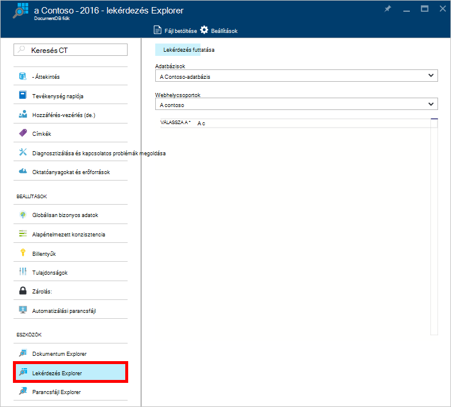
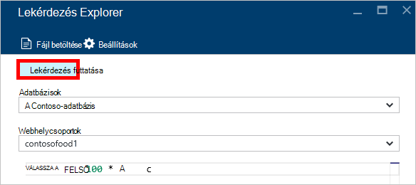
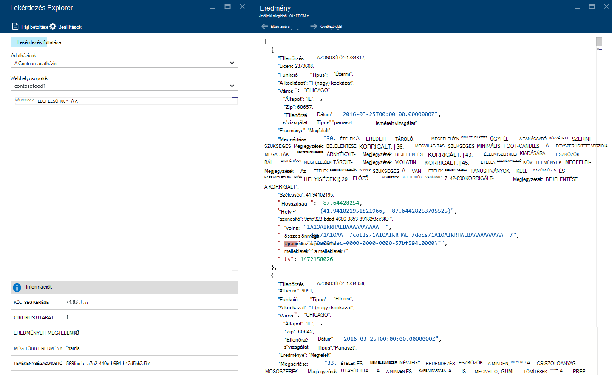
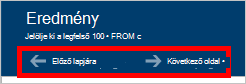
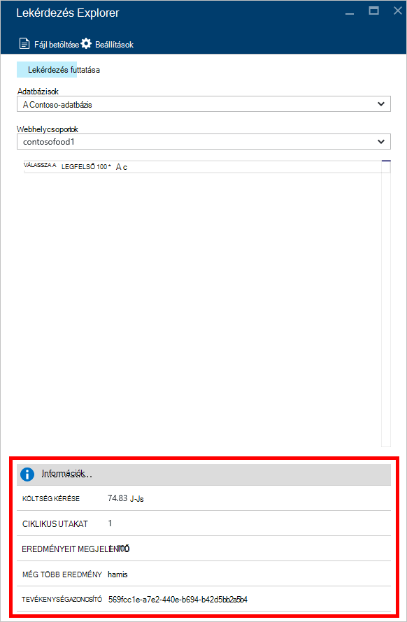
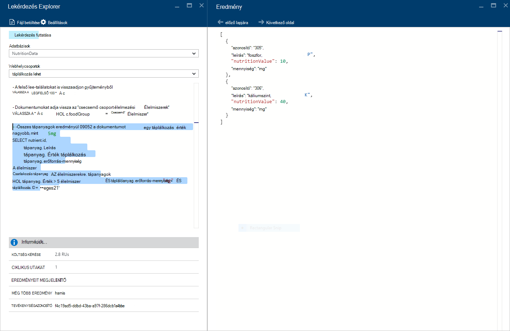
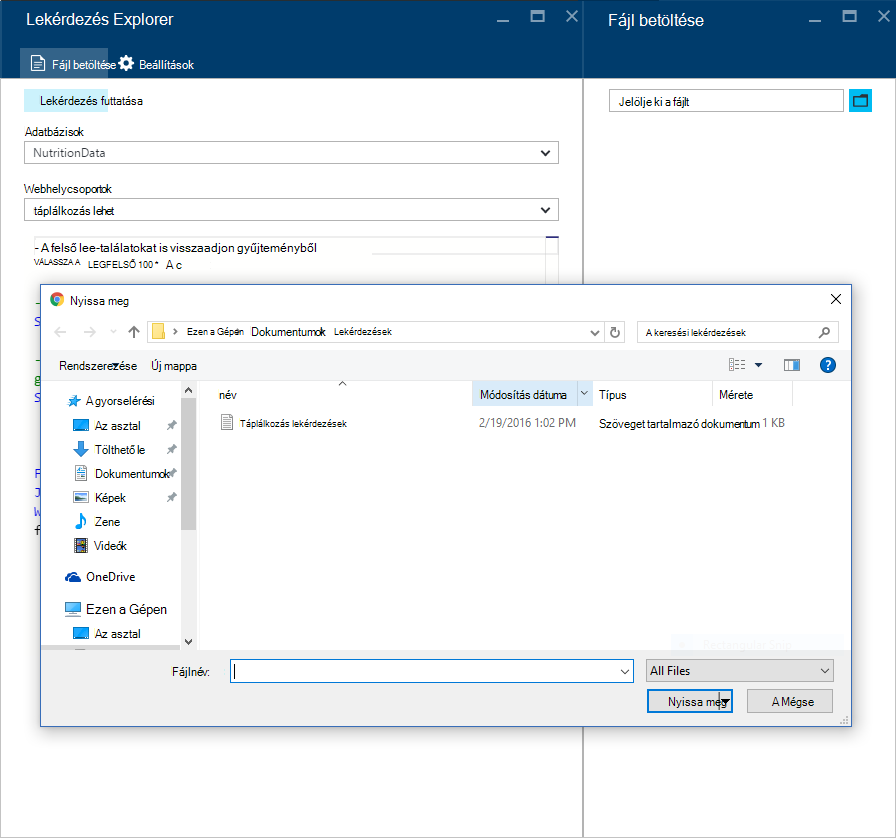
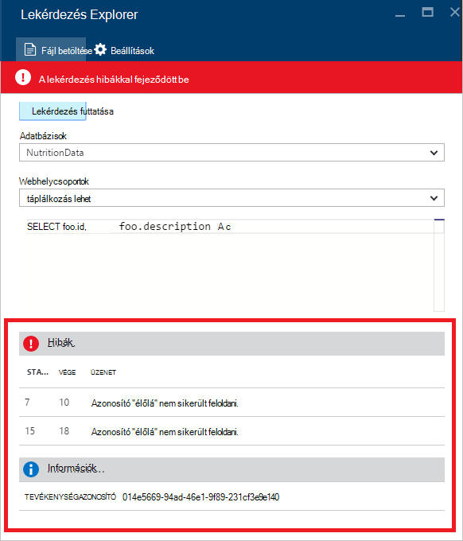

<properties
    pageTitle="Lekérdezés DocumentDB Explorer: Egy SQL Lekérdezésszerkesztő |} Microsoft Azure"
    description="Tudjon meg többet a DocumentDB lekérdezés Intéző egy SQL Lekérdezésszerkesztő az Azure SQL-lekérdezések írása és futó őket egy NoSQL DocumentDB webhelycsoport portálon."
    keywords="sql-lekérdezések sql Lekérdezésszerkesztő írása"
    services="documentdb"
    authors="kirillg"
    manager="jhubbard"
    editor="monicar"
    documentationCenter=""/>

<tags
    ms.service="documentdb"
    ms.workload="data-services"
    ms.tgt_pltfrm="na"
    ms.devlang="na"
    ms.topic="article"
    ms.date="08/30/2016"
    ms.author="kirillg"/>

# Írja be, szerkesztése és a lekérdezés Intézővel DocumentDB SQL-lekérdezések futtatása 

Ez a cikk a [Microsoft Azure DocumentDB](https://azure.microsoft.com/services/documentdb/) lekérdezés Intéző-Azure portál eszköz, amely lehetővé teszi, hogy írása, szerkesztése és SQL-lekérdezések futtatása elleni [DocumentDB webhelycsoport](documentdb-create-collection.md)áttekintést nyújt.

1. Kattintson az Azure portált a Jumpbar, **DocumentDB (NoSQL)**. Ha **DocumentDB (NoSQL)** nem látható, kattintson a **További szolgáltatások** elemre, és válassza a **DocumentDB (NoSQL)**.

2. Az erőforrás menüjében kattintson a **Lekérdezés Explorer**. 

    

3. A **Lekérdezés Explorer** lap jelölje be az **adatbázisok** és **webhelycsoportok** Query a legördülő listák, és írja be a lekérdezés futtatásához. 

    Az **adatbázisok** és **webhelycsoportok** legördülő listák olyan előre megadott attól függően, hogy a környezetben, amelyben a lekérdezés Explorer indítása. 

    Az alapértelmezett lekérdezés `SELECT TOP 100 * FROM c` megadva.  Fogadja el az alapértelmezett lekérdezést, vagy saját lekérdezés [SQL-lekérdezés lap cheat](documentdb-sql-query-cheat-sheet.md) és az [SQL-lekérdezés és SQL-szintaxisa](documentdb-sql-query.md) cikkben ismertetett SQL lekérdezési nyelv használata Egyenletszerkesztővel.

    Az eredmények megtekintéséhez a **lekérdezés futtatása** gombra.

    

4. Az **eredmények** lap jeleníti meg a lekérdezés eredményét. 

    

## Eredmények használata

Alapértelmezés szerint a lekérdezés Explorer eredményt ad a készletben 100.  A lekérdezés 100-nál több eredményt ad, ha egyszerűen csak a **következő oldal** és **Előző oldal** parancsok használatával navigálhat az eredményhalmaz.

A sikeres lekérdezések esetén az **információs** panel tartalmaz mértékek, például a kérelem díjat, a lekérdezés megadása után ciklikus utak megadása az aktuálisan éppen látható eredmények számát, hogy vannak-e több eredményt, majd azok webböngészőn keresztül a **következő oldal** parancs, amely korábban említett

## Több lekérdezés használata

Ha a több lekérdezés használ, és szeretne gyorsan válthat közöttük, minden olyan lekérdezése a **Lekérdezés Explorer** lap lekérdezés szövegmezőjébe írja be, majd jelölje ki az adott, amelyet futtatni szeretne, és válassza a **lekérdezés futtatása** az eredmények megtekintéséhez.

## Lekérdezések felvétele fájlból be a lekérdezés SQL-szerkesztő

A **Fájl betöltése** paranccsal meglévő fájl tartalmának betöltése

## Kapcsolatos hibák elhárítása

Ha lekérdezés végrehajtotta a hibát tartalmazó, a lekérdezés Explorer hibák, amelyek segíthetnek a hibaelhárítást listáját jeleníti meg.

## DocumentDB SQL a portálon kívüli lekérdezések futtatása

A lekérdezés Intéző az Azure-portálon módja a csak egy SQL-lekérdezések futtatása DocumentDB szemben. SQL-lekérdezések a [REST API](https://msdn.microsoft.com/library/azure/dn781481.aspx) - vagy az [ügyfél SDK](documentdb-sdk-dotnet.md)is futtathatja. A más módszerekkel kapcsolatos további tudnivalókért olvassa el a [végrehajtása SQL-lekérdezések](documentdb-sql-query.md#executing-sql-queries) című témakört.

## Következő lépések

Többet szeretne tudni a lekérdezés Intézőben támogatott DocumentDB SQL nyelvhelyesség-ellenőrzés, olvassa el az [SQL-lekérdezés és SQL-szintaxisa](documentdb-sql-query.md) , vagy nyomtassa ki az [SQL-lekérdezés cheat lap](documentdb-sql-query-cheat-sheet.md).
Előfordulhat, hogy is fogják túlságosan nagyra értékelni a [Lekérdezés játszótéri](https://www.documentdb.com/sql/demo) tesztelheti, ahol meg lekérdezések online egy minta adatkészlet kísérletezzen.
