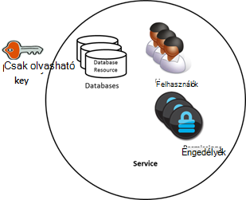
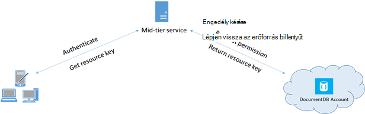

<properties 
    pageTitle="Megtudhatja, hogy miként DocumentDB az adatokhoz való hozzáférés biztonságossá |} Microsoft Azure" 
    description="Tudjon meg többet az access vezérlőelem fogalmak DocumentDB, beleértve a fő kulcsok, a csak olvasható kulcsok, a felhasználók és engedélyek." 
    services="documentdb" 
    authors="kiratp" 
    manager="jhubbard" 
    editor="monicar" 
    documentationCenter=""/>

<tags 
    ms.service="documentdb" 
    ms.workload="data-services" 
    ms.tgt_pltfrm="na" 
    ms.devlang="na" 
    ms.topic="article" 
    ms.date="09/19/2016" 
    ms.author="kipandya"/>

# DocumentDB adatokhoz való hozzáférés biztonságossá tétele

Ez a cikk a [Microsoft Azure DocumentDB](https://azure.microsoft.com/services/documentdb/)tárolt adatokhoz való hozzáférés biztonságossá tétele áttekintést nyújt.

Az áttekintés elolvasása, után is az alábbi kérdésekre választ:  

-   Mik azok a DocumentDB fő billentyűk?
-   Mik azok a csak olvasható billentyűk DocumentDB?
-   Mik azok a DocumentDB erőforrás tokenek?
-   Hogyan használhatok DocumentDB felhasználók és engedélyek DocumentDB adatokhoz való hozzáférés biztonságossá?

## DocumentDB access vezérlőelem fogalmak

DocumentDB első osztályú fogalmat is tartalmaz, annak érdekében, hogy DocumentDB erőforrások való hozzáférés szabályozása.  Ez a témakör az alkalmazásában DocumentDB erőforrások csoportosított két kategóriába sorolhatók:

- Felügyeleti erőforrások
    - Fiók
    - Adatbázis
    - Felhasználói
    - Engedély
- Alkalmazás-erőforrások
    - Webhelycsoport
    - Ajánlat
    - Dokumentum
    - Melléklet
    - Tárolt eljárás
    - Eseményindító
    - Felhasználó által definiált függvény

Az alábbi két kategóriába környezetben, a DocumentDB háromféle hozzáférési vezérlő personas támogatja: rendszergazda, a csak olvasható rendszergazdai és az adatbázis-felhasználói fiók.  Az egyes access vezérlő személyek neve engedélyeit a következők:
 
- Rendszergazdai fiók: a teljes hozzáférés az összes (felügyeleti és alkalmazást) az adott DocumentDB számla belüli erőforrásokat.
- Csak olvasható rendszergazda: csak olvasható hozzáféréssel közzétenni, az összes erőforrás (felügyeleti és az adott DocumentDB számla belüli alkalmazást. 
- Adatbázis-felhasználói: A DocumentDB felhasználói erőforrás egy meghatározott DocumentDB adatbázis erőforrások (pl. gyűjtemények, dokumentumok, parancsfájlok) tartozó.  Lehet egy vagy több felhasználó erőforrás adott adatbázis társított, és minden felhasználó erőforrás lehet, hogy egy vagy több engedélyekkel társítva.

A fent említett kategóriákat és erőforrások szem előtt a hozzáférés-vezérlési DocumentDB modell háromféle hozzáférési szerkezeteket határozza meg:

- Diaminta kulcsok: DocumentDB fiók létrehozás után két fő kulcs (elsődleges és másodlagos) jönnek létre.  Ezek a billentyűparancsok a DocumentDB számla belüli összes erőforrás teljes rendszergazdai hozzáférés engedélyezése.

- Csak olvasható kulcsok: DocumentDB fiók létrehozás után (elsődleges és másodlagos) két csak olvasható billentyűk jönnek létre.  Billentyűk csak olvasási hozzáférést biztosít a DocumentDB számla belüli összes erőforrás a.

- Erőforrás tokenek: egy erőforrás token DocumentDB jogosultsági erőforrás társított és rögzíti a kapcsolatot a felhasználót az adatbázis és a jogosultsági között az adott felhasználó rendelkezik egy adott DocumentDB alkalmazás erőforrás (például a gyűjteményben, a dokumentum).

## Diaminta és a csak olvasható billentyűk DocumentDB használata

Korábban említett DocumentDB fő billentyűk egy DocumentDB számla belüli összes erőforrás teljes rendszergazdai hozzáférést biztosít, miközben csak olvasható billentyűk engedélyezése a számla belüli összes erőforrás olvasási hozzáférést.  A következő kódrészletet szemlélteti, hogyan kell DocumentDB fiók végpont és diaminta billentyű használatával hozható létre egy DocumentClient, és hozzon létre új adatbázist. 

    //Read the DocumentDB endpointUrl and authorization keys from config.
    //These values are available from the Azure Classic Portal on the DocumentDB Account Blade under "Keys".
    //NB > Keep these values in a safe and secure location. Together they provide Administrative access to your DocDB account.
    
    private static readonly string endpointUrl = ConfigurationManager.AppSettings["EndPointUrl"];
    private static readonly SecureString authorizationKey = ToSecureString(ConfigurationManager.AppSettings["AuthorizationKey"]);
        
    client = new DocumentClient(new Uri(endpointUrl), authorizationKey);
    
    // Create Database
    Database database = await client.CreateDatabaseAsync(
        new Database
        {
            Id = databaseName
        });

## Erőforrás-tokenek DocumentDB áttekintése

Egy erőforrás token használható (létrehozásával DocumentDB felhasználók és engedélyek) amikor kívánt ügyfélre, amely nem a fő kulccsal megbízható DocumentDB fiókban erőforrások hozzáférést biztosít. A DocumentDB fő billentyűkkel is, amelyek a fiókját, és az összes benne erőforrás felügyeleti hozzáférést biztosít az elsődleges és másodlagos kulcsa tartalmazza. A diaminta kulcsok közzéteszi megnyílik a lehetőségét, rosszindulatú vagy gondatlan használata a fiók. 

Hasonlóképpen DocumentDB csak olvasható billentyűk összes erőforrás - jogosultsági erőforrások, kivéve az olvasási hozzáférést biztosít, természetesen – egy DocumentDB számla belüli, és nem használhatók meghatározott DocumentDB erőforrások finomabb hozzáférést biztosít.

DocumentDB erőforrás tokenek egy biztonságos megoldás, amely lehetővé teszi az olvasási, írja be és törlése az erőforrások szerint az engedélyeket, és a diaminta vagy az olvasási csak a fontosabb nélkül DocumentDB fiókban ügyfelek biztosítanak.

Íme egy tipikus tervezés mintázatot, amellyel erőforrás tokenek előfordulhat, hogy végrehajtásához szükséges, hozza létre és ügyfelek kézbesítve:

1. Közép réteg szolgáltatás beállításai a felhasználói fényképek megosztása mobilalkalmazás szolgálnak.
2. A közép réteg szolgáltatás a diaminta billentyűt a DocumentDB fiók rendelkezik.
3. A fénykép-alkalmazás telepítve van a végfelhasználói mobileszközökön. 
4. Bejelentkezés, kattintson a fénykép alkalmazás a felhasználó a réteg midsize szolgáltatással hoz létre. Ez az eljárás azonosító létrehozása esetén a pusztán esztétikai célokból az alkalmazást.
5. Miután az identitás létrejött, a közép réteg szolgáltatás kéri az engedélyek adatai alapján.
6. A közép réteg szolgáltatás egy erőforrás token elküldi a telefonos alkalmazásban.
7. A telefonos alkalmazásban továbbra is használhatja az erőforrás jogkivonathoz kattintva közvetlenül DocumentDB forrásokat az erőforrás jogkivonat, és az intervallum megengedi, az erőforrás jogkivonathoz definiált engedélyekre. 
8. Amikor lejár az erőforrás jogkivonat, ezután valaki kap egy 401 jogosulatlan kivételt.  Ezen a ponton a telefonos alkalmazásban ismét létrehozza az identitás, és egy új erőforrás token kéri.

## DocumentDB felhasználók és engedélyek használata
Felhasználói DocumentDB erőforrás rendelve DocumentDB adatbázis.  Adatbázisonként nulla vagy több DocumentDB felhasználók is tartalmazhatnak.  A következő kódrészletet szemlélteti, hogyan hozhat létre felhasználói DocumentDB erőforrás.

    //Create a user.
    User docUser = new User
    {
        Id = "mobileuser"
    };

    docUser = await client.CreateUserAsync(UriFactory.CreateDatabaseUri("db"), docUser);

> [AZURE.NOTE] Minden felhasználónak DocumentDB használt a felhasználó társítandó jogosultságok listájának beolvasása PermissionsLink tulajdonság.

DocumentDB jogosultsági erőforrás rendelve egy DocumentDB felhasználóval.  Minden felhasználó nulla vagy több DocumentDB engedélyeket is tartalmazhatnak.  A jogosultsági erőforrás biztonsági jogkivonat, amely a felhasználónak kell meg az adott alkalmazás erőforrás elérése hozzáférést biztosít.
Van két olyan rendelkezésre álló hozzáférési szinteket, amelyek jogosultsági erőforrás nyújthatja:

- Az összes: A felhasználó az erőforrás teljes körű engedéllyel rendelkezik
- Olvasás: A felhasználó csak olvasható az erőforrás tartalmát, de nem tudja elvégezni az írási, frissítés vagy az erőforrás törlése műveleteket.

> [AZURE.NOTE] DocumentDB futtatásához tárolt eljárások, a felhasználó a tárolt eljárás futtassa a webhelycsoport összes engedéllyel kell rendelkeznie.

A következő kódrészletet hozzon létre egy jogosultsági erőforrást, olvassa el a jogosultsági erőforrás a erőforrás jogkivonat, és az előbb létrehozott felhasználói engedélyek hozzárendelése mutatja.

    // Create a permission.
    Permission docPermission = new Permission
    {
        PermissionMode = PermissionMode.Read,
        ResourceLink = documentCollection.SelfLink,
        Id = "readperm"
    };
            
  docPermission = ügyfél kerülve. CreatePermissionAsync (UriFactory.CreateUserUri ("db", "felhasználó"), docPermission); Console.WriteLine("a(z) (docPermission.Id +" jogkivonata tartalmaz: "+ docPermission.Token);
  
Ha megadott egy partíciót kulcsot a gyűjteményben, majd a webhelycsoport engedéllyel, a dokumentumok és a melléklet erőforrások tartalmaznia kell a mellett a ResourceLink ResourcePartitionKey.

Annak érdekében, hogy egy felhasználó társított összes engedély erőforrás egyszerűen beszerzéséhez DocumentDB tesz elérhetővé jogosultsági hírcsatorna minden felhasználó objektum.  A következő kódrészletet szemlélteti, hogyan lehet beolvasni a társított az előbb létrehozott felhasználói engedélyt, a jogosultsági listát, és a hozható létre egy új DocumentClient a felhasználó nevében.

    //Read a permission feed.
    FeedResponse<Permission> permFeed = await client.ReadPermissionFeedAsync(
      UriFactory.CreateUserUri("db", "myUser"));

    List<Permission> permList = new List<Permission>();
      
    foreach (Permission perm in permFeed)
    {
        permList.Add(perm);
    }
            
    DocumentClient userClient = new DocumentClient(new Uri(endpointUrl), permList);

> [AZURE.TIP] Erőforrás egy az 1 órás alapértelmezett érvényes időszak lehet.  Élettartam, azonban előfordulhat, hogy kifejezetten megadni, maximum 5 óra.

## Következő lépések

- Többet szeretne tudni a DocumentDB, kattintson [ide](http://azure.com/docdb).
- Fő vagy a csak olvasható kezelésével kapcsolatos további tudnivalókért kattintson [ide](documentdb-manage-account.md).
- Megtudhatja, hogy miként DocumentDB engedélyezési tokenek létrehozásához, kattintson [ide](https://msdn.microsoft.com/library/azure/dn783368.aspx)
 
