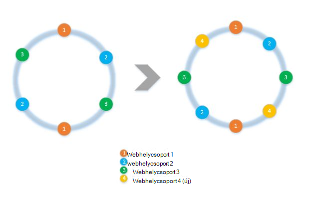
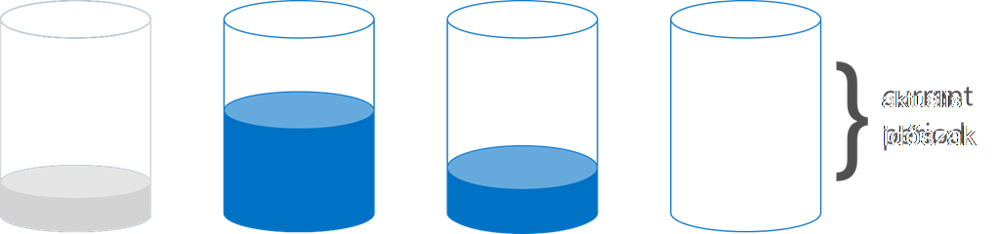

<properties 
    pageTitle="Ügyfél oldalán a SDK a szétválasztás megvalósításáról |} Microsoft Azure" 
    description="Megtudhatja, hogy miként több gyűjtemények az Azure DocumentDB SDK partíciót (shard) adatok és az útvonal kérelmek használata" 
    services="documentdb" 
    authors="arramac" 
    manager="jhubbard" 
    editor="cgronlun" 
    documentationCenter=""/>

<tags 
    ms.service="documentdb" 
    ms.workload="data-services" 
    ms.tgt_pltfrm="na" 
    ms.devlang="na" 
    ms.topic="article" 
    ms.date="10/27/2016" 
    ms.author="arramac"/>

# <a name="how-to-partition-data-using-client-side-support-in-documentdb"></a>Hogyan partíciót adatokhoz ügyféloldali támogatás az DocumentDB

Azure DocumentDB [automatikus gyűjtemények szétválasztás](documentdb-partition-data.md)támogatja. Vannak azonban olyan használata esetekben, ahol előnyös viselkedés szétválasztás finom nyomtatott vezérlésére. Annak érdekében, hogy a tevékenységek szétválasztás szükséges sablonszöveget minden kód csökkentéséhez a .NET, Node.js és Java SDK, amely megkönnyíti az alkalmazások létrehozását ki több gyűjtemények méretezése bővítettük funkciót.

Ez a cikk azt fogja nézze meg az osztályok és a .NET SDK, és hogyan használhatja őket particionált alkalmazások fejlesztéséhez felületek. Más SDK, például a Java, Node.js és Python hasonló módszerek és felületek támogatása ügyféloldali szétválasztás.

## <a name="client-side-partitioning-with-the-documentdb-sdk"></a>A DocumentDB SDK csomagjában talál a szétválasztás ügyféloldali

Mielőtt azt alaposabban meg kívánom szétválasztás, nézzük recap néhány DocumentDB alapfogalmak szétválasztás valamely. Minden Azure DocumentDB adatbázis-fiókot, ahol a egy sor olyan, adatbázisokat több gyűjtemények, amelyek tartalmazhatnak, tárolt eljárások, eseményindítók, UDF, dokumentumokat és kapcsolódó mellékleteket tartalmazó. Webhelycsoportok is legyen egyetlen-partíciót vagy particionált maguk és a következő tulajdonságokat:

- Webhelycsoportok teljesítmény elkülönítési kínálnak. Így nem azonos webhelycsoporton belüli hasonló dokumentumok szétválogatása a teljesítmény előny. Például az idő adatsor, érdemes lehet helyezni az adatokat az elmúlt egy hónapban, gyakran lekérdezett, egy újabb kiépített átviteli a gyűjteményben, mivel a régebbi adatokat felépítése belül az alacsony kiépített átviteli webhelycsoportok számára.
- SAVAS tranzakciók, azaz tárolt eljárások és indítók gyűjtemény nem időtartamát. Egy webhelycsoport belül partíciót fő érték belül tranzakciók korlátozódik.
- Webhelycsoportok nem hivatkozási séma, így a azonos típusú, vagy a különböző típusú JSON dokumentumok használhatók.

Verzió [: az Azure DocumentDB SDK 1.5.x](documentdb-sdk-dotnet.md)kezdve, közvetlenül a adatbázison dokumentum műveleteket végezheti el. A [DocumentClient](https://msdn.microsoft.com/library/azure/microsoft.azure.documents.client.documentclient.aspx) belső használja a megadott PartitionResolver a megfelelő gyűjtemény kérelmek az adatbázist.

>[AZURE.NOTE] Egyszerű használat esetek az ügyféloldali partíciót feloldó megközelítés, [kiszolgálóoldali szétválasztás](documentdb-partition-data.md) REST API-2015-12-16 és SDK 1.6.0+ bevezetett deprecates. Ügyféloldali szétválasztás azonban rugalmasabbá és keresztüli termékkulcsok teljesítmény elkülönítési kezelésére, mértékét párhuzamos szabályozhatja az eredmények olvasásakor több partíciók, és használja a tartomány és térbeli kivonat és összehasonlítása az alábbi módszerek szétválasztás.

A .NET, például a minden PartitionResolver osztály is egy három módszert - [GetPartitionKey](https://msdn.microsoft.com/library/azure/microsoft.azure.documents.client.ipartitionresolver.getpartitionkey.aspx), [ResolveForCreate](https://msdn.microsoft.com/library/azure/microsoft.azure.documents.client.ipartitionresolver.resolveforcreate.aspx) és [ResolveForRead](https://msdn.microsoft.com/library/azure/microsoft.azure.documents.client.ipartitionresolver.resolveforread.aspx)tartalmazó [IPartitionResolver](https://msdn.microsoft.com/library/azure/microsoft.azure.documents.client.ipartitionresolver.aspx) felületet konkrét végrehajtását. LINQ lekérdezések és ReadFeed Iterátornak módszert a ResolveForRead belső az ismétlés a gyűjtemények, amelyek megegyeznek a partíciót kulcsot a kérést. Hasonlóképpen létrehozása és irányítja a ResolveForCreate módszer létrehoz, hogy a megfelelő partíciót műveletek használata. Nem kötelező, a csere módosul, törlése, és olvassa el, mivel azok a dokumentumok, amely már tartalmaz a megfelelő gyűjtemény hivatkozás használni.

A SDK is tartalmaz, amelyek támogatják a két kanonikus particionáló technikák, a kivonatolás és a tartomány keresések egy [HashPartitionResolver](https://msdn.microsoft.com/library/azure/microsoft.azure.documents.partitioning.hashpartitionresolver.aspx) és egy [RangePartitionResolver](https://msdn.microsoft.com/library/azure/mt126047.aspx)két osztály. Ezek az osztályok segítségével egyszerűen particionálási logika hozzáadása az alkalmazáshoz.  

## <a name="add-partitioning-logic-and-register-the-partitionresolver"></a>Particionáló logikát épít, és a PartitionResolver regisztrálása 

Az alábbiakban a hozzon létre egy [HashPartitionResolver](https://msdn.microsoft.com/library/azure/microsoft.azure.documents.partitioning.hashpartitionresolver.aspx) és az adatbázis DocumentClient regisztrálása ábrázoló kódtöredékének.

```cs
// Create some collections to partition data.
DocumentCollection collection1 = await client.CreateDocumentCollectionAsync(...);
DocumentCollection collection2 = await client.CreateDocumentCollectionAsync(...);

// Initialize a HashPartitionResolver using the "UserId" property and the two collection self-links.
HashPartitionResolver hashResolver = new HashPartitionResolver(
    u => ((UserProfile)u).UserId, 
    new string[] { collection1.SelfLink, collection2.SelfLink });

// Register the PartitionResolver with the database.
this.client.PartitionResolvers[database.SelfLink] = hashResolver;

```

## <a name="create-documents-in-a-partition"></a>A partíciók dokumentumok létrehozása  

Miután regisztrálta a PartitionResolver, hajthatja végre hoz létre, és közvetlenül a adatbázison lekérdezések alább látható módon. Ebben a példában a SDK használja a PartitionResolver bontsa ki a felhasználóazonosító, kivonat azt, és ez az érték és a megfelelő webhelycsoport létrehozása művelet irányítja.

```cs
Document johnDocument = await this.client.CreateDocumentAsync(
    database.SelfLink, new UserProfile("J1", "@John", Region.UnitedStatesEast));
Document ryanDocument = await this.client.CreateDocumentAsync(
    database.SelfLink, new UserProfile("U4", "@Ryan", Region.AsiaPacific, UserStatus.AppearAway));
```

## <a name="create-queries-against-partitions"></a>Partíciót lekérdezéseket létrehozása  

Az adatbázisban lévő és partíciót kulcs átadása által [CreateDocumentQuery](https://msdn.microsoft.com/library/azure/microsoft.azure.documents.linq.documentqueryable.createdocumentquery.aspx) módszerrel is lekérdezhetők. A lekérdezés minden gyűjtemények belül az adatbázist, amely a partíciót kulcs megfeleltetése egyetlen eredményhalmazt ad vissza.  

```cs
// Query for John's document by ID - uses PartitionResolver to restrict the query to the partitions 
// containing @John. Again the query uses the database self link, and relies on the hash resolver 
// to route the appropriate collection.
var query = this.client.CreateDocumentQuery<UserProfile>(
    database.SelfLink, null, partitionResolver.GetPartitionKey(johnProfile))
    .Where(u => u.UserName == "@John");
johnProfile = query.AsEnumerable().FirstOrDefault();
```

## <a name="create-queries-against-all-collections-in-the-database"></a>Az összes webhelycsoportjában lekérdezéseket létrehozása az adatbázisban 

Is a lekérdezés az adatbázisban lévő összes webhelycsoportjában és az eredményeket, az alábbi szerinti kihagyása a partíciót kulcs argumentum számbavétele.

```cs
// Query for all "Available" users. Here since there is no partition key, the query is serially executed 
// across each partition/collection and returns a single result-set. 
query = this.client.CreateDocumentQuery<UserProfile>(database.SelfLink)
    .Where(u => u.Status == UserStatus.Available);
foreach (UserProfile activeUser in query)
{
    Console.WriteLine(activeUser);
}
```

## <a name="hash-partition-resolver"></a>Partition feloldó kivonat
A szétválasztás kivonat, partíciót kapnak az érték, a kivonat függvény, amivel egyenletes elosztása partíciót számos kérések és az adatok alapján. Ezt a megközelítést gyakran használatos partíciót adatok darab termék készült különböző ügyfelek nagyszámú az elfogyasztott és akkor hasznos, ha a felhasználói profilok katalógustételek és IoT ("internetes a dolog, amit") telemetriai adatokat tárolja. Kivonat szétválasztás DocumentDB a kiszolgálóoldali particionáló támogatási szolgálat belül egy webhelycsoport is használják.

**Kivonat particionálására:**


Egy egyszerű kivonat séma szétválasztás gyűjtemények *N* keresztül lenne minden dokumentum készítése, *hash(d) mod N* határozza meg, mely akkor helyezte webhelycsoport számítja ki. De ez az egyszerű eljárás probléma, hogy nem működik jól, ha új webhelycsoportok hozzáadása vagy eltávolítása a webhelycsoportok, ez az első reshuffled szinte minden adat lenne szükség szerint. [Egységes kivonatolás] (http://citeseerx.ist.psu.edu/viewdoc/summary?doi=10.1.1.23.3738) során hozzáadásáról és eltávolításáról a webhelycsoportok szükséges adatokat mozgását mennyiségét a lehető legkevesebb ujjlenyomat séma bevezetésével már rendelkezik ezzel a jól ismert algoritmus.

A [HashPartitionResolver](https://msdn.microsoft.com/library/azure/microsoft.azure.documents.partitioning.hashpartitionresolver.aspx) osztály logika egységes kivonat gyűrű össze a kivonat függvény a megadott [IHashGenerator](https://msdn.microsoft.com/library/azure/microsoft.azure.documents.partitioning.ihashgenerator.aspx) felületén keresztül hajtja végre. Alapértelmezés szerint a HashPartitionResolver egy MD5 kivonat függvényt használja, de ezt meg saját ujjlenyomat végrehajtásával válthat. A HashPartitionResolver belső hoz létre 16 tiltva vagy a "virtuális található csomópontok" a kivonat kicsengetés, az egyes egységesebb terjesztési, a dokumentumok elérése végig a gyűjtemények, de ennek a számnak ki az ügyfél egymás kiszámítása mennyiségű adat ferdeségét kereskedelmi eltérő lehet.

**Egységes kivonatolás HashPartitionResolver:**


## <a name="range-partition-resolver"></a>Tartomány partíciót feloldó

A tartomány szétválasztás, partíciót kapnak alapján, hogy a partíciót billentyűt egy bizonyos tartományba esik. Ez általában arra használják a szétválasztás idő bélyegző tulajdonságok (például eventTime 2015 ápr 1 és 2015 ápr 14 között). A [RangePartitionResolver](https://msdn.microsoft.com/library/azure/mt126047.aspx) osztály segít, hogy a tartományba eső megfeleltetés karbantartása\<T\> és a webhelycsoport önálló hivatkozás. 

[Tartomány\<T\> ](https://msdn.microsoft.com/library/azure/mt126048.aspx) egy egyszerű eredetű tartományokat, amely az IComparable bármilyen típusú kezelő\<T\> és IEquatable\<T\> karakterláncok és a számok hasonló. A beolvassa, és hoz létre, átviheti bármilyen tetszőleges tartomány, és a feloldó jelölt gyűjtemények azonosítja az tartományokat a partíciók, amelyek metszik egymást a kért cellatartomány azonosításával. Ez a funkció akkor lehet hasznos, tartomány lekérdezéseket idő adatsor végrehajtásakor.

**Tartomány szétválasztás:**  

  

A tartomány szétválasztás speciális eset esetén a tartomány csak egyetlen különálló értéket, más néven "Keresés szétválasztás". Ez általában arra használják (például a Skandinávia partíciót tartalmaz Norvégia, Dánia és svédországi) régió szerint szétválasztás vagy szétválasztás bérlők több bérlői alkalmazásban.

## <a name="samples"></a>A minták 

Ajánljuk figyelmébe az [DocumentDB szétválasztás minták Github project](https://github.com/Azure/azure-documentdb-dotnet/tree/287acafef76ad223577759b0170c8f08adb45755/samples/code-samples/Partitioning) tartalmazó kódtöredék használja az alábbi PartitionResolvers és kiterjesztése őket a saját névfeloldók használata bizonyos esetekben az alábbihoz hasonló igazítása végrehajtásához: 

* Hogyan tetszőleges lambda kifejezés megadása GetPartitionKey particionáló összetett kulcsok végrehajtása, illetve különböző típusú objektumok eltérő partition vele.
* Bemutatja, hogyan hozhat létre egy egyszerű [LookupPartitionResolver](https://github.com/Azure/azure-documentdb-dotnet/blob/287acafef76ad223577759b0170c8f08adb45755/samples/code-samples/Partitioning/Partitioners/LookupPartitionResolver.cs) használó kézi keresési tábla szétválasztás végrehajtásához. A minta általában arra használják a szétválasztás, például a régió, a bérlői azonosító vagy az alkalmazás különálló értékek alapján nevét.
* Hogy hozhatók létre, amely hoz létre, amely definiálja egy elnevezési színsémát, IndexingPolicy és tárolt eljárások, új webhelycsoportok ellen regisztrálását kell sablon alapján automatikusan gyűjtemények [ManagedPartitionResolver](https://github.com/Azure/azure-documentdb-dotnet/blob/287acafef76ad223577759b0170c8f08adb45755/samples/code-samples/Partitioning/Partitioners/ManagedHashPartitionResolver.cs) .
* Hogy hozhatók létre az Office-téma nélküli [SpilloverPartitionResolver](https://github.com/Azure/azure-documentdb-dotnet/blob/287acafef76ad223577759b0170c8f08adb45755/samples/code-samples/Partitioning/Partitioners/SpilloverPartitionResolver.cs) , amely egyszerűen hoz létre új webhelycsoportok, mint a régi gyűjtemények töltse.
* Hogyan szerializálni deszerializálni JSON, mint a PartitionResolver állapotát, így megoszthatók leállás és folyamatok között. Ezek a config fájlokat, vagy akár DocumentDB gyűjtemény is megmarad.
* Dinamikusan hozzáadása és particionálva adatbázishoz partíciók eltávolítása egy [DocumentClientHashPartitioningManager](https://github.com/Azure/azure-documentdb-dotnet/blob/287acafef76ad223577759b0170c8f08adb45755/samples/code-samples/Partitioning/Util/DocumentClientHashPartitioningManager.cs) osztálya alapján egységes kivonatolás. Belső egy [TransitionHashPartitionResolver](https://github.com/Azure/azure-documentdb-dotnet/blob/287acafef76ad223577759b0170c8f08adb45755/samples/code-samples/Partitioning/Partitioners/TransitionHashPartitionResolver.cs) való átirányításához olvasás használ, és írja a közül négy módok – a régi particionáló rendszerből származó (ReadCurrent), az újba olvassa el az áttelepítés során (ReadNext), mindkét (ReadBoth) kapott eredmények egyesítése vagy nem érhető el (nincs) áttelepítés során.

A minták Megnyitás és javasoljuk, hogy ki kérések az adományok, amely a többi DocumentDB fejlesztők kihasználhatók elküldéséhez. Olvassa el szeretné küldeni a találhat a [hozzájárulása irányelveket](https://github.com/Azure/azure-documentdb-net/blob/master/Contributing.md) .  

>[AZURE.NOTE] Webhelycsoport létrehozása ráta-függvényében korlátozva van DocumentDB, így az itt ismertetett minta módszerek közül is eltarthat néhány percig is.

##<a name="faq"></a>GYAKORI KÉRDÉSEK
**DocumentDB támogatja a kiszolgálóoldali szétválasztás?**

Igen, a DocumentDB támogatja a [kiszolgálóoldali szétválasztás](documentdb-partition-data.md). DocumentDB is támogatja az ügyféloldali szétválasztás ügyféloldali partíciót névfeloldók speciális használata az esetek keresztül.

**Mikor érdemes használni a kiszolgálóoldali vagy ügyféloldali szétválasztás?**
A legtöbb esetben használata ajánlott a kiszolgálóoldali szétválasztás, mivel a felügyeleti feladatokat a szétválasztás adatokat, és a továbbítás kérések kezeli használatát. Jó helyen jár Ha meg kell tartományt a szétválasztás vagy partíciót kulcsok különböző értékek közötti teljesítmény leválasztáshoz speciális használati eset, majd ügyféloldali szétválasztás valószínűleg a legjobb megközelítés.

**Hogyan hozzáadása vagy eltávolítása egy webhelycsoport a particionáló színösszeállításra?**

Nézze meg a minták projekt DocumentClientHashPartitioningManager végrehajtásának újraparticionálást megvalósítása hogyan példát.

**Hogyan továbbra is fennáll, illetve a particionáló konfigurációs megosztása más ügyfelekkel?**

A JSON partitioner állapotban szerializálni, és tárolása a konfigurációs fájlokat, vagy még DocumentDB gyűjtemények belül. Nézze meg a RunSerializeDeserializeSample módszer a minták projekt példát.

**Hogyan lehet lánc különböző particionáló technikákat?**

A saját IPartitionResolver egy vagy több meglévő névfeloldók belső használó bevezetésével PartitionResolvers fűzhetők össze. Nézze meg TransitionHashPartitionResolver a minták projekt példát.

##<a name="references"></a>Hivatkozások
* [Kiszolgálóoldali DocumentDB a szétválasztás](documentdb-partition-data.md)
* [DocumentDB webhelycsoportjában és a teljesítmény szintek](documentdb-performance-levels.md)
* [A Github mintakódok szétválasztás](https://github.com/Azure/azure-documentdb-dotnet/tree/287acafef76ad223577759b0170c8f08adb45755/samples/code-samples/Partitioning)
* [DocumentDB .NET SDK dokumentációt a az MSDN webhelyen](https://msdn.microsoft.com/library/azure/dn948556.aspx)
* [DocumentDB .NET minták](https://github.com/Azure/azure-documentdb-net)
* [DocumentDB korlátai](documentdb-limits.md)
* [Tippek a teljesítményre gyakorolt DocumentDB-Blog](https://azure.microsoft.com/blog/2015/01/20/performance-tips-for-azure-documentdb-part-1-2/)
 
