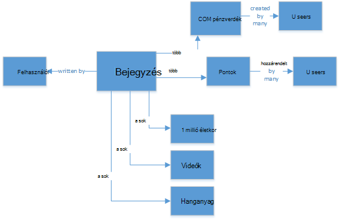
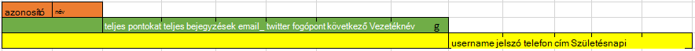
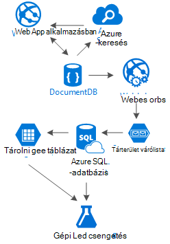

<properties 
    pageTitle="DocumentDB tervezés mintát: közösségi hálózat-alkalmazások |} Microsoft Azure" 
    description="Információ a tervezés mintát közösségi hálózatok feljebb helyezése a tárhely rugalmasság DocumentDB és más Azure szolgáltatások." 
    keywords="közösségi hálózat alkalmazások"
    services="documentdb" 
    authors="ealsur" 
    manager="jhubbard" 
    editor="" 
    documentationCenter=""/>

<tags 
    ms.service="documentdb" 
    ms.workload="data-services" 
    ms.tgt_pltfrm="na" 
    ms.devlang="na" 
    ms.topic="article" 
    ms.date="09/27/2016" 
    ms.author="mimig"/>

# Közösségi DocumentDB az Áttekintés

Egy nagymértékben összekapcsolt társasága élő, az azt jelenti, hogy bizonyos pontján életben, részévé válik a **közösségi hálózati**. Kapcsolattartás barátok, a munkatársak, a család, illetve néha oszthat meg a golgotavirág közös érdeklődési a közösségi hálózatok használjuk.

A mérnökök vagy a fejlesztők azt előfordulhat, hogy van testreszabásakor nem tudta, hogyan hajtsa végre ezeket a hálózatokat tárolása és összekapcsolására az adatokat, vagy előfordulhat, hogy van még lett szolgáltatásait hozhat létre, vagy egy adott árkategóriájú piacra szánt új közösségi hálózat yourselves tervezővel. Az alábbi esetekben felmerül a nagy kérdés: hogyan ezeket az adatokat tárolja?

Tegyük fel, hogy azt egy új, csillogó közösségi hálózaton, ahol a a felhasználók tartalmakat például képek, videók és más páros zenét kapcsolódó médiával cikkek is készítenek. A felhasználók megjegyzések hozzáfűzése a bejegyzések és minősítések pontok másoknak. A hírcsatorna bejegyzéseinek felhasználóknál megjelenő lesz, és tud majd kommunikálni a fő webhely érkezési lapon. Ez nem igazán összetett hang (az első), de az egyszerűség kedvéért vegyük le van (azt az egyéni felhasználói hírcsatornák kapcsolatok által érintett elmélyedhet sikerült, de a munkafüzet meghalad a cél, a jelen cikk).

Igen hogyan végezze el az Ön által tároljuk ez, és hol?

Számos, előfordulhat, hogy rendelkezik élmény a SQL-adatbázisait vagy legalább [relációs adatok modellezése](https://en.wikipedia.org/wiki/Relational_model) fogalma, és előfordulhat, hogy a kísértésbe elindítani a rajz az alábbihoz hasonló:

 

Egy tökéletesen normalizált és közérthető adatstruktúra... amely nem méretezze át. 

Nem érkeznek én lehet akivel korábban dolgozott SQL-adatbázisok minden saját leírási_idő, remek, de minden mintát, a gyakorlás és a szoftver platform, például még nem minden esetben a tökéletes történt.

Miért nem SQL ebben az esetben a legjobb választás? Lássunk egy egyszeri bejegyzésbe felépítésének lehet volna volna van lekérdezés az egy webhely vagy az alkalmazás, a bejegyzés megjelenítése … 8 JOIN (!) közvetlenül egy egyetlen bejegyzést, most dinamikusan betöltött, és megjelennek a képernyőn, és a bejegyzéseket adatfolyam jelenhet meg, hol fogom kép megjelenítéséhez.

Azt is, természetesen használata xy SQL-példány elég power oldhatja meg a tartalmat, de nagyon jól, miért azt szeretné, ha egyszerűbb megoldást létezik szolgáló ezek sok illesztésekkel lekérdezések ezer?

## NoSQL útközben

Vannak olyan speciális graph adatbázisokra, amelyek [Azure futtatását](http://neo4j.com/developer/guide-cloud-deployment/#_windows_azure) is, de nem olcsók, és a szükséges IaaS services (infrastruktúra-mint-a-szolgáltatás, virtuális gépeken futó főként) és karbantartás kategóriát. Ez a cikk alsó költség megoldást, amelyek együttműködnek a célt Azure-féle NoSQL adatbázis [DocumentDB](https://azure.microsoft.com/services/documentdb/)futó találatokkal fogom. [NoSQL](https://en.wikipedia.org/wiki/NoSQL) megközelítés, adatok tárolására JSON formátumban és [denormalization](https://en.wikipedia.org/wiki/Denormalization), használja a korábban bonyolult bejegyzés egyetlen [dokumentum](https://en.wikipedia.org/wiki/Document-oriented_database)konvertálhatók:

    {
        "id":"ew12-res2-234e-544f",
        "title":"post title",
        "date":"2016-01-01",
        "body":"this is an awesome post stored on NoSQL",
        "createdBy":User,
        "images":["http://myfirstimage.png","http://mysecondimage.png"],
        "videos":[
            {"url":"http://myfirstvideo.mp4", "title":"The first video"},
            {"url":"http://mysecondvideo.mp4", "title":"The second video"}
        ],
        "audios":[
            {"url":"http://myfirstaudio.mp3", "title":"The first audio"},
            {"url":"http://mysecondaudio.mp3", "title":"The second audio"}
        ]
    }

És egyetlen lekérdezést, és nincs illesztések szerezhető be. Ez az sokkal több egyszerű és egyszerű, és kevesebb erőforrást a legjobb eredmény eléréséhez szükséges budget-wise.

Azure DocumentDB ellenőrzi, mind az tulajdonságokat az [Automatikus indexelés](documentdb-indexing.md), amelyek segítségével még az indexelt kell [testre szabott](documentdb-indexing-policies.md). A séma ingyenes megközelítés lehetővé teszi, hogy velünk a dokumentumok tárolása a különböző és dinamikus struktúrák, esetleg holnap bejegyzések listáját, a kategóriák és a velük társított hashtags szeretnénk, DocumentDB nincs szükség szerint us további munkahelyi fogja kezelni a hozzáadott attribútumokkal rendelkező új dokumentumokat.

A bejegyzés megjegyzések egy szülő-tulajdonság (Ez egyszerűbbé teszi a objektum megfeleltetés) csak más bejegyzések is kell kezelni. 

    {
        "id":"1234-asd3-54ts-199a",
        "title":"Awesome post!",
        "date":"2016-01-02",
        "createdBy":User2,
        "parent":"ew12-res2-234e-544f"
    }

    {
        "id":"asd2-fee4-23gc-jh67",
        "title":"Ditto!",
        "date":"2016-01-03",
        "createdBy":User3,
        "parent":"ew12-res2-234e-544f"
    }

És az összes közösségi funkciók másként számláló tárolhatók külön objektum:

    {
        "id":"dfe3-thf5-232s-dse4",
        "post":"ew12-res2-234e-544f",
        "comments":2,
        "likes":10,
        "points":200
    }

Hírcsatornák létrehozásához csak egy adott fontossági sorrendbe bejegyzés azonosítóit listájának tárolására szolgáló-dokumentumok létrehozása:

    [
        {"relevance":9, "post":"ew12-res2-234e-544f"},
        {"relevance":8, "post":"fer7-mnb6-fgh9-2344"},
        {"relevance":7, "post":"w34r-qeg6-ref6-8565"}
    ]

A létrehozás dátuma szerint rendezett bejegyzéseinek sikerült "legújabb" adatfolyam van, az adott bejegyzéseinek "hottest" adatfolyam további kedvelések az elmúlt 24 óra, még azt is végrehajtása egy egyéni adatfolyam minden olyan felhasználóhoz, például a követők és érdeklődési logika alapján és továbbra is lenne a bejegyzések listáját. Ezeket a listákat létrehozásának kérdése, de az olvasási teljesítmény marad akadálytalan. Miután azt szerezni egyik ezeket a listákat, azt ki egyetlen lekérdezés DocumentDB beszerzése a bejegyzéseket, oldal egyszerre az [az operátor](documentdb-sql-query.md#where-clause) használata.

A hírcsatorna adatfolyamok sikerült beépített [Azure alkalmazás Services](https://azure.microsoft.com/services/app-service/) háttérfolyamatok használatával: [Webjobs](../app-service-web/web-sites-create-web-jobs.md). A bejegyzés létrehozása után a is [Azure tároló](https://azure.microsoft.com/services/storage/) [sorban várakozó](../storage/storage-dotnet-how-to-use-queues.md) és a használatával [Azure Webjobs SDK](../app-service-web/websites-dotnet-webjobs-sdk.md), a bejegyzés propagálása belül alapuló saját egyéni logika végrehajtási indított Webjobs elindítja háttér feldolgozása. 

Pontok és a bejegyzés alatt a tetszésnyilvánítások használatával ugyanezzel a technikával hozhat létre, végül egységes környezetben elhalasztott módon lehet feldolgozni.

Követők bonyolultabb. DocumentDB méretkorlátja dokumentum 512 KB, hogy ennél a módszernél dokumentumként követői tárolásáról úgy:

    {
        "id":"234d-sd23-rrf2-552d",
        "followersOf": "dse4-qwe2-ert4-aad2",
        "followers":[
            "ewr5-232d-tyrg-iuo2",
            "qejh-2345-sdf1-ytg5",
            //...
            "uie0-4tyg-3456-rwjh"
        ]
    }

Ez a felhasználó néhány ezres működhet követői, de ha bizonyos celebrity csatlakozik az orderby_expression szerint, végül a megközelítés fog találati a dokumentum mérete kap.

Ez megoldására ábrázolásakor a vegyes megközelítés. A felhasználói statisztika dokumentum részeként tároljuk is követői számát:

    {
        "id":"234d-sd23-rrf2-552d",
        "user": "dse4-qwe2-ert4-aad2",
        "followers":55230,
        "totalPosts":452,
        "totalPoints":11342
    }

És követői tényleges ábrázolását tárolható Azure tároló tábla, amely lehetővé teszi, hogy az egyszerű "A következőképpen, B" tárhely és a lekérés [bővítmény](https://github.com/richorama/AzureStorageExtensions#azuregraphstore) használatával. Ebben az esetben azt átadhatja a pontos követői lista (ha szükséges,) Azure tároló tábla, hanem egy rövid számok kereséshez a lekérés folyamat akkor folytassa a DocumentDB.

## A "Sávok" mintát és az adatok másolása

Akkor a JSON-dokumentum, amely a bejegyzés hivatkozik előfordulhat, hogy láthatta, vannak felhasználó többszöri előfordulása. És, akinek van kitalálhatják jobbra, ez azt jelenti, hogy az információkat, amely a felhasználó ezen a denormalization megadott megjelenhetnek egynél több helyen.

Ahhoz, hogy gyorsabban lekérdezések, hogy adatok ismétlődések merülnek fel. A probléma a egymás effektussal még, hogy minden tevékenység keresése szükséges az egyes műveletekhez, a felhasználói adatok módosítását, ha őt minden eddiginél did és frissíteni őket, az összes. Hang nagyon gyakorlati, jobbra nem?

Graph adatbázisok megoldani a saját módon, és bemutatjuk, az alkalmazás minden tevékenység esetében a felhasználó tulajdonságainak kulcs azonosításával megoldására fogjuk. Hogy vizuálisan a bejegyzés jelennek meg az alkalmazást, és csak a készítő neve és a kép megjelenítése, ha miért tárolását összes a felhasználói adatok a "createdBy" attribútum? Az egyes megjegyzésekre azt csak a felhasználó kép megjelenítése, ha nem igazán szükséges be adatokat a többi. Ez a hol lehet hívás "sávok mintát" valami kijelölésen play.

Most tekintsünk át a felhasználói adatok példaként:

    {
        "id":"dse4-qwe2-ert4-aad2",
        "name":"John",
        "surname":"Doe",
        "address":"742 Evergreen Terrace",
        "birthday":"1983-05-07",
        "email":"john@doe.com",
        "twitterHandle":"@john",
        "username":"johndoe",
        "password":"some_encrypted_phrase",
        "totalPoints":100,
        "totalPosts":24
    }
    
Ez az információ megjeleníti, hogy gyorsan észleli fontos információt, amely így létrehozása, amelyek nem, "Sávok":

A legkisebb lépés egy UserChunk, a minimális darab, amely azonosítja a felhasználó neve és az adatok másolásra szolgál. Az ismétlődő adatok méretének csak azokat az információkat, "bemutatjuk" csökkentésével azt az esélye tömeges újdonságai.

A középső név kezdőbetűjét lépés a felhasználó neve, hogy a teljes adatok, a legtöbb teljesítmény-függő lekérdezések DocumentDB, a leggyakrabban használt és kritikus használt. Egy UserChunk jelöli információkat tartalmazza.

A legnagyobb az a bővített felhasználó. Minden kritikus felhasználói adatok és más adatokat, amelyek nem igazán szükséges gyorsan kell olvasni tartalmazza, vagy annak használatát esetleges (például a bejelentkezési folyamatot). Az adatok kívüli DocumentDB Azure SQL-adatbázis vagy az Azure tároló tábla tárolhatók.

Miért kellene azt a felhasználó felosztása és is tárolhatók ezt az információt a különböző helyeken? Mivel [nem végtelen](documentdb-limits.md) DocumentDB a rendelkezésre álló tárterület méretének és a teljesítmény a pont nézet, annál nagyobb a dokumentumok, a costlier lekérdezéseket. Dokumentumok megtartása slim, végezze el a teljesítmény-függő lekérdezéseket a közösségi hálózaton, például teljes profil módosítások bejelentkezések esetleges felhasználási területei más felesleges adatok tárolására, és a használati analitikát, és a nagy adatok kezdeményezések adatok adatbányászati még a megfelelő adatokat. Akkor tényleg mindegy adatok esetén az adatok adatbányászati összegyűjti lassabban, mert a Azure SQL-adatbázis fut, és azt van a következőkre azonban, hogy a felhasználó rendelkezik-e egy gyors és slim élmény. A felhasználó tárolt DocumentDB, így néz ki:

    {
        "id":"dse4-qwe2-ert4-aad2",
        "name":"John",
        "surname":"Doe",
        "username":"johndoe"
        "email":"john@doe.com",
        "twitterHandle":"@john"
    }

És a bejegyzés jelenne meg:

    {
        "id":"1234-asd3-54ts-199a",
        "title":"Awesome post!",
        "date":"2016-01-02",
        "createdBy":{
            "id":"dse4-qwe2-ert4-aad2",
            "username":"johndoe"
        }
    }

És a szerkesztési merül fel, ahol az adattömb attribútumai közül hatással van, amikor a szóban forgó dokumentumok keresésének mutasson az indexelt attribútumok lekérdezések használatával (VÁLASSZA a * FROM bejegyzések p WHERE p.createdBy.id == "edited_user_id") majd frissítse a szövegadattömb.

## A Keresés mező

Felhasználók hoz létre, Szerencsére, sok tartalmat. Azt láthatja biztosítson, amely nem lehet közvetlenül a saját tartalom adatfolyamok, esetleg, mert azt nem hajtsa végre a készítői tartalom kereséssel lehetőséget, és talán azt csak próbál meg, hogy régi bejegyzés azt did 6 hónapja.

Thankfully és használja a Microsoft Azure DocumentDB, mert azt egyszerűen végrehajtása a keresőprogram [Azure keresés](https://azure.microsoft.com/services/search/) használata néhány percet, és egysoros (más, mint a nyilvánvalóan, a keresési folyamat és a felhasználói felület) kód beírása nélkül.

Miért van szó, egyszerűen?

Azure keresési hajtja végre, ezeket hívjuk [Indexelő](https://msdn.microsoft.com/library/azure/dn946891.aspx)és az, hogy az adatok tárházakban található csatlakoztatni háttérfolyamatok és automagically hozzáadása, módosítása, és az objektumok eltávolítása az indexek. Egy [SQL Azure-adatbázis indexelő](https://blogs.msdn.microsoft.com/kaevans/2015/03/06/indexing-azure-sql-database-with-azure-search/), [Azure BLOB-indexelő](../search/search-howto-indexing-azure-blob-storage.md) és thankfully, [Azure DocumentDB indexelő](../documentdb/documentdb-search-indexer.md)támogatják. Az áttűnés DocumentDB adatainak Azure keresés nem túl bonyolult feladat, mindkét áruházból információk JSON formátumban, csak [a tárgymutató](../search/search-create-index-portal.md) létrehozásához szükséges a dokumentumokból mely attribútumok szeretnénk térkép indexelt és, amely szerepel, percek (függ, hogy adatait méretének), a teljes tartalom érhetők el, a legjobb – mint-a-keresőszolgáltatás megoldás a felhőalapú infrastruktúrájának lehet keresni szeretne. 

Az Azure keresési kapcsolatos további tudnivalókért látogassa meg a [keresési Hitchhiker tartozó útmutató](https://blogs.msdn.microsoft.com/mvpawardprogram/2016/02/02/a-hitchhikers-guide-to-search/).

## Az alapul szolgáló ismeretek

A tartalom megnő, és minden nap megnő tárolja, akkor előfordulhat, hogy található ragozott formáival gondolok: mire van lehetőségem az adatok minden követő a felhasználóktól?

A válasz nem túl bonyolult feladat: formában dolgozhat, és ismerje meg, az azt.

De, hogy mit talál? Néhány egyszerű többek között [sentiment elemzés](https://en.wikipedia.org/wiki/Sentiment_analysis), a felhasználói beállítások alapján tartalom javaslatok, vagy akár egy automatizált tartalom moderátori, amely biztosítja, hogy minden olyan tartalom teszi közzé a közösségi hálózati biztonságos a család számára.

Most, hogy e van csatlakoztatva, valószínűleg érdemes lesz szüksége van néhány doktori matematikai tudományos az alábbi minták és egyszerű adatbázisok és fájlok kívül információ kibontásához, de nem megfelelő lenne.

[Azure gépi tanulási](https://azure.microsoft.com/services/machine-learning/), része a [Cortana üzletiintelligencia-csomagot](https://www.microsoft.com/en/server-cloud/cortana-analytics-suite/overview.aspx), a teljes körű felügyelt felhőalapú szolgáltatás, amellyel algoritmusok használata egy egyszerű és húzás felület munkafolyamatok létrehozása a saját algoritmusok, [R](https://en.wikipedia.org/wiki/R_(programming_language)) a kód vagy néhány már beépített és például használatára API-k használata: [Szöveg Analytics](https://gallery.cortanaanalytics.com/MachineLearningAPI/Text-Analytics-2), a [Tartalom moderátori](https://www.microsoft.com/moderator) vagy a [javaslatok](https://gallery.cortanaanalytics.com/MachineLearningAPI/Recommendations-2).

Eléréséhez gépi tanulási forgatókönyvekben közül, hogy [Azure adatok tó](https://azure.microsoft.com/services/data-lake-store/) használatával különböző forrásokból származó információk ingest, és [U-SQL nyelvben](https://azure.microsoft.com/documentation/videos/data-lake-u-sql-query-execution/) segítségével dolgozza fel az adatokat, és olyan eredménye, amely az Azure gépi tanulási feldolgozhatók készítése.

Egy másik érhető el, hogy [Microsoft kognitív szolgáltatások](https://www.microsoft.com/cognitive-services) segítségével a felhasználók tartalmakat; elemzése nem csak azt követően deríthető ki őket jobban (keresztül elemzése mi írják [Szöveg Analytics API](https://www.microsoft.com/cognitive-services/en-us/text-analytics-api)-val), de azt is is észleli a nemkívánatos vagy elért tartalmat, és ennek megfelelően működjön [Számítógép látás API](https://www.microsoft.com/cognitive-services/en-us/computer-vision-api)-val. Kognitív Services ki-be a megoldások, amelyek bármilyen típusú gépi tanulási Tudásbázis használatához nincs szükség sok tartalmazza.

## Elfogadásáról

Ez a cikk próbálja tisztázása néhány az alternatívák létrehozott közösségi hálózatok teljesen Azure alacsony költség szolgáltatásokkal, és nagyszerű eredmények megadásának ösztönzése "Sávok" nevű többszintű tároló megoldás és az adatok eloszlásának e be.

Az igazság, hogy nem az esetek ilyen típusú nincs ezüst listajel, érdemes megfontolni, ha nagyszerű szolgáltatásokat, amelyek lehetővé teszik us remek élményt össze által létrehozott együttműködést: sebességének és Azure DocumentDB megadására remek közösségi alkalmazást, az Azure keresési, például osztályú keresési megoldás mögött üzletiintelligencia szabad Azure alkalmazás szolgáltatások host rugalmasan még a nyelvi-felismerése nélkül alkalmazások, de hatékony háttérfolyamatok és kibontható Azure tárolása és az Azure SQL-adatbázis nagy mennyiségű adatot és ismeretek és intelligenciával kapcsolatos funkciók, amelyek a folyamatok és a Súgó us használhat az előadáshoz a megfelelő tartalmat a megfelelő felhasználók visszajelzést küldhet létrehozása az Azure gépi tanulási analitikus power tárolásához.

## Következő lépések

További tudnivalók a [DocumentDB modellezési adatainak](documentdb-modeling-data.md) cikk olvasásával adatmodellezése. Ha egyéb DocumentDB esetekben használata érdekli, olvassa el a [Gyakori DocumentDB használjon esetekben](documentdb-use-cases.md)című témakört.

Vagy többet szeretne tudni a DocumentDB [DocumentDB tanulási javaslat](https://azure.microsoft.com/documentation/learning-paths/documentdb/)követve.
