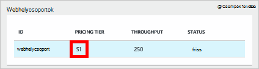
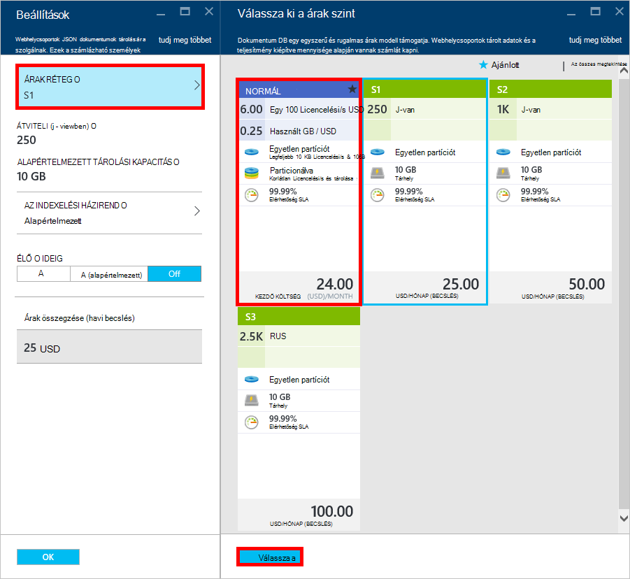
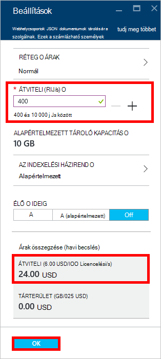
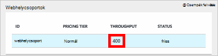

<properties 
    pageTitle="A DocumentDB S1 fiók supercharge |} Microsoft Azure" 
    description="Kihasználhatja nő az átviteli DocumentDB S1 fiókban megváltoztatva néhány egyszerű az Azure-portálon." 
    services="documentdb" 
    authors="mimig1" 
    manager="jhubbard" 
    editor="monicar" 
    documentationCenter=""/>

<tags 
    ms.service="documentdb" 
    ms.workload="data-services" 
    ms.tgt_pltfrm="na" 
    ms.devlang="na" 
    ms.topic="article" 
    ms.date="08/25/2016" 
    ms.author="mimig"/>

# A DocumentDB fiók supercharge

Kövesse ezeket a lépéseket követve kihasználhatja az Azure DocumentDB S1 fiók nagyobb teljesítmény. De külön költség nélkül megnövelheti a saját meglévő S1 fiókjához 250 [Licencelési/s](documentdb-request-units.md) 400 Licencelési/s, vagy több kapacitásának!  

> [AZURE.VIDEO changedocumentdbcollectionperformance]

## A felhasználó által definiált teljesítmény az Azure-portálon módosítása

1. A böngészőben nyissa meg az [**Azure-portálon**](https://portal.azure.com). 
2. Kattintson a **Tallózás** -> **DocumentDB (NoSQL)**, majd jelölje ki a módosítandó DocumentDB-fiókot.   
3. Az **adatbázisok** Lens módjai között jelölje ki a módosítandó az adatbázist, és az **adatbázis** lap, válassza a gyűjtemény a S1 árak réteg.

      

4. A **gyűjtemény** a lap kattintson a **Továbbiak**gombra, és válassza a **Beállítások**.   
5. A **Beállítások** lap a **Réteg árak** gombra, és figyelje meg, hogy az egyes terv havi költségbecslés jelenik meg. A **Válassza ki a árak réteg** lap a **normál**gombra, és kattintson a **Válassza a** mentheti a módosításokat.

      

6. A **Beállítások** lap a **Réteg árak** megfelelően módosul **szabványos** , és a **átviteli (Licencelési/s)** mezőben 400 alapértelmezett érték jelenik meg. Kattintson az **OK gombra** a módosítások mentéséhez. 

    > [AZURE.NOTE] Beállíthatja, hogy a átviteli közötti 400 és 10 000 [egység kérése](../articles/documentdb/documentdb-request-units.md)/second (Licencelési/s). Az **Összefoglaló árak** a lap alján a havi költség becslése megadására automatikusan frissíti.
    
    

8. Jelentkezzen be az **adatbázis** lap ellenőrizheti a feltöltött kapacitásának a webhelycsoport. 

    

A módosításokat, a felhasználó által definiált és előre definiált átviteli kapcsolatos további információkért lásd a a blogbejegyzésből [DocumentDB: az új árak beállításokkal kapcsolatos tudnivalók a szolgáltatás](https://azure.microsoft.com/blog/documentdb-use-the-new-pricing-options-on-your-existing-collections/).

## Következő lépések

Ha úgy dönt, hogy szüksége van további átviteli (nagyobb, mint 10 000 Licencelési/s) vagy további tárterület (10GB-nál nagyobb) particionált gyűjtemény hozhat létre. Particionált gyűjtemény létrehozásához, olvassa el a [egy webhelycsoport létrehozása](documentdb-create-collection.md)című témakört.